# Lyra - 1


---

## Editor
### 快速蓝图类创建
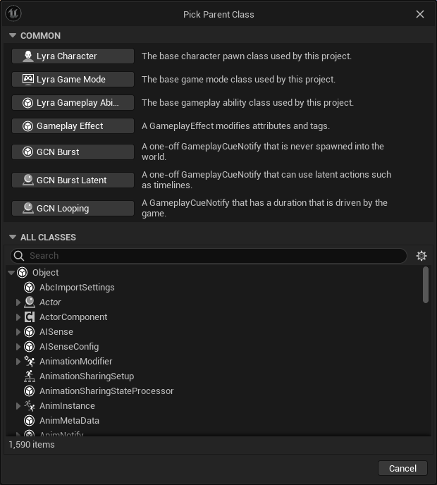
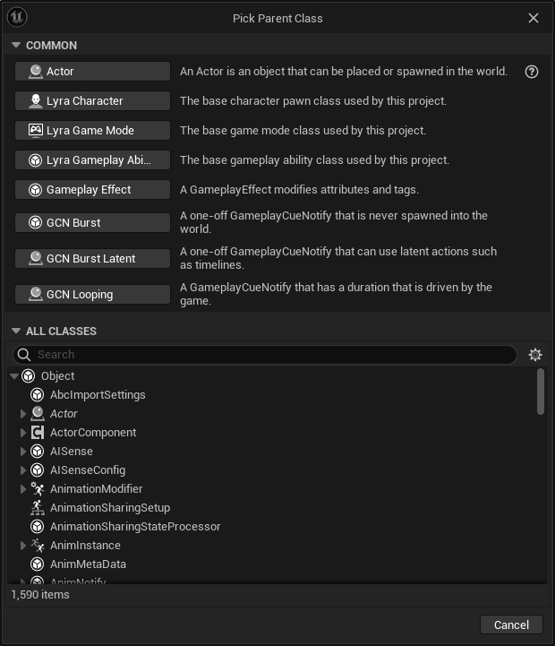


添加一个默认的Actor类型:
```cpp
// LyraStarterGame\Config\DefaultEditor.ini

[/Script/UnrealEd.UnrealEdOptions]
!NewAssetDefaultClasses=ClearArray
+NewAssetDefaultClasses=(ClassName="/Script/LyraGame.LyraCharacter", AssetClass="/Script/Engine.Blueprint")
+NewAssetDefaultClasses=(ClassName="/Script/LyraGame.LyraGameMode", AssetClass="/Script/Engine.Blueprint")

//---------------------------

[/Script/UnrealEd.UnrealEdOptions]
!NewAssetDefaultClasses=ClearArray
+NewAssetDefaultClasses=(ClassName="/Script/Engine.Actor", AssetClass="/Script/Engine.Blueprint")
+NewAssetDefaultClasses=(ClassName="/Script/LyraGame.LyraCharacter", AssetClass="/Script/Engine.Blueprint")
+NewAssetDefaultClasses=(ClassName="/Script/LyraGame.LyraGameMode", AssetClass="/Script/Engine.Blueprint")
```
---
说明:
```cpp
模块
模块中包含的可配置对象的分段标题使用以下语法：

[/Script/ModuleName.ClassName]

其中：
ModuleName：包含可配置对象的模块的名称。
ClassName：ModuleName 模块中包含可配置对象的类的名称。
```

`/Script/UnrealEd.UnrealEdOptions`

翻译: UnrealEd 模块中的 UnrealEdOptions 类。

```cpp
USTRUCT()
struct FClassPickerDefaults
{
    FClassPickerDefaults(const FString& InClassName, const FString& InAssetClass)
        : ClassName(InClassName)
        , AssetClass(InAssetClass)
    {}
}

UCLASS(Config=Editor, MinimalAPI)
class UUnrealEdOptions : public UObject
{
    GENERATED_BODY()
public:
    /** The array of default objects in the blueprint class dialog **/
    UPROPERTY(config)
    TArray<FClassPickerDefaults> NewAssetDefaultClasses;

    /** Get default objects in the blueprint class dialog */
    const TArray<FClassPickerDefaults>& GetNewAssetDefaultClasses() const
    {
        return GetNewAssetDefaultClassesDelegate.IsBound() ?    GetNewAssetDefaultClassesDelegate.Execute() : NewAssetDefaultClasses;
    }
}
```
---
```cpp
//清空数组。 = 后面的任何值都会被忽略。 
// 为避免产生歧义，建议在 = 之后添加一些描述性内容，如 !MyVar=ClearArray。
!NewAssetDefaultClasses=ClearArray

//附加
+NewAssetDefaultClasses=(ClassName="/Script/Engine.Actor", AssetClass="/Script/Engine.Blueprint")
```


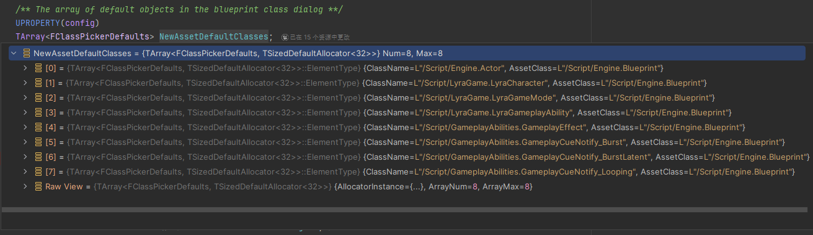

---

### ULyraEditorEngine
```cpp
// UE_5.3\Engine\Config\BaseEngine.ini
GameEngine=/Script/Engine.GameEngine

EditorEngine=/Script/UnrealEd.EditorEngine
UnrealEdEngine=/Script/UnrealEd.UnrealEdEngine

// LyraStarterGame\Config\DefaultEngine.ini
GameEngine=/Script/LyraGame.LyraGameEngine
UnrealEdEngine=/Script/LyraEditor.LyraEditorEngine
EditorEngine=/Script/LyraEditor.LyraEditorEngine
/* class ULyraGameEngine : public UGameEngine 这个类什么也没做*/
```
---
ULyraEditorEngine的继承关系

```cpp
class UEngine: public UObject, public FExec
class UEditorEngine : public UEngine
class UUnrealEdEngine : public UEditorEngine, public FNotifyHook
class ULyraEditorEngine : public UUnrealEdEngine
```
[UEngine](https://dev.epicgames.com/documentation/en-us/unreal-engine/API/Runtime/Engine/Engine/UEngine?application_version=5.3) 保存了一些全局的配置,

例如:

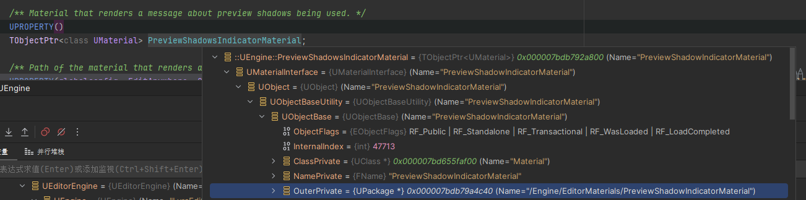

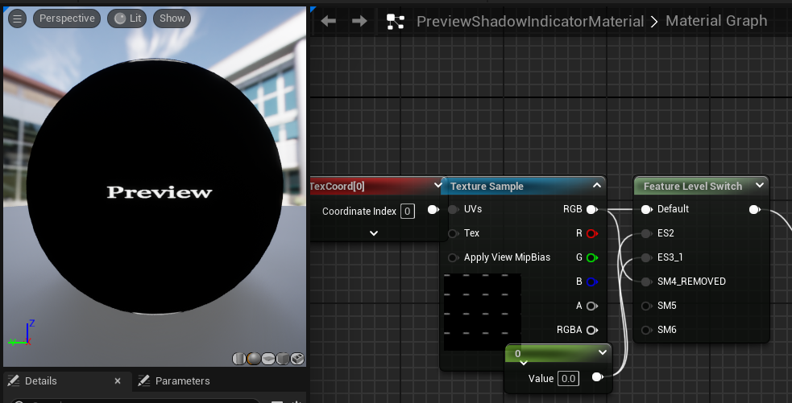

---

ULyraEditorEngine 重写了 `PreCreatePIEInstances` 函数,在编辑器中启动游戏实例前 检查世界设置是否强制使用独立网络模式

---

### FLyraEditorModule

注册TypeAction


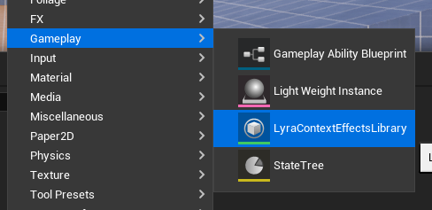


```cpp
TWeakPtr<IAssetTypeActions> LyraContextEffectsLibraryAssetAction;

//注册
IAssetTools& AssetTools = FModuleManager::LoadModuleChecked<FAssetToolsModule>("AssetTools").Get();
TSharedRef<FAssetTypeActions_LyraContextEffectsLibrary> AssetAction = MakeShared<FAssetTypeActions_LyraContextEffectsLibrary>();
LyraContextEffectsLibraryAssetAction = AssetAction;
AssetTools.RegisterAssetTypeActions(AssetAction);

//注销
FAssetToolsModule* AssetToolsModule = FModuleManager::GetModulePtr<FAssetToolsModule>("AssetTools");
TSharedPtr<IAssetTypeActions> AssetAction = LyraContextEffectsLibraryAssetAction.Pin();
if (AssetToolsModule && AssetAction)
{
    AssetToolsModule->Get().UnregisterAssetTypeActions(AssetAction.ToSharedRef());
}
```


`FAssetTypeActions_LyraContextEffectsLibrary` 类,很简单:
```cpp
class FAssetTypeActions_LyraContextEffectsLibrary : public FAssetTypeActions_Base
{
public:
    // IAssetTypeActions Implementation
    virtual FText GetName() const override { return NSLOCTEXT("AssetTypeActions", "AssetTypeActions_LyraContextEffectsLibrary", "LyraContextEffectsLibrary"); }
    virtual FColor GetTypeColor() const override { return FColor(65, 200, 98); }
    virtual UClass* GetSupportedClass() const override;
    virtual uint32 GetCategories() override { return EAssetTypeCategories::Gameplay; }
};

UClass* FAssetTypeActions_LyraContextEffectsLibrary::GetSupportedClass() const
{
    return ULyraContextEffectsLibrary::StaticClass();
}
```
`ULyraContextEffectsLibraryFactory` 还需要一个工厂类

```cpp
UCLASS(hidecategories = Object, MinimalAPI)
class ULyraContextEffectsLibraryFactory : public UFactory
{
    GENERATED_UCLASS_BODY()

    //~ Begin UFactory Interface
    virtual UObject* FactoryCreateNew(UClass* Class, UObject* InParent, FName Name, EObjectFlags Flags, UObject* Context, FFeedbackContext* Warn) override;

    virtual bool ShouldShowInNewMenu() const override
    {
        return true;
    }
    //~ End UFactory Interface	
};


ULyraContextEffectsLibraryFactory::ULyraContextEffectsLibraryFactory(const FObjectInitializer& ObjectInitializer)
    : Super(ObjectInitializer)
{
    SupportedClass = ULyraContextEffectsLibrary::StaticClass();

    bCreateNew = true;
    bEditorImport = false;
    bEditAfterNew = true;
}

UObject* ULyraContextEffectsLibraryFactory::FactoryCreateNew(UClass* Class, UObject* InParent, FName Name, EObjectFlags Flags, UObject* Context, FFeedbackContext* Warn)
{
    ULyraContextEffectsLibrary* LyraContextEffectsLibrary = NewObject<ULyraContextEffectsLibrary>(InParent, Name, Flags);

    return LyraContextEffectsLibrary;
}
```
---

监听模块变化:
```cpp
/*  当已知模块集合发生变化（加载或卸载）时触发。
*   OnModulesChanged()函数返回该事件的引用，供外部订阅监听模块变化。
*/
FModuleManager::Get().OnModulesChanged().AddRaw(this, &FLyraEditorModule::OnModulesChanged);

void ModulesChangedCallback(FName ModuleThatChanged, EModuleChangeReason ReasonForChange)
{
    if ((ReasonForChange == EModuleChangeReason::ModuleLoaded) && (ModuleThatChanged.ToString() == TEXT("GameplayAbilitiesEditor")))
    {
        BindGameplayAbilitiesEditorDelegates();
    }
}
```

---

在PIE运行前后做点事情:
```cpp
FEditorDelegates::BeginPIE.AddRaw(this, &ThisClass::OnBeginPIE);
FEditorDelegates::EndPIE.AddRaw(this, &ThisClass::OnEndPIE);
```
---

安全的界面扩展:
```cpp
if (FSlateApplication::IsInitialized())
{
    ToolMenusHandle = UToolMenus::RegisterStartupCallback(FSimpleMulticastDelegate::FDelegate::CreateStatic(&RegisterGameEditorMenus));
}
```
---
快捷的关卡选择

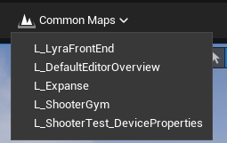

```cpp
static void RegisterGameEditorMenus()
{
    UToolMenu* Menu = UToolMenus::Get()->ExtendMenu("LevelEditor.LevelEditorToolBar.PlayToolBar");
    FToolMenuSection& Section = Menu->AddSection("PlayGameExtensions", TAttribute<FText>(), FToolMenuInsert("Play", EToolMenuInsertType::After));

    FToolMenuEntry CommonMapEntry = FToolMenuEntry::InitComboButton(
        "CommonMapOptions",
        FUIAction(
            FExecuteAction(),
            FCanExecuteAction::CreateStatic(&HasNoPlayWorld),
            FIsActionChecked(),
            FIsActionButtonVisible::CreateStatic(&CanShowCommonMaps)),
        FOnGetContent::CreateStatic(&GetCommonMapsDropdown),
        LOCTEXT("CommonMaps_Label", "Common Maps"),
        LOCTEXT("CommonMaps_ToolTip", "Some commonly desired maps while using the editor"),
        FSlateIcon(FAppStyle::GetAppStyleSetName(), "Icons.Level")
    );
    CommonMapEntry.StyleNameOverride = "CalloutToolbar";
    Section.AddEntry(CommonMapEntry);
}
```

添加一个在编辑器中设置的变量: `CommonEditorMaps`

```cpp
UCLASS(config=EditorPerProjectUserSettings, MinimalAPI)
class ULyraDeveloperSettings : public UDeveloperSettingsBackedByCVars
{
public:
#if WITH_EDITORONLY_DATA
    /** A list of common maps that will be accessible via the editor detoolbar */
    UPROPERTY(config, EditAnywhere, BlueprintReadOnly, Category=Maps, meta=(AllowedClasses="/Script/Engine.World"))
    TArray<FSoftObjectPath> CommonEditorMaps;
#endif
}
```
Editor Preferences -> LyraStarter Game ->Maps -> Common Editor Maps

在CommonEditorMaps 中添加需要的关卡

---

获取并打开关卡:

```cpp
/* 在运行游戏时 隐藏按钮 */
static bool HasPlayWorld()
{
    return GEditor->PlayWorld != nullptr;
}

static bool HasNoPlayWorld()
{
    return !HasPlayWorld();
}

static void OpenCommonMap_Clicked(const FString MapPath)
{
    if (ensure(MapPath.Len()))
    {
        GEditor->GetEditorSubsystem<UAssetEditorSubsystem>()->OpenEditorForAsset(MapPath);
    }
}

static bool CanShowCommonMaps()
{
    return HasNoPlayWorld() && !GetDefault<ULyraDeveloperSettings>()->CommonEditorMaps.IsEmpty();
}

static TSharedRef<SWidget> GetCommonMapsDropdown()
{
    FMenuBuilder MenuBuilder(true, nullptr);
    
    for (const FSoftObjectPath& Path : GetDefault<ULyraDeveloperSettings>()->CommonEditorMaps)
    {
        if (!Path.IsValid())
        {
            continue;
        }
        
        const FText DisplayName = FText::FromString(Path.GetAssetName());
        MenuBuilder.AddMenuEntry(
            DisplayName,
            LOCTEXT("CommonPathDescription", "Opens this map in the editor"),
            FSlateIcon(),
            FUIAction(
                FExecuteAction::CreateStatic(&OpenCommonMap_Clicked, Path.ToString()),
                FCanExecuteAction::CreateStatic(&HasNoPlayWorld),
                FIsActionChecked(),
                FIsActionButtonVisible::CreateStatic(&HasNoPlayWorld)
            )
        );
    }

    return MenuBuilder.MakeWidget();
}
```


## Game

### GameplayMessage


```cpp
/**
 * 该系统允许事件发送者和监听者注册消息，而无需直接了解彼此，
 * 尽管它们必须就消息格式（作为 USTRUCT() 类型）达成一致。
 *
 * 您可以从游戏实例获取消息路由器：
 *    UGameInstance::GetSubsystem<UGameplayMessageSubsystem>(GameInstance)
 * 或者从任何可以访问世界上下文的对象直接获取：
 *    UGameplayMessageSubsystem::Get(WorldContextObject)
 *
 * 注意：当同一通道有多个监听器时，调用顺序不保证，并且可能随时间变化！
 */
UCLASS()
class GAMEPLAYMESSAGERUNTIME_API UGameplayMessageSubsystem : public UGameInstanceSubsystem
{}
```

设计哲学:
```cpp
传统紧耦合通信：
系统A ───直接调用───> 系统B
      └──直接引用───> 系统C

消息总线解耦：
系统A ────广播消息───┐
                     ↓
          消息总线 (GameplayMessageSubsystem)
                     ↑
系统B ────监听消息───┘
系统C ────监听消息───┘
```
对于UMG中的小部件来说，直接绑定这个系统是最方便的，不用在UMG中一层层传递数据.

使用方法：

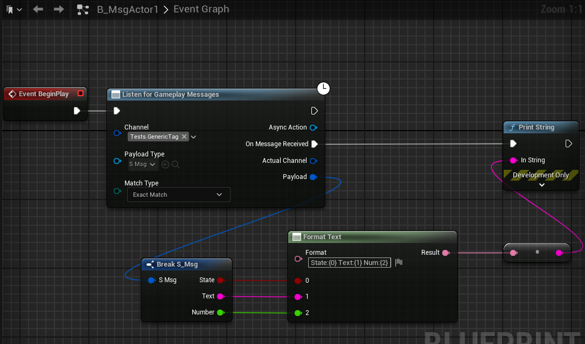

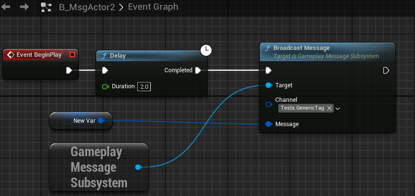

`PayloadType`指定一种结构体，任何 `USTRUCT` 都可以作为消息使用，但 `广播者` 和 `监听者` 必须就所使用的结构类型达成一致.


这个系统虽然好用，但也有缺点:<br>
解耦对象会让判断触发特定行为的因素变得更加困难<br>
要干净利落地组织所有用于 `GameplayMessagingSystem` 的 `GameplayTags` 很有挑战性<br>


`FLyraVerbMessage`:<br>
`Lyra` 示例项目几乎所有发送的消息都使用单一的 `FLyraVerbMessage` 结构。该消息结构如下所示，包含足够的信息数据字段以涵盖大多数常见的游戏事件。

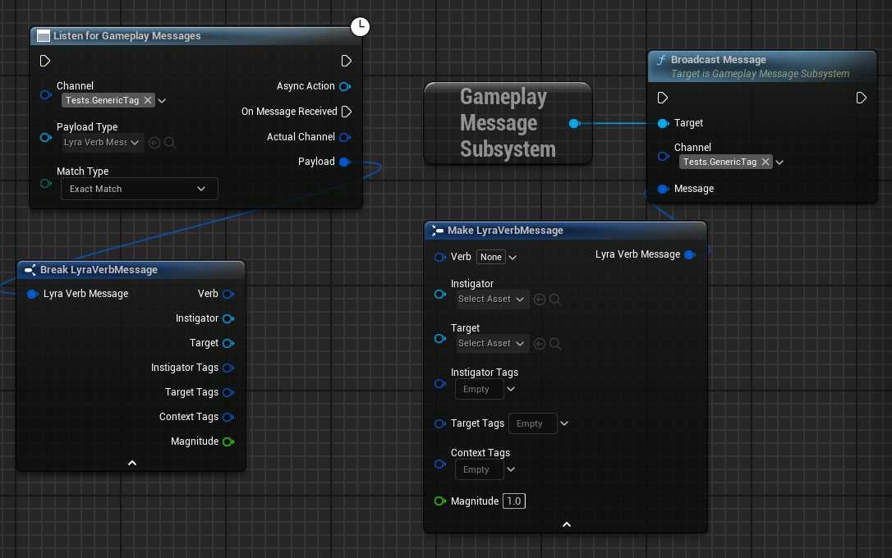

结构体：
```cpp
USTRUCT(BlueprintType)
struct FLyraVerbMessage
{
    GENERATED_BODY()

    /* ... */
};
```


---

### ModularGameplay

核心问题：<br>
需要做一个 统一添加组件的功能，<br> 
例如 在游戏开始时自动给特定的`Actor`类 添加特定的组件.<br>
在角色死亡复活后，自动添加特定组件.<br>
在游戏进行到某个阶段时，自动添加特定组件.

最简单的方法是 用一个管理器 将涉及到的`Actor` 保存起来，通过管理器统一操作.<br>
`Actor`生成时 就注册到管理器里，游戏到达某个阶段时 就可以通知管理器来操作这些`Actor`.

---

下列类的构造与析构函数中 已经实现了向管理器注册或移除自身.<br>
继承以下类 即可让你的类自动添加到管理器.

`ModularAIController`<br>
作用：支持模块化组件的 AI 控制器基类。<br>
- 在 PreInitializeComponents 中注册为 GameFrameworkComponentReceiver。
- 在 BeginPlay 时发送 NAME_GameActorReady 事件。
- 在 EndPlay 时取消注册。

`ModularCharacter`<br>
作用：支持模块化组件的角色基类。<br>
- 与 ModularAIController 类似的生命周期管理。
- 支持插件添加组件到角色上。

`ModularGameMode` / `ModularGameModeBase`<br>
作用：支持模块化组件的游戏模式基类。<br>
- 在构造函数中设置默认的模块化游戏状态、玩家控制器、玩家状态和 Pawn。
- 提供两个版本：ModularGameMode（继承自 AGameMode）和 ModularGameModeBase（继承自 AGameModeBase）。

`ModularGameState` / `ModularGameStateBase`<br>
作用：支持模块化组件的游戏状态基类。<br>
- 在生命周期关键点管理组件注册。
- ModularGameState 重写了 HandleMatchHasStarted，通知所有 GameStateComponent。

`ModularPawn`<br>
作用：支持模块化组件的 Pawn 基类。<br>
- 与 ModularCharacter 类似的生命周期管理。

`ModularPlayerController`<br>
作用：支持模块化组件的玩家控制器基类。<br>
- 在 ReceivedPlayer 时发送 NAME_GameActorReady 事件。
- 在 PlayerTick 中调用所有 ControllerComponent 的 PlayerTick。
- 在 EndPlay 时取消注册。

`ModularPlayerState`<br>
作用：支持模块化组件的玩家状态基类。<br>
- 在生命周期关键点管理组件注册。
- 重写 Reset 方法，重置所有 PlayerStateComponent。
- 重写 CopyProperties，复制所有 PlayerStateComponent 的属性。
`ModularGameplayActorsModule`<br>
作用：模块入口，注册 ModularGameplayActors 模块。<br>


**组件类**
`GameFrameworkComponent`<br>
作用：所有游戏框架组件的基类，继承自 UActorComponent。<br>
- 提供类型安全的模板方法：GetGameInstance<T>(), GetGameInstanceChecked<T>()
- 提供便捷方法：HasAuthority()（检查网络权限）, GetWorldTimerManager()
- 默认 bAutoActivate = false，由框架控制激活时机
- 定义了 TComponentIterator 和 TConstComponentIterator 模板类，用于安全遍历组件

`PawnComponent`<br>
作用：专为 APawn 设计的组件基类。
- 类型安全的模板方法：GetPawn<T>(), GetPawnChecked<T>()
- 便捷访问：GetPlayerState<T>(), GetController<T>()

`ControllerComponent`<br>
作用：专为 AController 设计的组件基类。<br>
- 类型安全的模板方法：GetController<T>(), GetControllerChecked<T>()
- 便捷访问：GetPawn<T>(), GetViewTarget<T>(), GetPlayerState<T>()
- 工具方法：IsLocalController(), GetPlayerViewPoint()
- 事件钩子：ReceivedPlayer(), PlayerTick()（对应玩家控制器的生命周期）

`PlayerStateComponent`<br>
作用：专为 APlayerState 设计的组件基类。<br>
- 类型安全的模板方法：GetPlayerState<T>(), GetPlayerStateChecked<T>()
- 便捷访问：GetPawn<T>()
- 事件钩子：Reset(), CopyProperties()（用于玩家状态重置和复制）

`GameStateComponent`<br>
作用：专为 AGameStateBase 设计的组件基类。
- 类型安全的模板方法：GetGameState<T>(), GetGameStateChecked<T>()
- 便捷访问：GetGameMode<T>()
- 事件钩子：HandleMatchHasStarted(), HandleMatchHasEnded()

`GameFrameworkInitStateInterface`<br>
作用：核心管理系统接口，用于管理组件和功能的初始化状态。
- 状态管理：GetInitState(), HasReachedInitState(), TryToChangeInitState()
- 状态链：ContinueInitStateChain()（按顺序推进状态）
- 依赖检查：CanChangeInitState()（检查是否可进入下一状态）
- 状态变更处理：HandleChangeInitState()（实际状态变更逻辑）
- 事件绑定：BindOnActorInitStateChanged(), RegisterAndCallForInitStateChange()
- 自动初始化：CheckDefaultInitialization(), CheckDefaultInitializationForImplementers()


---

通常和`GameFeature`插件一起使用，`ModularGameplay`是解决游戏代码复杂性的一种方法

在各种项目中 因为各种不同的特性和功能都塞进了 `PlayerController、Pawn、GameMode、GameState` 这些类中，导致C++文件有成千上万行代码

`ModularGameplay`将这些功能模块化，允许通过插件架构向你的游戏添加新内容和新体验。
`ModularGameplay`的创建方式使核心游戏可以完全不知道它的存在，从而省去了创建从游戏到新内容的依赖项的需求。

它们管理起来很方便，因为可以在不影响游戏的情况下随时自由地开启和关闭它们。它们可以用于多种用途，例如添加新的游戏性机制、游戏内物品乃至游戏世界场景中的全新区域。

---

`GameFrameworkComponentManager` 整个系统的核心，是一个组件注册与事件分发系统：
- 注册接收者：Actor 通过 AddGameFrameworkComponentReceiver 注册自己。
- 发送事件：Actor 在适当生命周期发送事件（如 NAME_GameActorReady）。
- 插件响应：游戏功能插件监听这些事件，动态添加组件到 Actor 上。
- 取消注册：Actor 销毁时取消注册。

```cpp
void AModularCharacter::PreInitializeComponents()
{
    Super::PreInitializeComponents();
    
    //允许以后向我添加组件
    UGameFrameworkComponentManager::AddGameFrameworkComponentReceiver(this);
}
```
以两个`GameFeatureAction`为例,说明使用方式.

#### AddComponent
---

```cpp
class UGameFeatureAction_AddComponents final : public UGameFeatureAction
```

<font color="yellow">示例:给`LyraGameState`添加一个组件`B_TeamDeathMatchScoring` </font>


`UGameFrameworkComponentManager`类保存一个`Actor`和`Component`的Map映射关系,

`Actor`在初始化组件之前 通过查找这个Map 找到对应要创建的`Component`.

设计思路:在编辑器层面,使用`UGameFeatureAction`保存这一组关系,在`GameFeature`系统启动时 读取`UGameFeatureAction` 并将映射关系保存到`Manager`的Map中.

引用计数:如果有多个`GameFeature` 都需要对同一类`Actor`创建同一类`Component`,则需要引用计数. 

如果没有引用计数,`UGameFrameworkComponentManager`读取一个`UGameFeatureAction`时 创建一组Map, 读取另一个`UGameFeatureAction`中又创建一遍Map. 导致重复记录，效率就低了.


因此，添加一个引用计数,第一次添加一组映射关系时，引用计数+1 并且在Map中存入映射关系,

第二次添加一组映射关系时,只让引用计数+1,而不存入映射关系.

切换游戏模式，不需要其中一个`GameFeature`时,引用计数-1,如果引用计数为0,则删除Map中的映射关系.

---

场景：多个系统都需要为角色添加能力系统组件
1. 游戏特性A：需要AbilitySystemComponent来添加技能
2. 游戏特性B：需要AbilitySystemComponent来同步属性
3. DLC模块：需要AbilitySystemComponent来添加新能力

 没有引用计数的问题：
 每个请求都创建组件 → 重复创建 → 内存浪费 + 逻辑错误

 有引用计数的解决方案：
 1. 第一次请求：创建组件，计数=1
 2. 第二次请求：增加计数=2，不创建新组件
 3. 第一次请求释放：计数=1，不删除组件
 4. 第二次请求释放：计数=0，删除组件

---

`UGameFeatureAction_AddComponents` 类

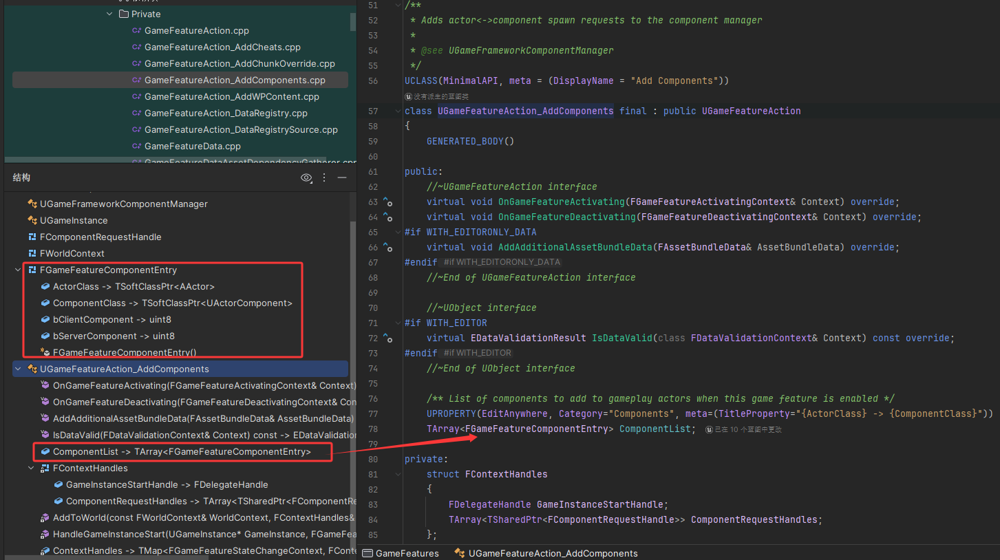


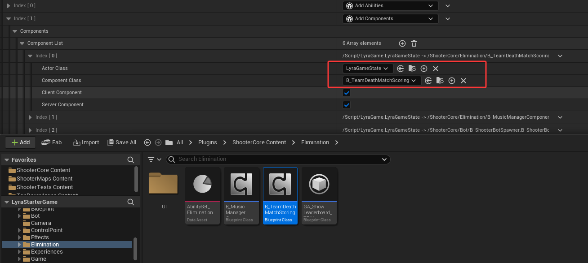

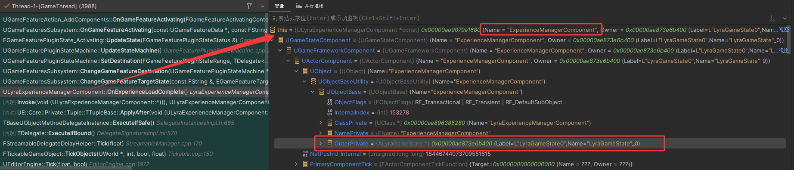

函数堆栈显示了调用顺序:

`UGameFeatureAction_AddComponents::OnGameFeatureActivating`  在激活时调用`AddToWorld`
        
`UGameFeatureAction_AddComponents::AddToWorld`

最终在`UGameFrameworkComponentManager::CreateComponentOnInstance`中创建并注册组件.

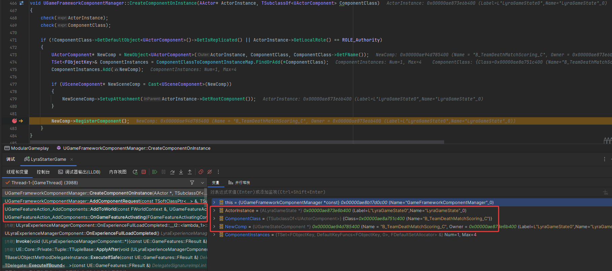

`Handle`

创建组件后 将Actor与Component存入`ContextHandles`

```cpp
class UGameFeatureAction_AddComponents
{
    // 省略
    struct FContextHandles
    {
        FDelegateHandle GameInstanceStartHandle;
        TArray<TSharedPtr<FComponentRequestHandle>> ComponentRequestHandles;
    };

    TMap<FGameFeatureStateChangeContext, FContextHandles> ContextHandles;
}


void UGameFeatureAction_AddComponents::OnGameFeatureActivating(FGameFeatureActivatingContext& Context)
{
    //注意这里是引用. 后续的Handles都是在操作ContextHandles的第二个模板参数FContextHandles
    FContextHandles& Handles = ContextHandles.FindOrAdd(Context);

    Handles.GameInstanceStartHandle = FWorldDelegates::OnStartGameInstance.AddUObject(this, 
        &UGameFeatureAction_AddComponents::HandleGameInstanceStart, FGameFeatureStateChangeContext(Context));

    ensure(Handles.ComponentRequestHandles.Num() == 0);

    // Add to any worlds with associated game instances that have already been initialized
    for (const FWorldContext& WorldContext : GEngine->GetWorldContexts())
    {
        if (Context.ShouldApplyToWorldContext(WorldContext))
        {
            AddToWorld(WorldContext, Handles);
        }
    }
}

void UGameFeatureAction_AddComponents::AddToWorld(const FWorldContext& WorldContext, FContextHandles& Handles)
{
    //省略
    // 将 AddComponentRequest 返回的Handle 存入Handles.ComponentRequestHandles
    Handles.ComponentRequestHandles.Add(GFCM->AddComponentRequest(Entry.ActorClass, ComponentClass));
}
```
`UGameFrameworkComponentManager::AddComponentRequest`

1. 将读取到的`GameFeatureAction_AddComponents`保存的`Actor`和`Component`存入自己的`ReceiverClassToComponentClassMap`,
2. 将这一对`Actor`和`Component`作为参数构造一个`FComponentRequestHandle` 作为返回值,<br>`GameFeatureAction_AddComponents`的`ContextHandles`保存这个返回值， 
以便于`GameFeatureAction_AddComponents`在将来的`OnGameFeatureDeactivating`中，可以删除这一组Map.

```cpp
TIP:在UE中 `Handle`通常作为一个`ID` 用来标记一个对象,以便于将来对它进行操作.
例如:创建定时器时,需要一个`Handle`来标记这个定时器,以便于将来暂停或删除计时器
```

```cpp
TSharedPtr<FComponentRequestHandle> UGameFrameworkComponentManager::AddComponentRequest(const TSoftClassPtr<AActor>& ReceiverClass, TSubclassOf<UActorComponent> ComponentClass)
{
    // 省略. 
    auto& ComponentClasses = ReceiverClassToComponentClassMap.FindOrAdd(ReceiverClassPath);
        ComponentClasses.Add(ComponentClassPtr);
    //省略
    // UGameFrameworkComponentManager将 this 传入了FComponentRequestHandle.
    return MakeShared<FComponentRequestHandle>(this, ReceiverClass, ComponentClass);
}
```

---

`FComponentRequestHandles`

添加了Actor与Component的映射关系，如何删除这一对映射？

在添加映射关系时,
`AddComponentRequest`返回了Actor和Component的Handle并存入`Handles.ComponentRequestHandles`

要移除映射关系:<br>
`OnGameFeatureDeactivating` 清空`Handles.ComponentRequestHandles`,触发`FComponentRequestHandle`的析构函数，

在析构函数中,`~FComponentRequestHandle()`将自己保存的`Actor`和`Component`作为参数传入`UGameFrameworkComponentManager::RemoveComponentRequest` 

`RemoveComponentRequest`将会移除`ReceiverClassToComponentClassMap`中对应的`Actor`和`Component`.

```cpp
void UGameFeatureAction_AddComponents::OnGameFeatureDeactivating(FGameFeatureDeactivatingContext& Context)
{
    FContextHandles& Handles = ContextHandles.FindOrAdd(Context);

    FWorldDelegates::OnStartGameInstance.Remove(Handles.GameInstanceStartHandle);

    // Releasing the handles will also remove the components from any registered actors too
    Handles.ComponentRequestHandles.Empty();
}
```

```cpp
struct FComponentRequestHandle
{
    //在AddToWorld中调用的是这个版本的构造函数
    FComponentRequestHandle(const TWeakObjectPtr<UGameFrameworkComponentManager>& InOwningManager, const TSoftClassPtr<AActor>& InReceiverClass, const TSubclassOf<UActorComponent>& InComponentClass)
        : OwningManager(InOwningManager)
        , ReceiverClass(InReceiverClass)
        , ComponentClass(InComponentClass)
    {}

    FComponentRequestHandle::~FComponentRequestHandle()
    {
        UGameFrameworkComponentManager* LocalManager = OwningManager.Get();
        if (LocalManager)
        {
            if (ComponentClass.Get())
            {
                //这个函数将被调用,移除组件
                LocalManager->RemoveComponentRequest(ReceiverClass, ComponentClass);
            }
            if (ExtensionHandle.IsValid())
            {
                LocalManager->RemoveExtensionHandler(ReceiverClass, ExtensionHandle);
            }
        }
    }
}
```

---

```cpp
// GameFrameworkComponentManager.cpp
TSharedPtr<FComponentRequestHandle> UGameFrameworkComponentManager::AddComponentRequest(
    const TSoftClassPtr<AActor>& ReceiverClass,  // 接收者类（软引用）
    TSubclassOf<UActorComponent> ComponentClass  // 要添加的组件类
)
{
    // ========== 1. 参数验证 ==========
    // 确保接收者类有效（不是空引用）
    if (!ensure(!ReceiverClass.IsNull()) || 
        // 确保组件类有效
        !ensure(ComponentClass) || 
        // 确保接收者类不是AActor（避免为所有Actor添加组件，性能灾难）
        !ensure(ReceiverClass.ToString() != TEXT("/Script/Engine.Actor")))
    {
        return nullptr;
    }

    // ========== 2. 准备数据结构 ==========
    // 将软引用类转换为可哈希的路径结构
    FComponentRequestReceiverClassPath ReceiverClassPath(ReceiverClass);
    // 获取组件类的原始指针
    UClass* ComponentClassPtr = ComponentClass.Get();

    // ========== 3. 创建请求键并更新引用计数 ==========
    FComponentRequest NewRequest;
    NewRequest.ReceiverClassPath = ReceiverClassPath;
    NewRequest.ComponentClass = ComponentClassPtr;
    
    // 关键：在RequestTrackingMap中查找或创建条目，并增加引用计数
    int32& RequestCount = RequestTrackingMap.FindOrAdd(NewRequest);
    RequestCount++;  // 增加引用计数

    // ========== 4. 如果是第一次请求（引用计数==1） ==========
    if (RequestCount == 1)
    {
        // 4.1 添加到接收者类到组件类映射
        auto& ComponentClasses = ReceiverClassToComponentClassMap.FindOrAdd(ReceiverClassPath);
        ComponentClasses.Add(ComponentClassPtr);

        // 4.2 如果接收者类已在内存中，为现有实例创建组件
        if (UClass* ReceiverClassPtr = ReceiverClass.Get())
        {
            // 获取GameInstance和World
            UGameInstance* LocalGameInstance = GetGameInstance();
            if (ensure(LocalGameInstance))
            {
                UWorld* LocalWorld = LocalGameInstance->GetWorld();
                if (ensure(LocalWorld))
                {
                    // 4.3 遍历世界中所有该类的Actor实例
                    for (TActorIterator<AActor> ActorIt(LocalWorld, ReceiverClassPtr); ActorIt; ++ActorIt)
                    {
                        // 确保Actor已初始化
                        if (ActorIt->IsActorInitialized())
                        {
                            // 编辑器验证：确保Actor已经调用了AddReceiver
#if WITH_EDITOR
                            if (!ReceiverClassPtr->HasAllClassFlags(CLASS_Abstract))
                            {
                                ensureMsgf(AllReceivers.Contains(*ActorIt), 
                                    TEXT("You may not add a component request for an actor class that does not call AddReceiver/RemoveReceiver in code! Class:%s"), 
                                    *GetPathNameSafe(ReceiverClassPtr));
                            }
#endif
                            // 为现有实例创建组件
                            CreateComponentOnInstance(*ActorIt, ComponentClass);
                        }
                    }
                }
            }
        }
        else
        {
            // 4.4 Actor类不在内存中，暂时没有实例
            // 当类加载时，AddReceiverInternal会处理
        }

        // 4.5 返回组件请求句柄
        return MakeShared<FComponentRequestHandle>(this, ReceiverClass, ComponentClass);
    }

    // ========== 5. 如果不是第一次请求 ==========
    // 返回nullptr，因为请求已存在，使用相同的句柄
    return nullptr;
}
```

---

以UGameFeatureAction_AddComponents为例，GameFeature加载时 调用

- -->UGameFeatureAction_AddComponents::OnGameFeatureActivating 
- -->UGameFeatureAction_AddComponents::AddToWorld
- -->UGameFrameworkComponentManager::AddComponentRequest


`UGameFeatureAction_AddComponents :: TArray<FGameFeatureComponentEntry> ComponentList`

举例:

对`AModularCharacter`添加一个`ExperienceManagerComponent` ， `UGameFeatureAction_AddComponents::ComponentList`的内容保存了这对关系

`UGameFrameworkComponentManager::AddComponentRequest` 又将这对关系保存在了`ReceiverClassToComponentClassMap`中，

以上是系统启动时做的事情，用一个Map保存对应关系.

运行流程:在场景中创建一个`AModularCharacter`时 就要用到Map中保存的关系.
```cpp
void AModularCharacter::PreInitializeComponents()
{
    Super::PreInitializeComponents();

    UGameFrameworkComponentManager::AddGameFrameworkComponentReceiver(this);
}
```
`UGameFrameworkComponentManager::AddGameFrameworkComponentReceiver`调用了`AddReceiverInternal(Receiver);`

```cpp
void UGameFrameworkComponentManager::AddGameFrameworkComponentReceiver(AActor* Receiver, bool bAddOnlyInGameWorlds)
{
    if (UGameFrameworkComponentManager* GFCM = GetForActor(Receiver, bAddOnlyInGameWorlds))
    {
        GFCM->AddReceiverInternal(Receiver);
    }
}
```

参数`Receiver`就是这个在场景中创建的`AModularCharacter`,

`UGameFrameworkComponentManager::AddReceiverInternal(AActor* Receiver)`通过
查找`ReceiverClassToComponentClassMap` 得知要添加一个`ExperienceManagerComponent`组件
```cpp
void UGameFrameworkComponentManager::AddReceiverInternal(AActor* Receiver)
{
    //省略
    for (UClass* Class = Receiver->GetClass(); Class && Class != AActor::StaticClass(); Class = Class->GetSuperClass())
    {
        FComponentRequestReceiverClassPath ReceiverClassPath(Class);
        if (auto* ComponentClasses = ReceiverClassToComponentClassMap.Find(ReceiverClassPath))
        {
            for (UClass* ComponentClass : *ComponentClasses)
            {
                if (ComponentClass)
                {
                    CreateComponentOnInstance(Receiver, ComponentClass);
                }
            }
        }

        //省略
    }
}
```
最终调用`CreateComponentOnInstance(Receiver, ComponentClass)` 为`AModularCharacter`创建组件

```cpp
void UGameFrameworkComponentManager::CreateComponentOnInstance(AActor* ActorInstance, TSubclassOf<UActorComponent> ComponentClass)
{
    check(ActorInstance);
    check(ComponentClass);

    if (!ComponentClass->GetDefaultObject<UActorComponent>()->GetIsReplicated() || ActorInstance->GetLocalRole() == ROLE_Authority)
    {
        UActorComponent* NewComp = NewObject<UActorComponent>(ActorInstance, ComponentClass, ComponentClass->GetFName());
        TSet<FObjectKey>& ComponentInstances = ComponentClassToComponentInstanceMap.FindOrAdd(*ComponentClass);
        ComponentInstances.Add(NewComp);

        if (USceneComponent* NewSceneComp = Cast<USceneComponent>(NewComp))
        {
            NewSceneComp->SetupAttachment(ActorInstance->GetRootComponent());
        }

        NewComp->RegisterComponent();
    }
}
```

如果将来在场景中继续生成AModularCharacter，每个AModularCharacter都会在PreInitializeComponents调用到CreateComponentOnInstance函数，为自己创建对应的组件

总结:

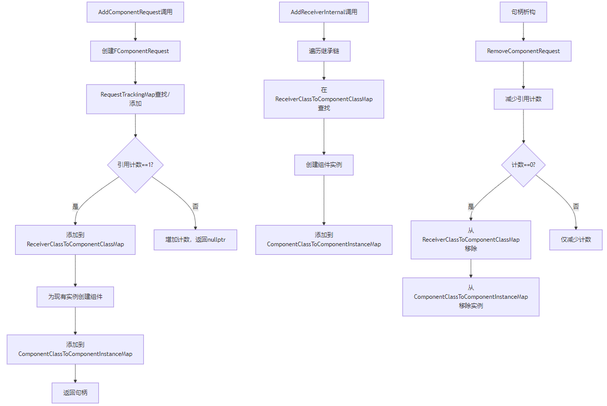

#### AddAbility
`UGameFrameworkComponentManager`扩展系统:
```cpp
//////////////////////////////////////////////////////////////////////////////////////////////
// 扩展系统允许在接收器Actor上注册任意事件回调。
// 这些是默认事件，但游戏可以定义、发送和监听自己的事件。

/** 为已注册的类调用了AddReceiver并且组件已被添加，在初始化早期调用 */
static FName NAME_ReceiverAdded;

/** 为已注册的类调用了RemoveReceiver并且组件已被移除，通常在EndPlay中调用 */
static FName NAME_ReceiverRemoved;

/** 添加了一个新的扩展处理器 */
static FName NAME_ExtensionAdded;

/** 扩展处理器被释放的请求句柄移除 */
static FName NAME_ExtensionRemoved;
```

```cpp
class UGameFeatureAction_AddAbilities final : public UGameFeatureAction_WorldActionBase
```
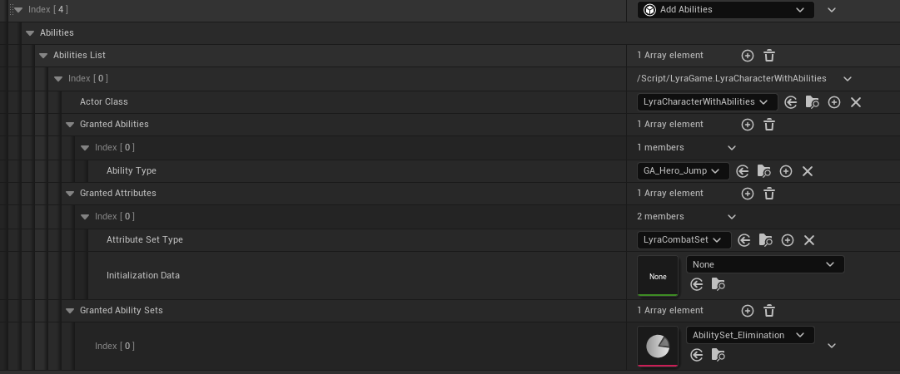

与`AddComponent`不同的是，`UGameFeatureAction_AddAbilities`没有保存`Actor`与`Component`的映射关系,它并不需要添加`Component`，而是添加`Ability`.

在`AddToWorld`中，创建一个绑定`UGameFeatureAction_AddAbilities::HandleActorExtension`函数的委托,作为参数传递给`HandleActorExtension`函数. 同时`AddAbilities`也保存了这一个Event委托.

```cpp
void UGameFeatureAction_AddAbilities::AddToWorld(const FWorldContext& WorldContext, const FGameFeatureStateChangeContext& ChangeContext)
{
    //省略	
    int32 EntryIndex = 0;
    for (const FGameFeatureAbilitiesEntry& Entry : AbilitiesList)
    {
        if (!Entry.ActorClass.IsNull())
        {
            UGameFrameworkComponentManager::FExtensionHandlerDelegate AddAbilitiesDelegate = UGameFrameworkComponentManager::FExtensionHandlerDelegate::CreateUObject(
                        this, &UGameFeatureAction_AddAbilities::HandleActorExtension, EntryIndex, ChangeContext);
            TSharedPtr<FComponentRequestHandle> ExtensionRequestHandle = ComponentMan->AddExtensionHandler(Entry.ActorClass, AddAbilitiesDelegate);

            ActiveData.ComponentRequests.Add(ExtensionRequestHandle);
            EntryIndex++;
        }
    }
}
```
```cpp
void UGameFeatureAction_AddAbilities::HandleActorExtension(AActor* Actor, FName EventName, int32 EntryIndex, FGameFeatureStateChangeContext ChangeContext)
```

`CreateUObject`预先绑定了后两个参数,EntryIndex和ChangeContext，在`HandleActorExtension`中，只需要传递`Actor`和`EventName`两个参数.


```cpp
TSharedPtr<FComponentRequestHandle> UGameFrameworkComponentManager::AddExtensionHandler(const TSoftClassPtr<AActor>& ReceiverClass, FExtensionHandlerDelegate ExtensionHandler)
{
    //省略

    /* [ReceiverClassToEventMap]保存Actor与Event的映射关系 */
    FComponentRequestReceiverClassPath ReceiverClassPath(ReceiverClass);
    FExtensionHandlerEvent& HandlerEvent = ReceiverClassToEventMap.FindOrAdd(ReceiverClassPath);

    // This is a fake multicast delegate using a map
    FDelegateHandle DelegateHandle(FDelegateHandle::EGenerateNewHandleType::GenerateNewHandle);
    HandlerEvent.Add(DelegateHandle, ExtensionHandler);

    if (UClass* ReceiverClassPtr = ReceiverClass.Get())
    {
        UGameInstance* LocalGameInstance = GetGameInstance();
        if (ensure(LocalGameInstance))
        {
            UWorld* LocalWorld = LocalGameInstance->GetWorld();
            if (ensure(LocalWorld))
            {
                for (TActorIterator<AActor> ActorIt(LocalWorld, ReceiverClassPtr); ActorIt; ++ActorIt)
                {
                    if (ActorIt->IsActorInitialized())
                    {
                        //发送NAME_ExtensionAdded事件标记
                        ExtensionHandler.Execute(*ActorIt, NAME_ExtensionAdded);
                    }
                }
            }
        }
    }
    //省略
    return MakeShared<FComponentRequestHandle>(this, ReceiverClass, DelegateHandle);
}

//ExtensionHandler绑定的就是 UGameFeatureAction_AddAbilities::HandleActorExtension 函数.

void UGameFeatureAction_AddAbilities::HandleActorExtension(AActor* Actor, FName EventName, int32 EntryIndex, FGameFeatureStateChangeContext ChangeContext)
{
    // 通过ChangeContext判断添加或移除Ability
    FPerContextData* ActiveData = ContextData.Find(ChangeContext);
    if (AbilitiesList.IsValidIndex(EntryIndex) && ActiveData)
    {
        const FGameFeatureAbilitiesEntry& Entry = AbilitiesList[EntryIndex];
        if ((EventName == UGameFrameworkComponentManager::NAME_ExtensionRemoved) || (EventName == UGameFrameworkComponentManager::NAME_ReceiverRemoved))
        {
            RemoveActorAbilities(Actor, *ActiveData);
        }
        else if ((EventName == UGameFrameworkComponentManager::NAME_ExtensionAdded) || (EventName == ALyraPlayerState::NAME_LyraAbilityReady))
        {
            AddActorAbilities(Actor, Entry, *ActiveData);
        }
    }
}
```

#### 资产 
##### Bundle
Bundle（资源包）是 Unreal Engine 中按需加载的资源分组系统。就像手机 APP 的资源分包：
- 默认 Bundle：核心资源，必须加载
- Client Bundle：客户端专用资源（UI、音效、特效）
- Server Bundle：服务器专用资源（AI、逻辑）
- 平台特定 Bundle：如 Android、iOS 特定资源
- 质量级别 Bundle：Low、Medium、High 画质资源

```cpp
// 传统方式：所有资源一起加载
LoadAsset("/Game/Characters/Hero/BP_Hero.uasset");

// Bundle方式：按需加载
ActivateBundle("Client");  // 只加载客户端需要的资源
ActivateBundle("Server");  // 只加载服务器需要的资源
```

```cpp
// 每个资产可以有多个Bundle标签
// 就像一个文件可以有多个标签（标签系统）

// 例子：角色资产"Hero"
// Bundle标签：["", "Client", "HighQuality", "PC"]

// 例子：武器资产"Sword"  
// Bundle标签：["", "Client", "LowQuality", "Mobile"]

// 当前资产标签："", "Client"
ChangeBundleStateForPrimaryAssets(
    { AssetId_Hero },      // 对Hero资产
    { "HighQuality" },     // 添加"HighQuality"标签
    { "Client" }           // 移除"Client"标签
);

// 结果：Hero的Bundle标签变为 ["", "HighQuality"]

//------------------------------------------------------//

// 把每个资产看作一行，每个Bundle看作一列
// 这个函数就是同时对多个资产的多个Bundle进行操作

// 假设有3个资产，3个可能的Bundle
Asset1: [B1, B2, B3]
Asset2: [B1, B2, B3] 
Asset3: [B1, B2, B3]

// 调用：
AssetsToChange = [Asset1, Asset2]  // 操作前两个资产
AddBundles = [B2]                  // 给它们都添加B2
RemoveBundles = [B1]               // 从它们都移除B1

// 结果：
Asset1: [B2, B3]    // 移除了B1，添加了B2（如果已存在B2则不变）
Asset2: [B2, B3]
Asset3: [B1, B2, B3] // 不变，因为不在AssetsToChange中
```

-------

```cpp
// 1. 创建Bundle列表（加载"Equipped"）
TArray<FName> BundlesToLoad;
BundlesToLoad.Add(FName("Equipped")); 

// 2. 根据网络角色添加Bundle
if (bLoadClient) 
{
    BundlesToLoad.Add(UGameFeaturesSubsystemSettings::LoadStateClient);
}
if (bLoadServer) 
{
    BundlesToLoad.Add(UGameFeaturesSubsystemSettings::LoadStateServer);
}

// 3. 创建资产列表
TSet<FPrimaryAssetId> BundleAssetList;
BundleAssetList.Add(CurrentExperience->GetPrimaryAssetId());
// ... 添加ActionSets

// 4. 调用ChangeBundleStateForPrimaryAssets
BundleLoadHandle = AssetManager.ChangeBundleStateForPrimaryAssets(
    BundleAssetList.Array(),  // 资产列表
    BundlesToLoad,           // 要添加的Bundle
    {},                      // 不移除的Bundle
    false,                   // 不移除所有Bundle
    FStreamableDelegate(),   // 回调
    FStreamableManager::AsyncLoadHighPriority  // 优先级
);
```
初始化
```cpp
// 假设当前体验定义：
// 资产ID: "LyraExperience.MainMenu"
// 包含2个ActionSets:
//   "LyraActionSet.MenuUI"
//   "LyraActionSet.MenuAudio"

// 局部变量初始化后：
BundleAssetList = 
{
    "LyraExperience.MainMenu",
    "LyraActionSet.MenuUI", 
    "LyraActionSet.MenuAudio"
}

// 网络判断：假设是客户端 (bLoadClient = true, bLoadServer = false)
BundlesToLoad = 
{
    "Equipped",      // 首先添加的
    "Client"         // 因为bLoadClient为true而添加
}

//---------ChangeBundleStateForPrimaryAssets---------//

// 调用前：引擎内部状态（假设）
// 注意：这是引擎管理的状态，不是局部变量

// 资产 "LyraExperience.MainMenu" 当前激活的Bundle: []
// 资产 "LyraActionSet.MenuUI" 当前激活的Bundle: []
// 资产 "LyraActionSet.MenuAudio" 当前激活的Bundle: []

// 函数调用：
AssetManager.ChangeBundleStateForPrimaryAssets
(
    ["LyraExperience.MainMenu", "LyraActionSet.MenuUI", "LyraActionSet.MenuAudio"], // AssetsToChange
    ["Equipped", "Client"],  // AddBundles
    [],                      // RemoveBundles
    false,                   // bRemoveAllBundles
    ...                      // 其他参数
);

// 调用后：引擎内部状态（变化了）

// 资产 "LyraExperience.MainMenu" 现在激活的Bundle: ["Equipped", "Client"]
// 资产 "LyraActionSet.MenuUI" 现在激活的Bundle: ["Equipped", "Client"]
// 资产 "LyraActionSet.MenuAudio" 现在激活的Bundle: ["Equipped", "Client"]

```

时间线
```cpp
// 时间线表示：
t0: 调用ChangeBundleStateForPrimaryAssets之前
    资产状态：无激活Bundle（或上次体验的Bundle）
    内存：无相关资源加载

t1: ChangeBundleStateForPrimaryAssets执行中
    1. 为每个资产添加"Equipped"和"Client"标签
    2. 计算需要加载的资源列表
    3. 开始异步加载

t2: 资源加载开始（异步）
    内存：开始加载"Equipped"和"Client" Bundle的资源

t3: 资源加载完成
    内存：所有相关资源已加载
    游戏：可以正常使用这些资源
```


### LyraAssetManager
LyraAssetManager 是 Lyra 游戏框架对 UE5 AssetManager 的扩展实现，主要解决以下问题：
- 游戏特定资源管理：提供游戏专用的资源加载、缓存和管理逻辑
- 启动流程控制：管理游戏启动时的异步资源加载，支持进度报告
- 资源生命周期管理：确保关键游戏资源常驻内存，避免运行时加载卡顿
- 编辑器与运行时差异化处理：针对不同运行环境优化加载策略

```cpp
UAssetManager (基类)
    ↓
ULyraAssetManager (Lyra扩展)
    ├── 启动任务系统 (FLyraAssetManagerStartupJob)
    ├── 游戏数据管理 (GameDataMap)
    ├── 资源缓存系统 (LoadedAssets)
    └── 进度报告机制
```
---
#### FLyraAssetManagerStartupJob 
- 封装异步加载任务，支持进度跟踪
- 通过权重系统计算整体加载进度百分比
- 限制进度更新频率（60fps），避免性能开销

```cpp
struct FLyraAssetManagerStartupJob
{
    FLyraAssetManagerStartupJobSubstepProgress SubstepProgressDelegate; // 进度报告委托
    TFunction<void(const FLyraAssetManagerStartupJob&, TSharedPtr<FStreamableHandle>&)> JobFunc; // 任务函数
    FString JobName;  // 任务名称（用于日志）
    float JobWeight;  // 任务权重（用于进度计算）
    mutable double LastUpdate = 0; // 上次更新时间（用于限制更新频率）
};
```
`DoJob`
- 性能监控：使用 FPlatformTime::Seconds() 记录任务耗时
- 异步支持：通过 FStreamableHandle 支持异步加载
- 进度绑定：将异步加载进度与任务进度报告绑定
```cpp
TSharedPtr<FStreamableHandle> FLyraAssetManagerStartupJob::DoJob() const
{
    const double JobStartTime = FPlatformTime::Seconds(); // 记录开始时间
    TSharedPtr<FStreamableHandle> Handle;
    UE_LOG(LogLyra, Display, TEXT("Startup job \"%s\" starting"), *JobName);
    JobFunc(*this, Handle); // 执行实际任务函数
    
    if (Handle.IsValid()) // 如果创建了异步句柄
    {
        // 绑定进度更新委托
        Handle->BindUpdateDelegate(FStreamableUpdateDelegate::CreateRaw(
            this, &FLyraAssetManagerStartupJob::UpdateSubstepProgressFromStreamable));
        Handle->WaitUntilComplete(0.0f, false); // 等待完成（非阻塞式等待）
        Handle->BindUpdateDelegate(FStreamableUpdateDelegate()); // 解绑委托
    }
    
    UE_LOG(LogLyra, Display, TEXT("Startup job \"%s\" took %.2f seconds to complete"), 
           *JobName, FPlatformTime::Seconds() - JobStartTime);
    return Handle;
}
```

在Lyra中 这个类提供了一个可以异步的任务，但是在实际使用中和直接调用函数没有什么区别:
```cpp
void ULyraAssetManager::StartInitialLoading()
{
    SCOPED_BOOT_TIMING("ULyraAssetManager::StartInitialLoading");

    // This does all of the scanning, need to do this now even if loads are deferred
    Super::StartInitialLoading();
    InitializeGameplayCueManager();
    GetGameData();
}
```


```cpp
UPrimaryDataAsset* ULyraAssetManager::LoadGameDataOfClass(
    TSubclassOf<UPrimaryDataAsset> DataClass,           // 要加载的数据类
    const TSoftObjectPtr<UPrimaryDataAsset>& DataClassPath, // 资源的软引用路径
    FPrimaryAssetType PrimaryAssetType)                 // 主资产类型
{
    if (GIsEditor)  // 检查是否在编辑器中运行
    {
        Asset = DataClassPath.LoadSynchronous();  // 同步阻塞加载
        LoadPrimaryAssetsWithType(PrimaryAssetType);  // 加载该类型的所有主资产
    }
    else  // 非编辑器运行时（游戏打包后）
    {
        TSharedPtr<FStreamableHandle> Handle = LoadPrimaryAssetsWithType(PrimaryAssetType);
        if (Handle.IsValid())
        {
            Handle->WaitUntilComplete(0.0f, false);  // 等待异步加载完成
            Asset = Cast<UPrimaryDataAsset>(Handle->GetLoadedAsset());  // 获取加载的资产
        }
    }
}
```

---
`GetAsset`
```cpp
// Assets loaded and tracked by the asset manager. 防止垃圾回收
UPROPERTY()
TSet<TObjectPtr<const UObject>> LoadedAssets;

// Returns the asset referenced by a TSoftObjectPtr.  This will synchronously load the asset if it's notalready loaded.
template<typename AssetType>
static AssetType* GetAsset(const TSoftObjectPtr<AssetType>& AssetPointer, bool bKeepInMemory = true);
```
- 如果`AssetPointer`没有加载，则会同步加载 - `SynchronousLoadAsset`
- bKeepInMemory 是否将加载的资源保持在内存中，如果为true，则会将资源添加到LoadedAssets中，防止GC回收.
- 返回加载的资源指针


`GetSubclass`
```cpp
GetAsset:
const TSoftObjectPtr<AssetType>& AssetPointer
// TSoftObjectPtr<T> - 用于引用普通资产实例
// 示例：TSoftObjectPtr<UTexture2D> 引用一个纹理

AssetType*  // 返回具体类型的指针
// 示例：UTexture2D* 直接指向纹理对象

-------------------------------------------------
GetSubclass:
const TSoftClassPtr<AssetType>& AssetPointer
// TSoftClassPtr<T> - 用于引用类/蓝图资产
// 示例：TSoftClassPtr<ACharacter> 引用一个角色类或蓝图

TSubclassOf<AssetType>  // 实际上是 UClass*，但有类型安全包装
// 示例：TSubclassOf<ACharacter> 可以安全转换为 ACharacter::StaticClass() 或其子类
```

资产实例和类资产
```cpp
// 资产实例 - 具体的数据对象
UObject* AssetInstance = LoadObject<UTexture2D>(nullptr, TEXT("/Game/Textures/MyTexture"));

// 类资产 - 用于创建实例的蓝图
UClass* ClassAsset = LoadClass<ACharacter>(nullptr, TEXT("/Game/Blueprints/BP_MyCharacter"));

// 使用差异：
UTexture2D* Texture = AssetInstance;  // 直接使用
ACharacter* Character = GetWorld()->SpawnActor<ACharacter>(ClassAsset);  // 用于创建实例
```


|方面	|GetAsset|	GetSubclass
| --- | --- | --- |
输入类型|	TSoftObjectPtr<T>|	TSoftClassPtr<T>
返回类型|	T* (具体指针)|	TSubclassOf<T> (类型安全类引用)
加载目标|	资产实例（数据）	|类资产（用于创建实例）
转换方式|	Cast<T>()|	Cast<UClass>()
主要用途|	获取可直接使用的资源|	获取用于生成对象的蓝图类


`Override`的函数
```cpp
//~UAssetManager interface
    virtual void StartInitialLoading() override;
#if WITH_EDITOR
    virtual void PreBeginPIE(bool bStartSimulate) override;
#endif
    //~End of UAssetManager interface
```

```cpp
void ULyraAssetManager::StartInitialLoading()
{
    SCOPED_BOOT_TIMING("ULyraAssetManager::StartInitialLoading");

    // This does all of the scanning, need to do this now even if loads are deferred
    Super::StartInitialLoading();
    
    InitializeGameplayCueManager();
    GetGameData();
}
```
`InitializeGameplayCueManager()` ?
```cpp
void ULyraAssetManager::InitializeGameplayCueManager()
{
    SCOPED_BOOT_TIMING("ULyraAssetManager::InitializeGameplayCueManager");

    ULyraGameplayCueManager* GCM = ULyraGameplayCueManager::Get();
    check(GCM);
    GCM->LoadAlwaysLoadedCues();
}

void ULyraGameplayCueManager::LoadAlwaysLoadedCues()
{
    if (ShouldDelayLoadGameplayCues())
    {
        UGameplayTagsManager& TagManager = UGameplayTagsManager::Get();
    
        //@TODO: Try to collect these by filtering GameplayCue. tags out of native gameplay tags?
        TArray<FName> AdditionalAlwaysLoadedCueTags;

        // ？
        for (const FName& CueTagName : AdditionalAlwaysLoadedCueTags)
        {
            //省略
        }
    }
}
```
`GetGameData`

先检查是否已经加载过，如果没有加载过 ---> 加载并保存到GameDataMap.
```cpp
UPROPERTY(Transient)
TMap<TObjectPtr<UClass>, TObjectPtr<UPrimaryDataAsset>> GameDataMap;

// 方案1：直接存储实例
TArray<TObjectPtr<UPrimaryDataAsset>> GameDataMap;
// 问题：如何查找特定类型的资产？
// 需要遍历 + 类型检查
for (auto& Asset : GameDataAssets)
{
    if (Asset->GetClass() == ULyraGameData::StaticClass())
    {
        // 找到了，但还需要Cast
    }
}

-----------------------------------

// 方案2：使用类作为键的映射
TMap<TObjectPtr<UClass>, TObjectPtr<UPrimaryDataAsset>> GameDataMap;

// 查找：O(1)时间复杂度
auto* Asset = GameDataMap.Find(ULyraGameData::StaticClass());
if (Asset)
{
    // 直接使用，类型安全
}

// 设计原则：每种类型只应该有一个主要实例
// 例如：
// - ULyraGameData::StaticClass() -> 唯一的 ULyraGameData 实例
// - ULyraPawnData::StaticClass() -> 唯一的 ULyraPawnData 实例
```

```cpp
const ULyraGameData& ULyraAssetManager::GetGameData()
{
    if (TObjectPtr<UPrimaryDataAsset> const * pResult = GameDataMap.Find(ULyraGameData::StaticClass()))
    {
        return *CastChecked<ULyraGameData>(*pResult);
    }

    // Does a blocking load if needed
    return *CastChecked<const ULyraGameData>(LoadGameDataOfClass(ULyraGameData::StaticClass(), 
    LyraGameDataPath,ULyraGameData::StaticClass()->GetFName()));
}

UPrimaryDataAsset* ULyraAssetManager::LoadGameDataOfClass(
    TSubclassOf<UPrimaryDataAsset> DataClass,            // 要加载的数据类的类型
    const TSoftObjectPtr<UPrimaryDataAsset>& DataClassPath, // 资源的软引用路径
    FPrimaryAssetType PrimaryAssetType)                  // 主资产类型标识
{
    //省略
    if (GIsEditor)
    {
        Asset = DataClassPath.LoadSynchronous();  // 同步阻塞加载
        LoadPrimaryAssetsWithType(PrimaryAssetType);  // 额外加载同类型资产,确保整个类型的所有资产都被加载.
    }
    else
    {
        TSharedPtr<FStreamableHandle> Handle = LoadPrimaryAssetsWithType(PrimaryAssetType);
        if (Handle.IsValid())
        {
            Handle->WaitUntilComplete(0.0f, false);  // 0.0f 无限等待时间，非阻塞等待
            Asset = Cast<UPrimaryDataAsset>(Handle->GetLoadedAsset());
        }
    }

    if (Asset)
    {
        GameDataMap.Add(DataClass, Asset);
    }
}
```

`DefaultGame.ini`
```ini
[/Script/LyraGame.LyraAssetManager]
LyraGameDataPath=/Game/DefaultGameData.DefaultGameData
DefaultPawnData=/Game/Characters/Heroes/EmptyPawnData/DefaultPawnData_EmptyPawn.DefaultPawnData_EmptyPawn
```

### Gameplay

不重要，这部分只解释框架，重点在如何与GAS结合.


Gameplay层级.

#### LyraGameInstance
```cpp
class UGameInstance : public UObject, public FExec
class COMMONGAME_API UCommonGameInstance : public UGameInstance
class LYRAGAME_API ULyraGameInstance : public UCommonGameInstance
```
- 功能：作为游戏运行实例的高级管理对象
- 生命周期：游戏创建时生成，游戏关闭时销毁
- 实例数量：独立游戏运行时只有一个实例；在编辑器中运行时，每个PIE实例都会生成一个GameInstance对象

---
// TODO: CommonGame Plugin

UCommonGameInstance：通用游戏实例框架
核心作用：
- 一个跨平台游戏框架基类，为多平台游戏提供标准化的基础设施，相当于游戏架构的“骨架”。

主要功能：
- 用户管理系统：
- 统一处理不同平台（PS/Xbox/PC等）的用户登录和权限验证
- 管理用户状态变化（如权限丢失时的处理）

会话管理流程：
- 标准化会话加入流程（邀请→检查→加入）
- 处理外部平台邀请等跨平台功能

错误处理机制：
- 统一的错误消息处理系统
- 权限错误时自动返回主菜单

本地玩家管理：
- 管理多个本地玩家（分屏游戏）
- 定义“主玩家”概念和生命周期

UI集成：
- 与CommonUI系统集成，管理玩家UI状态
- 设计定位：一个“中间层”，连接引擎基础功能和具体游戏实现。

---

ULyraGameInstance：具体游戏实现

核心作用：
- Lyra项目的具体游戏实例实现，在通用框架基础上添加Lyra特有的高级功能。

主要扩展功能：
- 游戏框架扩展：
- 定义Lyra特定的初始化状态流程（Spawned→DataAvailable→DataInitialized→GameplayReady）
- 管理游戏组件的初始化顺序

网络安全系统：
- DTLS加密支持：基于证书的现代网络加密
- 调试加密：开发期间的简单加密方案
- 处理客户端-服务器的加密握手流程

调试和开发工具：
- 控制台变量控制功能开关（如Lyra.TestEncryption）
- 测试命令（如生成DTLS证书）
- 方便调试的运行时配置

类型安全访问：
- 返回Lyra特定类型（如ALyraPlayerController*）
- 保证Lyra系统间的类型一致性

会话连接优化：
- 在连接URL中添加加密令牌
- 处理网络连接前的准备工作


#### LyraGameMode
```cpp
class AGameModeBase : public AInfo
```
- 定义游戏规则、计分系统和允许存在的游戏对象类型
- 控制玩家进入游戏的权限
- 仅在服务器端实例化，客户端不存在
- 在关卡初始化时通过UGameEngine::LoadMap()创建实例
- 实例化的具体类由URL参数`?game=xxx`、世界设置或项目设置按优先级确定

```cpp
class AGameMode : public AGameModeBase
```
- GameMode继承自GameModeBase，用于实现多人匹配对战游戏模式
- 提供默认的出生点选择和比赛状态管理行为
- 如需更简单的基础类，可直接继承GameModeBase

---
这一条继承链只有构造函数不同:

```cpp
class AGameModeBase : public AInfo

class AModularGameModeBase : public AGameModeBase
AModularGameModeBase::AModularGameModeBase(const FObjectInitializer& ObjectInitializer)
    : Super(ObjectInitializer)
{
    GameStateClass = AModularGameStateBase::StaticClass();
    PlayerControllerClass = AModularPlayerController::StaticClass();
    PlayerStateClass = AModularPlayerState::StaticClass();
    DefaultPawnClass = AModularPawn::StaticClass();
}

class ALyraGameMode : public AModularGameModeBase
ALyraGameMode::ALyraGameMode(const FObjectInitializer& ObjectInitializer)
    : Super(ObjectInitializer)
{
    GameStateClass = ALyraGameState::StaticClass();
    GameSessionClass = ALyraGameSession::StaticClass();
    PlayerControllerClass = ALyraPlayerController::StaticClass();
    ReplaySpectatorPlayerControllerClass = ALyraReplayPlayerController::StaticClass();
    PlayerStateClass = ALyraPlayerState::StaticClass();
    DefaultPawnClass = ALyraCharacter::StaticClass();
    HUDClass = ALyraHUD::StaticClass();
}
```
---

ALyraGameMode是Lyra游戏框架的基础游戏模式类，负责协调游戏流程、管理游戏体验(Experience)的加载和应用，以及处理玩家生命周期管理。

1.基于Experience的游戏配置系统<br>
设计意图: 提供高度可配置的游戏体验，允许通过不同的Experience定义改变游戏规则、Pawn设置等<br>
实现方式:
- 多源Experience确定机制（命令行、URL、开发者设置等）
- 延迟加载和异步应用Experience
- Experience加载完成前暂停玩家生成

2.模块化架构<br>
设计意图: 将功能分解到专用组件，提高代码可维护性和扩展性<br>
实现方式:
- ExperienceManagerComponent管理Experience
- PlayerSpawningManagerComponent处理玩家生成逻辑
- 委托模式连接各系统

3.玩家生命周期管理<br>
设计意图: 统一管理玩家和Bot的生命周期，提供一致的API<br>
实现方式:
- ControllerCanRestart统一处理玩家和Bot的重启逻辑
- 重试机制处理生成失败
- 事件驱动的玩家初始化流程

4.专用服务器支持<br>
设计意图: 提供完整的专用服务器运行能力<br>
实现方式:
- 自动检测专用服务器模式
- 在线服务登录流程
- 支持在线和LAN两种服务器模式

5.灵活的Pawn数据管理<br>
设计意图: 允许根据控制器类型动态分配Pawn配置<br>
实现方式:
- 从PlayerState继承PawnData
- 多级回退机制（玩家状态→Experience→全局默认）
- PawnExtensionComponent统一配置应用

6.生成系统抽象<br>
设计意图: 解耦生成逻辑，允许自定义生成策略<br>
实现方式:
- 禁用默认的起始点生成
- 委托给PlayerSpawningManagerComponent
- 提供生成位置和旋转的完整控制

---

```cpp
const ULyraPawnData* GetPawnDataForController(const AController* InController) const
```
作用: 为指定控制器获取对应的PawnData<br>
细节:
- 首先尝试从玩家的PlayerState获取PawnData
- 如果未找到，则从当前加载的Experience中获取默认PawnData
- 如果Experience未加载或没有设置，则返回AssetManager中的默认PawnData
- 如果Experience尚未加载，返回nullptr

---
初始化

```cpp
void InitGame(const FString& MapName, const FString& Options, FString& ErrorMessage)
```
作用: 游戏初始化入口点<br>
细节:
- 调用父类初始化
- 设置定时器在下一帧处理Experience匹配分配
- 延迟处理以确保所有启动设置已初始化

```cpp
void HandleMatchAssignmentIfNotExpectingOne()
```
作用: 确定并加载当前游戏应该使用的Experience<br>
细节:
- 按照优先级顺序查找ExperienceId（从高到低）:
- 1. URL选项中的Experience参数
- 2. PIE模式下的开发者设置
- 3. 命令行参数
- 4. 世界设置
- 5. 专用服务器（如果适用）
- 6. 默认Experience
- 验证找到的ExperienceId是否存在
- 调用OnMatchAssignmentGiven应用Experience

```cpp
void OnMatchAssignmentGiven(FPrimaryAssetId ExperienceId, const FString& ExperienceIdSource)
```
作用: 应用确定的Experience到游戏状态<br>
细节:
- 记录日志显示选择的Experience及其来源
- 通过ExperienceManagerComponent设置当前Experience
- 如果ExperienceId无效，记录错误

```cpp
void ALyraGameMode::InitGame(const FString& MapName, const FString& Options, FString& ErrorMessage)
{
    Super::InitGame(MapName, Options, ErrorMessage);

    // Wait for the next frame to give time to initialize startup settings
    // 下一帧执行
    GetWorld()->GetTimerManager().SetTimerForNextTick(this, &ThisClass::HandleMatchAssignmentIfNotExpectingOne);
}
```

---

```cpp
void ALyraGameMode::HandleMatchAssignmentIfNotExpectingOne()
```

```cpp
if (!ExperienceId.IsValid() && UGameplayStatics::HasOption(OptionsString, TEXT("Experience")))
{
    const FString ExperienceFromOptions = UGameplayStatics::ParseOption(OptionsString, TEXT("Experience"));
    ExperienceId = FPrimaryAssetId(FPrimaryAssetType(ULyraExperienceDefinition::StaticClass()->GetFName()), FName(*ExperienceFromOptions));
    ExperienceIdSource = TEXT("OptionsString");
}

```
通过URL参数直接指定`Experience`，如：`/ShooterMaps/Maps/L_Expanse?Experience=B_ShooterGame_Elimination`

`/ShooterMaps/Maps/L_Expanse`是地图路径,`B_ShooterGame_Elimination`是`Experience`的`AssetId`

---

```cpp
if (!ExperienceId.IsValid())
{
    FString ExperienceFromCommandLine;
    if (FParse::Value(FCommandLine::Get(), TEXT("Experience="), ExperienceFromCommandLine))
}
```
通过命令行启动指定`Experience`，如：`-Experience=MyExperience`

---

```cpp
if (!ExperienceId.IsValid())
{
    //@TODO: Pull this from a config setting or something
    ExperienceId = FPrimaryAssetId(FPrimaryAssetType("LyraExperienceDefinition"), FName("B_LyraDefaultExperience"));
    ExperienceIdSource = TEXT("Default");
}
```
硬编码确保总有可用的`Experience`. 默认地图(选择关卡的地图) 使用这个硬编码方式 加载`B_LyraDefaultExperience`.


InitGame -> HandleMatchAssignmentIfNotExpectingOne -> OnMatchAssignmentGiven<br>
->ULyraExperienceManagerComponent::SetCurrentExperience

---
##### 初始化
`GameMode`的初始化:

关卡选择地图的加载流程:

在 `Project - Maps&Modes` - `Default GameMode` 配置`GameMode` 为 `B_LyraGameMode`

传送门Actor的关卡可编辑变量:<br>
UserFacingExperienceToLoad - 类型:ULyraUserFacingExperienceDefinition

传送门Actor 碰到玩家后，将`UserFacingExperienceToLoad`变量的信息传递给`HostSession`，<br>`HostSession` 将这些信息拼成一个地图URL，调用`ServerTravel` 传送玩家到新地图. <br>当新地图加载时 GameMode也被初始化，GameMode解析地图URL，提取其中的`Experience` 信息，调用`ULyraExperienceManagerComponent::SetCurrentExperience` 加载`Experience`.

```cpp
UCommonSession_HostSessionRequest* ULyraUserFacingExperienceDefinition::CreateHostingRequest() const
{
    UCommonSession_HostSessionRequest* Result //省略-NewObject...;
    Result->OnlineMode = ECommonSessionOnlineMode::Online;
    Result->bUseLobbies = true;
    Result->MapID = MapID;
    Result->ModeNameForAdvertisement = UserFacingExperienceName;
    Result->ExtraArgs = ExtraArgs;
    Result->ExtraArgs.Add(TEXT("Experience"), ExperienceName);
    Result->MaxPlayerCount = MaxPlayerCount;
}
```
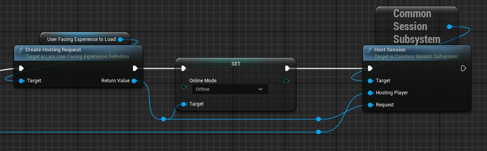


`UserFacingExperienceToLoad` 变量的内容 (DA_Expanse_TDM) :

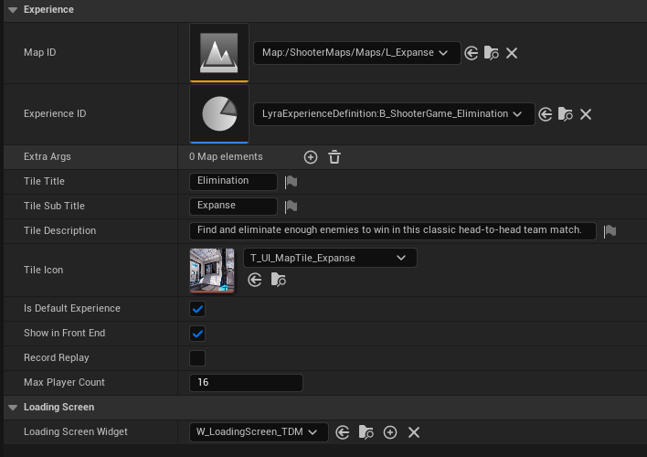
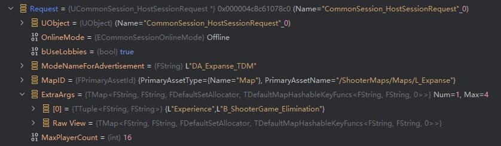

```cpp
void UCommonSessionSubsystem::HostSession(APlayerController* HostingPlayer, UCommonSession_HostSessionRequest* Request)
```

`HostSession` 使用 `Request->ExtraArgs` 构造一个地图URL:
```cpp
bool UWorld::ServerTravel(const FString& FURL, bool bAbsolute, bool bShouldSkipGameNotify)
{
    //在这里打开地图，其中:FURL = /ShooterMaps/Maps/L_Expanse?Experience=B_ShooterGame_Elimination
    //省略
}
```

进入新地图后,GameMode初始化,调用`HandleMatchAssignmentIfNotExpectingOne` 解析地图URL中的`OptionsString`

```cpp
//在这个流程中:
OptionsString = "?Experience=B_ShooterGame_Elimination";
```

`InitGame`:
```cpp
void ALyraGameMode::InitGame(const FString& MapName, const FString& Options, FString& ErrorMessage)
{
    Super::InitGame(MapName, Options, ErrorMessage);

    // Wait for the next frame to give time to initialize startup settings
    GetWorld()->GetTimerManager().SetTimerForNextTick(this, &ThisClass::HandleMatchAssignmentIfNotExpectingOne);
}
```
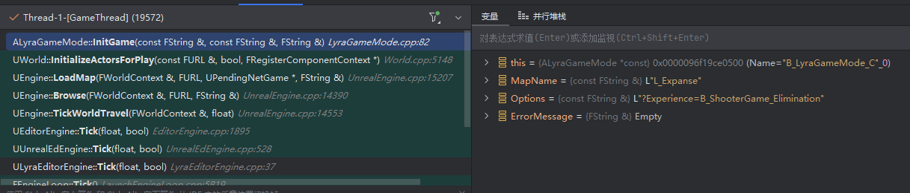

`HandleMatchAssignmentIfNotExpectingOne`:
```cpp
void ALyraGameMode::HandleMatchAssignmentIfNotExpectingOne()
{
    FPrimaryAssetId ExperienceId;
    FString ExperienceIdSource;
    if (!ExperienceId.IsValid() && UGameplayStatics::HasOption(OptionsString, TEXT("Experience")))
    {
        const FString ExperienceFromOptions = UGameplayStatics::ParseOption(OptionsString, TEXT("Experience"));
        ExperienceId = FPrimaryAssetId(FPrimaryAssetType(ULyraExperienceDefinition::StaticClass()->GetFName()), FName(*ExperienceFromOptions));
        ExperienceIdSource = TEXT("OptionsString");
    }
    //省略
    OnMatchAssignmentGiven(ExperienceId, ExperienceIdSource);
}
```


`OnMatchAssignmentGiven`:

最后将`ExperienceId` 传递给 `ULyraExperienceManagerComponent`:
```cpp
void ALyraGameMode::OnMatchAssignmentGiven(FPrimaryAssetId ExperienceId, const FString& ExperienceIdSource)
{
    if (ExperienceId.IsValid())
    {
        UE_LOG(LogLyraExperience, Log, TEXT("Identified experience %s (Source: %s)"), *ExperienceId.ToString(), *ExperienceIdSource);

        ULyraExperienceManagerComponent* ExperienceComponent = GameState->FindComponentByClass<ULyraExperienceManagerComponent>();
        check(ExperienceComponent);
        ExperienceComponent->SetCurrentExperience(ExperienceId);
    }
}
```
`ULyraExperienceManagerComponent`设置`CurrentExperience` 之后, 加载`Experience`中的资产:

`StartExperienceLoad` 加载`Experience`涉及到的所有资产,包括`ActionSets`涉及到的资产.
<br>资产加载完毕后,调用`OnExperienceLoadComplete`函数 加载并激活涉及到的`GameFeature`插件.

```cpp
void ULyraExperienceManagerComponent::StartExperienceLoad()
{
    TSet<FPrimaryAssetId> BundleAssetList;
    BundleAssetList.Add(CurrentExperience->GetPrimaryAssetId());
    for (const TObjectPtr<ULyraExperienceActionSet>& ActionSet : CurrentExperience->ActionSets)
    {
        if (ActionSet != nullptr)
        {
            BundleAssetList.Add(ActionSet->GetPrimaryAssetId());
        }
    }

    TArray<FName> BundlesToLoad;
    BundlesToLoad.Add(FLyraBundles::Equipped);
    TSharedPtr<FStreamableHandle> BundleLoadHandle = nullptr;
    if (BundleAssetList.Num() > 0)
    {
        BundleLoadHandle = AssetManager.ChangeBundleStateForPrimaryAssets(BundleAssetList.Array(), BundlesToLoad, {}, false, FStreamableDelegate(), FStreamableManager::AsyncLoadHighPriority);
    }

    // 绑定回调. 原代码中是另一个Handle变量，实际上它们指向的是同一个FStreamableHandle*,
    // 为了方便，这里直接使用BundleLoadHandle
    FStreamableDelegate OnAssetsLoadedDelegate = FStreamableDelegate::CreateUObject(this, &ThisClass::OnExperienceLoadComplete);

    if (!BundleLoadHandle.IsValid() || BundleLoadHandle->HasLoadCompleted())
    {
        // Assets were already loaded, call the delegate now
        FStreamableHandle::ExecuteDelegate(OnAssetsLoadedDelegate);
    }
    else
    {
        BundleLoadHandle->BindCompleteDelegate(OnAssetsLoadedDelegate);

        BundleLoadHandle->BindCancelDelegate(FStreamableDelegate::CreateLambda([OnAssetsLoadedDelegate]()
            {
                OnAssetsLoadedDelegate.ExecuteIfBound();
            }));
    }
}
```
`ChangeBundleStateForPrimaryAssets` 触发状态更改，开始加载资源. 加载完成后 调用`OnExperienceLoadComplete`函数.

更改`CurrentExperience`资产 和 下图中的`ActionSets`资产 的状态为"Equipped".

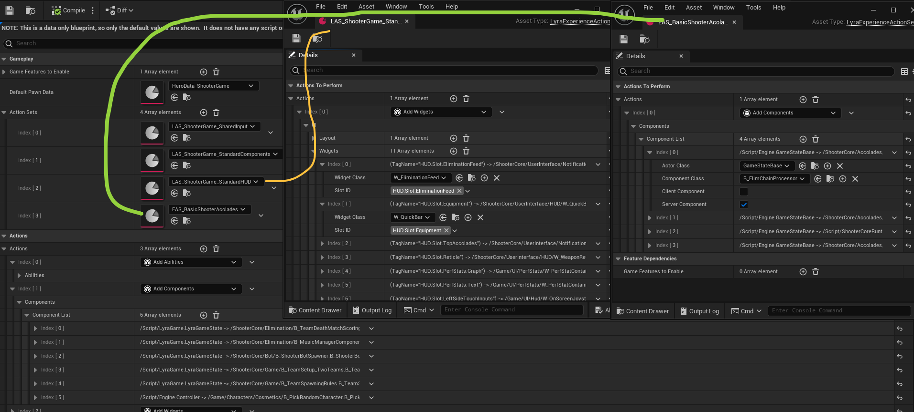

`OnExperienceLoadComplete` 收集并加载激活`CurrentExperience`涉及到的`GameFeature`

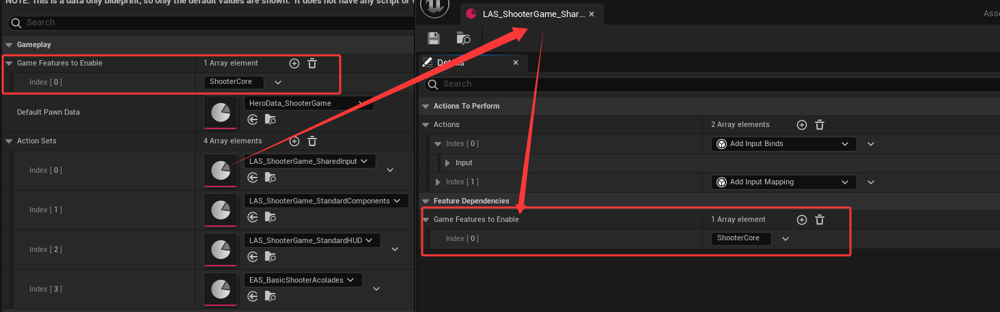

---

#### LyraGameSate
```cpp
/**
 * GameStateBase 是一个管理游戏全局状态的类，由 GameModeBase 生成。
 * 它同时存在于客户端和服务器上，并且是完全复制的。
 */
 UCLASS(config=Game, notplaceable, BlueprintType, Blueprintable, MinimalAPI)
class AGameStateBase : public AInfo
{

}
```

```cpp
class LYRAGAME_API ALyraGameState : public AModularGameStateBase, public IAbilitySystemInterface

// AModularGameStateBase 将自己注册到UGameFrameworkComponentManager:
void AModularGameStateBase::PreInitializeComponents()
{
    Super::PreInitializeComponents();
    UGameFrameworkComponentManager::AddGameFrameworkComponentReceiver(this);
}

void AModularGameStateBase::BeginPlay()
{
    UGameFrameworkComponentManager::SendGameFrameworkComponentExtensionEvent(this, UGameFrameworkComponentManager::NAME_GameActorReady);
    Super::BeginPlay();
}

void AModularGameStateBase::EndPlay(const EEndPlayReason::Type EndPlayReason)
{
    UGameFrameworkComponentManager::RemoveGameFrameworkComponentReceiver(this);
    Super::EndPlay(EndPlayReason);
}
```

`LyraGameMode` 指定了`GameStateClass` 为 `ALyraGameState`
```cpp
ALyraGameMode::ALyraGameMode(const FObjectInitializer& ObjectInitializer)
    : Super(ObjectInitializer)
{
    GameStateClass = ALyraGameState::StaticClass();
    // 省略
}
```

#### CommonGame

`GameUIManagerSubsystem`<br>
作用：UI 管理的核心子系统，继承自 UGameInstanceSubsystem，作为单例存在于游戏实例中。<br>
- 管理当前的 UI 策略 (UGameUIPolicy)。
- 在玩家加入/移除时通知策略。
- 提供默认策略类的配置支持。
- 控制子系统的创建时机（非专用服务器且无子类时才创建）。

`GameUIPolicy`<br>
作用：UI 策略基类，定义 UI 布局、多玩家交互模式等。<br>
- 支持三种多玩家交互模式：PrimaryOnly、SingleToggle、Simultaneous。
- 管理每个玩家的 UPrimaryGameLayout。
- 负责创建、添加、移除、销毁玩家 UI 布局。
- 提供请求主控布局的机制（用于分屏切换）。

`CommonLocalPlayer`<br>
作用：扩展 ULocalPlayer，增加对 UI 布局和玩家状态变化的支持。<br>
- 提供委托机制，监听 PlayerController、PlayerState、Pawn 的设置。
- 支持启用/禁用玩家视图（用于分屏休眠）。
- 提供获取根 UI 布局的方法。

`CommonPlayerInputKey`<br>
作用：显示按键绑定的 UI 控件，支持不同输入设备（键盘、手柄、触摸）的图标显示。<br>
- 可绑定动作或直接绑定按键。
- 支持“按住”操作的进度显示和倒计时。
- 支持强制显示为“按住”或“不显示按住”。
- 支持异步加载玩家控制器后的更新。

`CommonPlayerController`<br>
作用：扩展 AModularPlayerController，用于广播玩家相关事件。<br>
在 ReceivedPlayer、SetPawn、OnPossess、OnUnPossess、OnRep_PlayerState 时触发 CommonLocalPlayer 的委托。

`PrimaryGameLayout`<br>
作用：每个玩家的根 UI 布局容器，管理多个 UI 层。<br>
- 支持按 GameplayTag 注册和获取 UI 层。
- 提供同步/异步方式将 UI 控件推送到指定层。
- 支持休眠模式（用于分屏非活跃玩家）。
- 在 UI 过渡时自动暂停输入。

`CommonGameInstance`<br>
作用：扩展 UGameInstance，集成 CommonGame 的 UI、用户、会话系统。<br>
- 管理 PrimaryPlayer（首个本地玩家）。
- 处理用户权限变化、系统消息、会话邀请。
- 支持“请求会话”流程（如平台邀请加入游戏）。

`CommonUIExtensions`<br>
作用：蓝图函数库，提供常用的 UI 操作函数。<br>
- 获取当前输入类型（键鼠/手柄/触摸）。
- 向指定 UI 层推送/弹出内容。
- 暂停/恢复玩家输入（用于 UI 过渡或加载时）。

`LogCommonGame`<br>
作用：日志类别定义，用于输出 CommonGame 模块的日志。

`CommonGameModule`<br>
作用：模块入口，注册 CommonGame 模块。

---


#### PlayerStart
上回书说到:
```cpp
StartExperienceLoad 加载Experience涉及到的所有资产,包括ActionSets涉及到的资产.
资产加载完毕后,调用OnExperienceLoadComplete函数 加载并激活涉及到的GameFeature插件.
```

`ALyraGameMode` 将 `OnExperienceLoaded` 绑定到 `ExperienceComponent` 加载完成的事件上  :
```cpp
void ALyraGameMode::InitGameState()
{
    // 省略
    ExperienceComponent->CallOrRegister_OnExperienceLoaded(FOnLyraExperienceLoaded::FDelegate::CreateUObject(this, &ThisClass::OnExperienceLoaded));
}
```

`OnExperienceLoadComplete` 在这个函数的最后 调用`OnExperienceFullLoadCompleted()`<br>这个广播将调用`ALyraGameMode::OnExperienceLoaded`
```cpp
void ULyraExperienceManagerComponent::OnExperienceFullLoadCompleted()
{
    // 省略
    OnExperienceLoaded.Broadcast(CurrentExperience);
}
```

`OnExperienceLoaded` 函数中 调用 `RestartPlayer` 函数 重新生成玩家:
```cpp
void ALyraGameMode::OnExperienceLoaded(const ULyraExperienceDefinition* CurrentExperience)
{
    // Spawn any players that are already attached
    //@TODO: Here we're handling only *player* controllers, but in GetDefaultPawnClassForController_Implementation we skipped all controllers
    // GetDefaultPawnClassForController_Implementation might only be getting called for players anyways
    for (FConstPlayerControllerIterator Iterator = GetWorld()->GetPlayerControllerIterator(); Iterator; ++Iterator)
    {
        APlayerController* PC = Cast<APlayerController>(*Iterator);
        if ((PC != nullptr) && (PC->GetPawn() == nullptr))
        {
            if (PlayerCanRestart(PC))
            {
                RestartPlayer(PC);
            }
        }
    }
}
```
`RestartPlayer` 调用 `FindPlayerStart` 在场景中随机找一个出生点:


在`FindPlayerStart` 中,将调用到 `ALyraGameMode::ChoosePlayerStart_Implementation` 

`ChoosePlayerStart` 函数 会随机在场景中找一个出生点:
```cpp
AActor* ALyraGameMode::ChoosePlayerStart_Implementation(AController* Player)
{
    if (ULyraPlayerSpawningManagerComponent* PlayerSpawningComponent = GameState->FindComponentByClass<ULyraPlayerSpawningManagerComponent>())
    {
        return PlayerSpawningComponent->ChoosePlayerStart(Player);
    }
    // 在默认地图中 没有LyraPlayerSpawningManagerComponent,因此调用父类的函数.
    return Super::ChoosePlayerStart_Implementation(Player);
}
```

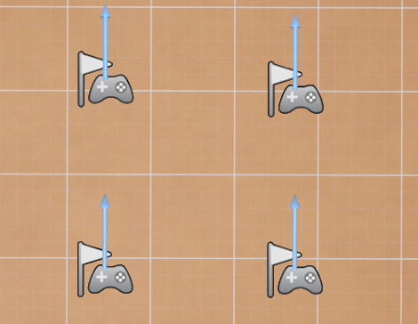

`RestartPlayer` 找到一个出生点后: `RestartPlayerAtPlayerStart(NewPlayer, StartSpot);`
```cpp
/** Tries to spawn the player's pawn at the specified actor's location */
UFUNCTION(BlueprintCallable, Category=Game)
ENGINE_API virtual void RestartPlayerAtPlayerStart(AController* NewPlayer, AActor* StartSpot)
{
    // 省略
    if (GetDefaultPawnClassForController(NewPlayer) != nullptr)
    {
        // Try to create a pawn to use of the default class for this player
        // 使用出生点的位置和旋转,生成一个Pawn
        APawn* NewPawn = SpawnDefaultPawnFor(NewPlayer, StartSpot);
        if (IsValid(NewPawn))
        {
            NewPlayer->SetPawn(NewPawn);
        }
    }
    // Tell the start spot it was used
    InitStartSpot(StartSpot, NewPlayer);
    FinishRestartPlayer(NewPlayer, SpawnRotation);
}
```

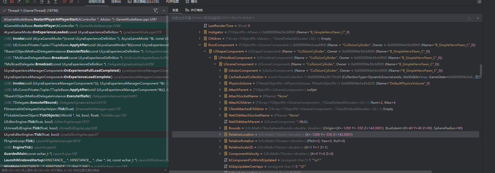

`GameMode Hook`<br>
->AGameModeBase::RestartPlayerAtPlayerStart<br>
-->AGameModeBase::SpawnDefaultPawnFor_Implementation<br>
--->ALyraGameMode::SpawnDefaultPawnAtTransform_Implementation<br>
-->ALyraGameMode::FinishRestartPlayer

```cpp
void ALyraGameMode::FinishRestartPlayer(AController* NewPlayer, const FRotator& StartRotation)
{
    if (ULyraPlayerSpawningManagerComponent* PlayerSpawningComponent = GameState->FindComponentByClass<ULyraPlayerSpawningManagerComponent>())
    {
        PlayerSpawningComponent->FinishRestartPlayer(NewPlayer, StartRotation);
    }
    //还是会调用父类函数
    Super::FinishRestartPlayer(NewPlayer, StartRotation);
}
```

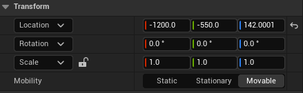

有一些关于`PlayerStart`的函数是可以在蓝图中重写的.

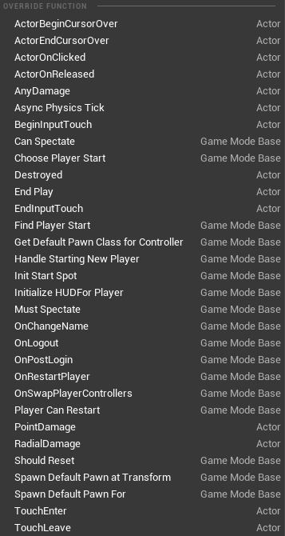

---

##### LyraPlayerStart
`ALyraPlayerStart`<br>
继承自`APlayerStart`<br>
作用：增强的玩家重生点，支持标签分类和占用管理。<br>

```cpp
UPROPERTY(EditAnywhere)
FGameplayTagContainer StartPointTags;
```
用途：通过 GameplayTag 标记重生点的类型、队伍、区域等属性。<br>
示例：
- Team.Red：红队重生点
- Spawn.Type.Initial：初始重生点
- Map.Area.SafeZone：安全区域重生点
优势：灵活的查询和匹配机制，可以根据标签选择合适重生点。<br>

```cpp
enum class ELyraPlayerStartLocationOccupancy
{
    Empty,      // 完全空闲，没有碰撞
    Partial,    // 部分占用，需要调整位置
    Full        // 完全占用，无法使用
};
```
`GetLocationOccupancy`
```cpp
ELyraPlayerStartLocationOccupancy GetLocationOccupancy(AController* const ControllerPawnToFit) const
```
检查权限：只在服务器端运行（HasAuthority()）<br>
获取Pawn信息：从游戏模式获取控制器的默认Pawn类<br>
碰撞检测：
- Empty：没有碰撞几何体
- Partial：有碰撞，但可以找到可传送位置（FindTeleportSpot）
- Full：完全被阻挡

`TryClaim`<br>
```cpp
bool TryClaim(AController* OccupyingController)
void CheckUnclaimed()
```
- 作用：将重生点标记为被某个控制器占用
- 防止冲突：避免多个玩家同时选择同一个重生点
- 设置定时器：开始定期检查占用状态

`CheckUnclaimed`<br>
定期检查：每隔 ExpirationCheckInterval 秒检查一次

释放条件：
- 声明控制器存在
- 控制器有Pawn
- 重生点现在是 Empty 状态

清理定时器：释放后停止检查

---

`ULyraPlayerSpawningManagerComponent` <br>
负责管理所有玩家的生成、重生逻辑和重生点选择。<br>
继承自 UGameStateComponent，与游戏状态绑定，全服务器共享。<br>
将生成逻辑从 AGameMode 中分离出来，实现可插拔的生成策略。<br>

`绑定事件` : <br>`LevelAddedToWorld` 遍历`Actor`筛选`ALyraPlayerStart`，添加到`CachedPlayerStarts`<br>`AddOnActorSpawnedHandler` 判断`Actor == ALyraPlayerStart`，添加到`CachedPlayerStarts`
```cpp
class ENGINE_API FWorldDelegates
{
    // Delegate type for level change events
    DECLARE_MULTICAST_DELEGATE_TwoParams(FOnLevelChanged, ULevel*, UWorld*);
    // Sent when a ULevel is added to the world via UWorld::AddToWorld
    static FOnLevelChanged	LevelAddedToWorld;
}

void ULyraPlayerSpawningManagerComponent::InitializeComponent()
{
    Super::InitializeComponent();

    FWorldDelegates::LevelAddedToWorld.AddUObject(this, &ThisClass::OnLevelAdded);

    UWorld* World = GetWorld();
    World->AddOnActorSpawnedHandler(FOnActorSpawned::FDelegate::CreateUObject(this, &ThisClass::HandleOnActorSpawned));

    for (TActorIterator<ALyraPlayerStart> It(World); It; ++It)
    {
        if (ALyraPlayerStart* PlayerStart = *It)
        {
            CachedPlayerStarts.Add(PlayerStart);
        }
    }
}
```

```cpp
// 更新缓存：
1. InitializeComponent() 时扫描所有现有重生点
2. OnLevelAdded() 关卡加载时添加新重生点  
3. HandleOnActorSpawned() Actor生成时动态添加

UPROPERTY(Transient)
TArray<TWeakObjectPtr<ALyraPlayerStart>> CachedPlayerStarts;
```

```cpp
APlayerStart* GetFirstRandomUnoccupiedPlayerStart(AController* Controller, ...)
{
    // 1. 分类：空置 vs 部分占用
    TArray<ALyraPlayerStart*> UnOccupiedStartPoints;   // Empty状态
    TArray<ALyraPlayerStart*> OccupiedStartPoints;     // Partial状态
    
    // 2. 优先级：空置 > 部分占用 > 无可用
    if (UnOccupiedStartPoints.Num() > 0)
        return 随机空置点;
    else if (OccupiedStartPoints.Num() > 0) 
        return 随机部分占用点;
    
    return nullptr;
}
```


#### PlayerState

`PlayerState` 是 `AController` 的数据层，拥有者是`AController`

```cpp
UCLASS(Config = Game)
class LYRAGAME_API ALyraPlayerState : public AModularPlayerState, public IAbilitySystemInterface, public ILyraTeamAgentInterface
```

---

`IAbilitySystemInterface`
```
ASC附加的Actor被引用作为该ASC的OwnerActor, 该ASC的物理代表Actor被称为AvatarActor. OwnerActor和AvatarActor可以是同一个 Actor, 比如MOBA游戏中的一个简单AI小兵; 它们也可以是不同的Actor, 比如MOBA游戏中玩家控制的英雄, 其中OwnerActor是PlayerState, AvatarActor是英雄的Character类. 
绝大多数Actor的ASC都附加在其自身, 如果你的Actor会重生并且重生时需要持久化Attribute或GameplayEffect(比如MOBA中的英雄), 那么ASC理想的位置就是PlayerState.
```
```cpp
void ALyraPlayerState::PostInitializeComponents()
{
    Super::PostInitializeComponents();

    // 初始化ASC
    check(AbilitySystemComponent);
    AbilitySystemComponent->InitAbilityActorInfo(this, GetPawn());

    // 注册事件 用于PawnData
    UWorld* World = GetWorld();
    if (World && World->IsGameWorld() && World->GetNetMode() != NM_Client)
    {
        AGameStateBase* GameState = GetWorld()->GetGameState();
        check(GameState);
        ULyraExperienceManagerComponent* ExperienceComponent = GameState->FindComponentByClass<ULyraExperienceManagerComponent>();
        check(ExperienceComponent);
        ExperienceComponent->CallOrRegister_OnExperienceLoaded(FOnLyraExperienceLoaded::FDelegate::CreateUObject(this, &ThisClass::OnExperienceLoaded));
    }
}
```
---

`PawnData` <br>
用于定义Pawn（游戏中的角色/实体）的基础数据。<br>继承自UPrimaryDataAsset，包含Pawn类、能力集、标签映射、输入配置和默认相机模式等属性，为游戏中的角色提供统一的数据定义模板。

示例:
`Plugins/GameFeatures/ShooterCore/Content/Game/HeroData_ShooterGame`

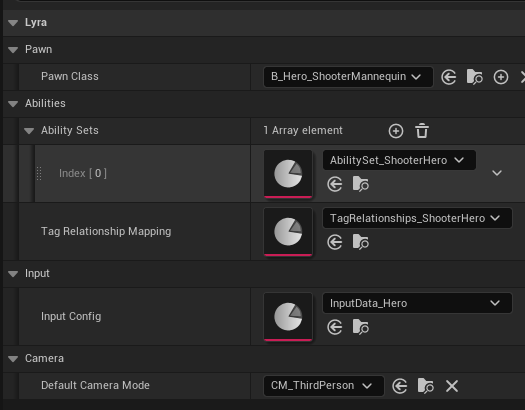

`AbilitySet_ShooterHero`:<br>
保存了GA、GE、AttributeSet数据.

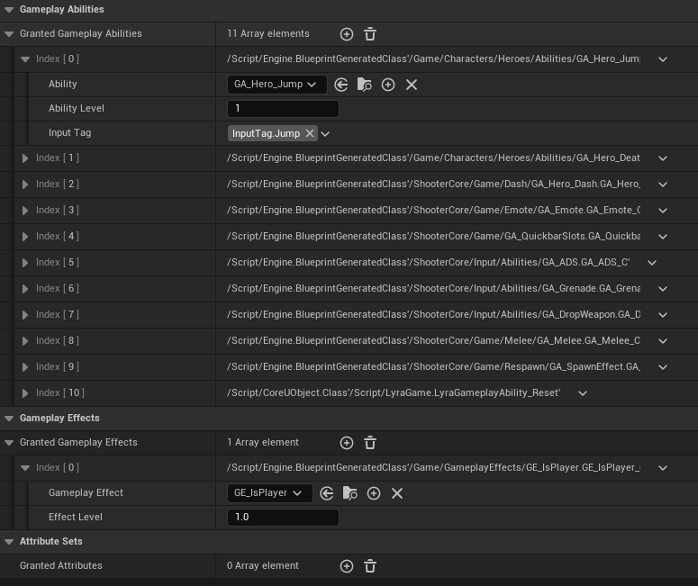

---

`void ALyraPlayerState::SetPawnData(const ULyraPawnData* InPawnData)`:<br>
在`Experience` 加载之后调用.
```cpp
void ALyraPlayerState::PostInitializeComponents()
{
    //省略
    ExperienceComponent->CallOrRegister_OnExperienceLoaded(FOnLyraExperienceLoaded::FDelegate::CreateUObject(this, &ThisClass::OnExperienceLoaded));
}

void ALyraPlayerState::OnExperienceLoaded(const ULyraExperienceDefinition* /*CurrentExperience*/)
{
    if (ALyraGameMode* LyraGameMode = GetWorld()->GetAuthGameMode<ALyraGameMode>())
    {
        if (const ULyraPawnData* NewPawnData = LyraGameMode->GetPawnDataForController(GetOwningController()))
        {
            SetPawnData(NewPawnData);
        }
    }
    //省略
}
```
`SetPawnData` 的运行流程:<br>
传入一个`ULyraPawnData`, 把`AbilitySets`中的GA、GE、AttributeSet添加到`AbilitySystemComponent` : 
```cpp
for (const ULyraAbilitySet* AbilitySet : PawnData->AbilitySets)
{
    if (AbilitySet)
    {
        AbilitySet->GiveToAbilitySystem(AbilitySystemComponent, nullptr);
    }
}
UGameFrameworkComponentManager::SendGameFrameworkComponentExtensionEvent(this, NAME_LyraAbilityReady);
```

for完了之后，发送`NAME_LyraAbilityReady`事件，<br>`GameFeatureAction_AddAbilities`会把`AbilitiesList`中的东西添加到`Actor`上.

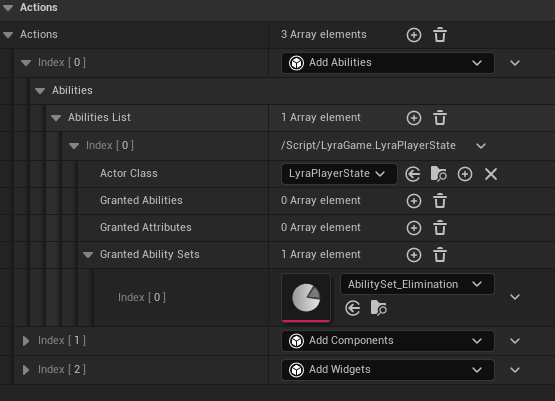

```cpp
void UGameFeatureAction_AddAbilities::HandleActorExtension(AActor* Actor, FName EventName, int32 EntryIndex, FGameFeatureStateChangeContext ChangeContext)
{
    FPerContextData* ActiveData = ContextData.Find(ChangeContext);
    if (AbilitiesList.IsValidIndex(EntryIndex) && ActiveData)
    {
        const FGameFeatureAbilitiesEntry& Entry = AbilitiesList[EntryIndex];
        if ((EventName == UGameFrameworkComponentManager::NAME_ExtensionRemoved) || (EventName == UGameFrameworkComponentManager::NAME_ReceiverRemoved))
        {
            RemoveActorAbilities(Actor, *ActiveData);
        }
        else if ((EventName == UGameFrameworkComponentManager::NAME_ExtensionAdded) || (EventName == ALyraPlayerState::NAME_LyraAbilityReady))
        {
            AddActorAbilities(Actor, Entry, *ActiveData);
        }
    }
}
```
---

#### PlayerController
```cpp
UCLASS(Config = Game, Meta = (ShortTooltip = "The base player controller class used by this project."))
class LYRAGAME_API ALyraPlayerController : public ACommonPlayerController, public ILyraCameraAssistInterface, public ILyraTeamAgentInterface
{}
```
主要功能:
1. 玩家状态与能力系统
- GetLyraPlayerState()：获取当前玩家的 ALyraPlayerState
- GetLyraAbilitySystemComponent()：获取玩家的能力系统组件，用于技能输入处理
- PostProcessInput() 中调用 ProcessAbilityInput()，将输入映射到技能系统

2. 视角与相机控制
- 使用 ALyraPlayerCameraManager 作为相机管理器
- 在 PlayerTick 中更新并复制视角旋转，支持客户端回放和旁观
- 实现 OnCameraPenetratingTarget() 和 UpdateHiddenComponents()，在相机穿透目标时隐藏相关组件

3. 自动运行机制
- 通过游戏标签 Status_AutoRunning 控制
- PlayerTick 中检测标签并自动向前移动
- 提供蓝图可调用方法 SetIsAutoRunning() 和 GetIsAutoRunning()

4. 团队系统集成
- 实现 ILyraTeamAgentInterface，但团队身份实际由 PlayerState 管理
- 通过委托 OnTeamChangedDelegate 广播团队变更
- 在 BroadcastOnPlayerStateChanged() 中绑定/解绑团队变更事件

5. 客户端回放录制
- TryToRecordClientReplay()：尝试录制客户端回放
- ShouldRecordClientReplay()：检查是否满足录制条件（非专用服务器、非回放中、非主菜单等）
- 与 ULyraReplaySubsystem 集成，支持自动录制

6. 作弊系统
- ServerCheat() 和 ServerCheatAll()：在服务器上执行作弊命令
- 使用 ULyraCheatManager 管理作弊逻辑
- 支持编辑器模式下根据配置自动执行作弊

7. 输入与力反馈
- UpdateForceFeedback()：根据输入设备类型（手柄、触摸等）和设置决定是否输出力反馈
- 可通过控制台变量 LyraPC.ShouldAlwaysPlayForceFeedback 强制开启

8. 设置响应
- 通过 OnSettingsChanged() 响应玩家设置的变更（如力反馈开关）

#### LocalPlayer


`Player`和一个`PlayerController`关联.<br>本地环境中，一个本地玩家关联着输入，也一般需要关联着输出（无输出的玩家毕竟还是非常少见）。玩家对象的上层就是引擎了，所以会在`GameInstance`里保存有`LocalPlayer`列表。 —— 《InsideUE4》

```cpp
class UPlayer : public UObject, public FExec

/**
 * 每个在当前客户端/监听服务器上活跃的玩家都有一个LocalPlayer。
 * 它在多个地图切换期间保持活跃，并且在分屏/合作游戏中可能会有多个LocalPlayer。
 * 在专用服务器上则不会有LocalPlayer。
 */
UCLASS(Within=Engine, config=Engine, transient, MinimalAPI)
class ULocalPlayer : public UPlayer

// Within - 此类的对象无法在OuterClassName对象的实例之外存在。这意味着，要创建此类的对象，需要提供OuterClassName的一个实例作为其Outer对象。
// 指定对象创建的时候必须依赖于OuterClassName的对象作为Outer。
// NewObject<>(Outer)

ULocalPlayer* UGameInstance::CreateLocalPlayer(FPlatformUserId UserId, FString& OutError, bool bSpawnPlayerController)
{
    //省略
    //这里的Outer必须是Engine
    NewPlayer = NewObject<ULocalPlayer>(GetEngine(), GetEngine()->LocalPlayerClass);
}

UEngine* UGameInstance::GetEngine() const
{
    return CastChecked<UEngine>(GetOuter());
}

// 顺便说一下 GameInstance 的 Outer 是 UGameEngine 
class UGameEngine : public UEngine
{
    UPROPERTY(transient)
    TObjectPtr<UGameInstance> GameInstance;
}
void UGameEngine::Init(IEngineLoop* InEngineLoop)
{
    FSoftClassPath GameInstanceClassName = GetDefault<UGameMapsSettings>()->GameInstanceClass;
    UClass* GameInstanceClass = (GameInstanceClassName.IsValid() ? LoadObject<UClass>(NULL, *GameInstanceClassName.ToString()) : UGameInstance::StaticClass());

    if (GameInstanceClass == nullptr)
    {
        GameInstanceClass = UGameInstance::StaticClass();
    }

    GameInstance = NewObject<UGameInstance>(this, GameInstanceClass);
    GameInstance->InitializeStandalone();
}
```

---

`ULyraLocalPlayer`:<br>
管理本地玩家设置：提供获取本地设置（ULyraSettingsLocal）和共享设置（ULyraSettingsShared）的方法。<br>本地设置通常从配置文件读取，而共享设置则通过保存系统加载，可能需要用户登录后才能正确获取。

团队代理接口：实现了ILyraTeamAgentInterface，用于获取和设置玩家的团队ID。<br>但注意，这个类本身并不存储团队ID，而是从当前玩家控制器（PlayerController）中获取，因此它更像是团队信息的观察者。

音频设备切换：监听本地设置中的音频输出设备变化，并调用音频混合器蓝图库来切换音频输出设备。

控制器切换管理：当玩家控制器切换时，更新团队代理接口的监听，并广播团队变化事件。

初始化与销毁:<br>
`PostInitProperties`：在属性初始化后，注册对本地设置中音频输出设备改变的监听。

控制器切换:<br>
`SwitchController`、`SpawnPlayActor`、`InitOnlineSession`都会调用`OnPlayerControllerChanged`，以确保当玩家控制器改变时，更新对团队变化的监听。

团队代理接口实现:<br>
`SetGenericTeamId`：空实现，因为此类只观察控制器的团队变化，不主动设置。

`GetGenericTeamId`：从当前玩家控制器（如果实现了ILyraTeamAgentInterface）获取团队ID，否则返回无团队。

`GetOnTeamIndexChangedDelegate`：返回团队变化代理，用于广播团队变化。

设置管理:<br>
`GetLocalSettings`：返回全局的本地设置对象（单例）。

`GetSharedSettings`：返回共享设置对象。如果尚未加载，则根据平台决定是同步加载还是创建临时设置。在PC平台，可以同步加载（因为只检查磁盘），否则创建临时设置直到用户登录。

`LoadSharedSettingsFromDisk`：异步加载共享设置，加载完成后调用`OnSharedSettingsLoaded`。如果已经加载过且没有强制加载，则跳过。

音频设备切换:<br>
`OnAudioOutputDeviceChanged`：当本地设置中的音频输出设备改变时，调用音频混合器蓝图库的`SwapAudioOutputDevice`函数切换音频设备。

`OnCompletedAudioDeviceSwap`：音频设备切换完成后的回调，处理失败情况（目前为空）。

团队变化传播:<br>
`OnControllerChangedTeam`：当前玩家控制器的团队改变时，调用`ConditionalBroadcastTeamChanged`（来自父类或接口）广播团队变化事件。


#### 输入系统
[增强输入-官方教程](https://www.bilibili.com/video/BV14r4y1r7nz)

`PlayerController`中并没有看到绑定玩家输入的相关操作. 在UE4时代的工程中都是通过重写`SetupInputComponent`来实现按键绑定的， 但是在Lyra中 并没有看到这种操作.

例如:官方示例`ShooterGame`的做法是在`玩家控制器`和`角色`中绑定输入
```cpp
/** Allows the PlayerController to set up custom input bindings. */
void AShooterPlayerController::SetupInputComponent()
{
    Super::SetupInputComponent();
    if(!bHasInitializedInputComponent)
    {
        // UI input
        InputComponent->BindAction("InGameMenu", IE_Pressed, this, &AShooterPlayerController::OnToggleInGameMenu);
        InputComponent->BindAction("Scoreboard", IE_Pressed, this, &AShooterPlayerController::OnShowScoreboard);
        InputComponent->BindAction("Scoreboard", IE_Released, this, &AShooterPlayerController::OnHideScoreboard);
        InputComponent->BindAction("ConditionalCloseScoreboard", IE_Pressed, this, &AShooterPlayerController::OnConditionalCloseScoreboard);
        InputComponent->BindAction("ToggleScoreboard", IE_Pressed, this, &AShooterPlayerController::OnToggleScoreboard);

        // voice chat
        InputComponent->BindAction("PushToTalk", IE_Pressed, this, &APlayerController::StartTalking);
        InputComponent->BindAction("PushToTalk", IE_Released, this, &APlayerController::StopTalking);

        InputComponent->BindAction("ToggleChat", IE_Pressed, this, &AShooterPlayerController::ToggleChatWindow);

        bHasInitializedInputComponent = true;
    }
}

/** Allows a Pawn to set up custom input bindings. Called upon possession by a PlayerController, using the InputComponent created by CreatePlayerInputComponent(). */
void AShooterCharacter::SetupPlayerInputComponent(class UInputComponent* PlayerInputComponent)
{
    PlayerInputComponent->BindAxis("MoveForward", this, &AShooterCharacter::MoveForward);
    PlayerInputComponent->BindAxis("MoveRight", this, &AShooterCharacter::MoveRight);

    PlayerInputComponent->BindAction("Fire", IE_Pressed, this, &AShooterCharacter::OnStartFire);
    PlayerInputComponent->BindAction("Fire", IE_Released, this, &AShooterCharacter::OnStopFire);
}
```

`PlayerController`的注释说是用于控制`Pawn`，但是为什么`Pawn`类中也绑定了输入操作？ <br>如果`Pawn`绑定了输入，那么还要`PlayerController`做什么？<br>这里绑一下 那里绑一下， 不就乱套了吗？
```cpp
/**
 * PlayerControllers 由人类玩家用于控制 Pawns。
 *
 * ControlRotation（通过 GetControlRotation() 访问），决定了受控 Pawn 的瞄准方向。
 *
 * 在网络游戏中，PlayerControllers 在服务器上为每个玩家控制的 pawn 存在，
 * 并且也存在于控制客户端机器上。它们在客户端机器上不存在于由网络上其他地方的远程玩家控制的 pawns。
 *
 * @see https://docs.unrealengine.com/latest/INT/Gameplay/Framework/Controller/PlayerController/
 */
class APlayerController : public AController, public IWorldPartitionStreamingSourceProvider
{}
```
虚幻文档是这样解释的:<br>
`PlayerController`本质上代表了人类玩家的意愿, 是  `Pawn`和控制它的人类玩家间 的接口。<br>

当您设置`PlayerController`时，您需要考虑的一个事情就是您想在`PlayerController`中包含哪些功能及内容。<br>您可以在 `Pawn` 中处理所有输入， 尤其是不太复杂的情况下。<br>但是，如果您的需求非常复杂，比如在一个游戏客户端上的多玩家、或实时地动态修改角色的功能，那么最好 `PlayerController`中处理输入。<br>在这种情况中，`PlayerController`决定要干什么，然后将命令（比如"开始蹲伏"、"跳跃"）发布给`Pawn`。

同时，某些情况下，则必须把输入处理或其他功能放到`PlayerController`中。<br>`PlayerController`在整个游戏在过程中都是一直存在的，但是`Pawn`可能是临时存在的。<br>比如，在死亡竞技模式的游戏中，您可能死了又重生，所以您将获得一个新的`Pawn`，但是您的`PlayerController`都是一样的。

如果您将分数保存到您的Pawn上， 那么分数将会重置，但是如果您将分数保存到PlayerController上，它将不会重置。

---

Lyra中的输入绑定
```cpp
void ALyraCharacter::SetupPlayerInputComponent(UInputComponent* PlayerInputComponent)
{
    Super::SetupPlayerInputComponent(PlayerInputComponent);

    PawnExtComponent->SetupPlayerInputComponent();
}

void ULyraPawnExtensionComponent::SetupPlayerInputComponent()
{
    CheckDefaultInitialization();
}
```

---
##### LyraPawnExtensionComponent
```cpp
/* ALyraCharacter */
UPROPERTY(/*省略*/)
TObjectPtr<ULyraPawnExtensionComponent> PawnExtComponent;
```

###### PawnData
`PawnData`的获取方式都是通过`GetPawnDataForController`.

在初始地图中没有在关卡URL中指定`Experience`，`LyraGameMode`设置了一个保底的`Experience`.
```cpp
void ALyraGameMode::HandleMatchAssignmentIfNotExpectingOne()
{
    //省略其他没有调用的支线.
    ExperienceId = FPrimaryAssetId(FPrimaryAssetType("LyraExperienceDefinition"), FName("B_LyraDefaultExperience"));
    ExperienceIdSource = TEXT("Default");
    OnMatchAssignmentGiven(ExperienceId, ExperienceIdSource);
}
```
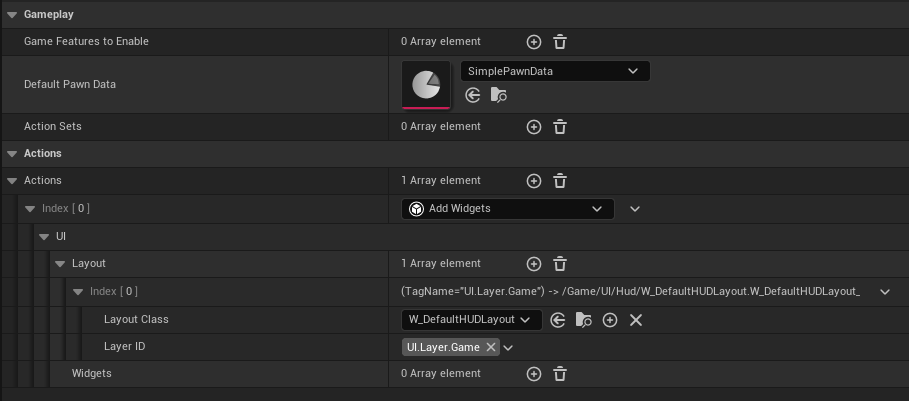
这个函数提供了两个获取方式, 

通过`PlayerState`获取 <br>或 通过 `ULyraExperienceManagerComponent` 获取.(上图中的`DefaultPawnData`)
```cpp
const ULyraPawnData* ALyraGameMode::GetPawnDataForController(const AController* InController) const
{
    // See if pawn data is already set on the player state
    /* 在GameMode中调用 */
    const ULyraPawnData* PawnData = nullptr;
    if (InController != nullptr)
    {
        if (const ALyraPlayerState* LyraPS = InController->GetPlayerState<ALyraPlayerState>())
        {
            PawnData = LyraPS->GetPawnData<ULyraPawnData>();
            if (PawnData)
            {
                return PawnData;
            }
        }
    }
    /* 在GameMode中调用 */

    /* 在PlayerState中调用 */
    check(GameState);
    ULyraExperienceManagerComponent* ExperienceComponent = GameState->FindComponentByClass<ULyraExperienceManagerComponent>();
    check(ExperienceComponent);

    if (ExperienceComponent->IsExperienceLoaded())
    {
        const ULyraExperienceDefinition* Experience = ExperienceComponent->GetCurrentExperienceChecked();
        if (Experience->DefaultPawnData != nullptr)
        {
            return Experience->DefaultPawnData;
        }

        // Experience is loaded and there's still no pawn data, fall back to the default for now
        return ULyraAssetManager::Get().GetDefaultPawnData();
    }

    // Experience not loaded yet, so there is no pawn data to be had
    return nullptr;
}
```
`PawnData`的初始化：
第一次设置是在`ALyraPlayerState`中，当`Experience`加载完成后，通过`GetPawnDataForController`获取`Experience->DefaultPawnData`.
```cpp
void ALyraPlayerState::PostInitializeComponents()
{
    //省略
    ULyraExperienceManagerComponent* ExperienceComponent = GameState->FindComponentByClass<ULyraExperienceManagerComponent>();
    ExperienceComponent->CallOrRegister_OnExperienceLoaded(FOnLyraExperienceLoaded::FDelegate::CreateUObject(this, &ThisClass::OnExperienceLoaded));
}

void ALyraPlayerState::OnExperienceLoaded(const ULyraExperienceDefinition* /*CurrentExperience*/)
{
    if (const ULyraPawnData* NewPawnData = LyraGameMode->GetPawnDataForController(GetOwningController()))
    {
        SetPawnData(NewPawnData);
    }
}
```
---
`ULyraPawnExtensionComponent` 的`PawnData`

在生成`Pawn`时，获取`PawnData`并设置到`Pawn`的`PawnExtComp`中. 

`GetPawnDataForController`将返回`PlayerState`中的`PawnData.
```cpp
APawn* ALyraGameMode::SpawnDefaultPawnAtTransform_Implementation(AController* NewPlayer, const FTransform& SpawnTransform)
{
    //省略
    if (APawn* SpawnedPawn = GetWorld()->SpawnActor<APawn>(PawnClass, SpawnTransform, SpawnInfo))
    {
        if (ULyraPawnExtensionComponent* PawnExtComp = ULyraPawnExtensionComponent::FindPawnExtensionComponent(SpawnedPawn))
        {
            if (const ULyraPawnData* PawnData = GetPawnDataForController(NewPlayer))
            {
                PawnExtComp->SetPawnData(PawnData);
            }
            else
            {
                UE_LOG(LogLyra, Error, TEXT("Game mode was unable to set PawnData on the spawned pawn [%s]."), *GetNameSafe(SpawnedPawn));
            }
        }
    }
}
```
现在有3个地方保存了`PawnData`.
1. `Experience`
2. `PlayerState`
3. `ULyraPawnExtensionComponent`

---
###### 组件注册

```cpp
/* ALyraCharacter */
UPROPERTY(/*省略*/)
TObjectPtr<ULyraPawnExtensionComponent> PawnExtComponent;

//ALyraCharacter::ALyraCharacter
PawnExtComponent = CreateDefaultSubobject<ULyraPawnExtensionComponent>(TEXT("PawnExtensionComponent"));
```
在 `OnRegister` 中通知`UGameFrameworkComponentManager`注册`PawnExtension`.
```cpp
const FName ULyraPawnExtensionComponent::NAME_ActorFeatureName("PawnExtension");
virtual FName GetFeatureName() const override { return NAME_ActorFeatureName; }

/* Called when a component is registered, after Scene is set, but before CreateRenderState_Concurrent or OnCreatePhysicsState are called. */
/* 组件注册时调用，在 Scene 设置后，但 CreateRenderState_Concurrent 或 OnCreatePhysicsState 之前 */
void ULyraPawnExtensionComponent::OnRegister()
{
    Super::OnRegister();
    //省略

   // Register with the init state system early, this will only work if this is a game world
    RegisterInitStateFeature();
}

void IGameFrameworkInitStateInterface::RegisterInitStateFeature()
{
    UObject* ThisObject = Cast<UObject>(this);
    AActor* MyActor = GetOwningActor();
    UGameFrameworkComponentManager* Manager = UGameFrameworkComponentManager::GetForActor(MyActor);

    // MyFeatureName = "PawnExtension"
    const FName MyFeatureName = GetFeatureName();

    if (MyActor && Manager)
    {
        // 这里会调用 Manager->RegisterFeatureImplementer，从而添加到 ActorFeatureMap
        Manager->RegisterFeatureImplementer(MyActor, MyFeatureName, ThisObject);
    }
    /*
        MyFeatureName = {FName} "PawnExtension"
        MyActor = {ALyraCharacter *}  (Name="B_SimpleHeroPawn_C"_0)
        ThisObject = {ULyraPawnExtensionComponent *} (Name = "PawnExtensionComponent", Owner = (Name="B_SimpleHeroPawn_C"_0))
    */
}
```

输入绑定:
```cpp
void ALyraCharacter::SetupPlayerInputComponent(UInputComponent* PlayerInputComponent)
{
    Super::SetupPlayerInputComponent(PlayerInputComponent);

    PawnExtComponent->SetupPlayerInputComponent();
}

void ULyraPawnExtensionComponent::SetupPlayerInputComponent()
{
    CheckDefaultInitialization();
}
void ULyraPawnExtensionComponent::CheckDefaultInitialization()
{
    // Before checking our progress, try progressing any other features we might depend on
    CheckDefaultInitializationForImplementers();
    // 省略
}
void IGameFrameworkInitStateInterface::CheckDefaultInitializationForImplementers()
{
    // 省略

    // 这里的 ImplementerInterface 是 ULyraHeroComponent
    IGameFrameworkInitStateInterface* ImplementerInterface;
    ImplementerInterface->CheckDefaultInitialization();
}

void ULyraHeroComponent::CheckDefaultInitialization()
{
    static const TArray<FGameplayTag> StateChain = { LyraGameplayTags::InitState_Spawned, LyraGameplayTags::InitState_DataAvailable, LyraGameplayTags::InitState_DataInitialized, LyraGameplayTags::InitState_GameplayReady };

    // This will try to progress from spawned (which is only set in BeginPlay) through the data initialization stages until it gets to gameplay ready

    /* 这将尝试从生成状态（仅在 BeginPlay 中设置）逐步通过数据初始化阶段，直到达到游戏准备就绪状态。 */
    ContinueInitStateChain(StateChain);
}

// ContinueInitStateChain 会调用 HandleChangeInitState 函数
void ULyraHeroComponent::HandleChangeInitState(UGameFrameworkComponentManager* Manager, FGameplayTag CurrentState, FGameplayTag DesiredState)
{
    /* 精简版本 , 只体现主要功能*/
    if (CurrentState == LyraGameplayTags::InitState_DataAvailable && DesiredState == LyraGameplayTags::InitState_DataInitialized)
    {
        // 初始化ASC
        PawnExtComp->InitializeAbilitySystem(LyraPS->GetLyraAbilitySystemComponent(), LyraPS);
        
        // 绑定输入
        InitializePlayerInput(Pawn->InputComponent);
        
        // 设置相机模式委托
        CameraComponent->DetermineCameraModeDelegate.BindUObject(this, &ThisClass::DetermineCameraMode);
    }
}
```
`CheckDefaultInitialization` 准备了4个Tag，传给`ContinueInitStateChain` ，<br>`ContinueInitStateChain` 又将Tag逐个发送给`HandleChangeInitState`函数，

`HandleChangeInitState` 通过Tag判断是否初始化输入绑定.

---

##### 输入绑定

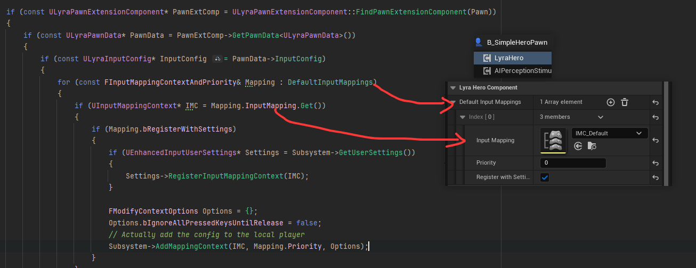

`ULyraHeroComponent`
角色的移动、技能按键都在这个类中绑定.

```cpp
virtual void InitializePlayerInput(UInputComponent* PlayerInputComponent);

//以下函数由 InitializePlayerInput 进行绑定
void Input_AbilityInputTagPressed(FGameplayTag InputTag);
void Input_AbilityInputTagReleased(FGameplayTag InputTag);

void Input_Move(const FInputActionValue& InputActionValue);
void Input_LookMouse(const FInputActionValue& InputActionValue);
void Input_LookStick(const FInputActionValue& InputActionValue);
void Input_Crouch(const FInputActionValue& InputActionValue);
void Input_AutoRun(const FInputActionValue& InputActionValue);
```

```cpp
void ULyraHeroComponent::InitializePlayerInput(UInputComponent* PlayerInputComponent)
{
    const ULyraLocalPlayer* LP = Cast<ULyraLocalPlayer>(PC->GetLocalPlayer());
    check(LP);
    UEnhancedInputLocalPlayerSubsystem* Subsystem = LP->GetSubsystem<UEnhancedInputLocalPlayerSubsystem>();
    Subsystem->ClearAllMappings();

    Subsystem->AddMappingContext(IMC, Mapping.Priority, Options);

    /* InputConfig */
    const ULyraPawnData* PawnData = PawnExtComp->GetPawnData<ULyraPawnData>();
    const ULyraInputConfig* InputConfig = PawnData->InputConfig;
    ULyraInputComponent* LyraIC = Cast<ULyraInputComponent>(PlayerInputComponent);
    LyraIC->AddInputMappings(InputConfig, Subsystem);

    // This is where we actually bind and input action to a gameplay tag, which means that Gameplay Ability Blueprints will
    // be triggered directly by these input actions Triggered events. 
    TArray<uint32> BindHandles;
    LyraIC->BindAbilityActions(InputConfig, this, &ThisClass::Input_AbilityInputTagPressed, &ThisClass::Input_AbilityInputTagReleased, /*out*/ BindHandles);

    LyraIC->BindNativeAction(InputConfig, LyraGameplayTags::InputTag_Move, ETriggerEvent::Triggered, this, &ThisClass::Input_Move, /*bLogIfNotFound=*/ false);
}
```
上回书说到: 有3个地方保存了`PawnData`.
1. `Experience`
2. `PlayerState`
3. `ULyraPawnExtensionComponent`

`BindAbilityActions`|`BindNativeAction`接收的第一个参数是`InputConfig`.
<br>下图中的 `InputConfig = InputData_SimplePawn` 传入这两个函数

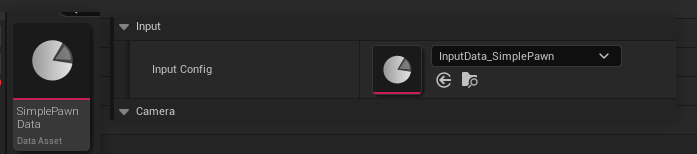

从 `Experience` 到 `InputConfig` 的完整链:

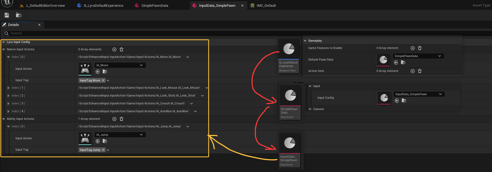

---
`UE_5.3\Templates\TP_ThirdPerson\Source\TP_ThirdPerson` 第三人称模板的输入绑定:
```cpp
void ATP_ThirdPersonCharacter::SetupPlayerInputComponent(UInputComponent* PlayerInputComponent)
{
    // Set up action bindings
    if (UEnhancedInputComponent* EnhancedInputComponent = Cast<UEnhancedInputComponent>(PlayerInputComponent)) {
        
        // Jumping
        EnhancedInputComponent->BindAction(JumpAction, ETriggerEvent::Started, this, &ACharacter::Jump);
        EnhancedInputComponent->BindAction(JumpAction, ETriggerEvent::Completed, this, &ACharacter::StopJumping);

        // Moving
        EnhancedInputComponent->BindAction(MoveAction, ETriggerEvent::Triggered, this, &ATP_ThirdPersonCharacter::Move);

        // Looking
        EnhancedInputComponent->BindAction(LookAction, ETriggerEvent::Triggered, this, &ATP_ThirdPersonCharacter::Look);
    }
}
```
Lyra的输入绑定:
```cpp
void ULyraHeroComponent::InitializePlayerInput(UInputComponent* PlayerInputComponent)
{
    // 通过Tag间接绑定
    LyraIC->BindNativeAction(InputConfig, LyraGameplayTags::InputTag_Move, ETriggerEvent::Triggered, this, &ThisClass::Input_Move);
    LyraIC->BindNativeAction(InputConfig, LyraGameplayTags::InputTag_Jump, ETriggerEvent::Started, this, &ThisClass::Input_Jump);
    // ...
}
```


方面|	第三人称模板（无Tag）|	Lyra（使用Tag）
---|---|---
耦合度|	高耦合：代码直接引用具体InputAction|	低耦合：代码只关心Tag，不关心具体实现
可配置性|	硬编码，修改按键需重新编译|	数据驱动，编辑器配置，支持热重载
重用性|	每个Character类需要重复绑定|	一次配置，多个角色复用
技能集成|	无原生支持|	与GAS无缝集成
扩展性	|差，添加新功能需修改代码|	好，可动态添加输入配置
多平台适配	|需修改代码|	同一配置适配不同平台映射

添加新输入操作:
```cpp
// 无Tag方式（需修改代码）
void AMyCharacter::SetupPlayerInputComponent(UInputComponent* PlayerInputComponent)
{
    Super::SetupPlayerInputComponent(PlayerInputComponent);
    EnhancedInputComponent->BindAction(NewAction, ...); // 硬编码
}

// 有Tag方式（只需编辑数据资产）
// 在ULyraInputConfig中添加：
// - InputAction: IA_NewAction
// - InputTag: "InputTag.NewAction"
// 代码自动支持，无需修改
```
动态切换输入配置:
```cpp
// 无Tag方式 - 难以实现
// 需要手动解除绑定再重新绑定

// 有Tag方式 - 简单
void ULyraHeroComponent::AddAdditionalInputConfig(const ULyraInputConfig* InputConfig)
{
    // 动态添加新的输入配置
    LyraIC->BindAbilityActions(InputConfig, ...);
}
```

与GAS的交互:
```cpp
// 无Tag方式 - 需要自定义实现
void AMyCharacter::OnJumpPressed()
{
    if (HasAbility("DoubleJump")) {
        ActivateDoubleJump();
    } else {
        Jump();
    }
}

// 有Tag方式 - 在GAS组件中定义支持
void ULyraHeroComponent::Input_AbilityInputTagPressed(FGameplayTag InputTag)
{
    // 自动将输入传递给技能系统
    LyraASC->AbilityInputTagPressed(InputTag);
    // 技能根据Tag自动激活
}
```

---

`LyraInputConfig` 保存两个TArray
```cpp
USTRUCT(BlueprintType)
struct FLyraInputAction
{
    UPROPERTY(EditDefaultsOnly, BlueprintReadOnly)
    TObjectPtr<const UInputAction> InputAction = nullptr;

    UPROPERTY(EditDefaultsOnly, BlueprintReadOnly, Meta = (Categories = "InputTag"))
    FGameplayTag InputTag;
};

class ULyraInputConfig : public UDataAsset
{
    // 由拥有者使用的输入动作列表。这些输入动作映射到GameplayTag，必须手动绑定。
    UPROPERTY(EditDefaultsOnly, BlueprintReadOnly, Meta = (TitleProperty = "InputAction"))
    TArray<FLyraInputAction> NativeInputActions;

    // 由拥有者使用的输入动作列表。这些输入动作映射到GameplayTag，并自动绑定到具有匹配输入标签的Ability。
    UPROPERTY(EditDefaultsOnly, BlueprintReadOnly, Meta = (TitleProperty = "InputAction"))
    TArray<FLyraInputAction> AbilityInputActions;
}
```

---

```cpp
UCLASS(Config = Input)
class ULyraInputComponent : public UEnhancedInputComponent
{}
```
继承自`UEnhancedInputComponent` ， 提供了两个便捷的模板函数用来绑定输入.
```cpp
template<class UserClass, typename FuncType>
void BindNativeAction(const ULyraInputConfig* InputConfig, const FGameplayTag& InputTag, ETriggerEvent TriggerEvent, UserClass* Object, FuncType Func, bool bLogIfNotFound);

template<class UserClass, typename PressedFuncType, typename ReleasedFuncType>
void BindAbilityActions(const ULyraInputConfig* InputConfig, UserClass* Object, PressedFuncType PressedFunc, ReleasedFuncType ReleasedFunc, TArray<uint32>& BindHandles);
```

### 摄像机系统
详细在 LyraGAS -> 角色死亡与重生 -> 摄像机系统.<br>
为什么不在这里写？ 答: 不想在这里写.
#### PlayerCameraManager
```cpp
/**
PlayerCameraManager 负责管理特定玩家的摄像机。

它定义了最终被其他系统（例如渲染器）所使用的视图属性，你可以将其视为你在世界中的虚拟眼瞳。

它可以直接计算最终的摄像机属性，也可以在影响摄像机的其他对象或角色之间进行仲裁/混合（例如从一个CameraActor混合到另一个）。

PlayerCameraManager 主要的外部职责是可靠地响应各种 Get*() 函数，例如 GetCameraViewPoint。

除此之外的大部分内容都是实现细节，可以由用户项目覆盖。

默认情况下，PlayerCameraManager 维护一个“ViewTarget”，这是摄像机关联的主要角色。

它还可以对最终的视图状态应用各种“后期”效果，例如摄像机动画、晃动、后处理效果或特殊效果（如镜头污迹）。

@see https://docs.unrealengine.com/latest/INT/Gameplay/Framework/Camera/
*/
```

`PlayerCameraManager` 在玩家控制器中生成
```cpp
/** spawn cameras for servers and owning players */
virtual void APlayerController::SpawnPlayerCameraManager();
```

[省流](https://zhuanlan.zhihu.com/p/605468663)

---

#### Lyra的摄像机
`LyraPlayerCameraManager` ：啥也没有啊，跳过

`LyraCameraMode` : 

`ELyraCameraModeBlendFunction`  用于在相机模式之间过渡的混合函数。<br>
`FLyraCameraModeView` 由相机模式产生的视图数据，用于混合相机模式。<br>
`ULyraCameraMode` 所有相机模式的基类。<br>
`ULyraCameraModeStack` 用于混合相机模式的堆栈。

`ULyraCameraMode` 可以做的事情:<br>
- 获取相机跟随的目标角色
- 计算相机的基准位置和旋转（考虑角色蹲伏等状态）
- 基于目标状态更新相机视图
- 控制相机模式的混合权重和过渡
- 提供调试信息显示

```cpp
ULyraCameraComponent* ULyraCameraMode::GetLyraCameraComponent() const
{
    return CastChecked<ULyraCameraComponent>(GetOuter());
}
```
通过Outer可以获得摄像机组件 ---> CameraMode是在摄像机组件里使用的.

```cpp
class ULyraCameraComponent : public UCameraComponent
{
    // Stack used to blend the camera modes.
    UPROPERTY()
    TObjectPtr<ULyraCameraModeStack> CameraModeStack;
}
```


---
### GameplayTag
[GameplayTag - 虚幻文档](https://dev.epicgames.com/documentation/zh-cn/unreal-engine/using-gameplay-tags-in-unreal-engine?application_version=5.3)

虚幻文档:
```
你可以使用它们传达许多不同的概念，包括以下概念：
- 对象的属性，例如 Character.Enemy.Zombie
- 对象在执行或能够执行的事情，例如 Movement.Mode.Swimming
- 游戏事件和触发器，例如 GameplayEvent.RequestReset
```
`Lyra`也使用`GameplayTag`表示了这些概念.

---

#### 在C++中使用GameplayTag

`UE_DECLARE_GAMEPLAY_TAG_EXTERN` ：在`.h`文件中用于声明`.cpp`文件中定义的标签。<br>
`UE_DEFINE_GAMEPLAY_TAG` ：在 `.cpp` 文件中用于定义 `.h` 文件中声明的标签，不带提示文本注释。<br>
`UE_DEFINE_GAMEPLAY_TAG_COMMENT` ：在 `.cpp` 文件中用于定义 `.h` 文件中声明的标签，带有提示文本注释。<br>
`UE_DEFINE_GAMEPLAY_TAG_STATIC` ：在 `.cpp` 文件中用于定义仅对定义文件可用的标签。不同于其他 `DEFINE` 宏，这不应该与 `DECLARE` 宏调用配对。

[详见: cppreference - 静态初始化](https://zh.cppreference.net/cpp/language/initialization.html)

利用 静态存储期变量在程序启动时自动初始化 的特性，来实现Tag的自动注册。

Lyra在 .cpp 文件中定义静态或全局的 FNativeGameplayTag 对象。当程序启动时，这些对象会被构造，其构造函数内部会向 UGameplayTagsManager 注册这个Tag。

```cpp
// LyraGameplayTags.cpp
namespace LyraGameplayTags
{
    // FNativeGameplayTag 的构造函数在main之前执行.
    FNativeGameplayTag Ability_ActivateFail_IsDead(...); // 构造即注册
    UE_DEFINE_GAMEPLAY_TAG_COMMENT(InputTag_Move, "InputTag.Move", "Move input.");
}
```

---

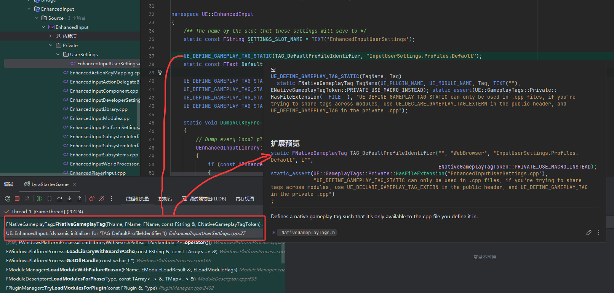

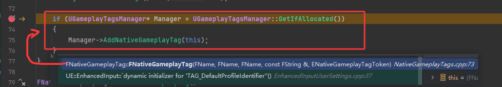


---


### GAS源码分析

`AttributeSet` <br>
管理角色属性，例如 生命值、法力值.<br>

`GameplayEffect` <br>
可修改角色的属性，例如 生命值、法力值.

`GameplayAbility` <br>
可自定义逻辑的角色技能，支持冷却、法力消耗功能.

`AbilitySystemComponent` -(简称 `ASC`) <br>
核心组件，技能都通过这个组件进行交互.<br>

---

来自未来的我:<br>
我觉得要补充的是 如何使用这个框架去设计技能系统.<br>
有些教程并没有一个很好的设计方法，功能散落在各个地方，而且某些类 管的有点宽了.<br>

整体架构:<br>
`Character`拥有`ASC`、`AttributeSet`.<br>
必须通过对`ASC`应用一个`GE`才能修改`AttributeSet`中的属性数值.

`Ability`用来写技能逻辑，当技能要对敌人造成伤害时，也是通过应用`GE`来修改敌人的生命值.

`ASC`拥有一些可绑定的委托，天然的观察者设计模式，<br>
这些委托可以让多个模块的功能联动起来，<br>
例如:触发技能，播放攻击动画,<br>
在攻击动画播放到某一帧时 向 `ASC` 发送一个`GameplayEvent`消息，<br>
(`EventTag`当然是技能和动画之间约定好的) <br>
订阅了这个消息的`Ability`收到这个`GameplayEvent`的话 就知道碰撞检测的时机到了.<br>

同样的道理，某些耦合也可以用这个方法来解.<br>
在`Lyra`中，<br>
`AttributeSet`只保存生命值 这种角色属性，当属性变化时 `AttributeSet`会将属性变化广播出去，<br>
至于角色如何响应属性变化， 例如 生命值为0 要死亡了，`AttributeSet`并不关心.<br>
而是外部来订阅`AttributeSet`的广播事件 做出各自的响应.


---

[GAS - 中文](https://github.com/BillEliot/GASDocumentation_Chinese)

```cpp
/** 
 *	UAbilitySystemComponent	
 *
 *	一个用于轻松与 AbilitySystem 的3个方面进行交互的组件：
 *	
 *	GameplayAbilities:
 *		-提供一种方式来给予/分配可使用的Ability（例如由玩家或AI使用）
 *		-提供对实例化Ability的管理（某些东西必须持有它们）
 *		-提供复制功能
 *			-Ability State必须始终在 UGameplayAbility 本身上进行复制，但 UAbilitySystemComponent 为实际的能力激活提供RPC复制
 *			
 *	GameplayEffects:
 *		-提供一个 FActiveGameplayEffectsContainer 来保存活跃的GameplayEffects
 *		-提供将GameplayEffects应用到目标或自身的功能
 *		-提供用于查询 FActiveGameplayEffectsContainers 中信息的包装器（持续时间、数值等）
 *		-提供清除/移除GameplayEffects的方法
 *		
 *	GameplayAttributes:
 *		-提供分配和初始化AttributeSets的方法
 *		-提供获取AttributeSets的方法
 *  
 */
```

---

#### GaemplayEffect
[GE-中文](cn/GameplayEffect.h)

下面的注释翻译自`GameplayEffect.h`:

`GaemplayEffect` 是应用于 `Actor` 的功能包。可以将`GE`视为影响`Actor`的某种东西。

`GE`是资产，因此在运行时是不可变的。<br>虽然存在一些例外情况（例如运行时创建`GE`的变通方法），但一旦创建和配置，数据就不会被修改。

`GE`与生命周期:<br>
- `GE`可以立即执行，也可以不立即执行。<br>如果不立即执行，则它具有一个持续时间（可以是无限的）。<br>具有持续时间的`GE`会被添加到 `ActiveGameplayEffectsContainer` 中。<br>
- 立即执行的`GE`被称为已执行，它永远不会进入活动`ActiveGameplayEffectsContainer`容器（但存在下述例外情况）。

- 无论是 立即GE 还是 持续GE，我们使用的术语都是“应用”（Applied）及其所有形式（例如Application）。因此，“CanApplyGameplayEffect”并不区分效果是否为立即效果。

- 周期性效果在每个周期都会执行（因此它既是“添加的”又是“执行的”）。

- 上述规则的一个例外是当我们在客户端预测一个`GE`（当我们领先于服务器时）。在这种情况下，我们假装它是一个持续效果，并等待服务器确认。

`GE`组件:<br>
自 Unreal 5.3 起，我们已弃用 `Monolithic UGameplayEffect`，转而依赖于 `UGameplayEffectComponents`。这些组件旨在让引擎用户能够根据其项目定制 `UGameplayEffects` 的行为，而无需派生自己的专用类。通过查看类本身，也应该能更清楚地了解 `UGameplayEffect` 的作用，因为它的属性更少。

UGameplayEffectComponents 被实现为实例化的子对象。这带来了一些负担，因为当前版本的 Unreal Engine 并未原生完美支持子对象。需要在 PostCDOCompiled 中进行一个修复步骤，其中解释了实现此功能所需的条件及其局限性。

`GE Specs`:<br>
`GE Specs`是`GE`的运行时版本。您可以将它们视为围绕`GE`（`GE`是资产）的实例化数据包装器。因此，蓝图功能更关注的是`GE Specs`而非`GE`本身，这体现在 `AbilitySystemBlueprintLibrary` 中。

---

#### AttributeSet
`FGameplayAttributeData`:<br>
```cpp
UPROPERTY(BlueprintReadOnly, Category = "Attribute")
float BaseValue;  // 基础值，仅受永久修改影响

UPROPERTY(BlueprintReadOnly, Category = "Attribute")
float CurrentValue;  // 当前值，包含所有临时效果
```

`FGameplayAttributeData` 是一个包装结构，用于统一管理游戏中的数值属性。它的核心设计目标是将属性分为两个层次：

`BaseValue`：代表属性的永久性基准值

`CurrentValue`：包含临时效果后的实时值

这种分离的设计允许系统清晰地区分永久性修改和临时性修改，为复杂的游戏效果系统（如buff/debuff、状态效果等）提供基础支持。

---

`FGameplayAttribute `:<br>
```cpp
UPROPERTY(Category = GameplayAttribute, VisibleAnywhere, BlueprintReadOnly)
FString AttributeName;  // 属性名称，用于显示和序列化

UPROPERTY(Category = GameplayAttribute, EditAnywhere)
TFieldPath<FProperty> Attribute;  // 属性字段路径，支持重定向

UPROPERTY(Category = GameplayAttribute, VisibleAnywhere)
TObjectPtr<UStruct> AttributeOwner;  // 属性所属的结构（通常是UAttributeSet子类）
```

`FGameplayAttribute` 是一个属性描述符，它本身不存储数据，而是引用属性集中的实际属性。它的核心目标是：

- 类型安全：统一访问不同类型的属性（浮点数或FGameplayAttributeData）
- 反射支持：通过UProperty系统实现编辑器集成
- 高效访问：缓存属性信息，避免运行时重复查找

为什么要使用TFieldPath而不是裸指针？
- 重定向安全：当类名或包名改变时，字段路径可以自动重定向
- 热重载兼容：支持编辑器的热重载功能
- 序列化友好：支持保存和加载时的引用解析


`UAttributeSet`:<br>
```cpp
/**
 * 定义游戏中所有GameplayAttributes的集合
 * 游戏应该继承这个类并添加FGameplayAttributeData属性来表示诸如生命值、伤害等属性
 * AttributeSets作为子对象添加到Actor中，然后注册到AbilitySystemComponent
 * 通常希望在每个项目中有多个集合并让它们相互继承
 * 你可以创建一个基础生命值集，然后创建一个玩家集来继承它并添加更多属性
 */
```

`UAttributeSet` 是 `GAS` 的数据容器。它的核心设计理念是：
- 关注点分离：属性管理逻辑与游戏逻辑分离
- 事件驱动：属性变化触发可扩展的回调
- 网络透明：客户端预测与服务器权威的平衡
- 数据驱动：支持外部数据源配置属性

---
##### 数值钳制

```cpp
/* 执行(execute) ---> 即时修改属性基础值的操作 */
/**
 * 在修改属性值之前调用。AttributeSet可以在此处进行额外的修改。返回true继续修改，返回false则丢弃此次修改。
 * 注意：此函数仅在'执行(execute)'期间调用。例如，对属性'基础值(base value)'的修改。
 *       在应用GameplayEffect（如持续5秒的+10移动速度增益）时不会调用此函数。
 */
virtual bool PreGameplayEffectExecute(struct FGameplayEffectModCallbackData &Data) { return true; }

/**
 * 在GameplayEffect执行以修改属性的基础值之后调用。此时不能再进行任何更改。
 * 注意：此函数仅在'执行(execute)'期间调用。例如，对属性'基础值(base value)'的修改。
 *       在应用GameplayEffect（如持续5秒的+10移动速度增益）时不会调用此函数。
 */
virtual void PostGameplayEffectExecute(const struct FGameplayEffectModCallbackData &Data) { }

/**
 * 在属性发生任何修改之前调用。此函数比PreAttributeModify/PostAttributeModify更底层。
 * 此处不提供额外的上下文信息，因为任何情况都可能触发此调用：执行效果、基于持续时间的效应、
 * 效果被移除、免疫被应用、堆叠规则改变等等。
 * 此函数旨在强制执行诸如"Health = Clamp(Health, 0, MaxHealth)"之类的规则，
 * 而不是处理"如果应用了伤害则触发额外事件"等逻辑。
 *
 * NewValue是一个可变引用，因此你也可以在此钳制新应用的值。
 */
virtual void PreAttributeChange(const FGameplayAttribute& Attribute, float& NewValue) { }

/** 在属性发生任何修改之后调用。 */
virtual void PostAttributeChange(const FGameplayAttribute& Attribute, float OldValue, float NewValue) { }

/**
 * 当属性聚合器存在时，在属性基础值发生任何修改之前调用此函数。
 * 此函数应强制执行钳制（假设你希望在PreAttributeChange中钳制最终值的同时也钳制基础值）。
 * 此函数不应调用与游戏逻辑相关的事件或回调。请在PreAttributeChange()中进行这些操作，
 * 该函数将在属性的最终值实际改变之前被调用。
 */
virtual void PreAttributeBaseChange(const FGameplayAttribute& Attribute, float& NewValue) const { }

/** 当属性聚合器存在时，在属性基础值发生任何修改之后调用。 */
virtual void PostAttributeBaseChange(const FGameplayAttribute& Attribute, float OldValue, float NewValue) const { }
```

`GameplayEffect` 执行流程:<br>

PreGameplayEffectExecute - 执行前拦截
```cpp
bool ULyraHealthSet::PreGameplayEffectExecute(FGameplayEffectModCallbackData &Data)
{
    // 2. 处理伤害属性修改
    if (Data.EvaluatedData.Attribute == GetDamageAttribute())
    {
        if (Data.EvaluatedData.Magnitude > 0.0f)
        {
            const bool bIsDamageFromSelfDestruct = Data.EffectSpec.GetDynamicAssetTags().HasTagExact(TAG_Gameplay_DamageSelfDestruct);

            // 2.1 伤害免疫检查
            if (Data.Target.HasMatchingGameplayTag(TAG_Gameplay_DamageImmunity) && !bIsDamageFromSelfDestruct)
            {
                Data.EvaluatedData.Magnitude = 0.0f;  // 免疫伤害
                return false;  // 阻止后续执行
            }

#if !UE_BUILD_SHIPPING
            // 省略 - 2.2 上帝模式作弊检查（仅开发版本）
#endif // #if !UE_BUILD_SHIPPING
        }
    }

    // 3. 记录修改前的值（用于Post阶段的比较和回调）
    HealthBeforeAttributeChange = GetHealth();
    MaxHealthBeforeAttributeChange = GetMaxHealth();
    /* Pre 阶段是最后能安全获取原始值的地方 */


    return true;  // 允许继续执行
}
```

使用 GameplayTag 判断免疫状态<br>
自毁例外：TAG_Gameplay_DamageSelfDestruct 可以绕过免疫（如坠落死亡、自杀技能）<br>
返回 false：完全阻止 GameplayEffect 执行，不会调用 PostGameplayEffectExecute

PostGameplayEffectExecute - 执行后处理
```cpp
void ULyraHealthSet::PostGameplayEffectExecute(const FGameplayEffectModCallbackData& Data)
{
    // 1. 处理伤害属性修改
    if (Data.EvaluatedData.Attribute == GetDamageAttribute())
    {
        // Send a standardized verb message that other systems can observe
        
        // Convert into -Health and then clamp
        SetHealth(FMath::Clamp(GetHealth() - GetDamage(), MinimumHealth, GetMaxHealth()));
        SetDamage(0.0f);
    }
    // 2. 处理治疗属性修改
    else if (Data.EvaluatedData.Attribute == GetHealingAttribute())
    {
        // 将治疗转换为生命值增加
        SetHealth(FMath::Clamp(GetHealth() + GetHealing(), MinimumHealth, GetMaxHealth()));
        SetHealing(0.0f);  // 重置临时属性
    }
    // 3. 直接生命值修改
    else if (Data.EvaluatedData.Attribute == GetHealthAttribute())
    {
        // 直接钳制，不进行额外处理
        SetHealth(FMath::Clamp(GetHealth(), MinimumHealth, GetMaxHealth()));
    }
    // 4. 最大生命值修改
    else if (Data.EvaluatedData.Attribute == GetMaxHealthAttribute())
    {
        // TODO clamp current health?
    
        // 触发最大生命值变化事件
        OnMaxHealthChanged.Broadcast(Instigator, Causer, &Data.EffectSpec, 
            Data.EvaluatedData.Magnitude, 
            MaxHealthBeforeAttributeChange, 
            GetMaxHealth());
    }

    // 5.1 生命值变化事件
    if (GetHealth() != HealthBeforeAttributeChange)
    {
        OnHealthChanged.Broadcast(Instigator, Causer, &Data.EffectSpec, 
            Data.EvaluatedData.Magnitude, 
            HealthBeforeAttributeChange, 
            GetHealth());
    }

    // 5.2 死亡事件（仅当从有生命变为无生命时）
    if ((GetHealth() <= 0.0f) && !bOutOfHealth)
    {
        OnOutOfHealth.Broadcast(Instigator, Causer, &Data.EffectSpec, 
            Data.EvaluatedData.Magnitude, 
            HealthBeforeAttributeChange, 
            GetHealth());
    }

    // 5.3 更新死亡状态
    bOutOfHealth = (GetHealth() <= 0.0f);
}
```

`属性钳制系统`:<br>
```cpp
void ULyraHealthSet::ClampAttribute(const FGameplayAttribute& Attribute, float& NewValue) const
{
    if (Attribute == GetHealthAttribute())
    {
        // 生命值不能为负，也不能超过最大生命值
        NewValue = FMath::Clamp(NewValue, 0.0f, GetMaxHealth());
    }
    else if (Attribute == GetMaxHealthAttribute())
    {
        // 最大生命值至少为1（防止除零等问题）
        NewValue = FMath::Max(NewValue, 1.0f);
    }
}

void ULyraHealthSet::PreAttributeBaseChange(const FGameplayAttribute& Attribute, float& NewValue) const
{
    Super::PreAttributeBaseChange(Attribute, NewValue);
    ClampAttribute(Attribute, NewValue);
}

void ULyraHealthSet::PreAttributeChange(const FGameplayAttribute& Attribute, float& NewValue)
{
    Super::PreAttributeChange(Attribute, NewValue);
    ClampAttribute(Attribute, NewValue);
}
```

`属性间依赖关系`:
```cpp
void ULyraHealthSet::PostAttributeChange(const FGameplayAttribute& Attribute, float OldValue, float NewValue)
{
    Super::PostAttributeChange(Attribute, OldValue, NewValue);

    // 1. 最大生命值减少时的处理
    if (Attribute == GetMaxHealthAttribute())
    {
        // 确保当前生命值不超过新的最大生命值
        if (GetHealth() > NewValue)
        {
            ULyraAbilitySystemComponent* LyraASC = GetLyraAbilitySystemComponent();
            check(LyraASC);

            // 使用Override操作强制设置生命值为最大生命值
            LyraASC->ApplyModToAttribute(GetHealthAttribute(), EGameplayModOp::Override, NewValue);
        }
    }

    // 2. 复活状态检测
    if (bOutOfHealth && (GetHealth() > 0.0f))
    {
        bOutOfHealth = false;  // 从死亡状态恢复
    }
}

/**
*	对给定属性应用就地修改。这会正确更新属性的聚合器，更新属性集属性，
*	并调用 OnDirty 回调。
*	这不会在属性集上调用 Pre/PostGameplayEffectExecute 调用。这不会进行标签检查、应用要求、免疫等操作。
*	不会创建或应用 GameplayEffectSpec！
*	这应该仅在应用真实的 GameplayEffectSpec 太慢或不可能的情况下使用。
*/
void ApplyModToAttribute(const FGameplayAttribute &Attribute, TEnumAsByte<EGameplayModOp::Type> ModifierOp, float ModifierMagnitude);
```

PostGameplayEffectExecute 已经钳制了属性.<br>
为什么PreAttributeBaseChange和PreAttributeChange还要继续钳制？<br>
所有可能的修改路径：
```cpp
修改发起 -> 可能出现的几种情况:
    ├── 1. GameplayEffect (伤害/治疗)
    │       → PreGameplayEffectExecute (免疫检查)
    │       → PostGameplayEffectExecute (业务逻辑+钳制)
    │       → PreAttributeChange (再次钳制，防御性)
    │       → 实际修改
    │       → PostAttributeChange (依赖处理)
    │
    ├── 2. GameplayEffect (直接修改Health)
    │       → PreGameplayEffectExecute
    │       → PostGameplayEffectExecute (直接钳制)
    │       → PreAttributeChange (再次钳制)
    │       → 实际修改
    │       → PostAttributeChange
    │
    ├── 3. 直接调用 SetHealth()
    │       → PreAttributeBaseChange (钳制)
    │       → 实际修改
    │       → PostAttributeChange
    │
    ├── 4. 网络复制
    │       → PreNetReceive
    │       → PreAttributeChange (钳制)
    │       → 实际修改
    │       → PostNetReceive
    │       → PostAttributeChange
    │
    └── 5. 初始化
            → InitHealth()
            → 直接设置 BaseValue 和 CurrentValue
            // 注意：Init 不触发回调！
```

---

##### 数值过程

```cpp
UAbilitySystemComponent::ApplyGameplayEffectSpecToSelf
UAbilitySystemComponent::ExecuteGameplayEffect
FActiveGameplayEffectsContainer::ExecuteActiveEffectsFrom
FActiveGameplayEffectsContainer::InternalExecuteMod
```

---

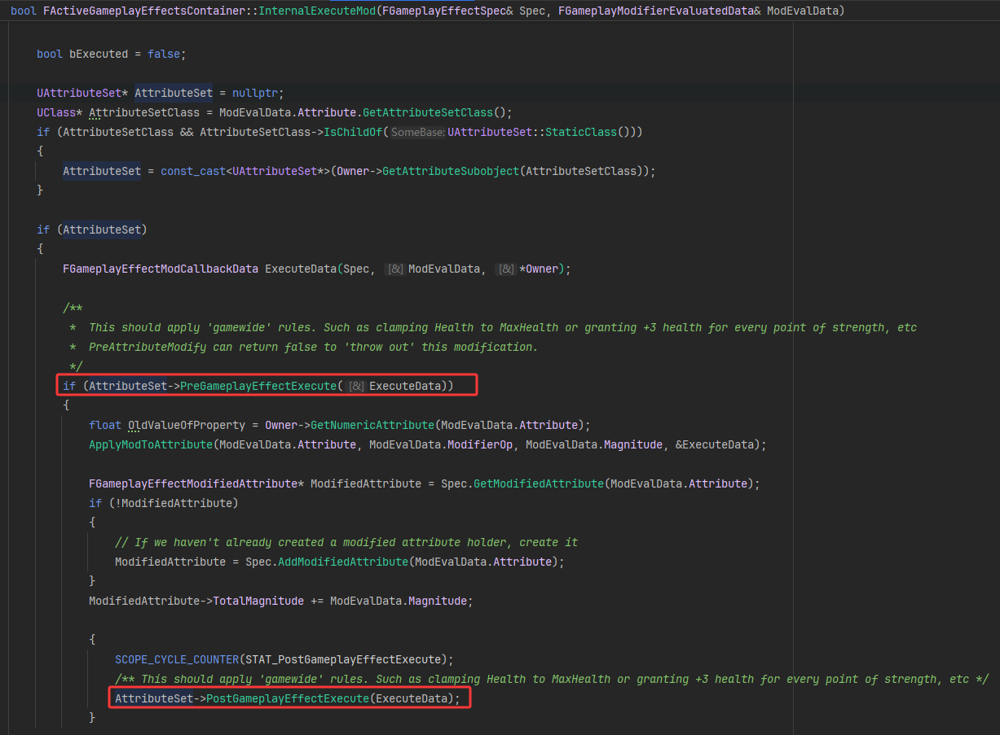


`PreGameplayEffectExecute` 可以返回 `false` 以“丢弃”本次修改。

```cpp
if (AttributeSet->PreGameplayEffectExecute(ExecuteData))
{
    ApplyModToAttribute(ModEvalData.Attribute, ModEvalData.ModifierOp, ModEvalData.Magnitude, &ExecuteData);
}
```

`ApplyModToAttribute` 获取`Attribute`的当前值，计算新值，并把新值设置过去.
```cpp
void FActiveGameplayEffectsContainer::ApplyModToAttribute(const FGameplayAttribute &Attribute, TEnumAsByte<EGameplayModOp::Type> ModifierOp, float ModifierMagnitude, const FGameplayEffectModCallbackData* ModData)
{
	CurrentModcallbackData = ModData;
	float CurrentBase = GetAttributeBaseValue(Attribute);
	float NewBase = FAggregator::StaticExecModOnBaseValue(CurrentBase, ModifierOp, ModifierMagnitude);

	SetAttributeBaseValue(Attribute, NewBase);
}

void FActiveGameplayEffectsContainer::SetAttributeBaseValue(FGameplayAttribute Attribute, float NewBaseValue)
{
    const UAttributeSet* Set = Owner->GetAttributeSubobject(Attribute.GetAttributeSetClass());
    Set->PreAttributeBaseChange(Attribute, NewBaseValue);

    FGameplayAttributeData* DataPtr = /*...*/
    DataPtr->SetBaseValue(NewBaseValue);

    InternalUpdateNumericalAttribute(Attribute, NewBaseValue, nullptr);
    Set->PostAttributeBaseChange(Attribute, OldBaseValue, NewBaseValue);
}
```
(后文还要回到这个 `SetAttributeBaseValue` 函数)

`Set->PreAttributeBaseChange`  这里又转到了`AttributeSet`.<br>
`AttributeSet` 目前的过程:
```cpp
PreGameplayEffectExecute

/* ApplyModToAttribute */
PreAttributeBaseChange
```

`InternalUpdateNumericalAttribute`
```cpp
void FActiveGameplayEffectsContainer::InternalUpdateNumericalAttribute(FGameplayAttribute Attribute, float NewValue, const FGameplayEffectModCallbackData* ModData, bool bFromRecursiveCall)
{
	const float OldValue = Owner->GetNumericAttribute(Attribute);

	Owner->SetNumericAttribute_Internal(Attribute, NewValue);
}

void UAbilitySystemComponent::SetNumericAttribute_Internal(const FGameplayAttribute &Attribute, float& NewFloatValue)
{
	
	const UAttributeSet* AttributeSet = /**/;
	Attribute.SetNumericValueChecked(NewFloatValue, const_cast<UAttributeSet*>(AttributeSet));
}

void FGameplayAttribute::SetNumericValueChecked(float& NewValue, class UAttributeSet* Dest) const
{
    FGameplayAttributeData* DataPtr = StructProperty->ContainerPtrToValuePtr<FGameplayAttributeData>(Dest);
		
	OldValue = DataPtr->GetCurrentValue();
	Dest->PreAttributeChange(*this, NewValue);
	DataPtr->SetCurrentValue(NewValue);
	Dest->PostAttributeChange(*this, OldValue, NewValue);
}
```
`AttributeSet` 目前的过程:都来自`ApplyModToAttribute`.
```cpp
PreGameplayEffectExecute

/* ApplyModToAttribute */
PreAttributeBaseChange

PreAttributeChange
PostAttributeChange
PostAttributeBaseChange
```

回到前面的`InternalExecuteMod`函数:
```cpp
bool FActiveGameplayEffectsContainer::InternalExecuteMod(FGameplayEffectSpec& Spec, FGameplayModifierEvaluatedData& ModEvalData)
{
    if (AttributeSet->PreGameplayEffectExecute(ExecuteData))
    {
        ApplyModToAttribute(ModEvalData.Attribute, ModEvalData.ModifierOp, ModEvalData.Magnitude, &ExecuteData);

        AttributeSet->PostGameplayEffectExecute(ExecuteData);
    }
}
```

`AttributeSet` 目前的过程:
```cpp
/* InternalExecuteMod */
PreGameplayEffectExecute

/* ApplyModToAttribute */
PreAttributeBaseChange

PreAttributeChange
PostAttributeChange
PostAttributeBaseChange

/* InternalExecuteMod */
PostGameplayEffectExecute
```

---

在Lyra中，伤害应用过程都在 `PostGameplayEffectExecute` 函数中，在这里`SetHealth`<br>
`SetHealth`在修改数值，

```cpp
ULyraHealthSet::SetHealth
UAbilitySystemComponent::SetNumericAttributeBase
FActiveGameplayEffectsContainer::SetAttributeBaseValue
```
`SetHealth` 又回到了前文的 `SetAttributeBaseValue` ，又触发了`PreAttributeChange`函数 钳制数值.<br>

对于`PreAttributeChange`来说，现在有两条可以到达这里的路线，<br>
第一条是前文的那一串逻辑， 第二条是`SetHealth`跳转过来的.<br>

第二条路线:<br>

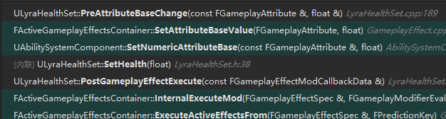

```cpp
virtual void PreAttributeChange(const FGameplayAttribute& Attribute, float& NewValue) override;
```
`PreAttributeChange` 的`float`参数是引用来的，会修改外部的值.<br>

第一条路线:
```cpp
void FActiveGameplayEffectsContainer::SetAttributeBaseValue(FGameplayAttribute Attribute, float NewBaseValue)
{
    Set->PreAttributeBaseChange(Attribute, NewBaseValue);
    DataPtr->SetBaseValue(NewBaseValue);
    InternalUpdateNumericalAttribute(Attribute, NewBaseValue, nullptr);
    Set->PostAttributeBaseChange(Attribute, OldBaseValue, NewBaseValue);
}
```
`PreAttributeBaseChange` 是引用参数 可以在里面钳制数值，<br>
只要在这里钳制了数值，后面的参数都是钳制之后的:
```cpp
/* InternalExecuteMod */
PreGameplayEffectExecute

/* ApplyModToAttribute */

/* 假设在这里就钳制 */
PreAttributeBaseChange

/* 以下函数使用的数值就是钳制过的 */

PreAttributeChange
PostAttributeChange
PostAttributeBaseChange

/* InternalExecuteMod */
PostGameplayEffectExecute
```

`InternalUpdateNumericalAttribute` 并没有引用`NewBaseValue`，而是复制值.<br>
所以`PreAttributeChange`虽然是引用参数， 但是并不会影响后面的`PostAttributeBaseChange`.

在第二条路线中，`SetHealth` 触发 `SetNumericAttributeBase`，又执行一次钳制.

---

#### AbilitySystemComponent
##### 组件初始化
这是 `ASC` 和 `AttributeSet` 的联动方式,
```cpp
APlayerState::APlayerState()
{
    AbilitySystemComponent = CreateDefaultSubobject<UMyAbilitySystemComponent>("AbilitySystemComponent");

    AttributeSetZ = CreateDefaultSubobject<UMyAttributeSet>("Attributes");
}
```
`AbilitySystemComponent`和`AttributeSetZ`是如何联动的？
也许会有一个函数 用来设置AttributeSet,例如:
```cpp
AbilitySystemComponent->SetAttributeSet(AttributeSetZ);
```
但是并没有调用这种函数，`AbilitySystemComponent`也能"感应"到`AttributeSetZ`的存在.

---

`UAbilitySystemComponent`在组件初始化时，遍历Actor组件,排除带有`Garbage`的组件(不收垃圾)，从中筛选出`UAttributeSet` 添加到`SpawnedAttributes`.
```cpp
void UAbilitySystemComponent::InitializeComponent()
{
    Super::InitializeComponent();

    // Look for DSO AttributeSets (note we are currently requiring all attribute sets to be subobjects of the same owner. This doesn't *have* to be the case forever.
    AActor *Owner = GetOwner();
    InitAbilityActorInfo(Owner, Owner);	// Default init to our outer owner

    // cleanup any bad data that may have gotten into SpawnedAttributes
    for (int32 Idx = SpawnedAttributes.Num()-1; Idx >= 0; --Idx)
    {
        if (SpawnedAttributes[Idx] == nullptr)
        {
            SpawnedAttributes.RemoveAt(Idx);
        }
    }

    TArray<UObject*> ChildObjects;
    GetObjectsWithOuter(Owner, ChildObjects, false, RF_NoFlags, EInternalObjectFlags::Garbage);

    for (UObject* Obj : ChildObjects)
    {
        UAttributeSet* Set = Cast<UAttributeSet>(Obj);
        if (Set)  
        {
            SpawnedAttributes.AddUnique(Set);
        }
    }

    SetSpawnedAttributesListDirty();
}
```
这个函数调用了`InitAbilityActorInfo`,但在未来还会手动调用,<br>例如:在`PlayerState`中存放`AbilitySystemComponent`，Owner是`PlayerState`,Avatar是玩家的`Pawn`或`Character`.
因为玩家的角色可能会死亡/重生，避免丢失技能信息，所以将ASC组件放在`PlayerState`.

- 清理SpawnedAttributes数组中的空指针元素
- 遍历拥有者的所有子对象，查找并收集AttributeSet类型的对象
- 标记属性列表为脏状态，触发后续更新

```cpp
/**
     *	Initialized the Abilities' ActorInfo - the structure that holds information about who we are acting on and who controls us.
     *      OwnerActor is the actor that logically owns this component.
     *		AvatarActor is what physical actor in the world we are acting on. Usually a Pawn but it could be a Tower, Building, Turret, etc, may be the same as Owner
     */
    virtual void InitAbilityActorInfo(AActor* InOwnerActor, AActor* InAvatarActor);
```

初始化只执行一次，所以有局限，<br>例如 在初始化以后还会手动调用`InitAbilityActorInfo`，`SpawnedAttributes`可能也需要动态添加或移除.

关于`SpawnedAttributes`的一组函数:
```cpp
/** Remove all current AttributeSets and register the ones in the passed array. Note that it's better to call Add/Remove directly when possible. */
    void SetSpawnedAttributes(const TArray<UAttributeSet*>& NewAttributeSet);

    UE_DEPRECATED(5.1, "This function will be made private. Use Add/Remove SpawnedAttributes instead")
    TArray<TObjectPtr<UAttributeSet>>& GetSpawnedAttributes_Mutable();

    /** Access the spawned attributes list when you don't intend to modify the list. */
    const TArray<UAttributeSet*>& GetSpawnedAttributes() const;

    /** Add a new attribute set */
    void AddSpawnedAttribute(UAttributeSet* Attribute);

    /** Remove an existing attribute set */
    void RemoveSpawnedAttribute(UAttributeSet* Attribute);

    /** Remove all attribute sets */
    void RemoveAllSpawnedAttributes();
```

---

##### GE处理

GE应用接口
- ApplyGameplayEffectSpecToTarget：应用GE到目标组件
- ApplyGameplayEffectSpecToSelf：应用GE到自身组件
- MakeOutgoingSpec：创建传出游戏效果规格
- MakeEffectContext：创建效果上下文

GE移除接口
- RemoveActiveGameplayEffect：通过句柄移除特定GE
- RemoveActiveGameplayEffectBySourceEffect：通过源效果类移除GE
- RemoveActiveGameplayEffect_NoReturn：无返回值的移除函数（用于委托绑定）

GE查询接口
- GetGameplayEffectCount：获取特定效果的数量
- GetGameplayEffectCount_IfLoaded：获取软引用效果的数量（如果已加载）
- GetAggregatedStackCount：获取查询结果的总堆叠计数
- GetCurrentStackCount：获取特定效果的当前堆叠计数

GE属性访问
- GetGameplayEffectDefForHandle：通过句柄获取GE定义
- GetGameplayEffectMagnitude：获取GE对特定属性的修改值
- GetGameplayEffectDuration：获取GE持续时间
- GetGameplayEffectStartTimeAndDuration：获取GE开始时间和持续时间

GE动态修改
- UpdateActiveGameplayEffectSetByCallerMagnitude：动态更新SetByCaller数值
- UpdateActiveGameplayEffectSetByCallerMagnitudes：批量更新SetByCaller数值
- SetActiveGameplayEffectLevel：更新GE等级
- SetActiveGameplayEffectLevelUsingQuery：通过查询更新GE等级
- InhibitActiveGameplayEffect：抑制/激活GE

GE元数据访问
- GetActiveGameplayEffect：获取活跃GE结构
- GetActiveGameplayEffects：获取所有活跃GE容器
- GetGameplayEffectCDO：获取GE的CDO
- GetGameplayEffectSourceTagsFromHandle：获取GE的源标签
- GetGameplayEffectTargetTagsFromHandle：获取GE的目标标签

辅助功能
- FindActiveGameplayEffectHandle：通过技能句柄查找对应的GE句柄
- GetActiveGEDebugString：获取GE调试字符串
- CaptureAttributeForGameplayEffect：捕获属性用于游戏效果计算
- OnPredictiveGameplayCueCatchup：处理预测性GameplayCue的追赶逻辑
- RecomputeGameplayEffectStartTimes：重新计算GE开始时间（网络同步）

---
##### 应用GE

```cpp
using Handle = FActiveGameplayEffectHandle;

// GE Spec
Handle BP_ApplyGameplayEffectSpecToTarget(const FGameplayEffectSpecHandle&)
Handle ApplyGameplayEffectSpecToTarget(const FGameplayEffectSpec&)

Handle BP_ApplyGameplayEffectSpecToSelf(const FGameplayEffectSpecHandle&)
Handle ApplyGameplayEffectSpecToSelf(const FGameplayEffectSpec&)

// GE
Handle BP_ApplyGameplayEffectToTarget(TSubclassOf<UGameplayEffect>)
Handle ApplyGameplayEffectToTarget(UGameplayEffect)

Handle BP_ApplyGameplayEffectToSelf(TSubclassOf<UGameplayEffect>)
Handle ApplyGameplayEffectToSelf(const UGameplayEffect)
```
无论是 GESpec 还是 GE版本, 这些ApplyGE的函数 最终调用的都是`ApplyGameplayEffectSpecToSelf`
```cpp
// GE Spec
BP_ApplyGameplayEffectSpecToTarget
->ApplyGameplayEffectSpecToTarget
-->ApplyGameplayEffectSpecToSelf

BP_ApplyGameplayEffectSpecToSelf
->ApplyGameplayEffectSpecToSelf

// GE
BP_ApplyGameplayEffectToTarget
->ApplyGameplayEffectToTarget
-->ApplyGameplayEffectSpecToTarget
--->ApplyGameplayEffectSpecToSelf

BP_ApplyGameplayEffectToSelf
->ApplyGameplayEffectToSelf
-->ApplyGameplayEffectSpecToSelf
```

Spec版本:
```cpp
Handle UAbilitySystemComponent::ApplyGameplayEffectSpecToTarget(const FGameplayEffectSpec &Spec, UAbilitySystemComponent *Target, FPredictionKey PredictionKey)
{
    SCOPE_CYCLE_COUNTER(STAT_AbilitySystemComp_ApplyGameplayEffectSpecToTarget);
    UAbilitySystemGlobals& AbilitySystemGlobals = UAbilitySystemGlobals::Get();

    if (!AbilitySystemGlobals.ShouldPredictTargetGameplayEffects())
    {
        // If we don't want to predict target effects, clear prediction key
        PredictionKey = FPredictionKey();
    }

    FActiveGameplayEffectHandle ReturnHandle;

    if (Target)
    {
        ReturnHandle = Target->ApplyGameplayEffectSpecToSelf(Spec, PredictionKey);
    }

    return ReturnHandle;
}
```
`ApplyGameplayEffectSpecToTarget` 接收一个Spec ,最终调用Target的 `ApplyGameplayEffectSpecToSelf`.

---

`ApplyGameplayEffectSpecToSelf` 逐片段分析:

```cpp
class UAbilitySystemComponent : public //....
{
    /** We allow a list of delegates to decide if the application of a Gameplay Effect can be blocked. If it's blocked, it will call the ImmunityBlockGE above */
    DECLARE_DELEGATE_RetVal_TwoParams(bool, FGameplayEffectApplicationQuery, const FActiveGameplayEffectsContainer& /*ActiveGEContainer*/, const FGameplayEffectSpec& /*GESpecToConsider*/);

    /** We allow users to setup a series of functions that must be true in order to allow a GameplayEffect to be applied */
    TArray<FGameplayEffectApplicationQuery> GameplayEffectApplicationQueries;
}

Handle UAbilitySystemComponent::ApplyGameplayEffectSpecToSelf(const FGameplayEffectSpec &Spec, FPredictionKey PredictionKey)
{
    // Check if there is a registered "application" query that can block the application
    for (const FGameplayEffectApplicationQuery& ApplicationQuery : GameplayEffectApplicationQueries)
    {
        const bool bAllowed = ApplicationQuery.Execute(ActiveGameplayEffects, Spec);
        if (!bAllowed)
        {
            return FActiveGameplayEffectHandle();
        }
    }
}
```
`GameplayEffectApplicationQueries` 目前只在`UImmunityGameplayEffectComponent`免疫组件中使用.

`UImmunityGameplayEffectComponent`允许特定的 `GameplayEffect` 阻止其他效果的应用。
```cpp
class GAMEPLAYABILITIES_API UImmunityGameplayEffectComponent : public UGameplayEffectComponent
{
    UPROPERTY(EditDefaultsOnly, BlueprintReadOnly, Category = None)
    TArray<FGameplayEffectQuery> ImmunityQueries;
}
```
- 被动免疫：当此组件所属的 GameplayEffect 激活时，会为持有者提供免疫能力
- 查询匹配：通过 FGameplayEffectQuery 定义免疫规则
- 全局拦截：在 AbilitySystemComponent 级别拦截所有效果应用尝试

```cpp
1. 免疫效果被激活 → OnActiveGameplayEffectAdded
2. 注册应用查询到ASC → GameplayEffectApplicationQueries
3. 其他效果尝试应用 → 触发AllowGameplayEffectApplication
4. 检查是否匹配免疫查询 → 匹配则阻止并广播事件
5. 免疫效果结束时 → 自动清理注册的查询
```


```cpp
bool UImmunityGameplayEffectComponent::OnActiveGameplayEffectAdded(FActiveGameplayEffectsContainer& ActiveGEContainer, FActiveGameplayEffect& ActiveGE) const
{
    FActiveGameplayEffectHandle& ActiveGEHandle = ActiveGE.Handle;
    UAbilitySystemComponent* OwnerASC = ActiveGEContainer.Owner;

    // Register our immunity query to potentially block applications of any Gameplay Effects
    FGameplayEffectApplicationQuery& BoundQuery = OwnerASC->GameplayEffectApplicationQueries.AddDefaulted_GetRef();
    BoundQuery.BindUObject(this, &UImmunityGameplayEffectComponent::AllowGameplayEffectApplication, ActiveGEHandle);

    // Now that we've bound that function, let's unbind it when we're removed.  This is safe because once we're removed, EventSet is gone.

    // 效果移除时，从ASC的查询列表中删除对应的查询
    ActiveGE.EventSet.OnEffectRemoved.AddLambda([OwnerASC, QueryToRemove = BoundQuery.GetHandle()](const FGameplayEffectRemovalInfo& RemovalInfo)
        {
            if (ensure(IsValid(OwnerASC)))
            {
                TArray<FGameplayEffectApplicationQuery>& GEAppQueries = OwnerASC->GameplayEffectApplicationQueries;
                for (auto It = GEAppQueries.CreateIterator(); It; ++It)
                {
                    if (It->GetHandle() == QueryToRemove)
                    {
                        It.RemoveCurrentSwap();
                        break;
                    }
                }
            }
        });
    return true;
}
```

免疫检测机制:
```cpp
/* 
    参数中的ActiveGEContainer是ASC中目前已经生效的GE.
    GESpecToConsider是要应用的GE Spec.
    ImmunityActiveGEHandle是从OnActiveGameplayEffectAdded传递进来的.
*/
bool UImmunityGameplayEffectComponent::AllowGameplayEffectApplication(const FActiveGameplayEffectsContainer& ActiveGEContainer,const FGameplayEffectSpec& GESpecToConsider,FActiveGameplayEffectHandle ImmunityActiveGEHandle) const
{
    const UAbilitySystemComponent* ASC = ActiveGEContainer.Owner;
    if (ASC != ImmunityActiveGEHandle.GetOwningAbilitySystemComponent())
    {
        // 安全性检查：确保免疫效果属于同一个ASC
        ensureMsgf(false, TEXT("Something went wrong..."));
        return false;
    }

    //检查免疫效果是否仍然存在
    const FActiveGameplayEffect* ActiveGE = ASC->GetActiveGameplayEffect(ImmunityActiveGEHandle);
    if (!ActiveGE || ActiveGE->bIsInhibited)
    {
        return true; // 免疫效果不存在或被抑制，允许其他效果应用
    }

    /*
        Matches 主要检查：标签查询匹配（拥有者标签、效果标签、源聚合标签、源标签）、属性修改检查、源对象验证和效果定义验证。只有所有条件都满足时才返回true，否则返回false。
    */
    for (const FGameplayEffectQuery& ImmunityQuery : ImmunityQueries)
    {
        if (!ImmunityQuery.IsEmpty() && ImmunityQuery.Matches(GESpecToConsider))
        {
            // 匹配成功：阻止效果应用并广播事件
            ASC->OnImmunityBlockGameplayEffectDelegate.Broadcast(GESpecToConsider, ActiveGE);
            return false; // 阻止应用
        }
    }
    
    return true; // 不匹配任何免疫查询，允许应用
}
```

```cpp
Handle UAbilitySystemComponent::ApplyGameplayEffectSpecToSelf(const FGameplayEffectSpec &Spec, FPredictionKey PredictionKey)
{
    // Check if there is a registered "application" query that can block the application
    // 检查注册的应用查询（GameplayEffectApplicationQueries）
    // 自定义的阻止逻辑，允许外部系统决定是否允许应用效果
    for (const FGameplayEffectApplicationQuery& ApplicationQuery : GameplayEffectApplicationQueries)
    {
        const bool bAllowed = ApplicationQuery.Execute(ActiveGameplayEffects, Spec);
        if (!bAllowed)
        {
            return FActiveGameplayEffectHandle(); // 被查询阻止
        }
    }
}
```
---

```cpp
Handle UAbilitySystemComponent::ApplyGameplayEffectSpecToSelf(const FGameplayEffectSpec &Spec, FPredictionKey PredictionKey)
{
    // check if the effect being applied actually succeeds
    // 检查效果定义自身是否允许应用
    if (!Spec.Def->CanApply(ActiveGameplayEffects, Spec))
    {
        return FActiveGameplayEffectHandle();
    }
}

bool UGameplayEffect::CanApply(const FActiveGameplayEffectsContainer& ActiveGEContainer, const FGameplayEffectSpec& GESpec) const
{
    for (const UGameplayEffectComponent* GEComponent : GEComponents)
    {
        if (GEComponent && !GEComponent->CanGameplayEffectApply(ActiveGEContainer, GESpec))
        {
            return false;
        }
    }

    return true;
}
```

GE中的`GEComponents`:

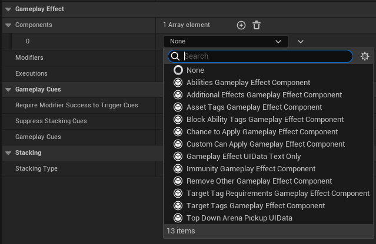

使用示例 :
```cpp
bool UChanceToApplyGameplayEffectComponent::CanGameplayEffectApply(const FActiveGameplayEffectsContainer& ActiveGEContainer, const FGameplayEffectSpec& GESpec) const
{
    const FString ContextString = GESpec.Def->GetName();
    const float CalculatedChanceToApplyToTarget = ChanceToApplyToTarget.GetValueAtLevel(GESpec.GetLevel(), &ContextString);

    // check probability to apply
    // SMALL_NUMBER = 1.e-8f = 0.00000001
    if ((CalculatedChanceToApplyToTarget < 1.f - SMALL_NUMBER) && (FMath::FRand() > CalculatedChanceToApplyToTarget))
    {
        return false;
    }

    return true;
}

//需要创建一个UGameplayEffectCustomApplicationRequirement蓝图类，并重写CanApplyGameplayEffect函数
bool UCustomCanApplyGameplayEffectComponent::CanGameplayEffectApply(const FActiveGameplayEffectsContainer& ActiveGEContainer, const FGameplayEffectSpec& GESpec) const
{
    // do custom application checks
    for (const TSubclassOf<UGameplayEffectCustomApplicationRequirement>& AppReq : ApplicationRequirements)
    {
        if (*AppReq && AppReq->GetDefaultObject<UGameplayEffectCustomApplicationRequirement>()->CanApplyGameplayEffect(GESpec.Def, GESpec, ActiveGEContainer.Owner) == false)
        {
            return false;
        }
    }

    return true;
}

bool UTargetTagRequirementsGameplayEffectComponent::CanGameplayEffectApply(const FActiveGameplayEffectsContainer& ActiveGEContainer, const FGameplayEffectSpec& GESpec) const
{
    FGameplayTagContainer Tags;
    ActiveGEContainer.Owner->GetOwnedGameplayTags(Tags);
    
    if (ApplicationTagRequirements.RequirementsMet(Tags) == false)
    {
        return false;
    }

    if (!RemovalTagRequirements.IsEmpty() && RemovalTagRequirements.RequirementsMet(Tags) == true)
    {
        return false;
    }

    return true;
}
```

---

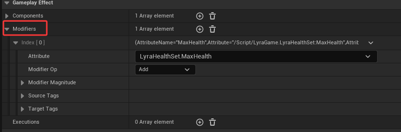
接下来检查 `Modifiers` 的有效性. 检查要修改的`Attribute`是否有效:
```cpp
Handle UAbilitySystemComponent::ApplyGameplayEffectSpecToSelf(const FGameplayEffectSpec &Spec, FPredictionKey PredictionKey)
{
    // Check AttributeSet requirements: make sure all attributes are valid
    // We may want to cache this off in some way to make the runtime check quicker.
    // We also need to handle things in the execution list
    
    /*
        检查属性集要求：确保所有属性都是有效的
        我们可能希望通过某种方式缓存此信息，以使运行时检查更快。
        我们还需要处理执行列表中的内容
    */
    for (const FGameplayModifierInfo& Mod : Spec.Def->Modifiers)
    {
        if (!Mod.Attribute.IsValid())
        {
            ABILITY_LOG(Warning, TEXT("%s has a null modifier attribute."), *Spec.Def->GetPathName());
            return FActiveGameplayEffectHandle();
        }
    }
}

bool FGameplayAttribute::IsValid() const
{
    return Attribute != nullptr;
}
```

---
```cpp
Handle UAbilitySystemComponent::ApplyGameplayEffectSpecToSelf(const FGameplayEffectSpec &Spec, FPredictionKey PredictionKey)
{
    // 客户端应将预测的即时效果视为无限持续时间
    // 这些效果稍后会被清理
    bool bTreatAsInfiniteDuration = GetOwnerRole() != ROLE_Authority && PredictionKey.IsLocalClientKey() && Spec.Def->DurationPolicy == EGameplayEffectDurationType::Instant;
}
```

---
应用GE : 
```cpp
Handle UAbilitySystemComponent::ApplyGameplayEffectSpecToSelf(const FGameplayEffectSpec &Spec, FPredictionKey PredictionKey)
{
    // 初始化效果句柄（INDEX_NONE 用于即时效果）
    FActiveGameplayEffectHandle MyHandle(INDEX_NONE);

    // 缓存是否需要调用GameplayCue
    bool bInvokeGameplayCueApplied = Spec.Def->DurationPolicy != EGameplayEffectDurationType::Instant;

    // 是否找到已存在的可堆叠效果
    bool bFoundExistingStackableGE = false;

    // 指针声明
    FActiveGameplayEffect* AppliedEffect = nullptr;
    FGameplayEffectSpec* OurCopyOfSpec = nullptr;
    TUniquePtr<FGameplayEffectSpec> StackSpec;


    if (Spec.Def->DurationPolicy != EGameplayEffectDurationType::Instant || bTreatAsInfiniteDuration)
    {
        /* 非即时效果或预测的即时效果（作为无限持续时间处理） */
        AppliedEffect = ActiveGameplayEffects.ApplyGameplayEffectSpec(Spec, PredictionKey, bFoundExistingStackableGE);
    
        if (!AppliedEffect) // 应用失败
        {
            return FActiveGameplayEffectHandle();
        }
    
        MyHandle = AppliedEffect->Handle; // 获取句柄
        OurCopyOfSpec = &(AppliedEffect->Spec); // 指向内部副本
    
        // 记录应用日志
        if (UE_LOG_ACTIVE(VLogAbilitySystem, Log))
        {
            ABILITY_VLOG(GetOwnerActor(), Log, TEXT("Applied %s"), *OurCopyOfSpec->Def->GetFName().ToString());
            for (const FGameplayModifierInfo& Modifier : Spec.Def->Modifiers)
            {
                float Magnitude = 0.f;
                Modifier.ModifierMagnitude.AttemptCalculateMagnitude(Spec, Magnitude);
                ABILITY_VLOG(GetOwnerActor(), Log, TEXT("         %s: %s %f"), 
                         *Modifier.Attribute.GetName(), 
                         *EGameplayModOpToString(Modifier.ModifierOp), 
                         Magnitude);
            }
        }
    }

    // 如果没有副本（即时效果且不是预测的无限持续时间）
    if (!OurCopyOfSpec)
    {
        // 创建临时副本
        StackSpec = MakeUnique<FGameplayEffectSpec>(Spec);
        OurCopyOfSpec = StackSpec.Get();
    
        // 全局预处理和捕获目标属性
        UAbilitySystemGlobals::Get().GlobalPreGameplayEffectSpecApply(*OurCopyOfSpec, this);
        OurCopyOfSpec->CaptureAttributeDataFromTarget(this);
    }

    // 如果是预测的即时效果（作为无限持续时间处理），设置为无限持续时间
    if (bTreatAsInfiniteDuration)
    {
        OurCopyOfSpec->SetDuration(UGameplayEffect::INFINITE_DURATION, true);
    }
}
```

---

执行GE :

触发`GameplayCue`:
```cpp
FActiveGameplayEffectHandle UAbilitySystemComponent::ApplyGameplayEffectSpecToSelf(const FGameplayEffectSpec &Spec, FPredictionKey PredictionKey)
{
    // 将全局当前应用的效果更新为我们的副本
    // 此函数默认为空 ， 什么也不做 {} 
    UAbilitySystemGlobals::Get().SetCurrentAppliedGE(OurCopyOfSpec);


    // 即使是即时效果，我们可能仍需要应用标签等数据？
    // 如果该GameplayEffect设置了bSuppressStackingCues，则仅在首次应用此GameplayEffect时触发GameplayCue
    if (!bSuppressGameplayCues && bInvokeGameplayCueApplied && AppliedEffect && !AppliedEffect->bIsInhibited && 
        (!bFoundExistingStackableGE || !Spec.Def->bSuppressStackingCues))
    {
        // 我们在此处同时添加并激活了GameplayCue
        // 在客户端上，当通过OnRep调用GameplayCue时，需要通过检查StartTime来判断
        // 该Cue是实际被"添加+激活"还是仅被添加（由于相关性导致的延迟）

        // 待修复：如果我们需要根据伤害值调整Cue强度呢？例如，当GE被强化时按比例调整Cue效果？

        if (OurCopyOfSpec->GetStackCount() > Spec.GetStackCount())
        {
            // 由于修改堆叠计数时会触发PostReplicatedChange（而非PostReplicatedAdd）
            // 我们无法确定具体修改了哪个GE实例
            // 因此需要显式地向客户端发送RPC通知，使其知道需要更新GameplayCue

            /* 堆叠计数增加：需要显式RPC通知客户端更新GameplayCue */
            UAbilitySystemGlobals::Get().GetGameplayCueManager()->InvokeGameplayCueAddedAndWhileActive_FromSpec(this, *OurCopyOfSpec, PredictionKey);
        }
        else
        {
            // 否则当GE被添加到同步数组时，这些事件会自动同步至客户端

            /* 普通情况：效果会复制到客户端时自动触发 */
            InvokeGameplayCueEvent(*OurCopyOfSpec, EGameplayCueEvent::OnActive);
            InvokeGameplayCueEvent(*OurCopyOfSpec, EGameplayCueEvent::WhileActive);
        }
    }
}
```

执行GE逻辑:
```cpp
FActiveGameplayEffectHandle UAbilitySystemComponent::ApplyGameplayEffectSpecToSelf(const FGameplayEffectSpec &Spec, FPredictionKey PredictionKey)
{
    // 1. 预测的即时效果（作为无限持续时间处理）
    if (bTreatAsInfiniteDuration)
    {
        // 预测执行GameplayCue
        if (!bSuppressGameplayCues)
        {
            UAbilitySystemGlobals::Get().GetGameplayCueManager()
            ->InvokeGameplayCueExecuted_FromSpec(this, *OurCopyOfSpec, PredictionKey);
        }
    }

    // 2. 非预测的即时效果
    else if (Spec.Def->DurationPolicy == EGameplayEffectDurationType::Instant)
    {
        // 执行即时效果（不会添加到ActiveGameplayEffects）
        ExecuteGameplayEffect(*OurCopyOfSpec, PredictionKey);
    }
}
```

---

回调通知:
```cpp
FActiveGameplayEffectHandle UAbilitySystemComponent::ApplyGameplayEffectSpecToSelf(const FGameplayEffectSpec &Spec, FPredictionKey PredictionKey)
{
    // 通知GameplayEffect及其组件已被成功应用
    Spec.Def->OnApplied(ActiveGameplayEffects, *OurCopyOfSpec, PredictionKey);

    // 获取触发者ASC
    UAbilitySystemComponent* InstigatorASC = Spec.GetContext().GetInstigatorAbilitySystemComponent();

    // 1. 通知自身：效果已应用到自身
    OnGameplayEffectAppliedToSelf(InstigatorASC, *OurCopyOfSpec, MyHandle);

    // 2. 通知触发者：效果已应用到目标
    if (InstigatorASC)
    {
        InstigatorASC->OnGameplayEffectAppliedToTarget(this, *OurCopyOfSpec, MyHandle);
    }

    // 返回效果句柄
    return MyHandle;
}
```
---
###### 总结
```cpp
应用GameplayEffectSpec到自身：
├── 检查网络权限和预测键
├── 检查应用条件（查询、CanApply、属性有效性）
├── 确定效果处理方式：
│   ├── 非即时效果 → 添加到ActiveGameplayEffects容器
│   ├── 预测的即时效果 → 作为无限持续时间效果处理
│   └── 非预测即时效果 → 立即执行，不添加到容器
├── 触发GameplayCue事件
├── 执行效果逻辑
├── 通知相关方（效果定义、自身、触发者）
└── 返回效果句柄
```

```cpp
是否具有网络权限?
├─ 否 → 返回无效句柄
└─ 是 → 继续执行

是否有有效预测键且效果为周期性?
├─ 是且是服务器 → 清除预测键，继续执行
├─ 是且是客户端 → 返回无效句柄
└─ 否 → 继续执行

是否为即时效果?
├─ 是 → 创建临时副本
└─ 否 → 添加到容器

是否应该触发Cue?
条件: !bSuppressGameplayCues && 
      bInvokeGameplayCueApplied && 
      AppliedEffect && 
      !AppliedEffect->bIsInhibited && 
      (!bFoundExistingStackableGE || !Spec.Def->bSuppressStackingCues)
├─ 是 → 继续判断堆叠情况
└─ 否 → 跳过Cue处理
```

属性修改过程:
UAbilitySystemComponent::ApplyGameplayEffectSpecToSelf<br>
->UAbilitySystemComponent::ExecuteGameplayEffect<br>
->FActiveGameplayEffectsContainer::ExecuteActiveEffectsFrom<br>
->FActiveGameplayEffectsContainer::InternalExecuteMod<br>
-->UAttributeSet::PreGameplayEffectExecute<br>
-->UAttributeSet::PreAttributeBaseChange<br>
-->UAttributeSet::PostGameplayEffectExecute<br>

PreAttributeChange 和 PostAttributeChange的调用路线:
->FActiveGameplayEffectsContainer::InternalExecuteMod<br>
->FActiveGameplayEffectsContainer::ApplyModToAttribute<br>
->FActiveGameplayEffectsContainer::SetAttributeBaseValue<br>
->....

---

##### GE的执行策略
非立即GE (持续GE) 通过定时器触发.

```cpp
FActiveGameplayEffectHandle UAbilitySystemComponent::ApplyGameplayEffectSpecToSelf(const FGameplayEffectSpec &Spec, FPredictionKey PredictionKey)
{
    if (Spec.Def->DurationPolicy != EGameplayEffectDurationType::Instant || bTreatAsInfiniteDuration)
    {
        AppliedEffect = ActiveGameplayEffects.ApplyGameplayEffectSpec(Spec, PredictionKey, bFoundExistingStackableGE);
    }
}

FActiveGameplayEffect* FActiveGameplayEffectsContainer::ApplyGameplayEffectSpec(const FGameplayEffectSpec& Spec, FPredictionKey& InPredictionKey, bool& bFoundExistingStackableGE)
{
    // Register period callbacks with the timer manager
    if (bSetPeriod && Owner && (AppliedEffectSpec.GetPeriod() > UGameplayEffect::NO_PERIOD))
    {
        FTimerManager& TimerManager = Owner->GetWorld()->GetTimerManager();
        FTimerDelegate Delegate = FTimerDelegate::CreateUObject(Owner, &UAbilitySystemComponent::ExecutePeriodicEffect, AppliedActiveGE->Handle);
            
        // The timer manager moves things from the pending list to the active list after checking the active list on the first tick so we need to execute here
        if (AppliedEffectSpec.Def->bExecutePeriodicEffectOnApplication)
        {
            TimerManager.SetTimerForNextTick(Delegate);
        }

        TimerManager.SetTimer(AppliedActiveGE->PeriodHandle, Delegate, AppliedEffectSpec.GetPeriod(), true);
    }
}

void UAbilitySystemComponent::ExecutePeriodicEffect(FActiveGameplayEffectHandle	Handle)
{
    ActiveGameplayEffects.ExecutePeriodicGameplayEffect(Handle);
}
```

立即GE 直接触发:

```cpp
FActiveGameplayEffectHandle UAbilitySystemComponent::ApplyGameplayEffectSpecToSelf(const FGameplayEffectSpec &Spec, FPredictionKey PredictionKey)
{
    else if (Spec.Def->DurationPolicy == EGameplayEffectDurationType::Instant)
    {
        // This is a non-predicted instant effect (it never gets added to ActiveGameplayEffects)
        ExecuteGameplayEffect(*OurCopyOfSpec, PredictionKey);
    }
}
```

立即GE、非立即GE， 它们的最终入口都是 <br>
`FActiveGameplayEffectsContainer::ExecuteActiveEffectsFrom`

---

##### GA的部分接口

```cpp
/**
 *	GameplayAbilities（游戏技能系统）
 *	
 *	AbilitySystemComponent在技能方面的职责是提供：
 *		- 管理技能实例（无论是每个角色持有还是每次执行单独实例）
 *			- 必须由某个对象来跟踪这些实例
 *			- 非实例化技能 *可能* 可以在没有AbilitySystemComponent中任何技能组件的情况下执行
 *				它们应该能够在GameplayAbilityActorInfo + GameplayAbility上操作
 *		
 *	作为便利功能，它可能提供一些其他特性：
 *		- 一些基本的输入绑定（无论是实例化还是非实例化技能）
 *		- 就像此组件拥有这些技能
 */
```

技能授予与移除
- GiveAbility 系列：授予技能，返回技能句柄用于后续操作
- ClearAbility 系列：移除指定技能或清除所有技能

技能激活
- TryActivateAbility 系列：尝试激活单个技能（通过句柄、类或标签）
- TryActivateAbilitiesByTag：激活所有匹配标签的技能
- TriggerAbilityFromGameplayEvent：通过游戏事件触发技能

技能查询
- GetActivatableGameplayAbilitySpecsByAllMatchingTags：获取匹配标签的可激活技能
- HasActivatableTriggeredAbility：检查是否存在可激活的触发技能

特殊管理
- SetRemoveAbilityOnEnd：设置技能在结束时自动移除
- GiveAbilityAndActivateOnce：授予并一次性激活技能

`Ability Cancelling/Interrupts`

技能取消
- CancelAbility：取消特定的技能实例
- CancelAbilityHandle：通过技能句柄取消技能
- CancelAbilities：根据标签条件取消多个技能
- CancelAllAbilities：取消所有技能
- DestroyActiveState：取消所有技能并销毁实例化技能

阻塞系统
- BlockAbilitiesWithTags/UnBlockAbilitiesWithTags：基于标签阻塞/取消阻塞技能
- BlockAbilityByInputID/UnBlockAbilityByInputID：基于输入ID阻塞/取消阻塞技能
- AreAbilityTagsBlocked：检查标签是否被阻塞
- IsAbilityInputBlocked：检查输入ID是否被阻塞

系统集成
- ApplyAbilityBlockAndCancelTags：集中处理技能阻塞和取消逻辑的核心函数
- HandleChangeAbilityCanBeCanceled：技能可取消状态变更时的回调，供子类扩展

```cpp
/**
 *	我们可以激活的技能集合。
 *		- 包含非实例化技能的CDO（类默认对象）和每次执行实例化的技能。
 *		- 角色实例化技能将是实际的实例（而非CDO）
 *		
 *	这个数组对于系统的正常运行并非绝对必要。它是为了方便'为角色授予技能'而存在的。但技能也可以在没有AbilitySystemComponent的情况下工作。
 *	例如，一个技能可以被编写为在StaticMeshActor上执行。
 *	只要该技能不需要实例化或AbilitySystemComponent提供的任何其他功能，那么它就不需要该组件也能运行。
 */

UPROPERTY(ReplicatedUsing = OnRep_ActivateAbilities, BlueprintReadOnly, Transient, Category = "Abilities")
FGameplayAbilitySpecContainer ActivatableAbilities;
```
---

##### Attribute
属性集管理
- GetSet/GetSetChecked：模板方法获取特定类型的属性集
- AddSet：添加新属性集实例
- AddAttributeSetSubobject：手动添加属性集子对象
- GetAttributeSet：获取特定类别的属性集

属性初始化与配置
- InitStats/K2_InitStats：从数据表初始化属性
- DefaultStartingData：默认起始数据配置
- SetSpawnedAttributes：批量设置属性集
- Add/RemoveSpawnedAttribute：添加/移除单个属性集
- RemoveAllSpawnedAttributes：移除所有属性集

属性查询
- HasAttributeSetForAttribute：检查属性是否存在
- GetAllAttributes：获取所有属性列表
- GetGameplayAttributeValue：获取属性值（含存在性检查）
- GetSpawnedAttributes：获取已生成的属性集列表

属性值操作
- SetNumericAttributeBase：设置属性基础值
- GetNumericAttributeBase：获取属性基础值
- GetNumericAttribute：获取属性当前值（最终值）
- GetNumericAttributeChecked：带检查的获取属性值

直接属性修饰
- ApplyModToAttribute：直接应用修饰符到属性（安全版本）
- ApplyModToAttributeUnsafe：直接应用修饰符到属性（不安全版本）
- GetFilteredAttributeValue：应用标签过滤器后获取属性值


---

##### 输入


---

##### 动画蒙太奇
从 `AvatarActor` 获取角色的骨骼网格体，再获取动画蓝图，播放蒙太奇. 就是这样.

给 `UGameplayAbility` 和 `UAbilityTask_PlayMontageAndWait` 用的,

---

##### Callbacks / Notifies
在`AbilitySystemComponent.h` 搜索 `Callbacks / Notifies` 就可以跳转到对应的位置，<br>有很多可以绑定的代理.


---

##### GameplayEffectContext
`Instigator` 是一个非常关键和常见的概念。
它的核心含义是 “引发事件的责任方” 或 “行为的发起者”。

当某个实体（通常是`Actor`，尤其是`Pawn`或`Character`）执行了一个动作，而这个动作产生了后续影响（如造成伤害、生成特效、触发事件）时，这个实体就被设置为该影响的 `Instigator。`

例如:<br>在运输船上，玩家A投掷的手雷炸死了玩家B。<br>手雷的伤害效果会将玩家A的`Pawn`设置为`Instigator`。<br>这样，游戏系统就知道这个击杀应该算在玩家A头上（增加得分、播放击杀提示等）。 <br>玩家B复活后 击杀玩家A，可以让击杀图标带有`复仇`标记。

```cpp
FGameplayEffectContextHandle UAbilitySystemComponent::MakeEffectContext() const
{
    FGameplayEffectContextHandle Context = FGameplayEffectContextHandle(UAbilitySystemGlobals::Get().AllocGameplayEffectContext());
    // By default use the owner and avatar as the instigator and causer
    check(AbilityActorInfo.IsValid());
    
    Context.AddInstigator(AbilityActorInfo->OwnerActor.Get(), AbilityActorInfo->AvatarActor.Get());
    return Context;
}
```
构造一个Context 让它承载`AbilityActorInfo`数据，

根据代码来看 `Instigator` 存储的是创建这个`EffectContext`的Actor信息.

以手雷技能为例:

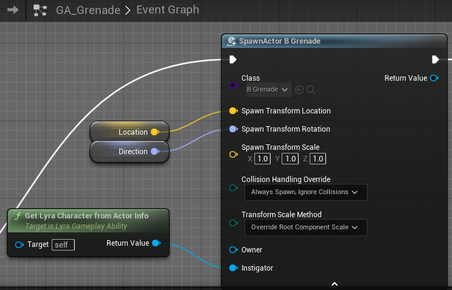

其中的`Instigator`是`ALyraCharacter`
```cpp
ALyraCharacter* ULyraGameplayAbility::GetLyraCharacterFromActorInfo() const
{
    return (CurrentActorInfo ? Cast<ALyraCharacter>(CurrentActorInfo->AvatarActor.Get()) : nullptr);
}
```

手雷爆炸，造成伤害:

为手雷伤害`GE`创建`EffectContext`，以投掷玩家作为`Instigator`。

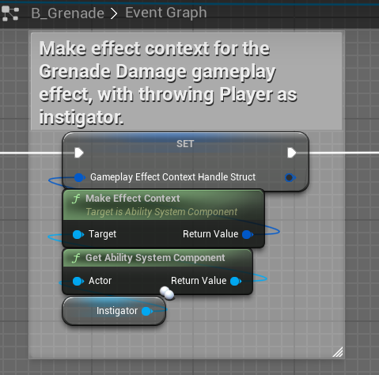

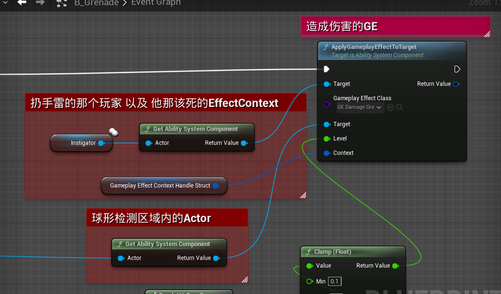

A 要扔一个手雷，炸B:
A的手雷技能创建 手雷Actor，并将手雷Actor的`Instigator`设为A，

手雷扔出去后炸到了B，

1.创建EffectContext，这个EC保存将玩家A的信息保存到`Instigator`，
```cpp
Context.AddInstigator(AbilityActorInfo->OwnerActor.Get(), AbilityActorInfo->AvatarActor.Get());
```
2.对B应用一个可以造成伤害的GE，并将`Context`传递过去.<br>
3.B受到伤害，并且他知道是A炸了他.

---
`FGameplayEffectContext` : <br>
封装一次游戏效果（如造成伤害、施加Buff）执行时的完整上下文信息.

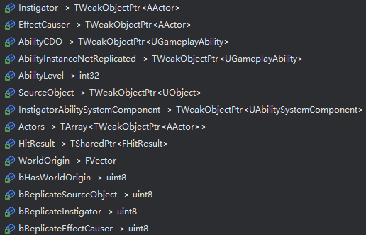

责任方信息:

`Instigator`: 效果施加者。通常是发起该效果的GameplayAbility的持有者（Owner），例如投掷手雷的玩家角色。这是最终的责任主体，用于计算击杀得分、团队判断等。

`EffectCauser`: 效果的物理引发者。这是造成效果的直接物理实体。例如，如果玩家开枪，Instigator是玩家，EffectCauser可能是子弹的Actor；如果玩家投掷手雷，Instigator是玩家，EffectCauser就是手雷的Actor。<br>
Instigator和EffectCauser两者可以相同。

`SourceObject`: 效果的来源对象。这是一个更通用的概念，可以是非Actor对象（如数据资产、技能实例等），用于将效果绑定到具体的游戏逻辑对象。

`InstigatorAbilitySystemComponent`:Instigator 对应的 AbilitySystemComponent。

Ability信息：
记录触发此效果的技能。

`AbilityCDO`:触发此效果的 GameplayAbility 类默认对象。用于在网络上识别是哪个技能。

`AbilityInstanceNotReplicated`: 触发此效果的 GameplayAbility 实例。仅在服务器端有效，不进行网络复制。

`AbilityLevel`: 执行该效果时，对应 GameplayAbility 的等级。常用于效果数值的等级缩放。


空间与目标信息:
描述效果发生的位置和影响的目标。

`HitResult`: 可选的命中结果。如果效果来自于一次射线检测或弹道预测（如枪击、近战攻击），这里会存储详细的命中信息，包括命中位置、法线、被命中的组件等。

`WorldOrigin`: 效果的世界空间起源点。例如，爆炸的中心点。

`Actors`: 与此上下文相关的其他 Actor 列表。可以用于存储多个目标或额外的相关角色。

---

#### GameplayAbility
##### 获得技能

在蓝图中创建的是 `GameplayAbility`，`GiveAbility`时 需要的是`GameplayAbilitySpec`.
```cpp
FGameplayAbilitySpecHandle GiveAbility(const FGameplayAbilitySpec& AbilitySpec);

UFUNCTION(/*...*/)
FGameplayAbilitySpecHandle K2_GiveAbility(TSubclassOf<UGameplayAbility> AbilityClass)
```

---

`UAbilitySystemComponent::GiveAbility`在赋予技能完成时，<br>
调用`UGameplayAbility::OnGiveAbility`，设置`ActorInfo`

ASC 和 GA 都拥有`ActorInfo`.

`UAbilitySystemComponent`中保存的Ability是AbilitySpec，即运行时版本,
```cpp
/**
 * 一个可激活的技能规格，存在于能力系统组件上。它既定义了技能是什么（技能类、等级、输入绑定等），
 * 也保存了必须在技能实例化/激活之外保持的运行时状态。
 */
USTRUCT(BlueprintType)
struct FGameplayAbilitySpec : public ...
```
---

`UAbilitySystemComponent` 的部分:

蓝图版本`K2_GiveAbility` :

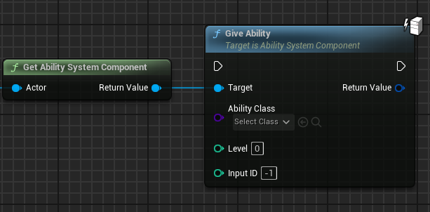

```cpp
FGameplayAbilitySpecHandle UAbilitySystemComponent::K2_GiveAbility(TSubclassOf<UGameplayAbility> AbilityClass, int32 Level /*= 0*/, int32 InputID /*= -1*/)
{
    // build and validate the ability spec
    FGameplayAbilitySpec AbilitySpec = BuildAbilitySpecFromClass(AbilityClass, Level, InputID);

    // 省略 - 检查是否有效

    // grant the ability and return the handle. This will run validation and authority checks
    return GiveAbility(AbilitySpec);
}

FGameplayAbilitySpec UAbilitySystemComponent::BuildAbilitySpecFromClass(TSubclassOf<UGameplayAbility> AbilityClass, int32 Level /*= 0*/, int32 InputID /*= -1*/)
{
    // 省略 - 检查传入的类是否有效

    // get the CDO. GiveAbility will validate so we don't need to
    UGameplayAbility* AbilityCDO = AbilityClass->GetDefaultObject<UGameplayAbility>();

    // build the ability spec
    // we need to initialize this through the constructor,
    // or the Handle won't be properly set and will cause errors further down the line
    return FGameplayAbilitySpec(AbilityClass, Level, InputID);
}
```
蓝图版本中:

`UAbilitySystemComponent` 接收一个`UGameplayAbility`类 用来构建 `AbilitySpec` 版本. 并保存在`ActivatableAbilities`

CPP版本 :
```cpp
/* ActorInfo 的来历 */
void UAbilitySystemComponent::InitAbilityActorInfo(AActor* InOwnerActor, AActor* InAvatarActor)
{
    check(AbilityActorInfo.IsValid());
    bool WasAbilityActorNull = (AbilityActorInfo->AvatarActor == nullptr);
    bool AvatarChanged = (InAvatarActor != AbilityActorInfo->AvatarActor);

    AbilityActorInfo->InitFromActor(InOwnerActor, InAvatarActor, this);
    //....
}

/* 赋予技能 */
FGameplayAbilitySpecHandle UAbilitySystemComponent::GiveAbility(const FGameplayAbilitySpec& Spec)
{
    //...
    FGameplayAbilitySpec& OwnedSpec = ActivatableAbilities.Items[ActivatableAbilities.Items.Add(Spec)];
    //...
    OnGiveAbility(OwnedSpec);
    //...

    return OwnedSpec.Handle;
}

void UAbilitySystemComponent::OnGiveAbility(FGameplayAbilitySpec& Spec)
{
    //...
    Spec.Ability->OnGiveAbility(AbilityActorInfo.Get(), Spec);
}
```

`UGameplayAbility` 的部分:
```cpp
void UGameplayAbility::OnGiveAbility(const FGameplayAbilityActorInfo* ActorInfo, const FGameplayAbilitySpec& Spec)
{
    SetCurrentActorInfo(Spec.Handle, ActorInfo);

    // If we already have an avatar set, call the OnAvatarSet event as well
    if (ActorInfo && ActorInfo->AvatarActor.IsValid())
    {
        OnAvatarSet(ActorInfo, Spec);
    }
}

void UGameplayAbility::SetCurrentActorInfo(const FGameplayAbilitySpecHandle Handle, const FGameplayAbilityActorInfo* ActorInfo) const
{
    if (IsInstantiated())
    {
        CurrentActorInfo = ActorInfo;
        CurrentSpecHandle = Handle;
    }
}

FGameplayAbilityActorInfo UGameplayAbility::GetActorInfo() const
{
    if (!ensure(CurrentActorInfo))
    {
        return FGameplayAbilityActorInfo();
    }
    return *CurrentActorInfo;
}

    /** 
     *  This is shared, cached information about the thing using us
     *	 E.g, Actor*, MovementComponent*, AnimInstance, etc.
     *	 This is hopefully allocated once per actor and shared by many abilities.
     *	 The actual struct may be overridden per game to include game specific data.
     *	 (E.g, child classes may want to cast to FMyGameAbilityActorInfo)
     */
    mutable const FGameplayAbilityActorInfo* CurrentActorInfo;
```

---

##### 实例化

在角色类中使用一个TArray存放初始赋予的技能，
```cpp
UPROPERTY(EditAnywhere,Category="Ability")
TArray<TSubclassOf<UGameplayAbility>> StartUpAbility;

ACryCharacter::BeginPlay()
{
    for (const auto Ability : StartUpAbility)
    {
	    ASC->GiveAbility(Ability);
    }
}

// UAbilitySystemComponent::GiveAbility(const FGameplayAbilitySpec& Spec)
```
`GiveAbility`接收的参数类型是`FGameplayAbilitySpec`.<br>
`ASC->GiveAbility(Ability);`使用`Ability`作为参数 构造了一个`Spec`.

触发这个版本的构造函数:
```cpp
/** Ability of the spec (Always the CDO. This should be const but too many things modify it currently) */
UPROPERTY()
TObjectPtr<UGameplayAbility> Ability;

FGameplayAbilitySpec::FGameplayAbilitySpec(TSubclassOf<UGameplayAbility> InAbilityClass, int32 InLevel, int32 InInputID, UObject* InSourceObject)
	: Ability(InAbilityClass ? InAbilityClass.GetDefaultObject() : nullptr)
```
`Spec` 把传进来的`AbilityClass`的CDO对象保存到成员变量`Ability`中.

```
每个 UCLASS 都保留一个称作 类默认对象（Class Default Object） 的对象，简称CDO。CDO 本质上是一个默认"模板"对象，由类构建函数生成，之后就不再修改。
```
简单来说 `CDO`就是蓝图中编辑的那个东西，`SpawnActor`就是将`CDO`实例化.<br>
或者说是 根据`CDO`创建一个`Actor`.

在Lyra中，将CDO里面设置的`InputTag`保存到`Spec`的`DynamicAbilityTags`.<br>
```cpp
ULyraGameplayAbility* AbilityCDO = AbilityToGrant.Ability->GetDefaultObject<ULyraGameplayAbility>();

FGameplayAbilitySpec AbilitySpec(AbilityCDO, AbilityToGrant.AbilityLevel);
AbilitySpec.SourceObject = SourceObject;
AbilitySpec.DynamicAbilityTags.AddTag(AbilityToGrant.InputTag);

const FGameplayAbilitySpecHandle AbilitySpecHandle = LyraASC->GiveAbility(AbilitySpec);
```

---

由于`Spec`的`Ability`变量是技能的`CDO`对象，在实例化到场景中、或者赋予到角色身上后，<br>
如果调用方式不正确，那么对`Ability`的一些操作可能和预期的不一致.

假设继承了`GameplayAbility`类，并且添加了一个新的函数，如果没有区分`CDO`和`Instance`，在函数调用过程中 可能调用的是`CDO`上的函数，而角色身上的是`Instance`，<br>
`Instance`不会响应函数调用，响应调用的却是`CDO`.

尤其是在需要`GetWorld`的情况下，`Instance`可以获取`World`，而`CDO`是没有`World`的，<br>
最终`GetWorld`返回空指针 导致游戏崩溃.

```cpp
UWorld* UGameplayAbility::GetWorld() const
{
	if (!IsInstantiated())
	{
		// If we are a CDO, we must return nullptr instead of calling Outer->GetWorld() to fool UObject::ImplementsGetWorld.
		return nullptr;
	}
	return GetOuter()->GetWorld();
}
```

关于赋予技能时的实例化部分: 
```cpp
UAbilitySystemComponent::GiveAbility(const FGameplayAbilitySpec& Spec)
{
    FGameplayAbilitySpec& OwnedSpec = ActivatableAbilities.Items[ActivatableAbilities.Items.Add(Spec)];
	
	if (OwnedSpec.Ability->GetInstancingPolicy() == EGameplayAbilityInstancingPolicy::InstancedPerActor)
	{
		// Create the instance at creation time
		CreateNewInstanceOfAbility(OwnedSpec, Spec.Ability);
	}
	
	OnGiveAbility(OwnedSpec);
	MarkAbilitySpecDirty(OwnedSpec, true);

	return OwnedSpec.Handle;
}
```

---

那搞了半天 技能要区分`CDO`和`Instance`，那么在激活技能时要注意什么?<br>
“什么也不需要注意”.

在蓝图中调用`TryActivateAbility`时，要传入一个`SpecHandle`，ASC根据`Handle`去找到并激活对应的`Spec`中的`Ability`.

`TryActivateAbilityByClass` 内部会获取传入的Class的`CDO`,<br>
遍历所有的`Spec`，直到找到一个`Spec` 它的`Ability`和传入的`CDO`一致，然后激活这个技能.

`TryActivateAbilitiesByTag` 根据`Tag`触发技能，实际上也是从`Spec`保存的`Ability`中寻找带有这个`Tag`的技能.<br>

部分代码 :  `AbilityTags`在下文的`Tag`这一节介绍.
```cpp
for (const FGameplayAbilitySpec& Spec : ActivatableAbilities.Items)
{		
	if (Spec.Ability && Spec.Ability->AbilityTags.HasAll(GameplayTagContainer))
}
```

---

##### 技能激活

检查消耗和CD， 失败则结束技能.

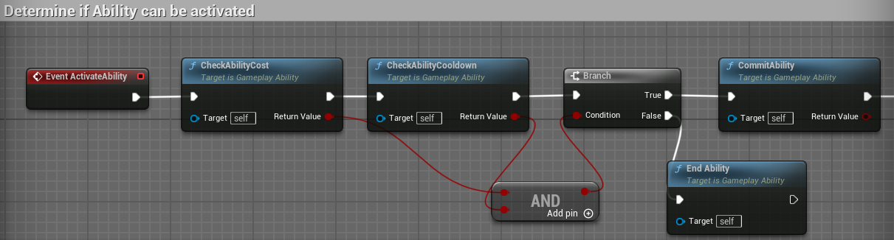

`技能消耗` :


```cpp
bool UGameplayAbility::K2_CheckAbilityCost()
{
    check(CurrentActorInfo);
    return CheckCost(CurrentSpecHandle, CurrentActorInfo);
    /* GA中保存了 Ability Spec版本的Handle, 真正的Ability Spec在 ASC组件中*/
    /* 为了简洁 省略条件 - UAbilitySystemGlobals::Get().ShouldIgnoreCosts()*/
}

bool UGameplayAbility::CheckCost(const FGameplayAbilitySpecHandle Handle, const FGameplayAbilityActorInfo* ActorInfo, OUT FGameplayTagContainer* OptionalRelevantTags) const
{
    UGameplayEffect* CostGE = GetCostGameplayEffect();
    if (CostGE)
    {
        UAbilitySystemComponent* const AbilitySystemComponent = ActorInfo->AbilitySystemComponent.Get();
        
        if (!AbilitySystemComponent->CanApplyAttributeModifiers(CostGE, GetAbilityLevel(Handle, ActorInfo), MakeEffectContext(Handle, ActorInfo)))
        {
            const FGameplayTag& CostTag = UAbilitySystemGlobals::Get().ActivateFailCostTag;

            if (OptionalRelevantTags && CostTag.IsValid())
            {
                OptionalRelevantTags->AddTag(CostTag);
            }
            return false;
        }
    }
    return true;
}

    /** Tests if all modifiers in this GameplayEffect will leave the attribute > 0.f */
bool UAbilitySystemComponent::CanApplyAttributeModifiers(const UGameplayEffect *GameplayEffect, float Level, const FGameplayEffectContextHandle& EffectContext)
{
    return ActiveGameplayEffects.CanApplyAttributeModifiers(GameplayEffect, Level, EffectContext);
}
```

检查流程:
```cpp
ActiveGameplayEffects.CanApplyAttributeModifiers() 
→ FGameplayEffectSpec::CalculateModifierMagnitudes() 
→ FGameplayEffectModifierMagnitude::AttemptCalculateMagnitude() 
→ FScalableFloat::GetValueAtLevel() 
→ FScalableFloat::EvaluateCurveAtLevel()
```

---

`技能CD` : 

以手雷技能为例 ：<br>
在`GA_Grenade`中配置 CD的GE:

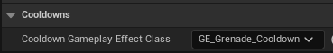

当GE加载完成时，`TargetTagsGECompoent` 的Tag将被设置到`GE`中 :

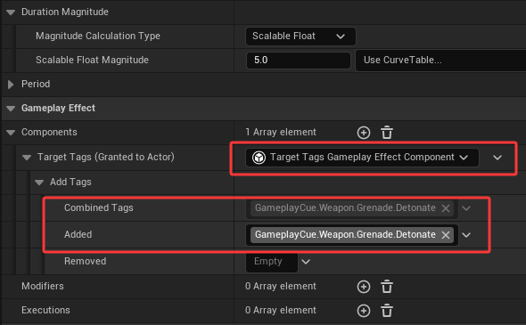

通过代码说明Tag的设置流程：
```cpp
/* 
    Called when the Gameplay Effect has finished loading.  
    This is used to catch both PostLoad (the initial load) and PostCDOCompiled (any subsequent changes) 
*/
void UGameplayEffect::OnGameplayEffectChanged()
{
    // 省略
    // Call PostLoad on components and cache tag info from components for more efficient lookups
    for (UGameplayEffectComponent* GEComponent : GEComponents)
    {
        if (GEComponent)
        {
            // Ensure the SubObject is fully loaded
            GEComponent->ConditionalPostLoad();
            GEComponent->OnGameplayEffectChanged();
        }
    }
}

void UTargetTagsGameplayEffectComponent::OnGameplayEffectChanged() const
{
    Super::OnGameplayEffectChanged();
    ApplyTargetTagChanges();
}

void UTargetTagsGameplayEffectComponent::ApplyTargetTagChanges() const
{
    UGameplayEffect* Owner = GetOwner();
    InheritableGrantedTagsContainer.ApplyTo(Owner->CachedGrantedTags);
}


UPROPERTY(EditDefaultsOnly, Category = None, meta = (DisplayName = "Add Tags", Categories = "OwnedTagsCategory"))
FInheritedTagContainer InheritableGrantedTagsContainer;
```


检查CD ：

1.`GetCooldownTags` 从 `GE_Grenade_Cooldown` 获取Tag. <br>
2.检查AbilitySystemComponent中 有没有`GE_Grenade_Cooldown`的Tag<br>
3.如果有对应的Tag 说明正在冷却中，返回False.


```cpp
bool UGameplayAbility::K2_CheckAbilityCooldown()
{
    check(CurrentActorInfo);
    return CheckCooldown(CurrentSpecHandle, CurrentActorInfo);
    /* 依旧省略 - UAbilitySystemGlobals::Get().ShouldIgnoreCooldowns() */
}

const FGameplayTagContainer* UGameplayAbility::GetCooldownTags() const
{
    UGameplayEffect* CDGE = GetCooldownGameplayEffect();
    return CDGE ? &CDGE->GetGrantedTags() : nullptr;
}

bool UGameplayAbility::CheckCooldown(const FGameplayAbilitySpecHandle Handle, const FGameplayAbilityActorInfo* ActorInfo, OUT FGameplayTagContainer* OptionalRelevantTags) const
{
    const FGameplayTagContainer* CooldownTags = GetCooldownTags();
    if (CooldownTags)
    {
        if (CooldownTags->Num() > 0)
        {
            UAbilitySystemComponent* const AbilitySystemComponent = ActorInfo->AbilitySystemComponent.Get();
            check(AbilitySystemComponent != nullptr);
            if (AbilitySystemComponent->HasAnyMatchingGameplayTags(*CooldownTags))
            {
                const FGameplayTag& CooldownTag = UAbilitySystemGlobals::Get().ActivateFailCooldownTag;

                if (OptionalRelevantTags && CooldownTag.IsValid())
                {
                    OptionalRelevantTags->AddTag(CooldownTag);
                }

                return false;
            }
        }
    }
    return true;
}
```

---

`技能提交` :
```cpp
bool UGameplayAbility::K2_CommitAbility()
{
    check(CurrentActorInfo);
    return CommitAbility(CurrentSpecHandle, CurrentActorInfo, CurrentActivationInfo);
}

bool UGameplayAbility::CommitAbility(const FGameplayAbilitySpecHandle Handle, const FGameplayAbilityActorInfo* ActorInfo, const FGameplayAbilityActivationInfo ActivationInfo, OUT FGameplayTagContainer* OptionalRelevantTags)
{
    // Last chance to fail (maybe we no longer have resources to commit since we after we started this ability activation)
    /* 
        CommitCheck - 又检查一遍CD和消耗 
        确保 Handle 和 ActorInfo中的ASC、AbilitySpec 是有效的
    */
    if (!CommitCheck(Handle, ActorInfo, ActivationInfo, OptionalRelevantTags))
    {
        return false;
    }

    /* 应用 CD和消耗 的GE*/
    CommitExecute(Handle, ActorInfo, ActivationInfo);

    // Fixme: Should we always call this or only if it is implemented? A noop may not hurt but could be bad for perf (storing a HasBlueprintCommit per instance isn't good either)
    K2_CommitExecute();

    // Broadcast this commitment
    ActorInfo->AbilitySystemComponent->NotifyAbilityCommit(this);

    return true;
}
```
技能提交的广播：可以绑定技能提交的委托
```cpp
/** A generic callback anytime an ability is committed (cost/cooldown applied) */
FGenericAbilityDelegate AbilityCommittedCallbacks;
void UAbilitySystemComponent::NotifyAbilityCommit(UGameplayAbility* Ability)
{
    AbilityCommittedCallbacks.Broadcast(Ability);
}

void UAbilityTask_WaitAbilityCommit::Activate()
{
    if (AbilitySystemComponent.IsValid())	
    {		
        OnAbilityCommitDelegateHandle = AbilitySystemComponent->AbilityCommittedCallbacks.AddUObject(this, &UAbilityTask_WaitAbilityCommit::OnAbilityCommit);
    }
}
```
`OnAbilityCommit` 函数对比Tag，如果匹配成功 -> 执行OnCommit . 


---

`结束技能`:

```cpp
void UGameplayAbility::K2_EndAbility()
{
    check(CurrentActorInfo);

    bool bReplicateEndAbility = true;
    bool bWasCancelled = false;
    EndAbility(CurrentSpecHandle, CurrentActorInfo, CurrentActivationInfo, bReplicateEndAbility, bWasCancelled);
}
```

---

##### Tag

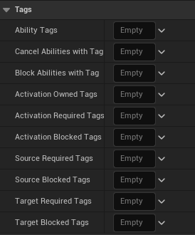

`AbilityTags`: 此技能拥有的标签. 可以根据这个标签 查找对应的技能.<br>
`CancelAbilitiesWithTag`: 技能执行前，取消拥有这些标签的技能.<br>
`BlockAbilitiesWithTag`:  技能执行前，阻挡拥有此标签的技能，下次有此标签的技能不可激活.<br>
`ActivationOwnedTags`:    技能激活前，这个标签会被添加到ASC中.<br>
`ActivationRequiredTags`: 技能激活前，要求ASC存在这些标签 才能激活技能.<br>
`ActivationBlockedTags`:  技能激活前，判断ASC是否有这些标签，如果有 不可激活技能.<br>

`SourceRequiredTags` `SourceBlockedTags`<br>
`TargetRequiredTags` `TargetBlockedTags`<br>
这些标签来自 `SendGamePlayEvent` 的 `Payload` 参数


---

###### AbilityTags
此技能拥有的标签.
```cpp
/** This ability has these tags */
UPROPERTY(/**/)
FGameplayTagContainer AbilityTags;
```

用到了`AbilityTags`的相关函数 `TryActivateAbilitiesByTag`. <br>
ASC利用`AbilityTags`查找技能，从而实现根据`Tag`激活技能:<br>
`GetActivatableGameplayAbilitySpecsByAllMatchingTags`<br>
`FindAllAbilitiesWithTags`<br>
在 `ActivatableAbilities` 容器中，查找拥有此标签的 `AbilitySpec`.

`CancelAbilities` 根据此标签判断是否取消技能.

---

###### CancelAbilitiesWithTag
该技能激活前，取消拥有这些标签的技能.
```cpp
/** Abilities with these tags are cancelled when this ability is executed */
UPROPERTY(/**/)
FGameplayTagContainer CancelAbilitiesWithTag;
```
在技能激活前，`PreActivate` 根据这个标签 取消其他技能.
```cpp
void UGameplayAbility::CallActivateAbility(/**/)
{
    PreActivate(Handle, ActorInfo, ActivationInfo, OnGameplayAbilityEndedDelegate, TriggerEventData);
    ActivateAbility(Handle, ActorInfo, ActivationInfo, TriggerEventData);
}
```

```cpp
void UAbilitySystemComponent::ApplyAbilityBlockAndCancelTags(/* */ 
const FGameplayTagContainer& CancelTags)
{
    if (bExecuteCancelTags)
    {
        CancelAbilities(&CancelTags, nullptr, RequestingAbility);
    }
}
```

---

###### BlockAbilitiesWithTag
该技能激活前，阻挡拥有此标签的技能，但是忽略本技能.<br>

例如，触发了技能A，A配置了这个标签，ASC会去查询并阻止拥有这个标签的技能，而技能A不受影响 依然会执行.
```cpp
/** Abilities with these tags are blocked while this ability is active */
UPROPERTY(/**/)
FGameplayTagContainer BlockAbilitiesWithTag;
```
在技能激活前，`PreActivate` 根据这个标签 阻挡其他技能.

```cpp
UGameplayAbility::PreActivate()
{
    Comp->ApplyAbilityBlockAndCancelTags(AbilityTags, this, true, BlockAbilitiesWithTag, true, CancelAbilitiesWithTag);
}

void UAbilitySystemComponent::ApplyAbilityBlockAndCancelTags(const FGameplayTagContainer& AbilityTags, UGameplayAbility* RequestingAbility, bool bEnableBlockTags, const FGameplayTagContainer& BlockTags, bool bExecuteCancelTags, const FGameplayTagContainer& CancelTags)
{
    BlockAbilitiesWithTags(BlockTags);
    CancelAbilities(&CancelTags, nullptr, RequestingAbility);
}
```

因为在调用`ApplyAbilityBlockAndCancelTags`时，参数都是`true`，所以精简之后就剩两行了.<br>

`BlockAbilitiesWithTags` 将参数中的Tag收集起来. 存到`BlockedAbilityTags`.

```cpp
/** Cancel all abilities with the specified tags. Will not cancel the Ignore instance */
void CancelAbilities(const FGameplayTagContainer* WithTags=nullptr, const FGameplayTagContainer* WithoutTags=nullptr, UGameplayAbility* Ignore=nullptr)
{
    for (FGameplayAbilitySpec& Spec : ActivatableAbilities.Items)
    {
        CancelAbilitySpec(Spec, Ignore);
    }
}
 ```

`CancelAbilities` 根据`CancelTags`去取消技能，<br>
因为`RequestingAbility`作为了`Ignore`参数，实际上也就是下面这一行传进去的`this`:
```cpp
UGameplayAbility::PreActivate()
{
    Comp->ApplyAbilityBlockAndCancelTags(AbilityTags, this,/*...*/);
}
```
最终在这里取消技能: 只要不是`Ignore`的技能 都要被取消.
```cpp
UAbilitySystemComponent::ApplyAbilityBlockAndCancelTags
void UAbilitySystemComponent::CancelAbilitySpec(FGameplayAbilitySpec& Spec, UGameplayAbility* Ignore)
{
    // We need to cancel spawned instance, not the CDO
    TArray<UGameplayAbility*> AbilitiesToCancel = Spec.GetAbilityInstances();
	for (UGameplayAbility* InstanceAbility : AbilitiesToCancel)
    {
        if (InstanceAbility && Ignore != InstanceAbility)
	    {
		    InstanceAbility->CancelAbility(Spec.Handle, ActorInfo, InstanceAbility->GetCurrentActivationInfo(), true);
	    }
    }
}
```

下一个技能激活时，`UGameplayAbility::CanActivateAbility` 就会查询ASC的`BlockedAbilityTags`.

如果被阻挡了，这个技能就不能被激活.

---

###### ActivationOwnedTags
这个标签会被添加到ASC中.
```cpp
/** Tags to apply to activating owner while this ability is active. These are replicated if ReplicateActivationOwnedTags is enabled in AbilitySystemGlobals. */
UPROPERTY(/**/)
FGameplayTagContainer ActivationOwnedTags;
```

在技能激活前，`PreActivate` 将这个标签添加到ASC的`GameplayTagCountContainer`容器.

---

###### ActivationRequiredTags
技能激活时，要求ASC存在这些标签 才能激活技能.
```cpp
/** This ability can only be activated if the activating actor/component has all of these tags */
UPROPERTY(/**/)
FGameplayTagContainer ActivationRequiredTags;
```

```cpp
UGameplayAbility::CanActivateAbility
UGameplayAbility::DoesAbilitySatisfyTagRequirements
```
ASC没有这些标签的话，bMissing = true，最终返回false，这个技能不能激活.
```cpp
bool UGameplayAbility::DoesAbilitySatisfyTagRequirements(/**/)
{
    static FGameplayTagContainer AbilitySystemComponentTags;
    AbilitySystemComponentTags.Reset();
    AbilitySystemComponent.GetOwnedGameplayTags(AbilitySystemComponentTags);

    if (!AbilitySystemComponentTags.HasAll(ActivationRequiredTags))
    {
        bMissing = true;
    }

    if (bMissing)
    {
        return false;
    }
}

void UAbilitySystemComponent::GetOwnedGameplayTags(FGameplayTagContainer& TagContainer) const override
{
    TagContainer.Reset();
    TagContainer.AppendTags(GameplayTagCountContainer.GetExplicitGameplayTags());
}
```

---
###### ActivationBlockedTags
如果ASC有这些标签，不可激活技能.

```cpp
/** This ability is blocked if the activating actor/component has any of these tags */
UPROPERTY(/**/)
FGameplayTagContainer ActivationBlockedTags;
```
用法同上，与`ActivationRequiredTags`相似.<br>

```cpp
bool UGameplayAbility::DoesAbilitySatisfyTagRequirements(/**/)
{
    static FGameplayTagContainer AbilitySystemComponentTags;
    AbilitySystemComponentTags.Reset();
    AbilitySystemComponent.GetOwnedGameplayTags(AbilitySystemComponentTags);

    if (AbilitySystemComponentTags.HasAny(ActivationBlockedTags))
    {
        bBlocked = true;
    }

    if (bBlocked)
    {
        return false;
    }
}
```

---
###### Required | Blocked
`SourceRequiredTags` `SourceBlockedTags`<br>
`TargetRequiredTags` `TargetBlockedTags`<br>

这些标签与`ActivationRequiredTags`的用途相似，也是在`DoesAbilitySatisfyTagRequirements`中使用.


`UAbilitySystemComponent::InternalTryActivateAbility` 传来要对比的数据，
```cpp
bool UAbilitySystemComponent::InternalTryActivateAbility(FGameplayEventData* TriggerEventData)
{
    FGameplayTagContainer* SourceTags = TriggerEventData ? &TriggerEventData->InstigatorTags : nullptr;
    FGameplayTagContainer* TargetTags = TriggerEventData ? &TriggerEventData->TargetTags : nullptr;
    CanActivateAbility(Handle, ActorInfo, SourceTags, TargetTags, &InternalTryActivateAbilityFailureTags);
}

DoesAbilitySatisfyTagRequirements(*AbilitySystemComponent, SourceTags, TargetTags, OptionalRelevantTags)
```

主要使用方式是自定义 `FGameplayEventData` 的数据.<br>
在`SendGamePlayEvent`函数中，参数`Payload`的结构体就是 `FGameplayEventData` 类型.

```cpp
/* Source Tag */
if (SourceTags->HasAny(SourceBlockedTags))
{
    bBlocked = true;
}

if (!SourceTags->HasAll(SourceRequiredTags))
{
    bMissing = true;
}

/* Target Tag */
if (TargetTags->HasAny(TargetBlockedTags))
{
    bBlocked = true;
}

if (!TargetTags->HasAll(TargetRequiredTags))
{
    bMissing = true;
}

/* --- */
if (bBlocked) { return false; }
if (bMissing) {	return false; }
```

---

#### GE组件


`GEComponent` 定义了 `GameplayEffect` 的行为方式。自 UE 5.3 引入，设计上 `UGameplayEffect` 对 `UGameplayEffectComponent` 的调用非常有限。

与提供一个庞大的 API 来实现所有期望功能不同，`GEComponent` 的实现者必须仔细阅读 `GE` 的执行流程，并注册所需的回调函数，以达到预期效果。

这使得目前 `GEComponent` 的实现基本上仅限于原生代码。

`GEComponent` 存在于 `GameplayEffect` 内部（`GameplayEffect` 通常是一个仅包含数据的蓝图资产）。因此，与 `GE` 一样，所有应用实例共享同一个 `GEComponent`。

这一点的一个不那么直观的注意事项是：`GEComponent` 不应包含任何运行时操作/实例数据（例如，每次执行存储的状态）。

必须仔细考虑在何处存储任何数据（以及何时可以评估这些数据）。早期的实现通常通过以下方式绕过此限制：

在所需的回调上存储少量的运行时数据（例如，通过委托绑定额外参数）。这可能解释了为什么某些功能仍然保留在 `UGameplayEffect` 中，而不是转移到 `UGameplayEffectComponent`。<br>未来的实现可能需要在 `FGameplayEffectSpec` 上存储额外数据（即游戏效果规格组件 - GESpec）。

---
##### 接口

```cpp
// 判断效果是否能应用到目标ASC上
// 必须返回 true，效果才能应用
virtual bool CanGameplayEffectApply(const FActiveGameplayEffectsContainer& ActiveGEContainer, const FGameplayEffectSpec& GESpec) const

/*
调用时机：持续效果被添加到 ActiveGameplayEffectsContainer 时
包括：本地预测的效果、服务器复制的效果
返回值：true=保持激活，false=抑制（休眠但不移除）
*/
virtual bool OnActiveGameplayEffectAdded(FActiveGameplayEffectsContainer& ActiveGEContainer,FActiveGameplayEffect& ActiveGE) const

/*
调用时机：即时效果执行时（仅 ROLE_Authority）
包括：周期性效果的每次周期执行
注意：周期性效果同时有 Add 和 Execute
*/
virtual void OnGameplayEffectExecuted(FActiveGameplayEffectsContainer& ActiveGEContainer,FGameplayEffectSpec& GESpec,FPredictionKey& PredictionKey) const

/*
调用时机：效果初始应用或堆叠时
不包括：周期性执行、复制传播
推荐使用：优先使用此函数而非上述两个
*/
virtual void OnGameplayEffectApplied(FActiveGameplayEffectsContainer& ActiveGEContainer,FGameplayEffectSpec& GESpec,FPredictionKey& PredictionKey) const
```

---

###### OnActiveGameplayEffectAdded

```cpp
FActiveGameplayEffectHandle UAbilitySystemComponent::ApplyGameplayEffectSpecToSelf(const FGameplayEffectSpec &Spec, FPredictionKey PredictionKey)
{
    //...
    if (Spec.Def->DurationPolicy != EGameplayEffectDurationType::Instant || bTreatAsInfiniteDuration)
    {
        AppliedEffect = ActiveGameplayEffects.ApplyGameplayEffectSpec(Spec, PredictionKey, bFoundExistingStackableGE);
    }
    //...
}

//---------- 调用路线 ---------------//
UAbilitySystemComponent::ApplyGameplayEffectSpecToSelf
FActiveGameplayEffectsContainer::ApplyGameplayEffectSpec
FActiveGameplayEffectsContainer::InternalOnActiveGameplayEffectAdded
UGameplayEffect::OnAddedToActiveContainer
```

```cpp
UAbilitySystemComponent* Owner;

void FActiveGameplayEffectsContainer::InternalOnActiveGameplayEffectAdded(FActiveGameplayEffect& Effect)
{
    const UGameplayEffect* EffectDef = Effect.Spec.Def;
    const bool bActive = EffectDef->OnAddedToActiveContainer(*this, Effect);

    constexpr bool bInvokeCuesIfEnabled = false;

    // Effect has to start inhibited, so our call to Inhibit will trigger if we should be active
    Effect.bIsInhibited = true;

    Owner->InhibitActiveGameplayEffect(Effect.Handle, !bActive, bInvokeCuesIfEnabled);
}
```

在`OnAddedToActiveContainer`中 询问所有`GEComponents` 的 `OnActiveGameplayEffectAdded`,

只有当`GEComponents`中所有的组件都返回 true 时，`bActive`最终结果才会是 true.<br>
如果任何一个组件返回 false，`bActive`的结果就变成 false.

`Effect.bIsInhibited = true`  <br>
假设 `bActive = true` ： 所有GEComponent的 OnAddedToActiveContainer的结果都是true,

在`InhibitActiveGameplayEffect`的参数中 `!bActive` 的值是`false`,<br>
if的判断内容必不相等，结果为true，触发if代码块的内容. 最终广播事件

```cpp
void UAbilitySystemComponent::InhibitActiveGameplayEffect(FActiveGameplayEffectHandle ActiveGEHandle, bool bInhibit, bool bInvokeGameplayCueEvents)
{
    /* 
        ActiveGE->bIsInhibited 是true 
        bInhibit 是 false.
        触发if. 执行Remove或者Add，最后广播事件.
    */
    if (ActiveGE->bIsInhibited != bInhibit)
    {
        ActiveGE->bIsInhibited = bInhibit;
        if (bInhibit)
        {
            //Remove GE and Modifer
        }
        else
        {
            //Add GE and Modifer
        }

        ActiveGE->EventSet.OnInhibitionChanged.Broadcast(ActiveGEHandle, ActiveGE->bIsInhibited);
    }
}
```

---
###### OnGameplayEffectApplied

```cpp
FActiveGameplayEffectHandle UAbilitySystemComponent::ApplyGameplayEffectSpecToSelf(const FGameplayEffectSpec &Spec, FPredictionKey PredictionKey)
{
    //...

    // Notify the Gameplay Effect (and its Components) that it has been successfully applied
    Spec.Def->OnApplied(ActiveGameplayEffects, *OurCopyOfSpec, PredictionKey);

    //...
}

//---------------------------//

void UGameplayEffect::OnApplied(FActiveGameplayEffectsContainer& ActiveGEContainer, FGameplayEffectSpec& GESpec, FPredictionKey& PredictionKey) const
{
    UE_VLOG(ActiveGEContainer.Owner, LogAbilitySystem, Verbose, TEXT("GameplayEffect %s applied"), *GetNameSafe(GESpec.Def));

    for (const UGameplayEffectComponent* GEComponent : GEComponents)
    {
        if (GEComponent)
        {
            GEComponent->OnGameplayEffectApplied(ActiveGEContainer, GESpec, PredictionKey);
        }
    }
}
```

---

###### OnGameplayEffectChanged

```cpp
UObject::PostLoad()
UGameplayEffect::PostLoad()
UGameplayEffect::OnGameplayEffectChanged
UGameplayEffectComponent::OnGameplayEffectChanged
```

---
###### CanGameplayEffectApply
如果不重写，那么默认返回`true`

只要有一个GE组件返回了false，这个GE就不能被应用.
```cpp
FActiveGameplayEffectHandle UAbilitySystemComponent::ApplyGameplayEffectSpecToSelf(const FGameplayEffectSpec &Spec, FPredictionKey PredictionKey)
{
    // check if the effect being applied actually succeeds
    if (!Spec.Def->CanApply(ActiveGameplayEffects, Spec))
    {
        return FActiveGameplayEffectHandle();
    }
    //...
}

bool UGameplayEffect::CanApply(const FActiveGameplayEffectsContainer& ActiveGEContainer, const FGameplayEffectSpec& GESpec) const
{
    for (const UGameplayEffectComponent* GEComponent : GEComponents)
    {
        if (GEComponent && !GEComponent->CanGameplayEffectApply(ActiveGEContainer, GESpec))
        {
            UE_VLOG(ActiveGEContainer.Owner, LogAbilitySystem, Verbose, TEXT("%s could not apply. Blocked by %s"), *GetNameSafe(GESpec.Def), *GetNameSafe(GEComponent));
            return false;
        }
    }

    return true;
}
```


---
##### AbilitiesGameplayEffectComponent


在GE激活期间 提供一个Ability，GE结束后 移除Ability.<br>GE的持续策略不能是Instant.

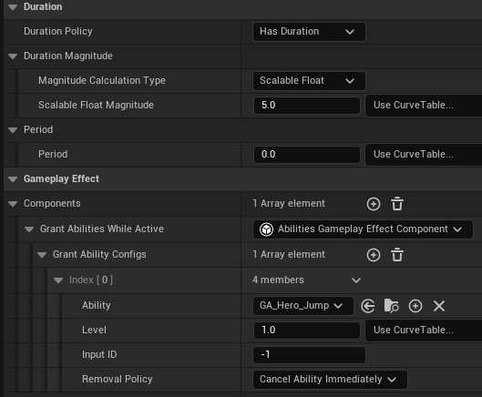

通过绑定委托实现，GE应用时 提供技能，GE结束时 移除技能.
```cpp
/** Register for the appropriate events when we're applied */
virtual bool OnActiveGameplayEffectAdded(FActiveGameplayEffectsContainer& ActiveGEContainer, FActiveGameplayEffect& ActiveGE) const override
{
    if (ActiveGEContainer.IsNetAuthority())
    {
        ActiveGE.EventSet.OnEffectRemoved.AddUObject(this, &UAbilitiesGameplayEffectComponent::OnActiveGameplayEffectRemoved);
        ActiveGE.EventSet.OnInhibitionChanged.AddUObject(this, &UAbilitiesGameplayEffectComponent::OnInhibitionChanged);
    }
    return true;
}
```

移除策略:
```cpp
switch (AbilityConfig.RemovalPolicy)
{
    case EGameplayEffectGrantedAbilityRemovePolicy::CancelAbilityImmediately:
    {
        ASC->ClearAbility(AbilitySpecDef->Handle);
        break;
    }
    case EGameplayEffectGrantedAbilityRemovePolicy::RemoveAbilityOnEnd:
    {
        ASC->SetRemoveAbilityOnEnd(AbilitySpecDef->Handle);
        break;
    }
    default:
    {
        // Do nothing to granted ability
        break;
    }
}
```
如果所属GE是`Instant` ---> 报错 : 
```cpp
EDataValidationResult UAbilitiesGameplayEffectComponent::IsDataValid(FDataValidationContext& Context) const
{
    EDataValidationResult Result = Super::IsDataValid(Context);

    if (GetOwner()->DurationPolicy == EGameplayEffectDurationType::Instant)
    {
        if (GrantAbilityConfigs.Num() > 0)
        {
            Context.AddError(FText::FormatOrdered(LOCTEXT("InstantDoesNotWorkWithGrantAbilities", "GrantAbilityConfigs does not work with Instant Effects: {0}."), FText::FromString(GetClass()->GetName())));
            Result = EDataValidationResult::Invalid;
        }
    }
    //....
}
```

---
##### AdditionalEffectsGameplayEffectComponent
```cpp
/** 添加额外的 Gameplay Effects，这些效果会在特定条件下（或无条件）尝试激活 */
```

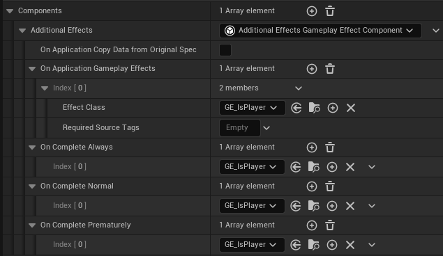

`IsDataValid`: 要求GE不能是`Instant`
```cpp
if (GetOwner()->DurationPolicy == EGameplayEffectDurationType::Instant)
{
    Context.AddError(/* ... */)
}
```

```cpp
bool UAdditionalEffectsGameplayEffectComponent::OnActiveGameplayEffectAdded(FActiveGameplayEffectsContainer& ActiveGEContainer, FActiveGameplayEffect& ActiveGE) const
{
    // We don't allow prediction of expiration (on removed) effects
    if (ActiveGEContainer.IsNetAuthority())
    {
        // When this ActiveGE gets removed, so will our events so no need to unbind this.
        ActiveGE.EventSet.OnEffectRemoved.AddUObject(this, &UAdditionalEffectsGameplayEffectComponent::OnActiveGameplayEffectRemoved, &ActiveGEContainer);
    }

    return true;
}

void UAdditionalEffectsGameplayEffectComponent::OnActiveGameplayEffectRemoved(const FGameplayEffectRemovalInfo& RemovalInfo, FActiveGameplayEffectsContainer* ActiveGEContainer) const
{
    /*
        根据GE移除的原因，选择使用 OnCompletePrematurely 还是 OnCompleteNormal .
        无论什么情况，都将OnCompleteAlways添加到数组中.
        最后遍历这个TArray，应用GE.
    */
}
```

`OnApplicationGameplayEffects` 由`OnGameplayEffectApplied`函数处理

要求ASC拥有`RequiredSourceTags` 才能添加已经选择的GE.

```cpp
void UAdditionalEffectsGameplayEffectComponent::OnGameplayEffectApplied(FActiveGameplayEffectsContainer& ActiveGEContainer, FGameplayEffectSpec& GESpec, FPredictionKey& PredictionKey) const
{
    /*
        遍历OnApplicationGameplayEffects
        每一组元素都要调用 CanApply 检查ASC是否拥有要求的Tag
        筛选符合条件的 保存在一个新的TArray中

        最后应用筛选出来的GE.
    */
}
```

---


##### AssetTagsGameplayEffectComponent
对所属的GE应用Tag ,  添加或移除Tag

GE有以下Tag : 
```cpp
class GAMEPLAYABILITIES_API UGameplayEffect
{
    // ----------------------------------------------------------------------
    //	Cached Component Data - Do not modify these at runtime!
    //	If you want to manipulate these, write your own GameplayEffectComponent
    //	set the data during PostLoad.
    // ----------------------------------------------------------------------
    
    /** Cached copy of all the tags this GE has. Data populated during PostLoad. */
    FGameplayTagContainer CachedAssetTags;

    /** Cached copy of all the tags this GE grants to its target. Data populated during PostLoad. */
    FGameplayTagContainer CachedGrantedTags;

    /** Cached copy of all the tags this GE applies to its target to block Gameplay Abilities. Data populated during PostLoad. */
    FGameplayTagContainer CachedBlockedAbilityTags;
}
```
这些Tag要求在PostLoad阶段修改.  

所以GEComponent需要重写`OnGameplayEffectChanged`函数 以修改这些Tag.

这个`GE组件`向`GE`的`CachedAssetTags`添加Tag.

---

##### BlockAbilityTagsGameplayEffectComponent
```cpp
/** 处理基于Tag阻止游戏技能激活的功能，针对拥有此GE的目标角色（Target actor） */
```
向`GE`的`CachedBlockedAbilityTags`添加Tag.

```cpp
const FGameplayTagContainer& GetBlockedAbilityTags() const { return CachedBlockedAbilityTags; }

void FActiveGameplayEffectsContainer::AddActiveGameplayEffectGrantedTagsAndModifiers
{
    // Update our owner with the blocked ability tags this GameplayEffect adds to them
	Owner->BlockAbilitiesWithTags(Effect.Spec.Def->GetBlockedAbilityTags());
}

void UAbilitySystemComponent::BlockAbilitiesWithTags(const FGameplayTagContainer& Tags)
{
	BlockedAbilityTags.UpdateTagCount(Tags, 1);
}
```
在应用这个`GE`时，`ASC`将`CachedBlockedAbilityTags`的内容保存到`BlockedAbilityTags`.<br>

```cpp
UAbilitySystemComponent::TryActivateAbility
UAbilitySystemComponent::InternalTryActivateAbility
UGameplayAbility::CanActivateAbility

bool UGameplayAbility::DoesAbilitySatisfyTagRequirements
{
    if (AbilitySystemComponent.AreAbilityTagsBlocked(AbilityTags))
	{
		bBlocked = true;
	}

    if (bBlocked)
	{
		if (OptionalRelevantTags && BlockedTag.IsValid())
		{
			OptionalRelevantTags->AddTag(BlockedTag);
		}
		return false;
	}
}

bool UAbilitySystemComponent::AreAbilityTagsBlocked(const FGameplayTagContainer& Tags) const
{
	// Expand the passed in tags to get parents, not the blocked tags
	return Tags.HasAny(BlockedAbilityTags.GetExplicitGameplayTags());
}
```

激活技能时，检查`GA`的`AbilityTags` 是否在`CachedBlockedAbilityTags`中.<br>
如果这个技能被阻挡了，返回`false` 不满足技能的激活要求.


---
##### ChanceToApplyGameplayEffectComponent
```cpp
/** 为 Gameplay Effect 的应用条件施加概率控制。*/
```

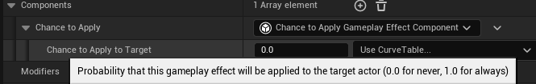

```cpp
bool UChanceToApplyGameplayEffectComponent::CanGameplayEffectApply(const FActiveGameplayEffectsContainer& ActiveGEContainer, const FGameplayEffectSpec& GESpec) const
{
    const FString ContextString = GESpec.Def->GetName();
    const float CalculatedChanceToApplyToTarget = ChanceToApplyToTarget.GetValueAtLevel(GESpec.GetLevel(), &ContextString);

    // check probability to apply
    if ((CalculatedChanceToApplyToTarget < 1.f - SMALL_NUMBER) && (FMath::FRand() > CalculatedChanceToApplyToTarget))
    {
        return false;
    }

    return true;
}
```

`1.f - SMALL_NUMBER` 近似于1.0 ， 极限是1.0

假设 `Chance to Apply to Target`是0.5，

```cpp
if ((0.5 < 0.9999999f ) && (FMath::FRand() > 0.5))
{
    return false;
}
return true;
```

0.5 < 0.9999999 判断为`true`，<br>如果随机数 > 0.5，判断为`true`，if整体判断为`true`， 返回`false` , 不应用GE.

假设 `Chance to Apply to Target`是1.0，

```cpp
if ((1.0 < 0.9999999f ) && (FMath::FRand() > 1.0))
{
    return false;
}
return true;
```

1.0 > 9999999f，判断为`false`, 而`&&`是两个bool都为`true`时 才判断为`true`<br>但现在第一个bool已经算出来是`false`，第二个bool就不执行，直接返回`false`。

因此，当概率为1.0时，不做随机数判断，直接跳过if，并返回`true`.

---


##### CustomCanApplyGameplayEffectComponent
要求自定义`UGameplayEffectCustomApplicationRequirement`类，可以是蓝图类.

并重写这个类的`CanApplyGameplayEffect`函数.


---


##### ImmunityGameplayEffectComponent
```cpp
/*
    免疫效果是阻止其他GameplayEffectSpec的应用。
    此机制在ASC上注册一个全局处理器，以阻止其他GESpec的应用。
*/
```

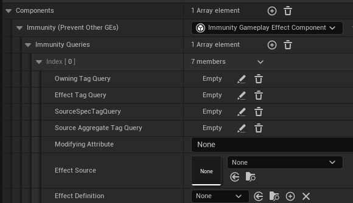

ASC有一个专门在应用GE时使用的免疫委托 : `GameplayEffectApplicationQueries`

```cpp
/*​ 当GameplayEffectSpec因免疫机制被一个ActiveGameplayEffect阻止时触发通知 */
DECLARE_MULTICAST_DELEGATE_TwoParams(FImmunityBlockGE, const FGameplayEffectSpec& /*BlockedSpec*/, const FActiveGameplayEffect* /*ImmunityGameplayEffect*/);

/*​
    我们允许通过一个委托列表来决定是否阻止某个Gameplay Effect的应用。
    如果被阻止，将调用上述的ImmunityBlockGE（免疫阻止Gameplay Effect）函数 
*/
DECLARE_DELEGATE_RetVal_TwoParams(bool, FGameplayEffectApplicationQuery, const FActiveGameplayEffectsContainer& /*ActiveGEContainer*/, const FGameplayEffectSpec& /*GESpecToConsider*/);

// -------------- //

class UAbilitySystemComponent //...
{
    /**​ 我们允许用户设置一系列必须为真的条件函数，只有当这些条件全部满足时，才允许应用GameplayEffect */
    TArray<FGameplayEffectApplicationQuery> GameplayEffectApplicationQueries;
}

FActiveGameplayEffectHandle UAbilitySystemComponent::ApplyGameplayEffectSpecToSelf(const FGameplayEffectSpec &Spec, FPredictionKey PredictionKey)
{
    // Check if there is a registered "application" query that can block the application
    for (const FGameplayEffectApplicationQuery& ApplicationQuery : GameplayEffectApplicationQueries)
    {
        const bool bAllowed = ApplicationQuery.Execute(ActiveGameplayEffects, Spec);
        if (!bAllowed)
        {
            return FActiveGameplayEffectHandle();
        }
    }
}
```
`ApplyGameplayEffectSpecToSelf` 要执行免疫委托的函数，当返回`false`时 放弃应用GE.

`UImmunityGameplayEffectComponent` 的目标就是绑定这个委托，<br>检查即将到来的GE的Tag 是否与`免疫组件`中定义的Tag一致，如果一致 ---> 返回`false`，<br>`ApplyGameplayEffectSpecToSelf`直接返回，放弃应用GE.

FGameplayEffectQuery :

Query中的每个设置条件都必须匹配，Query才能匹配。即，各个Query元素是逻辑与（AND）关系。 

```cpp
/** 查询匹配该GE（GameplayEffect）所赋予的标签 */
FGameplayTagQuery OwningTagQuery;

/** 查询匹配该GE本身拥有的标签 */
FGameplayTagQuery EffectTagQuery;

/** 查询匹配该GE来源的规格标签 */
/* DisplayName = SourceSpecTagQuery */
FGameplayTagQuery SourceTagQuery;

/** 查询匹配该GE来源拥有的所有标签 */
FGameplayTagQuery SourceAggregateTagQuery;

/** 匹配修改给定属性的GameplayEffects */
FGameplayAttribute ModifyingAttribute;

/** 匹配来自此来源的GameplayEffects */
TObjectPtr<const UObject> EffectSource;

/** 匹配具有此定义的GameplayEffects */
TSubclassOf<UGameplayEffect> EffectDefinition;
```

免疫组件的行为:
```cpp
bool UImmunityGameplayEffectComponent::OnActiveGameplayEffectAdded(FActiveGameplayEffectsContainer& ActiveGEContainer, FActiveGameplayEffect& ActiveGE) const
{
    FActiveGameplayEffectHandle& ActiveGEHandle = ActiveGE.Handle;
    UAbilitySystemComponent* OwnerASC = ActiveGEContainer.Owner;

    // Register our immunity query to potentially block applications of any Gameplay Effects
    FGameplayEffectApplicationQuery& BoundQuery = OwnerASC->GameplayEffectApplicationQueries.AddDefaulted_GetRef();
    BoundQuery.BindUObject(this, &UImmunityGameplayEffectComponent::AllowGameplayEffectApplication, ActiveGEHandle);

    ActiveGE.EventSet.OnEffectRemoved.AddLambda([OwnerASC, QueryToRemove = BoundQuery.GetHandle()]...)
    {
        // 当免疫效果被移除时，从ASC的查询列表中删除对应的检查函数
        It.RemoveCurrentSwap();
    };
}

bool UImmunityGameplayEffectComponent::AllowGameplayEffectApplication(const FActiveGameplayEffectsContainer& ActiveGEContainer, const FGameplayEffectSpec& GESpecToConsider, FActiveGameplayEffectHandle ImmunityActiveGEHandle) const
{
    /* 确保免疫效果和要检查的效果属于同一个角色 */
    if (ASC != ImmunityActiveGEHandle.GetOwningAbilitySystemComponent())
    {
        return false;
    }

    if (!ActiveGE || ActiveGE->bIsInhibited)
    {
        return true;  // 如果免疫效果无效或被抑制，允许新效果应用
    }

    /* 遍历免疫查询，检查是否匹配 */
    /* 如果匹配，广播免疫事件并返回false(不允许应用) */
}
```


##### TargetTagRequirementsGameplayEffectComponent
`ApplicationTagRequirements `:<br>
GE应用时检查，如果不满足要求，放弃Effect应用

`OngoingTagRequirements`:控制GE的激活/暂停<br>
GE应用后持续要求,不满足时 GE进入"抑制"状态，存在但不生效，

`RemovalTagRequirements `:GE移除的条件<br>
满足条件时立即移除整个GE. <br>例如:死亡时移除大龙buff :
```cpp
RemovalTagRequirements.RequireTags.AddTag("State.Dead");
```

```cpp
bool UTargetTagRequirementsGameplayEffectComponent::CanGameplayEffectApply(const FActiveGameplayEffectsContainer& ActiveGEContainer, const FGameplayEffectSpec& GESpec) const
{
    FGameplayTagContainer Tags;
    ActiveGEContainer.Owner->GetOwnedGameplayTags(Tags);

    /* 检查 ApplicationTagRequirements - 如果不满足，拒绝应用 */
    if (ApplicationTagRequirements.RequirementsMet(Tags) == false)
    {
        return false;
    }

    /* 检查 RemovalTagRequirements - 如果满足，拒绝应用 */
    if (!RemovalTagRequirements.IsEmpty() && RemovalTagRequirements.RequirementsMet(Tags) == true)
    {
        return false;
    }

    return true;
}

// ----------------------- //

bool UTargetTagRequirementsGameplayEffectComponent::OnActiveGameplayEffectAdded(FActiveGameplayEffectsContainer& GEContainer, FActiveGameplayEffect& ActiveGE) const
{
     // 收集需要监听的标签
    TArray<FGameplayTag> GameplayTagsToBind;
    /* 
        AppendUnique (...)
        收集 OngoingTagRequirements 和 RemovalTagRequirements
        的 IgnoreTags、RequireTags、TagQuery

        在编辑器中的对应名字:
        RequireTags = Must Have Tags
        IgnoreTags  = Must Not Have Tags
        TagQuery	= Query Must Match
    */

    TArray<TTuple<FGameplayTag, FDelegateHandle>> AllBoundEvents;
    for (const FGameplayTag& Tag : GameplayTagsToBind)
    /* 向ASC注册 NewOrRemove 的事件，监听需要监听的标签 */
    /* ASC返回事件委托 在委托上绑定OnTagChanged函数 */

    /* 注册GE移除事件 绑定到OnGameplayEffectRemoved函数 */
}
```
`OnGameplayEffectRemoved` : 在这个GE移除时，注销委托.

`OnTagChanged` : <br>
当ASC 添加或移除 与OngoingTag、RemovalTag 匹配的标签时，检查ASC的标签.<br>
1.如果ASC拥有和RemovalTagRequirements匹配的标签，移除GE<br>
2.如果ASC没有和OngoingTagRequirements匹配的标签，抑制GE

---

##### TargetTagsGameplayEffectComponent
向所属GE添加一个标签.
```cpp
void UTargetTagsGameplayEffectComponent::OnGameplayEffectChanged() const
{
    Super::OnGameplayEffectChanged();
    ApplyTargetTagChanges();
}

void UTargetTagsGameplayEffectComponent::ApplyTargetTagChanges() const
{
    UGameplayEffect* Owner = GetOwner();
    InheritableGrantedTagsContainer.ApplyTo(Owner->CachedGrantedTags);
}
```

GE的`CachedGrantedTags`: 外部可以通过Get函数获取.
```cpp
class UGameplayEffect : public UObject, public IGameplayTagAssetInterface
{
    /** Cached copy of all the tags this GE grants to its target. Data populated during PostLoad. */
    FGameplayTagContainer CachedGrantedTags;

    /** Returns all tags granted to the Target Actor of this gameplay effect. That is to say: If this GE is applied to an Actor, they get these tags. */
    const FGameplayTagContainer& GetGrantedTags() const { return CachedGrantedTags; }
}
```

应用过程:
```cpp
UAbilitySystemComponent::ApplyGameplayEffectSpecToSelf()
{
    AppliedEffect = ActiveGameplayEffects.ApplyGameplayEffectSpec(Spec, PredictionKey, bFoundExistingStackableGE);
}

FActiveGameplayEffectsContainer::ApplyGameplayEffectSpec
FActiveGameplayEffectsContainer::InternalOnActiveGameplayEffectAdded
UAbilitySystemComponent::InhibitActiveGameplayEffect

FActiveGameplayEffectsContainer::AddActiveGameplayEffectGrantedTagsAndModifiers
{
    /*...*/
    Owner->UpdateTagMap(Effect.Spec.Def->GetGrantedTags(), 1);
    /*...*/
}

UAbilitySystemComponent::UpdateTagMap
UAbilitySystemComponent::UpdateTagMap_Internal
{
    /*...*/
    GameplayTagCountContainer.UpdateTagCount(Tag, CountDelta)
    /*...*/
}
```

`GameplayTagCountContainer` :
```cpp
class UAbilitySystemComponent : /*...*/
{
    /** Acceleration map for all gameplay tags (OwnedGameplayTags from GEs and explicit GameplayCueTags) */
    FGameplayTagCountContainer GameplayTagCountContainer;
}
```

`GameplayTagCountContainer` 是一个包含Tag的容器，它的作用是:<br>
保存GE和Cue的标签.<br>
有时候 会询问ASC有没有某一个GameplayTag，背后查询的就是这个容器.

---

##### 技能冷却

除此之外，`TargetTagsGameplayEffectComponent` 还有一个用途: 技能冷却.<br>
```cpp
/** Returns all tags that can put this ability into cooldown */
const FGameplayTagContainer* UGameplayAbility::GetCooldownTags() const
{
    UGameplayEffect* CDGE = GetCooldownGameplayEffect();
    return CDGE ? &CDGE->GetGrantedTags() : nullptr;
}

bool UGameplayAbility::CheckCooldown(/*..*/) const
{
    const FGameplayTagContainer* CooldownTags = GetCooldownTags();
    if (CooldownTags)
    {
        if (CooldownTags->Num() > 0)
        {
            UAbilitySystemComponent* const ASC = /*..*/
          
            if (ASC->HasAnyMatchingGameplayTags(*CooldownTags))
            {
                return false;
            }
        }
    }
    return true;
}
```
`CheckCooldown` :<br>
获取GA中配置的 `冷却GE` 的标签，询问ASC有没有这个 `冷却GE` 的标签，<br>
如果有，说明正在冷却中，返回false，不能执行GA.<br>
如果没有，说明冷却完毕，返回true，可以执行GA.

`冷却GE`的标签可以是任何标签，<br>
在`GA`中调用`CommitAbilityCooldown`时，<br>
`ApplyGameplayEffectToOwner`:应用`冷却GE`.<br>
`GameplayTagCountContainer` 将会保存`冷却GE`中的`Tag`.

下一次执行技能时，`CheckCooldown`检查`GameplayTagCountContainer`里面有没有`冷却GE`的Tag.<br>

所以 `冷却GE` 的用法是:<br>
配置GE的持续时长，这个时长就是冷却时长.<br>
向GE添加表示技能冷却的标签， 最后将这个GE配置给GA的`冷却GE`.


----

##### GameplayEffectUIData

`UGameplayEffectUIData`<br>
用于提供关于如何在UI中描述Gameplay效果的游戏特定数据的基类。<br>
创建包含你游戏所需数据的子类来使用。
在 Unreal Engine 5.3 中，此类现在派生自 UGameplayEffectComponent，因此你可以直接将其用作 GameplayEffectComponent。

`UGameplayEffectUIData_TextOnly` <br>
仅包含文本的UI数据。这主要用作 UGameplayEffectUIData 子类的示例。<br>
如果你的游戏仅需要文本，这是一个可以使用的合理类。若要包含更多数据，请创建 UGameplayEffectUIData 的自定义子类。

`TextOnly`类只有一个蓝图可编辑的变量 `FText Description;`

`UIData`组件只有一个用法:在蓝图中获取`UIData`，获取之后干什么 就是自己的事情了.
```cpp
const UGameplayEffectUIData* UAbilitySystemBlueprintLibrary::GetGameplayEffectUIData(TSubclassOf<UGameplayEffect> EffectClass, TSubclassOf<UGameplayEffectUIData> DataType)
{
	if (const UGameplayEffect* Effect = EffectClass.GetDefaultObject())
	{
		const UGameplayEffectUIData* UIData = Effect->FindComponent<UGameplayEffectUIData>();
    }
}
```

`UIData`类还有一个前世故事:
```cpp
/** 此效果在UI中显示所需的数据。应包含文本、图标等内容。在仅服务器构建中不可用。 */
UE_DEPRECATED(5.3, "UI Data 属性已废弃。UGameplayEffectUIData 现已派生自 UGameplayEffectComponent，请将其作为 GameplayEffectComponent 添加。之后可通过 FindComponent<UGameplayEffectUIData>() 访问.")
UPROPERTY(BlueprintReadOnly, Transient, Instanced, Category = "Deprecated|Display", meta = (DeprecatedProperty))
TObjectPtr<class UGameplayEffectUIData> UIData;
```

通过这些注释可以了解这个类的作用，原本是描述GE在UI中要显示的内容.


---

#### GameplayCue
`GameplayCue` 简称`GC`. 不是垃圾回收的那个`GC`.

```cpp
UENUM(BlueprintType)
namespace EGameplayCueEvent
{
    /** 表示特定游戏提示标签发生了哪种类型的操作。有时你会同时收到多个事件 */
    enum Type : int
    {
        /** 当一个持续时间的GameplayCue首次激活时调用，这只在客户端观察到激活时才会被调用 */
        OnActive,

        /** 当一个持续时间的GameplayCue首次被视为活跃时调用，即使它实际上并非刚刚被应用（例如中途加入游戏等场景） */
        WhileActive,

        /** 当GameplayCue执行时调用，这用于瞬时效果或周期性触发 */
        Executed,

        /** 当一个持续时间的GameplayCue被移除时调用 */
        Removed
    };
}
```

应用GE :
```cpp
FActiveGameplayEffectHandle UAbilitySystemComponent::ApplyGameplayEffectSpecToSelf(const FGameplayEffectSpec &Spec, FPredictionKey PredictionKey)
{
    // 即使对于瞬时效果，我们可能仍然想要应用标签等？
    // 如果这个GameplayEffect设置了bSuppressStackingCues，只有在该GameplayEffect的第一个实例时才添加GameplayCue
    if (!bSuppressGameplayCues && bInvokeGameplayCueApplied && AppliedEffect && !AppliedEffect->bIsInhibited && 
        (!bFoundExistingStackableGE || !Spec.Def->bSuppressStackingCues))
    {
        // 我们在这里同时添加并激活了GameplayCue。
        // 在客户端上，将通过OnRep调用GameplayCue，需要查看StartTime来确定
        // Cue是真正被添加+激活，还是仅仅被添加（由于相关性）

        // 待修复：如果我们想要基于伤害缩放Cue的强度怎么办？例如，当GE被增强时缩放Cue效果？

        if (OurCopyOfSpec->GetStackCount() > Spec.GetStackCount())
        {
            // 因为修改堆叠计数会调用PostReplicatedChange
            // （而不是PostReplicatedAdd），我们不知道哪个GE被修改了。
            // 所以需要明确地RPC客户端，让它知道GC需要更新
            UAbilitySystemGlobals::Get().GetGameplayCueManager()->InvokeGameplayCueAddedAndWhileActive_FromSpec(this, *OurCopyOfSpec, PredictionKey);
        }
        else
        {
            // 否则，当GE被添加到复制数组时，这些会复制到客户端
            InvokeGameplayCueEvent(*OurCopyOfSpec, EGameplayCueEvent::OnActive);
            InvokeGameplayCueEvent(*OurCopyOfSpec, EGameplayCueEvent::WhileActive);
        }
    }
}
```

```cpp
void UAbilitySystemComponent::InvokeGameplayCueEvent(const FGameplayEffectSpecForRPC &Spec, EGameplayCueEvent::Type EventType)
{
    AActor* ActorAvatar = AbilityActorInfo->AvatarActor.Get();

    /* 获得Spec的Level、SourceTag、TargetTag、EffectContext */
    FGameplayCueParameters CueParameters(Spec);

    for (FGameplayEffectCue CueInfo : Spec.Def->GameplayCues)
    {
        /* 省略 */
        UAbilitySystemGlobals::Get().GetGameplayCueManager()->HandleGameplayCues(ActorAvatar, CueInfo.GameplayCueTags, EventType, CueParameters);
    }
}
```
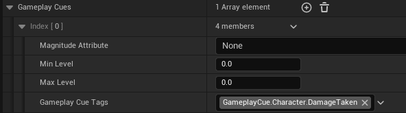

`HandleGameplayCues` 遍历`GameplayCueTags` ： `TargetActor` 是ASC的Avatar角色.

这个GE是ASC对自己施放的，<br>例如: A打到了B -> 对B应用GE -> B:`ApplyGameplayEffectSpecToSelf` -> ... -> HandleGameplayCues，此时 Avatar是B的角色.
```cpp
void UGameplayCueManager::HandleGameplayCues(AActor* TargetActor, const FGameplayTagContainer& GameplayCueTags, EGameplayCueEvent::Type EventType, const FGameplayCueParameters& Parameters, EGameplayCueExecutionOptions Options)
{
    if (!(Options & EGameplayCueExecutionOptions::IgnoreSuppression) && ShouldSuppressGameplayCues(TargetActor))
    {
        return;
    }

    for (auto It = GameplayCueTags.CreateConstIterator(); It; ++It)
    {
        HandleGameplayCue(TargetActor, *It, EventType, Parameters, Options);
    }
}
```

执行流程
```cpp
HandleGameplayCue (入口)
    ↓
ShouldSuppressGameplayCues (检查是否抑制)
    ↓
TranslateGameplayCue (标签翻译)
    ↓
RouteGameplayCue (路由分发)
    ├── 全局CueSet处理 (RuntimeGameplayCueObjectLibrary)
    └── Actor接口处理 (IGameplayCueInterface)
```

`RouteGameplayCue` 通过传递进来的 `TargetActor` 获得`World`，用于非`instance`的GC.

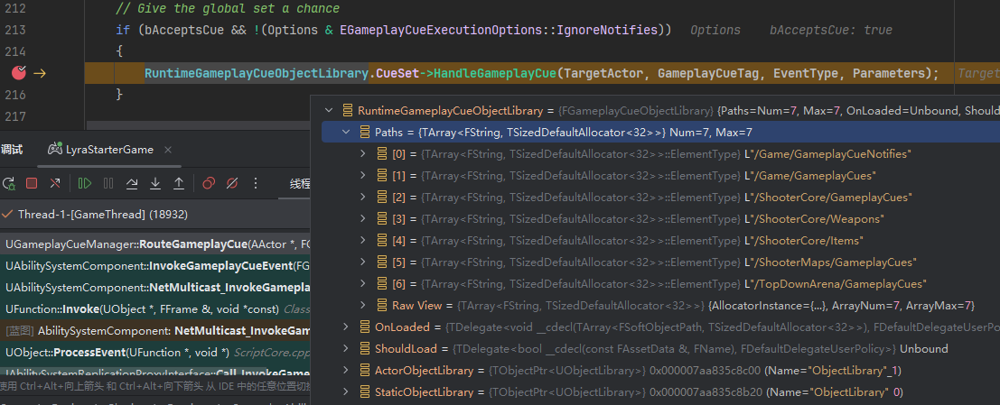

`RuntimeGameplayCueObjectLibrary.Path` 数据来源:<br>
UGameplayCueManager::InitializeRuntimeObjectLibrary 初始化Library的信息.<br>
读取`Config/DefaultGame.ini`配置的GC
```cpp
L"/Game/GameplayCueNotifies"
L"/Game/GameplayCues"
```

ULyraGameFeature_AddGameplayCuePaths::OnGameFeatureRegistering<br>
读取GameFeature配置的GC项目


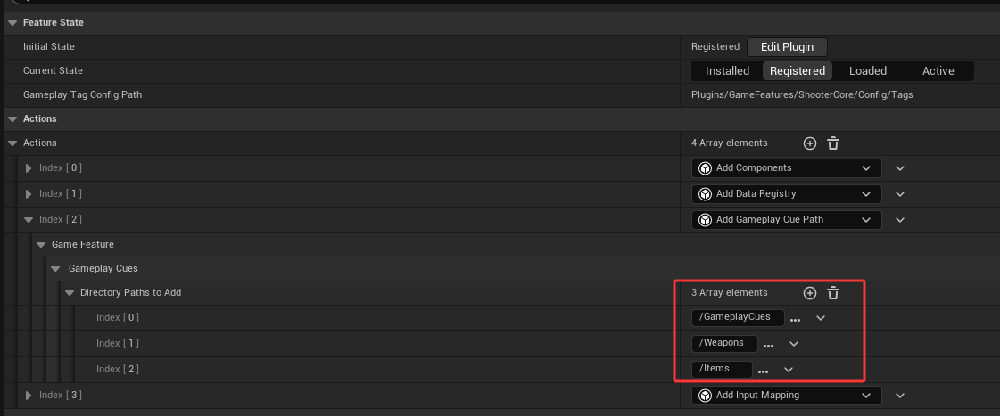


```cpp
RuntimeGameplayCueObjectLibrary.CueSet->HandleGameplayCue(TargetActor, GameplayCueTag, EventType, Parameters);
```

TargetActor 是玩家B，GameplayCueTag是GE中配置的Tag，<br>
EventType是 EGameplayCueEvent::OnActive 或 EGameplayCueEvent::WhileActive<br>
Parameters 包含GESpec的Level、SourceTag、TargetTag、EffectContext 等信息.

```cpp
bool UGameplayCueSet::HandleGameplayCue(AActor* TargetActor, FGameplayTag GameplayCueTag, EGameplayCueEvent::Type EventType, const FGameplayCueParameters& Parameters)
{
    int32* Ptr = GameplayCueDataMap.Find(GameplayCueTag);
    if (Ptr && *Ptr != INDEX_NONE)
    {
        int32 DataIdx = *Ptr;
        FGameplayCueParameters writableParameters = Parameters;
        return HandleGameplayCueNotify_Internal(TargetActor, DataIdx, EventType, writableParameters);
    }
    return false;
}
```

最后来到这个函数:
```cpp
bool UGameplayCueSet::HandleGameplayCueNotify_Internal(AActor* TargetActor, int32 DataIdx, EGameplayCueEvent::Type EventType, FGameplayCueParameters& Parameters)
{
    FGameplayCueNotifyData& CueData = GameplayCueData[DataIdx];
    if (CueData.LoadedGameplayCueClass == nullptr || bDebugFailLoads)
    {
        /* 如果是nullptr, 加载Class */
    }
    check(CueData.LoadedGameplayCueClass);
}
```
断点调试 `GameplayCueData`的内容 :
```cpp
GameplayCueData = 
 [0] ={GameplayCueTag={TagName="GameplayCue.Test.BurstLatent"}, GameplayCueNotifyObj={AssetPath={PackageName="/Game/GameplayCueNotifies/GCN_Test_BurstLatent", AssetName="GCN_Test_BurstLatent_C"}, SubPathString=Empty}, LoadedGameplayCueClass=nullptr, ...}

 [1] ={GameplayCueTag={TagName="GameplayCue.Character.Heal"}, GameplayCueNotifyObj={AssetPath={PackageName="/Game/GameplayCueNotifies/GCN_Character_Heal", AssetName="GCN_Character_Heal_C"}, SubPathString=Empty}, LoadedGameplayCueClass=nullptr, ...}

 [2] ={GameplayCueTag={TagName="GameplayCue.Test.Looping"}, GameplayCueNotifyObj={AssetPath={PackageName="/Game/GameplayCueNotifies/GCNL_Test_Looping", AssetName="GCNL_Test_Looping_C"}, SubPathString=Empty}, LoadedGameplayCueClass=nullptr, ...}

//----------------//

CueData = 
GameplayCueTag = {FGameplayTag} {TagName="GameplayCue.Character.Spawn"}
GameplayCueNotifyObj = {FSoftObjectPath} {AssetPath={PackageName="/ShooterCore/GameplayCues/GCNL_Spawning", AssetName="GCNL_Spawning_C"}, SubPathString=Empty}

 LoadedGameplayCueClass = {TObjectPtr<UClass>} (Name="GCNL_Spawning_C")
```

以第一个元素为例，GameplayCueTag ---> 这个GC里面指定的Tag: `GameplayCue.Test.BurstLatent`<br>
还包含了资产的名称. `LoadedGameplayCueClass` 是空的，后面的`HandleMissingGameplayCue`会加载这个Class.
```cpp
 [0] ={GameplayCueTag={TagName="GameplayCue.Test.BurstLatent"}, GameplayCueNotifyObj={AssetPath={PackageName="/Game/GameplayCueNotifies/GCN_Test_BurstLatent", AssetName="GCN_Test_BurstLatent_C"}, SubPathString=Empty}, LoadedGameplayCueClass=nullptr, ...}
```

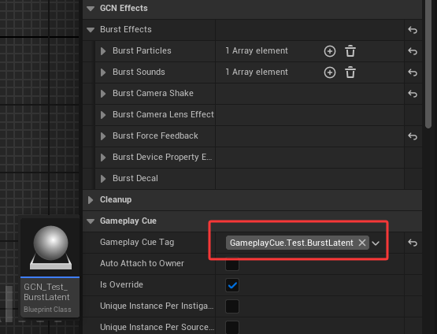

GameplayCue的Spawn过程:<br>
1.在TargetActor身上的子Actor寻找GC_Actor，如果找到了 就返回这个GC_Actor.<br>
2.从TargetActor所在的World里寻找GC_Actor，找到了就附加到TargetActor身上.<br>
3.还找不到？ 那就SpawnActor，造一个GC_Actor，那不就找到了.

无论哪个方式，只要找到GC_Actor，就将Parameters里面的Instigator、SourceObject 发给GC_Actor一份.
```cpp
/* 使用TargetActor的位置、旋转，生成一个Actor. */
AGameplayCueNotify_Actor* UGameplayCueManager::GetInstancedCueActor(AActor* TargetActor, UClass* GameplayCueNotifyActorClass, const FGameplayCueParameters& Parameters)
{
    // If we can't reuse, then spawn a new one. Since TargetActor is the Owner, a reference to this CueNotify Actor will live in TargetActor::Children.
    FActorSpawnParameters SpawnParams;
    SpawnParams.Owner = TargetActor;
    SpawnParams.OverrideLevel = World->PersistentLevel;
    AGameplayCueNotify_Actor* SpawnedCue = World->SpawnActor<AGameplayCueNotify_Actor>(CueClass, TargetActor->GetActorLocation(), TargetActor->GetActorRotation(), SpawnParams);
    SpawnedCue->CueInstigator = Parameters.GetInstigator();
    SpawnedCue->CueSourceObject = Parameters.GetSourceObject();
}
```

现在已经有了GC_Actor.
```cpp
bool UGameplayCueSet::HandleGameplayCueNotify_Internal(AActor* TargetActor, int32 DataIdx, EGameplayCueEvent::Type EventType, FGameplayCueParameters& Parameters)
{
    AGameplayCueNotify_Actor* SpawnedInstancedCue = CueManager->GetInstancedCueActor(TargetActor, InstancedClass, Parameters);
    if (ensure(SpawnedInstancedCue))
    {
        SpawnedInstancedCue->HandleGameplayCue(TargetActor, EventType, Parameters);
        bReturnVal = true;
        if (!SpawnedInstancedCue->IsOverride)
        {
            HandleGameplayCueNotify_Internal(TargetActor, CueData.ParentDataIdx, EventType, Parameters);
        }

        if (bShouldDestroy)
        {
            SpawnedInstancedCue->HandleGameplayCue(TargetActor, EGameplayCueEvent::Removed, Parameters);
        }
    }

    return bReturnVal;
}
```

Spawn完了GC_Actor， 接着调用它的 `HandleGameplayCue` .

这个函数就是调用入口了，根据不同策略 调用不同的函数，这些函数可以在蓝图重写.

```cpp
void AGameplayCueNotify_Actor::HandleGameplayCue(AActor* MyTarget, EGameplayCueEvent::Type EventType, const FGameplayCueParameters& Parameters)
{
    K2_HandleGameplayCue(MyTarget, EventType, Parameters);

    switch (EventType)
    {
        case EGameplayCueEvent::OnActive:
            OnActive(MyTarget, Parameters);
            bHasHandledOnActiveEvent = true;
            break;

        case EGameplayCueEvent::WhileActive:
            WhileActive(MyTarget, Parameters);
            bHasHandledWhileActiveEvent = true;
            break;

        case EGameplayCueEvent::Executed:
            OnExecute(MyTarget, Parameters);
            break;

        case EGameplayCueEvent::Removed:
            bHasHandledOnRemoveEvent = true;
            OnRemove(MyTarget, Parameters);
            /* 如果 bAutoDestroyOnRemove = true*/
            /* 在 AutoDestroyDelay 秒后，调用GameplayCueFinishedCallback*/
            break
        }
}

void AGameplayCueNotify_Actor::GameplayCueFinishedCallback()
{
    /* 省略 */
    UAbilitySystemGlobals::Get().GetGameplayCueManager()->NotifyGameplayCueActorFinished(this);
}
```
GE应用时 一路过来 `EventType`都是 `OnActive` 或者 `WhileActive`,<br>
在 `Executed` 打断点可以发现这个Case是从网络那个方向调用的，从而调用 `OnExecute`.

蓝图中重写的函数：

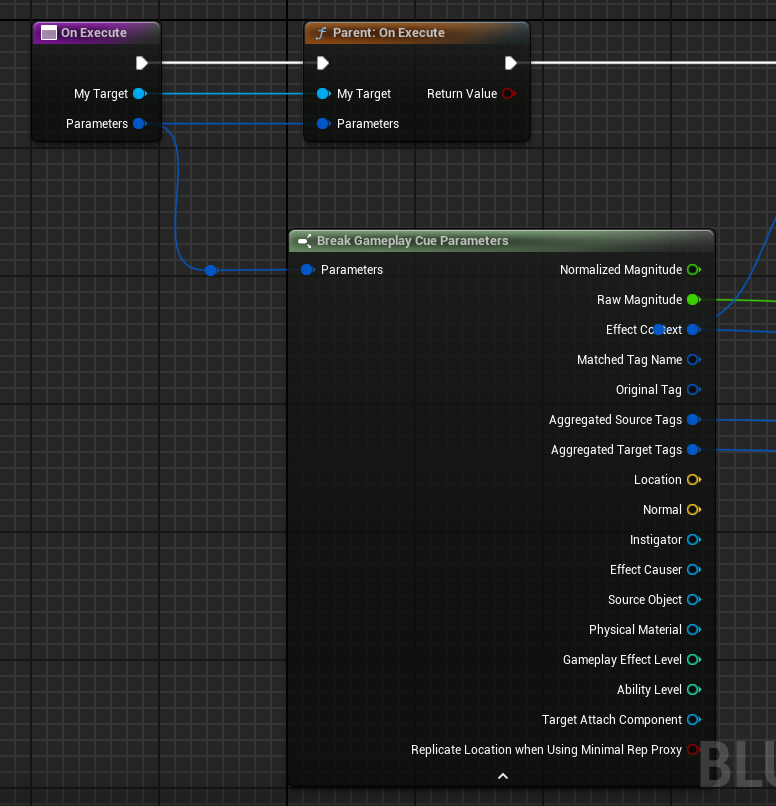

---

#### GameplayCue 2

这部分是未来的我写的内容，主打一个简洁.<br>
前面写的那一节 我自己都不想看.

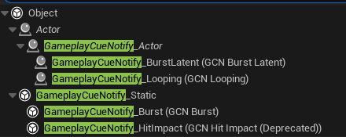

---

`AGameplayCueNotify_Actor` 向蓝图公开了几个函数:<br>
`UGameplayCueNotify_Static` 的函数也是一样的.
```cpp
/** 通用事件图表事件，将对所有事件类型调用 */
UFUNCTION(BlueprintImplementableEvent, Category = "GameplayCueNotify", DisplayName = "HandleGameplayCue", meta=(ScriptName = "HandleGameplayCue"))
void K2_HandleGameplayCue(AActor* MyTarget, EGameplayCueEvent::Type EventType, const FGameplayCueParameters& Parameters);

/** 当GameplayCue执行时调用，用于瞬发效果或周期性触发 */
UFUNCTION(BlueprintNativeEvent, Category = "GameplayCueNotify")
bool OnExecute(AActor* MyTarget, const FGameplayCueParameters& Parameters);

/** 当持续型GameplayCue首次激活时调用（仅在客户端见证激活时触发） */
UFUNCTION(BlueprintNativeEvent, Category = "GameplayCueNotify")
bool OnActive(AActor* MyTarget, const FGameplayCueParameters& Parameters);

/** 当持续型GameplayCue首次显示为激活状态时调用 */
UFUNCTION(BlueprintNativeEvent, Category = "GameplayCueNotify")
bool WhileActive(AActor* MyTarget, const FGameplayCueParameters& Parameters);

/** 当持续型GameplayCue被移除时调用 */
UFUNCTION(BlueprintNativeEvent, Category = "GameplayCueNotify")
bool OnRemove(AActor* MyTarget, const FGameplayCueParameters& Parameters);
```

以上这些函数都在`AGameplayCueNotify_Actor::HandleGameplayCue`里面调用.<br>
所以 `HandleGameplayCue` 就是这个`Actor`公开给`GameplayCue`的入口.

`HandleGameplayCue`在调用这些函数时，用了`switch (EventType)`，`EventType`是哪里来的?

```cpp
UAbilitySystemComponent::ApplyGameplayEffectSpecToSelf()
{
    //立即缓存该值，以防后续可能将预测性即时效果修改为无限持续时间效果。
    bool bInvokeGameplayCueApplied = Spec.Def->DurationPolicy != EGameplayEffectDurationType::Instant; 
    if(bInvokeGameplayCueApplied)
    {
        InvokeGameplayCueEvent(*OurCopyOfSpec, EGameplayCueEvent::OnActive);
		InvokeGameplayCueEvent(*OurCopyOfSpec, EGameplayCueEvent::WhileActive);
    }
}
```

只要这个GE不是立即触发的，`EventType`就是`OnActive`、`WhileActive`.

---
`UGameplayCueNotify_Burst`<br>
`AGameplayCueNotify_BurstLatent`<br>

Burst版本 新增了一个`OnBurst`函数:<br>
```cpp
UFUNCTION(BlueprintImplementableEvent)
void OnBurst(AActor* Target, const FGameplayCueParameters& Parameters, const FGameplayCueNotify_SpawnResult& SpawnResults) const;

AGameplayCueNotify_BurstLatent::OnExecute_Implementation()
{
    OnBurst(Target, Parameters, BurstSpawnResults);
}
```
`OnBurst`在`OnExecute`中调用，而`OnExecute`用于瞬发效果或周期性触发.<br>
所以 `Burst`版本的GC就是用于瞬发或周期GE的，

```cpp
AGameplayCueNotify_BurstLatent::OnExecute_Implementation()
{
    BurstEffects.ExecuteEffects(SpawnContext, BurstSpawnResults);
    OnBurst(Target, Parameters, BurstSpawnResults);

    // 默认处理GameplayCue移除。这是为处理当前能想到的所有情况而设置的简单默认处理。
    // 若不这样做，我们将依赖每个BurstLatent型GameplayCue在蓝图图表中手动设置移除逻辑，
    // 或依赖基于参数的推断逻辑。
    if (World)
    {
        const float Lifetime = FMath::Max<float>(AutoDestroyDelay, DefaultBurstLatentLifetime);
        World->GetTimerManager().SetTimer(FinishTimerHandle, this, &AGameplayCueNotify_Actor::GameplayCueFinishedCallback, Lifetime);
    }
}
```
其中`const float DefaultBurstLatentLifetime = 5.0f;`.<br>
蓝图中可以设置`AutoDestroyDelay`参数.

上面的代码段中 还有一个 BurstGC 特供的`BurstEffect`:<br>
`BurstEffects.ExecuteEffects` 

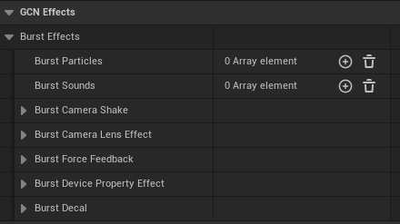


---

#### AbilityTask
`AbilityTasks` 是在执行能力（Ability）时可以执行的小型、自包含操作。<br>
它们本质上是延迟/异步的。通常遵循"启动某件事并等待其完成或被中断"的模式。

我们在 `K2Node_LatentAbilityCall` 中有代码，可以简化在蓝图中使用这些任务的过程。<br>
熟悉 `AbilityTasks` 的最佳方法是查看现有任务，如` UAbilityTask_WaitOverlap`（非常简单）和 `UAbilityTask_WaitTargetData`（更复杂）。

以下是使用 `AbilityTask` 的基本要求：<br>
1) 在 `AbilityTask` 中定义`动态多播`、`BlueprintAssignable` 委托。这些是任务的输出。当这些委托触发时，执行将在调用蓝图中的相应位置继续。<br>
2) 通过静态工厂函数定义输入参数，该函数将实例化你的任务。此函数的参数定义了任务的输入。工厂函数应该只实例化任务并可能设置起始参数，而不应调用任何回调委托！<br>
3) 实现 `Activate()` 函数（在基类中定义）。此函数应实际启动/执行你的任务逻辑。在此处调用回调委托是安全的。<br>

这就是基本 `AbilityTask` 所需的一切。

检查清单:<br>
重写 `::OnDestroy()` 并取消注册任务注册的任何回调。同时调用 `Super::EndTask`！<br>
实现 `Activate` 函数，真正"开始"任务。不要在静态工厂函数中"开始"任务！<br>

生成 `Actor` 的额外支持:<br>
有些 `AbilityTasks` 想要生成 `Actor`。虽然这可以在 `Activate()` 函数中完成，但无法传入动态的`ExposeOnSpawn` 属性。这是蓝图的强大功能，为了支持这一点，你需要实现不同的第 3 步：<br>
应实现 `BeginSpawningActor()` 和 `FinishSpawningActor()` 函数，而不是 `Activate()` 函数。

`BeginSpawningActor()` 要求：<br>
必须接收一个名为 `Class` 的 `TSubclassOf<YourActorClassToSpawn>` 参数<br>
必须有一个类型为 `YourActorClassToSpawn*&  SpawnedActor` 的输出引用参数<br>
此函数可以决定是否要生成 `Actor`（如果需要根据网络权限来判定是否生成 `Actor`，这很有用）<br>

`BeginSpawningActor()` 可以使用 `SpawnActorDeferred` 实例化 `Actor`。<br>
这很重要，否则 UCS（用户构建脚本）将在设置生成参数之前运行。<br>

`BeginSpawningActor()` 还应将 `SpawnedActor` 参数设置为其生成的 `Actor`。<br>
[接下来，生成的字节码会将 `expose on spawn` 参数设置为用户设置的任何值]

`FinishSpawningActor()` 要求：<br>
如果你生成了某些内容，将调用 `FinishSpawningActor()` 并传入刚刚生成的同一`Actor`<br>
你必须在此 `Actor` 上调用 `ExecuteConstruction` + `PostActorConstruction`！<br>

这些步骤很多，但通常 `AbilityTask_SpawnActor()` 提供了一个清晰、最小化的示例。

---
##### WaitTargetData

`AbilityTask_WaitTargetData`:<br>
等待从参数生成的目标选择Actor提供数据。可以设置为在输出数据时不结束。可以通过任务名称结束。

警告：这些Actor每次能力激活时都会生成，其默认形式效率不高。

对于大多数游戏，你需要创建子类并大量修改这个Actor，或者你可能希望在游戏特定的Actor或蓝图中实现类似的功能，以避免Actor生成成本。

这个任务没有经过内部游戏的充分测试，但它是学习目标复制如何发生的一个有用类。

---

使用`WaitTargetData`需要调用ASC的`LocalInputConfirm`,`LocalInputCancel`函数<br>
或者调用`InputConfirm` `InputCancel`.

通常是鼠标按下时 触发确认或取消， 那么就把按键输入绑定到这两个函数上即可.

---

`BeginSpawningActor`: 生成Actor，存到 `TargetActor`.<br>
`InitializeTargetActor`:传递`PlayerController`，绑定Actor的 `TargetDataReadyDelegate` `CanceledDelegate` 委托，<br>
`FinalizeTargetActor`: 向ASC添加生成的Actor,然后操作Actor.

以`AGameplayAbilityTargetActor_Trace` 为`SpawnedActor`，<br>
```cpp
SpawnedActor->StartTargeting(Ability);

void AGameplayAbilityTargetActor_Trace::StartTargeting(UGameplayAbility* InAbility)
{
    OwningAbility = Ability;
    SourceActor = InAbility->GetCurrentActorInfo()->AvatarActor.Get();
}
```
如果需要玩家手动确认目标选择，就绑定到ASC的委托上.
```cpp
void UAbilityTask_WaitTargetData::FinalizeTargetActor(AGameplayAbilityTargetActor* SpawnedActor) const
{
    if (ConfirmationType == EGameplayTargetingConfirmation::UserConfirmed)
    {
        // Bind to the Cancel/Confirm Delegates (called from local confirm or from repped confirm)
        SpawnedActor->BindToConfirmCancelInputs();
    }
}

void AGameplayAbilityTargetActor::BindToConfirmCancelInputs()
{
    const FGameplayAbilityActorInfo* const Info = OwningAbility->GetCurrentActorInfo();
    UAbilitySystemComponent* const ASC = Info->AbilitySystemComponent.Get();

    ASC->GenericLocalConfirmCallbacks.AddDynamic(this, &AGameplayAbilityTargetActor::ConfirmTargeting);	// Tell me if the confirm input is pressed
    ASC->GenericLocalCancelCallbacks.AddDynamic(this, &AGameplayAbilityTargetActor::CancelTargeting);	// Tell me if the cancel input is pressed

    // Save off which ASC we bound so that we can error check that we're removing them later
    GenericDelegateBoundASC = ASC;
}
```

`GenericLocalConfirmCallbacks` 的触发时机：<br>
`LocalInputConfirm`函数 (`InputConfirm` 蓝图调用版本) 可以广播 `GenericLocalCancelCallbacks` 委托，并清空这个委托的绑定.<br>
要实现手动确认的功能，需要调用这个函数 或者 把输入绑定到这个函数上面.

在 `TargetActor` 中，`ConfirmTargeting` 是按下确认输入时 响应的函数.<br>
核心函数是`ConfirmTargetingAndContinue`，可以由子类重写，<br>
最终需要广播 `TargetDataReadyDelegate` 委托，将数据发送给`WaitTargetData`

`WaitTargetData` 绑定了Actor的委托，
```cpp
SpawnedActor->TargetDataReadyDelegate.AddUObject(const_cast<UAbilityTask_WaitTargetData*>(this), &UAbilityTask_WaitTargetData::OnTargetDataReadyCallback);

SpawnedActor->CanceledDelegate.AddUObject(const_cast<UAbilityTask_WaitTargetData*>(this), &UAbilityTask_WaitTargetData::OnTargetDataCancelledCallback);
```

`OnTargetDataReadyCallback` Actor有数据传来，广播 `ValidData` 节点引脚，其负载数据是Actor传来的数据.<br>
`OnTargetDataCancelledCallback` 当取消时，广播 `Cancelled` 节点引脚，其负载数据是 空.

总结：<br>
`WaitTargetData` 创建 `TargetActor` ，绑定`TargetActor`的数据广播 <br>
如果确认策略是`UserConfirmed`，`TargetActor` 会绑定ASC的确认/取消委托.<br>
当玩家输入`确认`时(通常是按下左键 表示确定目标)，触发ASC的函数 广播委托，`TargetActor` 在收到广播后 计算数据并广播数据.<br>
`WaitTargetData` 收到 `TargetActor`广播的数据，转发给蓝图引脚 `ValidData` .

`WaitTargetData`是一个`UObject`类，在场景中生成一个`Actor`执行射线检测之类的事情，并且绑定这个`Actor`的委托<br>
`Actor`在检测完以后，广播委托，`WaitTargetData`就可以收到`Actor`传来的`TargetData`.<br>
之后就是蓝图节点的事情了，可以在蓝图里使用这个`TargetData`.


---

##### WaitInput
```cpp
void UAbilityTask_WaitInputPress::Activate()
{
     ASC->AbilityReplicatedEventDelegate(EAbilityGenericReplicatedEvent::InputPressed, GetAbilitySpecHandle(), GetActivationPredictionKey()).AddUObject(this, &UAbilityTask_WaitInputPress::OnPressCallback);
}


FSimpleMulticastDelegate& UAbilitySystemComponent::AbilityReplicatedEventDelegate(EAbilityGenericReplicatedEvent::Type EventType, FGameplayAbilitySpecHandle AbilityHandle, FPredictionKey AbilityOriginalPredictionKey)
{
    return AbilityTargetDataMap.FindOrAdd(FGameplayAbilitySpecHandleAndPredictionKey(AbilityHandle, AbilityOriginalPredictionKey))->GenericEvents[EventType].Delegate;
}
```

`WaitInput`在激活时，向`AbilityTargetDataMap`添加委托事件，<br>
事件类型是`InputPressed`，并且将使用`WaitInput`的GA也传了进去，这样就能绑定一个GA的按键输入.

触发`WaitInput`的方法是:调用`InvokeReplicatedEvent`.

```cpp
TryActivateAbility(AbilitySpecHandle);
InvokeReplicatedEvent(EAbilityGenericReplicatedEvent::InputPressed, AbilitySpec->Handle, AbilitySpec->ActivationInfo.GetActivationPredictionKey());
```


---
#### GE自定义计算

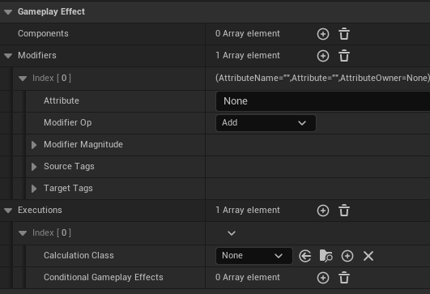

从GESpec的初始化说起.<br>
`FGameplayEffectSpec` 其中一个接收GE的构造函数 调用了`Initialize`.<br>

```cpp
void FGameplayEffectSpec::Initialize(const UGameplayEffect* InDef, const FGameplayEffectContextHandle& InEffectContext, float InLevel)
{
    // Prep the spec with all of the attribute captures it will need to perform
    SetupAttributeCaptureDefinitions();
}
```

---

`SetupAttributeCaptureDefinitions` 记录需要捕获的属性，在将来进行捕获.

只要使用了 `Attribute Based` 就需要捕获属性.<br>
例如: `Duraction` 需要用到 `Health` 属性.

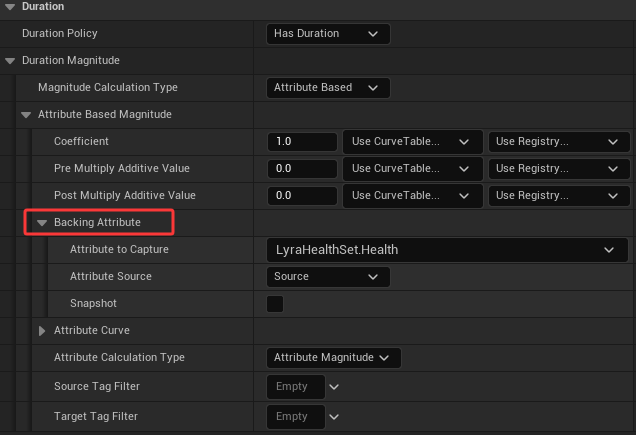

```cpp
// Gather capture definitions from duration	
{
    CaptureDefs.Reset();
    Def->DurationMagnitude.GetAttributeCaptureDefinitions(CaptureDefs);
    for (const auto& CurDurationCaptureDef : CaptureDefs)
    {
        CapturedRelevantAttributes.AddCaptureDefinition(CurDurationCaptureDef);
    }
}

// Gather all capture definitions from modifiers
for (int32 ModIdx = 0; ModIdx < Modifiers.Num(); ++ModIdx)
{
    const FGameplayModifierInfo& ModDef = Def->Modifiers[ModIdx];
    const FModifierSpec& ModSpec = Modifiers[ModIdx];

    CaptureDefs.Reset();
    ModDef.ModifierMagnitude.GetAttributeCaptureDefinitions(CaptureDefs);

    for(/* */)
    {
        CapturedRelevantAttributes.AddCaptureDefinition(CurCaptureDef);
    }
}
```

---

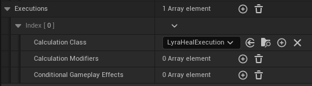

比较特殊的是`Executions`. <br>
其类型是 `GameplayEffectExecutionDefinition`

在 GESpec 的属性获取方式 :
```cpp
// Gather all capture definitions from executions
for (const FGameplayEffectExecutionDefinition& Exec : Def->Executions)
{
    CaptureDefs.Reset();
    Exec.GetAttributeCaptureDefinitions(CaptureDefs);
    for (const auto& CurExecCaptureDef : CaptureDefs)
    {
        CapturedRelevantAttributes.AddCaptureDefinition(CurExecCaptureDef);
    }
}
```

`Exec.GetAttributeCaptureDefinitions` 获取`CalculationClass`中定义的属性.<br>
`CalculationClass` 的属性要在`UGameplayEffectExecutionCalculation` 类里手动输入.

例如 ：
```cpp
BaseHealDef = 
FGameplayEffectAttributeCaptureDefinition
(
    ULyraCombatSet::GetBaseHealAttribute(),
    EGameplayEffectAttributeCaptureSource::Source, 
    true
);

class ULyraHealExecution : public UGameplayEffectExecutionCalculation
{
    ULyraHealExecution::ULyraHealExecution()
    {
        RelevantAttributesToCapture.Add(HealStatics().BaseHealDef);
    }
}

/* -------------- */
const auto& UGameplayEffectCalculation::GetAttributeCaptureDefinitions() const
{
    return RelevantAttributesToCapture;
}
```

GESpec 的 `CapturedRelevantAttributes` 将会保存这个要捕获的属性 `BaseHealth`.<br>


---

##### 属性捕获

```cpp
void FGameplayEffectSpec::Initialize(const UGameplayEffect* InDef, const FGameplayEffectContextHandle& InEffectContext, float InLevel)
{
    // Prep the spec with all of the attribute captures it will need to perform
    SetupAttributeCaptureDefinitions();

    // Prepare source tags before accessing them in the Components
    CaptureDataFromSource();
}

void FGameplayEffectSpec::CaptureDataFromSource(bool bSkipRecaptureSourceActorTags /*= false*/)
{
    // Capture source Attributes
    CapturedRelevantAttributes.CaptureAttributes
    (EffectContext.GetInstigatorAbilitySystemComponent(),
    EGameplayEffectAttributeCaptureSource::Source);
}
```
在 `CaptureAttributes` 中 使用的是 `SourceAttributes`.

```cpp
FGameplayEffectAttributeCaptureSpecContainer::CaptureAttributes
UAbilitySystemComponent::CaptureAttributeForGameplayEffect
```

`CaptureAttributeForGameplayEffect` 在操作 `SourceAttributes` 数组.<br>
根据 `SourceAttributes` 中要捕获的元素 逐个捕获.

创建 `Aggregator`
```cpp
void FActiveGameplayEffectsContainer::CaptureAttributeForGameplayEffect(OUT FGameplayEffectAttributeCaptureSpec& OutCaptureSpec)
{
    FAggregatorRef& AttributeAggregator = FindOrCreateAttributeAggregator(OutCaptureSpec.BackingDefinition.AttributeToCapture);
}	
```

获取属性值 :
```cpp
FAggregatorRef& FActiveGameplayEffectsContainer::FindOrCreateAttributeAggregator(FGameplayAttribute Attribute)
{
    // Create a new aggregator for this attribute.
    float CurrentBaseValueOfProperty = Owner->GetNumericAttributeBase(Attribute);
}
```
`Owner` 是 `UAbilitySystemComponent` .

`GetNumericAttributeBase`:<br>
1.找到属性所在的`AttributeSet`.
2.通过反射获取属性值.


```cpp
FAggregatorRef& FActiveGameplayEffectsContainer::FindOrCreateAttributeAggregator(FGameplayAttribute Attribute)
{
    // Create a new aggregator for this attribute.
    float CurrentBaseValueOfProperty = Owner->GetNumericAttributeBase(Attribute);

    FAggregator* NewAttributeAggregator = new FAggregator(CurrentBaseValueOfProperty);
}

/* */
FAggregator(float InBaseValue=0.f) 
:BaseValue(InBaseValue)
{}
```
`FAggregator` 的构造函数 将 `CurrentBaseValueOfProperty` 保存在 `BaseValue` 变量中.<br>
构造出来的 `FAggregator` 保存在 ASC 的 `ActiveGameplayEffects` 中.<br>
最后以引用的方式返回 - `FAggregatorRef`.

```cpp
return AttributeAggregatorMap.Add(Attribute, 
        FAggregatorRef(NewAttributeAggregator));
```
`FAggregatorRef` 的参数是保存了属性值 `BaseValue` 的`NewAttributeAggregator` .
`FAggregatorRef.Data` 是 `NewAttributeAggregator` 的指针.


此时,`AttributeAggregator.Data` 保存了 `NewAttributeAggregator`.
```cpp
void FActiveGameplayEffectsContainer::CaptureAttributeForGameplayEffect(OUT FGameplayEffectAttributeCaptureSpec& OutCaptureSpec)
{
    FAggregatorRef& AttributeAggregator = FindOrCreateAttributeAggregator(OutCaptureSpec.BackingDefinition.AttributeToCapture);
    
    if (OutCaptureSpec.BackingDefinition.bSnapshot)
    {
        OutCaptureSpec.AttributeAggregator.TakeSnapshotOf(AttributeAggregator);
    }
    else
    {
        OutCaptureSpec.AttributeAggregator = AttributeAggregator;
    }
}
```

如果选择 `TakeSnapshotOf`方法<br>
将会创建一个新的 `FAggregator` 对象，反正它不是ASC里面保存的那个`FAggregator`

总结：<br>
在GESpec构造时捕获属性，ASC根据属性查找到对应的`AttributeSet` 并从中获得属性的`BaseValue`值， 存放在 `FGameplayEffectSpec.CapturedRelevantAttributes.SourceAttributes`

---
自定义计算:

```cpp
UAbilitySystemComponent::ApplyGameplayEffectSpecToSelf

UAbilitySystemComponent::ExecuteGameplayEffect
{
    ActiveGameplayEffects.ExecuteActiveEffectsFrom(Spec, PredictionKey);
}

FActiveGameplayEffectsContainer::ExecuteActiveEffectsFrom
```

执行自定义计算:
```cpp
void FActiveGameplayEffectsContainer::ExecuteActiveEffectsFrom(FGameplayEffectSpec &Spec /* */)
{
    FGameplayEffectSpec& SpecToUse = Spec;
    for (const auto& CurExecDef : SpecToUse.Def->Executions)
    {
        if (CurExecDef.CalculationClass)
        {
            /* */

            // Run the custom execution
            FGameplayEffectCustomExecutionParameters ExecutionParams(SpecToUse, CurExecDef.CalculationModifiers, Owner, CurExecDef.PassedInTags, PredictionKey);
            FGameplayEffectCustomExecutionOutput ExecutionOutput;
            ExecCDO->Execute(ExecutionParams, ExecutionOutput);

            /* */
            // Execute any mods the custom execution yielded
            TArray<FGameplayModifierEvaluatedData>& OutModifiers = ExecutionOutput.GetOutputModifiersRef();

            for (FGameplayModifierEvaluatedData& CurExecMod : OutModifiers)
            {
                /* 应用修改 */
            }
        }
    }
}
```
`ExecutionOutput` 接收 `ExecCDO->Execute` 的返回值，在后续过程中应用修改

例如 ULyraHealExecution::Execute 的返回值.
```cpp
void ULyraHealExecution::Execute_Implementation(const FGameplayEffectCustomExecutionParameters& ExecutionParams, FGameplayEffectCustomExecutionOutput& OutExecutionOutput) const
{
    OutExecutionOutput.AddOutputModifier
    (
        FGameplayModifierEvaluatedData(ULyraHealthSet::GetHealingAttribute(), EGameplayModOp::Additive, HealingDone)
    );
}
```

---
##### 自定义计算中的属性

```cpp
class ULyraDamageExecution : public UGameplayEffectExecutionCalculation

/*----------------*/
struct FHealthStatics
{
    FGameplayEffectAttributeCaptureDefinition BaseHealthDef;

    FHealthStatics()
    {
        BaseHealthDef = FGameplayEffectAttributeCaptureDefinition(ULyraHealthSet::GetHealthAttribute(), EGameplayEffectAttributeCaptureSource::Source, true);
    }
};

static FHealthStatics& HealthStatics()
{
    static FHealthStatics Statics;
    return Statics;
}

ULyraDamageExecution::ULyraDamageExecution()
{
    RelevantAttributesToCapture.Add(HealthStatics().BaseHealthDef);
}
```

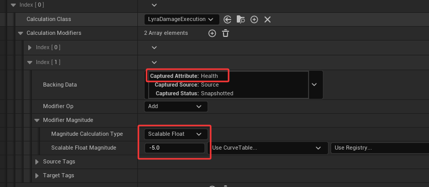

`RelevantAttributesToCapture` 现在需要捕获`Source`的`Health`属性.<br>
上图中 选择了要捕获的`Health`，并且下面还有一个 `-5`.<br>
这个`-5`的意思是，在捕获的值 的基础上，减去5.
```cpp
void ULyraDamageExecution::Execute_Implementation(const FGameplayEffectCustomExecutionParameters& ExecutionParams, FGameplayEffectCustomExecutionOutput& OutExecutionOutput) const
{
    float BaseHealth = 0.0f;
    ExecutionParams.AttemptCalculateCapturedAttributeMagnitude(HealthStatics().BaseHealthDef, EvaluateParameters, BaseHealth);
}
```
通过以上代码获取捕获的值，如果`Health`原本是100，但是在捕获时 添加了`-5`，<br>
那么变量`BaseHealth`里面存的值就是 `95`.

但是，这影响的只是捕获的值，玩家本身的`Health`是不受影响的，生命值还是100.<br>

如果把它改回0，得到的是不是就是`100` ?
下图是捕获的值:

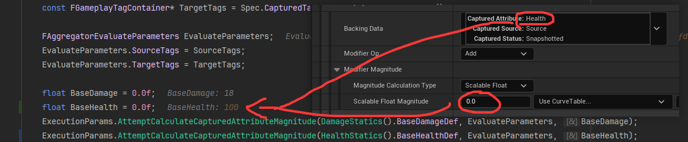

改成`Override`方法，直接替换成`2`.


---

##### Tag捕获
`CapturedSourceTags`

捕获 GE组件`AssetTagsGameplayEffectComponent` 赋予的Tag.
```cpp
void FGameplayEffectSpec::Initialize(const UGameplayEffect* InDef, const FGameplayEffectContextHandle& InEffectContext, float InLevel)
{
    // Add the GameplayEffect asset tags to the source Spec tags
    CapturedSourceTags.GetSpecTags().AppendTags(Def->GetAssetTags());
}
```

---
从Actor中捕获Tag.

```cpp
void FGameplayEffectSpec::Initialize(const UGameplayEffect* InDef, const FGameplayEffectContextHandle& InEffectContext, float InLevel)
{
    // Prepare source tags before accessing them in the Components
    CaptureDataFromSource();
}

void FGameplayEffectSpec::CaptureDataFromSource(bool bSkipRecaptureSourceActorTags /*= false*/)
{
    RecaptureSourceActorTags();
}
```

最终得到的是 ASC中`GameplayTagCountContainer`保存的Tag.<br>
`GameplayTagCountContainer` 可以由GE组件 `TargetTagsGameplayEffectComponent` 增加或移除.

---
通过以下方式添加的Tag也会进入`CapturedSourceTags`.

```cpp
/** Dynamically append asset tags not originally from the source GE definition; Added to DynamicAssetTags as well as injected into the captured source spec tags */
void AppendDynamicAssetTags(const FGameplayTagContainer& TagsToAppend);

/** Dynamically add an asset tag not originally from the source GE definition; Added to DynamicAssetTags as well as injected into the captured source spec tags */
void AddDynamicAssetTag(const FGameplayTag& TagToAdd);

/** Adds NewGameplayTag to this instance of the effect */
UFUNCTION(BlueprintCallable, Category = "Ability|GameplayEffect")
static FGameplayEffectSpecHandle AddAssetTag(FGameplayEffectSpecHandle SpecHandle, FGameplayTag NewGameplayTag);

/** Adds NewGameplayTags to this instance of the effect */
UFUNCTION(BlueprintCallable, Category = "Ability|GameplayEffect")
static FGameplayEffectSpecHandle AddAssetTags(FGameplayEffectSpecHandle SpecHandle, FGameplayTagContainer NewGameplayTags);
```

---

`CapturedTargetTags`

`FActiveGameplayEffectsContainer::ExecuteActiveEffectsFrom` 是GE的执行入口.<br>
`CapturedTargetTags` 也是在这里获取.

```cpp
/** This is the main function that executes a GameplayEffect on Attributes and ActiveGameplayEffects */
void FActiveGameplayEffectsContainer::ExecuteActiveEffectsFrom(FGameplayEffectSpec &Spec, FPredictionKey PredictionKey)
{
    SpecToUse.CapturedTargetTags.GetActorTags().Reset();
    Owner->GetOwnedGameplayTags(SpecToUse.CapturedTargetTags.GetActorTags());
}
```

---

#### GE堆栈


`StackingType` - 此`GameplayEffect`如何与同一`GameplayEffect`的其他实例叠加<br>
`StackLimitCount` - `StackingType`对应的堆叠层数上限<br>
`StackDurationRefreshPolicy` - 堆叠时刷新效果持续时间的策略<br>
`StackPeriodResetPolicy` - 堆叠时重置效果周期（或不重置）的策略<br>
`StackExpirationPolicy` - 此`GameplayEffect`持续时间到期时的处理策略<br>


---

`StackingType` 
```cpp
/** Each caster has its own stack. */
AggregateBySource,

/** Each target has its own stack. */
AggregateByTarget,
```

如果不开启堆栈功能，`StackingType = None` ，一个GE会被多次添加到已应用GE的容器中.<br>
如果这个GE还使用了`TargetTagsGameplayEffectComponent`为Actor提供Tag，那么这个Tag会被多次添加.<br>

如果开启堆栈功能，`StackingType` = `AggregateBySource` 或者 `AggregateByTarget`.<br>
一个GE只会在已应用GE的容器中添加一次，为Actor提供的Tag 只会添加一次，不会叠加.

从属性上来说，例如有一个施加持续伤害的GE，每秒造成1点伤害.<br>
不管开不开启`StackingType` ，在多次应用下 伤害可以叠加.<br>

`StackLimitCount`给了一个可以限制添加次数的选择，<br>
设置添加一个上限，在多次应用伤害GE的时候 不能太变态，叠到无限层以后还怎么玩.

---

`StackDurationRefreshPolicy` 每次应用GE时，是否要刷新持续时间，<br>
我向你添加一个灼烧buff，每秒造成1点伤害，持续3秒.<br>
如果选择`Refresh on Successful Application` ，那么每次添加灼烧buff时 持续时间都会重置为3秒.<br>
多次添加buff时，不仅伤害在叠加，还要刷新持续时间，这个技能太变态了.<br>
当你的灼烧终于要结束时，我一个技能过去 灼烧的刷新时间重置了.<br>

如果选择`Never Refresh`，在第二次添加灼烧buff时，只有伤害在叠加，而持续时间不变，还是按照第一个灼烧的时间继续走.<br>
当灼烧还剩0.5秒就结束时，再添加灼烧buff 不会重置持续时间，在0.5秒后 整个灼烧buff就没了.

---

`StackPeriodResetPolicy`<br>
灼烧buff，每1秒造成1点伤害，持续3秒.<br>
第一次添加灼烧 并且经过0.5秒时，我添加了第二个灼烧.<br>

如果选择`Reset on Successful Application`，那么经过的0.5秒会被重置为1.<br>
从头开始计时，直到再次经过1秒后，才会施加伤害.<br>

举一个极端的例子，每0.2秒施加一个灼烧buff，但是要经过1秒才会造成一次伤害.<br>
而每次施加都要重新去计时那个1秒，<br>
好不容易经过了0.2秒，眼看再经过0.8秒就可以造成伤害了，结果又被刷新了 重新从0开始计时.<br>
每次计时都要被打断，永远不会造成伤害.

如果选择`Never Refresh`，计时不会刷新，就算是在经过了0.9秒时 添加了第二个灼烧，<br>
在0.1秒之后 依然会造成伤害，并且伤害还要叠加， 因为添加了两个灼烧.

---

`StackExpirationPolicy`

`ClearEntireStack`  当激活的GE过期时，清空整个堆叠. <br>

`RemoveSingleStackAndRefreshDuration` 当前堆叠层数减1并刷新持续时间.<br>
GE不会"重新施加"，仅以减少一层堆叠的状态继续存在。<br>

`RefreshDuration` 刷新GE的持续时间.<br>
这实际上会使GE变为无限持续时间，可通过`OnStackCountChange`回调手动处理堆叠层数的减少 .

---

`Overflow`

`OverflowEffects` 当堆叠的GE因尝试再次应用而"溢出"（超过堆叠层数上限）时需要施加的GE。<br>
无论溢出应用是否成功，这些GE都会被添加。

`bDenyOverflowApplication` 如果为true，当已处于堆叠层数上限时，后续的堆叠尝试将会失败，且不会刷新持续时间和上下文.

`bClearStackOnOverflow` 如果为true，GE溢出时将清除其整个堆叠.

---

Stack 的配置就是这样子，要获取某个GE叠了多少层 可以用这个函数:

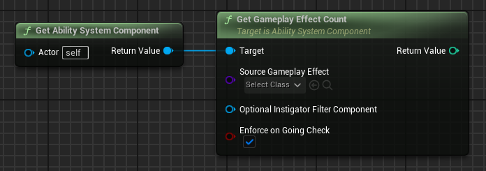

---

代码时间 : 

```cpp
UAbilitySystemComponent::ApplyGameplayEffectSpecToSelf
FActiveGameplayEffectsContainer::ApplyGameplayEffectSpec
FActiveGameplayEffectsContainer::FindStackableActiveGameplayEffect
```

只要不是`Instant`模式，就可以使用堆栈功能 : 
```cpp
UAbilitySystemComponent::ApplyGameplayEffectSpecToSelf()
{
    if (Spec.Def->DurationPolicy != EGameplayEffectDurationType::Instant 
    || bTreatAsInfiniteDuration)
	{
		AppliedEffect = ActiveGameplayEffects.ApplyGameplayEffectSpec(Spec, PredictionKey, bFoundExistingStackableGE);
		if (!AppliedEffect)
		{
			return FActiveGameplayEffectHandle();
		}
     }
}
```

在已经应用的GE中 寻找可叠加的GE :
```cpp
FActiveGameplayEffectsContainer::ApplyGameplayEffectSpec()
{
    FActiveGameplayEffect* ExistingStackableGE = FindStackableActiveGameplayEffect(Spec);
}
```

`FindStackableActiveGameplayEffect` 在已应用的GE中，寻找即将应用的GE，如果找到 就返回存在的GE.<br>
就是说看看这个GE在此前有没有应用过.


```cpp
FActiveGameplayEffectsContainer::ApplyGameplayEffectSpec()
{
    FActiveGameplayEffect* ExistingStackableGE = FindStackableActiveGameplayEffect(Spec);
    // Check if there's an active GE this application should stack upon
	if (ExistingStackableGE)
    {
        /*...*/
        if (ExistingSpec.GetStackCount() == ExistingSpec.Def->StackLimitCount)
		{
			if (!HandleActiveGameplayEffectStackOverflow(*ExistingStackableGE, ExistingSpec, Spec))
			{
				return nullptr;
			}
		}
        /*...*/
    }
}
```
`ExistingStackableGE` `ExistingSpec` 已经存在的GE和对应的GESpec.<br>
`Spec` 即将应用的GE.

TODO:不想写了，先放着吧.

---

#### TargetData

```cpp
/**
*	TargetDataHandle 主要用途有两个：
*		- 避免在蓝图中复制完整的目标数据结构
*		- 允许我们利用目标数据结构的多态性
*		- 允许我们实现 NetSerialize 并在客户端/服务器之间按值复制
*
*		- 原本可以使用 UObject 来提供多态性和在蓝图中通过引用传递。
*		- 但在复制方面我们仍然会遇到问题
*
*		- 按值复制
*		- 在蓝图中通过引用传递
*		- 目标数据结构的多态性
*/
USTRUCT(BlueprintType)
struct GAMEPLAYABILITIES_API FGameplayAbilityTargetDataHandle
```

---

```cpp
/**
 *	TargetData的通用结构。我们希望通用函数生成这些数据，而其他通用函数使用这些数据。
 *
 *	我们希望它能够持有具体的 Actor/对象引用，以及通用的位置/方向/原点信息。
 *
 *	一些生成示例：
 *		- 重叠/命中碰撞事件生成 关于近战攻击命中谁 的目标数据
 *		- 鼠标输入触发命中追踪，准星前的 Actor 被转换为目标数据
 *		- 鼠标输入导致从拥有者的准星视角原点/方向生成目标数据
 *		- AOE/光环脉冲，将施法者周围半径内的所有 Actor 添加到目标数据
 *		- 如《铁甲飞龙》风格的“涂抹”瞄准模式
 *		- MMORPG 风格的地面 AOE 瞄准模式（可能同时包含地面上的位置和被瞄准的 Actor）
 *
 *	一些使用示例：
 *		- 对目标数据中的所有 Actor 应用 GameplayEffect
 *		- 从目标数据中的所有 Actor 中寻找最近的 Actor
 *		- 对目标数据中的所有 Actor 调用某个函数
 *		- 过滤或合并目标数据
 *		- 在目标数据的位置生成一个新的 Actor
 *
 *	也许区分 Actor 列表瞄准与位置性瞄准数据会更好？
 *		- AOE/光环类型的瞄准数据模糊了这种界限。
 */
USTRUCT()
struct GAMEPLAYABILITIES_API FGameplayAbilityTargetData
```

还有铁甲飞龙的事?

```
“铁甲飞龙的涂抹”瞄准模式，是一种独特的多目标锁定机制。
在该模式下，玩家移动屏幕上的准星（通常是龙背上的锁定环），当准星划过敌人时，敌人会被“涂抹”标记（即锁定）。
玩家可以连续划过多个敌人，积累目标列表，然后一次性发射导弹或攻击，所有被标记的敌人都会受到追踪攻击。

这种设计结合了区域覆盖与策略选择：
玩家不需要精确瞄准单个目标，而是通过快速拖动准星来覆盖一群敌人，系统自动锁定路径上的所有目标。
它既降低了操作精度要求，又提供了同时应对多个敌人的能力，成为《铁甲飞龙》标志性的玩法。

在游戏开发中，这种模式可以作为目标数据生成的一个典型例子——即通过鼠标或触摸拖动，收集多个命中目标（Actor），生成一个包含多目标的目标数据句柄，供后续技能（如追踪导弹）使用。
```

---

为什么需要 `FGameplayAbilityTargetData`？<br>
在 GAS 中，一个技能(`GameplayAbility`)往往需要作用于特定的目标，例如：<br>
近战攻击命中某个敌人。<br>
鼠标点击对地面施放一个区域效果。<br>
自动锁定多个敌人并发射导弹。<br>

这些目标信息可能以不同形式存在：单个命中结果（FHitResult）、一组 Actor、空间位置等。<br>
为了在技能逻辑中统一处理这些不同形式的数据，并能够可靠地在客户端和服务器之间同步，GAS 引入了 FGameplayAbilityTargetData 作为抽象基类。<br>

统一接口：派生类各自实现 `GetActors`、`GetHitResult`、`GetEndPoint` 等方法，使技能可以以相同方式获取目标的位置、Actor 列表等信息。<br>

多态性与网络序列化：通过 FGameplayAbilityTargetDataHandle 持有指向派生类的共享指针，并实现自定义的 NetSerialize，使得数据可以在网络上按值传递，同时保留实际类型。

---

基类 `FGameplayAbilityTargetData`<br>
定义了所有目标数据必须实现的接口，大部分为纯虚函数（但基类提供了默认实现）。

非虚方法 `ApplyGameplayEffectSpec` 和 `AddTargetDataToContext` 是通用工具函数，供子类复用。

---

`FGameplayAbilityTargetData_SingleTargetHit`<br>
存储内容：一个 `FHitResult`<br>
用途：最常见的形式，用于单次命中检测（如子弹、近战攻击）。<br>
HitResult 包含了击中点、击中的 Actor、法线、Trace 起止点等信息。<br>

重写 `GetActors`、`HasHitResult`、`GetHitResult`、`HasOrigin/GetOrigin`、`HasEndPoint/GetEndPoint`

---

`FGameplayAbilityTargetData_ActorArray`:<br>
存储内容：一个 `SourceLocation` 和一个 `TargetActorArray` .<br>
用途：用于多目标选择，例如范围光环、多目标锁定。<br>
它记录了一组被选中的 Actor，并附带一个来源位置（用于计算方向）。<br>
关键实现：<br>
`GetActors` 直接返回 `TargetActorArray`。<br>
`HasOrigin/GetOrigin` 返回 `SourceLocation` 的变换，并尝试根据第一个有效目标调整旋转，使其指向目标。
`HasEndPoint/GetEndPoint` 返回第一个有效目标的位置。

---


`FGameplayAbilityTargetData_LocationInfo`:<br>
存储内容：`SourceLocation` 和 `TargetLocation`。<br>
用途：纯粹的位置信息，不涉及任何 `Actor`。适用于地面AOE、放置物等不需要目标 `Actor` 的场景。
关键实现：<br>
`HasOrigin/GetOrigin` 返回 `SourceLocation` 的变换。<br>
`HasEndPoint/GetEndPointTransform` 返回 `TargetLocation` 的变换。<br>

---

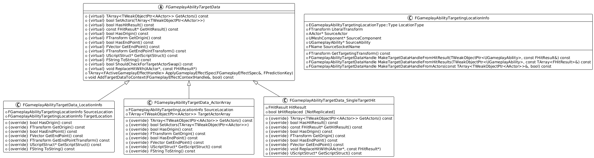

---

`FGameplayAbilityTargetingLocationInfo`:<br>
这是一个辅助结构，用于描述一个空间位置，支持三种模式：<br>
LiteralTransform：直接存储一个 FTransform。<br>
ActorTransform：引用一个 SourceActor，取其当前变换。<br>
SocketTransform：引用一个 MeshComponent 和 Socket 名称，获取该 Socket 的变换。<br>

这种设计允许在生成目标数据时仅保存“如何获取位置”的信息，而不是具体的坐标值，从而在网络传输中更高效（例如只需引用 Actor 和 Socket 名，而不是每帧更新的坐标）。<br>
`GetTargetingTransform `方法会在使用时根据当前状态实时计算位置。


---

`AbilitySystemBlueprintLibrary` 提供的相关函数:

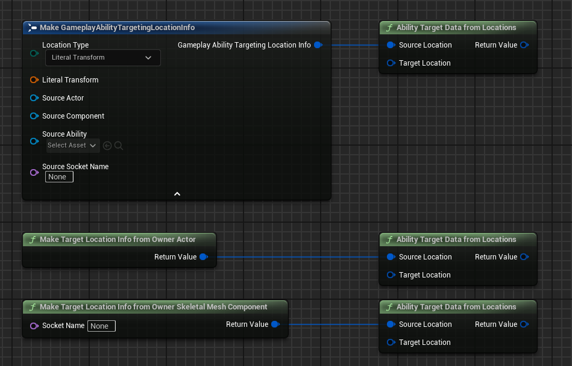

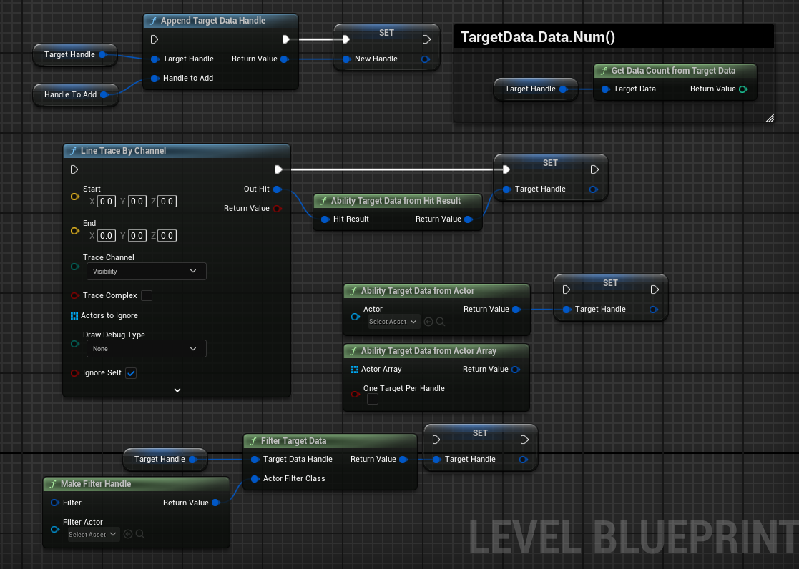

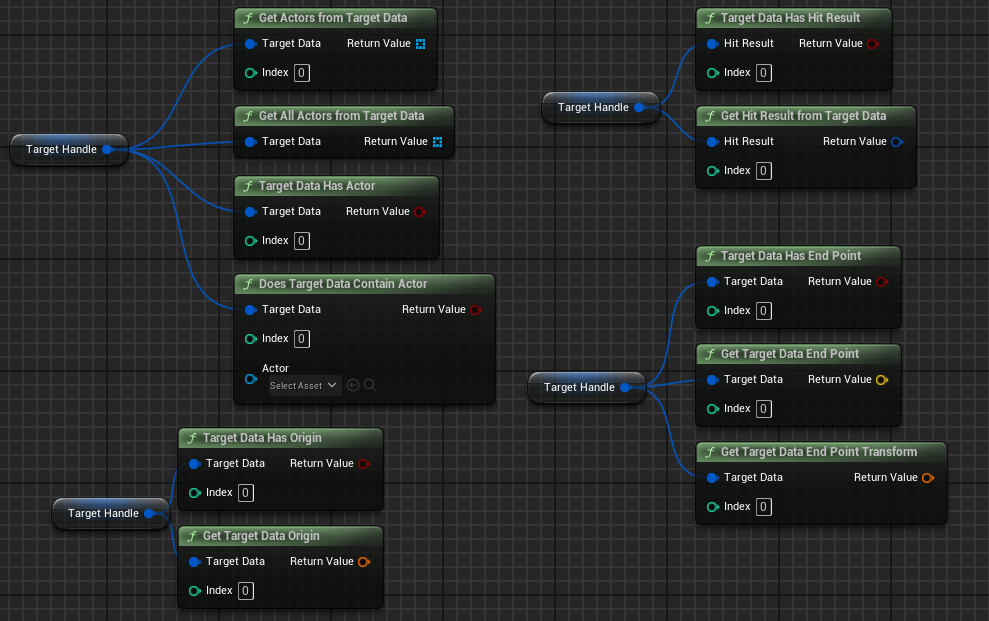

---

GA可以调用`ApplyGameplayEffectToTarget`函数，直接对`TargetData`中的所有Actor 应用GE.

获取`TargetDataHandle`中保存的`TargetData`.<br>
调用`FGameplayAbilityTargetData::ApplyGameplayEffectSpec`.

```cpp
TArray<FActiveGameplayEffectHandle> FGameplayAbilityTargetData::ApplyGameplayEffectSpec(FGameplayEffectSpec& InSpec)
{
    TArray<TWeakObjectPtr<AActor> > Actors = GetActors();

    for (TWeakObjectPtr<AActor>& TargetActor : Actors)
    {
        UAbilitySystemComponent* TargetComponent = UAbilitySystemBlueprintLibrary::GetAbilitySystemComponent(TargetActor.Get());

		if (TargetComponent)
		{
			// We have to make a new effect spec and context here, because otherwise the targeting info gets accumulated and things take damage multiple times
			FGameplayEffectSpec	SpecToApply(InSpec);
			FGameplayEffectContextHandle EffectContext = SpecToApply.GetContext().Duplicate();
			SpecToApply.SetContext(EffectContext);

			AddTargetDataToContext(EffectContext, false);

			AppliedHandles.Add(EffectContext.GetInstigatorAbilitySystemComponent()->ApplyGameplayEffectSpecToTarget(SpecToApply, TargetComponent, PredictionKey));
		}
    }
}
```

遍历`Actors`，`ApplyGameplayEffectSpecToTarget`: 对`Actor`应用GE. <br>


---

`AbilityTask_WaitTargetData` : 前文分析过了，看前文.


---
### LyraGAS

[抢先预告](https://dev.epicgames.com/documentation/zh-cn/unreal-engine/abilities-in-lyra-in-unreal-engine)

---

#### 玩家标记

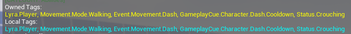

使用`Lyra.Player`标记玩家. (根本就没有地方会用到这个标签).

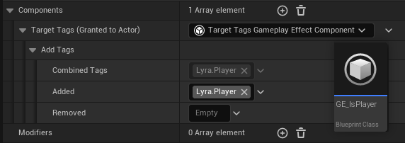


---

#### 技能与按键
以`Dash`技能为例，按下`Shift`键触发技能，说明技能按键绑定过程.<br>
`GiveAbility`函数 需要根据`Ability`创建一个`AbilitySpec`类型的对象作为参数.
```cpp
FGameplayAbilitySpecHandle GiveAbility(const FGameplayAbilitySpec& AbilitySpec);
```

`AbilitySpec`有一个可选的Tag容器 : `DynamicAbilityTags`
```cpp
struct GAMEPLAYABILITIES_API FGameplayAbilitySpec : public FFastArraySerializerItem
{
    /** Optional ability tags that are replicated.  These tags are also captured as source tags by applied gameplay effects. */
    UPROPERTY()
    FGameplayTagContainer DynamicAbilityTags;
}
```

按键绑定ASC: <br>
增强输入可以绑定函数，函数参数是可选的.<br>
将按键与`GameplayTag`绑定起来， 按下键盘时，把对应的`GameplayTag`传给绑定的函数.<br>
例如: 按下`Shift`键时，绑定的函数将会接收到`InputTag.Ability.Dash`标签.<br>
绑定的函数 再把接收到的`GameplayTag`传入ASC.

ASC在已经拥有的技能中 查找拥有此`GameplayTag`的技能，<br>
如果 有一个技能的`DynamicAbilityTags` 与 接收的`GameplayTag` 匹配，就激活这个技能.

键的按下与松开:<br>
按下按键时，激活技能<br>
松开按键时，取消技能<br>

按下和松开 都要向ASC传递对应的`GameplayTag`，<br>
如果按下按键，ASC要找到与这个键的`GameplayTag` 对应的那个技能，激活技能.<br>
如果松开按键，ASC要去查找并取消那个技能.

---
`InputTag` 与 `AbilitySpec`

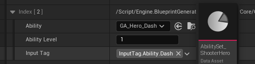

在构造`AbilitySpec`后，将`InputTag`存入`DynamicAbilityTags`.

```cpp
void ULyraAbilitySet::GiveToAbilitySystem
{
    FGameplayAbilitySpec AbilitySpec(AbilityCDO, AbilityToGrant.AbilityLevel);
    AbilitySpec.SourceObject = SourceObject;
    AbilitySpec.DynamicAbilityTags.AddTag(AbilityToGrant.InputTag);

    const FGameplayAbilitySpecHandle AbilitySpecHandle = LyraASC->GiveAbility(AbilitySpec);
}
```

---

`InputTag` 与 按键输入

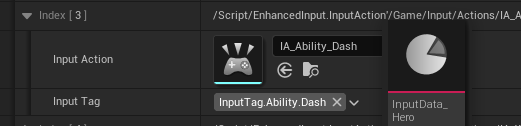

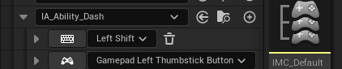

`IA_Ability_Dash` 要绑定`InputTag.Ability.Dash`，按下`Shift`键 触发`IA_Ability_Dash`.

`InputAction` 绑定`GameplayTag` :
```cpp
ULyraHeroComponent::InitializePlayerInput
{
    ULyraInputComponent* LyraIC = Cast<ULyraInputComponent>(PlayerInputComponent);
    LyraIC->BindAbilityActions(InputConfig, this, &ThisClass::Input_AbilityInputTagPressed, &ThisClass::Input_AbilityInputTagReleased);
}

template<class UserClass, typename PressedFuncType, typename ReleasedFuncType>
void ULyraInputComponent::BindAbilityActions(const ULyraInputConfig* InputConfig, UserClass* Object, PressedFuncType PressedFunc, ReleasedFuncType ReleasedFunc)
{
    BindAction(Action.InputAction, ETriggerEvent::Triggered, Object, PressedFunc, Action.InputTag);
    BindAction(Action.InputAction, ETriggerEvent::Completed, Object, ReleasedFunc, Action.InputTag);
}
```

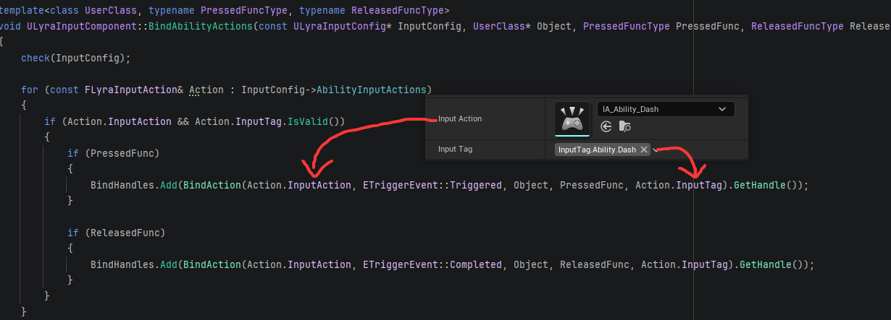

一次性绑定按下和松开的函数，<br>
`Action.InputAction`输入的Action<br>
`PressedFunc`要触发的函数，`Action.InputTag` 被触发函数 需要的参数<br>

```cpp
void ULyraHeroComponent::Input_AbilityInputTagPressed(FGameplayTag InputTag)
{
    /*...*/
    LyraASC->AbilityInputTagPressed(InputTag);
}
```

绑定完成之后，再按下`Shift`键时，触发`Input_AbilityInputTagPressed`函数，<br>
这个函数的参数就是 `InputTag.Ability.Dash`.<br>
然后调用ASC的`AbilityInputTagPressed`，将这个Tag传进去.

---

技能的收集与激活

按键激活技能，一般思路是 按下键时 就去激活那个技能.<br>
但是Lyra在按下键时 没有激活技能，而是收集要激活的技能,<br>
在`玩家控制器`处理完输入以后 再去激活技能.

`AbilityInputTagPressed`.<br>
根据接收到的`InputTag`查找要激活的技能，并存放到`InputPressedSpecHandles`中.<br>
```cpp
void ULyraAbilitySystemComponent::AbilityInputTagPressed(const FGameplayTag& InputTag)
{
    if (InputTag.IsValid())
    {
        for (const FGameplayAbilitySpec& AbilitySpec : ActivatableAbilities.Items)
        {
            if (AbilitySpec.Ability && (AbilitySpec.DynamicAbilityTags.HasTagExact(InputTag)))
            {
                InputPressedSpecHandles.AddUnique(AbilitySpec.Handle);
                InputHeldSpecHandles.AddUnique(AbilitySpec.Handle);
            }
        }
    }
}
```

`ProcessAbilityInput` 由玩家控制器的`PostProcessInput`来调用.<br>
在输入完成以后 激活技能.
```cpp
void ALyraPlayerController::PostProcessInput(const float DeltaTime, const bool bGamePaused)
{
    if (ULyraAbilitySystemComponent* LyraASC = GetLyraAbilitySystemComponent())
    {
        LyraASC->ProcessAbilityInput(DeltaTime, bGamePaused);
    }

    Super::PostProcessInput(DeltaTime, bGamePaused);
}
```
激活过程:
```cpp
void ULyraAbilitySystemComponent::ClearAbilityInput()
{
    InputPressedSpecHandles.Reset();
    InputReleasedSpecHandles.Reset();
    InputHeldSpecHandles.Reset();
}

ULyraAbilitySystemComponent::ProcessAbilityInput
{
    if (HasMatchingGameplayTag(TAG_Gameplay_AbilityInputBlocked))
    {
        ClearAbilityInput();
        return;
    }

    static TArray<FGameplayAbilitySpecHandle> AbilitiesToActivate;
    AbilitiesToActivate.Reset();

    /*...*/

    for (const FGameplayAbilitySpecHandle& AbilitySpecHandle : AbilitiesToActivate)
    {
        TryActivateAbility(AbilitySpecHandle);
    }

    /*...*/
    InputPressedSpecHandles.Reset();
    InputReleasedSpecHandles.Reset();
}
```
代码太长了，只解释一下思路：<br>
`HasMatchingGameplayTag` 第一步先判断有没有被阻止放技能，例如 被沉默了，就不能激活技能.<br>
并且把收集到的 要激活的技能`Handle`全部清空.<br>

如果没有被阻止放技能.<br>
根据`AbilitySpecHandle`获得`AbilitySpec`，将它们存放在`AbilitiesToActivate`中.<br>
之后统一激活这些技能.<br>
这一帧把技能给激活完之后，清空之前收集的要激活的技能`Handle`.


---

#### 血量 | 伤害

`LyraHealthSet` 定义了 <br>
`Health` `MaxHealth` 生命值、最大生命值，<br>
`Healing` `Damage` 即将到来的治疗、伤害.<br>

`LyraCombatSet` 定义了 <br>
`BaseDamage` `BaseHeal` 基础伤害、基础治疗.

---

伤害计算 <br>
不想写了，这些函数的具体意义参见上一章 `GAS源码分析 - AttributeSet`.<br>
代码部分也简单，很多地方都有注释，看他们留下的注释就好了.

---
`BaseDamage` `BaseHeal`的用法是一样的，所以只需要说明`BaseDamage`就行了.<br>

伤害过程

`GE_Damage_Pistol` 使用的伤害类:

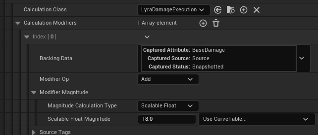

关于`LyraCombatSet` 需要一些说明.<br>
如上图，GE捕获了`BaseDamage`，并且 `Add 18`.<br>
角色的`BaseDamage`属性都是0，在加上`18`之后，捕获到的值就是`18`.

```cpp
void ULyraDamageExecution::Execute_Implementation(const FGameplayEffectCustomExecutionParameters& ExecutionParams, FGameplayEffectCustomExecutionOutput& OutExecutionOutput) const
{
    float BaseDamage = 0.0f;
    ExecutionParams.AttemptCalculateCapturedAttributeMagnitude(DamageStatics().BaseDamageDef, EvaluateParameters, BaseDamage);

    // Apply a damage modifier, this gets turned into - health on the target
    OutExecutionOutput.AddOutputModifier(FGameplayModifierEvaluatedData(ULyraHealthSet::GetDamageAttribute(), EGameplayModOp::Additive, DamageDone));
}
```
玩家在开枪对敌人造成伤害时，伤害值就是 捕获到的 玩家的 `BaseDamage` 属性值.<br>
使用`BaseDamage`修改`LyraHealthSet`的`Damage`，实际意义上是添加伤害.<br>
如图，伤害值是`18`.

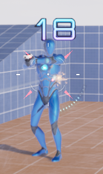


---

#### 角色死亡与重生

##### 重生过程

`ULyraAbilitySystemComponent::InitAbilityActorInfo` 在基类函数的基础上，添加了对GA的处理，更新GA中关于Pawn的配置.<br>
如果GA中针对Pawn做了一些处理，那么当Pawn重生时 GA需要更新它所使用的Pawn.

因为在Pawn的死亡重生是`DestroyActor`，所以需要更新Pawn，<br>
GA以指针形式保存了ASC中的`ActorInfo`，即使ASC组件的`ActorInfo`的内容更新了，GA也能获得正确的值.<br>

```cpp
UAbilitySystemComponent::GiveAbility
->UAbilitySystemComponent::OnGiveAbility(FGameplayAbilitySpec& Spec)
->UGameplayAbility::OnGiveAbility(const FGameplayAbilityActorInfo* ActorInfo, const FGameplayAbilitySpec& Spec)
```

---

控制的Pawn在 死亡重生时 会发生变化，<br>
角色死亡逻辑:`ULyraGameplayAbility_Death`<br>
死亡技能激活时，调用`HealthComponent->StartDeath();` <br>
死亡技能结束时，调用`HealthComponent->FinishDeath();`<br>
这两个函数发出对应事件的广播，角色类绑定这个广播,对死亡做出反应.
```cpp
ALyraCharacter::ALyraCharacter
{
    HealthComponent = CreateDefaultSubobject<ULyraHealthComponent>(TEXT("HealthComponent"));
    HealthComponent->OnDeathStarted.AddDynamic(this, &ThisClass::OnDeathStarted);
    HealthComponent->OnDeathFinished.AddDynamic(this, &ThisClass::OnDeathFinished);
}
```

在`OnDeathStarted`时，关闭移动和碰撞.<br>
在`OnDeathFinished`时，在下一帧摧毁

```cpp
void ALyraCharacter::OnDeathFinished(AActor*)
{
    GetWorld()->GetTimerManager().SetTimerForNextTick(this, &ThisClass::DestroyDueToDeath);
}


void ALyraCharacter::UninitAndDestroy()
{
    if (GetLocalRole() == ROLE_Authority)
    {
        DetachFromControllerPendingDestroy();
        SetLifeSpan(0.1f);
    }

    // Uninitialize the ASC if we're still the avatar actor (otherwise another pawn already did it when they became the avatar actor)
    if (ULyraAbilitySystemComponent* LyraASC = GetLyraAbilitySystemComponent())
    {
        if (LyraASC->GetAvatarActor() == this)
        {
            PawnExtComponent->UninitializeAbilitySystem();
        }
    }

    SetActorHiddenInGame(true);
}
```
`PawnExtComponent->UninitializeAbilitySystem();`<br>
如果要死亡的角色依然是ASC的Avatar： 取消技能、取消技能的输入、清理GameplayCue、Avatar设为空.

因为已经调用了`DetachFromControllerPendingDestroy`， 角色不再接收控制器的输入，所以取消技能的输入是安全的。

角色和控制器的关系绑定:<br>
在`GameMode`中配置玩家要使用的角色类、控制器类，
```cpp
void AGameModeBase::FinishRestartPlayer(AController* NewPlayer, const FRotator& StartRotation)
{
    NewPlayer->Possess(NewPlayer->GetPawn());
}
AController::Possess(APawn* InPawn)
->AController::OnPossess(APawn* InPawn)
->APawn::PossessedBy(AController* NewController)
->APawn::ReceivePossessed(AController* NewController)

UFUNCTION(BlueprintImplementableEvent, BlueprintAuthorityOnly, meta=(DisplayName= "Possessed"))
ENGINE_API void ReceivePossessed(AController* NewController);
```

---
复活技能:

```cpp
ShooterCore/Game/Respawn/GA_AutoRespawn
```
监听死亡事件，如果有角色死亡，调用`ALyraGameMode::RequestPlayerRestartNextFrame`，并且将控制器传进去，

```cpp
void ALyraGameMode::RequestPlayerRestartNextFrame(AController* Controller, bool bForceReset)
{
    if (APlayerController* PC = Cast<APlayerController>(Controller))
    {
        GetWorldTimerManager().SetTimerForNextTick(PC, &APlayerController::ServerRestartPlayer_Implementation);
    }
}
```
`ServerRestartPlayer` ： 找一个出生点 生成角色类，并且将角色传给控制器.
```cpp
void AGameModeBase::RestartPlayerAtPlayerStart(AController* NewPlayer, AActor* StartSpot)
{
    APawn* NewPawn = SpawnDefaultPawnFor(NewPlayer, StartSpot);
    if (IsValid(NewPawn))
    {
        NewPlayer->SetPawn(NewPawn);
    }

    FinishRestartPlayer(NewPlayer, SpawnRotation);
}

AGameModeBase::FinishRestartPlayer
->AController::Possess(APawn* InPawn)
->AController::OnPossess(APawn* InPawn)
->APawn::PossessedBy(AController* NewController)
->APawn::ReceivePossessed(AController* NewController)
```

---


##### 死亡技能
死亡也是一种能力. 当血量值小于等于0时，角色就要死亡. 

死亡判定以及技能触发:

```cpp
mutable FLyraAttributeEvent OnOutOfHealth;

/**
 * 在GameplayEffect执行以修改属性的基础值之后调用。此时不能再进行任何更改。
 * 注意：此函数仅在'执行(execute)'期间调用。例如，对属性'基础值(base value)'的修改。
 *       在应用GameplayEffect（如持续5秒的+10移动速度增益）时不会调用此函数。
 */
virtual void PostGameplayEffectExecute(const struct FGameplayEffectModCallbackData &Data) {
    if ((GetHealth() <= 0.0f))
    {
        OnOutOfHealth.Broadcast(Instigator, Causer, &Data.EffectSpec, Data.EvaluatedData.Magnitude, HealthBeforeAttributeChange, GetHealth());
    }
}
```
OnOutOfHealth 广播内容: 凶手Actor、凶器、GESpec等信息.

`AttributeSet` 中判断生命中是否小于等于0 ， 如果小于等于0 -> 广播`OnOutOfHealth`.

`HealthComponent` 只需要绑定这个委托，就可以响应死亡事件了.

死亡事件绑定：
```cpp
void ULyraHealthComponent::InitializeWithAbilitySystem(ULyraAbilitySystemComponent* InASC)
{
    HealthSet = AbilitySystemComponent->GetSet<ULyraHealthSet>();
    HealthSet->OnOutOfHealth.AddUObject(this, &ThisClass::HandleOutOfHealth);
}

void ULyraHealthComponent::HandleOutOfHealth( const FGameplayEffectSpec* DamageEffectSpec/* */)
{
    if (AbilitySystemComponent && DamageEffectSpec)
    {
        FGameplayEventData Payload;
        Payload.EventTag = LyraGameplayTags::GameplayEvent_Death;
        /* 省略 */
        AbilitySystemComponent->HandleGameplayEvent(Payload.EventTag, &Payload);
    }
}
```

死亡事件触发时，`HealthComponent` 向ASC发送`GameplayEvent` 触发死亡技能.

ASC的`HandleGameplayEvent`蓝图版本：

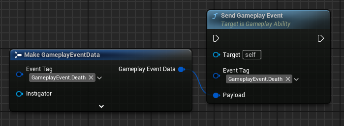
```cpp
void UGameplayAbility::SendGameplayEvent(FGameplayTag EventTag, FGameplayEventData Payload)
{
    UAbilitySystemComponent* const AbilitySystemComponent = GetAbilitySystemComponentFromActorInfo_Ensured();
    if (AbilitySystemComponent)
    {
        FScopedPredictionWindow NewScopedWindow(AbilitySystemComponent, true);
        AbilitySystemComponent->HandleGameplayEvent(EventTag, &Payload);
    }
}
```

下面说明`HandleGameplayEvent`的运行机制.

使用Tag触发技能 ：

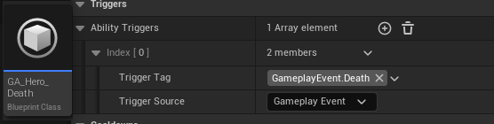


触发机制分析: 依然是 `GiveAbility` 阶段保存触发Tag.

```cpp
/** Abilities that are triggered from a gameplay event */
TMap<FGameplayTag, TArray<FGameplayAbilitySpecHandle > > GameplayEventTriggeredAbilities;

void UAbilitySystemComponent::OnGiveAbility(FGameplayAbilitySpec& Spec)
{
    for (const FAbilityTriggerData& TriggerData : Spec.Ability->AbilityTriggers)
    {
        FGameplayTag EventTag = TriggerData.TriggerTag;

        auto& TriggeredAbilityMap = (TriggerData.TriggerSource == EGameplayAbilityTriggerSource::GameplayEvent) ? GameplayEventTriggeredAbilities : OwnedTagTriggeredAbilities;

        TArray<FGameplayAbilitySpecHandle> Triggers;
        Triggers.Add(Spec.Handle);
        TriggeredAbilityMap.Add(EventTag, Triggers);
    }
}
```

在这个例子中, `TriggeredAbilityMap` 就是 <font color = "#07fff3ff"> GameplayEventTriggeredAbilities </font> .

将GameplayTag与对应的GA保存在<font color = "#07fff3ff"> GameplayEventTriggeredAbilities </font> ,以方便后续使用Tag查找对应的GA.

```cpp
int32 UAbilitySystemComponent::HandleGameplayEvent(FGameplayTag EventTag, const FGameplayEventData* Payload)
{
    int32 TriggeredCount = 0;
    FGameplayTag CurrentTag = EventTag;
    while (CurrentTag.IsValid())
    {
        if (GameplayEventTriggeredAbilities.Contains(CurrentTag))
        {
            TArray<FGameplayAbilitySpecHandle> TriggeredAbilityHandles = GameplayEventTriggeredAbilities[CurrentTag];

            for (const FGameplayAbilitySpecHandle& AbilityHandle : TriggeredAbilityHandles)
            {
                if (TriggerAbilityFromGameplayEvent(AbilityHandle, AbilityActorInfo.Get(), EventTag, Payload, *this))
                {
                    TriggeredCount++;
                }
            }
        }
    }
}
```

通过Tag从<font color = "#07fff3ff"> GameplayEventTriggeredAbilities </font>里面找到对应的GA.<br>
激活找到的所有GA.

---
```cpp
void ULyraHealthComponent::HandleOutOfHealth(/* ... */)
{
    FGameplayEventData Payload;
    /* Payload...填充数据 */
    AbilitySystemComponent->HandleGameplayEvent(Payload.EventTag, &Payload);
}
```

这个函数在触发事件时，传递了`FGameplayEventData`，要使用EventData 需要专用事件来接收.

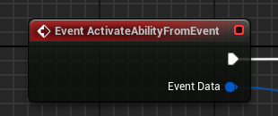

```cpp
void UGameplayAbility::ActivateAbility(const FGameplayAbilitySpecHandle Handle, const FGameplayAbilityActorInfo* ActorInfo, const FGameplayAbilityActivationInfo ActivationInfo, const FGameplayEventData* TriggerEventData)
{
    if (TriggerEventData && bHasBlueprintActivateFromEvent)
    {
        // A Blueprinted ActivateAbility function must call CommitAbility somewhere in its execution chain.
        K2_ActivateAbilityFromEvent(*TriggerEventData);
    }
    /* ... */
}

/* 判断是否实现了这个节点 */
UGameplayAbility::UGameplayAbility
{
    auto ImplementedInBlueprint = [](const UFunction* Func) -> bool
    {
        return Func && ensure(Func->GetOuter())
            && Func->GetOuter()->IsA(UBlueprintGeneratedClass::StaticClass());
    };

    static FName FuncName = FName(TEXT("K2_ActivateAbilityFromEvent"));
    UFunction* ActivateFunction = GetClass()->FindFunctionByName(FuncName);
    bHasBlueprintActivateFromEvent = ImplementedInBlueprint(ActivateFunction);
}
```

---

##### 摄像机系统
角色死亡后会切换成上帝视角.

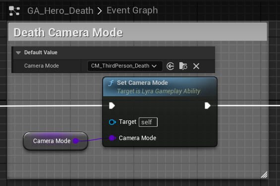

死亡技能触发时，绘制玩家位置。 并且将CameraMode用到的曲线值全部为改为0，

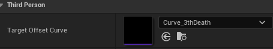

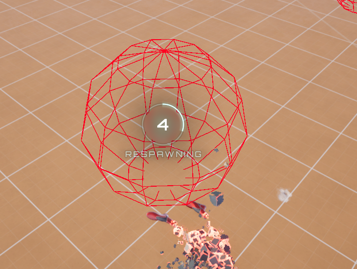

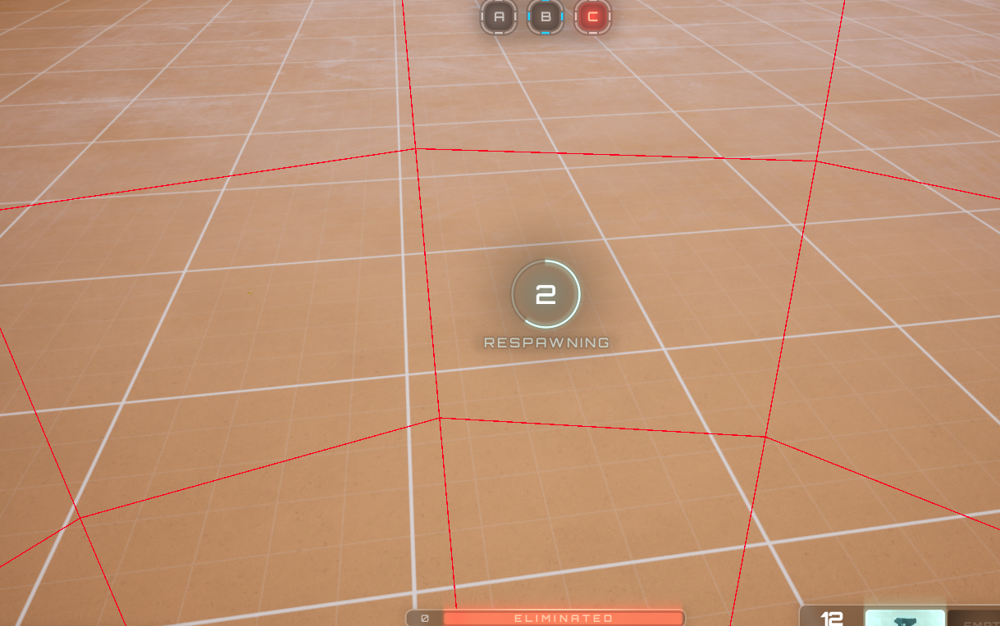


如果没有用曲线设置Offset，那么摄像机的位置就是玩家所在位置. OffsetCurve真的就只是Offset.

---

`FLyraPenetrationAvoidanceFeeler`:<br>
`AdjustmentRot` 描述与主射线偏离程度的FRotator<br>
`WorldWeight` 如果此射线击中世界，对最终位置的影响程度<br>
`PawnWeight` 如果此射线击中APawn，对最终位置的影响程度（设置为0将完全不会尝试与pawn碰撞）<br>
`Extent` 追踪此射线时用于碰撞的范围<br>
`TraceInterval` 如果上一帧未命中任何物体，使用此射线进行追踪的最小帧间隔<br>
`FramesUntilNextTrace`  距离上次使用此射线已过的帧数<br>

---

在CameraMode中实现相机穿透回避.
```cpp
class ULyraCameraMode_ThirdPerson : public ULyraCameraMode
{
    UPROPERTY(EditDefaultsOnly, Category = "Collision")
    TArray<FLyraPenetrationAvoidanceFeeler> PenetrationAvoidanceFeelers;
}
```
1.多方向碰撞检测
- 每条 Feeler 代表一个特定方向的射线
- 从相机目标位置（通常是角色）向期望相机位置发射
- 不同射线有不同的旋转偏移（AdjustmentRot），覆盖多个角度

2.分层权重系统
- 主射线（索引0）：核心碰撞检测，权重最高（1.0），用于实时防止相机穿墙
- 辅助射线（索引1+）：预测性检测，用于预判可能发生的碰撞

3.性能优化
- TraceInterval：控制射线追踪频率，避免每帧都进行昂贵检测
- FramesUntilNextTrace：动态调整检测间隔，命中时立即重新检测

4.智能碰撞响应
- WorldWeight 和 PawnWeight：区分场景几何体和角色，不同权重
- Extent：球形检测范围，防止相机被细小物体卡住

调用链 ：
```cpp
APlayerCameraManager::UpdateViewTarget
APlayerCameraManager::UpdateViewTargetInternal

AActor::CalcCamera

ULyraCameraComponent::GetCameraView
ULyraCameraModeStack::EvaluateStack
ULyraCameraModeStack::UpdateStack
ULyraCameraMode::UpdateCameraMode
ULyraCameraMode_ThirdPerson::UpdateView
ULyraCameraMode_ThirdPerson::UpdatePreventPenetration
```

```cpp
class APlayerCameraManager : public AActor
{
    /** Current ViewTarget */
    UPROPERTY(transient)
    struct FTViewTarget ViewTarget;
}
```
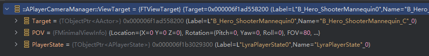

`ViewTarget` 保存了玩家的信息，<br>
调用 `B_Hero_ShooterMannequin0` 这个Actor的函数 --->`AActor::CalcCamera` <br>
`CalcCamera()`找到相机组件，就到了`ULyraCameraComponent::GetCameraView`这个函数里.

`APlayerCameraManager` 原本只是想获得一个关于摄像机的数据，
```cpp
void APlayerCameraManager::UpdateViewTargetInternal(FTViewTarget& OutVT, float DeltaTime)
{
    if (OutVT.Target)
    {
        OutVT.Target->CalcCamera(DeltaTime, OutVT.POV);
    }
}

/*--- 关于POV ---*/
struct FTViewTarget
{
    /** Computed point of view */
    UPROPERTY(EditAnywhere, BlueprintReadWrite, Category=TViewTarget)
    struct FMinimalViewInfo POV;
}
```
`FMinimalViewInfo`数据要从摄像机组件中获取，包括 位置、旋转、FOV、远近裁剪值、宽高比例、投影方式、后期处理 等.  

这个流程是原本引擎中就设定好的，而Lyra创建了自己的摄像机组件 重写了摄像机组件提供数据的行为.

---

`GA` 和 `CameraComponent`的交互，总体而言 `LyraHeroComponent`是中转站，<br>
`GA`将`CameraMode`传给`HeroComp`，摄像机组件从`HeroComp`获得`CameraMode`.

`GA` 的 `SetCameraMode`
```cpp
void ULyraGameplayAbility::SetCameraMode(TSubclassOf<ULyraCameraMode> CameraMode)
{
    ENSURE_ABILITY_IS_INSTANTIATED_OR_RETURN(SetCameraMode, );

    if (ULyraHeroComponent* HeroComponent = GetHeroComponentFromActorInfo())
    {
        HeroComponent->SetAbilityCameraMode(CameraMode, CurrentSpecHandle);
        ActiveCameraMode = CameraMode;
    }
}

void ULyraHeroComponent::SetAbilityCameraMode(TSubclassOf<ULyraCameraMode> CameraMode, const FGameplayAbilitySpecHandle& OwningSpecHandle)
{
    if (CameraMode)
    {
        AbilityCameraMode = CameraMode;
        AbilityCameraModeOwningSpecHandle = OwningSpecHandle;
    }
}
```
`GA` 将 `CameraMode` 传给 `HeroComponent`.<br>
`HeroComponent`在初始化时，绑定 `LyraCameraComponent`的事件，让摄像机组件可以获取`CameraMode`.

```cpp
void ULyraHeroComponent::HandleChangeInitState(UGameFrameworkComponentManager* Manager, FGameplayTag CurrentState, FGameplayTag DesiredState)
{
    // Hook up the delegate for all pawns, in case we spectate later
        if (PawnData)
        {
            if (ULyraCameraComponent* CameraComponent = ULyraCameraComponent::FindCameraComponent(Pawn))
            {
                CameraComponent->DetermineCameraModeDelegate.BindUObject(this, &ThisClass::DetermineCameraMode);
            }
        }
}

TSubclassOf<ULyraCameraMode> ULyraHeroComponent::DetermineCameraMode() const
{
    if (AbilityCameraMode)
    {
        return AbilityCameraMode;
    }

    /* 
        如果Pawn是空，返回空指针
        否则返回PawnData里面的默认CameraMode
    */
}
```
`DECLARE_DELEGATE_RetVal(TSubclassOf<ULyraCameraMode>, FLyraCameraModeDelegate);`

```cpp
class ULyraCameraComponent : public UCameraComponent
{
    // Delegate used to query for the best camera mode.
    FLyraCameraModeDelegate DetermineCameraModeDelegate;
}
```

这样一来，GA就通过`HeroComponent`与摄像机系统联系起来了.<br>
接下来是 `LyraCameraComponent` 获取`CameraMode`的过程.<br>
其实就是执行一下`DetermineCameraModeDelegate` 获得返回值就可以 ：

```cpp
ULyraCameraComponent::GetCameraView
ULyraCameraModeStack::EvaluateStack

/* ------------------------ */

void ULyraCameraComponent::GetCameraView(/* ... */)
{
    UpdateCameraModes();
}

void ULyraCameraComponent::UpdateCameraModes()
{
    check(CameraModeStack);

    if (DetermineCameraModeDelegate.IsBound())
    {
        if (const TSubclassOf<ULyraCameraMode> CameraMode = DetermineCameraModeDelegate.Execute())
        {
            CameraModeStack->PushCameraMode(CameraMode);
        }
    }
}
```
从委托中获得`CaemraMode` 并存入`CameraModeStack`.

`Stack` 就像洗盘子，洗完一个盘子A 放那，又洗一个盘子B 又放一个，一直叠叠叠.<br>
用盘子时，永远会使用叠在最上面的那个盘子.
```cpp
盘子B  <--- 下次先使用盘子B.
盘子A
```

---

```cpp
void APlayerCameraManager::UpdateViewTargetInternal(FTViewTarget& OutVT, float DeltaTime)
{
    if (OutVT.Target)
    {
        OutVT.Target->CalcCamera(DeltaTime, OutVT.POV);
    }
}

void AActor::CalcCamera(float DeltaTime, FMinimalViewInfo& OutResult)
{
    CameraComponent->GetCameraView(DeltaTime, OutResult);
}
```
`APlayerCameraManager` 原本只是想获得一个关于摄像机的数据， 它要的数据到底在哪里？

`CalcCamera`调用摄像机组件的`GetCameraView`，<br>
所以 要使用`CameraMode` 就要重写摄像机组件的`GetCameraView`函数.

```cpp
void ULyraCameraComponent::GetCameraView(float DeltaTime, FMinimalViewInfo& DesiredView)
{
    FLyraCameraModeView CameraModeView;
    CameraModeStack->EvaluateStack(DeltaTime, CameraModeView);
    /* ... */
    // Fill in desired view.
    DesiredView.Location = CameraModeView.Location;
    DesiredView.Rotation = CameraModeView.Rotation;
}
```

关键就在于`EvaluateStack`. `Evaluate` : 评估\求值<br>
函数参数中传递了`DeltaTime`，盲猜`DeltaTime`是用来插值的.

---

```cpp
ULyraCameraModeStack::EvaluateStack
ULyraCameraModeStack::UpdateStack
-->CameraMode->UpdateCameraMode(DeltaTime);
--->ULyraCameraMode::UpdateView
```
```cpp
bool ULyraCameraModeStack::EvaluateStack(float DeltaTime, FLyraCameraModeView& OutCameraModeView)
{
    /* ... */
    UpdateStack(DeltaTime);
    BlendStack(OutCameraModeView);
    return true;
}
```

`ULyraCameraModeStack::UpdateStack`先对`CameraModeStack`的每一个元素进行更新:<br>
`CameraMode->UpdateCameraMode(DeltaTime);`

`ULyraCameraMode::UpdateView` :<br>
```cpp
FLyraCameraModeView View;

void ULyraCameraMode::UpdateView(float DeltaTime)
{
    FVector PivotLocation = GetPivotLocation();
    FRotator PivotRotation = GetPivotRotation();

    PivotRotation.Pitch = FMath::ClampAngle(PivotRotation.Pitch, ViewPitchMin, ViewPitchMax);

    View.Location = PivotLocation;
    View.Rotation = PivotRotation;
    View.ControlRotation = View.Rotation;
    View.FieldOfView = FieldOfView;
}
```

球是`PivotLocation`，箭头是`PivotRotation`，<br>

```cpp
const float DefaultHalfHeight = CapsuleCompCDO->GetUnscaledCapsuleHalfHeight();
const float ActualHalfHeight = CapsuleComp->GetUnscaledCapsuleHalfHeight();
const float HeightAdjustment = (DefaultHalfHeight - ActualHalfHeight) +TargetCharacterCDO->BaseEyeHeight;
```
`PivotRotation`的计算与作用：
```cpp
站立：
DefaultHalfHeight = 90
ActualHalfHeight  = 90
HeightAdjustment  = 80
BaseEyeHeight 	= 80
ActorLocation = (X=-947, Y=-141,Z=142)
PivotLocation = (X=-947, Y=-141,Z=222)

蹲下:
DefaultHalfHeight = 90
ActualHalfHeight  = 65
HeightAdjustment  = 105
BaseEyeHeight 	= 80
ActorLocation = (X=-947, Y=-141,Z=117)
PivotLocation = (X=-947, Y=-141,Z=222)
```
`PivotLocation`保证了站立、蹲下时，摄像机位置不变.

```cpp
void ULyraCameraMode::UpdateCameraMode(float DeltaTime)
{
    UpdateView(DeltaTime);
    UpdateBlending(DeltaTime);
}
```
`ULyraCameraMode::UpdateView` 这个函数的作用就明确了,<br>
`UpdateView`计算了位置、旋转，并将数据存到`View`变量中.

`UpdateBlending` ：
```cpp
void ULyraCameraMode::UpdateBlending(float DeltaTime)
{
    if (BlendTime > 0.0f)
    {
        BlendAlpha += (DeltaTime / BlendTime);
        BlendAlpha = FMath::Min(BlendAlpha, 1.0f);
    }
    else
    {
        BlendAlpha = 1.0f;
    }
    /* 省略: 使用BlendAlpha 对 BlendWeight进行插值 */
}
```
`BlendTime`如果小于等于0，直接切换 不混合，大于0 就更新BlendAlpha 进行混合<br>
`CM_ThirdPerson_Death` 的 `BlendTime`是4.0

```cpp
void ULyraCameraModeStack::UpdateStack(float DeltaTime)
{
    for (int32 StackIndex = 0; StackIndex < StackSize; ++StackIndex)
    {
        ULyraCameraMode* CameraMode = CameraModeStack[StackIndex];
        check(CameraMode);

        CameraMode->UpdateCameraMode(DeltaTime);

        if (CameraMode->GetBlendWeight() >= 1.0f)
        {
            // Everything below this mode is now irrelevant and can be removed.
            RemoveIndex = (StackIndex + 1);
            RemoveCount = (StackSize - RemoveIndex);
            break;
        }
    }
}
```
每帧对`CameraModeStack`的所有元素更新一次<br>
如果其中一个的混合权重大于等于1，那么在这个`CameraMode`之下的那些`Mode`就可以被移除了，它们已经没有作用了.

`Stack`的移除逻辑：
```cpp
RemoveIndex = (StackIndex + 1);
RemoveCount = (StackSize - RemoveIndex);

if (RemoveCount > 0)
{
    // Let the camera modes know they being removed from the stack.
    for (int32 StackIndex = RemoveIndex; StackIndex < StackSize; ++StackIndex)
    {
        ULyraCameraMode* CameraMode = CameraModeStack[StackIndex];
        check(CameraMode);

        CameraMode->OnDeactivation();
    }

    CameraModeStack.RemoveAt(RemoveIndex, RemoveCount);
}
```
假设 CameraModeStack：A-B-C-D<br>
假如目前遍历到A，它的`BlendWeight`大于等于1，也就是说当前的`CameraMode`是A，所以在A之后的已经没有用处了.<br>
此时，`RemoveIndex = 0 + 1 = 1`，`RemoveCount = 4 - 1 = 3`<br>
`RemoveCount = 3 > 0`，从索引1开始遍历，调用这些`CameraMode`的`OnDeactivation`.<br>
`RemoveAt(RemoveIndex, RemoveCount)`, 从索引1开始，删除3个元素，实际上就是把后面的元素全删了.<br>
最终，CameraModeStack:A ，只剩下一个A元素.

`UpdateStack`的作用明确了， 回到`EvaluateStack`.
```cpp
bool ULyraCameraModeStack::EvaluateStack(float DeltaTime, FLyraCameraModeView& OutCameraModeView)
{
    /* ... */
    UpdateStack(DeltaTime);
    BlendStack(OutCameraModeView);
    return true;
}
```
`BlendStack` :从堆栈底部开始，逐层向上混合<br>
```cpp
const ULyraCameraMode* CameraMode = CameraModeStack[StackSize - 1];
OutCameraModeView = CameraMode->GetCameraModeView();
```
先拿到最后一个元素的`CameraModeView`，就是前面所计算的`PivotLocation`之类的数据.

```cpp
for (int32 StackIndex = (StackSize - 2); StackIndex >= 0; --StackIndex)
{
    CameraMode = CameraModeStack[StackIndex];
    check(CameraMode);

    OutCameraModeView.Blend(CameraMode->GetCameraModeView(), CameraMode->GetBlendWeight());
}
```
`StackSize - 2` 从倒数第二个元素开始，遍历到第一个元素，(这一句没有任何索引的意思)<br>
例如:`CameraModeStack：A-B-C-D` ，D的数据已经拿到了，从C开始遍历`C-B-A`.(这是索引下的意义)

混合过程:
```cpp
void FLyraCameraModeView::Blend(const FLyraCameraModeView& Other, float OtherWeight) {
    if (OtherWeight <= 0.0f) 
    {
        return; /* 不影响 */
    }    

    /* 完全覆盖 */
    if (OtherWeight >= 1.0f) 
    {            
        *this = Other;
        return;
    }
    
    // 线性插值
    Location = FMath::Lerp(Location, Other.Location, OtherWeight);
    FieldOfView = FMath::Lerp(FieldOfView, Other.FieldOfView, OtherWeight);

    // 旋转使用角度插值
    const FRotator DeltaRotation = (Other.Rotation - Rotation).GetNormalized();
    Rotation = Rotation + (OtherWeight * DeltaRotation);

    const FRotator DeltaControlRotation = (Other.ControlRotation - ControlRotation).GetNormalized();
    ControlRotation = ControlRotation + (OtherWeight * DeltaControlRotation);
}
```

至此，`CameraModeStack`的流程就完成了。


总结一下流程：<br>
`LyraCameraComponent`用堆栈保存了`CameraMode`，在`GetCameraView`中 从堆栈中获得摄像机数据.<br>
`Stack`首先更新堆栈中的`CameraMode`，计算最新的摄像机位置和旋转，使用`DeltaTime`更新混合权重.<br>
如果堆栈中有一个混合权重大于等于1的`CameraMode`，就把在它之后的所有`CameraMode`都移除掉.<br>

堆栈中的`CameraMode`已经更新，并且移除了没有用处的，此时就要混合这些`CameraMode`了.<br>
混合完毕后，返回给`GetCameraView`函数的局部变量`CameraModeView`.

最后将一些必要的数据返回给`AActor::CalcCamera`，再返回给`APlayerCameraManager`.

```cpp
void ULyraCameraComponent::GetCameraView(float DeltaTime, FMinimalViewInfo& DesiredView)
{
    check(CameraModeStack);

    UpdateCameraModes();

    FLyraCameraModeView CameraModeView;
    CameraModeStack->EvaluateStack(DeltaTime, CameraModeView);

    // Keep player controller in sync with the latest view.
    if (APawn* TargetPawn = Cast<APawn>(GetTargetActor()))
    {
        if (APlayerController* PC = TargetPawn->GetController<APlayerController>())
        {
            PC->SetControlRotation(CameraModeView.ControlRotation);
        }
    }

    // Apply any offset that was added to the field of view.
    CameraModeView.FieldOfView += FieldOfViewOffset;
    FieldOfViewOffset = 0.0f;

    // Keep camera component in sync with the latest view.
    SetWorldLocationAndRotation(CameraModeView.Location, CameraModeView.Rotation);
    FieldOfView = CameraModeView.FieldOfView;

    // Fill in desired view.
    DesiredView.Location = CameraModeView.Location;
    DesiredView.Rotation = CameraModeView.Rotation;
    DesiredView.FOV = CameraModeView.FieldOfView;
}
```

##### 第三人称摄像机

```cpp
ULyraCameraComponent::GetCameraView
->ULyraCameraModeStack::EvaluateStack
-->ULyraCameraModeStack::UpdateStack
--->ULyraCameraMode::UpdateCameraMode
---->ULyraCameraMode::UpdateView
```
`ULyraCameraMode_ThirdPerson`重写了最后的`UpdateView`函数.<br>
重写的逻辑在原有的基础上，给`Location`增加一个偏移值.并且做了穿透检测.


如果没有偏移值，摄像机镜头就位于这个圈里面，是玩家死亡之前的位置.<br>
加了偏移值以后，摄像机会向上拉，能看到玩家死亡的动画. 

```cpp
FVector PivotLocation = GetPivotLocation() + CurrentCrouchOffset;
FRotator PivotRotation = GetPivotRotation();

const FVector TargetOffset = TargetOffsetCurve->GetVectorValue(PivotRotation.Pitch);
View.Location = PivotLocation + PivotRotation.RotateVector(TargetOffset);
```
`PivotRotation.Pitch` 相机俯仰角:
- -90°：向下看（地面）
- 0°：水平看前方
- +90°：向上看（天空）

`PivotLocation`是世界空间的位置，`RotateVector`将`TargetOffset`转换到世界空间.

用玩家控制器旋转量的`Pitch` 采样曲线，用采样的值影响摄像机的位置.

人物蹲下时，`PivotLocation`也跟着往下移动，但它是插值移动 不是瞬间往下移动.

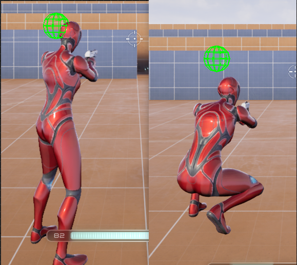


---

#### 跳跃技能
这个技能的蓝图比较简单.
```cpp
/**
 *	AbilityTasks 是在执行技能时执行的小型、自包含的操作。
 *	它们本质上是延迟/异步的。通常遵循"启动某件事并等待其完成或被中断"的模式。
 *	
 *	我们在 K2Node_LatentAbilityCall 中有相关代码，以简化在蓝图中的使用。熟悉 AbilityTasks 的最佳方式是
 *	查看现有任务，如 UAbilityTask_WaitOverlap（非常简单）和 UAbilityTask_WaitTargetData（更复杂）。
 *	
 *	使用 AbilityTask 的基本要求：
 *	
 *	1) 在你的 AbilityTask 中定义动态多播、BlueprintAssignable 委托。这些是你的任务的 OUTPUTs（输出）。
 *	   当这些委托触发时，调用蓝图中的执行流程会恢复。
 *	
 *	2) 你的 INPUTs（输入）由一个静态工厂函数定义，该函数将实例化你的任务的一个实例。此函数的参数定义了
 *	   任务的 INPUTs。这个工厂函数应该只实例化你的任务并可能设置初始参数。它不应该调用任何回调委托！
 *	
 *	3) 实现一个 Activate() 函数（在基类中定义）。这个函数应该实际启动/执行你的任务逻辑。在这里调用回调委托是安全的。
 *	
 *	
 *	对于基本的 AbilityTasks，这就是你需要做的全部。
 *	
 *	
 *	检查清单：
 *		- 重写 ::OnDestroy() 并注销任务注册的任何回调。同时调用 Super::EndTask！
 *		- 实现一个真正"启动"任务的 Activate 函数。不要在静态工厂函数中"启动"任务！
 *	
 *	
 *	--------------------------------------
 *	
 *	我们还为想要生成 Actor 的 AbilityTasks 提供了额外支持。尽管这可以在 Activate() 函数中完成，但无法传入动态的 "ExposeOnSpawn" Actor 属性。
 *	这是蓝图的一个强大功能。为了支持这一点，你需要实现不同的第3步：
 *	
 *	而不是 Activate() 函数，你应该实现 BeginSpawningActor() 和 FinishSpawningActor() 函数。
 *	
 *	BeginSpawningActor() 必须接收一个类型为 TSubclassOf<YourActorClassToSpawn> 的参数，命名为 'Class'。
 *	它还必须有一个类型为 YourActorClassToSpawn*& 的输出引用参数，命名为 SpawnedActor。此函数可以决定是否要生成 Actor
 *	（如果希望根据网络权限来判定是否生成 Actor，这将很有用）。
 *	
 *	BeginSpawningActor() 可以使用 SpawnActorDeferred 实例化一个 Actor。这很重要，否则在设置生成参数之前 UCS 就会运行。
 *	BeginSpawningActor() 还应将 SpawnedActor 参数设置为它生成的 Actor。
 *	
 *	[接下来，生成的字节码会将 Expose on Spawn 参数设置为用户设置的任何值]
 *	
 *	如果你生成了某个 Actor，FinishSpawningActor() 将被调用，并传入刚刚生成的同一 Actor。你必须在此 Actor 上调用 ExecuteConstruction + PostActorConstruction！
 *	
 *	这有很多步骤，但通常 AbilityTask_SpawnActor() 提供了一个清晰、最小的示例。
 *	
 *	
 */
```


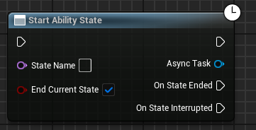

`UAbilityTask_StartAbilityState`<br>
```cpp
/**
 * 能力状态本质上是一个能够处理能力被中断情况的能力任务。
 * 你可以使用能力状态来执行特定状态的清理工作，当能力在执行过程中的特定点结束或被中断时。
 *
 * 能力状态总是会触发 'OnStateEnded' 或 'OnStateInterrupted' 回调。
 *
 * 以下情况会调用 'OnStateEnded'：
 * - 能力本身通过 AGameplayAbility::EndAbility 结束
 * - 能力状态通过 AGameplayAbility::EndAbilityState 手动结束
 * - 另一个能力状态以 'bEndCurrentState' 设置为 true 启动时
 *
 * 以下情况会调用 'OnStateInterrupted'：
 * - 能力本身通过 AGameplayAbility::CancelAbility 被取消
 */
```

省流 :<br>
正常结束 (OnStateEnded)：计划内结束<br>
中断结束 (OnStateInterrupted)：意外取消

`State Name` 用来写 `InstanceName`.

```cpp
/** This name allows us to find the task later so that we can end it. */
UPROPERTY()
FName InstanceName;
```


```cpp
class UGameplayAbility : public UObject, public IGameplayTaskOwnerInterface
{
    /** Notification that the ability is being cancelled.  Called before OnGameplayAbilityEnded. */
    FOnGameplayAbilityCancelled OnGameplayAbilityCancelled;

    /** Used by the ability state task to handle when a state is ended */
    FOnGameplayAbilityStateEnded OnGameplayAbilityStateEnded;
}
```

这个节点做的事情就是绑定GA中的这两个委托.
```cpp
void UAbilityTask_StartAbilityState::Activate()
{
    EndStateHandle = Ability->OnGameplayAbilityStateEnded.AddUObject(this, &UAbilityTask_StartAbilityState::OnEndState);

    InterruptStateHandle = Ability->OnGameplayAbilityCancelled.AddUObject(this, &UAbilityTask_StartAbilityState::OnInterruptState);
}
```

Task的获取过程:
```cpp
UAbilityTask_StartAbilityState::StartAbilityState
->UAbilityTask::NewAbilityTask
-->UGameplayTask::InitTask
```
在InitTask的参数中，InTaskOwner是GA，在蓝图节点中已经把GA的this传递进来了，<br>
整个过程带着GA一路传到InitTask. 所以 这里的`InTaskOwner`就是GA.
```cpp
UFUNCTION(BlueprintCallable, Meta = (DefaultToSelf = "OwningAbility"))
static UAbilityTask_StartAbilityState* StartAbilityState(UGameplayAbility* OwningAbility);

void UGameplayTask::InitTask(IGameplayTaskOwnerInterface& InTaskOwner,/*..*/)_
{
    /* UGameplayAbility::OnGameplayTaskInitialized */
    /* Task 获得ASC和GA */
    InTaskOwner.OnGameplayTaskInitialized(*this);


    UGameplayTasksComponent* GTComponent = InTaskOwner.GetGameplayTasksComponent(*this);
    GTComponent->OnGameplayTaskInitialized(*this);
}
```

Task的结束过程:
```cpp
UGameplayAbility::EndAbility
->UAbilityTask_StartAbilityState::OnDestroy
```

---


#### 跳舞技能
`GA_Emote` <br>
播放蒙太奇动画，检测到移动时 停止播放动画.

主要是`Character`类提供了一个蓝图可绑定的委托`OnCharacterMovementUpdated`
```cpp
DECLARE_DYNAMIC_MULTICAST_DELEGATE_ThreeParams(FCharacterMovementUpdatedSignature, float, DeltaSeconds, FVector, OldLocation, FVector, OldVelocity);

UPROPERTY(BlueprintAssignable, Category=Character)
FCharacterMovementUpdatedSignature OnCharacterMovementUpdated;
```

只要这个委托返回的速度大于0，就取消绑定、停止播放动画.

---

#### 游戏阶段
在游戏的不同阶段中，有不同的特性.<br>
例如：在游戏开始前 不能造成伤害，在游戏结束时 禁止放技能.


`ULyraGamePhaseSubsystem`: <br>
- 嵌套层级支持：父子阶段可以共存（如Game.Playing和Game.Playing.WarmUp）
- 兄弟阶段互斥：同一层级的阶段不能共存（如Game.Playing和Game.ShowingScore）
- 基于GameplayTag的匹配：支持精确匹配和部分匹配
- 观察者模式：可以监听阶段开始/结束事件

PhaseSubsystem 与 PhaseAbility:<br>
- Subsystem：全局阶段状态管理、冲突解决、观察者通知
- Ability：具体阶段逻辑执行、生命周期上报

Subsystem 的`StartPhase` 创建 Ability,<br>
Ability 激活/结束时 通知Subsystem.<br>

Subsystem管理Ability的生命周期,在一个Ability激活时，`OnBeginPhase` 执行冲突检测，可能需要结束其他Ability.

标签匹配:<br>
```cpp
// Ability定义阶段标签
UPROPERTY(EditDefaultsOnly, BlueprintReadOnly, Category = "Lyra|Game Phase")
FGameplayTag GamePhaseTag;  // 如：Game.Playing.WarmUp

// Subsystem使用标签进行管理
void ULyraGamePhaseSubsystem::OnBeginPhase(...)
{
    const FGameplayTag IncomingPhaseTag = PhaseAbility->GetGamePhaseTag();
    
    // 使用标签进行冲突检测
    if (!IncomingPhaseTag.MatchesTag(ActivePhaseTag))
    {
        // 结束冲突阶段
        GameState_ASC->CancelAbilitiesByFunc(...);
    }
}
```

---
```cpp
/* 存储GA和阶段信息 */
TMap<FGameplayAbilitySpecHandle, FLyraGamePhaseEntry> ActivePhaseMap;

/* 阶段冲突 */
void ULyraGamePhaseSubsystem::OnBeginPhase(...)
{
    // 获取新阶段标签
    FGameplayTag NewTag = PhaseAbility->GetGamePhaseTag();
    
    // 遍历所有活跃阶段
    for (auto& ActiveEntry : ActivePhaseMap)
    {
        FGameplayTag ActiveTag = ActiveEntry.Value.PhaseTag;
        
        // 冲突检测规则
        if (!NewTag.MatchesTag(ActiveTag))  // 不是父子关系
        {
            // 结束冲突阶段
            CancelAbility(ActiveEntry.Key);
        }
    }
}
```

1.阶段启动
```cpp
// 1. 子系统创建并激活Ability
StartPhase(PhaseAbilityClass, Callback)
    ↓
// 2. 授予能力并激活一次
GameState_ASC->GiveAbilityAndActivateOnce(PhaseSpec)
    ↓
// 3. Ability的ActivateAbility被调用
ULyraGamePhaseAbility::ActivateAbility(...)
    ↓
// 4. Ability通知子系统
PhaseSubsystem->OnBeginPhase(this, Handle)
```

2.冲突检测
```cpp
void OnBeginPhase(const ULyraGamePhaseAbility* NewPhase, Handle)
{
    // 获取新阶段标签
    FGameplayTag NewTag = NewPhase->GetGamePhaseTag();
    
    // 遍历所有活跃阶段
    for (每个活跃阶段)
    {
        FGameplayTag ActiveTag = 获取活跃阶段标签;
        
        // 应用冲突规则：
        // 如果NewTag与ActiveTag不是父子关系，则冲突
        if (!NewTag.MatchesTag(ActiveTag))
        {
            // 取消冲突的Ability
            GameState_ASC->CancelAbilitiesByFunc(...);
            
            // 这将触发冲突能力的EndAbility
            // EndAbility会调用OnEndPhase
            // OnEndPhase会：
            // 1. 执行结束回调
            // 2. 从ActivePhaseMap移除
            // 3. 通知观察者
        }
    }
    
    // 添加新阶段到ActivePhaseMap
    ActivePhaseMap.Add(Handle, {NewTag, Callback});
    
    // 通知匹配的观察者
    NotifyPhaseStartObservers(NewTag);
}
```

3.观察者匹配
```cpp
// 观察者结构
struct FPhaseObserver
{
    FGameplayTag PhaseTag;           // 监听的标签
    EPhaseTagMatchType MatchType;    // 匹配类型
    FLyraGamePhaseTagDelegate Callback;
    
    bool IsMatch(const FGameplayTag& CompareTag) const
    {
        switch(MatchType)
        {
        case ExactMatch:  // 精确匹配
            return CompareTag == PhaseTag;
        case PartialMatch: // 部分匹配（父子关系都算匹配）
            return CompareTag.MatchesTag(PhaseTag);
        }
    }
};

// 通知观察者逻辑
for (FPhaseObserver& Observer : PhaseStartObservers)
{
    if (Observer.IsMatch(NewTag))
    {
        Observer.Callback.Execute(NewTag);
    }
}
```

---

```cpp
┌──────────────────────────────────────────────┐
│             OnBeginPhase入口                  │
├──────────────────────────────────────────────┤
│ 1. 获取新阶段标签 (IncomingPhaseTag)         │
│ 2. 日志记录                                  │
├──────────────────────────────────────────────┤
│ 3. 获取GameState的ASC                        │
│    ↓ 验证有效性                             │
├──────────────────────────────────────────────┤
│ 4. 收集当前所有活跃阶段的AbilitySpec         │
│    (从ActivePhaseMap遍历)                   │
├──────────────────────────────────────────────┤
│ 5. 冲突检测循环:                             │
│    for each 活跃阶段:                        │
│    ┌─ 获取活跃阶段标签 (ActivePhaseTag)      │
│    ├─ 使用MatchesTag进行关系判断             │
│    │  - 父子关系: 不冲突 (继续共存)          │
│    │  - 兄弟关系: 冲突 (结束该阶段)          │
│    └─ 对冲突阶段调用CancelAbilitiesByFunc    │
├──────────────────────────────────────────────┤
│ 6. 将新阶段添加到ActivePhaseMap              │
│    - 记录PhaseTag                           │
│    - 保持原有的PhaseEndedCallback            │
├──────────────────────────────────────────────┤
│ 7. 通知观察者:                               │
│    for each PhaseStartObserver:              │
│    ┌─ 检查是否匹配新阶段标签                 │
│    │  (根据MatchType: Exact/Partial)        │
│    └─ 匹配则执行回调                        │
└──────────────────────────────────────────────┘
```

---

阶段举例:<br>
```cpp
初始: ActivePhaseMap = { Game.WaitingToStart }

1. 启动Game.Playing阶段:
   - K2_StartPhase(LyraGamePhaseAbility_Playing)
   - 创建Ability_Playing并激活
   - OnBeginPhase检测冲突:
     * Game.Playing vs Game.WaitingToStart → 不匹配
     * 结束Game.WaitingToStart
   - ActivePhaseMap = { Game.Playing }

2. 在Game.Playing阶段中启动Game.Playing.WarmUp:
   - K2_StartPhase(LyraGamePhaseAbility_WarmUp)
   - OnBeginPhase检测冲突:
     * Game.Playing.WarmUp vs Game.Playing → 匹配(父子关系)
     * 共存
   - ActivePhaseMap = { Game.Playing, Game.Playing.WarmUp }

3. WarmUp自然结束:
   - Ability_WarmUp.EndAbility()
   - OnEndPhase被调用
   - 从ActivePhaseMap移除Game.Playing.WarmUp
   - 执行WarmUp结束回调
   - 通知观察者WarmUp结束
   - ActivePhaseMap = { Game.Playing }
```

---

#### 自定义技能消耗

回顾一下检查技能消耗的流程:


```cpp
bool UGameplayAbility::K2_CheckAbilityCost()
{
	check(CurrentActorInfo);
	return CheckCost(CurrentSpecHandle, CurrentActorInfo);
}

bool UGameplayAbility::CheckCost(const FGameplayAbilitySpecHandle Handle, const FGameplayAbilityActorInfo* ActorInfo, OUT FGameplayTagContainer* OptionalRelevantTags) const
{
	UGameplayEffect* CostGE = GetCostGameplayEffect();
	if (CostGE)
	{
        /*...*/
		if (!AbilitySystemComponent->CanApplyAttributeModifiers(CostGE, GetAbilityLevel(Handle, ActorInfo), MakeEffectContext(Handle, ActorInfo)))
		{
            /*...*/
			return false;
		}
	}
	return true;
}
```

最后来到了:
```cpp
bool CanApplyAttributeModifiers(const UGameplayEffect *GameplayEffect, float Level, const FGameplayEffectContextHandle& EffectContext)
{
	return ActiveGameplayEffects.CanApplyAttributeModifiers(GameplayEffect, Level, EffectContext);
}
```
`CanApplyAttributeModifiers` : 测试`GE`中的所有修改器是否会使属性值保持大于 0.f<br>
换一个说法，检查一个即将应用的`GE`是否会使得任何受影响的属性值降至负数，<br>
如果这个`GE`会让法力值变为负数，就说明当前的法力值不足以施放这个技能.

精简后的核心部分: 从`AttributeSet`中拿到要消耗的属性值，然后检查`当前值+消耗值`是否小于0.
```cpp
FActiveGameplayEffectsContainer::CanApplyAttributeModifiers()
{
    const UAttributeSet* Set = Owner->GetAttributeSubobject(ModDef.Attribute.GetAttributeSetClass());
	float CurrentValue = ModDef.Attribute.GetNumericValueChecked(Set);
	float CostValue = ModSpec.GetEvaluatedMagnitude();

    if (CurrentValue + CostValue < 0.f)
	{
		return false;
	}

    return true;
}
```

所以 在法力值不足的情况下，`CheckCost`返回`false`，不可以激活技能.

`CheckCost` 是一个虚函数，`LyraGameplayAbility`重写了这个函数 做了一些自定义的消耗计算.

`ApplyCost` 也是虚函数，在`LyraGameplayAbility`里重写了这个函数.

---

应用消耗，如果可以施放技能，就把法力值减下去.

`ApplyCost` 就是把配置消耗的那个`GE`应用到ASC上，也就是从`AttributeSet`中减去法力值.

```cpp
void UGameplayAbility::ApplyCost()
{
	UGameplayEffect* CostGE = GetCostGameplayEffect();
	if (CostGE)
	{
		ApplyGameplayEffectToOwner(Handle, ActorInfo, ActivationInfo, CostGE, GetAbilityLevel(Handle, ActorInfo));
	}
}
```

---

#### 切换武器

切枪也是技能, 太变态了.

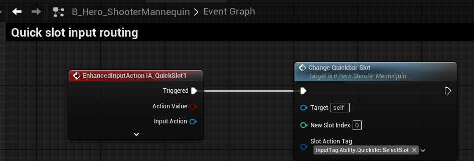

`GA_QuickbarSlots` 监听了这个`Tag`的消息.

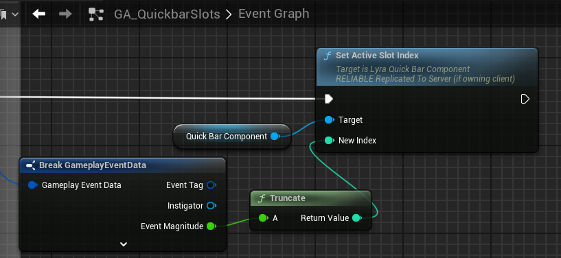

```cpp
ULyraQuickBarComponent::SetActiveSlotIndex_Implementation
ULyraQuickBarComponent::EquipItemInSlot
ULyraEquipmentManagerComponent::EquipItem

FLyraEquipmentList::AddEntry()
{
    /*...*/
    Result->SpawnEquipmentActors(EquipmentCDO->ActorsToSpawn);
    /*...*/
}
```

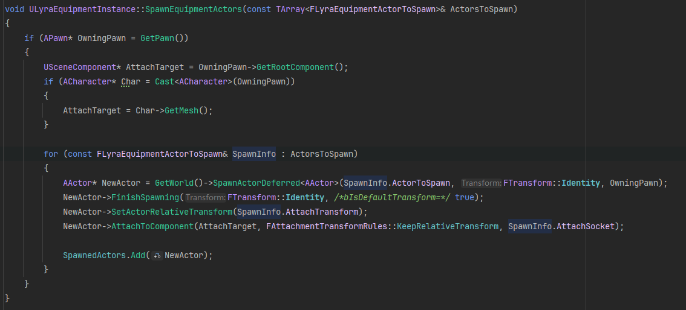

生成 附加 就这么简单.

详细见下一章 `武器` .


---

### 武器

#### 武器拾取
依然是数据驱动.

以`B_GrantInventoryPad_WithMesh`为例，说明拾取过程<br>
武器生成器：

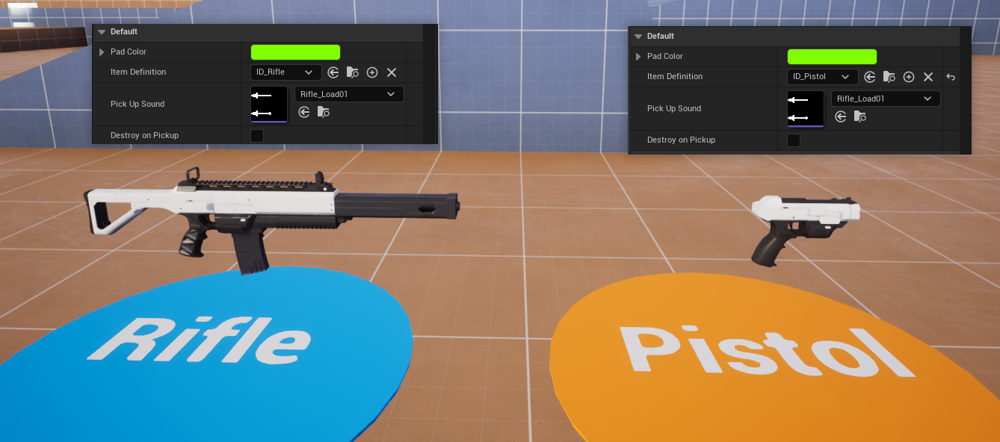

这个类的碰撞函数就是拾取武器的过程<br>
1.从`QuickBar`获得下一个空闲槽位。<br>
获取逻辑是遍历槽位，如果找到一个空指针的槽位 就返回索引，没有找到就返回`-1`.<br>
2.如果索引是有效数字，执行后续的添加逻辑.<br>
3.把`ItemDefinition`传递给库存组件，库存创建物品后 再添加到`QuickBar`中，并且切换到拾取的武器槽位. 就是切到最新的枪.<br>
4.`QuickBar`广播最新的槽，UI监听这个广播 对应的更新UI. 详情:`W_QuickBarSlot`

---
#### 库存系统

`LyraInventory` 的 `Definition | Instance`


`Definition`: <br>
例如: `ID_Rifle`里面有很多`Fragment`，这些`Fragment`描述了物品的功能.<br>
`InventoryFragmentPickupIcon`: 定义的模型和颜色，描述生成器的外观，以供上图中的`武器生成器`使用.<br>
```cpp
ULyraInventoryManagerComponent::AddItemDefinition(TSubclassOf<ULyraInventoryItemDefinition> ItemDef /**/)
FLyraInventoryList::AddEntry(TSubclassOf<ULyraInventoryItemDefinition> ItemDef /**/)

/* 传递 ItemDef */
NewEntry.Instance->SetItemDef(ItemDef);
```
整体如图所示:<br>


整个架构还是有点像`Actor - Component`，`Definition`可以包含各种`Fragment`，<br>
`Fragment`共同组合出一个`Definition`，实际上就是把一些功能拆分出去，有扩展性.<br>

`Definition`为`Instance`提供武器的信息 以及 行为.

`InventoryManagerComponent`是`Controller`组件，在`ShootCore`中定义了添加组件的操作.

---

以`ID_Rifle`为例，说明这个架构的运行流程.


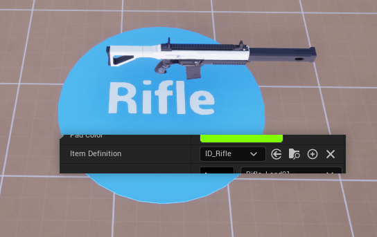

当角色触碰到`武器生成器`时，发生了什么？


`武器生成器`的外观:

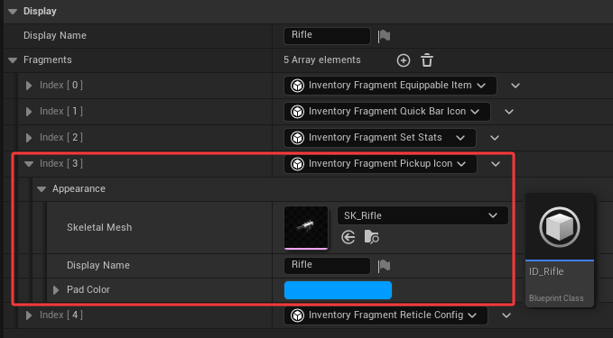

在`武器生成器`的构造函数中，获得`Item Definition`里的`PickupIcon`，用这里保存的信息 设置外观模型，文字，颜色.


触碰到`武器生成器`时，获得角色身上的`Inventory` 库存组件:


`AddItemDefinition`的行为 : 核心是`InventoryList.AddEntry()`

```cpp
ULyraInventoryItemInstance* ULyraInventoryManagerComponent::AddItemDefinition(TSubclassOf<ULyraInventoryItemDefinition> ItemDef, int32 StackCount)
{
	ULyraInventoryItemInstance* Result = nullptr;
	if (ItemDef != nullptr)
	{
		Result = InventoryList.AddEntry(ItemDef, StackCount);
		/*...*/
	}
	return Result;
}
```


创建`Instance`:
```cpp
ULyraInventoryItemInstance* FLyraInventoryList::AddEntry(TSubclassOf<ULyraInventoryItemDefinition> ItemDef, int32 StackCount)
{
    FLyraInventoryEntry& NewEntry = Entries.AddDefaulted_GetRef();
    NewEntry.Instance = NewObject<ULyraInventoryItemInstance>(/*...*/);
    NewEntry.Instance->SetItemDef(ItemDef);

    for (ULyraInventoryItemFragment* Fragment : GetDefault<ULyraInventoryItemDefinition>(ItemDef)->Fragments)
	{
		if (Fragment != nullptr)
		{
			Fragment->OnInstanceCreated(NewEntry.Instance);
		}
	}
    Result = NewEntry.Instance;
    /*...*/
    return Result;
}
```

`SetItemDef(ItemDef)`，将 `ItemDef` 传给了新创建出来的 `Instance`，<br>

`Instance`创建完成以后，通知`Definition`的`Fragment`，并将`Instance`传递过去.<br>
最后，`AddEntry`返回`Instance`.

实际上，现在只有`UInventoryFragment_SetStats`这个类 实现了`OnInstanceCreated`函数.<br>
```cpp
void UInventoryFragment_SetStats::OnInstanceCreated(ULyraInventoryItemInstance* Instance) const
{
	for (const auto& KVP : InitialItemStats)
	{
		Instance->AddStatTagStack(KVP.Key, KVP.Value);
	}
}
```
在创建`Instance`后，`SetStats::OnInstanceCreated` 把下图中的`Tag`以及数量 设置给`Instance`.

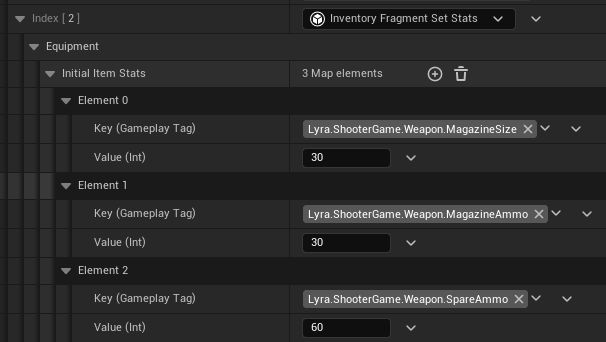

---

添加`Instance`:


`AddItemToSlot` 将创建出来的`Instance` 添加到 `QuickBar::Slots`中，然后广播整个槽的数据，<br>
将所有的`Instance`都广播出去，`W_QuickBarSlot` 监听了 `SlotsChanged`. 通过自己的ID去找`Slots`中对应的`Instance`.

```cpp
void ULyraQuickBarComponent::AddItemToSlot(int32 SlotIndex, ULyraInventoryItemInstance* Item)
{
	if (Slots.IsValidIndex(SlotIndex) && (Item != nullptr))
	{
		if (Slots[SlotIndex] == nullptr)
		{
			Slots[SlotIndex] = Item;
			OnRep_Slots();
		}
	}
}

void ULyraQuickBarComponent::OnRep_Slots()
{
	FLyraQuickBarSlotsChangedMessage Message;
	Message.Owner = GetOwner();
	Message.Slots = Slots;

	UGameplayMessageSubsystem& MessageSystem = UGameplayMessageSubsystem::Get(this);
	MessageSystem.BroadcastMessage(TAG_Lyra_QuickBar_Message_SlotsChanged, Message);
}
```

---

装备武器：

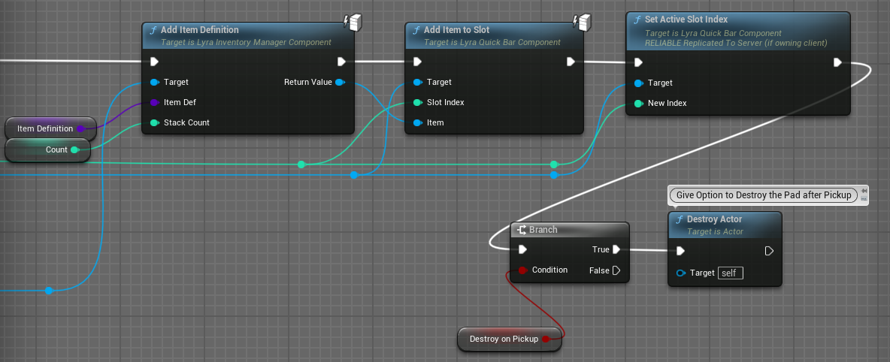

`LyraQuickBarComponent` 是`Controller`组件，在`LAS_ShooterGame_StandardComponents`中定义了添加组件的操作.
```cpp
void ULyraQuickBarComponent::SetActiveSlotIndex_Implementation(int32 NewIndex)
{
	if (Slots.IsValidIndex(NewIndex) && (ActiveSlotIndex != NewIndex))
	{
		UnequipItemInSlot();

		ActiveSlotIndex = NewIndex;

		EquipItemInSlot();

		OnRep_ActiveSlotIndex();
	}
}

ULyraQuickBarComponent::SetActiveSlotIndex_Implementation
ULyraQuickBarComponent::EquipItemInSlot
ULyraEquipmentManagerComponent::EquipItem
FLyraEquipmentList::AddEntry
```
`SetActiveSlotIndex` 将传进来的`NewIndex`保存起来，后面要根据`Index`找到之前的装备.

在之前已经`AddItemToSlot`将`InventoryItemInstance`存入`QuickBar`.

`EquipItemInSlot` 根据 `Index` 找到 `InventoryItemInstance` .<br>
再获得`ItemInstance`的`Fragment_EquippableItem`，装备到`EquipmentManager`.<br>

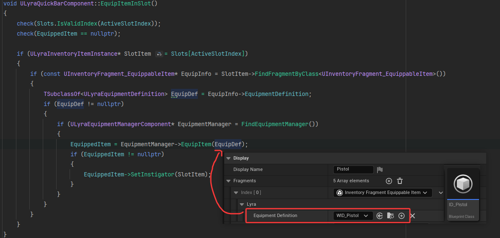

---

接上图中的`EquippedItem = EquipmentManager->EquipItem(EquipDef);`.

```cpp
ULyraEquipmentInstance* ULyraEquipmentManagerComponent::EquipItem(TSubclassOf<ULyraEquipmentDefinition> EquipmentClass)
{
	ULyraEquipmentInstance* Result = nullptr;
	if (EquipmentClass != nullptr)
	{
		Result = EquipmentList.AddEntry(EquipmentClass);
		if (Result != nullptr)
		{
			Result->OnEquipped();

			/*...*/
		}
	}
	return Result;
}
```
`FLyraEquipmentList::AddEntry` : 这个函数有点长，简单描述一下. <br>
又是同样的 使用`EquipmentDefinition`来配置`EquipmentInstance`.<br>
使用`Definition` 的 `InstanceType` 创建对应的`EquipmentInstance`.<br>
配置`Definition`的技能，生成配置中的`Actor`并附加到角色上.<br>

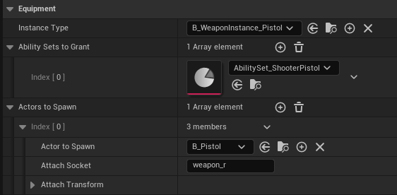

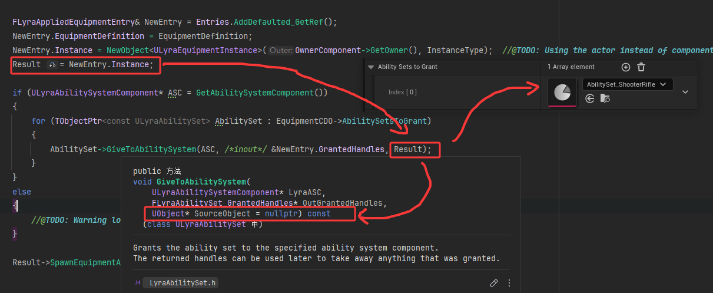

注意这里技能的`SourceObject`是`EquipmentInstance`.<br>
GA可以通过`SourceObject` 获得 `EquipmentInstance`.

回到上文的`EquipItem`函数，后面还有一行 `Result->OnEquipped();`.


例如`ID_Rifle - WID_Rifle` 的 `Instance Type`  是武器类的`Instance`.<br>
`EquipItem` 调用 `Result->OnEquipped()` ，<br>
在蓝图里重写了 `K2_OnEquipped` 用来执行拾取时的事件，例如播放切枪动画.<br>
`B_WeaponInstance_Pistol` 里面就配置了各种需要的武器动画.

取消装备：

```cpp
ULyraQuickBarComponent::UnequipItemInSlot
ULyraEquipmentManagerComponent::UnequipItem
FLyraEquipmentList::RemoveEntry
```
`UnequipItem` 调用`Instance::OnUnequipped`,最后到蓝图的`K2_OnUnequipped` 播放切枪动画 <br>
`RemoveEntry` 移除赋予的技能，销毁生成的`Actor`.<br>

---

前面提到 武器类的`Instance`在`K2_OnEquipped` 和 `K2_OnUnEquipped` 时， 也就是 装备武器、卸下武器 时，<br>
在这两个时机中，角色会播放对应的动画.


这就涉及到 如何匹配对应的枪械动画. `B_WeaponInstance_Base` 蓝图中已经体现了相关的操作<br>

在探索下一部分之前，需要先梳理一下这个蓝图中涉及到的组件，<br>
例如:`DetermineCosmeticTags` 蓝图函数中涉及到了`CharacterPart`组件.

---

#### 角色部件
角色组件：<br>
`ShooterCore/Game/B_Hero_ShooterMannequin` (`Hero`)<br>
`Characters/Cosmetics/B_MannequinPawnCosmetics` 父类-> `ULyraPawnComponent_CharacterParts`<br>
`Hero`在蓝图中手动添加了`CharacterParts`组件，

控制器组件:<br>
`B_ShooterGame_Elimination` 对`Controller`添加`B_PickRandomCharacter`.<br>
`PickRandomCharacter`是一个控制器组件，`BeginPlay` 随机选一个男或女的`Actor`填充`Part`结构体，并传给`AddCharacterPart`函数，<br>

```cpp
ULyraControllerComponent_CharacterParts::AddCharacterPart
::AddCharacterPartInternal
```
在`AddCharacterPartInternal`函数中，`CharacterParts` 将这个 `Part` 存了下来.

然后 获得`Pawn`的`ULyraPawnComponent_CharacterParts`，<br>
将 `Part` 传给 `PawnComp_CharacterParts -> AddCharacterPart`

---

`Pawn`组件的行为 ：
```cpp
FLyraCharacterPartHandle ULyraPawnComponent_CharacterParts::AddCharacterPart(const FLyraCharacterPart& NewPart)
{
    return CharacterPartList.AddEntry(NewPart);
}
```

`CharacterPartList::AddEntry` 也把这个 `Part` 存到`Entries`，<br>
`SpawnActorForEntry` 根据新的 `Entry` 数据，创建`ChildActorComponent` 并附加到角色的胶囊体下.<br>
`Entry.SpawnedComponent` 保存创建的 `子Actor组件`.

`CharacterPartList` 完成上面的操作后，调用`LyraPawnComponent_CharacterParts::BroadcastChanged`.

`BroadcastChanged` 收集`CharacterPartList` 创建的 `子Actor` 所包含的`Tag`. <br>
用来区分男女角色的模型.

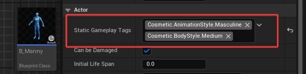

```cpp
const FGameplayTagContainer MergedTags = GetCombinedTags(FGameplayTag());
USkeletalMesh* DesiredMesh = BodyMeshes.SelectBestBodyStyle(MergedTags);
MeshComponent->SetSkeletalMesh(DesiredMesh, /*bReinitPose=*/ bReinitPose);
```

收集完以后，组件根据`Tag` 选择一个骨骼模型. 设置给角色的骨骼网格体.

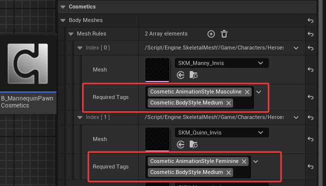


---

每次复活时，`控制器组件` 都会重新设置 `角色组件` 所使用的`Part`.

```cpp
void ULyraControllerComponent_CharacterParts::BeginPlay()
{
    OwningController->OnPossessedPawnChanged.AddDynamic(this, &ThisClass::OnPossessedPawnChanged);
}

void ULyraControllerComponent_CharacterParts::OnPossessedPawnChanged(APawn* OldPawn, APawn* NewPawn)
{
    OldCustomizer->RemoveCharacterPart(Entry.Handle);
    Entry.Handle.Reset();

    Entry.Handle = NewCustomizer->AddCharacterPart(Entry.Part);
}
```

`OnPossessedPawnChanged` 所使用的`Entry` 还是在`BeginPlay`中添加的，也就是随机男女那里选择的`Actor`.<br>


---

总结: 角色、控制器 都有自己的 `ChracterPart` 组件，入口在控制器的组件中.<br>
男角色模型、女角色模型 都从 `控制器组件` 设置， 再转发给 `角色组件`.

当有了男女模型的区分方法后，就可以选择对应的枪械动画.

如果是男角色，使用的动画蓝图是 `ABP_PistolAnimLayers_C` <br>
如果是女角色，使用的动画蓝图是 `ABP_PistolAnimLayers_Feminine_C` <br>


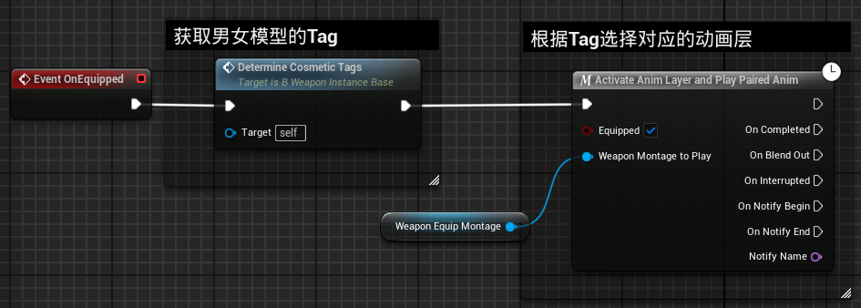

`ActivateAnimLayerAndPlayPairedAnim`: <br>
上图已经获得了对应的 `Tag`<br>
如果下图中的`LayerRules` 有对应的 `Tag`，那就使用对应的`Layer`<br>
如果没有对应的 `Tag`，那就返回`Default Layer`.

在下图的配置中，`LayerRules` 只配置了女角色的 `Tag` 和 `Layer`<br>
所以 只有使用女角色时，才会去使用`LayerRules`的`Layer`， 使用男角色时 直接`DefaultLayer`.


---

流程总结：
```
物品栏（Inventory ） 是你拥有的物品的集合，但物品也可以藏起来，比如隐藏在背包等容器中。

装备（Equipment ） 是从该容器或背包中拿出来后手持、穿戴或使用的物品。

例如，考虑给予玩家角色的步枪物品。它最初仅以虚拟方式存在于玩家的物品栏中，包括弹药。按下武器更换按钮，即可配备步枪。这将显示为角色手中的3D网格体，添加了步枪的开火和填弹技能。
```

```cpp
┌─────────────────┐    ┌─────────────────┐    ┌─────────────────┐
│   拾取触发       │    │   库存系统       │    │   快速栏系统     │
└────────┬────────┘    └────────┬────────┘    └────────┬────────┘
         │                      │                      │
    ┌────▼────┐            ┌────▼────┐            ┌────▼────┐
    │武器生成器 │            │创建实例  │            │添加到槽位│
    │碰撞检测   │───────────▶│ItemDef→ │───────────▶│切换活跃槽│
    │获取ItemDef│   ItemDef  │Instance │  Instance   │广播变化 │
    └──────────┘            └──────────┘            └────┬────┘
                                                         │
                                                         │ Instance
                                                         ▼
┌─────────────────┐    ┌─────────────────┐    ┌─────────────────┐
│   装备系统       │    │   角色部件系统   │    │   动画系统       │
└────────┬────────┘    └────────┬────────┘    └────────┬────────┘
         │                      │                      │
    ┌────▼────┐            ┌────▼────┐            ┌────▼────┐
    │装备实例化 │            │收集标签  │            │匹配动画层│
    │生成武器Actor│◀──────────▶│选择身形网格│◀──────────▶│播放动画 │
    │赋予技能    │    Tag      │广播变化  │  规则匹配   │更新状态 │
    └──────────┘            └──────────┘            └──────────┘
```

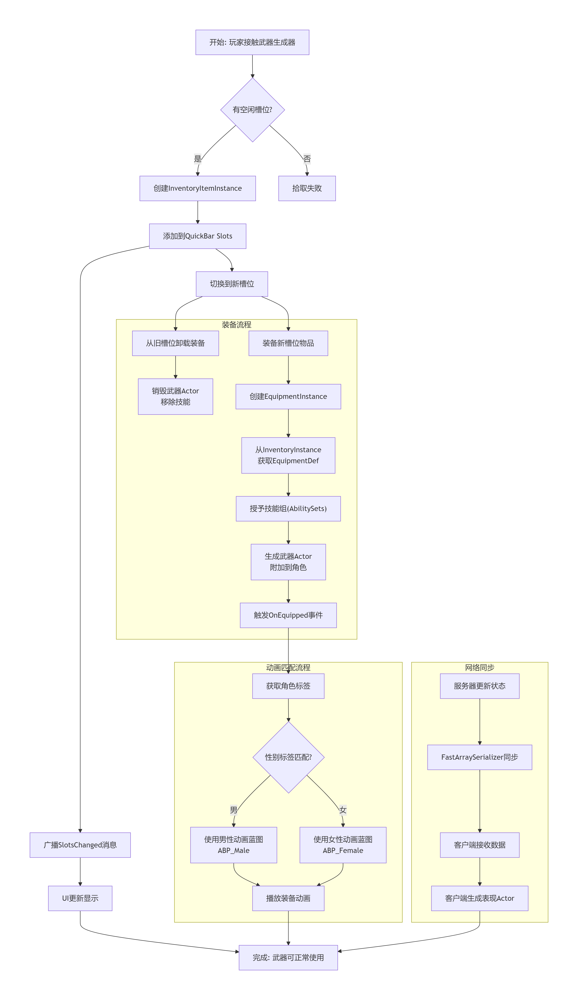

数据流向：
```cpp
ItemDef (数据资产)
    ↓ 拾取时引用
InventoryItemInstance (库存实例)
    ↓ 装备时查找Fragment
EquipmentDefinition (装备定义)
    ↓ 装备管理器使用
EquipmentInstance (装备实例)
    ↓ 生成并管理
Weapon Actor (实际武器模型)


Character Parts Tags (男女角色标签)
    ↓ 用于
Body Mesh Selection (选择身形网格)
    ↓ 同时影响
Weapon Anim Selection (武器动画选择)
    ↓ 最终决定
Anim Layer Applied (应用的动画层)
```

拾取、装备武器：
```cpp
1. B_GrantInventoryPad_WithMesh::OnOverlapBegin()
2. → ULyraQuickBarComponent::GetNextFreeItemSlot()
3. → ULyraInventoryManagerComponent::AddItemDefinition(ItemDef)
4. → FLyraInventoryList::AddEntry() 创建InventoryItemInstance
5. → ULyraQuickBarComponent::AddItemToSlot() 添加到槽位
6. → ULyraQuickBarComponent::SetActiveSlotIndex() 切换到新武器

1. ULyraQuickBarComponent::EquipItemInSlot()
2. → 从InventoryItemInstance获取EquippableFragment
3. → ULyraEquipmentManagerComponent::EquipItem(EquipmentDef)
4. → FLyraEquipmentList::AddEntry() 创建EquipmentInstance
5. → 授予AbilitySets中的技能
6. → SpawnEquipmentActors() 生成武器模型
7. → EquipmentInstance::OnEquipped() 触发装备事件

1. WeaponInstance::OnEquipped() (蓝图)
2. → 调用DetermineCosmeticTags() 获取角色标签
3. → PickBestAnimLayer() 根据标签选择动画层
4. → 激活对应的动画蓝图层（ABP_PistolAnimLayers）
5. → 播放装备动画
```

角色模型匹配：
```cpp
1. ULyraControllerComponent_CharacterParts::BeginPlay()
2. → 随机选择男女角色Actor作为CharacterPart
3. → ULyraPawnComponent_CharacterParts::AddCharacterPart()
4. → 生成角色模型ChildActorComponent
5. → BroadcastChanged() 收集所有部件标签
6. → 根据标签选择BodyMesh（男女模型）
7. → 更新SkeletalMeshComponent的网格
```


---


#### 开枪技能
`ULyraWeaponInstance`
- 管理动画层选择（基于装备状态和标签）
- 处理输入设备属性（如手柄震动）
- 跟踪装备/开火时间
- 提供基本的装备/卸载逻辑

`ULyraRangedWeaponInstance`
- 处理武器热量系统（Heat System）
- 管理武器散布（Spread/Accuracy）
- 计算距离衰减和材质伤害倍率
- 提供首发精度（First Shot Accuracy）功能
- 跟踪玩家的状态（移动、蹲伏、跳跃、瞄准）


`ULyraGameplayAbility_RangedWeapon`
- 处理子弹追踪（射线检测）
- 管理目标获取和瞄准
- 协调客户端-服务器同步
- 处理命中检测和伤害应用


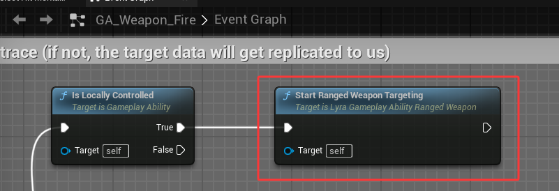

```cpp
void ULyraGameplayAbility_RangedWeapon::StartRangedWeaponTargeting()
{
    /*...*/
    TArray<FHitResult> FoundHits;
	PerformLocalTargeting(/*out*/ FoundHits);

    /*...*/

    // Process the target data immediately
	OnTargetDataReadyCallback(TargetData, FGameplayTag());
}
```

`PerformLocalTargeting` 比较关键:

```cpp
void ULyraGameplayAbility_RangedWeapon::PerformLocalTargeting(OUT TArray<FHitResult>& OutHits)
{
    // 1. 获取玩家Pawn和武器实例
    APawn* const AvatarPawn = Cast<APawn>(GetAvatarActorFromActorInfo());
    ULyraRangedWeaponInstance* WeaponData = GetWeaponInstance();
    
    // 2. 检查条件：本地控制且有武器数据
    if (AvatarPawn && AvatarPawn->IsLocallyControlled() && WeaponData)
    {
        // 3. 准备射击输入数据
        FRangedWeaponFiringInput InputData;
        InputData.WeaponData = WeaponData;
        
        // 4. 确定是否可以播放子弹特效（非专用服务器）
        InputData.bCanPlayBulletFX = (AvatarPawn->GetNetMode() != NM_DedicatedServer);
        
        // 5. 获取瞄准变换（核心几何计算）
        const FTransform TargetTransform = GetTargetingTransform(AvatarPawn, ELyraAbilityTargetingSource::CameraTowardsFocus);
        
        // 6. 提取瞄准方向（单位向量）和起始位置
        InputData.AimDir = TargetTransform.GetUnitAxis(EAxis::X);    // X轴=前向
        InputData.StartTrace = TargetTransform.GetTranslation();
        
        // 7. 计算理论最大射程的终点（用于子弹追踪）
        InputData.EndAim = InputData.StartTrace + InputData.AimDir * WeaponData->GetMaxDamageRange();
        
        // 9. 执行子弹追踪（核心命中检测）
        TraceBulletsInCartridge(InputData, /*out*/ OutHits);
    }
}
```


`GetTargetingTransform`:<br>
瞄准源类型是`CameraTowardsFocus`.

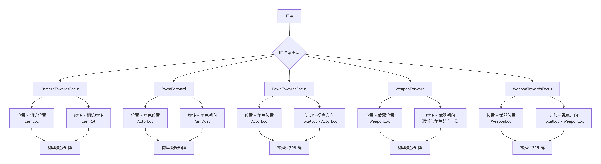

玩家和AI的不同瞄准方法 ：

```cpp
if (PC)  // 玩家控制器
{
    // 将起始点沿着视线投影到武器前方
    CamLoc = FocalLoc + (((WeaponLoc - FocalLoc) | AimDir) * AimDir);
}
else if (AAIController* AIController = Cast<AAIController>(Controller))
{
    // AI：使用角色眼睛高度
    CamLoc = SourcePawn->GetActorLocation() + FVector(0, 0, SourcePawn->BaseEyeHeight);
}
```

```cpp
const FVector WeaponLoc = GetWeaponTargetingSourceLocation();
CamLoc = FocalLoc + (((WeaponLoc - FocalLoc) | AimDir) * AimDir);
FocalLoc = CamLoc + (AimDir * FocalDistance);
```

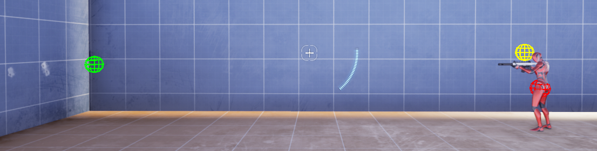


```cpp
if (PC != nullptr)
{
    PC->GetPlayerViewPoint(/*out*/ CamLoc, /*out*/ CamRot);

    DrawDebugSphere(CamLoc,FColor::Purple);
}

/* 计算焦点位置（沿相机视线方向） */
FVector AimDir = CamRot.Vector().GetSafeNormal();
FocalLoc = CamLoc + (AimDir * FocalDistance);

DrawDebugSphere(FocalLoc, FColor::Blue);

/* 调整相机位置，使其在武器前方 */ 
if (PC)
{
    const FVector WeaponLoc = GetWeaponTargetingSourceLocation();
    CamLoc = FocalLoc + (((WeaponLoc - FocalLoc) | AimDir) * AimDir);
    FocalLoc = CamLoc + (AimDir * FocalDistance);

    DrawDebugSphere(WeaponLoc,FColor::Red);
    DrawDebugSphere(CamLoc, FColor::Yellow);
    DrawDebugSphere(FocalLoc, FColor::Green);
}

/* 向量点积求投影长度 */
/* 表示武器位置相对于焦点的偏移量在视线方向上的分量 */ 
ProjectionLength = (WeaponLoc - FocalLoc) · AimDir

/* 将相机位置调整到武器在视线上的投影点 */ 
NewCameraLoc = FocalLoc + (ProjectionLength × AimDir)

/* 重新计算焦点 */
NewFocalLoc = NewCameraLoc + (AimDir × FocalDistance)
```

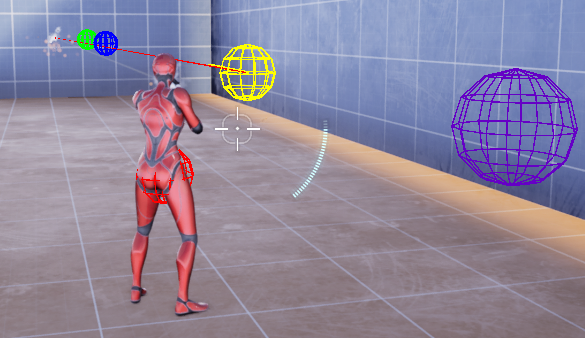

紫色球：摄像机位置. `GetPlayerViewPoint`返回的位置<br>
黄色球: 新的相机位置 <br>
红色球: `WeaponLoc` <br>
蓝色球: 焦点位置 <br>
绿色球: 新的焦点位置

把摄像机的位置 调整到和武器并排的位置，从这个新的摄像机位置发出一条射线.

`PerformLocalTargeting` 传入的参数是 `CameraTowardsFocus`<br>
所以 最终返回的是 摄像机旋转、摄像机位置. 位置是图中的绿色球.
```cpp
if (Source == ELyraAbilityTargetingSource::CameraTowardsFocus)
{
    // If we're camera -> focus then we're done
    return FTransform(CamRot, CamLoc);
}
```

```cpp
void ULyraGameplayAbility_RangedWeapon::PerformLocalTargeting(OUT TArray<FHitResult>& OutHits)
{
    const FTransform TargetTransform = GetTargetingTransform(AvatarPawn, ELyraAbilityTargetingSource::CameraTowardsFocus);

    FRangedWeaponFiringInput InputData;
    InputData.WeaponData = WeaponData;

    InputData.AimDir = TargetTransform.GetUnitAxis(EAxis::X);
    InputData.StartTrace = TargetTransform.GetTranslation();

    InputData.EndAim = InputData.StartTrace + InputData.AimDir * WeaponData->GetMaxDamageRange();

    TraceBulletsInCartridge(InputData, /*out*/ OutHits);
}
```
`AimDir` 	使用摄像机的朝向<br>
`StartTrace` 使用新的摄像机位置，黄球位置<br>
`EndAim` 终点 = 起点 + 方向 * 距离<br>

---

`TraceBulletsInCartridge` 根据每发弹药的子弹数 做N次射线检测，例如:散弹枪 开一枪有好几发子弹.做好几次射线检测.

```cpp
void ULyraGameplayAbility_RangedWeapon::TraceBulletsInCartridge()
{
    ULyraRangedWeaponInstance* WeaponData = GetWeaponInstance();
    const int32 BulletsPerCartridge = WeaponData->GetBulletsPerCartridge();
    for (int32 BulletIndex = 0; BulletIndex < BulletsPerCartridge; ++BulletIndex)
    {
        /*...*/
    }
}
```
`BulletsPerCartridge` 开一次枪要消耗多少子弹？<br>
如果用的是喷子，一次开枪可能要发射5发子弹.<br>
这5发子弹 每一发都要检测命中目标.

计算散布方向:<br>
从武器实例获取基础散布角度（BaseSpreadAngle）和散布乘数（SpreadAngleMultiplier），两者相乘得到实际散布角度 ActualSpreadAngle。<br>
将实际角度的一半转换为弧度（HalfSpreadAngleInRadians），用于定义圆锥的半角。<br>
调用 `VRandConeNormalDistribution` 函数，在理想瞄准方向（InputData.AimDir）周围随机生成一个方向向量：<br>
- 圆锥半角由散布角度决定。<br>
- 指数（SpreadExponent）控制分布形态
- 指数越大，子弹越倾向于集中在圆锥中心（类似正态分布）；
- 指数越小，分布越均匀。<br>
此方向即为该子弹的最终飞行方向 BulletDir。

终点 = 起始点 + 子弹方向 × 武器最大伤害范围（GetMaxDamageRange()）。

`DoSingleBulletTrace` 单发子弹追踪:<br>
传入起始点、终点、武器扫掠半径（GetBulletTraceSweepRadius()）、模拟标志（false）以及一个临时数组 AllImpacts。<br>
`DoSingleBulletTrace` 会先尝试精确的线检测（无半径），若未命中任何 `Pawn` 且扫掠半径 > 0，则用球体扫掠再试一次，最终返回主要命中点（Impact）和所有命中结果（AllImpacts）。


处理命中结果:<br>
如果 Impact 命中了某个 Actor（即 Impact.GetActor() 不为空）：<br>
将 AllImpacts 中的所有命中结果追加到最终的 OutHits 数组中。<br>
同时可能进行调试绘制（DrawDebugPoint），显示命中点。<br>

如果 OutHits 仍为空（即没有任何命中）：<br>
为了保证后续逻辑（如子弹轨迹特效、客户端预测）能正常工作，函数会向 OutHits 中添加一个“伪命中”结果：<br>
若 Impact 本身不是阻挡命中（即未命中任何物体），则将其位置设为终点（EndTrace），并更新 ImpactPoint 和 Location。<br>
然后将这个 Impact 添加到 OutHits 中。<br>

这样，即使子弹完全打空，后续代码（如生成目标数据、播放弹道特效）也能获得一个表示轨迹终点的有效数据。

---

回到主线:

```cpp
void ULyraGameplayAbility_RangedWeapon::StartRangedWeaponTargeting()
{
    TArray<FHitResult> FoundHits;
	PerformLocalTargeting(/*out*/ FoundHits);

    for (const FHitResult& FoundHit : FoundHits)
    {
        TargetData.Add(NewTargetData);
    }


    // Process the target data immediately
	OnTargetDataReadyCallback(TargetData, FGameplayTag());
}
```

把射线检测的结果 存到`TargetData`.

检查子弹，有子弹--->蓝图逻辑.  没子弹--->结束技能.
```cpp
void ULyraGameplayAbility_RangedWeapon::OnTargetDataReadyCallback(const FGameplayAbilityTargetDataHandle& InData, FGameplayTag ApplicationTag)
{
    FGameplayAbilityTargetDataHandle LocalTargetDataHandle(MoveTemp(const_cast</*...*/&>(InData)));
    // See if we still have ammo
	if (bIsTargetDataValid && CommitAbility(CurrentSpecHandle, CurrentActorInfo, CurrentActivationInfo))
	{
		// We fired the weapon, add spread
		ULyraRangedWeaponInstance* WeaponData = GetWeaponInstance();
		check(WeaponData);
		WeaponData->AddSpread();

		// Let the blueprint do stuff like apply effects to the targets
		OnRangedWeaponTargetDataReady(LocalTargetDataHandle);
	}
	else
	{
		UE_LOG(LogLyraAbilitySystem, Warning, TEXT("Weapon ability %s failed to commit (bIsTargetDataValid=%d)"), *GetPathName(), bIsTargetDataValid ? 1 : 0);
		K2_EndAbility();
	}
}
```

在蓝图中处理击中逻辑，应用伤害.

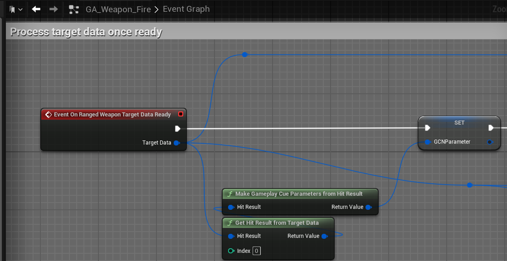


---

#### 武器定义
`ShooterCore` 向`Controller` 添加了`ULyraWeaponStateComponent`.

`ULyraWeaponStateComponent::TickComponent` 更新 `WeaponInstance` 的 `Tick`

TODO

---


#### 弹道轨迹

TODO


---

#### 准星扩散
```
武器的散布可以被想象成一个圆锥形状。
为了在准星可视化中计算屏幕空间的散布半径，我们在一个很远的距离上创建一条位于圆锥边缘的线。
该线的端点位于圆锥截面的边缘。
然后我们将其投影回屏幕，该点与屏幕中心的距离就是散布半径。

由于摄像机位置与枪口位置之间存在一定距离，这种方法并不完美。
```

TODO

---

### 队伍与战斗UI
```cpp
UENUM(BlueprintType)
namespace ETeamAttitude
{
	enum Type : int
	{
		Friendly,
		Neutral,
		Hostile,
	};
}

USTRUCT(BlueprintType)
struct FGenericTeamId
{
    UPROPERTY(Category = "TeamID", EditAnywhere, BlueprintReadWrite)
	uint8 TeamID;
}

class IGenericTeamAgentInterface
{
    virtual void SetGenericTeamId(const FGenericTeamId& TeamID) {}
    virtual FGenericTeamId GetGenericTeamId() const { return FGenericTeamId::NoTeam; }

    virtual ETeamAttitude::Type GetTeamAttitudeTowards(const AActor& Other) const
    {
        /*...*/
    };
}
```
引擎给的队伍接口提供了队伍ID 和 队友判断 的功能.

---

```cpp
class ILyraTeamAgentInterface : public IGenericTeamAgentInterface

class ALyraCharacter :public ILyraTeamAgentInterface;
class ALyraPawn : public ILyraTeamAgentInterface;
class ULyraLocalPlayer : public ILyraTeamAgentInterface;
class ALyraPlayerBotController : public ILyraTeamAgentInterface;
class ALyraPlayerController : public ILyraTeamAgentInterface;
class ALyraPlayerState : public ILyraTeamAgentInterface
```

这些类都继承了队伍接口.


```cpp
DECLARE_DYNAMIC_MULTICAST_DELEGATE_ThreeParams
(FOnLyraTeamIndexChangedDelegate, 
UObject*, ObjectChangingTeam, int32, OldTeamID, int32, NewTeamID);

class ALyraPlayerState : public ILyraTeamAgentInterface
{
    //~ILyraTeamAgentInterface interface
    virtual void SetGenericTeamId(const FGenericTeamId& NewTeamID) override;
    virtual FGenericTeamId GetGenericTeamId() const override;
    virtual FOnLyraTeamIndexChangedDelegate* GetOnTeamIndexChangedDelegate() override;
    //~End of ILyraTeamAgentInterface interface
    
    FGenericTeamId MyTeamID;
    FOnLyraTeamIndexChangedDelegate OnTeamChangedDelegate;
}

class ILyraTeamAgentInterface : public IGenericTeamAgentInterface
{
    virtual FOnLyraTeamIndexChangedDelegate* GetOnTeamIndexChangedDelegate();

    FOnLyraTeamIndexChangedDelegate& GetTeamChangedDelegateChecked()
    {
        FOnLyraTeamIndexChangedDelegate* Result = GetOnTeamIndexChangedDelegate();
        /* ... */
    }
}
```
`GetTeamChangedDelegateChecked` 调用了 `GetOnTeamIndexChangedDelegate` ，多套一层函数 何意味？

---

#### 队伍颜色

队伍最直观的表现是角色模型的颜色，

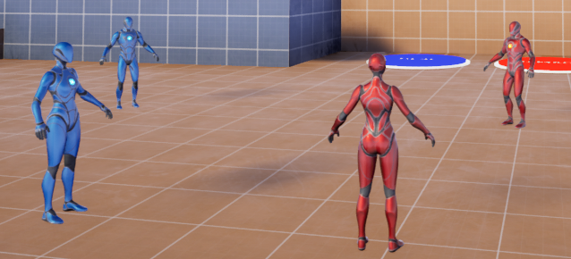

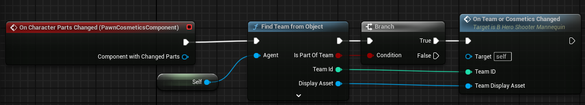

这个蓝图函数比较简单，`OnTeamorCosmeticsChanged` 向摄像机添加一个后期描边材质，根据队伍ID 设置不同的`Stencil`通道 用来做队友描边，就是隔着墙能看到队友的角色轮廓<br>
根据`DisplayAsset`的内容 设置`角色材质`和`Niagara`的参数.

`FindTeamFromObject` 通过 `ULyraTeamSubsystem` 获取`TeamID`  `DisplayAsset`.

`FindTeamFromObject`点开这个函数，<br>
`TeamID` 的获取：把`Agent`转换成`ILyraTeamAgentInterface`接口，调用函数.<br>
`DisplayAsset` 的获取：通过`TeamID` 查找 `TeamMap` 对应的元素.

`ULyraTeamSubsystem` 的 `TeamMap` 添加过程:<br>
```cpp
class ALyraTeamInfoBase : public AInfo {}

ALyraTeamInfoBase::BeginPlay()
ALyraTeamInfoBase::TryRegisterWithTeamSubsystem()
ALyraTeamInfoBase::RegisterWithTeamSubsystem(ULyraTeamSubsystem* Subsystem)

ULyraTeamSubsystem::RegisterTeamInfo(ALyraTeamInfoBase* TeamInfo)
FLyraTeamTrackingInfo::SetTeamInfo(ALyraTeamInfoBase* Info)
```

`SetTeamInfo`判断`Info`类型，`ALyraTeamPublicInfo` 或 `ALyraTeamPrivateInfo`.

`ALyraTeamInfoBase` 的创建位置：<br>
`Actor`类 总要有一个`SpawnActor`的方法来创建.<br>
```cpp
ULyraTeamCreationComponent::OnExperienceLoaded
ULyraTeamCreationComponent::ServerCreateTeams()
ULyraTeamCreationComponent::ServerCreateTeam(int32 TeamId, ULyraTeamDisplayAsset* DisplayAsset)

/* ... */
void ULyraTeamCreationComponent::ServerCreateTeams()
{
    for (const auto& KVP : TeamsToCreate)
    {
        const int32 TeamId = KVP.Key;
        ServerCreateTeam(TeamId, KVP.Value);
    }
}
```

`TeamsToCreate` 是蓝图可编辑的 `TMap` ，此外 还有两个`Class` :

```cpp
class ULyraTeamCreationComponent : public UGameStateComponent
{
    // List of teams to create (id to display asset mapping, the display asset can be left unset if desired)
    UPROPERTY(EditDefaultsOnly, Category = Teams)
    TMap<uint8, TObjectPtr<ULyraTeamDisplayAsset>> TeamsToCreate;

    UPROPERTY(EditDefaultsOnly, Category=Teams)
    TSubclassOf<ALyraTeamPublicInfo> PublicTeamInfoClass;

    UPROPERTY(EditDefaultsOnly, Category=Teams)
    TSubclassOf<ALyraTeamPrivateInfo> PrivateTeamInfoClass;
}
```

内容浏览器搜索 `ParentClass=LyraTeamCreationComponent` 找到派生的蓝图类.

```cpp
/ShooterCore/Game/B_TeamSetup_TwoTeams
/ShooterCore/Experiences/B_ShooterGame_Elimination
```

`B_TeamSetup_TwoTeams` 为 `TeamsToCreate` 添加了元素，不同队伍ID 使用不同的 `DisplayAsset`.<br>
`B_ShooterGame_Elimination` 将 `B_TeamSetup_TwoTeams` 组件添加到 `LyraGameState`.

---
总结: <br>
1.`ExperienceDefinition` 向 `GameState` 添加 `B_TeamSetup_TwoTeams` 组件<br>
2.`B_TeamSetup_TwoTeams` 在`Experience`加载完成后，根据 `TeamsToCreate` 创建`ALyraTeamPublicInfo`，并且将`TeamID`和`DisplayAsset`传进去.<br>
3.在`ALyraTeamPublicInfo`的`BeginPlay`中，向 `ULyraTeamSubsystem` 注册自身.<br>
4.`ULyraTeamSubsystem::TeamMap` 保存`TeamInfo`<br>

```cpp
void ULyraTeamCreationComponent::OnExperienceLoaded(const ULyraExperienceDefinition* Experience)
{
#if WITH_SERVER_CODE
    if (HasAuthority())
    {
        /* 上文中的过程 */
        ServerCreateTeams();

        /* 分配队伍ID */
        ServerAssignPlayersToTeams();
    }
#endif
}
```

---
#### 队友血条

##### UI的整体流程

整体流程：
```cpp
AddIndicator()
    ↓
OnIndicatorAdded.Broadcast(IndicatorDescriptor)
    ↓
SActorCanvas::OnIndicatorAdded(UIndicatorDescriptor* Indicator)
    ↓
AddIndicatorForEntry(Indicator)
    ↓
AsyncLoad(IndicatorClass, ...)  // 异步加载UI资源
    ↓
[异步加载完成后] 创建Widget并添加到画布
    ↓
Invalidate(EInvalidateWidget::Paint)  // 标记需要重绘
```

`ShooterCore`: 给玩家控制器添加 `LyraIndicatorManagerComponent`.<br>
`LAS_ShooterGame_StandardComponents` :<br>
给玩家控制器添加 `NameplateManagerComponent`.<br>
给角色添加`NameplateSource`

`Gameplay.Message.Nameplate.Add`:<br>
`NameplateSource` 广播这个标签的事件.<br>
`NameplateManagerComponent` 监听这个标签的事件.

通信流程:<br>
当有一个玩家的`Pawn`生成时，给玩家添加`NameplateSource`组件，这个组件广播该`Pawn`.<br>
`NameplateManagerComponent` 监听广播 接收这个`Pawn`,<br>
然后根据`Pawn`的信息 创建 `UIndicatorDescriptor` (后文称为`Indicator`) <br>
并添加到 `LyraIndicatorManagerComponent`.<br>

`NameplateManagerComponent`的`RegisterNameplateSource` 函数中 设置了`Indicator`的一些信息 用来计算在UI界面上的投影，<br>
例如: `SetSceneComponent` ,`SetIndicatorClass` 设置要创建的UI类 - `W_Nameplate`. <br>
`SetDataObject` 将`Pawn`的信息传入`Indicator`中. 以便在UI控件中使用.

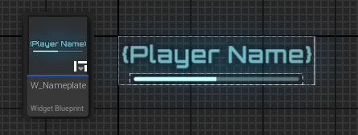

`Indicator` 最终将会传输到 `LyraIndicatorManagerComponent`.

---
`OnIndicatorAdded`:<br>
`LyraIndicatorManagerComponent` 接收到 `UIndicatorDescriptor` 之后， 广播Event.
```cpp
DECLARE_EVENT_OneParam(ULyraIndicatorManagerComponent, FIndicatorEvent, UIndicatorDescriptor* Descriptor)

void ULyraIndicatorManagerComponent::AddIndicator(UIndicatorDescriptor* IndicatorDescriptor)
{
    IndicatorDescriptor->SetIndicatorManagerComponent(this);
    OnIndicatorAdded.Broadcast(IndicatorDescriptor);
    Indicators.Add(IndicatorDescriptor);
}
```

Event监听方 - `SActorCanvas`：
```cpp
EActiveTimerReturnType SActorCanvas::UpdateCanvas(double InCurrentTime, float InDeltaTime)
{
    IndicatorComponent->OnIndicatorAdded.AddSP(this, &SActorCanvas::OnIndicatorAdded);
    IndicatorComponent->OnIndicatorRemoved.AddSP(this, &SActorCanvas::OnIndicatorRemoved);
}

void SActorCanvas::OnIndicatorAdded(UIndicatorDescriptor* Indicator)
{
    AllIndicators.Add(Indicator);        // 添加到全集（GC引用）
    InactiveIndicators.Add(Indicator);   // 添加到未激活集合
    
    AddIndicatorForEntry(Indicator);      // 开始异步加载过程
}

void SActorCanvas::AddIndicatorForEntry(UIndicatorDescriptor* Indicator)
{
    /* */
}
```

`SActorCanvas` 接收到 `Indicator` 后，<br>
`AddIndicatorForEntry` 加载 `IndicatorClass` 也就是 `W_Nameplate`控件.<br>
接着调用`W_Nameplate` 实现的 `UIndicatorWidgetInterface` 接口，<br>
将`Indicator`传入到`W_Nameplate`， 这样 控件就拥有了`Pawn`的信息.<br>

最后，把`W_Nameplate`绘制在UI上.

---

为了整体流程的连贯性，跳过了`SActorCanvas`的创建流程以及如何绘制UI.<br>
接下来解析 `SActorCanvas` 具体如何创建并绘制一个`Indicator`

---

`SActorCanvas` 的创建 :<br>
`W_ShooterHUDLayout` 的 `IndicatorLayer`控件 在`RebuildWidget`中创建`SActorCanvas`.

`UpdateCanvas`： [RegisterActiveTimer](https://dev.epicgames.com/documentation/zh-cn/unreal-engine/slate-ui-sleeping-and-active-timers-in-unreal-engine)
```cpp
void SActorCanvas::Construct(/*...*/)
{
    UpdateActiveTimer();
}


void SActorCanvas::UpdateActiveTimer()
{
    const bool NeedsTicks = AllIndicators.Num() > 0 || !IndicatorComponentPtr.IsValid();

    if (NeedsTicks && !TickHandle.IsValid())
    {
        TickHandle = RegisterActiveTimer(0, FWidgetActiveTimerDelegate::CreateSP(this, &SActorCanvas::UpdateCanvas));
    }
}
```

`SActorCanvas::UpdateCanvas` 和 `SActorCanvas::OnPaint` 基本上是Tick级别执行的.


```cpp
[新的Indicator添加]
    ↓
AddIndicatorForEntry (异步加载阶段)
    ├── 1. 获取UI类引用
    ├── 2. 启动异步加载
    └── 3. 加载完成后创建UI
    ↓
UpdateCanvas (每帧更新阶段)
    ├── 1. 投影计算
    ├── 2. 位置更新
    ├── 3. 状态同步
    └── 4. 请求重绘
    ↓
OnPaint (绘制阶段)
    ├── 1. 布局排列
    ├── 2. 子Widget绘制
    └── 3. 最终渲染
```

---

##### AsyncMixin
```cpp
//TODO 我认为需要引入保留策略，预加载会自动保留在内存中直到取消
//     但如果你只想使用AsyncLoad函数预加载单个项目呢？我不想
//     为每个调用引入单独的保留策略，或者引入一整套预加载与异步加载方法，
//     因此更愿意使用保留策略。它应该是一个成员变量并在继承自AsyncMixin时
//     真正分配内存，还是应该作为模板参数？
//enum class EAsyncMixinRetentionPolicy : uint8
//{
//	Default,
//	KeepResidentUntilComplete,
//	KeepResidentUntilCancel
//};

/**
 * FAsyncMixin 允许更轻松地管理异步加载请求，以确保线性请求处理，
 * 使编写代码更容易。使用模式如下：
 *
 * 首先 - 继承自 FAsyncMixin，即使你是 UObject，也可以同时继承自 FAsyncMixin。
 *
 * 然后 - 可以按以下方式进行异步加载。
 * 
 * CancelAsyncLoading();			
 * // 某些对象（如列表中的对象）会被重用，因此取消任何挂起的请求非常重要，以免其完成后继续执行。
 *
 * AsyncLoad(ItemOne, CallbackOne);
 * AsyncLoad(ItemTwo, CallbackTwo);
 * StartAsyncLoading();
 * 
 * 你还可以安全地包含 'this' 作用域，这是混合类（mixin）的一个好处，
 * 因为所有回调都不会超出宿主 AsyncMixin 派生对象的作用域。
 * 例如：
 * AsyncLoad(SomeSoftObjectPtr, [this, ...]() {
 *    
 * });
 * 
 *
 * 实际发生的情况：首先我们取消任何现有的加载（例如，我们可能是一个被要求表示
 * 新内容的控件）。然后我们会加载 ItemOne 和 ItemTwo，*接着*按你请求异步加载的
 * 顺序调用回调——即使 ItemOne 或 ItemTwo 在你请求时已经加载完成。
 *
 * 当所有异步加载请求完成时，将调用 OnFinishedLoading。
 * 
 * 如果你忘记调用 StartAsyncLoading()，我们会在下一帧调用它，但你应该记得在
 * 设置完成后调用它，因为可能所有内容都已加载完成，这样可以避免加载指示器闪烁一帧，
 * 这很烦人。
 * 
 * 注意：FAsyncMixin 还使得将 [this] 作为捕获参数传递到 lambda 中是安全的，
 * 因为无论是你的所有者类被销毁，还是你取消所有加载，它都会处理取消所有挂钩。
 *
 * 注意：FAsyncMixin 不会为你的类添加任何额外内存。目前许多处理异步加载的类
 * 内部分配了 TSharedPtr<FStreamableHandle> 成员，并倾向于持有 SoftObjectPaths 临时状态。
 * FAsyncMixin 使用静态 TMap 在内部完成所有这些操作，因此所有异步请求的内存都是临时且稀疏存储的。
 * 
 * 注意：为了调试和理解发生了什么，你应该在命令行中添加 -LogCmds="LogAsyncMixin Verbose"。
 */
class FAsyncMixin : public FNoncopyable
{
    // ... 类内容 ...
};

/**
 * 有时候混合类（mixin）并不适用。也许对象需要管理多个不同的任务，
 * 每个任务都有自己的异步依赖链/作用域。对于这些情况，你可以使用 FAsyncScope。
 * 
 * 这个类是一个独立的异步依赖处理器，因此你可以触发多个加载任务，并始终以正确的顺序处理它们，
 * 就像将 FAsyncMixin 与你的类结合使用一样。
 */
class FAsyncScope : public FAsyncMixin
{
    // ... 类内容 ...
};

//------------------------------------------------------------------------------
//------------------------------------------------------------------------------

enum class EAsyncConditionResult : uint8
{
    TryAgain,
    Complete
};

DECLARE_DELEGATE_RetVal(EAsyncConditionResult, FAsyncConditionDelegate);

/**
 * 异步条件允许你在满足某些条件之前，有自定义的原因来暂停异步加载。
 */
class FAsyncCondition : public TSharedFromThis<FAsyncCondition>
{
    // ... 类内容 ...
};
```

FAsyncMixin 是一个异步加载管理工具类，主要用于：
- 简化异步资源加载流程 - 提供统一的 API 加载各类资源（软对象、类、主资产等）
- 保证加载顺序性 - 确保异步加载请求按添加顺序依次执行回调
- 自动生命周期管理 - 安全处理 [this] 捕获，防止悬空指针
- 内存优化 - 使用静态共享存储，避免每个实例都分配管理内存
- 灵活的等待机制 - 支持自定义异步条件（FAsyncCondition）

```cpp
1. 添加加载请求 → 2. 开始加载 → 3. 顺序执行 → 4. 完成通知
```

请求阶段：通过 AsyncLoad() 等方法添加加载任务到内部队列 <br>
调度阶段：调用 StartAsyncLoading() 开始处理队列，如果忘记调用，下一帧会自动开始<br>

执行阶段：
- 按添加顺序处理每个异步步骤
- 每个步骤完成后才执行其回调
- 所有步骤完成后调用 OnFinishedLoading()

清理阶段：加载完成后自动或手动清理状态

---

##### UI创建与绘制

上回说到 `SActorCanvas` 接收 `UIndicatorDescriptor` 类. <br>
在玩家控制器的`NameplateManagerComponent`组件中，`Indicator`添加了 `WidgetClass` (`W_Nameplate`) 的软引用.

`AddIndicatorForEntry` 加载 `Indicator` 保存的 `WidgetClass` 软引用.<br>
加载完成以后，从`IndicatorPool`里面获得一个对应的控件.
```cpp
UUserWidget* IndicatorWidget = IndicatorPool.GetOrCreateInstance(TSubclassOf<UUserWidget>(IndicatorClass.Get()));
```

控件池的说明:
```cpp
/**
 * 池化UUserWidget实例，以最小化具有动态条目的UMG元素的UObject和SWidget分配。
 *
 * 注意：如果当UserWidget实例变为非活动状态时 底层的Slate实例被释放，
 * 那么只要该控件未被Slate层次结构主动引用（即，如果控件的共享引用计数从/变为0），
 * 当UUserWidget实例变为活动或非活动状态时，将分别调用NativeConstruct和NativeDestruct。
 *
 * 警告：请确保在所属控件的ReleaseSlateResources调用中释放池的Slate控件，以防止因循环引用导致的内存泄漏
 *		否则，对SObjectWidgets的缓存引用将保持UUserWidgets（以及它们引用的所有对象）存活
 *
 * @see UListView
 * @see UDynamicEntryBox
 */
USTRUCT()
struct FUserWidgetPool
```

创建控件: `GetOrCreateInstance` 的内部调用了 `CreateWidget`.
```cpp
if (UUserWidget* IndicatorWidget = IndicatorPool.GetOrCreateInstance(TSubclassOf<UUserWidget>(IndicatorClass.Get())))
{
    if (IndicatorWidget->GetClass()->ImplementsInterface(UIndicatorWidgetInterface::StaticClass()))
    {
        IIndicatorWidgetInterface::Execute_BindIndicator(IndicatorWidget, Indicator);
    }
}
```
`W_Nameplate`实现了这个蓝图接口，这将把 `Indicator` 传输给 `W_Nameplate`. <br>
这个控件就可以从 `Indicator` 获得`Pawn`的信息 包括队伍ID.<br>
蓝图部分就是根据`Pawn`的信息来设置UI显示的内容.

```cpp
Indicator->IndicatorWidget = IndicatorWidget;

InactiveIndicators.Remove(Indicator);

AddActorSlot(Indicator)
[
    SAssignNew(Indicator->CanvasHost, SBox)
    [
        IndicatorWidget->TakeWidget()
    ]
];
```

创建UI后 将UI传回`Indicator`，`TakeWidget` 获得UMG中的Slate控件.

`UpdateCanvas` :<br> 
TODO


---

##### GameViewport
```cpp
/**

游戏视口（FViewport）是一个高级抽象接口，用于对接平台相关的渲染、音频和输入子系统。

GameViewportClient 是引擎与游戏视口之间的接口。

每个游戏实例都会创建且仅创建一个 GameViewportClient。

到目前为止，可能出现在单个引擎实例下运行多个游戏实例（因而存在多个 GameViewportClient）
的唯一情况是运行多个 PIE（即时编辑）窗口时。

主要职责：
将输入事件传递到全局交互列表
**/

UCLASS(Within=Engine, transient, config=Engine, MinimalAPI)
class UGameViewportClient : public UScriptViewportClient, public FExec
```

```cpp
void UGameEngine::Init(IEngineLoop* InEngineLoop)
{
    // Initialize the viewport client.
    UGameViewportClient* ViewportClient = NULL;
    if(GIsClient)
    {
        TRACE_CPUPROFILER_EVENT_SCOPE(InitGameViewPortClient);
        ViewportClient = NewObject<UGameViewportClient>(this, GameViewportClientClass);
        ViewportClient->Init(*GameInstance->GetWorldContext(), GameInstance);
        GameViewport = ViewportClient;
        GameInstance->GetWorldContext()->GameViewport = ViewportClient;
    }
}
```

#### 击杀UI
`ULyraHealthComponent::HandleOutOfHealth` : 触发来源于 `ULyraHealthSet`，生命值小于等于0.<br>
当一个玩家击杀了另一个玩家时，发送`Lyra.Elimination.Message` 事件到 `MeesageSystem`.


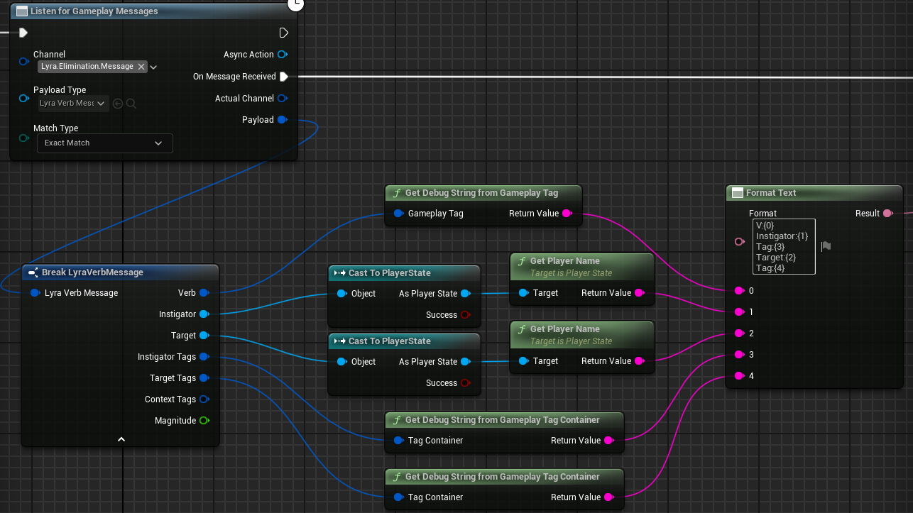

玩家击杀AI时 输出内容：
```cpp
V:Lyra.Elimination.Message 

Instigator:DESKTOP-J5VCUQF-65C0
Tag:
Lyra.Player, 
Movement.Mode.Walking, 
Event.Movement.ADS, 
Event.Movement.WeaponFire, 
GameplayEffect.DamageType.Basic, 
GameplayEffect.DamageTrait.Instant, 
GameplayEffect.DamageType.Rifle, 
Ability.Type.Action.WeaponFire, 
InputTag.Weapon.FireAuto

Target:Tinplate  
Tag:Lyra.Player, Movement.Mode.Walking
```

谁监听了 `Lyra.Elimination.Message` ? <br>
1.准星 <br>
收到击杀消息时 如果击杀方是准星UI所属的`PlayerState`，并且被击杀的不是自己的`PlayerState`，则播放准星的击杀动画.

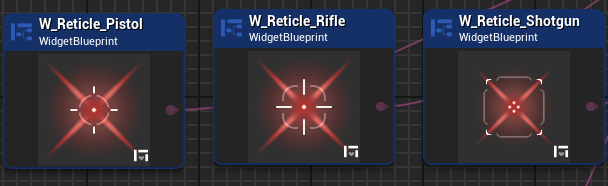

2.`B_ShooterGameScoring_Base` 比分记录 <br>
收到击杀消息时，如果击杀方是`PlayerState` 就给这个`PlayerState`的击杀数+1.<br>
如果被击杀的是`PlayerState` 就给这个`PlayerState`的死亡数+1.

3.`B_EliminationFeedRelay` 左下角的击杀信息<br>
收到击杀消息时，根据击杀方 死亡方，广播`Lyra.AddNotification.KillFeed`击杀事件，<br>
`W_EliminationFeed` 监听 `KillFeed` 击杀事件，接收到消息事件时 在击杀列表中添加一个击杀信息.<br>
`W_EliminationFeedEntryWidget` 实现List接口，并接收`W_EliminationFeed`传来的击杀事件信息，构造击杀UI的信息.

4.`UElimChainProcessor` 连杀计算组件, 蓝图`B_ElimChainProcessor`<br>
5.`UElimStreakProcessor` 多杀计算，击杀指定数量时 ，蓝图`B_ElimStreakProcessor`<br>

4和5都是在C++中完成监听.

---

连杀、多杀 的相关数据在 `DT_BasicShooterAccolades` 中保存. <br>
定义UI显示的内容、图标、显示时长，要播放的音效.

连杀与多杀的UI显示时机：在连杀 (或多次击杀达到指定击杀数) 时，屏幕上方显示特定的UI和文字.

---

连杀组件接收到`Lyra.Elimination.Message`之后，计算连杀数，根据连杀数从蓝图里找对应的Tag.

例如: 连杀2个时，找到的Tag 就是 `Lyra.ShooterGame.Accolade.EliminationChain.2x`.<br>
在广播时，`Verb` 就是这个在蓝图中找到的连杀Tag，同时它也是消息事件的通道.

```cpp
if (FGameplayTag* pTag = ElimChainTags.Find(History.ChainCounter))
{
    FLyraVerbMessage ElimChainMessage;
    ElimChainMessage.Verb = *pTag;
    MessageSubsystem.BroadcastMessage(ElimChainMessage.Verb, ElimChainMessage);
}
```

`B_AccoladeRelay` 监听 `Lyra.ShooterGame.Accolade` 消息事件，从接收到的消息中 获得`Verb`和`PlayerState`，<br>
广播到`Lyra.AddNotification.Message`消息事件中，

`ULyraAccoladeHostWidget` 监听 `Lyra.AddNotification.Message` 消息事件，<br>
从接收到的消息中 获得`Verb` ，根据`Verb`从 `AccoladeDataRegistry` 获得对应的`DataRegistry` 数据.<br>
最终得到`DT_BasicShooterAccolades`保存的`FLyraAccoladeDefinitionRow`的数据，加载其中的`Sound`和`Icon`.<br>

加载完成后，通过调用蓝图实现的 `CreateAccoladeWidget` 函数，将加载完成的数据传递给蓝图.<br>
接下来就是UMG蓝图的事情了.

---

#### 比分面板
按下Tab键 显示比分面板:

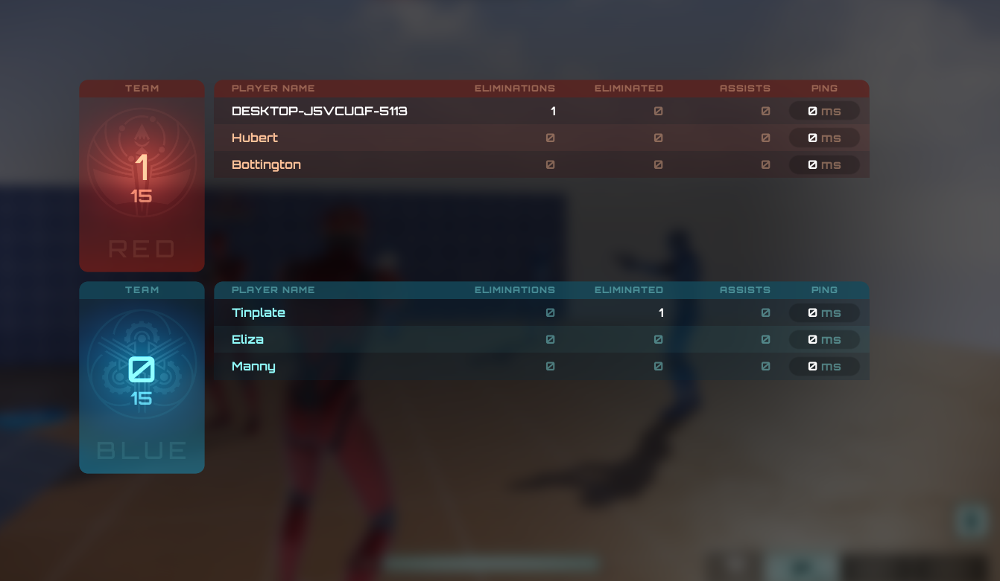

`W_MatchScoreBoard_Elimination` 在GA中创建这个UI.<br>
`GA_ShowLeaderboard_TDM` - 父类`GAB_ShowWidget_WhileInputHeld`<br>

`AbilitySet_Elimination` 绑定这个GA的输入Tag.<br>
`InputData_ShooterGame_AddOns` 绑定输入Action和Tag.<br>
`IMC_ShooterGame` 绑定输入Action的键盘按键.

---


### UI


#### SWidget的构造过程
```cpp
/**
 * Slate 控件的抽象基类
 *
 * 重要提示：请勿直接从 SWidget 继承！
 *
 * 继承说明：
 *   SWidget 不打算被直接继承。请考虑从 LeafWidget 或 Panel 继承，
 *   它们代表了实际使用场景，并提供了一组简洁的方法供重写。
 *
 *   SWidget 是所有交互式 Slate 实体的基类。其公共接口描述了控件能够执行的所有操作，
 *   因此相对复杂。
 *
 * 事件系统：
 *   Slate 中的事件通过虚函数实现，Slate 系统会调用控件的这些虚函数，
 *   以通知控件重要事件的发生（例如按键按下），或查询控件的某些信息（例如应显示哪种鼠标光标）。
 *
 *   对于大多数事件，Widget 提供了默认实现；这些默认实现不执行任何操作且不处理事件。
 *
 *   某些事件能够通过返回 FReply、FCursorReply 或类似对象来响应系统。
 */
class SWidget
```

`SNew`
```cpp
TSharedRef<SButton> MyButton = SNew(SButton);

/* 宏展开之后 */
TSharedRef<SButton> MyButton = 
    MakeTDecl<SButton>("SButton", "MyFile.cpp", 123, 
        RequiredArgs::MakeRequiredArgs()) 
    <<= SButton::FArguments();

/* 实例化 MakeTDecl 模板 */
auto tempDecl = MakeTDecl<SButton>("SButton","MyFile.cpp",123,RequiredArgsPayload());

/* */
TSlateDecl</*...*/> MakeTDecl(/* ... */)
{
    return TSlateDecl<WidgetType, RequiredArgsPayloadType>
    (
        InType, InFile, OnLine, Forward<RequiredArgsPayloadType>(InRequiredArgs)
    );
}
```
`TSlateDecl` 构造函数对`SUserWidget`类型做特殊处理，`SButton`是普通控件 直接`MakeShared`:
```cpp
TSlateDecl()
{
    _Widget = MakeShared<WidgetType>();
    _Widget->SetDebugInfo(InType, InFile, OnLine, sizeof(WidgetType));
}

/* 内存布局 */
struct TSlateDecl<SButton, ...> 
{
    /* 指向已分配的 SButton 对象 */
    TSharedPtr<SButton> _Widget;     

    /* 参数引用 */
    RequiredArgsPayload& _RequiredArgs; 
    /* _Widget 指向的 SButton 对象尚未完全构造 */
    /* 此时只调用了默认构造函数，没有设置任何属性 */
};
```

---

`SNew` 参数构造：
```cpp
<<= TYPENAME_OUTSIDE_TEMPLATE WidgetType::FArguments()
// 展开为：
<<= SButton::FArguments()
```

`SButton::FArguments` 在`SButton`类中声明.

例如：`Construct` 带有一个额外参数的控件：
```cpp
class SMatHelperWidget :public SCompoundWidget
{
public:
    SLATE_BEGIN_ARGS(SMatHelperWidget) {}
    SLATE_END_ARGS()

    void Construct(const FArguments& InArgs,FMaterialEditor* InMatEditor);
}

auto MhWidget = SNew(SMatHelperWidget, MatEditor);

#define SNew( WidgetType, ... ) \
    MakeTDecl<WidgetType>(/* */  RequiredArgs::MakeRequiredArgs(__VA_ARGS__) ) <<= TYPENAME_OUTSIDE_TEMPLATE WidgetType::FArguments()
```
重点在于`SNew`的参数包构建.<br>
`RequiredArgs::MakeRequiredArgs(__VA_ARGS__)`

此时`__VA_ARGS__`是带有一个参数的， 于是匹配到带有一个参数版本的 `MakeRequiredArgs` 函数<br>
这个函数选用了`T1RequiredArgs`类.

```cpp
template<typename Arg0Type>
T1RequiredArgs<Arg0Type&&> MakeRequiredArgs(Arg0Type&& InArg0)
{
    return T1RequiredArgs<Arg0Type&&>(Forward<Arg0Type>(InArg0));
}

template<typename Arg0Type>
struct T1RequiredArgs
{
    T1RequiredArgs(Arg0Type&& InArg0): Arg0(InArg0){}

    Arg0Type& Arg0;
};
```

这样的类共有5个，所以`Construct`的额外参数最多只能有5个.
```cpp
T0RequiredArgs : 没有Arg变量
T1RequiredArgs : Arg1
/* ... */
T5RequiredArgs : Arg0 Arg1 Arg2 Arg3 Arg4
```

此时 `MakeTDecl`函数 的参数已经构造完了，开始构造 `TSlateDecl` 类.
```cpp
template<typename WidgetType, typename RequiredArgsPayloadType>
struct TSlateDecl
{
    TSlateDecl(/* ... */ RequiredArgsPayloadType&& InRequiredArgs )
    : _RequiredArgs(InRequiredArgs)
    {

    }
    /* ... */
}
```
其中<br>
`WidgetType = SMatHelperWidget `<br>
`RequiredArgsPayloadType = T1RequiredArgs `

`TSlateDecl`模板匹配的结果:<br>
注意 `TSlateDecl` 重载了`<<=`运算符.<br>
`SNew`在`MakeTDecl`返回之后，又调用了`TSlateDecl`的`<<=` 重载函数.<br>
`<<=` 的参数是后面的 `WidgetType::FArguments()`

```cpp
#define SNew( WidgetType, ... ) \
    MakeTDecl<WidgetType>(/* */) <<= WidgetType::FArguments()
```
```cpp
struct TSlateDecl
{
    TSharedPtr<SMatHelperWidget> _Widget;
    T1RequiredArgs& _RequiredArgs;

    TSlateDecl()
    {
        _Widget = MakeShared<SMatHelperWidget>();
    }

    TSharedRef<WidgetType> operator<<=( const typename WidgetType::FArguments& InArgs ) &&
    {
        _Widget->SWidgetConstruct(InArgs);
        _RequiredArgs.CallConstruct(_Widget.Get(), InArgs);
        _Widget->CacheVolatility();
        _Widget->bIsDeclarativeSyntaxConstructionCompleted = true;

        return MoveTemp(_Widget).ToSharedRef();
    }
};
```

`operator<<=` :<br>
`_RequiredArgs.CallConstruct` 构造参数包<br>
调用控件的`Construct`函数，将参数传递过去 :

```cpp
class SMatHelperWidget :public SCompoundWidget
{
    void Construct(const FArguments& InArgs,FMaterialEditor* InMatEditor);
}

template<typename Arg0Type>
struct T1RequiredArgs
{
    Arg0Type& Arg0;

    template<class WidgetType>
    void CallConstruct(WidgetType* OnWidget, const typename WidgetType::FArguments& WithNamedArgs) const
    {
        // YOUR WIDGET MUST IMPLEMENT void Construct(const FArguments& InArgs)
        OnWidget->Construct(WithNamedArgs, Forward<Arg0Type>(Arg0));
    }
};
```

最终 `operator<<=` 返回`TSharedRef<WidgetType>`<br>

```cpp
#define SNew( WidgetType, ... ) \
    MakeTDecl<WidgetType>(/* */) <<= WidgetType::FArguments()
```


例如: `SButton`定义的参数.
```cpp
SLATE_BEGIN_ARGS( SButton )
        : _Content()
    SLATE_DEFAULT_SLOT( FArguments, Content )
SLATE_END_ARGS()

/* 宏展开的结果 */
struct FArguments : public TSlateBaseNamedArgs<SMyButton>
{
    typedef FArguments WidgetArgsType; typedef SMyButton WidgetType;
    FORCENOINLINE FArguments() : _Content(){}
        
    SLATE_DEFAULT_SLOT( FArguments, Content )
};
```
在`FArguments`的构造函数中，这些 `SLATE` 属性将被初始化.


当这些都完成后，就可以得到一个控件.
```cpp
TSharedRef<SButton> MyButton = SNew(SButton);
```

总结：<br>
创建一个`Slate`控件时 <br>
要实现`void Construct( const FArguments& InArgs )`<br>
SLATE_BEGIN_ARGS <br>
SLATE_END_ARGS <br>
才能使用`SNew`构造这个控件.

---
#### SLATE_ATTRIBUTE

这些属性用于构造函数，就像函数接收的结构体，由外部传入到 `控件` 的构造函数中<br>
`控件` 的构造函数可以接收这些参数，用来初始化 `控件` 的成员属性.

例如 ：
```cpp
class STextBlock : public SLeafWidget
{
public:
    /* 定义结构体 */
    SLATE_BEGIN_ARGS( STextBlock )
        : _Text()

        SLATE_ATTRIBUTE( FText, Text )
    SLATE_END_ARGS()

    void STextBlock::Construct( const FArguments& InArgs )
    {
        SetText(InArgs._Text);
    }

    void STextBlock::SetText(TAttribute<FText> InText)
    {
        bIsAttributeBoundTextBound = InText.IsBound();
        BoundText.Assign(*this, MoveTemp(InText));
    }

private:
    /** The text displayed in this text block */
    TSlateAttribute<FText> BoundText;
}
```

`STextBlock` 定义 `FArguments` 结构体，这个结构体里有 `FText Text`, <br>
构造函数接收 `FArguments` 结构体，并使用 `FArguments::_Text` 设置 `BoundText` 的内容.

---

属性声明：
```cpp
SLATE_BEGIN_ARGS( STextBlock )
: _Text()
, _TextStyle( &FCoreStyle::Get().GetWidgetStyle<FTextBlockStyle>( "NormalText" ) )

    /** The text displayed in this text block */
    SLATE_ATTRIBUTE( FText, Text )

    /** Pointer to a style of the text block, which dictates the font, color, and shadow options. */
    SLATE_STYLE_ARGUMENT( FTextBlockStyle, TextStyle )

SLATE_END_ARGS()
```

使用示例：
```cpp
SAssignNew(TextBlock, STextBlock)
.Text(Text)
.TextStyle( &InArgs._Style->TextStyle )
```

属性宏展开结果:
```cpp
SLATE_ATTRIBUTE( FText, Text )

/* 展开 */
SLATE_PRIVATE_ATTRIBUTE_VARIABLE( FText, Text );
SLATE_PRIVATE_ATTRIBUTE_FUNCTION( FText, Text )

/* 再展开 */
/* VARIBLE 的结果*/
TAttribute< FText > _Text;

/* FUNCTION 的结果*/
WidgetArgsType& Text(TAttribute<FText> InAttribute)
{
    _Text = MoveTemp(InAttribute);
    return this->Me();
}

/* TextStyle的展开结果 */
const FTextBlockStyle* _TextStyle;;
WidgetArgsType& TextStyle(const FTextBlockStyle* InArg)
{
    _TextStyle = InArg;
    return this->Me();
}

/* 调用 this->Me() 的函数 */
template<typename InWidgetType>
struct TSlateBaseNamedArgs : public FSlateBaseNamedArgs
{
    WidgetArgsType& Me()
    {
        return *(static_cast<WidgetArgsType*>(this));
    }
}
```
这些函数都会返回`this->Me()`.

```cpp
SLATE_BEGIN_ARGS( STextBlock )
: _Text()
, _TextStyle( &FCoreStyle::Get().GetWidgetStyle<FTextBlockStyle>( "NormalText" ) )

/* SLATE_BEGIN_ARGS( STextBlock ) */
/* 展开结果 */
struct FArguments : public TSlateBaseNamedArgs<STextBlock>
```

`SLATE_BEGIN_ARGS` 定义了`FArguments`结构体， 这些返回了`this->Me`的函数都是这个结构体内的函数.

`SWidget的构造过程` 这一节解释了`SNew`的运行流程.<br>
在最后一个阶段中,`<<=` 接收一个参数，这个参数就是后面的`WidgetType::FArguments()`<br>

```cpp
#define SNew( WidgetType, ... ) \
    MakeTDecl<WidgetType>(/* */) <<= WidgetType::FArguments()
```


例如： `Text`返回了`FArguments`，继续对`FArguments`调用`TextStyle`<br>

所以 下面的代码才能实现使用`.`符号链式调用函数.<br>
这些链式调用 都是在构造阶段操作 `<<=` 接收的参数.
```cpp
SAssignNew(TextBlock, STextBlock)
.Text(Text)
.TextStyle( &InArgs._Style->TextStyle )
```

---

`SLATE_PRIVATE_ATTRIBUTE_FUNCTION` 定义的函数

```cpp
SLATE_PRIVATE_ATTRIBUTE_FUNCTION( FText, Text )

/* 宏展开 */
WidgetArgsType& Text(TAttribute<FText> InAttribute)

template <typename... VarTypes>
WidgetArgsType& Text_Static(TIdentity_T<TAttribute<FText>::FGetter::TFuncPtr<VarTypes...>> InFunc,VarTypes... Vars)

WidgetArgsType& Text_Lambda(TFunction<FText(void)>&& InFunctor)

template <class UserClass, typename... VarTypes>
WidgetArgsType& Text_Raw(UserClass* InUserObject,TAttribute<FText>::FGetter::TConstMethodPtr<UserClass, VarTypes...> InFunc,VarTypes... Vars)

template <class UserClass, typename... VarTypes>
WidgetArgsType& Text(TSharedRef<UserClass> InUserObjectRef,TAttribute<FText>::FGetter::TConstMethodPtr<UserClass, VarTypes...> InFunc,VarTypes... Vars)

template <class UserClass, typename... VarTypes>
WidgetArgsType& Text(UserClass* InUserObject,TAttribute<FText>::FGetter::TConstMethodPtr<UserClass, VarTypes...> InFunc,VarTypes... Vars)

template <class UserClass, typename... VarTypes>
WidgetArgsType& Text_UObject(UserClass* InUserObject,TAttribute<FText>::FGetter::TConstMethodPtr<UserClass, VarTypes...> InFunc,VarTypes... Vars)
```

使用示例 ：<br>
`Text_Static`
```cpp
/* Text_Static */
static FText GetButtonText()
{
    return FText::FromString("静态函数文本");
}

SNew(SButton)
.Text_Static(&GetButtonText)

/* 带参数版本 */
static FText GetTextWithCount(int32 Count)
{
    return FText::Format(LOCTEXT("CountFormat", "数量：{0}"),FText::AsNumber(Count));
}

SNew(SButton)
.Text_Static(&GetTextWithCount, 42)  // 传递参数 42
```

---

---
### 动画系统
`B_Hero_ShooterMannequin` 使用控制器的旋转值 `bUseControllerRotationYaw = true`.<br>

`ABP_ItemAnimLayersBase`

惯性混合 : 让两个姿势之间平滑过渡，而不是瞬间切换姿势<br>
要在`ABP_Mannequin_Base` AnimGraph 的 `Output Pose` 之前，添加`Inertialization`节点.

---

#### 人类行为模仿怪谈

想象自己是一个人类，人类在跑步时 会发生什么变化.

当一个人类开始跑步时，首先是拥有加速度，其次是速度逐渐上升.<br>
假设这个人类习惯以 108000米/秒 的速度跑步，<br>
他的起步过程就是从 0米/秒 到达 108000米/秒 的过程，<br>
到达最高值时，他就会以一个固定的循环动画来播放他的动作.<br>

过了一会，他要到达目的地了，那里有个人在等他.<br>
首先他要减速吧，不然的话 以这个速度过去 要不就是把人给创飞了，要不就是跑过头了.<br>
人类要做减速，第一个反应就是 判断距离目的地还有多远，要提前减速，最好是在速度降到0时 刚好到达.<br>
减速过程中，加速度是0，速度不断下降 直到为0.<br>
如果他足够幸运，就可以在到达目的地时 速度刚好为0，<br>
由于惯性 他还需要做一个刹车动作，即 播放停止动画<br>

他开始和等待他的人对话，两个人都进入了闲置状态，播放闲置动画.

`-`<br>
在跑步之前 角色在闲置状态，<br>
闲置->起步 : 如果角色有了加速度 就说明角色正在移动.<br>
跑步->停止 : 角色加速度为0.

---

假设他跑过头了 需要返回，但是这个人比较头铁 他不想转身回头，他只能后退回去.<br>

或者说 按住`W键`一直向前走 但是走过头了，但是不想晃鼠标 只好按住`S`键后退回去.

想象一个人类，他走着走着 突然需要向后走，<br>
那么他的身体要做一个缓冲 将向前的速度降下来，再让速度朝向后面，<br>
在这个切换速度的过程中，身体会顿一下，然后才是向后走，这个过程就需要播放一个过渡的动画来表现.<br>
首先是减速，然后是向后加速.

```cpp
时间轴（秒）：
0.0-0.2：前脚踩实，上身继续前倾（惯性）
0.2-0.3：重心回移，身体垂直（"顿"的感觉）
0.3-0.5：后脚蹬地，开始后退
0.5+：正常后退循环
```

`-`<br>
dot:<br>
0+：当点乘结果为正时，表示两个向量的夹角小于90度（锐角），方向基本一致。<br>
0：当点乘结果为零时，表示两个向量垂直（夹角为90度）。<br>
0-：当点乘结果为负时，表示两个向量的夹角大于90度（钝角），方向相反。

一直按住`W`键，角色速度向前 且速度大小为 `600`，<br>
突然松开`W` 按下`S`键， 这个过程中 加速度发生了变化 直接变为相反数，<br>
而速度还要逐渐下降到0 再继续下降到大小为 `-600` 的速度.

上一帧的加速度是正数，下一帧就变成了负数，<br>
对比速度和加速度的方向，如果方向相反 就可以知道角色正在切换运动方向，要播放对应的动画.<br>


---

跳跃和下落.

如何判断人类是在跳跃 还是 自由落体.<br>
一个人类跳跃了，他的身体发生了这些变化...

假设 朝向天空的方向是正Z轴，朝向地面的方向是负Z轴，

当他跳跃时，他拥有向上的速度，Z方向的速度是正的.<br>
因为重力影响，他的Z速度将会逐渐被耗尽，耗尽后 开始下落，此时 Z速度是负的.<br>
那么他何时落地？ 离地面很近就是将要落地了...

在Z值从正数变为负数的过程中，它有一刻是等于0的，Z=0就意味着 向上的速度被耗尽了，这时候就是最高点.<br>
到达最高点后 就要下落了，所以Z=0就是最高点.

所以可以总结以下规律:<br>
跳跃:拥有Z速度，且Z大于0.<br>
下落:拥有Z速度，且Z小于0.<br>
接近地面:距离地面很近.<br>
落地完成:在地上.

动画过程：起跳 -> 起跳循环 -> 跳到最高点 -> 下落循环 -> 落到地面 

跳跃-->下落，这个转换在跳跃到最高点时发生.<br>
问题在于:什么时候到达最高点.

最高点时刻的公式 及 推导:

最后公式: TimeToJumpApex = (-WorldVelocity.Z) / GravityZ

推导：<br>
v = v₀ + a * t
```cpp
v = 最终速度（到达顶点时为 0）
v₀ = 初始速度（WorldVelocity.Z）
a = 加速度（重力加速度 GravityZ）
t = 时间（TimeToJumpApex）
```
已知初速度 加速度，就可以算出 t 时刻的速度.<br>
跳跃到达顶点高度的条件：Z速度为0:<br>
`0 = v₀ + a * t`


设 v=0，对公式变形:<br>
```
v = v₀ + a * t
0 = v₀ + a * t

a * t = -v₀
t = -v₀ / a
```
t就是到达目标位置的时刻.

代入游戏变量:这里的加速度 a 是重力Z. 因为Z是-980，为了保证数值是正的，所以速度加一个符号.
```
TimeToJumpApex = (-WorldVelocity.Z) / GravityZ
```

或者把重力的符号改为负的，角色速度用正的.
```
TimeToJumpApex = WorldVelocity.Z / -GetGravityZ()
```
`TimeToJumpApex` 是跳跃到最高点的时刻.<br>
从跳跃开始时，经过`TimeToJumpApex`秒 跳跃到最高点，然后因为重力 角色开始下落.


---

#### Update
`BlueprintThreadSafeUpdateAnimation`

`UpdateLocationData`:<br>
获得世界位置，计算两帧之间的位移距离 和 速度.

---

`UpdateRotationData`:<br>
`Rotator.Yaw` 鼠标左右旋转.<br>
获得世界旋转，计算两帧之间`Yaw`的差值 和 速度.<br>

`AdditiveLeanAngle` = `Yaw`差值 * 系数，用于混合空间 混合倾斜动画.<br>
当鼠标左右旋转值很大的时候， 倾斜角度就很大.产生`Yaw`差值<br>
例如: 把鼠标从鼠标垫的左边 移动到 鼠标垫的右边，<br>
在鼠标移动过程中 每帧都会产生`Yaw`差值，角色奔跑时 就会向右倾斜.<br>
直到鼠标到达鼠标垫右边，不再移动，此时 `Yaw` 的差值回到0，角色不再倾斜.

---

`UpdateVelocityData`:<br>

---

#### 跑


##### 方向计算

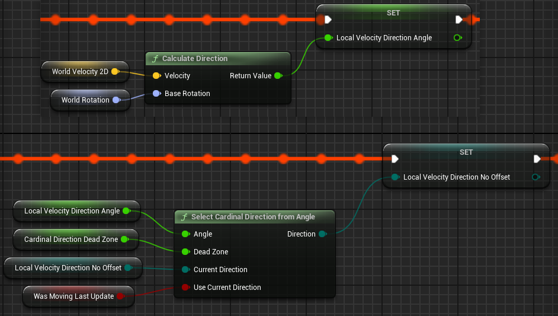

`LocalVelocityDirectionAngle` :<br>
向前移动 值为0，向后移动 值为-180，向左 -90，向右 +90.<br>
`WorldRotation` 是从 `GetActorRotation` 来的，<br>
但是在角色蓝图里 开启了`Use Controller Rotation Yaw`，所以`WorldRotation`是使用了控制器`Yaw`的旋转值.

所以 `LocalVelocityDirectionAngle` 是 角色速度朝向 和 控制器朝向 的差值.<br>
因为 摄像机使用的是控制器的旋转值，当控制器旋转时 摄像机才跟着旋转，<br>
如果 摄像机看向前方 (也就是控制器的旋转是朝前的)，而玩家按住`S`键 让角色往后走，<br>
此时 一个朝前 一个朝后，差值就是180.

同样的道理，摄像机依然朝前的情况下，玩家按住`D`键 让角色向右走，前方向和右方向 之间的差值就是90.

---


`Select Cardinal Direction from Angle` :<br>
AbsAngle = Abs(Angle) ，<br>
如果 AbsAngle <= 45 ，判定为向前移动 <br>
否则.AbsAngle >= 135 ，判定为向后移动 <br>

先判断前后，如果不是向前 也不是向后， 那就只剩下左右<br>
此时不使用绝对值，而是使用 Angle 判定左右，<br>
如果是负数 就是向左，是正数就是向右.

`DeadZone` 增加了容错值，当移动方向只改变了10度时，不会切换移动方向.

---
有了朝向的数据，在动画层里面就可以根据朝向 选择对应的动画.

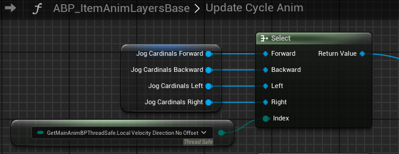

---


##### 步幅扭曲
[相关文档](https://dev.epicgames.com/documentation/zh-cn/unreal-engine/pose-warping-in-unreal-engine)

角色动画和移动速度不匹配时 就会出现滑步.<br>
极端情况下 将移动速度设为10，可以观察到滑步.

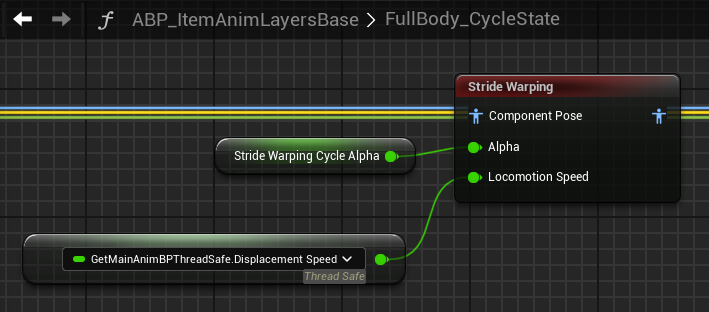

在Output之前添加`Stride Warping`. <br>
`DisplacementSpeed` : 两帧之间位移距离 / DeltaTime ，其实就是速度.

节点的细节面板：

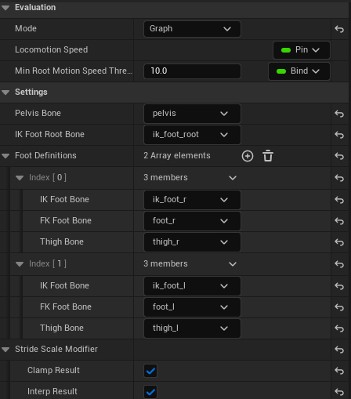

---


##### 方向扭曲

前面配置了 前后左右的移动动画，但是按住`W`时`D` 角色依然是朝前运动.

使用`Orientation Warping`解决这个问题.

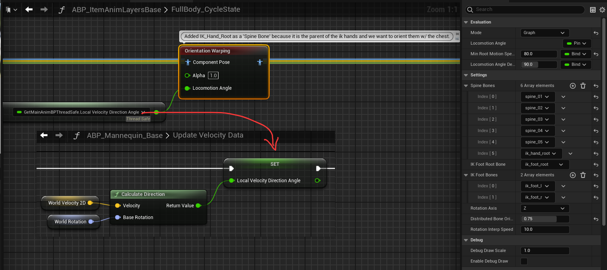

---


##### 叠加倾斜

前情提要
```cpp
UpdateRotationData:
Rotator.Yaw 鼠标左右旋转.
获得世界旋转，计算两帧之间Yaw的差值 和 速度.

AdditiveLeanAngle = Yaw差值 * 系数，用于混合空间 混合倾斜动画.
当鼠标左右旋转值很大的时候， 倾斜角度就很大.产生Yaw差值
例如: 把鼠标从鼠标垫的左边 移动到 鼠标垫的右边，
在鼠标移动过程中 每帧都会产生Yaw差值，角色奔跑时 就会向右倾斜.
直到鼠标到达鼠标垫右边，不再移动，此时 Yaw 的差值回到0，角色不再倾斜.
```

直接在`Base`应用了叠加动画:

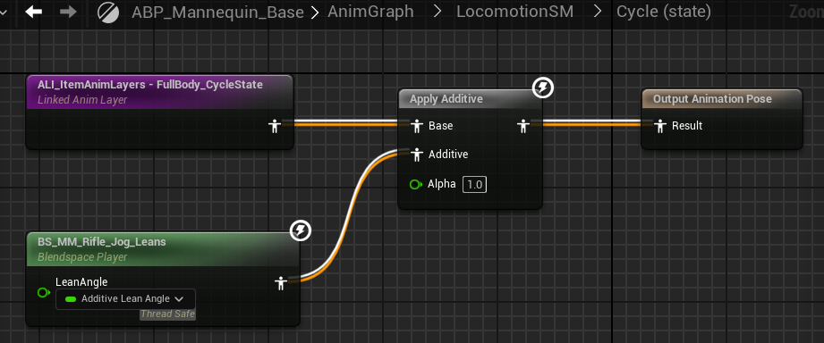


混合空间:

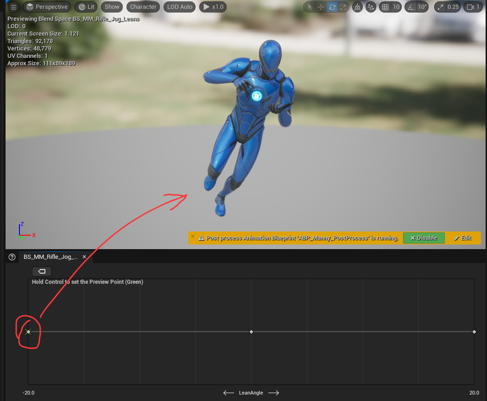


---

#### 停

##### 距离匹配
[相关文档](https://dev.epicgames.com/documentation/zh-cn/unreal-engine/distance-matching-in-unreal-engine)


`SetUpStopAnim` 和 `UpdateStopAnim` 这两个函数都使用了`ShouldDistanceMatchStop`函数.<br>

`ShouldDistanceMatchStop` : 有速度 且 没有加速度 ，返回`true`.<br>
按住`W`键， 角色往前跑， 此时有速度和加速度.<br>
跑一会 松开`W`，此时有速度 但是没有加速度.<br>
那也就是说 在松开移动按键时，才会返回`true`，进行距离检测和距离匹配.

为什么要在这个时机去匹配距离？<br>
如果松开`W`键，角色的停止动画播放完了，但是速度没有减到0  依旧在减速，那就没有动画可以播了.

1.当完全停下来时，没有速度 也没有加速度，那就不去匹配距离了.直接动画进度设为1，播放完成<br>
2.当距离匹配的结果为0时，那就是到达目标点了 要停下，把动画的播放进度设为1，直接播放完成.

返回 `true` 的情况（应该使用距离匹配停止）<br>
HasVelocity = true 且 HasAcceleration = false

匀速移动中即将自然停止
- 角色正在移动（有速度）
- 没有输入加速度（玩家松开移动键）
- 由于惯性或摩擦力逐渐减速

返回 `false` 的情况（不应该使用距离匹配停止）<br>
情况A：HasVelocity = false（角色静止）<br>
情况B：HasAcceleration = true（角色有加速度）<br>
情况C：HasVelocity = true 且 HasAcceleration = true <br>

---
