# Lyra - 2

## UI

### 主界面布局


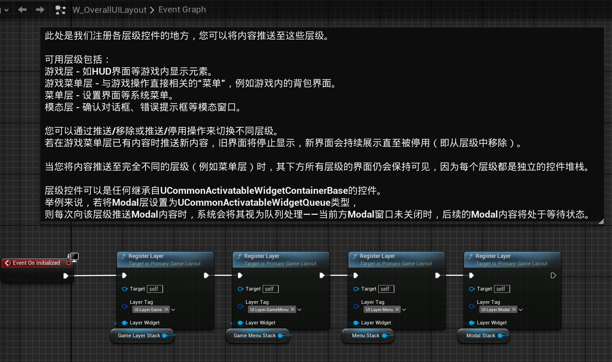

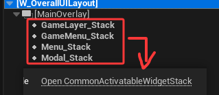

`CommonActivatableWidgetStack` 可以容纳`CommonActivatableWidget`类型的UMG控件.<br>

---

先从宏观上来说<br>

`W_OverallUILayout` 提供一个层级关系.<br>
蓝图注释里面的 `其下方所有层级的界面仍会保持可见`，举个例子说明`其下方`是什么东西.<br>
上图中 `Modal_Stack`位于最上方，具体布局如下:
```cpp
Modal_Stack
Menu_Stack
GameMenu_Stack
GameLayer_Stack
```
再举个例子:<br>
`Image_0`在`Image_1`的下方.<br>
`Image_1`可以覆盖`Image_0`，

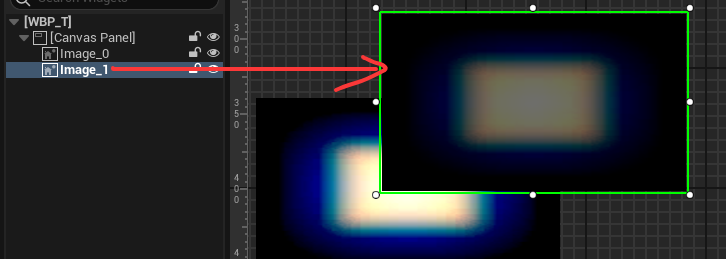

以上就是这些`X_Stack`的整体布局说明.

---

针对单独的`Stack`<br>

上面的蓝图注释中已经说明了，就是说 `Stack`只能同时显示一个UMG.<br>
下面举个例子.

向`GameLayer_Stack`添加一个控件，这个控件会被显示出来，没有问题.<br>
再向`GameLayer_Stack`添加一个控件，先前添加的控件会隐藏，显示后来添加的控件.<br>
直到后来 添加的控件 被取消，先前的控件才会显示出来.

例如: 在游戏主界面中，我要退出游戏，此时应该弹出一个窗口 问我是不是确认要退出.

`GameLayer_Stack` 首先显示一个`主界面`的UMG，<br>
当我点击`退出`按钮时,`GameLayer_Stack`会添加一个新的UMG，这个新的UMG问我是否要退出，并且给了`确认/取消`按钮.<br>

当`确认/取消`界面被添加时，`主界面`就会被停止显示，此时 整个屏幕只有 `确认/取消` 这个询问界面.<br>
如果我点击了`取消`，询问界面停止显示，`主界面`重新显示.

---

下面这些蓝图节点做了什么？

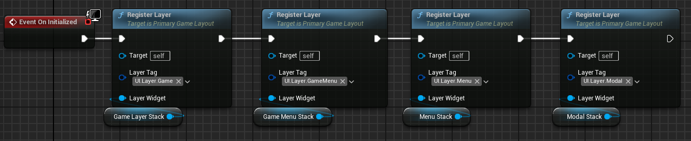

`RegisterLayer` 向一个TMap添加`GameplayTag`和`LayerWidget` :

```cpp
class UPrimaryGameLayout : public UCommonUserWidget
{
    // The registered layers for the primary layout.
	UPROPERTY(Transient, meta = (Categories = "UI.Layer"))
	TMap<FGameplayTag, TObjectPtr<UCommonActivatableWidgetContainerBase>> Layers;
}

/** Register a layer that widgets can be pushed onto. */
UFUNCTION(BlueprintCallable, Category="Layer")
void UPrimaryGameLayout::RegisterLayer(FGameplayTag LayerTag, UCommonActivatableWidgetContainerBase* LayerWidget)
{
	if (!IsDesignTime())
	{
        /*...*/
		Layers.Add(LayerTag, LayerWidget);
	}
}
```

`RegisterLayer` 传入`GameplayTag`和`LayerWidget`，把它们关联起来.<br>
一个`GameplayTag`对应一个`LayerWidget`.<br>
要往`Stack`里面添加UMG，只需要指定`GameplayTag`即可.

下图的功能是一样的，都是往`GameLayer_Stack`添加UMG控件.

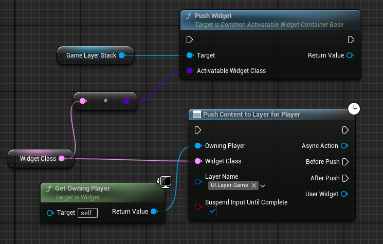

---

上面搞了这么东西说明 `W_OverallUILayout` 设计巧妙的地方，<br>
但是它总归还是个UMG，那么这个UMG是如何添加到屏幕上的.


```cpp
UCLASS(Abstract, config = Game)
class UGameUIManagerSubsystem : public UGameInstanceSubsystem

UCLASS()
class ULyraUIManagerSubsystem : public UGameUIManagerSubsystem
```

`UGameInstanceSubsystem`是主要实现.


```cpp
class UGameUIManagerSubsystem : public UGameInstanceSubsystem
{
    virtual void Initialize(FSubsystemCollectionBase& Collection) override;

    UPROPERTY(Transient)
	TObjectPtr<UGameUIPolicy> CurrentPolicy = nullptr;

	UPROPERTY(config, EditAnywhere)
	TSoftClassPtr<UGameUIPolicy> DefaultUIPolicyClass;
}

void UGameUIManagerSubsystem::Initialize(FSubsystemCollectionBase& Collection)
{
	Super::Initialize(Collection);

	if (!CurrentPolicy && !DefaultUIPolicyClass.IsNull())
	{
		TSubclassOf<UGameUIPolicy> PolicyClass = DefaultUIPolicyClass.LoadSynchronous();
		SwitchToPolicy(NewObject<UGameUIPolicy>(this, PolicyClass));
	}
}
```

在初始化时，创建`DefaultUIPolicyClass`. 并保存在`CurrentPolicy`<br>

`DefaultUIPolicyClass` 指定为`B_LyraUIPolicy` :<br>

`Config/DefaultGame.ini`
```cpp
[/Script/LyraGame.LyraUIManagerSubsystem]
DefaultUIPolicyClass=/Game/UI/B_LyraUIPolicy.B_LyraUIPolicy_C
```

`B_LyraUIPolicy` 又指定了 `W_OverallUILayout`.

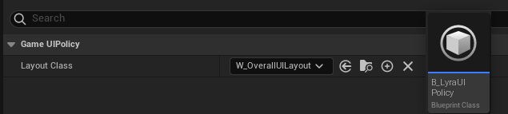

在添加一个玩家时，触发`UIManager` 的 `NotifyPlayerAdded` 函数.<br>
进而调用`CurrentPolicy`的`NotifyPlayerAdded`函数.

```cpp
int32 UCommonGameInstance::AddLocalPlayer(ULocalPlayer* NewPlayer, FPlatformUserId UserId)
{
	int32 ReturnVal = Super::AddLocalPlayer(NewPlayer, UserId);
	if (ReturnVal != INDEX_NONE)
	{
        /*...*/
		GetSubsystem<UGameUIManagerSubsystem>()->NotifyPlayerAdded(Cast<UCommonLocalPlayer>(NewPlayer));
	}
	
	return ReturnVal;
}

void UGameUIManagerSubsystem::NotifyPlayerAdded(UCommonLocalPlayer* LocalPlayer)
{
	if (ensure(LocalPlayer) && CurrentPolicy)
	{
		CurrentPolicy->NotifyPlayerAdded(LocalPlayer);
	}
}

void UGameUIPolicy::CreateLayoutWidget(UCommonLocalPlayer* LocalPlayer)
{
	if (APlayerController* PlayerController = LocalPlayer->GetPlayerController(GetWorld()))
	{
		TSubclassOf<UPrimaryGameLayout> LayoutWidgetClass = GetLayoutWidgetClass(LocalPlayer);
		if (ensure(LayoutWidgetClass && !LayoutWidgetClass->HasAnyClassFlags(CLASS_Abstract)))
		{
			UPrimaryGameLayout* NewLayoutObject = CreateWidget<UPrimaryGameLayout>(PlayerController, LayoutWidgetClass);
			RootViewportLayouts.Emplace(LocalPlayer, NewLayoutObject, true);
			
			AddLayoutToViewport(LocalPlayer, NewLayoutObject);
		}
	}
}
```
`CreateLayoutWidget` 中的 `LayoutWidgetClass` 就是在蓝图里面指定的 `W_OverallUILayout` .<br>
创建完了以后 将UMG保存在`RootViewportLayouts`中，然后添加到屏幕上 :

```cpp
void UGameUIPolicy::AddLayoutToViewport(UCommonLocalPlayer* LocalPlayer, UPrimaryGameLayout* Layout)
{
	UE_LOG(LogCommonGame, Log, TEXT("[%s] is adding player [%s]'s root layout [%s] to the viewport"), *GetName(), *GetNameSafe(LocalPlayer), *GetNameSafe(Layout));

	Layout->SetPlayerContext(FLocalPlayerContext(LocalPlayer));
	Layout->AddToPlayerScreen(1000);

	OnRootLayoutAddedToViewport(LocalPlayer, Layout);
}
```

总结一下整个链条:<br>
`UGameUIManagerSubsystem` --> `UGameUIPolicy` --> `RootViewportLayouts` <br>
最终通过Subsystem就可以获取创建的UMG.

---

### 添加游戏界面

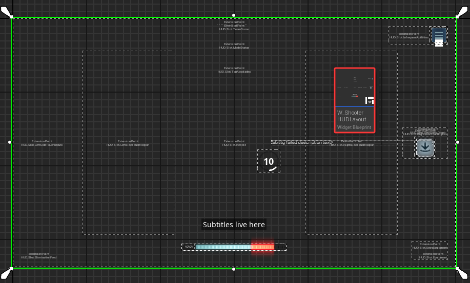

这个界面通过`GameFeatureAction`添加到主界面布局中.

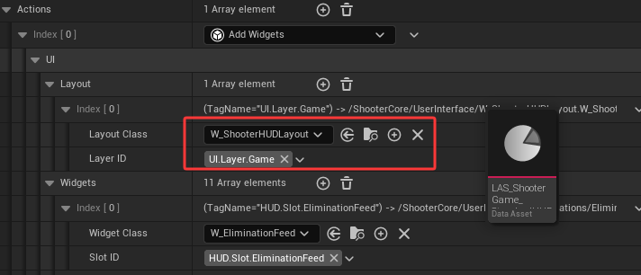

```cpp
void UGameFeatureAction_AddWidgets::AddWidgets(AActor* Actor, FPerContextData& ActiveData)
{
	ALyraHUD* HUD = CastChecked<ALyraHUD>(Actor);
    if (ULocalPlayer* LocalPlayer = Cast<ULocalPlayer>(HUD->GetOwningPlayerController()->Player))
	{
		FPerActorData& ActorData = ActiveData.ActorData.FindOrAdd(HUD);

		for (const FLyraHUDLayoutRequest& Entry : Layout)
		{
			if (TSubclassOf<UCommonActivatableWidget> ConcreteWidgetClass = Entry.LayoutClass.Get())
			{
				ActorData.LayoutsAdded.Add(UCommonUIExtensions::PushContentToLayer_ForPlayer(LocalPlayer, Entry.LayerID, ConcreteWidgetClass));
			}
		}
    }
}
```

`UCommonUIExtensions::PushContentToLayer_ForPlayer`<br>
通过`UGameUIManagerSubsystem`添加UI.

在之前 已经将`GameplayTag`和`Stack`关联起来 :


`UGameUIManagerSubsystem` --> `UGameUIPolicy` --> `RootViewportLayouts` <br>
通过`ULocalPlayer`获取`RootViewportLayouts`中保存的UMG.<br>
获取的UMG就是上图中 拥有`GameLayer_Stack`的那个UMG.
```cpp
UCommonActivatableWidget* UCommonUIExtensions::PushContentToLayer_ForPlayer(const ULocalPlayer* LocalPlayer, FGameplayTag LayerName, TSubclassOf<UCommonActivatableWidget> WidgetClass)
{
    /*...*/
    if (UPrimaryGameLayout* RootLayout = Policy->GetRootLayout(CastChecked<UCommonLocalPlayer>(LocalPlayer)))
    {
	    return RootLayout->PushWidgetToLayerStack(LayerName, WidgetClass);
    }
}
```

`PushWidgetToLayerStack` 根据传来的`GameplayTag` 寻找对应的`X_Stack`，
```cpp
template <typename ActivatableWidgetT = UCommonActivatableWidget>
ActivatableWidgetT* PushWidgetToLayerStack(FGameplayTag LayerName, UClass* ActivatableWidgetClass,/*...*/)
{
	if (UCommonActivatableWidgetContainerBase* Layer = GetLayerWidget(LayerName))
	{
		return Layer->AddWidget<ActivatableWidgetT>(ActivatableWidgetClass, InitInstanceFunc);
	}

	return nullptr;
}
```

至此，玩家的游戏界面就添加到屏幕上了.

---

### 添加小控件
你的这些设计固然很巧妙，但是游戏界面上没有武器UI 看不到子弹数量，右下角空空如也.

和前面的一样，也是`GameFeatureAction` 通过 `GameplayTag` 寻找要添加的位置.<br>
如下图:

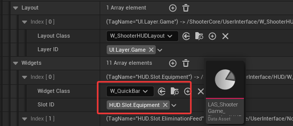


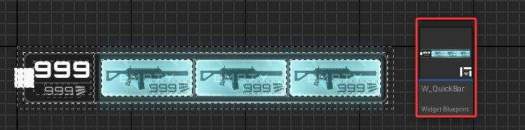

---

```cpp
/**
 * 支持在设计时与运行时动态生成任意数量条目的控件基类。
 * 内含创建、构建及缓存大量条目控件所需的所有功能，但不对外暴露条目的创建或移除接口。
 * 具体填充方式由子类自行决定（某些子类可能完全内部处理而不对外暴露任何方法）
 *
 * @see UDynamicEntryBox 可直接使用的版本
 */
UCLASS(Abstract, MinimalAPI)
class UDynamicEntryBoxBase : public UWidget
```


```cpp
class UUIExtensionSubsystem : public UWorldSubsystem

/**
 * A slot that defines a location in a layout, where content can be added later
 */
UCLASS()
class UUIExtensionPointWidget : public UDynamicEntryBoxBase

TSharedRef<SWidget> UUIExtensionPointWidget::RebuildWidget()
{
	if (!IsDesignTime() && ExtensionPointTag.IsValid())
	{
		ResetExtensionPoint();
		RegisterExtensionPoint();
    }
}

void UUIExtensionPointWidget::RegisterExtensionPoint()
{
	if (UUIExtensionSubsystem* ExtensionSubsystem = GetWorld()->GetSubsystem<UUIExtensionSubsystem>())
	{
		TArray<UClass*> AllowedDataClasses;
		AllowedDataClasses.Add(UUserWidget::StaticClass());
		AllowedDataClasses.Append(DataClasses);

		ExtensionPointHandles.Add(ExtensionSubsystem->RegisterExtensionPoint(
			ExtensionPointTag, ExtensionPointTagMatch, AllowedDataClasses,
			FExtendExtensionPointDelegate::CreateUObject(this, &ThisClass::OnAddOrRemoveExtension)
		));
	}
}
```

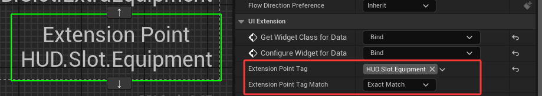

如上图，扩展点配置一个`GameplayTag`，未来要根据Tag寻找扩展点.<br>
`RegisterExtensionPoint` 向 `UIExtensionSubsystem`注册扩展点.<br>

把`OnAddOrRemoveExtension`函数 绑定到扩展点的`Callback`中.<br>
当有UI要添加到这个扩展点时，执行`Callback`的函数，`OnAddOrRemoveExtension`

```cpp
FUIExtensionPointHandle UUIExtensionSubsystem::RegisterExtensionPointForContext(const FGameplayTag& ExtensionPointTag, UObject* ContextObject, EUIExtensionPointMatch ExtensionPointTagMatchType, const TArray<UClass*>& AllowedDataClasses, FExtendExtensionPointDelegate ExtensionCallback)
{
    FExtensionPointList& List = ExtensionPointMap.FindOrAdd(ExtensionPointTag);

    TSharedPtr<FUIExtensionPoint>& Entry = List.Add_GetRef(MakeShared<FUIExtensionPoint>());
	Entry->ExtensionPointTag = ExtensionPointTag;
	Entry->ContextObject = ContextObject;
	Entry->ExtensionPointTagMatchType = ExtensionPointTagMatchType;
	Entry->AllowedDataClasses = AllowedDataClasses;
	Entry->Callback = MoveTemp(ExtensionCallback);
}

typedef TArray<TSharedPtr<FUIExtensionPoint>> FExtensionPointList;
TMap<FGameplayTag, FExtensionPointList> ExtensionPointMap;
```

有UI要添加时，执行这个函数:<br>
`CreateEntryInternal`是父类`UDynamicEntryBoxBase`的函数，内部自动创建UI 并 添加到`EntryBox`自身内容中.<br>
之后 在`ExtensionMapping`里面保存一份.
```cpp
void UUIExtensionPointWidget::OnAddOrRemoveExtension(EUIExtensionAction Action, const FUIExtensionRequest& Request)
{
	if (Action == EUIExtensionAction::Added)
	{
		UObject* Data = Request.Data;
		
		TSubclassOf<UUserWidget> WidgetClass(Cast<UClass>(Data));
		if (WidgetClass)
		{
			UUserWidget* Widget = CreateEntryInternal(WidgetClass);
			ExtensionMapping.Add(Request.ExtensionHandle, Widget);
		}
    }
}
```

`ExtensionPointMap` 一个`GameplayTag`可以对应多个扩展点.<br>

`UUIExtensionSubsystem` :
```cpp
ExtensionPointMap
Key：FGameplayTag，表示扩展点的标签。
Value：FExtensionPointList，即TArray<TSharedPtr<FUIExtensionPoint>>，存储具有相同标签的扩展点列表。
作用：记录所有注册的扩展点，即那些希望接收扩展内容的位置（例如UUIExtensionPointWidget）。

ExtensionMap
Key：FGameplayTag，表示扩展的标签。
Value：FExtensionList，即TArray<TSharedPtr<FUIExtension>>，存储具有相同标签的扩展列表。
作用：记录所有注册的扩展，即那些希望被添加到扩展点的内容（例如UI控件）。
```

---

向扩展点添加一个`Widget` 的流程:

```cpp
void UGameFeatureAction_AddWidgets::AddWidgets(AActor* Actor, FPerContextData& ActiveData)
{
    UUIExtensionSubsystem* ExtensionSubsystem = HUD->GetWorld()->GetSubsystem<UUIExtensionSubsystem>();
	for (const FLyraHUDElementEntry& Entry : Widgets)
	{
		ActorData.ExtensionHandles.Add(ExtensionSubsystem->RegisterExtensionAsWidgetForContext
        (Entry.SlotID, LocalPlayer, Entry.WidgetClass.Get(), -1));
	}
}

FUIExtensionHandle UUIExtensionSubsystem::RegisterExtensionAsData(const FGameplayTag& ExtensionPointTag, UObject* ContextObject, UObject* Data, int32 Priority)
{
    FExtensionList& List = ExtensionMap.FindOrAdd(ExtensionPointTag);

	TSharedPtr<FUIExtension>& Entry = List.Add_GetRef(MakeShared<FUIExtension>());
	Entry->ExtensionPointTag = ExtensionPointTag;
	Entry->ContextObject = ContextObject;
	Entry->Data = Data;
	Entry->Priority = Priority;

    NotifyExtensionPointsOfExtension(EUIExtensionAction::Added, Entry);
}
```

`NotifyExtensionPointsOfExtension` 通过`GameplayTag` 去查找 `ExtensionPointMap` 里面对应的扩展点.<br>
找到对应的扩展点后，执行扩展点绑定的回调函数.

---

### ESC面板

按下 `ESC` 弹出选项面板

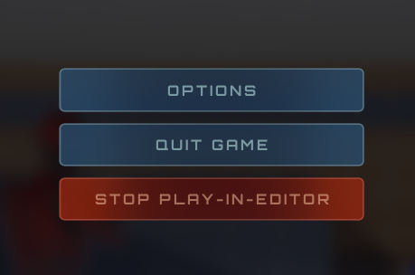

来源:

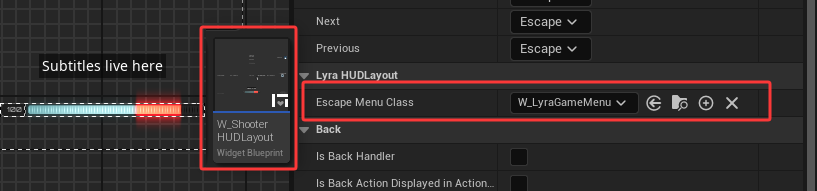

`W_ShooterHUDLayout` 的父类是 `ULyraHUDLayout`.

```cpp
UCLASS(/*...*/)
class ULyraHUDLayout : public ULyraActivatableWidget
{
public:
    void NativeOnInitialized() override;

protected:
	void HandleEscapeAction();

	UPROPERTY(EditDefaultsOnly)
	TSoftClassPtr<UCommonActivatableWidget> EscapeMenuClass;
}
```

---

`CommonUI` 按键绑定:<br>
如下图，将按键绑定到`GameplayTag`上.


在`NativeOnInitialized`中绑定`GameplayTag` 

```cpp
void ULyraHUDLayout::NativeOnInitialized()
{
	Super::NativeOnInitialized();

	RegisterUIActionBinding(FBindUIActionArgs(FUIActionTag::ConvertChecked(TAG_UI_ACTION_ESCAPE), false, FSimpleDelegate::CreateUObject(this, &ThisClass::HandleEscapeAction)));
}

void ULyraHUDLayout::HandleEscapeAction()
{
	if (ensure(!EscapeMenuClass.IsNull()))
	{
		UCommonUIExtensions::PushStreamedContentToLayer_ForPlayer(GetOwningLocalPlayer(), TAG_UI_LAYER_MENU, EscapeMenuClass);
	}
}
```
按下`ESC`键时，<br>
`HandleEscapeAction` 将 `EscapeMenuClass` 推送到 `Menu_Stack` 上面.

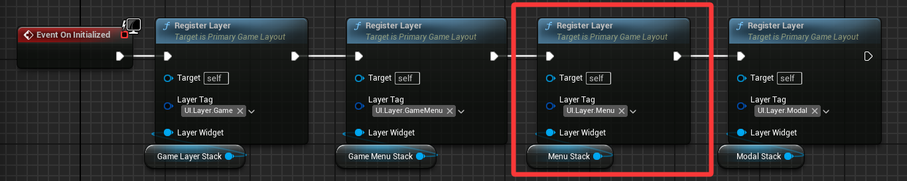

---

#### 退出选项

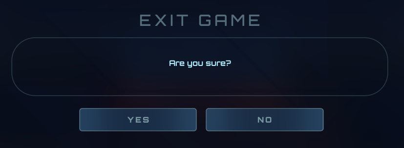

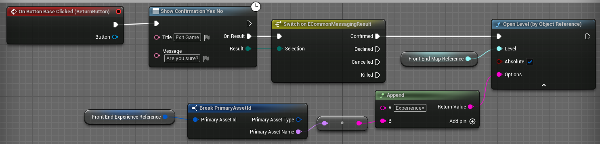

---

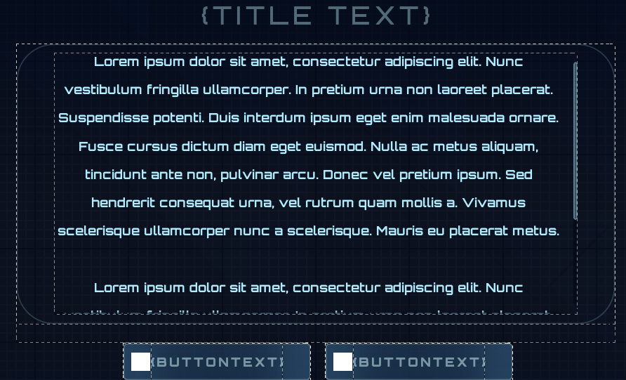

`W_ConfirmationDefault`

上图是一个UMG模板类，标题 内容 按钮名称 都要在创建时填写指定内容.<br>
`CommonUI`在推送一个UMG时，内部需要先创建UMG类，然后再添加到屏幕上.

在 创建 -- 添加 之间，提供了一个修改创建出来的UMG 的时机，<br>
```cpp
UCLASS(Abstract)
class COMMONUI_API UCommonActivatableWidgetContainerBase : public UWidget
{
    /**
    * 生成（创建或从非活动池中提取）指定控件类的实例并将其添加至容器。
    * 提供的lambda函数将在实例生成后、实际添加到容器前被调用。
    * 因此，若需在控件可能激活前进行初始化设置，应在该lambda函数中完成。
    */
    template <typename ActivatableWidgetT = UCommonActivatableWidget>
    ActivatableWidgetT AddWidget(TSubclassOf<UCommonActivatableWidget> ActivatableWidgetClass, TFunctionRef<void(ActivatableWidgetT&)> InstanceInitFunc)
}
```

`InstanceInitFunc` 就是修改UMG模版类的时机，在这里去填写 标题、内容、按钮名称.<br>


---

`ShowConfirmationYesNo` 先配置 `Descriptor` . 

```cpp
UAsyncAction_ShowConfirmation* UAsyncAction_ShowConfirmation::ShowConfirmationYesNo(UObject* InWorldContextObject, FText Title, FText Message)
{
	UAsyncAction_ShowConfirmation* Action = NewObject<UAsyncAction_ShowConfirmation>();
	Action->WorldContextObject = InWorldContextObject;
	Action->Descriptor = UCommonGameDialogDescriptor::CreateConfirmationYesNo(Title, Message);
	Action->RegisterWithGameInstance(InWorldContextObject);

	return Action;
}

/*------- Descriptor ---------*/

UCommonGameDialogDescriptor* UCommonGameDialogDescriptor::CreateConfirmationYesNo(const FText& Header, const FText& Body)
{
	UCommonGameDialogDescriptor* Descriptor = NewObject<UCommonGameDialogDescriptor>();
	Descriptor->Header = Header;
	Descriptor->Body = Body;

	FConfirmationDialogAction ConfirmAction;
	ConfirmAction.Result = ECommonMessagingResult::Confirmed;
	ConfirmAction.OptionalDisplayText = LOCTEXT("Yes", "Yes");

	FConfirmationDialogAction DeclineAction;
	DeclineAction.Result = ECommonMessagingResult::Declined;
	DeclineAction.OptionalDisplayText = LOCTEXT("No", "No");

	Descriptor->ButtonActions.Add(ConfirmAction);
	Descriptor->ButtonActions.Add(DeclineAction);

	return Descriptor;
}
```

`RegisterWithGameInstance` 让这个`AsyncAction`持久化，直到`SetReadyToDestroy`.

`CreateConfirmationYesNo` 配置描述的标题和内容， 重点在后面的 `ButtonActions`.<br>
`ButtonActions` 的作用是什么？ 如何使用？

```cpp
void UAsyncAction_ShowConfirmation::Activate()
{
    if (UCommonMessagingSubsystem* Messaging = TargetLocalPlayer->GetSubsystem<UCommonMessagingSubsystem>())
	{
		FCommonMessagingResultDelegate ResultCallback = FCommonMessagingResultDelegate::CreateUObject
        (
            this, &UAsyncAction_ShowConfirmation::HandleConfirmationResult
        );

		Messaging->ShowConfirmation(Descriptor, ResultCallback);

		return;
	}
}
```

`ShowConfirmation` 从`UGameUIManagerSubsystem`里面获得主界面布局的那个UMG.

`ConfirmationDialogClassPtr` 加载ini配置文件中指定的类.
```cpp
[/Script/LyraGame.LyraUIMessaging]
ConfirmationDialogClass=/Game/UI/Foundation/Dialogs/W_ConfirmationDefault.W_ConfirmationDefault_C
ErrorDialogClass=/Game/UI/Foundation/Dialogs/W_ConfirmationError.W_ConfirmationError_C

/* ------------- */
void ULyraUIMessaging::Initialize(FSubsystemCollectionBase& Collection)
{
	Super::Initialize(Collection);

	ConfirmationDialogClassPtr = ConfirmationDialogClass.LoadSynchronous();
	ErrorDialogClassPtr = ErrorDialogClass.LoadSynchronous();
}

void ULyraUIMessaging::ShowConfirmation(UCommonGameDialogDescriptor* DialogDescriptor, FCommonMessagingResultDelegate ResultCallback)
{
    /*...*/
	RootLayout->PushWidgetToLayerStack<UCommonGameDialog>(TAG_UI_LAYER_MODAL, ConfirmationDialogClassPtr, 
    [DialogDescriptor, ResultCallback](UCommonGameDialog& Dialog) 
    {
		Dialog.SetupDialog(DialogDescriptor, ResultCallback);
	});
}
```
创建UI并推送到`Modal_Stack`.

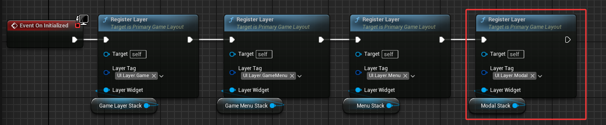

---

但是 在UI创建完成之后 推送之前，还要执行参数里面的Lambda函数.<br>
在Lambda函数中调用 `SetupDialog` 配置这个UI的数据.

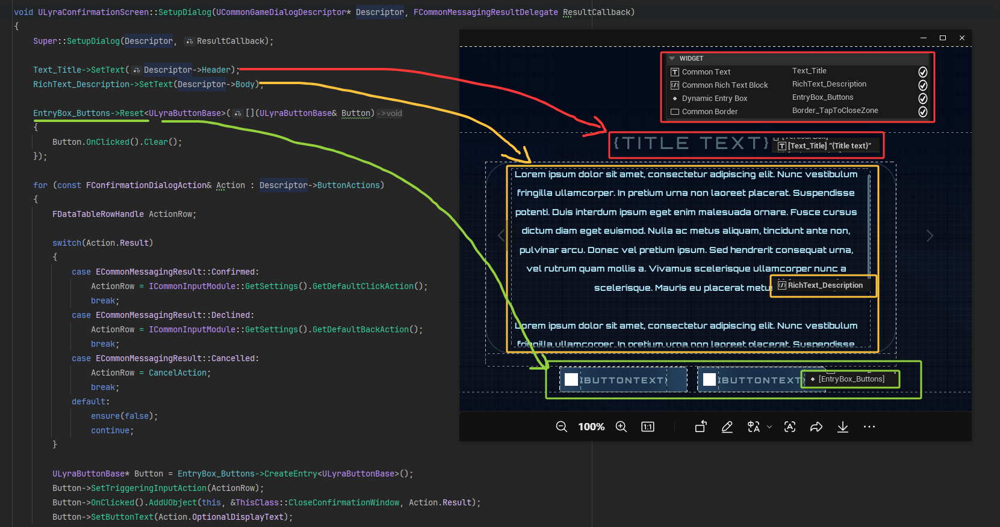

在`EntryBox_Buttons`添加按钮.

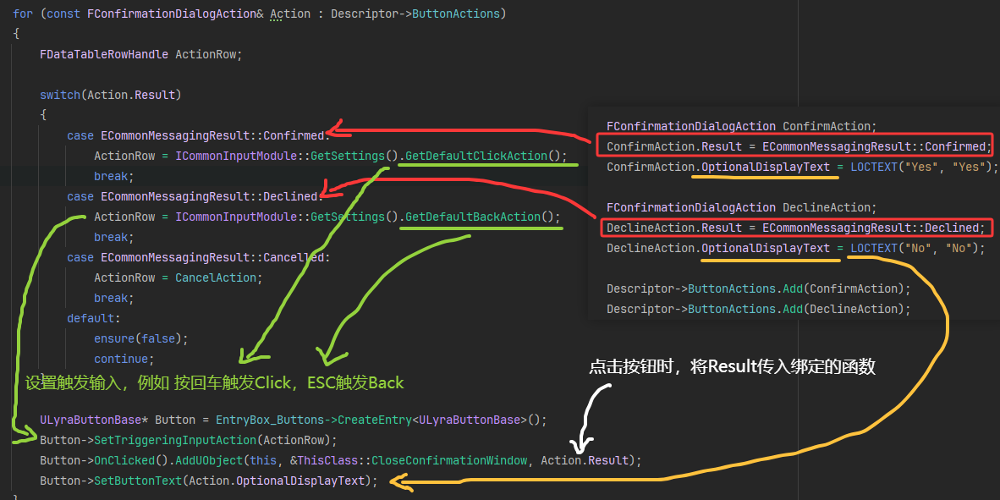

---
上面配置了UI的标题、内容，创建了按钮<br>
最后还要接收外面传来的回调函数，在点击按钮时 要触发这个函数，通知外部 按钮被点击了.
```cpp
void ULyraConfirmationScreen::SetupDialog(UCommonGameDialogDescriptor* Descriptor, FCommonMessagingResultDelegate ResultCallback)
{
    /*....*/
    OnResultCallback = ResultCallback;
}
```


点击按钮时，把`Result`广播出去.
```cpp
void ULyraConfirmationScreen::CloseConfirmationWindow(ECommonMessagingResult Result)
{
	DeactivateWidget();
	OnResultCallback.ExecuteIfBound(Result);
}
```

---

UI配置完成以后，推送到布局中.
```cpp
void ULyraUIMessaging::ShowConfirmation(UCommonGameDialogDescriptor* DialogDescriptor, FCommonMessagingResultDelegate ResultCallback)
{
    /*...*/
	RootLayout->PushWidgetToLayerStack<UCommonGameDialog>(TAG_UI_LAYER_MODAL, ConfirmationDialogClassPtr, 
    [DialogDescriptor, ResultCallback](UCommonGameDialog& Dialog) 
    {
		Dialog.SetupDialog(DialogDescriptor, ResultCallback);
	});
}
```
Lambda函数中的`ResultCallback`是外部传来的<br>
```cpp
void UAsyncAction_ShowConfirmation::Activate()
{
    FCommonMessagingResultDelegate ResultCallback = FCommonMessagingResultDelegate::CreateUObject(this, &UAsyncAction_ShowConfirmation::HandleConfirmationResult);
	Messaging->ShowConfirmation(Descriptor, ResultCallback);
}

void UAsyncAction_ShowConfirmation::HandleConfirmationResult(ECommonMessagingResult ConfirmationResult)
{
	OnResult.Broadcast(ConfirmationResult);

	SetReadyToDestroy();
}
```

点击按钮时，触发`HandleConfirmationResult`函数，接收按钮的`Action.Result`，并广播到蓝图中.

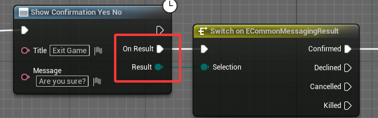

---


#### 设置面板

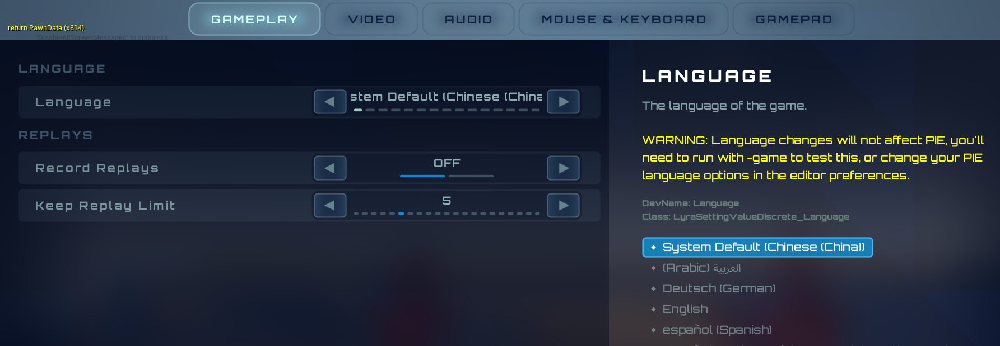


页面切换，点击上方标题栏中的按钮，切换选项卡.


