# Lyra - 2

## UI

### 主界面布局


`CommonActivatableWidgetStack` 可以容纳`CommonActivatableWidget`类型的UMG控件.<br>

---

先从宏观上来说<br>

`W_OverallUILayout` 提供一个层级关系.<br>
蓝图注释里面的 `其下方所有层级的界面仍会保持可见`，举个例子说明`其下方`是什么东西.<br>
上图中 `Modal_Stack`位于最上方，具体布局如下:
```cpp
Modal_Stack
Menu_Stack
GameMenu_Stack
GameLayer_Stack
```
再举个例子:<br>
`Image_0`在`Image_1`的下方.<br>
`Image_1`可以覆盖`Image_0`，


以上就是这些`X_Stack`的整体布局说明.

---

针对单独的`Stack`<br>

上面的蓝图注释中已经说明了，就是说 `Stack`只能同时显示一个UMG.<br>
下面举个例子.

向`GameLayer_Stack`添加一个控件，这个控件会被显示出来，没有问题.<br>
再向`GameLayer_Stack`添加一个控件，先前添加的控件会隐藏，显示后来添加的控件.<br>
直到后来 添加的控件 被取消，先前的控件才会显示出来.

例如: 在游戏主界面中，我要退出游戏，此时应该弹出一个窗口 问我是不是确认要退出.

`GameLayer_Stack` 首先显示一个`主界面`的UMG，<br>
当我点击`退出`按钮时,`GameLayer_Stack`会添加一个新的UMG，这个新的UMG问我是否要退出，并且给了`确认/取消`按钮.<br>

当`确认/取消`界面被添加时，`主界面`就会被停止显示，此时 整个屏幕只有 `确认/取消` 这个询问界面.<br>
如果我点击了`取消`，询问界面停止显示，`主界面`重新显示.

---

下面这些蓝图节点做了什么？


`RegisterLayer` 向一个TMap添加`GameplayTag`和`LayerWidget` :

```cpp
class UPrimaryGameLayout : public UCommonUserWidget
{
    // The registered layers for the primary layout.
	UPROPERTY(Transient, meta = (Categories = "UI.Layer"))
	TMap<FGameplayTag, TObjectPtr<UCommonActivatableWidgetContainerBase>> Layers;
}

/** Register a layer that widgets can be pushed onto. */
UFUNCTION(BlueprintCallable, Category="Layer")
void UPrimaryGameLayout::RegisterLayer(FGameplayTag LayerTag, UCommonActivatableWidgetContainerBase* LayerWidget)
{
	if (!IsDesignTime())
	{
        /*...*/
		Layers.Add(LayerTag, LayerWidget);
	}
}
```

`RegisterLayer` 传入`GameplayTag`和`LayerWidget`，把它们关联起来.<br>
一个`GameplayTag`对应一个`LayerWidget`.<br>
要往`Stack`里面添加UMG，只需要指定`GameplayTag`即可.

下图的功能是一样的，都是往`GameLayer_Stack`添加UMG控件.


---

上面搞了这么东西说明 `W_OverallUILayout` 设计巧妙的地方，<br>
但是它总归还是个UMG，那么这个UMG是如何添加到屏幕上的.


```cpp
UCLASS(Abstract, config = Game)
class UGameUIManagerSubsystem : public UGameInstanceSubsystem

UCLASS()
class ULyraUIManagerSubsystem : public UGameUIManagerSubsystem
```

`UGameInstanceSubsystem`是主要实现.


```cpp
class UGameUIManagerSubsystem : public UGameInstanceSubsystem
{
    virtual void Initialize(FSubsystemCollectionBase& Collection) override;

    UPROPERTY(Transient)
	TObjectPtr<UGameUIPolicy> CurrentPolicy = nullptr;

	UPROPERTY(config, EditAnywhere)
	TSoftClassPtr<UGameUIPolicy> DefaultUIPolicyClass;
}

void UGameUIManagerSubsystem::Initialize(FSubsystemCollectionBase& Collection)
{
	Super::Initialize(Collection);

	if (!CurrentPolicy && !DefaultUIPolicyClass.IsNull())
	{
		TSubclassOf<UGameUIPolicy> PolicyClass = DefaultUIPolicyClass.LoadSynchronous();
		SwitchToPolicy(NewObject<UGameUIPolicy>(this, PolicyClass));
	}
}
```

在初始化时，创建`DefaultUIPolicyClass`. 并保存在`CurrentPolicy`<br>

`DefaultUIPolicyClass` 指定为`B_LyraUIPolicy` :<br>

`Config/DefaultGame.ini`
```cpp
[/Script/LyraGame.LyraUIManagerSubsystem]
DefaultUIPolicyClass=/Game/UI/B_LyraUIPolicy.B_LyraUIPolicy_C
```

`B_LyraUIPolicy` 又指定了 `W_OverallUILayout`.


在添加一个玩家时，触发`UIManager` 的 `NotifyPlayerAdded` 函数.<br>
进而调用`CurrentPolicy`的`NotifyPlayerAdded`函数.

```cpp
int32 UCommonGameInstance::AddLocalPlayer(ULocalPlayer* NewPlayer, FPlatformUserId UserId)
{
	int32 ReturnVal = Super::AddLocalPlayer(NewPlayer, UserId);
	if (ReturnVal != INDEX_NONE)
	{
        /*...*/
		GetSubsystem<UGameUIManagerSubsystem>()->NotifyPlayerAdded(Cast<UCommonLocalPlayer>(NewPlayer));
	}
	
	return ReturnVal;
}

void UGameUIManagerSubsystem::NotifyPlayerAdded(UCommonLocalPlayer* LocalPlayer)
{
	if (ensure(LocalPlayer) && CurrentPolicy)
	{
		CurrentPolicy->NotifyPlayerAdded(LocalPlayer);
	}
}

void UGameUIPolicy::CreateLayoutWidget(UCommonLocalPlayer* LocalPlayer)
{
	if (APlayerController* PlayerController = LocalPlayer->GetPlayerController(GetWorld()))
	{
		TSubclassOf<UPrimaryGameLayout> LayoutWidgetClass = GetLayoutWidgetClass(LocalPlayer);
		if (ensure(LayoutWidgetClass && !LayoutWidgetClass->HasAnyClassFlags(CLASS_Abstract)))
		{
			UPrimaryGameLayout* NewLayoutObject = CreateWidget<UPrimaryGameLayout>(PlayerController, LayoutWidgetClass);
			RootViewportLayouts.Emplace(LocalPlayer, NewLayoutObject, true);
			
			AddLayoutToViewport(LocalPlayer, NewLayoutObject);
		}
	}
}
```
`CreateLayoutWidget` 中的 `LayoutWidgetClass` 就是在蓝图里面指定的 `W_OverallUILayout` .<br>
创建完了以后 将UMG保存在`RootViewportLayouts`中，然后添加到屏幕上 :

```cpp
void UGameUIPolicy::AddLayoutToViewport(UCommonLocalPlayer* LocalPlayer, UPrimaryGameLayout* Layout)
{
	UE_LOG(LogCommonGame, Log, TEXT("[%s] is adding player [%s]'s root layout [%s] to the viewport"), *GetName(), *GetNameSafe(LocalPlayer), *GetNameSafe(Layout));

	Layout->SetPlayerContext(FLocalPlayerContext(LocalPlayer));
	Layout->AddToPlayerScreen(1000);

	OnRootLayoutAddedToViewport(LocalPlayer, Layout);
}
```

总结一下整个链条:<br>
`UGameUIManagerSubsystem` --> `UGameUIPolicy` --> `RootViewportLayouts` <br>
最终通过Subsystem就可以获取创建的UMG.

---

### 添加游戏界面


这个界面通过`GameFeatureAction`添加到主界面布局中.


```cpp
void UGameFeatureAction_AddWidgets::AddWidgets(AActor* Actor, FPerContextData& ActiveData)
{
	ALyraHUD* HUD = CastChecked<ALyraHUD>(Actor);
    if (ULocalPlayer* LocalPlayer = Cast<ULocalPlayer>(HUD->GetOwningPlayerController()->Player))
	{
		FPerActorData& ActorData = ActiveData.ActorData.FindOrAdd(HUD);

		for (const FLyraHUDLayoutRequest& Entry : Layout)
		{
			if (TSubclassOf<UCommonActivatableWidget> ConcreteWidgetClass = Entry.LayoutClass.Get())
			{
				ActorData.LayoutsAdded.Add(UCommonUIExtensions::PushContentToLayer_ForPlayer(LocalPlayer, Entry.LayerID, ConcreteWidgetClass));
			}
		}
    }
}
```

`UCommonUIExtensions::PushContentToLayer_ForPlayer`<br>
通过`UGameUIManagerSubsystem`添加UI.

在之前 已经将`GameplayTag`和`Stack`关联起来 :


`UGameUIManagerSubsystem` --> `UGameUIPolicy` --> `RootViewportLayouts` <br>
通过`ULocalPlayer`获取`RootViewportLayouts`中保存的UMG.<br>
获取的UMG就是上图中 拥有`GameLayer_Stack`的那个UMG.
```cpp
UCommonActivatableWidget* UCommonUIExtensions::PushContentToLayer_ForPlayer(const ULocalPlayer* LocalPlayer, FGameplayTag LayerName, TSubclassOf<UCommonActivatableWidget> WidgetClass)
{
    /*...*/
    if (UPrimaryGameLayout* RootLayout = Policy->GetRootLayout(CastChecked<UCommonLocalPlayer>(LocalPlayer)))
    {
	    return RootLayout->PushWidgetToLayerStack(LayerName, WidgetClass);
    }
}
```

`PushWidgetToLayerStack` 根据传来的`GameplayTag` 寻找对应的`X_Stack`，
```cpp
template <typename ActivatableWidgetT = UCommonActivatableWidget>
ActivatableWidgetT* PushWidgetToLayerStack(FGameplayTag LayerName, UClass* ActivatableWidgetClass,/*...*/)
{
	if (UCommonActivatableWidgetContainerBase* Layer = GetLayerWidget(LayerName))
	{
		return Layer->AddWidget<ActivatableWidgetT>(ActivatableWidgetClass, InitInstanceFunc);
	}

	return nullptr;
}
```

至此，玩家的游戏界面就添加到屏幕上了.

---

### 添加小控件
你的这些设计固然很巧妙，但是游戏界面上没有武器UI 看不到子弹数量，右下角空空如也.

和前文的不一样，前文的界面是`GameFeatureAction` 通过 `GameplayTag` 寻找要添加的位置.<br>
这一块是以广播的方式来设置的，学会前文的思路 这一块可以不看.<br>

这一块的设计思路是 当有控件要添加到控件槽时 子系统会广播要往哪个`GameplayTag`的槽位添加控件.<br>
控件槽就监听这个事件，如果控件槽本身的`GameplayTag` 与 广播的`GameplayTag`一致，那就添加控件.

如下图:


---

```cpp
/**
 * 支持在设计时与运行时动态生成任意数量条目的控件基类。
 * 内含创建、构建及缓存大量条目控件所需的所有功能，但不对外暴露条目的创建或移除接口。
 * 具体填充方式由子类自行决定（某些子类可能完全内部处理而不对外暴露任何方法）
 *
 * @see UDynamicEntryBox 可直接使用的版本
 */
UCLASS(Abstract, MinimalAPI)
class UDynamicEntryBoxBase : public UWidget
```


```cpp
class UUIExtensionSubsystem : public UWorldSubsystem

/**
 * A slot that defines a location in a layout, where content can be added later
 */
UCLASS()
class UUIExtensionPointWidget : public UDynamicEntryBoxBase

TSharedRef<SWidget> UUIExtensionPointWidget::RebuildWidget()
{
	if (!IsDesignTime() && ExtensionPointTag.IsValid())
	{
		ResetExtensionPoint();
		RegisterExtensionPoint();
    }
}

void UUIExtensionPointWidget::RegisterExtensionPoint()
{
	if (UUIExtensionSubsystem* ExtensionSubsystem = GetWorld()->GetSubsystem<UUIExtensionSubsystem>())
	{
		TArray<UClass*> AllowedDataClasses;
		AllowedDataClasses.Add(UUserWidget::StaticClass());
		AllowedDataClasses.Append(DataClasses);

		ExtensionPointHandles.Add(ExtensionSubsystem->RegisterExtensionPoint(
			ExtensionPointTag, ExtensionPointTagMatch, AllowedDataClasses,
			FExtendExtensionPointDelegate::CreateUObject(this, &ThisClass::OnAddOrRemoveExtension)
		));
	}
}
```


如上图，扩展点配置一个`GameplayTag`，未来要根据Tag寻找扩展点.<br>
`RegisterExtensionPoint` 向 `UIExtensionSubsystem`注册扩展点.<br>

把`OnAddOrRemoveExtension`函数 绑定到扩展点的`Callback`中.<br>
当有UI要添加到这个扩展点时，执行`Callback`的函数，`OnAddOrRemoveExtension`

```cpp
FUIExtensionPointHandle UUIExtensionSubsystem::RegisterExtensionPointForContext(const FGameplayTag& ExtensionPointTag, UObject* ContextObject, EUIExtensionPointMatch ExtensionPointTagMatchType, const TArray<UClass*>& AllowedDataClasses, FExtendExtensionPointDelegate ExtensionCallback)
{
    FExtensionPointList& List = ExtensionPointMap.FindOrAdd(ExtensionPointTag);

    TSharedPtr<FUIExtensionPoint>& Entry = List.Add_GetRef(MakeShared<FUIExtensionPoint>());
	Entry->ExtensionPointTag = ExtensionPointTag;
	Entry->ContextObject = ContextObject;
	Entry->ExtensionPointTagMatchType = ExtensionPointTagMatchType;
	Entry->AllowedDataClasses = AllowedDataClasses;
	Entry->Callback = MoveTemp(ExtensionCallback);
}

typedef TArray<TSharedPtr<FUIExtensionPoint>> FExtensionPointList;
TMap<FGameplayTag, FExtensionPointList> ExtensionPointMap;
```

有UI要添加时，执行这个函数:<br>
`CreateEntryInternal`是父类`UDynamicEntryBoxBase`的函数，内部自动创建UI 并 添加到`EntryBox`自身内容中.<br>
之后 在`ExtensionMapping`里面保存一份.
```cpp
void UUIExtensionPointWidget::OnAddOrRemoveExtension(EUIExtensionAction Action, const FUIExtensionRequest& Request)
{
	if (Action == EUIExtensionAction::Added)
	{
		UObject* Data = Request.Data;
		
		TSubclassOf<UUserWidget> WidgetClass(Cast<UClass>(Data));
		if (WidgetClass)
		{
			UUserWidget* Widget = CreateEntryInternal(WidgetClass);
			ExtensionMapping.Add(Request.ExtensionHandle, Widget);
		}
    }
}
```

`ExtensionPointMap` 一个`GameplayTag`可以对应多个扩展点.<br>

`UUIExtensionSubsystem` :
```cpp
ExtensionPointMap
Key：FGameplayTag，表示扩展点的标签。
Value：FExtensionPointList，即TArray<TSharedPtr<FUIExtensionPoint>>，存储具有相同标签的扩展点列表。
作用：记录所有注册的扩展点，即那些希望接收扩展内容的位置（例如UUIExtensionPointWidget）。

ExtensionMap
Key：FGameplayTag，表示扩展的标签。
Value：FExtensionList，即TArray<TSharedPtr<FUIExtension>>，存储具有相同标签的扩展列表。
作用：记录所有注册的扩展，即那些希望被添加到扩展点的内容（例如UI控件）。
```

---

向扩展点添加一个`Widget` 的流程:

```cpp
void UGameFeatureAction_AddWidgets::AddWidgets(AActor* Actor, FPerContextData& ActiveData)
{
    UUIExtensionSubsystem* ExtensionSubsystem = HUD->GetWorld()->GetSubsystem<UUIExtensionSubsystem>();
	for (const FLyraHUDElementEntry& Entry : Widgets)
	{
		ActorData.ExtensionHandles.Add(ExtensionSubsystem->RegisterExtensionAsWidgetForContext
        (Entry.SlotID, LocalPlayer, Entry.WidgetClass.Get(), -1));
	}
}

FUIExtensionHandle UUIExtensionSubsystem::RegisterExtensionAsData(const FGameplayTag& ExtensionPointTag, UObject* ContextObject, UObject* Data, int32 Priority)
{
    FExtensionList& List = ExtensionMap.FindOrAdd(ExtensionPointTag);

	TSharedPtr<FUIExtension>& Entry = List.Add_GetRef(MakeShared<FUIExtension>());
	Entry->ExtensionPointTag = ExtensionPointTag;
	Entry->ContextObject = ContextObject;
	Entry->Data = Data;
	Entry->Priority = Priority;

    NotifyExtensionPointsOfExtension(EUIExtensionAction::Added, Entry);
}
```

`NotifyExtensionPointsOfExtension` 通过`GameplayTag` 去查找 `ExtensionPointMap` 里面对应的扩展点.<br>
找到对应的扩展点后，执行扩展点绑定的回调函数.

---

### ESC面板

按下 `ESC` 弹出选项面板


来源:


`W_ShooterHUDLayout` 的父类是 `ULyraHUDLayout`.

```cpp
UCLASS(/*...*/)
class ULyraHUDLayout : public ULyraActivatableWidget
{
public:
    void NativeOnInitialized() override;

protected:
	void HandleEscapeAction();

	UPROPERTY(EditDefaultsOnly)
	TSoftClassPtr<UCommonActivatableWidget> EscapeMenuClass;
}
```

---

`CommonUI` 按键绑定:<br>
如下图，将按键绑定到`GameplayTag`上.


在`NativeOnInitialized`中绑定`GameplayTag` 

```cpp
void ULyraHUDLayout::NativeOnInitialized()
{
	Super::NativeOnInitialized();

	RegisterUIActionBinding(FBindUIActionArgs(FUIActionTag::ConvertChecked(TAG_UI_ACTION_ESCAPE), false, FSimpleDelegate::CreateUObject(this, &ThisClass::HandleEscapeAction)));
}

void ULyraHUDLayout::HandleEscapeAction()
{
	if (ensure(!EscapeMenuClass.IsNull()))
	{
		UCommonUIExtensions::PushStreamedContentToLayer_ForPlayer(GetOwningLocalPlayer(), TAG_UI_LAYER_MENU, EscapeMenuClass);
	}
}
```
按下`ESC`键时，<br>
`HandleEscapeAction` 将 `EscapeMenuClass` 推送到 `Menu_Stack` 上面.


---

#### 退出选项


---


`W_ConfirmationDefault`

上图是一个UMG模板类，标题 内容 按钮名称 都要在创建时填写指定内容.<br>
`CommonUI`在推送一个UMG时，内部需要先创建UMG类，然后再添加到屏幕上.

在 创建 -- 添加 之间，提供了一个修改创建出来的UMG 的时机，<br>
```cpp
UCLASS(Abstract)
class COMMONUI_API UCommonActivatableWidgetContainerBase : public UWidget
{
    /**
    * 生成（创建或从非活动池中提取）指定控件类的实例并将其添加至容器。
    * 提供的lambda函数将在实例生成后、实际添加到容器前被调用。
    * 因此，若需在控件可能激活前进行初始化设置，应在该lambda函数中完成。
    */
    template <typename ActivatableWidgetT = UCommonActivatableWidget>
    ActivatableWidgetT AddWidget(TSubclassOf<UCommonActivatableWidget> ActivatableWidgetClass, TFunctionRef<void(ActivatableWidgetT&)> InstanceInitFunc)
}
```

`InstanceInitFunc` 就是修改UMG模版类的时机，在这里去填写 标题、内容、按钮名称.<br>


---

`ShowConfirmationYesNo` 先配置 `Descriptor` . 

```cpp
UAsyncAction_ShowConfirmation* UAsyncAction_ShowConfirmation::ShowConfirmationYesNo(UObject* InWorldContextObject, FText Title, FText Message)
{
	UAsyncAction_ShowConfirmation* Action = NewObject<UAsyncAction_ShowConfirmation>();
	Action->WorldContextObject = InWorldContextObject;
	Action->Descriptor = UCommonGameDialogDescriptor::CreateConfirmationYesNo(Title, Message);
	Action->RegisterWithGameInstance(InWorldContextObject);

	return Action;
}

/*------- Descriptor ---------*/

UCommonGameDialogDescriptor* UCommonGameDialogDescriptor::CreateConfirmationYesNo(const FText& Header, const FText& Body)
{
	UCommonGameDialogDescriptor* Descriptor = NewObject<UCommonGameDialogDescriptor>();
	Descriptor->Header = Header;
	Descriptor->Body = Body;

	FConfirmationDialogAction ConfirmAction;
	ConfirmAction.Result = ECommonMessagingResult::Confirmed;
	ConfirmAction.OptionalDisplayText = LOCTEXT("Yes", "Yes");

	FConfirmationDialogAction DeclineAction;
	DeclineAction.Result = ECommonMessagingResult::Declined;
	DeclineAction.OptionalDisplayText = LOCTEXT("No", "No");

	Descriptor->ButtonActions.Add(ConfirmAction);
	Descriptor->ButtonActions.Add(DeclineAction);

	return Descriptor;
}
```

`RegisterWithGameInstance` 让这个`AsyncAction`持久化，直到`SetReadyToDestroy`.

`CreateConfirmationYesNo` 配置描述的标题和内容， 重点在后面的 `ButtonActions`.<br>
`ButtonActions` 的作用是什么？ 如何使用？

```cpp
void UAsyncAction_ShowConfirmation::Activate()
{
    if (UCommonMessagingSubsystem* Messaging = TargetLocalPlayer->GetSubsystem<UCommonMessagingSubsystem>())
	{
		FCommonMessagingResultDelegate ResultCallback = FCommonMessagingResultDelegate::CreateUObject
        (
            this, &UAsyncAction_ShowConfirmation::HandleConfirmationResult
        );

		Messaging->ShowConfirmation(Descriptor, ResultCallback);

		return;
	}
}
```

`ShowConfirmation` 从`UGameUIManagerSubsystem`里面获得主界面布局的那个UMG.

`ConfirmationDialogClassPtr` 加载ini配置文件中指定的类.
```cpp
[/Script/LyraGame.LyraUIMessaging]
ConfirmationDialogClass=/Game/UI/Foundation/Dialogs/W_ConfirmationDefault.W_ConfirmationDefault_C
ErrorDialogClass=/Game/UI/Foundation/Dialogs/W_ConfirmationError.W_ConfirmationError_C

/* ------------- */
void ULyraUIMessaging::Initialize(FSubsystemCollectionBase& Collection)
{
	Super::Initialize(Collection);

	ConfirmationDialogClassPtr = ConfirmationDialogClass.LoadSynchronous();
	ErrorDialogClassPtr = ErrorDialogClass.LoadSynchronous();
}

void ULyraUIMessaging::ShowConfirmation(UCommonGameDialogDescriptor* DialogDescriptor, FCommonMessagingResultDelegate ResultCallback)
{
    /*...*/
	RootLayout->PushWidgetToLayerStack<UCommonGameDialog>(TAG_UI_LAYER_MODAL, ConfirmationDialogClassPtr, 
    [DialogDescriptor, ResultCallback](UCommonGameDialog& Dialog) 
    {
		Dialog.SetupDialog(DialogDescriptor, ResultCallback);
	});
}
```
创建UI并推送到`Modal_Stack`.


---

但是 在UI创建完成之后 推送之前，还要执行参数里面的Lambda函数.<br>
在Lambda函数中调用 `SetupDialog` 配置这个UI的数据.


在`EntryBox_Buttons`添加按钮.


---
上面配置了UI的标题、内容，创建了按钮<br>
最后还要接收外面传来的回调函数，在点击按钮时 要触发这个函数，通知外部 按钮被点击了.
```cpp
void ULyraConfirmationScreen::SetupDialog(UCommonGameDialogDescriptor* Descriptor, FCommonMessagingResultDelegate ResultCallback)
{
    /*....*/
    OnResultCallback = ResultCallback;
}
```


点击按钮时，把`Result`广播出去.
```cpp
void ULyraConfirmationScreen::CloseConfirmationWindow(ECommonMessagingResult Result)
{
	DeactivateWidget();
	OnResultCallback.ExecuteIfBound(Result);
}
```

---

UI配置完成以后，推送到布局中.
```cpp
void ULyraUIMessaging::ShowConfirmation(UCommonGameDialogDescriptor* DialogDescriptor, FCommonMessagingResultDelegate ResultCallback)
{
    /*...*/
	RootLayout->PushWidgetToLayerStack<UCommonGameDialog>(TAG_UI_LAYER_MODAL, ConfirmationDialogClassPtr, 
    [DialogDescriptor, ResultCallback](UCommonGameDialog& Dialog) 
    {
		Dialog.SetupDialog(DialogDescriptor, ResultCallback);
	});
}
```
Lambda函数中的`ResultCallback`是外部传来的<br>
```cpp
void UAsyncAction_ShowConfirmation::Activate()
{
    FCommonMessagingResultDelegate ResultCallback = FCommonMessagingResultDelegate::CreateUObject(this, &UAsyncAction_ShowConfirmation::HandleConfirmationResult);
	Messaging->ShowConfirmation(Descriptor, ResultCallback);
}

void UAsyncAction_ShowConfirmation::HandleConfirmationResult(ECommonMessagingResult ConfirmationResult)
{
	OnResult.Broadcast(ConfirmationResult);

	SetReadyToDestroy();
}
```

点击按钮时，触发`HandleConfirmationResult`函数，接收按钮的`Action.Result`，并广播到蓝图中.


---


### 设置面板


---

#### 选项卡

向选项栏添加按钮 : 

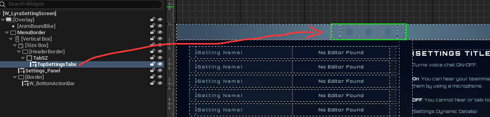

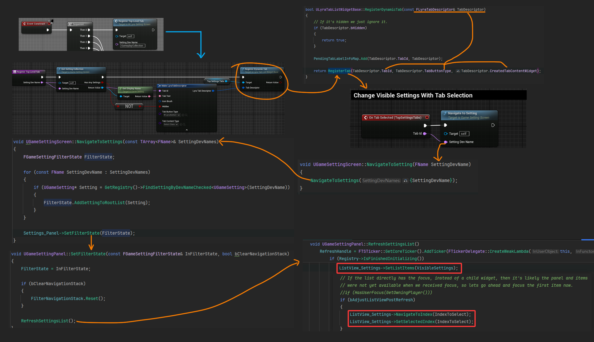

当选项栏中的按钮被点击时，获得按钮的`TabID`更新选项列表.

```cpp
UUserWidget& OnGenerateEntryWidgetInternal(UObject* Item, TSubclassOf<UUserWidget> DesiredEntryClass, const TSharedRef<STableViewBase>& OwnerTable)
```
`UGameSettingListView`重写了列表更新行为，根据传进来的`UObject` 选择对应的UI控件<br>
函数参数中的`UObject* Item`就是在上图中的代码传进来的:<br>
```cpp
ListView_Settings->SetListItems(VisibleSettings);
```
`OnGenerateEntryWidgetInternal` :

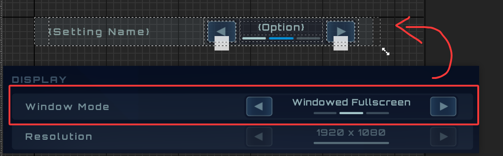

---

#### 详细列表

提前说明整个设计思路：<br>
点开设置面板，显示出来的这些选项都是分了组的，<br>
例如下面的分组有 `Language`、`Replays`.

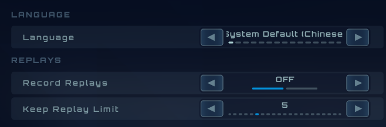

它虽然需要分组，但是最后在UMG列表里面呈现，<br>
在列表看来 就是一堆控件而已 ，根本不存在什么分组.<br>
要显示`Language`这个组名，那就把这个控件传给我好了，<br>
要显示`Record Replays`选项，那还是把控件传给我.

要描述上图这个界面，可以这样说:<br>
这个界面里有2组选项，第一组里面只有1个选项，第二组里面有2个选项.<br>
这2个组 共同构成了整个界面.

那么在代码上 如何设计？<br>
我可以创建一个类 作为整个界面，这个界面类里面 存了若干个组类，每个组下面 又存了若干个选项类.<br>
实际上就是在套娃，在设计时 用套娃的代码写法 来描述一个界面.<br>
就像:
```cpp
UMyWidget* CreateScreen()
{
	/* 整个界面 */
	UMyWidget* MyScreen = NewObect<UMyWidget>();
	
	/*创建第一组，添加到Screen*/
	UMyWidget* MyGroup1 = NewObect<UMyWidget>();
	MyScreen->Add(MyGroup);

	/* 第一组里面的选项 */
	UMyWidget* MySelect = NewObect<UMyWidget>();
	MyGroup1->Add(Myselect);

	UMyWidget* MySelect2 = NewObect<UMyWidget>();
	MyGroup1->Add(Myselect2);
	
	/* 第二组 */
	UMyWidget* MyGroup2 = NewObect<UMyWidget>();
	MyScreen->Add(MyGroup2);

	return MyScreen;
}
```

但是最终在UMG的列表中显示时，就得把整个界面拆开来，因为列表只要控件，它不关心这些设计好的层级.<br>
所以在最后构造UMG时，需要把界面中的所有选项 都提取出来，这时候就不存在组了，也可以说是 解组.<br>

为了方便在代码里描述界面，我可以通过代码 将这些选项打组，不同类型的选项 在不同的组里面.<br>
但是在UMG渲染时，要解组.

---

【未来的我 - 在写完这一段设计思路的半个小时之后】 <br>
既然最后要解组，那为什么前面还要费劲去打组 解组？<br>
在代码里直接按照渲染顺序从上到下去写不就行了? 到后面还不用解组.<br>

还有，为什么不用蓝图来做，在代码里绕来绕去 套来套去.<br>
(不理解，但尊重)

---

先说明`分组标题`的构造方法

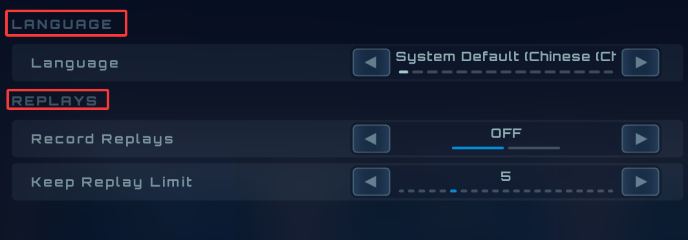

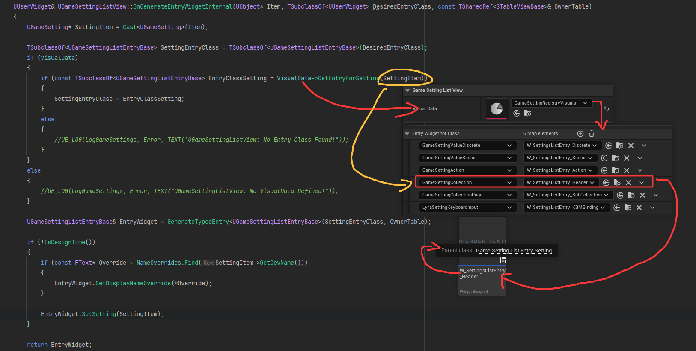

`OnGenerateEntryWidgetInternal` 根据传来的`UObject* Item`类型，选择对应的UMG控件类，创建控件并添加到列表中.<br>
最后调用`EntryWidget.SettingItem`. 把`UObject* Item`传到创建的UMG控件.

前文中 `分组标题` 的控件是`W_SettingsListEntry_Header` ，父类是`UGameSettingListEntry_Setting`.

`UGameSettingListEntry_Setting` 重写了`SetSetting`，并且有一个必须绑定的`Text_SettingName`<br>
`Text_SettingName`在蓝图中绑定文本框，在代码层面就可以操控这个文本框.

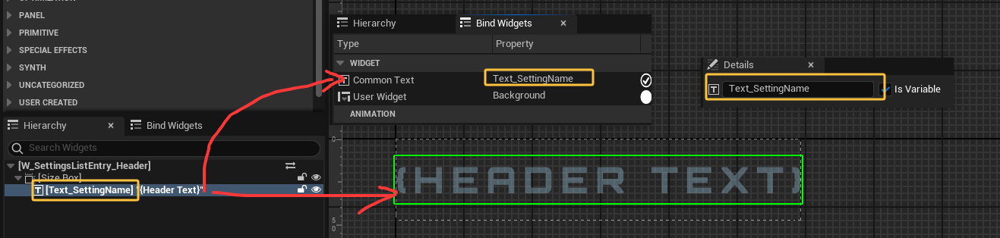

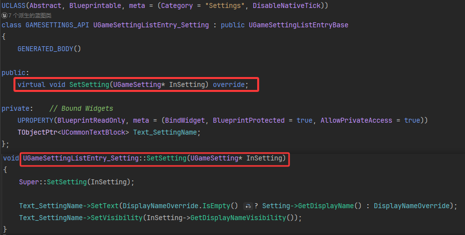

使用`UGameSetting`里面的数据 设置`Text_SettingName`.

---

#### 构造过程

问题来了，前文中的 `SetSetting`接收`UGameSetting`，里面存放了分组的名称， 那么这个分组信息是在哪创建的？

要追踪源头，就得去看切换选项卡的时候 发生了什么， 例如 切换到`Game`或者`Video`选项时，列表会显示不同的设置.<br>
回到梦开始的地方，分析点下`Audio`时 发生的事情，分析如何更新下面的列表数据的来源.


这次要看到代码是上图中的一部分:

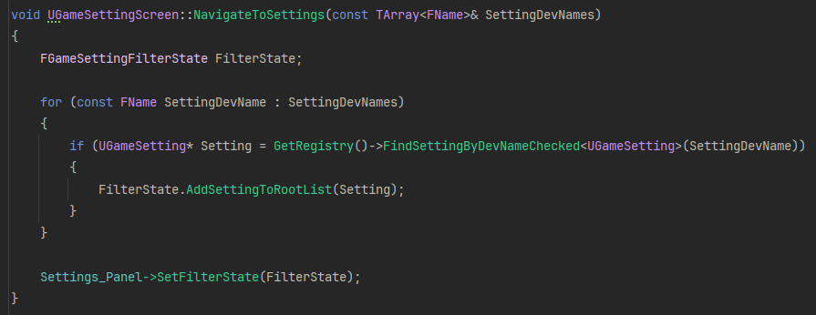


```cpp
GetRegistry
⬇
GetOrCreateRegistry
```

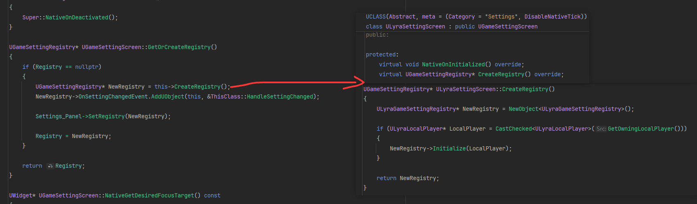


最后创建的 `Registry` 是 `ULyraGameSettingRegistry`类，

创建完以后 传给`Settings_Panel`
```cpp
UGameSettingRegistry* UGameSettingScreen::GetOrCreateRegistry()
{
	/*...*/
	Settings_Panel->SetRegistry(NewRegistry);
	/*...*/
}
```

`Settings_Panel`就是那个列表:

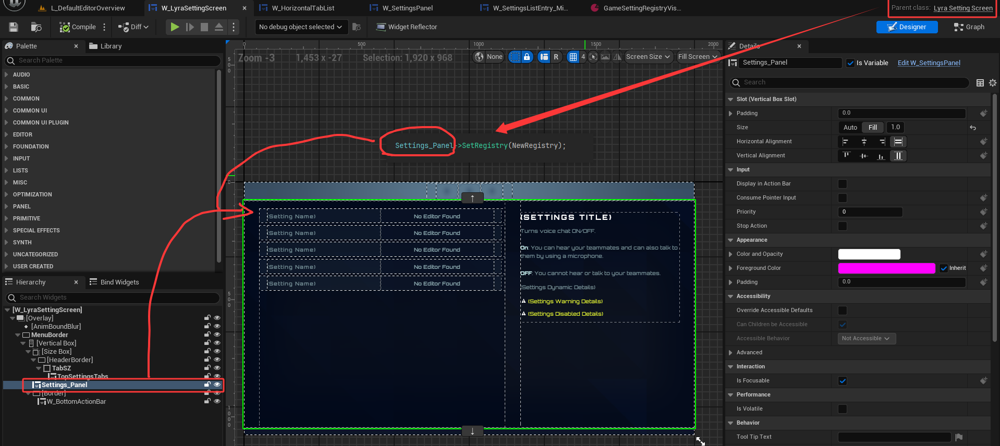

---
```cpp
UGameSettingRegistry* ULyraSettingScreen::CreateRegistry()
{
	ULyraGameSettingRegistry* NewRegistry = NewObject<ULyraGameSettingRegistry>();

	if (ULyraLocalPlayer* LocalPlayer = CastChecked<ULyraLocalPlayer>(GetOwningLocalPlayer()))
	{
		NewRegistry->Initialize(LocalPlayer);
	}

	return NewRegistry;
}
```
前面提到`ULyraGameSettingRegistry`类， 下面分析这个类做了什么事情.<br>
这个类的构造函数是空的，主要是通过`Initialize`来初始化内容.


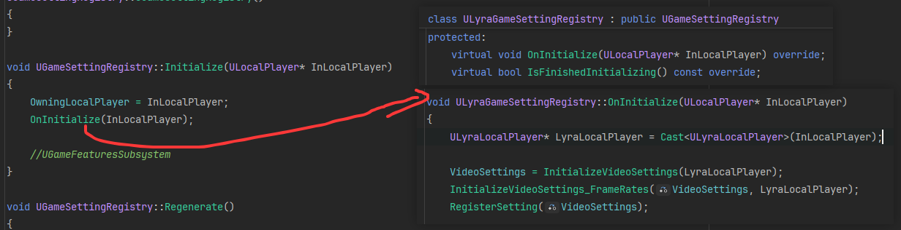


先初始化的是`VideoSettings`，那就通过`VideoSettings`来说明过程吧.


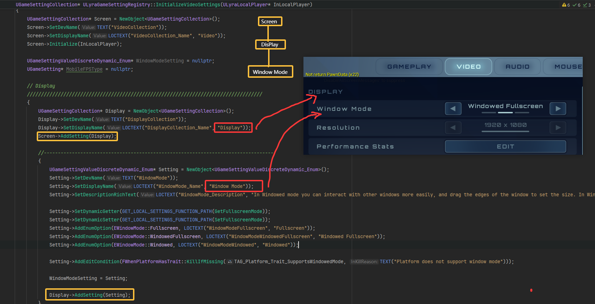


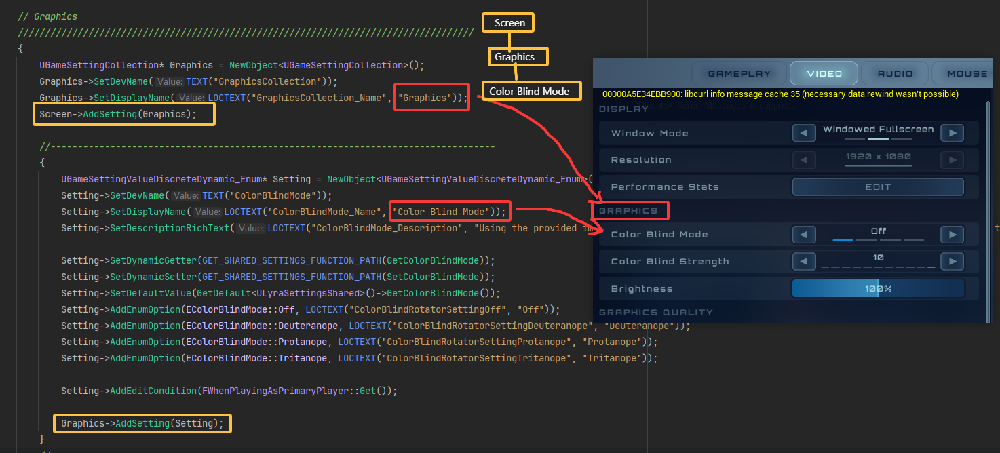

设置面板的列表 以分组形式呈现.<br>
`Screen` 下面有 `Display` `Graphics` 这些选项组.<br>
每一组的下面才是具体的选项.

添加一个新的选项:

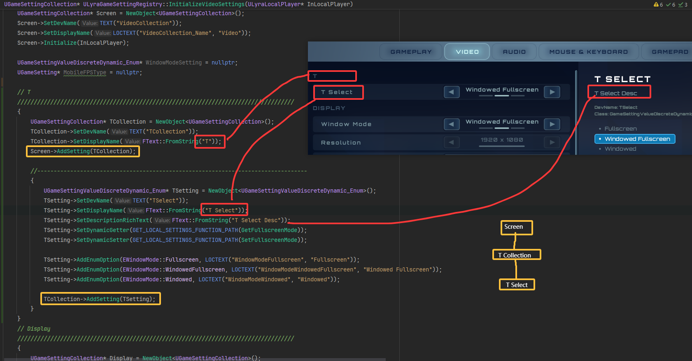

---

前文在 `InitializeVideoSettings` 中创建了 `Screen` ，`Screen`下面有 `Display` `Graphics` 这些组<br>
这个函数最终返回了整个`Screen`.
```cpp
UGameSettingCollection* ULyraGameSettingRegistry::InitializeVideoSettings(ULyraLocalPlayer* InLocalPlayer)
{
	UGameSettingCollection* Screen = NewObject<UGameSettingCollection>();
	/* 向Screen添加选项组 */
	/* 向每个选项组添加具体的设置选项 */

	return Screen;
}
```

在创建`Screen`选项后 要把整个`Screen`选项组添加到`RegisteredSettings`中.<br>

```cpp
void ULyraGameSettingRegistry::OnInitialize(ULocalPlayer* InLocalPlayer)
{
	ULyraLocalPlayer* LyraLocalPlayer = Cast<ULyraLocalPlayer>(InLocalPlayer);

	VideoSettings = InitializeVideoSettings(LyraLocalPlayer);
	RegisterSetting(VideoSettings);

	AudioSettings = /*..*/
	RegisterSetting(AudioSettings);
}

void UGameSettingRegistry::RegisterSetting(UGameSetting* InSetting)
{
	if (InSetting)
	{
		TopLevelSettings.Add(InSetting);
		InSetting->SetRegistry(this);
		RegisterInnerSettings(InSetting);
	}
}

void UGameSettingRegistry::RegisterInnerSettings(UGameSetting* InSetting)
{
	RegisteredSettings.Add(InSetting);
}
```
`RegisteredSettings` 此时保存了 Video 的 `Screen`，Audio 的 `Screen`...

---

如果我点击了`Video`选项卡，列表中应该显示关于`Video`的选项.<br>
那么它如何找到 `Video` 的 `Screen` ？ (用`Gameplay`选项演示)


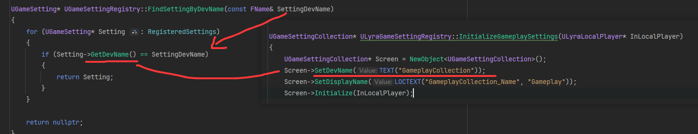

遍历`RegisteredSettings`，逐个查询名称.

找到之后，添加到过滤中，将过滤器传给设置列表 用来刷新选项.
```cpp
void UGameSettingScreen::NavigateToSettings(const TArray<FName>& SettingDevNames)
{
	FGameSettingFilterState FilterState;

	for (const FName SettingDevName : SettingDevNames)
	{
		if (UGameSetting* Setting = GetRegistry()->FindSettingByDevNameChecked<UGameSetting>(SettingDevName))
		{
			FilterState.AddSettingToRootList(Setting);
		}
	}
	
	Settings_Panel->SetFilterState(FilterState);
}


void UGameSettingPanel::SetFilterState(const FGameSettingFilterState& InFilterState, bool bClearNavigationStack)
{
	FilterState = InFilterState;

	if (bClearNavigationStack)
	{
		FilterNavigationStack.Reset();
	}

	RefreshSettingsList();
}
```

列表刷新过程:
```cpp
void UGameSettingPanel::RefreshSettingsList()
{
	VisibleSettings.Reset();
	Registry->GetSettingsForFilter(FilterState, MutableView(VisibleSettings));

	ListView_Settings->SetListItems(VisibleSettings);
}`
```
关键： `TArray<TObjectPtr<UGameSetting>> VisibleSettings;`

`UGameSettingScreen::NavigateToSettings` 在这个函数中，将整个`Screen`都添加到了`FilterState`中.<br>
`UGameSettingPanel::SetFilterState` 保存传进来的 `FilterState` .<br>
`GetSettingsForFilter` 分解`FilterState`保存的整个`Screen`的组，将各个组的内容提取出来，保存在`VisibleSettings`.

`VisibleSettings` 保存的内容 :

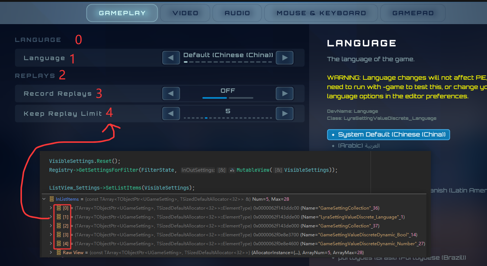

最后将整个数组传入`SetListItems`.

关于 `ListView_Settings` :
```cpp
UPROPERTY(/*...*/)
TObjectPtr<UGameSettingListView> ListView_Settings;
```

`UGameSettingListView` 重写了构造行为， 当接收到`VisibleSettings`的内容后，也就是上图中的`0 1 2 3 4` 这些内容.<br>
```cpp
ListView_Settings->SetListItems(VisibleSettings);
```

`UGameSettingListView::OnGenerateEntryWidgetInternal` 将接收到的`UObject`还原为`UGameSetting`.<br>
接着 查表，不同的`UGameSetting`设置选项 对应不同的UMG控件类.

查表过程:


不同的设置选项，使用不同的UMG控件:


`OnGenerateEntryWidgetInternal` 在最后阶段将`UGameSetting`传给了创建出来的控件.

```cpp
UUserWidget& UGameSettingListView::OnGenerateEntryWidgetInternal(UObject* Item, TSubclassOf<UUserWidget> DesiredEntryClass, const TSharedRef<STableViewBase>& OwnerTable)
{
	UGameSetting* SettingItem = Cast<UGameSetting>(Item);
	EntryWidget.SetSetting(SettingItem);
}
```
这里的`EntryWidget`是通过查表创建得来的，`EntryWidget`可以是下图中的任何一个类.

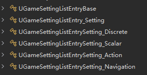

不同的设置都有不同的显示方法，<br>
而这些类就可以通过重写`SetSetting`函数，以实现根据不同的`UGameSetting`显示不同的UI.

就如上图中的UI界面，`Language`要设置不同的语言，那我就给你绘制一个可以选来选去的控件.<br>
`Record Replays`是一个开关，那我就给你绘制一个只能在`OFF`和`NO`之间切换到控件.<br>


---


#### GameSetting

以上只是UI创建显示的过程，还没有分析实际的按钮功能.


