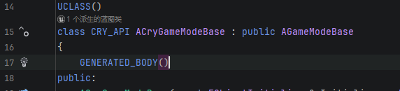
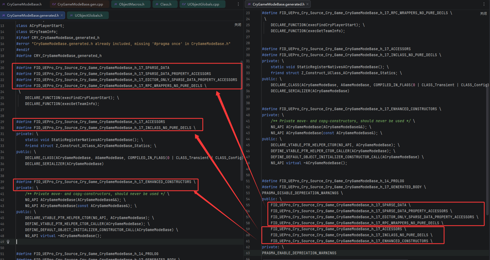
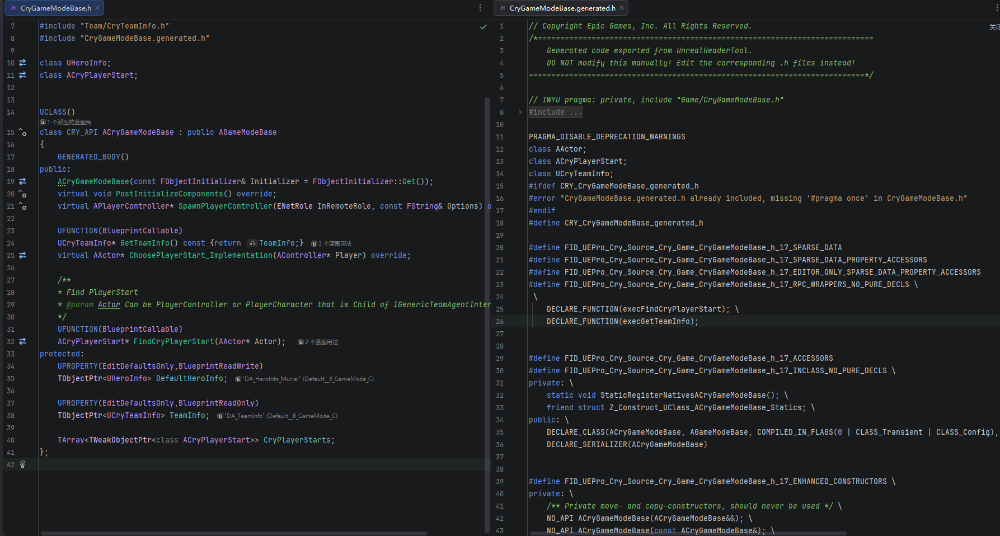
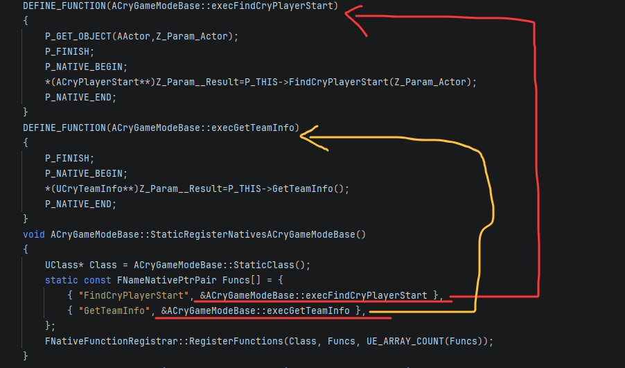
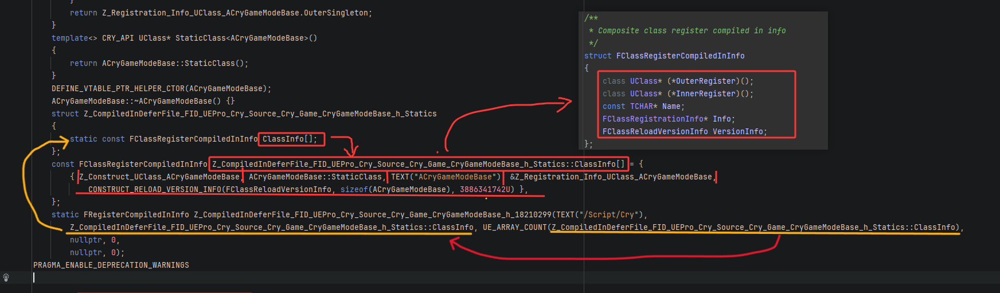
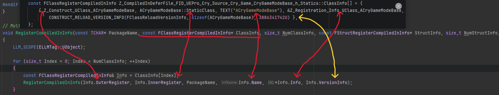
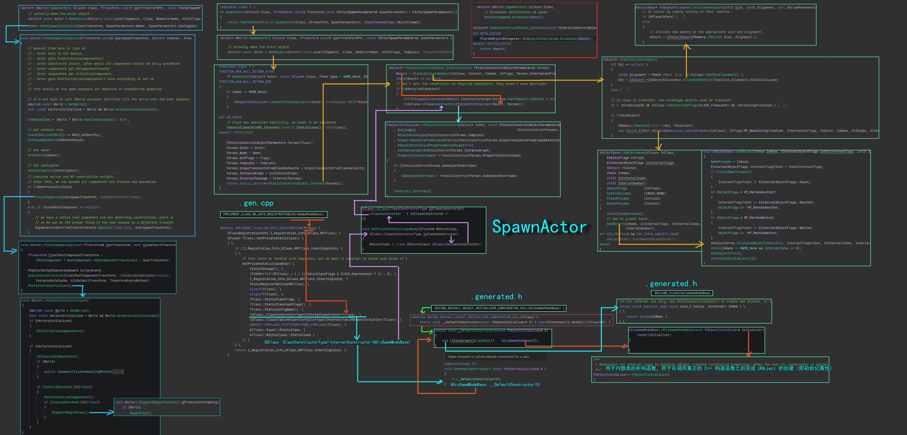
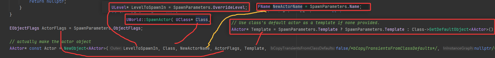
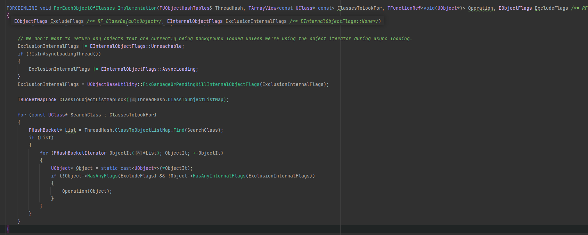

# C++


## ?


### 投影

在 `C++20` 的范围算法中，投影允许在操作元素之前对它们进行变换.<br>
例如，对一个自定义对象数组按某个成员排序时，<br>
可以直接传递该成员的`投影`(如 `&Person::age`)，而不必显式编写比较函数.<br>
投影可以是函数、函数对象或成员指针.

假设有一个 `Person` 结构体，希望按年龄排序.<br>
传统方式需要提供一个比较函数或 lambda：

```cpp
struct Person 
{
    std::string name;
    int age;
};

std::vector<Person> people = {{"Alice", 30}, {"Bob", 25}, {"Charlie", 35}};

// 传统方式：需要写 lambda 比较年龄
std::sort(people.begin(), people.end(),
    [](const Person& a, const Person& b) 
    {
        return a.age < b.age;
    });
```

---

使用 `C++20` 范围算法和投影，可以直接传递成员指针作为投影，配合默认的 `std::ranges::less` 比较器：
```cpp
#include <ranges>
#include <algorithm>

std::ranges::sort(people, std::ranges::less{}, &Person::age);
```

第一个参数是范围(people)<br>
第二个参数是比较器(这里使用默认的 less，可以省略)<br>
第三个参数是投影 `&Person::age`，算法会对每个 Person 对象提取 age 进行比较.<br>

如果要从 `people` 中查找第一个年龄大于等于 30 的人:
```cpp
// 传统方式：写 lambda
auto it = std::find_if(people.begin(), people.end(),
    [](const Person& p) { return p.age >= 30; });

// 使用投影 + 普通函数对象
auto it = std::ranges::find_if(people,
    [](int age) { return age >= 30; },
    &Person::age);
```

算法提取 `age` 的步骤:<br>
迭代器解引用：<br>
算法遍历范围时，会对迭代器 `it` 进行解引用，得到当前元素(例如 `Person` 对象)的引用.<br>

应用投影：<br>
算法将解引用后的值(即 `*it`)作为参数传递给投影函数 `proj`.<br>
由于 `proj` 是成员指针类型，`std::invoke(proj, *it)` 会被调用.<br>

对于数据成员指针 `&Person::age`，`std::invoke` 会将其解释为“提取对象的 `age` 成员”，返回该成员的引用(或值，取决于上下文).<br>

---

`指向数据成员的指针`(如 `&Person::age`)是一种特殊的类型，<br>
它本身并不是一个`可调用对象`，但可以与对象实例结合，<br>
通过成员访问运算符(`.*` 或 `->*`)来访问该成员的引用.<br>

`std::invoke` 的设计目标正是为了统一处理所有可调用类型，使得泛型代码可以一致地调用它们.<br>
根据 C++ 标准，`std::invoke` 对于指向成员的指针有如下定义：<br>
如果 `f` 是指向类的数据成员指针，且 `t1` 是某个对象(或引用)，<br>
则 `std::invoke(f, t1)` 等价于 `t1.*f`，<br>
其结果是对该成员的左值引用(如果 `t1` 是左值)或右值引用(如果 `t1` 是将亡值).

如果 `t1` 是指针，则等价于 `(*t1).*f` 或` t1->*f`(取决于具体重载).

```cpp
struct Person { int age; };
Person alice{30};

auto pm = &Person::age;  // 数据成员指针

// 直接使用成员访问运算符
int& ref = alice.*pm;  // ref 是 alice.age 的引用

// 使用 std::invoke
int& ref2 = std::invoke(pm, alice);  // 等价于 alice.*pm
```

---


使用投影结果：<br>
算法将投影返回的值用于后续操作(如比较、查找等).<br>
例如在排序中，比较器会比较两个投影后的结果.
```cpp
namespace ranges 
{
    template<input_iterator I, sentinel_for<I> S,
             typename Comp = ranges::less, typename Proj = identity>
    requires sortable<projected<I, Proj>, Comp>  // 概念约束
    I sort(I first, S last, Comp comp = {}, Proj proj = {}) {
        // ... 排序逻辑
        // 在需要比较两个元素时：
        if (std::invoke(comp,
                        std::invoke(proj, *it1),
                        std::invoke(proj, *it2))) {
            // ...
        }
        // ...
    }
}
```
当 `proj` 是 `&Person::age` 时，<br>
`std::invoke(proj, *it)` 等价于 `(*it).*proj`(即 `(*it).age`)，返回 `age` 成员.<br>

比较器 `comp` 默认是 `std::ranges::less`，<br>
它会对两个投影结果调用 `operator<`，从而实现按年龄排序.


---

**统计年龄总和**
```cpp
// 传统方式：手动累加
int total = 0;
for (const auto& p : people) total += p.age;

// 使用投影 + std::ranges::fold_left (C++23)
int total = std::ranges::fold_left(people | std::views::transform(&Person::age), 0, std::plus{});

// 或者直接使用投影版本：
int total = std::ranges::fold_left(people, 0, std::plus{}, &Person::age);
```

**找出年龄最大的人**
```cpp
// 传统方式
auto oldest = std::max_element(people.begin(), people.end(),
    [](const Person& a, const Person& b) {
    return a.age < b.age;
});

// 使用投影
auto oldest = std::ranges::max_element(people, std::ranges::less{}, &Person::age);

// 或简写
auto oldest = std::ranges::max_element(people, {}, &Person::age);
```

**对容器进行变换后操作**<br>
有时需要先对元素进行某种处理(如获取字符串的长度)，然后再进行比较或查找.
```cpp
std::vector<std::string> words = {"apple", "banana", "cherry"};

// 按字符串长度排序
std::ranges::sort(words, {}, &std::string::size);
```
这里 `&std::string::size` 是一个成员函数指针，<br>
算法会调用每个字符串的 `size()` 成员函数，将返回值用于比较.<br>
这种用法同样适用于成员函数指针.


---
### DeclVal
`Source/Runtime/Core/Public/Templates/UnrealTemplate.h`

```cpp
template <typename T>
T&& DeclVal();
```

`DeclVal<T>()` 是一个只有声明、没有定义的函数模板，用于在编译期的不求值上下文(unevaluated context)中“产生”一个类型为 `T&&` 的值.它是对 C++ 标准库 `std::declval` 的等效实现.

在不实际构造对象的情况下，获得一个类型为 `T&&` 的表达式，以便进行类型推导、`decltype` `计算、sizeof` 运算等编译期操作.<br>

常用于模板元编程中，例如实现类型特征(traits)、检测成员函数是否存在、推导表达式返回类型等.

在模板元编程中，经常需要推断某个表达式的类型，<br>
例如:<br>
```cpp
decltype( T() + U() )   // 如果 T 或 U 没有默认构造函数，则编译错误
```
如果 `T` 没有默认构造函数，`T()` 非法.<br>
此时仍想在不创建对象的情况下知道 `T + U` 的结果类型.<br>

`DeclVal<T>()` 解决了这个问题：它虽然“返回”一个 `T&&`，<br>
但函数没有实现，因此只能在 `decltype`、`sizeof` 等不求值上下文中使用.<br>
编译器只关心它的类型，不会实际调用函数，从而绕过了构造限制.


类似地，检测一个类型是否有某个成员函数：
```cpp
decltype( DeclVal<T>().size() )   
// 如果 T 有 size() 成员，则此表达式类型合法，否则 SFINAE 失败
```

因此，`DeclVal` 是模板元编程的基石之一，可以在类型系统内“模拟”一个值，而不必关心该类型是否可默认构造、可拷贝等.

---

只能用于不求值上下文(如 `decltype、sizeof、noexcept、typeid` 等)，<br>
如果尝试在运行时调用(例如 `DeclVal<int>()` 作为函数调用)，会导致链接错误(函数未定义).

返回类型是 `T&&`，这可以保留值类别信息，并且对不可默认构造的类型也有效(因为右值引用可以绑定到临时对象，但这里并不真正创建对象).

---

```cpp
// 推导两个类型相加的结果
template <typename T, typename U>
using AddResult = decltype(DeclVal<T>() + DeclVal<U>());
// AddResult<int, double> 为 double
```

---

### Decay
`Source/Runtime/Core/Public/Templates/Decay.h`

模拟在函数参数传递时发生的隐式类型转换规则.<br>
它的主要作用是将一个给定的类型 `T` 转换为按值传递时的对应类型.

去除引用：如果 `T` 是左值引用(`U&`)或右值引用(`U&&`)，则先移除引用，得到 `U`.<br>
数组到指针转换：如果 `U` 是数组类型(例如 `U[N]` 或 `U[]`)，则退化为指向其元素类型的指针 `U*`.<br>
函数到指针转换：如果 `U` 是函数类型(例如 `R(Args...)`)，则退化为指向该函数的指针 `R(*)(Args...)`.<br>
去除 `cv` 限定：最后，移除结果类型的顶层 `cv` 限定符(即 `const、volatile`).

模板元编程：当需要获取一个类型的“值版本”时(例如从引用或 cv 限定类型中提取出基本类型)，`std::decay` 非常有用.<br>
完美转发：在实现转发函数时，有时需要知道参数经过转发后的实际类型.<br>
与标准库组件配合：例如 `std::thread`、`std::bind` 等会按值存储参数，它们内部会使用 `std::decay` 来处理传递的类型.<br>


---
### Forward

在模板函数中，如果想将参数原封不动地转发给另一个函数，需要保留参数的值类别(左值还是右值).<br>
如果直接传递参数，可能会丢失右值属性，导致无法调用移动构造函数等.<br>
C++11 引入了`引用折叠规则`和 `std::forward` 来解决这个问题.

`std::forward<T>(obj)` 的行为：<br>
如果 `T` 是左值引用类型(如 `int&`)，则返回左值引用.<br>
如果 `T` 是非引用类型或右值引用类型(如 `int` 或 `int&&`)，则返回右值引用.<br>

`Unreal` 的 `Forward` 实现了相同的逻辑.

提供了两个重载，分别处理左值和右值输入：
```cpp
// 版本1：接受左值引用(通过 remove_reference 后的类型的左值引用)
template <typename T>
FORCEINLINE T&& Forward(typename TRemoveReference<T>::Type& Obj)
{
    return (T&&)Obj;
}

// 版本2：接受右值引用(通过 remove_reference 后的类型的右值引用)
template <typename T>
FORCEINLINE T&& Forward(typename TRemoveReference<T>::Type&& Obj)
{
    return (T&&)Obj;
}
```

两个版本的参数类型都使用了 `TRemoveReference<T>::Type`(即去掉引用后的原始类型).<br>
这样做是为了确保参数类型不依赖于 `T` 的引用性质，使得两个重载能够正确区分左值和右值输入.

返回类型都是 `T&&`，通过强制转换将 `Obj` 转换为 `T&&`，然后根据 `T` 的引用折叠规则决定最终的返回值类型.

---
#### 引用折叠

`引用折叠`是 C++ 中一条重要的类型规则，它描述了当出现`引用的引用`时，最终的类型如何被确定.<br>
这条规则在模板编程、完美转发以及通用引用(universal reference，也称转发引用)中起着核心作用.

通常情况下，不能直接声明一个引用的引用，例如：
```cpp
int a = 5;
int& & ref = a; // 错误：不能声明引用的引用
```
但在类型别名、模板参数推导或 decltype 等场景中，可能会间接产生引用的引用.<br>
例如：
```cpp
template <typename T>
void func(T&& param); // param 是转发引用

int x = 0;
func(x);  // T 被推导为 int&，此时 T&& 就成了 int& &&(引用的引用)
```

`x`是左值，`T` 推导为 `int&`，`T&&` 就变成了 `int& &&`.

这时就需要引用折叠规则来决定 `int& &&` 最终是什么类型.

---

在 C++ 中，当出现 T&& 且 T 本身是引用类型时，会发生引用折叠：<br>
`T& &` 折叠为 `T&` <br>
`T& && `折叠为 `T&` <br>
`T&& &` 折叠为 `T&` <br>
`T&& &&` 折叠为 `T&&` <br>

简单概括：只要其中一个是`左值引用(&)`，结果就是`左值引用`；<br>
否则(两个都是右值引用)结果是`右值引用`.

当函数模板的参数类型为 `T&&`(注意：这里的 `T` 是模板参数，且 `T&&` 出现在函数参数中)时，<br>
这个参数被称为转发引用(或通用引用).<br>

它的行为特殊：<br>
如果传入的是左值，`T` 被推导为左值引用类型(例如 `int&`)，那么 `T&&` 就变成了 `int& &&`，折叠为 `int&`.<br>

如果传入的是右值，`T` 被推导为非引用类型(例如 `int`)，那么 `T&&` 就是 `int&&`，即右值引用.

这种机制使得函数模板能够根据传入参数的值类别，自动选择正确的引用类型，从而实现`完美转发`.

---

通过 `typedef` 或 `using` 定义的别名也可能产生引用的引用，需要折叠：
```cpp
using LRef = int&;
using RRef = int&&;
using Combined = LRef&&;  // int& && → int&
```

---

因此，`Forward<T>(obj)` 的返回类型 `T&&` 实际上：<br>
如果 `T` 是左值引用类型(如 `int&`)，则 `int& &&` 折叠为 `int&`，返回左值引用.
如果 `T` 是非引用类型(如 `int`)，则返回 `int&&`(右值引用).

---

```cpp
template <typename T>
void Wrapper(T&& Arg)  // Arg 是转发引用
{
    // 将 Arg 完美转发给 Target
    Target(Forward<T>(Arg));
}
```

假设调用：
```cpp
int x = 5;
Wrapper(x);  // T 被推导为 int&，Arg 类型为 int&
Wrapper(10); // T 被推导为 int，Arg 类型为 int&&
```

在 `Wrapper(x)` 中，`T = int&`，`Forward<int&>(Arg)` 返回 `int&`(左值引用)，将左值转发给 `Target`.

在 `Wrapper(10)` 中，`T = int`，`Forward<int>(Arg)` 返回 `int&&`(右值引用)，将右值转发给 `Target`.

这样，Target 接收到的参数与调用 Wrapper 时传入的参数具有相同的值类别.


---
### DereferenceIfNecessary

在调用成员指针(成员函数指针或数据成员指针)时，统一处理目标对象是直接对象、指针还是智能指针的辅助函数.<br>
它通过两个重载和 SFINAE 在编译期决定是否需要解引用目标.

```cpp
// 重载 1：当 Target 与 OuterType 相关时，直接返回目标本身
template <typename OuterType, typename TargetType>
auto DereferenceIfNecessary(TargetType&& Target, const volatile OuterType* TargetPtr)
    -> decltype((TargetType&&)Target)
{
    return (TargetType&&)Target;
}

// 重载 2：否则，假定目标是指针(或智能指针)，解引用后返回
template <typename OuterType, typename TargetType>
auto DereferenceIfNecessary(TargetType&& Target, ...)
    -> decltype(*(TargetType&&)Target)
{
    return *(TargetType&&)Target;
}
```

在调用成员指针时，需要一个目标对象来与成员指针结合.<br>
这个目标可能以多种形式出现：<br>
直接是对象本身(左值或右值)<br>
是指向对象的指针(原始指针、智能指针等)<br>

希望在泛型代码中统一处理，而不必在调用处手动解引用.<br>
`DereferenceIfNecessary` 通过两个重载自动判断：<br>

如果目标本身就是对象(或其地址可以转换为 `OuterType*`)，则原样返回.<br>
否则，认为目标是指针并解引用，返回指向的对象.

---

```cpp
template <typename OuterType, typename TargetType>
auto DereferenceIfNecessary(TargetType&& Target, const volatile OuterType* TargetPtr)
    -> decltype((TargetType&&)Target)
{
    return (TargetType&&)Target;
}
```

重载 1<br>
参数列表：`(TargetType&& Target, const volatile OuterType* TargetPtr)`<br>

注意第二个参数的类型是 `const volatile OuterType*`，它期望一个指向 `OuterType` 的指针(可带底层 const/volatile).<br>

在 `Invoke` 中调用时，传递的第二个实参是 `&Target`(即目标对象的地址).

如果 `Target` 的类型是 `OuterType`(或派生类)，<br>
那么 `&Target` 的类型是 `OuterType*`(或派生类指针)，可以隐式转换为 `const volatile OuterType*`.<br>
因此这个重载是可行的，并且比省略号重载更匹配(因为省略号总是最差匹配).

该重载返回 `(TargetType&&)Target`，即完美转发原始目标，不做任何解引用.

---

关于`TargetPtr`参数的作用：

如果 `Target` 是指针或智能指针，`&Target` 的类型(如 `OuterType**` 或 `TSharedPtr<OuterType>*`)<br>
无法转换为 `OuterType*`，<br>
则第一个重载因参数类型不匹配而被丢弃，编译器只能选择第二个省略号重载.

```cpp
template <typename OuterType, typename TargetType>
auto DereferenceIfNecessary(TargetType&& Target, const volatile OuterType* TargetPtr)
    -> decltype((TargetType&&)Target)
{
    return (TargetType&&)Target;
}

Person person;
auto& result = DereferenceIfNecessary<Person>(person, &person);
```
`TargetType` 推导为 `Person&`.<br>
第二个实参 `&person` 类型为 `Person*`.

第二个形参类型是 `const volatile Person*`.<br>
实参 `Person*` 可以隐式转换为 `const volatile Person*`(添加底层 const 和 volatile 是允许的)，<br>
所以重载1可行.

---

```cpp
template <typename OuterType, typename TargetType>
auto DereferenceIfNecessary(TargetType&& Target, ...)
    -> decltype(*(TargetType&&)Target)
{
    return *(TargetType&&)Target;
}
```

重载 2<br>
参数列表：`(TargetType&& Target, ...)`，<br>
第二个参数是省略号，可以接受任何实参，但匹配优先级最低.

返回类型由 `decltype(*(TargetType&&)Target)` 决定，只有当解引用表达式合法时，该重载才存在(通过 SFINAE).

如果重载 1 不可行(即 `&Target` 不能转换为 `const volatile OuterType*`)，<br>
编译器会尝试重载 2.<br>
重载 2 只要解引用合法就会被选中.

该重载返回 `*(TargetType&&)Target`，即解引用目标.

---

重载 1 利用第二个参数的类型约束，检测目标本身是否就是对象(其地址可转换为指向 `OuterType` 的指针)，若是则直接返回目标.

重载 2 作为后备，只要目标可解引用(即 `*Target` 合法)，就解引用并返回.

---

目标为对象引用

```cpp
FVector vec;
auto& result = DereferenceIfNecessary<FVector>(vec, &vec);
```
`TargetType = FVector&`，`&vec` 类型为 `FVector*`，<br>
可转换为 `const volatile FVector*` → 匹配重载 1.

返回 `(FVector&)vec`，即 vec 本身.

---

目标为对象指针

```cpp
FVector* pVec = &vec;
auto& result = DereferenceIfNecessary<FVector>(pVec, &pVec);
```
`TargetType = FVector*&`，`&pVec` 类型为 `FVector**`，<br>
无法转换为 `const volatile FVector*` → 重载 1 不可行.
重载 2 检查 `*(FVector*&)pVec` 是否合法，<br>
合法(解引用指针得 `FVector&`)，故匹配重载 2.

返回 `*pVec`，即 `vec` 的引用.

---

目标为智能指针

```cpp
TSharedPtr<FVector> spVec = MakeShared<FVector>();
auto& result = DereferenceIfNecessary<FVector>(spVec, &spVec);
```
`TargetType = TSharedPtr<FVector>&`，`&spVec` 类型为 `TSharedPtr<FVector>*`，<br>
无法转换为 `const volatile FVector*` → 重载 1 不可行.<br>

重载 2 检查 `*(TSharedPtr<FVector>&)spVec` 是否合法.<br>
`TSharedPtr` 通常重载 `operator*`，故合法，<br>
返回 `*spVec` 即 `FVector&`.

---

`DereferenceIfNecessary` 被用在成员指针版本的 `Invoke` 中，例如：
```cpp
template <typename PtrMemFunType, typename TargetType, typename... ArgTypes>
FORCEINLINE auto Invoke(PtrMemFunType PtrMemFun, TargetType&& Target, ArgTypes&&... Args)
    -> decltype((UE::Core::Private::DereferenceIfNecessary<ObjType>(Forward<TargetType>(Target), &Target).*PtrMemFun)(Forward<ArgTypes>(Args)...))
{
    return (UE::Core::Private::DereferenceIfNecessary<ObjType>(Forward<TargetType>(Target), &Target).*PtrMemFun)(Forward<ArgTypes>(Args)...);
}
```

这里，`DereferenceIfNecessary` 返回一个合适的对象引用，<br>
然后与成员指针 `PtrMemFun` 结合(用 `.*` 或 `->*` 取决于实际，<br>
但这里统一用 `.*` 因为返回值是引用).<br>
无论传入的是对象、指针还是智能指针，都能正确获得可调用的对象.

---

### MemberFunctionPtrOuter 

从成员函数指针类型中提取该成员函数所属的类类型.

例如在 `Invoke` 实现中需要知道成员函数所属的类，以便正确处理对象指针的解引用.

偏特化覆盖了成员函数指针可能出现的所有 cv 限定和引用限定组合.

```cpp
template <typename T>
struct TMemberFunctionPtrOuter;

template <typename ReturnType, typename ObjectType, typename... ArgTypes> struct TMemberFunctionPtrOuter<ReturnType (ObjectType::*)(ArgTypes...)> 
{
     using Type = ObjectType; 
};

template <typename T>
using TMemberFunctionPtrOuter_T = typename TMemberFunctionPtrOuter<T>::Type;
```

匹配一个成员函数指针类型，<br>
将返回值类型、类类型、参数列表分别萃取为模板参数 `ReturnType`、`ObjectType`、`ArgTypes`，<br>
然后定义 `Type` 为 `ObjectType`.

---

假设有一个类：
```cpp
class FVector 
{
public:
    double DotProduct(const FVector& Other) const;
};
```
`decltype(&FVector::DotProduct)` 的类型是 `double (FVector::*)(const FVector&) const`.

将其传递给 `TMemberFunctionPtrOuter_T`：
```cpp
using OuterType = TMemberFunctionPtrOuter_T<decltype(&FVector::DotProduct)>;

using OuterType = typename TMemberFunctionPtrOuter< double (FVector::*)(const FVector&) const >::Type;
```
编译器收到主模板的实参 `T = double (FVector::*)(const FVector&) const`，开始遍历所有偏特化，寻找匹配的模式.

```cpp
// const 限定
template <typename ReturnType, typename ObjectType, typename... ArgTypes>
struct TMemberFunctionPtrOuter<ReturnType (ObjectType::*)(ArgTypes...) const> 
{
    using Type = ObjectType;
};
```

`ReturnType (ObjectType::*)(ArgTypes...) const`:<br>
实际类型：`double (FVector::*)(const FVector&) const`

将模式中的各部分与实际类型对应：<br>
返回类型部分 double → 推导出 `ReturnType = double`<br>

类类型部分 FVector → 推导出 `ObjectType = FVector`<br>

参数列表部分 `(const FVector&)` → 参数包 `ArgTypes...` 被推导为 `{ const FVector& }`<br>
(即一个类型 `const FVector&`)<br>

推导成功，该偏特化匹配.<br>
结果: `using OuterType = FVector;`


关键在于 偏特化中的`模板参数`并不是由用户直接提供的，而是通过`模式匹配`从主模板的`实参`中推导出来的.<br>
主模板只有一个参数 `T`，而偏特化声明了多个`模板参数`(如 `ReturnType`、`ObjectType`、`ArgTypes...`)，<br>
这些参数的作用是描述 `T` 的内部结构.<br>
当编译器用实际类型去匹配偏特化的模式时，它会自动将实际类型分解，并将各部分赋值给这些参数.<br>
这个过程就是模板参数推导.

因此，尽管调用时只给了一个类型，编译器却能通过模式匹配拆解出多个组成部分，从而实例化出正确的偏特化.

---

### Invoke

`std::invoke` 是 C++17 引入的一个工具，用于以统一的方式调用任何可调用对象.<br>
它的出现主要是为了解决泛型代码中需要处理多种调用形式的问题，并避免重复实现调用逻辑.

编译期零开销：直接生成调用代码，无运行时额外开销。<br>
统一语法：不需要区分是函数、成员函数还是数据成员。<br>
常用于泛型编程：与 `std::apply`、`std::bind` 等结合，实现参数转发。<br>

简单示例:
```cpp
int add(int const a, int const b)
{
    return a + b;
}
std::invoke(add,1,2);

/* ------- */

struct Functor 
{
    void operator()(int x) const 
    {
         std::cout << "Functor::operator()(" << x << ")\n"; 
    }
};

struct MyClass 
{
    void method(int x) { std::cout << "MyClass::method(" << x << ")\n"; }
    int data = 42;
};

// 调用函数对象
Functor f;
std::invoke(f, 20);

// 调用成员函数
MyClass obj;
std::invoke(&MyClass::method, obj, 30);

// 调用成员对象指针（投影）
int value = std::invoke(&MyClass::data, obj);
```

```cpp
#include <functional>

template<typename F, typename... Args>
auto call(F&& f, Args&&... args) {
    return std::invoke(std::forward<F>(f), std::forward<Args>(args)...);
}

// 现在可以统一处理：
call(func, 1, 2);               // 普通函数
call(&Foo::bar, obj, 3);        // 成员函数
call(&Foo::baz, obj);           // 数据成员(返回引用)
call([](int x){ return x; }, 5);// Lambda
```

`std::invoke` 通过重载或 `if constexpr` 在编译期判断 `F` 的类型：

如果 `F` 是指向成员函数的指针，则使用 `(t1.*f)(t2, ..., tn)` 或 `(t1.get().*f)(t2, ...)` 等形式(处理引用包装).<br>
如果 `F` 是指向数据成员的指针，则返回 `t1.*f` 或 `t1.get().*f`.<br>
否则，视为函数对象，直接调用 `f(args...)`.

---

`Unreal - Invoke`.

```cpp
/**
 * 使用一组参数调用可调用对象.支持以下情况：
 *
 * - 使用一组参数调用函数对象.
 * - 使用一组参数调用函数指针.
 * - 使用对象引用和一组参数调用成员函数.
 * - 使用对象指针(包括智能指针)和一组参数调用成员函数.
 * - 通过数据成员指针从对象引用进行投影.
 * - 通过数据成员指针从对象指针(包括智能指针)进行投影.
 *
 * 参见：http://en.cppreference.com/w/cpp/utility/functional/invoke
 */

template <typename FuncType, typename... ArgTypes>
auto Invoke(FuncType&& Func, ArgTypes&&... Args)
-> decltype(Forward<FuncType>(Func)(Forward<ArgTypes>(Args)...))
{
	return Forward<FuncType>(Func)(Forward<ArgTypes>(Args)...);
}

template <typename ReturnType, typename ObjType, typename TargetType>
auto Invoke(ReturnType ObjType::*pdm, TargetType&& Target)
-> decltype(UE::Core::Private::DereferenceIfNecessary<ObjType>(Forward<TargetType>(Target), &Target).*pdm)
{
	return UE::Core::Private::DereferenceIfNecessary<ObjType>(Forward<TargetType>(Target), &Target).*pdm;
}

template <
	typename   PtrMemFunType,typename   TargetType,typename... ArgTypes,
	typename   ObjType = TMemberFunctionPtrOuter_T<PtrMemFunType> >
auto Invoke(PtrMemFunType PtrMemFun, TargetType&& Target, ArgTypes&&... Args)
-> decltype((UE::Core::Private::DereferenceIfNecessary<ObjType>(Forward<TargetType>(Target), &Target).*PtrMemFun)(Forward<ArgTypes>(Args)...))
{
	return (UE::Core::Private::DereferenceIfNecessary<ObjType>(Forward<TargetType>(Target), &Target).*PtrMemFun)(Forward<ArgTypes>(Args)...);
}
```

3个重载分别对应：<br>
可调用对象(函数对象、函数指针、lambda 等)<br>
数据成员指针<br>
成员函数指针.

---

使用一组参数调用函数对象

函数对象(functor)是指重载了 `operator()` 的类的实例，也可以是 `lambda` 表达式.<br>
它们可以像函数一样被调用.

```cpp
struct Adder 
{
    int operator()(int a, int b) const { return a + b; }
};

Adder adder;
int result = Invoke(adder, 3, 4); // 调用函数对象
```

```cpp
template <typename FuncType, typename... ArgTypes>
FORCEINLINE auto Invoke(FuncType&& Func, ArgTypes&&... Args)
	-> decltype(Forward<FuncType>(Func)(Forward<ArgTypes>(Args)...))
{
	return Forward<FuncType>(Func)(Forward<ArgTypes>(Args)...);
}
```

调用过程：匹配第一个重载 `Invoke(FuncType&& Func, ArgTypes&&... Args)`.<br>
模板参数推导：`FuncType = Adder&`，`ArgTypes = int, int`.<br>
返回类型推导：`decltype(Forward<Adder&>(adder)(3, 4))` 为 `int`.<br>
函数体：直接调用 `adder(3, 4)`.<br>

实例化：生成 `Invoke<Adder&, int, int>`，内部为 `return adder(3, 4);`.<br>

---

使用一组参数调用函数指针
```cpp
int Multiply(int a, int b) { return a * b; }

int (*funcPtr)(int, int) = &Multiply;

int result = Invoke(funcPtr, 5, 6);
```

调用过程：同样匹配第一个重载.<br>
`FuncType` 推导为 `int (*)(int, int)&`(函数指针引用)，`ArgTypes = int, int`.<br>
返回类型 `int`.<br>
函数体调用 `funcPtr(5, 6)`.<br>
实例化：生成 `Invoke<int (*)(int, int)&, int, int>`，调用函数指针.<br>

---

使用对象引用和一组参数调用成员函数

```cpp
struct Calculator 
{
    int Add(int a, int b) const { return a + b; }
};

Calculator calc;
int result = Invoke(&Calculator::Add, calc, 7, 8);
```

```cpp
template <
    typename PtrMemFunType,typename TargetType,typename... ArgTypes,
	typename  ObjType = TMemberFunctionPtrOuter_T<PtrMemFunType>
>
FORCEINLINE auto Invoke(PtrMemFunType PtrMemFun, TargetType&& Target, ArgTypes&&... Args)
	-> decltype((UE::Core::Private::DereferenceIfNecessary<ObjType>(Forward<TargetType>(Target), &Target).*PtrMemFun)(Forward<ArgTypes>(Args)...))
{
	return (UE::Core::Private::DereferenceIfNecessary<ObjType>(Forward<TargetType>(Target), &Target).*PtrMemFun)(Forward<ArgTypes>(Args)...);
}
```

调用过程：匹配第三个重载(成员函数指针版本).<br>
模板参数：<br>
`PtrMemFunType = int (Calculator::*)(int, int) const`，<br>
`TargetType = Calculator&`，<br>
`ArgTypes = int, int`，<br>
`ObjType = Calculator`.<br>

调用辅助函数 `DereferenceIfNecessary<Calculator>(Forward<Calculator&>(calc), &calc)`.<br>
由于 `calc` 的类型与 `ObjType` 一致，直接返回 `calc`.<br>
然后` (calc.*PtrMemFun)(7, 8) `即 `calc.Add(7, 8)`.<br>

实例化：生成 `Invoke<int (Calculator::*)(int, int) const, Calculator&, int, int>`，<br>
内部通过解引用后调用成员函数.

---

使用对象指针(包括智能指针)和一组参数调用成员函数

```cpp
struct Calculator 
{
    int Add(int a, int b) const { return a + b; }
};

Calculator* pCalc = new Calculator();
int result = Invoke(&Calculator::Add, pCalc, 9, 10);
```

调用过程：匹配第三个重载.<br>
`TargetType = Calculator*&`.<br>
`DereferenceIfNecessary` 的第二个重载被选中(因为指针类型与 `ObjType` 不相关)，返回 `*pCalc`.<br>

然后 `(*pCalc).*PtrMemFun)(9, 10)` 调用成员函数.<br>

实例化：生成对应版本，内部解引用指针后调用.<br>

---

通过数据成员指针从对象引用进行投影

`投影` 是指从对象中提取某个数据成员的值.<br>
数据成员指针 `ReturnType ObjType::*` 用于指向成员，通过对象可以获取该成员.

```cpp
struct Person 
{
    FString Name;
    int Age;
};

Person person{ TEXT("Alice"), 30 };

auto agePtr = &Person::Age;

int age = Invoke(agePtr, person); // 投影出 Age 的值
```

调用过程：匹配第二个重载<br>
`Invoke(ReturnType ObjType::*pdm, TargetType&& Target)`.<br>
`ReturnType = int`，<br>
`ObjType = Person`，<br>
`pdm = &Person::Age`，<br>
`TargetType = Person&`.<br>


`DereferenceIfNecessary<Person>(person, &person)` 返回 `person`.<br>

然后 `person.*pdm` 得到 `person.Age`(返回 `int&`).<br>

实例化：生成 `Invoke<int Person::*, Person&>`，返回成员引用.<br>

---

通过数据成员指针从对象指针(包括智能指针)进行投影

```cpp
Person* pPerson = new Person{ TEXT("Bob"), 25 };
auto namePtr = &Person::Name;
FString& name = Invoke(namePtr, pPerson); // 投影出 Name 的引用
```

调用过程：匹配第二个重载.<br>
`TargetType = Person*&`.<br>
`DereferenceIfNecessary<Person>(pPerson, &pPerson)` 解引用得到 `*pPerson`.<br>

然后 `(*pPerson).*namePtr` 得到 `(*pPerson).Name`，返回 `FString&`.<br>

实例化：生成相应版本，内部解引用指针后取成员.<br>

---

#### UE_PROJECTION 
将非成员函数名包装成一个泛型 `lambda`，<br>
从而解决将 `重载函数` 或 `带默认参数` 的函数作为`可调用对象`传递时遇到的编译问题.

在 C++ 中，函数名本身可以隐式转换为函数指针，但当存在多个重载版本时，函数名无法唯一确定一个具体的函数类型，导致编译器无法推导出模板参数.<br>
例如：
```cpp
// 假设 LexToString 有两个重载：
FString LexToString(int32 Value);
FString LexToString(float Value);

TArray<int32> Array;
Algo::SortBy(Array, &LexToString); // 错误：&LexToString 有歧义
```

同样，对于带有默认参数的函数，取地址时默认参数信息丢失，调用时仍需提供完整参数.

`UE_PROJECTION` 通过 `lambda` 包装，将函数调用延迟到 `lambda` 体内，<br>
利用 `lambda` 的模板参数自动推导实参类型，从而正确选择重载版本或使用默认参数.


`宏定义解析` :

```cpp
#define UE_PROJECTION(FuncName) \
	[](auto&&... Args) -> decltype(auto) \
	{ \
		return FuncName(Forward<decltype(Args)>(Args)...); \
	}
```
展开步骤:<br>
泛型 lambda：<br>
`[](auto&&... Args)` 创建了一个 `lambda`，其参数包 `Args` 使用转发引用，可以接受任意数量和类型的实参.<br>

完美转发：<br>
`Forward<decltype(Args)>(Args)...` 将接收到的参数原样转发给 `FuncName`，保持值类别(左值/右值).<br>

返回类型推导：<br>
`-> decltype(auto)` 表示返回类型由 `return` 语句的表达式类型决定，并且保留引用性质(如果函数返回引用，则 `lambda` 也返回引用).<br>

函数调用：`lambda` 体内直接调用 `FuncName` 并传递转发后的参数.

当它被调用时，编译器会根据传入的实参类型推导出 `Args...`，<br>
然后去查找合适的 `FuncName` 重载.<br>
由于此时 `FuncName` 是一个依赖于模板参数的名字，查找发生在模板实例化时，因此可以正确处理重载.

---

解决重载问题

```cpp
// 两个重载
FString LexToString(int32 Value) { return FString::FromInt(Value); }
FString LexToString(float Value) { return FString::SanitizeFloat(Value); }

TArray<int32> IntArray = {1, 2, 3};
Algo::SortBy(IntArray, UE_PROJECTION(LexToString)); // 正确：lambda 内部调用 LexToString(int32)
```

当 `SortBy` 内部调用该 `lambda` 时，传入的是 `int32` 元素，<br>
因此 `Args...` 被推导为 `int32`，`lambda` 体内调用 `LexToString(int32)`，匹配到正确的重载.

---

解决默认参数问题

```cpp
void LogMessage(const FString& Message, bool bPrintLine = true) 
{
    /*...*/
}
```
直接取地址 `&LogMessage` 会得到一个函数指针类型 `void (*)(const FString&, bool)`，丢失了默认参数信息.<br>
如果算法期望一个只接受一个参数的函数对象，就会编译失败.

使用 `UE_PROJECTION`：
```cpp
Algo::ForEach(Array, UE_PROJECTION(LogMessage));
```

`lambda` 包装后，当 `ForEach` 传入一个元素时，<br>
`lambda` 调用 `LogMessage(element)`，由于第二个参数有默认值，调用合法.<br>
`lambda` 本身可以接受一个或两个参数，因为其 `operator()` 是模板，可以根据调用处的实参数量实例化.

该宏只能用于非成员函数.对于成员函数，应使用 `UE_PROJECTION_MEMBER`

---

#### UE_PROJECTION_MEMBER

用于将类的成员函数包装成一个可调用对象(泛型 `lambda`)，从而解决直接传递成员函数指针时可能遇到的重载歧义和默认参数丢失的问题.<br>
它常用于算法中，当需要将成员函数作为投影(projection)或谓词(predicate)传递时.

```cpp
TArray<UObject*> Objects = ...;
// 尝试按对象的完整名称排序
Algo::SortBy(Objects, &UObject::GetFullName);
```

这段代码无法编译，原因在于：

`&UObject::GetFullName` 的类型是成员函数指针，<br>
例如` FString (UObject::*)(const UObject*) const`(假设).<br>
这个类型需要两个“输入”：一个对象实例(`this`)和一个额外的参数(尽管有默认值，但类型上仍需要提供).

`Algo::SortBy` 期望的投影是一个可调用对象，它接受一个元素(这里是 `UObject*`)并返回一个可排序的键(如 FString).<br>
成员函数指针无法直接匹配这种调用形式.

此外，如果成员函数有多个重载或默认参数，直接取地址会导致歧义或丢失默认值.

`UE_PROJECTION_MEMBER` 通过 `lambda` 包装，将成员函数调用延迟到 `lambda` 体内，使得调用时能够根据实际传入的参数进行重载决议，并正确利用默认参数.

---

```cpp
#define UE_PROJECTION_MEMBER(Type, FuncName) \
    [](auto&& Obj, auto&&... Args) -> decltype(auto) \
    { \
        return UE::Core::Private::DereferenceIfNecessary<Type>(Forward<decltype(Obj)>(Obj), &Obj).FuncName(Forward<decltype(Args)>(Args)...); \
    }
```
Type：成员函数所属的类类型(例如 `UObject`).<br>
FuncName：成员函数的名字(例如 `GetFullName`).<br>

首先调用 `DereferenceIfNecessary<Type>` 辅助函数，<br>
它根据 `Obj` 的类型决定是否需要解引用.<br>
如果 `Obj` 本身就是 `Type` 类型的对象(或派生类对象)，则直接返回 `Obj`；<br>
如果 `Obj` 是指针(包括智能指针)，则解引用后返回对象引用.<br>
第二个参数 `&Obj` 仅用于重载决议，帮助区分情况.

然后在该对象引用上调用成员函数 `FuncName`，并完美转发参数包 `Args...`.

最终结果作为 `lambda` 的返回值.

---

```cpp
TArray<UObject*> Objects = GetObjects();
// 按对象完整名称排序(GetFullName 有默认参数)
Algo::SortBy(Objects, UE_PROJECTION_MEMBER(UObject, GetFullName));

// 假设有成员函数 void SetName(const TCHAR* Name, bool bNotify = true);
// 可以用于算法中，例如 ForEach 调用：
Algo::ForEach(Objects, UE_PROJECTION_MEMBER(UObject, SetName), TEXT("NewName"));
// 这里 lambda 接受 UObject* 和 const TCHAR*，内部调用 SetName，第二个参数 bNotify 使用默认值 true.
```

---

### TEnableIf

`TEnableIf` 是 `Unreal Engine` 中定义的一个模板元编程工具，用于在编译时根据条件选择性地启用或禁用某些函数重载.<br>
与 C++ 标准库中 `std::enable_if` 的机制类似.<br>
这个工具对于编写泛型代码特别有用，允许开发者基于类型特征或其他编译时常量来控制哪些函数模板实例化是有效的.

`TEnableIf` 的工作原理依赖于 `SFINAE`(Substitution Failure Is Not An Error)规则.<br>
`SFINAE` 规则是 C++ 模板系统的一部分，它规定了如果在替换过程中出现错误，则该特定的模板实例化将被忽略而不是导致编译失败.<br>
`TEnableIf` 利用这一点通过在条件不满足时使模板参数变得无效，从而移除相应的函数重载选项.

```cpp
template <bool Predicate, typename Result = void>
class TEnableIf;

template <typename Result>
class TEnableIf<true, Result>
{
public:
	using type = Result;
	using Type = Result;
};

template <typename Result>
class TEnableIf<false, Result>
{ };
```

`TEnableIf` 第一个参数是`bool`类型，根据`bool`的`true`和`false` 判断要实例化哪一个版本.

`TEnableIf` 有两个特化版本，<br>
如果第一个参数是`true` 就选择第一个特化版本，该版本有`Type` `type`类型别名.<br>
如果第一个参数是`false` 就选择第二个特化版本，该版本没有类型别名.

```cpp
TEnableIf<true,AActor>::type
```
这个结果是第一个拥有`type`别名的版本，在实例化后 type = AActor.<br>

---

应用:

```cpp
template<typename ET=InElementType>
FORCEINLINE typename TEnableIf<!TIsAbstract<ET>::Value, ElementType>::Type Pop()
{
    /*...*/
}
```

如果 ET 是抽象类：<br>
`TEnableIf<!TIsAbstract<ET>::Value, ElementType>` 会特化为 `TEnableIf<false, ElementType>`.<br>
由于 `TEnableIf<false, ElementType>` 没有 `type` 成员别名，SFINAE 规则会使 `Pop` 函数的实例化被忽略.<br>
结果是 `Pop` 函数不可用.<br>
但是`Pop`函数 只有这一个版本，没有其他版本了，<br>
如果这个版本的函数不能用，并且不能找到其他版本，就会编译报错.

如果 ET 不是抽象类：<br>
`TEnableIf<!TIsAbstract<ET>::Value, ElementType>` 会特化为 `TEnableIf<true, ElementType>`.<br>
由于 `TEnableIf<true, ElementType>` 有 `type` 成员别名，Pop 函数会被正确实例化.<br>
结果是 `Pop` 函数可用，并且可以正常调用.<br>

---

### AndOrNot

`TAnd`、`TOr`、`TNot`，用于在编译期对一系列类型特征的布尔值进行逻辑运算.<br>
它们都基于类型中静态成员 `Value` 进行操作.

在模板元编程中，经常需要组合多个类型特征(traits)，例如：<br>
要求多个条件同时成立(AND)<br>
要求至少一个条件成立(OR)<br>
对单个条件取反(NOT)<br>

TAnd 和 TOr 接受任意数量的模板参数(每个参数是一个类型，该类型应包含一个编译期布尔常量 Value)，并递归地计算结果，<br>
同时实现短路优化：一旦确定最终结果，就停止递归展开.


---

## Is

### IsAbstract
测试类型是否为抽象类.<br>
如果 `T` 类型是具有至少一个纯虚函数的类，则类型谓词的实例为 `true`，否则为 `false`.
```cpp
template <typename T>
struct TIsAbstract
{
	enum { Value = __is_abstract(T) };
};
```
与std的实现一样.

```cpp
_EXPORT_STD template <class _Ty>
struct is_abstract : bool_constant<__is_abstract(_Ty)> {}; 
```
`__is_abstract` 点不进去，应该是依靠编译器魔法实现的.


在 `C++11` 及以后，更推荐使用 `static constexpr bool value = true;`，<br>
但 `enum` 方法仍然有效且被广泛接受.`Unreal` 选择保留 `enum` 可能是出于历史稳定性和跨编译器兼容性的考虑.

---


### IsIntegral

`IsIntegral` 该类通过特化实现判断.<br>

```cpp
template <typename T>
struct TIsIntegral
{
    enum { Value = false };
};

template <> struct TIsIntegral<int>       { enum { Value = true }; };
template <> struct TIsIntegral<unsigned int>       { enum { Value = true }; };
template <> struct TIsIntegral<long>      { enum { Value = true }; };
```
如果`T`的类型是`int`，选择对应的特化版本 这个版本返回`true`.

```cpp
#include <iostream>

// 使用 TEnableIf 来控制函数是否可用
template <typename T>
typename TEnableIf<TIsIntegral<T>::Value, int>::Type Function(const T& value)
{
    std::cout << "Function called with an integral type: " << value << std::endl;
    return value;
}

int main()
{
    // 测试整数类型
    Function(42);  // 输出: Function called with an integral type: 42

    // 测试非整数类型
    // Function(3.14);  // 编译错误：没有匹配的函数

    return 0;
}
```

移除修饰符:
```cpp
template <typename T> struct TIsIntegral<const T> 
{ 
    enum { Value = TIsIntegral<T>::Value }; 
};

template <typename T> struct TIsIntegral<volatile T> 
{ 
    enum { Value = TIsIntegral<T>::Value }; 
};

template <typename T> struct TIsIntegral<const volatile T> 
{ 
    enum { Value = TIsIntegral<T>::Value }; 
};
```
如果传进来的是`const`修饰的类型，这些特化会将类型`T`提取出来，再次传入处理普通版本的`TIsIntegral`类中.

---

### bool_constant

```cpp
template <class _Ty, _Ty _Val>
struct integral_constant 
{
    static constexpr _Ty value = _Val;

    using value_type = _Ty;
    using type       = integral_constant;

    constexpr operator value_type() const noexcept {
        return value;
    }

    _NODISCARD constexpr value_type operator()() const noexcept {
        return value;
    }
};

template <bool _Val>
using bool_constant = integral_constant<bool, _Val>;
```

`bool_constant` 继承自 `integral_constant`，拥有`value`别名，<br>
`static constexpr _Ty value = _Val;` <br>
`value`就是往`bool_constant`传的模板参数.

```cpp
bool_constant<true>::value 

bool_constant<false>::value
```

分别传入`true`和`false`，对应的`value`也分别是`true`和`false`.

---

### IsSame

`std`实现的版本:测试两个类型是否相同.

```cpp
template <class, class>
constexpr bool is_same_v = false; // determine whether arguments are the same type

template <class _Ty>
constexpr bool is_same_v<_Ty, _Ty> = true;

template <class _Ty1, class _Ty2>
struct is_same : bool_constant<is_same_v<_Ty1, _Ty2>> {};
```

`_Ty1` 要查询的第一个类型，`_Ty2`要查询的第二个类型.<br>
`is_same<float,float>` 的 `_Ty1`和`_Ty2`类型一致，<br>
选择下面这个版本:
```cpp
template <class _Ty>
constexpr bool is_same_v<_Ty, _Ty> = true;
```

`is_same<float,int>` 的 `_Ty1`和`_Ty2`类型不一致，<br>
选择下面这个版本:
```cpp
template <class, class>
constexpr bool is_same_v = false;
```

```cpp
std::is_same<float,float>::value; // true
std::is_same<float,int>::value; // false
```

---


### IsArithmetic

测试类型是否为算术型.

如果类型 `T` 是算术类型(即整型类型、浮点类型或前述其中一个类型的 cv-qualified 形式)，<br>
则类型谓词的实例将保持 `true`，否则为 `false`.

```cpp
template <typename T>
struct TIsArithmetic
{ 
	enum { Value = false };
};

template <> struct TIsArithmetic<float>       { enum { Value = true }; };
template <> struct TIsArithmetic<double>      { enum { Value = true }; };
```

依然是特化实现.

但有很多地方用了std版本的函数:`std::is_arithmetic`，std是这样实现的:


```cpp
template <class _Ty, class... _Types>
constexpr bool _Is_any_of_v = disjunction_v<is_same<_Ty, _Types>...>;
// true if and only if _Ty is in _Types

template <class _Ty>
constexpr bool is_integral_v = _Is_any_of_v<remove_cv_t<_Ty>, bool, char, signed char, unsigned char,short, int, /*...*/>

template <class _Ty>
constexpr bool is_floating_point_v = _Is_any_of_v<remove_cv_t<_Ty>, float, double, long double>;

template <class _Ty>
constexpr bool is_arithmetic_v = is_integral_v<_Ty> || is_floating_point_v<_Ty>;
// // determine whether _Ty is an arithmetic type

template <class _Ty>
struct is_arithmetic : bool_constant<is_arithmetic_v<_Ty>> {};
```

`is_arithmetic` 继承自 `bool_constant`，拥有`value`别名，<br>
不同的是 `bool_constant`传入了一个`is_arithmetic_v`作为模板参数.<br>

```cpp
std::is_arithmetic<float>;
```

传入的`float`又经过传递，分给了`is_integral_v`和`is_floating_point_v`.<br>
最后还是用`is_same`来判断 是不是`int`或`float`.

---

### IsArray

判断类型是否为 C++ 数组，<br>
分别用于检测任意数组、有界数组(bounded array，即指定了大小的数组)和无界数组(unbounded array，即未指定大小的数组).

```cpp
template <typename T>           struct TIsArray       { enum { Value = false }; };
template <typename T>           struct TIsArray<T[]>  { enum { Value = true  }; };
template <typename T, uint32 N> struct TIsArray<T[N]> { enum { Value = true  }; };

template <typename T>           struct TIsBoundedArray       { enum { Value = false }; };
template <typename T, uint32 N> struct TIsBoundedArray<T[N]> { enum { Value = true  }; };

template <typename T> struct TIsUnboundedArray      { enum { Value = false }; };
template <typename T> struct TIsUnboundedArray<T[]> { enum { Value = true  }; };
```

`TIsArray` 检测任意数组类型:
偏特化 `T[]`：匹配“未知边界数组”类型.<br>
例如 `int[]`，这种类型常见于函数参数声明(如 `void func(int[])`)或作为不完全类型.

偏特化 `T[N]`：匹配“有界数组”类型，即指定了编译期大小 `N` 的数组，如 `int[5]`.

`TIsBoundedArray` 仅检测有界数组:<br>
只有 `T[N]` 的偏特化，因此只有指定了大小的数组会得到 `true`.

`TIsUnboundedArray` 仅检测无界数组:<br>
只有 `T[]` 的偏特化，因此只有未知边界的数组会得到 `true`.

```cpp
#include "IsArray.h"

static_assert(TIsArray<int[5]>::Value == true, "int[5] is an array");
static_assert(TIsArray<int[]>::Value  == true, "int[] is an array");
static_assert(TIsArray<int>::Value    == false, "int is not an array");

static_assert(TIsBoundedArray<int[5]>::Value == true, "int[5] is bounded");
static_assert(TIsBoundedArray<int[]>::Value  == false, "int[] is unbounded");

static_assert(TIsUnboundedArray<int[]>::Value == true, "int[] is unbounded");
static_assert(TIsUnboundedArray<int[5]>::Value == false, "int[5] is bounded");
```


`TIsArrayOrRefOfType<T, ArrType>`：检查 T 是否是元素类型为 `ArrType` 的数组或数组引用(忽略 const/volatile 限定).
```cpp
static_assert(TIsArrayOrRefOfType<int[5], int>::Value);          // true
static_assert(TIsArrayOrRefOfType<const int[], int>::Value);     // true
static_assert(TIsArrayOrRefOfType<int(&)[3], int>::Value);       // true
static_assert(TIsArrayOrRefOfType<float[5], int>::Value);        // false(元素类型不匹配)
static_assert(TIsArrayOrRefOfType<int*, int>::Value);            // false(不是数组/引用)
```

`TIsArrayOrRefOfTypeByPredicate<T, Predicate>`：检查 T 是否是数组或数组引用，<br>
并且其元素类型满足模板谓词 Predicate(即 `Predicate<ElementType>::Value` 为 `true`).

```cpp
static_assert(TIsArrayOrRefOfTypeByPredicate<int[5], TIsIntegral>::Value);   // true(int 是整型)
static_assert(TIsArrayOrRefOfTypeByPredicate<float[], TIsIntegral>::Value);  // false(float 不是整型)
static_assert(TIsArrayOrRefOfTypeByPredicate<int*, TIsIntegral>::Value);     // false(不是数组)
```

---

### IsClass

判断类型 `T` 是否为类类型(`class` 或 `struct`，但不包括 `union`).

`std`的实现方式:`__is_class`点不进去，编译器魔法.
```cpp
template <class _Ty>
struct is_class : bool_constant<__is_class(_Ty)> {}; // determine whether _Ty is a class
```

`Unreal` 方式:

```cpp
template <typename T>
struct TIsClass
{
private:
    // 重载1：仅当 U 是类类型时，int U::* 才是合法类型
    template <typename U> static uint16 Func(int U::*);

     // 重载2：后备重载，永远合法(但优先级低)
    template <typename U> static uint8  Func(...);

public:
    enum { Value = !__is_union(T) && sizeof(Func<T>(0)) - 1 };
};
```

---

`TIsClass<MyClass>` 实例化过程:<br>
1.确定 T = MyClass <br>
编译器开始实例化模板，将模板参数 T 替换为 MyClass.此时 T 已经确定.
2.评估 `!__is_union(MyClass)` <br>
`__is_union` 是编译器内置函数，直接判断 `MyClass` 是否为联合体.<br>
显然 `MyClass` 不是 `union`，所以此子表达式结果为 `true`(在枚举上下文中为整数 1).

3.计算 `sizeof(Func<MyClass>(0)) - 1`<br>
3.1 构造候选函数: <br>
候选 1：`template<typename U> static uint16 Func(int U::*);`<br>
候选 2：`template<typename U> static uint8 Func(...);`<br>
当写下 `Func<MyClass>(0)` 时，模板参数 `U` 被显式指定为 `MyClass`.<br>
因此编译器会尝试将这两个模板实例化为具体函数.

对于候选 1，其参数类型为 `int MyClass::*`(因为 `U=MyClass`).这是一个“指向 `MyClass` 的 `int` 类型成员的指针”.<br>
需要检查实参 0 是否能转换为这种类型.<br>
在 C++ 中，整型常量表达式 0 可以转换为任意类型的空成员指针(nullptr 的等价物).<br>
因此 0 可以隐式转换为 `int MyClass::*` 类型.<br>
所以候选 1 是可行的，其参数类型与实参匹配(通过隐式转换).<br>

候选 2 是一个可变参数函数，它可以接受任意数量的参数，且对实参类型无要求.因此它总是可行的.

C++ 的重载规则：如果存在一个更精确匹配的重载，则优先选择它；<br>
只有当所有普通函数都不可行时，才会选择可变参数函数.<br>
这里候选 1 的参数类型是精确的成员指针类型(需要一次标准转换——整数到空成员指针)，<br>
而候选 2 是省略号匹配，其匹配等级最低.<br>
因此 候选 1 被选中.

候选 1 被实例化为：
```cpp
static uint16 Func(int MyClass::*);
```
注意：这个函数实际上不会被调用(因为 `sizeof` 是编译期操作，不真正求值)，<br>
但编译器需要知道其返回类型以计算 `sizeof`.<br>
返回类型是 `uint16`.

`sizeof(uint16)` 通常是 2(因为 `uint16` 占 2 个字节).

计算 `sizeof(Func<MyClass>(0)) - 1`:<br>
`sizeof(Func<MyClass>(0))` 的值是 2.<br>
2 - 1 = 1.

`Value = !__is_union(MyClass) && (1)`，即 `1 && 1 = 1(true)`<br>
因此 `TIsClass<MyClass>::Value` 的枚举值为 1.

---


`TIsClass<int>` 实例化过程:<br>
`!__is_union(int)` 为 `true`(`int` 不是 `union`).<br>

计算 `sizeof(Func<int>(0))`：<br>
候选 1：`int int::*` 是合法类型吗？`int::*` 没有意义，因为 `int` 不是类类型.所以 `int int::*`是非法类型，导致 SFINAE(替换失败)——该重载被从候选集中移除.

候选 2：`Func<int>(...)` 仍然可行(可变参数函数总是可行).<br>
因此重载决议选择候选 2，返回类型 `uint8`，`sizeof(uint8)` 通常为 1.<br>
1 - 1 = 0.<br>

最终 `Value = true && 0 = 0(false)`.

---

### IsConst

测试类型是否为常量.

```cpp
template <typename T>
struct TIsConst
{
	static constexpr bool Value = false;
};

template <typename T>
struct TIsConst<const T>
{
	static constexpr bool Value = true;
};
```

`TIsConst<int>::Value` 匹配第一个版本，值为`false`;
`TIsConst<const int>::Value` 匹配第二个版本，值为`false`;

---

### IsConstructible
测试使用指定参数类型时是否可构造类型.

如果通过使用 `Args` 中的参数类型可构造类型 `T`，则类型谓词的实例保持 `true`；否则保持 `false`. <br>
如果变量定义 `T t(std::declval<Args>()...);` 的格式正确，则可以构造类型 `T`. <br>
`T` 和 `Args` 中的所有类型都必须是完整的类型、void，或者是未知边界的数组.

```cpp
template <typename T, typename... Args>
struct TIsConstructible
{
	enum { Value = __is_constructible(T, Args...) };
};
```

示例:<br>
判断默认构造
```cpp
struct Foo {
    Foo() = default;
};

struct Bar {
    Bar(int) {}
};

static_assert(TIsConstructible<Foo>::Value, "Foo 可默认构造");
static_assert(!TIsConstructible<Bar>::Value, "Bar 不可默认构造");
```

判断拷贝/移动构造性
```cpp
class MyClass {
public:
    MyClass(const MyClass&) = delete;      // 禁止拷贝
    MyClass(MyClass&&) = default;           // 允许移动
};

static_assert(!TIsConstructible<MyClass, const MyClass&>::Value, "不可拷贝构造");
static_assert(TIsConstructible<MyClass, MyClass&&>::Value, "可移动构造");
```

判断多参数构造
```cpp
struct Point 
{
    Point(int x, int y) {}
};

static_assert(TIsConstructible<Point, int, int>::Value, "可从两个 int 构造");
static_assert(!TIsConstructible<Point, int>::Value, "不可从单个 int 构造");
```

### IsEnum
```cpp
// std__type_traits__is_enum.cpp
// compile with: /EHsc
#include <type_traits>
#include <iostream>

struct trivial
{
    int val;
};

enum color 
{
    red, greed, blue
};

int main()
{
    std::cout << "is_enum<trivial> == " << std::boolalpha
        << std::is_enum<trivial>::value << std::endl;

    std::cout << "is_enum<color> == " << std::boolalpha
        << std::is_enum<color>::value << std::endl;

    std::cout << "is_enum<int> == " << std::boolalpha
        << std::is_enum<int>::value << std::endl;

    return (0);
}
```
输出:
```cpp
is_enum<trivial> == false
is_enum<color> == true
is_enum<int> == false
```

---

### IsInitializerList 

判断类型是否为 `std::initializer_list`.

```cpp
template <typename T>
struct TIsInitializerList
{
	static constexpr bool Value = false;
};

template <typename T>
struct TIsInitializerList<std::initializer_list<T>>
{
	static constexpr bool Value = true;
};
```
当类型恰好是 `std::initializer_list<T>`(其中 T 为任意元素类型)时，匹配特化，`Value` 为 `true`.

```cpp
#include "IsInitializerList.h"
#include <initializer_list>

static_assert(TIsInitializerList<std::initializer_list<int>>::Value, "应为 true");
static_assert(TIsInitializerList<const std::initializer_list<float>>::Value, "应为 true");
static_assert(TIsInitializerList<volatile std::initializer_list<char>>::Value, "应为 true");
static_assert(!TIsInitializerList<int>::Value, "int 不是 initializer_list");
static_assert(!TIsInitializerList<std::vector<int>>::Value, "vector 不是");
```

---

### IsInvocable

判断一个可调用对象(CallableType)能否使用给定的参数类型(ArgTypes...)进行调用.

```cpp
namespace UE::Core::Private::IsInvocable
{
    template <typename T> T&& DeclVal();               // 类似 std::declval，产生 T 的右值引用
    template <typename T> struct TVoid { typedef void Type; };  // 将任意类型映射到 void

    // 主模板：默认不可调用
    template <typename, typename CallableType, typename... ArgTypes>
    struct TIsInvocableImpl { enum { Value = false }; };

    // 偏特化：当 Invoke 调用合法时匹配
    template <typename CallableType, typename... ArgTypes>
    struct TIsInvocableImpl<typename TVoid<decltype(Invoke(DeclVal<CallableType>(), DeclVal<ArgTypes>()...))>::Type,CallableType, ArgTypes...>
    {
        enum { Value = true };
    };
}
```

`DeclVal<T>`：返回类型 T&&，用于在不求值表达式(unevaluated context)中“制造”一个给定类型的值，常用于 `decltype` 和 `sizeof` 中.<br>
其实现不定义函数体，因此只能在不求值上下文中使用.

`Invoke`：来自 `Templates/Invoke.h`，是 UE 实现的通用可调用对象调用器，类似 C++17 的 `std::invoke`.<br>
它可以处理函数指针、成员函数指针、成员对象指针以及任何重载了 `operator()` 的对象.<br>

`Invoke` 本身是一个运行时函数，但在 `TIsInvocable` 中，它只用于类型推导，不会实际调用.<br>

`TVoid<T>`：一个简单的元函数，将任意类型转换为 `void`.<br>
这里的关键用途是：无论 `decltype(Invoke(...))` 是什么类型，`TVoid<...>::Type` 总是 `void`.<br>
这使得偏特化的第一个模板参数固定为 `void`，从而在 SFINAE 成功时精确匹配该特化.

---

`TIsInvocable`：是一个类型特征，用于在编译时检查给定的可调用对象是否可以被调用，并且其参数类型和返回类型是否匹配.<br>

实例化过程：<br>
`TIsInvocable` 通过 `TIsInvocableImpl` 来实现，`TIsInvocableImpl` 有两个版本：默认版本和特化版本.<br>
默认版本 `TIsInvocableImpl<void, CallableType, ArgTypes...>` 将 `Value` 设置为 `false`.<br>
特化版本会尝试调用 `Invoke` 函数，并根据 `Invoke` 是否成功调用来决定 `Value` 的值.<br>

如果 `Invoke` 成功调用，`Value` 为 `true`；否则，`Value` 为 `false`.<br>

---

为什么需要`DeclVal`产生一个右值引用，而不是直接`CallableType&&` ?

使用 `DeclVal<CallableType>()` 而不是直接写 `CallableType&&` 的核心原因是：需要一个表达式(expression)，而不仅仅是一个类型(type).

在 `decltype(Invoke( ... ))` 中，`Invoke` 的实参必须是具体的表达式，编译器需要分析这个表达式的类型.<br>
直接写 `CallableType&&` 只是一个类型名称，不能作为函数参数传递.<br>
而 `DeclVal<CallableType>()` 是一个函数调用表达式，它“产生”一个类型为 `CallableType&&` 的值(实际上并不求值)，完美地模拟了一个右值实例.

如果不用 `DeclVal`，你无法凭空得到一个 `CallableType` 类型的值(尤其是在不求值上下文中).<br>
`DeclVal` 正是为此而生——它声明了一个函数，返回指定类型的右值引用，且无需定义，因此只能在 `decltype`、`sizeof` 等不求值上下文中使用.

另外，`DeclVal` 也正确处理了引用折叠和 `cv` 限定，但最主要的理由是它提供了一个合法的表达式，而直接写类型名则无法构成表达式.


---

`TIsInvocable<void(FString), int32>::Value`:<br>
`CallableType` 是 `void(FString)`，表示一个接受 `FString` 参数并返回 `void` 的函数.<br>
`ArgTypes` 是 `int32`，表示传入的参数类型是 `int32`.

实例化过程：<br>
`TIsInvocableImpl<void, void(FString), int32>` 被实例化.<br>

`Invoke(DeclVal<CallableType>(), DeclVal<ArgTypes>()...) `尝试调用 `void(FString)` 函数，并传入 `int32` 参数.<br>
由于 `FString` 和 `int32` 类型不匹配，`Invoke` 无法成功调用，因此 `decltype(Invoke(...))` 无法推导出有效的类型.<br>

`TIsInvocableImpl` 的特化版本不会被选择，因为 `Invoke` 无法成功调用.
因此，`TIsInvocableImpl` 的默认版本被选择，`Value` 为 `false`.

---

`TIsInvocable<void()>::Value`:<br>
`CallableType` 是 `void()`，表示一个无参数且返回 `void` 的函数.<br>
`ArgTypes` 是空的，表示没有传入任何参数.<br>

实例化过程：<br>
`TIsInvocableImpl<void, void(), void>`被实例化.<br>

`Invoke(DeclVal<CallableType>(), DeclVal<ArgTypes>()...)` 尝试调用 `void()` 函数，传入零个参数.<br>
由于 `void()` 函数确实可以被调用且不需要任何参数，`Invoke` 成功调用，`decltype(Invoke(...))` 推导出 `void` 类型.<br>

`TIsInvocableImpl` 的特化版本 被选择，`Value` 为 `true`.

---
`TIsInvocable<void(), FString>::Value`:<br>
`CallableType`是` void()`，表示一个无参数且返回 `void` 的函数.<br>
`ArgTypes` 是 `FString`，表示传入的参数类型是 `FString`.<br>

实例化过程：
`TIsInvocableImpl<void, void(), FString>` 被实例化.<br>

`Invoke(DeclVal<CallableType>(), DeclVal<ArgTypes>()...)` 尝试调用 `void()` 函数，并传入 `FString` 参数.<br>
由于 `void()` 函数不接受任何参数，而这里传入了 `FString` 参数，`Invoke` 无法成功调用，因此 `decltype(Invoke(...))` 无法推导出有效的类型.<br>

`TIsInvocableImpl` 的特化版本不会被选择，因为 `Invoke` 无法成功调用.<br>
因此，`TIsInvocableImpl` 的默认版本被选择，`Value` 为 `false`.


---

### IsPODType

`template<> struct TIsPODType<FVector3d> { enum { Value = true }; };`

```cpp
template <typename T>
struct TIsPODType 
{ 
	enum { Value = __is_pod(T) };
};
```

POD 类型(Plain Old Data)是 C++ 中的一种类型，它代表了最简单的数据结构，没有复杂的构造函数、析构函数、虚函数或其他特殊成员函数.<br>
POD 类型在 C++ 中具有以下特点：

1. **简单数据类型**：
   - 内置类型(如 `int`, `float`, `double` 等).
   - 由内置类型组成的数组.
   - 由内置类型或 POD 类型组成的结构体或联合体.

2. **无用户定义的构造函数和析构函数**：
   - 没有用户定义的构造函数(默认构造函数是可以的).
   - 没有用户定义的析构函数(默认析构函数是可以的).

3. **无虚函数**：
   - 没有虚函数，因此没有虚函数表.

4. **无继承**：
   - 没有从其他类继承，也没有被其他类继承.

5. **无 private 或 protected 成员**：
   - 所有成员都是 public 的.

6. **标准布局**：
   - 满足标准布局类型的条件，即所有非静态数据成员都按声明顺序排列，并且没有虚函数.

---

`POD 类型示例`

```c++
struct MyPODStruct
{
    int a;
    float b;
    double c;
};

union MyPODUnion
{
    int a;
    float b;
    double c;
};
```


- `MyPODStruct` 和 `MyPODUnion` 都是 POD 类型，因为它们只包含内置类型的数据成员，没有用户定义的构造函数、析构函数、虚函数等.

`非 POD 类型示例`

```c++
struct NonPODStruct
{
    int a;
    float b;
    double c;

    NonPODStruct() {}  // 用户定义的构造函数
    ~NonPODStruct() {} // 用户定义的析构函数
    void someFunction() {} // 其他成员函数
};

class NonPODClass
{
    int a;
    float b;
    double c;

public:
    NonPODClass() {}
    ~NonPODClass() {}
    virtual void someVirtualFunction() {} // 虚函数
};
```


- `NonPODStruct` 和 `NonPODClass` 都不是 POD 类型，因为它们包含用户定义的构造函数、析构函数和其他成员函数，`NonPODClass` 还包含虚函数.

---

`std`版本: `std::is_pod`：

```c++
#include <type_traits>
#include <iostream>

struct MyPODStruct
{
    int a;
    float b;
    double c;
};

struct NonPODStruct
{
    int a;
    float b;
    double c;

    NonPODStruct() {}
    ~NonPODStruct() {}
    void someFunction() {}
};

int main()
{
    std::cout << "Is MyPODStruct a POD type? " << std::is_pod<MyPODStruct>::value << std::endl; // 输出: 1 (true)
    std::cout << "Is NonPODStruct a POD type? " << std::is_pod<NonPODStruct>::value << std::endl; // 输出: 0 (false)

    return 0;
}
```

---

### IsPolymorphic
测试类型是否包含虚函数.

```cpp
template <typename T>
struct TIsPolymorphic
{
	enum { Value = __is_polymorphic(T) };
};
```

示例:
```cpp
// std__type_traits__is_polymorphic.cpp
// compile with: /EHsc
#include <type_traits>
#include <iostream>

struct trivial
{
    int val;
};

struct throws
{
    throws() throw(int)
    {}

    throws(const throws&) throw(int)
    {}

    throws& operator=(const throws&) throw(int)
    {}

    virtual ~throws()
    { }

    int val;
};

int main()
{
    std::cout << "is_polymorphic<trivial> == " << std::boolalpha
        << std::is_polymorphic<trivial>::value << std::endl;

    std::cout << "is_polymorphic<throws> == " << std::boolalpha
        << std::is_polymorphic<throws>::value << std::endl;

    return (0);
}
```
输出:
```cpp
is_polymorphic<trivial> == false
is_polymorphic<throws> == true
```

---

### IsUECoreType

判断一个类型是否是 `Unreal Engine` 的“核心变体类型”(例如 `FVector` 有 `FVector3f` 和 `FVector3d` 两个变体)以及是否是“核心类型”.<br>
其设计意图是既支持单参数用法(判断类型本身是否为变体类型)，也支持双参数用法(判断变体类型是否使用特定的底层组件类型，如 `float` 或 `double`).

`变体类型`是指那些支持多种数据类型(如 float 和 double)的类型.


```cpp
/**
* 用于测试一个类型是否为核心变体类型(例如FVector，它支持FVector3f/FVector3d这两个float/double变体).
* 它可用于判断给定类型是否属于核心变体类型：
*  例如：TIsUECoreVariant<FColor>::Value == false
*        TIsUECoreVariant<FVector>::Value == true
* 也可用于判断一个类型是否为特定分量类型的变体：
*  例如：TIsUECoreVariant<FVector3d, float>::Value == false
*        TIsUECoreVariant<FVector3d, double>::Value == true
*/

template <typename T, typename = void, typename = void>
struct TIsUECoreVariant
{
	enum { Value = false };
};

template <typename T, typename TC>
struct TIsUECoreVariant<T, TC, typename std::enable_if<TIsUECoreVariant<T>::Value && std::is_same<TC, typename T::FReal>::value, void>::type> 
{
	enum { Value = true };
};

template <typename T, typename TC>
struct TIsUECoreVariant<T, TC, typename std::enable_if<TIsUECoreVariant<T>::Value && std::is_same<TC, typename T::IntType>::value, void>::type>
{
	enum { Value = true };
};

/**
 * Traits class which tests if a type is part of the core types included in CoreMinimal.h.
 */
template <typename T>
struct TIsUECoreType 
{ 
	enum { Value = TIsUECoreVariant<T>::Value };	 // Variant types are automatically core types
};
```

主模板：默认情况下，`TIsUECoreVariant<T>::Value` 为 `false`.<br>
特化版本：如果 `T` 是一个变体类型，并且 `TC` 与 `T` 的内部类型 `FReal` 或 `IntType` 相同，则 `TIsUECoreVariant<T, TC>::Value` 为 `true`.

---
```cpp
template <typename T, typename TC>
struct TIsUECoreVariant<T, TC, typename std::enable_if<TIsUECoreVariant<T>::Value && std::is_same<TC, typename T::FReal>::value, void>::type> 
{
	enum { Value = true };
};
```

这个特化版本的参数中使用了 `TIsUECoreVariant<T>::Value`.<br>
目的是寻找显示特化了`TIsUECoreVariant`的类.

例如:现在要判断`FVector`是否支持`double`版本的变体.: <br>
`TIsUECoreVariant<FVector3d, double>::Value` <br>

`Source/Runtime/Core/Public/Math/Vector.h` 显示指定FVector是UECoreVariant.
```cpp
template<> struct TIsUECoreVariant<FVector3d> { enum { Value = true }; };
```

找到`TIsUECoreVariant<FVector3d>`的特化版本，并且得到`Value = true`，<br>
之后，再判断 `std::is_same<TC, typename T::FReal>`.

这是FVector3d的声明: 实际上是 `TVector<double>`<br>

```cpp
using FVector3d = UE::Math::TVector<double>;

template<typename T>
struct TVector
{
public:
	using FReal = T;
}
```

所以 `FVector3d::Real = double` 

```cpp
std::is_same<TC, typename T::FReal>::value

/* 实例化 */
std::is_same<double, double>::value
```

此时，`std::enable_if<A,B>` 的`A`结果是`true`， 
```cpp
template <class _Ty>
struct enable_if<true, _Ty> 
{ // type is _Ty for _Test
    using type = _Ty;
};
```

根据定义，`std::enable_if<true,void>::type`的返回结果是`void`.

最终实例化结果: `Value = true`
```cpp
template <typename T, typename TC>
struct TIsUECoreVariant<T, TC, void> 
{
	enum { Value = true };
};
```

如果`std::enable_if<A,B>` 的`A`结果是`false`，<br>
```cpp
template <bool _Test, class _Ty = void>
struct enable_if {}; // no member "type" when !_Test
```
根据定义，`std::enable_if<false,void>::type` 是不存在的，<br>
根据 `SFINAE` 原则，这次失败并不会导致编译错误，而是使该偏特化被从候选集中丢弃.<br>
编译器随后会继续寻找其他可行的模板特化，如果找不到任何匹配的偏特化，最终会选择主模板.


---

`TIsUECoreVariant<FColor>` :<br>
实例化为:`TIsUECoreVariant<FColor, void, void>`.<br>
偏特化要求两个显式参数(`T` 和 `TC`)，但这里只有一个，因此偏特化均不匹配.<br>

是否存在针对 FColor 的显式特化(例如 template<> struct TIsUECoreVariant<FColor>)？<br>
注释表明 FColor 不是核心变体类型，因此没有这样的显式特化.

匹配到这个模板:
```cpp
template <typename T, typename = void, typename = void>
struct TIsUECoreVariant
{
	enum { Value = false };
};
```
`Value = false`;

---

`TIsUECoreVariant<FVector>` :<br>
同样只提供一个参数，后两个默认 `void`.<br>
编译器首先查找是否有完全匹配的显式特化:
```cpp
/* Source/Runtime/Core/Public/Math/Vector.h */
template<> struct TIsUECoreVariant<FVector3d> { enum { Value = true }; };
```
显式特化优先于主模板和偏特化，因此匹配此特化，`Value = true`.

---

`TIsUECoreVariant<FVector3d, float>::Value` :<br>
提供了两个参数 `FVector3d` 和 `float`，第三个参数使用默认值 `void`，<br>
因此实例化为 `TIsUECoreVariant<FVector3d, float, void>`.

寻找匹配：编译器首先检查是否有完全匹配的显式特化，通常没有.然后尝试匹配两个偏特化.

//----------//

`偏特化1(检查 FReal)`:
```cpp
template <typename T, typename TC>
struct TIsUECoreVariant<T, TC,
    typename std::enable_if<TIsUECoreVariant<T>::Value && std::is_same<TC, typename T::FReal>::value, void>::type>
{ enum { Value = true }; };
```

对于 `T = FVector3d`、`TC = float`，需要计算 `enable_if` 的条件：<br>
`TIsUECoreVariant<FVector3d>::Value` 为 `true`(已知).<br>

假设 FVector3d 内部定义 `using FReal = double`(因为 3d 表示 double 版本)，<br>
则 `std::is_same<float, double>::value` 为 `false`.

因此整个条件为 `false`，`std::enable_if<false, void>::type` 不存在，导致替换失败，该偏特化被丢弃.

//----------//

`偏特化2(检查 IntType)`：
```cpp
template <typename T, typename TC>
struct TIsUECoreVariant<T, TC,
    typename std::enable_if<TIsUECoreVariant<T>::Value && std::is_same<TC, typename T::IntType>::value, void>::type>
{ enum { Value = true }; };
```
类似地，需要检查 `std::is_same<float, typename FVector3d::IntType>::value`：<br>
如果 `FVector3d` 没有 `IntType` 成员类型，则 `typename FVector3d::IntType` 本身非法，导致替换失败(SFINAE).<br>
即使有 `IntType`，其类型也通常不会是 `float`(几何向量的整数分量很少见)，所以条件不成立.<br>
因此该偏特化也被丢弃.<br>


最终选择：两个偏特化均被丢弃，编译器回退到主模板:
```cpp
template <typename T, typename, typename>
struct TIsUECoreVariant { enum { Value = false }; };
```
所以 `TIsUECoreVariant<FVector3d, float>::Value` 为 `false`.

---

`TIsUECoreVariant<FVector3d, double>::Value` : <br>
实际类型：`TIsUECoreVariant<FVector3d, double, void>`.

匹配偏特化：<br>
偏特化1(FReal)：<br>
`TIsUECoreVariant<FVector3d>::Value` 为 `true`.<br>
假设 `FVector3d::FReal` 为 `double`，则 `std::is_same<double, double>::value` 为 `true`.<br>
因此 `enable_if<true, void>::type` 为 `void`，与实例的第三个参数 `void` 完美匹配.<br>
该偏特化被选中，其 `Value = true`.<br>


结果：`TIsUECoreVariant<FVector3d, double>::Value` 为 `true`.

---

### IsValidVariadicFunctionArg

检查给定的类型 T 是否是可变参数函数(如 printf)的有效参数.

```cpp
template <typename T, bool = TIsEnum<T>::Value>
struct TIsValidVariadicFunctionArg
{
private:
    // 一系列返回 uint32 的重载，参数为可变参数中安全的类型
    static uint32 Tester(uint32);
    static uint32 Tester(uint8);
    static uint32 Tester(int32);
    static uint32 Tester(uint64);
    static uint32 Tester(int64);
    static uint32 Tester(double);
    static uint32 Tester(long);
    static uint32 Tester(unsigned long);
    static uint32 Tester(TCHAR);
    static uint32 Tester(bool);
    static uint32 Tester(const void*);
    // 后备重载，接受任何参数，返回 uint8
    static uint8  Tester(...);

    static T DeclValT();  // 返回 T 类型的“伪值”，仅用于 sizeof/decltype 的不求值上下文

public:
    enum { Value = sizeof(Tester(DeclValT())) == sizeof(uint32) };
};

// 枚举类型的特化：枚举可直接通过整数提升传递，故返回 true
template <typename T>
struct TIsValidVariadicFunctionArg<T, true>
{
    enum { Value = true };
};
```

---

重载集：提供了一组参数类型明确的 `Tester` 重载，<br>
这些类型对应可变参数中安全的基本类型(整数、浮点数、指针等).<br>
每个此类重载都返回 `uint32`.最后一个 `Tester(...)` 是可变参数版本，返回 `uint8`.


检测：在 `sizeof(Tester(DeclValT()))` 中，编译器尝试用 `T` 类型的值调用 `Tester`.<br>
根据重载决议：
若 `T` 可以隐式转换为某个安全类型，则对应的 `Tester` 重载被选中，返回 `uint32`，<br>
因此 `sizeof` 得到` sizeof(uint32)`(通常为 4).<br>
否则，只有 `Tester(...)` 可选，返回 `uint8`，`sizeof` 得到 `sizeof(uint8)`(通常为 1).

结果比较：将 `sizeof` 结果与 `sizeof(uint32)` 比较，相等则 `Value = true`，否则 `false`.<br>
枚举处理：枚举类型在可变参数中会经历整数提升，故直接特化为 `true`.<br>

---


为什么需要 DeclValT，而不能直接用 sizeof(Tester(T))？

`T` 是一个类型名(如 `int`、`FString`)，不是一个值.<br>
`sizeof(Tester(T))` 中的 T 被当作类型使用，但 `Tester` 需要传入一个具体的表达式(实参)才能进行重载决议.

必须构造一个类型为 `T` 的表达式来调用 `Tester`.<br>
在不求值上下文(如 `sizeof`)中，可以使用一个只声明不定义的函数来“产生”一个 `T` 类型的值，这就是 `DeclValT` 的作用：
```cpp
static T DeclValT();  // 只声明，无定义，只能在 sizeof、decltype 等中使用
```
它返回 `T`，但不会真正调用，因此是安全的.<br>
这等价于 C++ 标准库中的 `std::declval<T>()`.

所以，`sizeof(Tester(DeclValT()))`的意思是：<br>
在编译期尝试调用 `Tester`，传入一个 `T` 类型的“伪值”，然后取返回类型的大小.<br>
没有 `DeclValT`，无法在 `sizeof` 中表示“一个 `T` 类型的值”.

---

什么是可变参数中安全的类型？

`可变参数的类型安全`:<br>
在 `C` 风格的可变参数函数(如 `printf`)中，传递给 ... 的参数会经历默认参数提升：<br>
整数提升：`char、signed char、unsigned char、short、unsigned short、bool` 等会被提升为 `int`或 `unsigned int`.<br>
`float` 会被提升为 `double`.
枚举类型会被提升为整数类型.<br>
其他类型(如结构体、类对象)直接传递会导致未定义行为(除非它们能通过隐式转换变为上述类型).

因此，安全的类型是指那些经过默认提升后成为标准算术类型或指针的类型.例如：<br>
`int、double、const char*` 本身已经是安全类型.<br>
`char、bool` 虽然直接传递不安全(因为它们会经历提升)，但经过提升后成为 int，所以也可以安全使用.<br>
类类型如果没有到基本类型的隐式转换，则不安全.


为什么需要这些 `Tester` 重载？<br>
`Tester` 重载集模拟了“安全目标类型”:
```cpp
static uint32 Tester(uint32);     // 匹配无符号32位整数(包括提升后的)
static uint32 Tester(uint8);      // 匹配 uint8(但实际传递时会提升，所以也安全)
static uint32 Tester(int32);      // 匹配 int32
static uint32 Tester(uint64);
static uint32 Tester(int64);
static uint32 Tester(double);     // 匹配 double(也接受 float 的隐式转换)
static uint32 Tester(long);
static uint32 Tester(unsigned long);
static uint32 Tester(TCHAR);      // 字符类型
static uint32 Tester(bool);       // bool 会提升为 int，但这里直接匹配
static uint32 Tester(const void*);// 指针类型
static uint8  Tester(...);        // 万能后备，任何类型都能匹配，但优先级最低
```

如果 `T` 可以隐式转换为其中某个安全类型(例如 `char` 可以转为 `int32``，float` 可以转为 `double`)，那么对应的 `Tester` 重载会被选中，返回 `uint32`.<br>

如果 T 无法转换为任何安全类型(例如一个没有转换运算符的类)，则只有 Tester(...) 可选，返回 uint8.

---

`Tester` 返回 `uint32` 和 `uint8` 有什么区别？

区别在于返回值类型的大小不同：<br>
`uint32` 通常占 4 字节.<br>
`uint8` 通常占 1 字节.<br>

在 `sizeof(Tester(DeclValT()))` 中，编译器根据选中的重载确定返回类型，然后计算该类型的大小.<br>
如果选中的是某个安全类型的重载，则 `sizeof` 结果为 `4`(假设 `sizeof(uint32)==4`)；<br>
如果选中的是后备 ...，则结果为 `1`.

然后比较 `sizeof(...) == sizeof(uint32)`：<br>
相等 → `Value = true`(安全)<br>
不等 → `Value = false`(不安全)<br>

---

`TIsValidVariadicFunctionArg<int>::Value`<br>
`T = int`，非枚举，使用主模板.<br>

`DeclValT()`产生 `int` 伪值.<br>

重载决议：`int` 精确匹配 `Tester(int32)`(假设 `int32` 是 `int` 的别名)，返回 `uint32`.

`sizeof = 4`，与 `sizeof(uint32)` 相等 → `Value = true`.

---

`TIsValidVariadicFunctionArg<float>::Value`<br>
`float` 可以隐式转换为 `double`，因此匹配 `Tester(double)`，<br>
返回 `uint32` → `Value = true`(因为 `float` 在可变参数中会提升为 `double`).

---
`TIsValidVariadicFunctionArg<FString>::Value`<br>
假设 `FString` 无到基本类型的隐式转换.<br>
所有返回 `uint32` 的重载均无法接受 `FString`，只有 `Tester(...)` 可行，返回 `uint8`.

`sizeof = 1`，不等于 4 → `Value = false`.

---

`TIsValidVariadicFunctionArg<MyEnum>::Value`<br>
`MyEnum` 是枚举，匹配偏特化 `TIsValidVariadicFunctionArg<T, true>`，<br>
直接 `Value = true`(因为枚举会整数提升).

---


## 工具类

### FNoncopyable

```cpp
class FNoncopyable
{
protected:
	// ensure the class cannot be constructed directly
	FNoncopyable() {}
	// the class should not be used polymorphically
	~FNoncopyable() {}
private:
	FNoncopyable(const FNoncopyable&);
	FNoncopyable& operator=(const FNoncopyable&);
};
```

---

### TGuardValue
`Source/Runtime/Core/Public/Templates/UnrealTemplate.h`

继承自 `FNoncopyable`，禁止拷贝和赋值，防止多个守卫管理同一个变量导致混乱.

`RAII` 风格的临时值修改与自动恢复.<br>
它的主要目的是在某个作用域内临时改变一个变量的值，并确保在离开该作用域(无论是因为正常执行结束、提前返回还是抛出异常)时，变量的值能够被自动恢复为原来的值，从而避免手动恢复的遗漏.

```cpp
void SomeFunction()
{
    // 假设 bGlobalFlag 是一个全局标志
    TGuardValue<bool> Guard(bGlobalFlag, false);  // 临时改为 false

    // ... 执行一些操作，可能抛出异常或提前 return

    // 无论怎样，离开函数时 bGlobalFlag 自动恢复原值
}
```

含义：创建一个 `TGuardValue` 对象 `GuardSomeBool`，它管理布尔变量 `bSomeBool`.<br>
执行过程：<br>

保存 `bSomeBool` 的当前值(假设为 `true`)到 `GuardSomeBool` 的内部 `OldValue`.<br>
立即将 `bSomeBool` 设置为 false.<br>
效果：在 `GuardSomeBool` 的生命周期内，`bSomeBool` 保持为 `false`.<br>

结束时的行为：当 `GuardSomeBool` 离开作用域，其析构函数被自动调用，将 `bSomeBool` 恢复为之前保存的值(`true`).

---

`TOptionalGuardValue`

与 `TGuardValue` 类似，但增加了条件判断：只有当新值与当前值不同时才进行赋值，从而避免不必要的写入操作.

---

### TScopeCounter
`RAII`风格的辅助类，用于自动管理计数器或标志的增减操作.<br>
它确保在构造时增加(或递增)某个值，在析构时减少(或递减)该值.<br>

构造函数：接收一个引用 `ReferenceValue`，将其递增 `++RefValue`.<br>
析构函数：将引用值递减 `--RefValue`.<br>
不可复制：继承自 `FNoncopyable`，防止拷贝和赋值，确保每个计数器对象唯一管理一次增减.<br>

---

### TKeyValuePair

简单的模板结构体，用于将键(`Key`)和值(`Value`)组合成一个单一对象，以便于在容器(如数组、集合、映射)中存储和操作.

虽然 `Unreal` 有专门的 `TMap`，但在某些场景下(如需要保持插入顺序、对键值对本身进行操作)，<br>
`TArray<TKeyValuePair<...>>` 可能更灵活.

---

例 1：存储键值对数组并按键排序

```cpp
TArray<TKeyValuePair<int32, FString>> Pairs;

Pairs.Emplace(3, TEXT("Three"));
Pairs.Emplace(1, TEXT("One"));
Pairs.Emplace(2, TEXT("Two"));

// 使用默认的 operator< 进行排序(按键升序)
Pairs.Sort();

for (const auto& Pair : Pairs)
{
    UE_LOG(LogTemp, Log, TEXT("%d: %s"), Pair.Key, *Pair.Value);
}
// 输出顺序：1: One, 2: Two, 3: Three
```

---

例 2：在容器中查找键
```cpp
TArray<TKeyValuePair<int32, FString>> Pairs;
Pairs.Emplace(42, TEXT("Answer"));

TKeyValuePair<int32, FString> SearchKey(42); // 只提供键
int32 Index = Pairs.IndexOfByKey(SearchKey); // 使用 operator==
if (Index != INDEX_NONE)
{
    FString Value = Pairs[Index].Value; // 获取值 "Answer"
}
```

---

### TIdentity


`TIdentity<T>` 是一个简单的类型模板，它定义了一个嵌套类型 `Type` 为 `T` 本身.<br>
它的主要作用是在模板元编程中作为一个恒等映射，常用于阻止模板参数推导，强制调用者显式指定模板参数，或者作为某些模板技巧的辅助工具.

```cpp
template <typename T>
struct TIdentity
{
	typedef T Type;
};

template <typename T>
using TIdentity_T = typename TIdentity<T>::Type;
```

等价于 C++20 的 `std::type_identity`.

在 C++ 中，函数模板的`模板参数`通常可以从`函数实参`中推导出来.<br>
但有时希望禁止这种推导，要求调用者显式指定模板参数.<br>

使用 `TIdentity<T>::Type` 作为函数参数类型可以实现这一点，<br>
因为编译器不会通过 `typename TIdentity<T>::Type` 这样的嵌套类型来推导外层模板参数 T.

例如：
```cpp
template <typename T>
void Func1(T Val) { }  // 可以从实参推导 T

template <typename T>
void Func2(typename TIdentity<T>::Type Val) { } // T 无法从 Val 推导

int main() {
    Func1(123);       // 自动推导 T = int
    Func2(123);       // 错误：无法推导 T
    Func2<int>(123);  // 正确：显式指定 T = int
    return 0;
}
```

---

### ImplicitConv

`ImplicitConv<T>` 是一个模板函数，它利用隐式转换将给定的对象转换为指定类型 `T`，并返回转换后的值.<br>
它的设计目的是在需要明确类型转换时提供一种比 `C` 风格转换和 `static_cast` 更安全、更清晰的替代方案.

```cpp
template <typename T>
FORCEINLINE T ImplicitConv(typename TIdentity<T>::Type Obj)
{
    return Obj;
}
```

参数类型使用 `TIdentity<T>::Type`(即 `T` 本身)，目的是抑制模板参数推导，要求调用者显式指定模板参数 `T`.<br>

函数体直接返回 `Obj`，但由于返回类型是 `T`，这里会触发从实参类型到 `T` 的隐式转换(如果可能).

---

主要作用:

1.提供显式的隐式转换:<br>
当将一个对象转换为某个类型，但希望使用`隐式转换规则`(而非强制转换)时，`ImplicitConv<T>(obj)` 清晰地表达了这一意图.<br>
例如：
```cpp
double d = 3.14;
int i = ImplicitConv<int>(d);  // 隐式转换 double → int
```
这等价于 `int i = d`;，但通过函数调用让转换意图更明显，尤其适合在复杂的表达式或模板代码中使用.


2.阻止模板参数推导，强制明确目标类型:

由于模板参数无法从函数实参推导，调用时必须显式写出 `T`，避免了因推导产生意外结果.<br>
例如：
```cpp
template <typename T>
void Process(T value);

// 调用 Process 时，T 可能被推导为 const char*
Process("hello");  // T = const char*

// 如果使用 ImplicitConv，则必须显式指定：
Process(ImplicitConv<FString>("hello"));  // 将 const char* 隐式转换为 FString
```
这样代码意图更明确：知道这里发生了到 `FString` 的转换.

3.比 C 风格转换和 `static_cast` 更安全

C 风格转换 `(T)obj` 和 `static_cast` 可以进行危险的向下转型(将基类指针/引用转换为派生类指针/引用)，<br>
而隐式转换不允许这种操作.

隐式转换只允许:<br>
标准转换(如派生类到基类、算术转换)<br>
用户定义的转换运算符或构造函数(非 explicit)<br>

因此，ImplicitConv 可以防止不小心执行向下转型.<br>
例如：
```cpp
class Base {};
class Derived : public Base {};

Derived d;
Base* pb = &d;

// 向下转型：不安全，但 static_cast 允许
Derived* pd1 = static_cast<Derived*>(pb);  // 编译通过，运行时可能有问题

// 隐式转换不允许向下转型
Derived* pd2 = ImplicitConv<Derived*>(pb);  // 编译错误：无法从 Base* 隐式转换为 Derived*
```

---

使用场景举例

1.在模板中明确要求隐式转换：当需要将传入的参数转换为特定类型，但又不想使用强制转换时.<br>
2.与 auto 配合，避免意外类型：<br>
```cpp
auto val = ImplicitConv<int>(some_float);  // val 明确是 int
```
3.在重载决议中控制参数类型：例如传递给接受特定类型参数的函数，确保发生隐式转换而不是精确匹配.

---


### ForwardAsBase

用于将派生类的引用(或`右值引用`)完美转发为基类的引用，同时保留原始引用的值类别(左值/右值)和 cv 限定符.<br>

它常用于需要将派生类对象以基类形式传递给另一个函数，并且希望保持移动语义的场景.

```cpp
template <typename T, typename Base,
          decltype(ImplicitConv<const volatile Base*>((typename TRemoveReference<T>::Type*)nullptr))* = nullptr>
decltype(auto) ForwardAsBase(typename TRemoveReference<T>::Type& Obj);

template <typename T, typename Base,
          decltype(ImplicitConv<const volatile Base*>((typename TRemoveReference<T>::Type*)nullptr))* = nullptr>
decltype(auto) ForwardAsBase(typename TRemoveReference<T>::Type&& Obj);
```

第一个重载接受左值引用(`Type& Obj`)，用于当传入的是左值(如变量)时.<br>
第二个重载接受右值引用(`Type&& Obj`)，用于当传入的是右值(如临时对象)时.<br>

参数类型使用 `TRemoveReference<T>::Type` 去掉 `T` 本身的引用，确保形参始终是原始类型的引用(左值或右值)，这与完美转发中常见的写法一致.<br>

SFINAE 条件:
```cpp
decltype(ImplicitConv<const volatile Base*>((typename TRemoveReference<T>::Type*)nullptr))* = nullptr
```
`ImplicitConv<const volatile Base*>(...)` 尝试将 `T*` 隐式转换为 `const volatile Base*`.<br>
如果 `Base` 是 `T` 的基类(或相同类型)，则转换合法，`decltype` 得到有效类型，该重载被启用.<br>
否则转换失败，该重载被 `SFINAE` 丢弃.<br>

这确保了只有 `Base` 是 `T` 的基类时才能调用 `ForwardAsBase`，防止非法转换.

---

函数体：类型转换
```cpp
return (TCopyQualifiersAndRefsFromTo_T<T&&, Base>)Obj;
```

`T&&` 是一个转发引用类型，它根据 `T` 的推导结果可能为左值引用或右值引用(遵循引用折叠规则).

`TCopyQualifiersAndRefsFromTo_T<Source, Dest>` 是一个类型萃取，它将 `Source` 类型中的引用和 `cv 限定符`“复制”到 `Dest` 上.<br>
这里 `Source = T&&`，`Dest = Base`，因此得到的结果类型是：<br>
若 `T&&` 是 `Derived&`(即 T 为 `Derived&`)，则结果为 `Base&`.<br>
若 `T&&` 是 `Derived&&`(即 T 为 `Derived`)，则结果为 `Base&&`.<br>

同时保留 `T&&` 可能带的 `const/volatile` 限定.

通过强制类型转换，将 `Obj` 转换为该类型并返回.由于返回类型声明为 `decltype(auto)`，返回值将保持引用性质(左值或右值引用).

---

作用与用途

`ForwardAsBase` 主要用于以下场景：<br>

完美转发时希望将派生类对象当作基类对象传递
例如，有一个函数 `ProcessBase(Base&& obj)` 接受基类的右值引用.<br>
有一个派生类对象 `Derived d`，想调用 `ProcessBase` 并希望移动它：

```cpp
ProcessBase(ForwardAsBase<Derived, Base>(d));  
// d 是左值，ForwardAsBase 返回 Base&(因为左值)，
// 但 ProcessBase 期望右值引用？这里需要匹配
```

实际上，更常见的用法是在模板中：
```cpp
template <typename T>
void wrapper(T&& obj) 
{
    // 将 obj 作为基类完美转发给另一个函数
    target(ForwardAsBase<T, Base>(std::forward<T>(obj)));
}
```

如果 `obj` 是左值，`T` 推导为 `Derived&`，`ForwardAsBase` 返回 `Base&`，保持左值.
如果 `obj` 是右值，`T` 推导为 `Derived`，`ForwardAsBase` 返回 `Base&&`，保持右值.

这样，`target` 函数既能获得正确的基类类型，又能保留移动语义.

---

假设有基类 Animal 和派生类 Dog:
```cpp
struct Animal 
{
    virtual ~Animal() = default;
    void speak() const { /* 基类行为 */ }
};

struct Dog : Animal 
{
    void speak() const override { /* 狗叫 */ }
};
```


有一个函数，它接受 `Animal` 类型的右值引用，并希望利用移动语义(例如存储到容器中)：
```cpp
void takeAnimal(Animal&& anim) 
{
    // 假设这里将 anim 移动存储
    gStorage.emplace_back(std::move(anim));
}
```

现在，有一个包装函数 `wrapper`，它接受任意类型，<br>
并希望将参数以基类 `Animal` 的形式转发给 `takeAnimal`：

```cpp
template <typename T>
void wrapper(T&& obj) 
{
    // 希望将 obj 作为 Animal 完美转发给 takeAnimal
    takeAnimal(ForwardAsBase<T, Animal>(std::forward<T>(obj)));
}
```

情况 1：传入左值对象
```cpp
Dog d;
wrapper(d);  // d 是左值
```

`T` 推导为 `Dog&`.<br>
`std::forward<T>(obj)` 返回 `Dog&`(左值引用).<br>
`ForwardAsBase<T, Animal>`:<br>
`T&&` 为 `Dog& &&` → 折叠为 `Dog&`.<br>
`TCopyQualifiersAndRefsFromTo_T<Dog&, Animal>` 将 `Dog&` 的引用性应用到 `Animal`，得到 `Animal&`.<br>
返回类型为 `Animal&`.<br>

`takeAnimal` 期望 `Animal&&`，但传入 `Animal&` 无法绑定(左值不能绑定到右值引用)，<br>
因此编译错误.<br>

如果目标函数只接受右值引用，那么传入左值会失败.<br>
通常目标函数也应有左值重载或使用转发引用.<br>
例如，可以重载 `takeAnimal`：
```cpp
void takeAnimal(Animal& anim) { /* 左值版本，可能拷贝 */ }
void takeAnimal(Animal&& anim) { /* 右值版本，移动 */ }
```
这样，当传入左值时，`takeAnimal(Animal&)` 被调用；<br>
传入右值时，`takeAnimal(Animal&&)` 被调用，完美转发工作.

情况 2：传入右值

```cpp
wrapper(Dog{});  // 临时 Dog，右值
```
`T` 推导为 `Dog`.<br>

`std::forward<T>(obj)` 返回 `Dog&&`.<br>

`ForwardAsBase<T, Animal>`：<br>
`T&&` 为 `Dog&&`.<br>
`TCopyQualifiersAndRefsFromTo_T<Dog&&, Animal>` 得到 `Animal&&`.<br>
返回 `Animal&&`.<br>

`takeAnimal(Animal&&)` 被调用，并接收到一个 `Animal&&`，<br>
可以移动该对象(尽管实际移动的是原 `Dog` 对象，因为 `Animal&&` 仍然绑定到同一个临时对象).

情况 3：尝试非法转换
```cpp
wrapper(42);  // int 不是 Animal 的派生类
```

`T` 推导为 `int`.<br>

`ForwardAsBase<int, Animal>` 的 SFINAE 条件：<br>
`decltype(ImplicitConv<const volatile Animal*>((int*)nullptr))` <br>
试图将 `int*` 隐式转换为 `const volatile Animal*`，这不可能，<br>
因为 `int` 不是 `Animal` 的基类.<br>
因此该重载被丢弃，`wrapper` 无法编译，从而避免了错误用法.

---

### TPimplPtr

`Pimpl` 将类的实现细节隐藏在指针之后，减少编译依赖、缩短编译时间.<br>
传统实现需要手动管理指针的生命周期，且使用 `std::unique_ptr` 时，由于默认删除器需要完整类型，导致析构函数必须在实现文件中定义，不够简洁.

`TPimplPtr` 专门用于实现 `Pimpl` 惯用法.<br>
目标是：<br>
独占所有权：语义类似 `TUniquePtr`，不可拷贝(默认)，可移动.<br>
类型擦除删除器：在只知`前置声明`的情况下也能正确删除对象，无需在头文件中包含实现类的定义.<br>
保持使用体验：`operator->` 和 `operator*` 直接返回实际对象指针，与普通指针一致.
可选深拷贝：通过模板参数 `Mode` 支持深拷贝，且拷贝操作同样基于类型擦除.<br>


---

在 C++ 中，Pimpl 模式通常这样实现：
```cpp
// MyClass.h
class MyClass 
{
public:
    MyClass();
    ~MyClass();
private:
    struct Impl;
    Impl* PImpl;
};
```

然后在 `.cpp` 中定义 `Impl` 并管理其生命期.<br>
问题在于：<br>
1. 析构函数需要知道 `Impl` 的完整定义才能调用 `delete`，因此析构函数必须在 `.cpp` 中定义(或使用自定义删除器).<br>
2. 移动、拷贝等特殊成员函数也需要处理指针，容易出错.<br>
3. 如果使用 `TUniquePtr<Impl>`，其默认删除器需要 `Impl` 的完整类型，导致不能在头文件中定义析构函数(除非显式提供删除器).<br>

`TPimplPtr` 解决了这些问题：<br>
1. 使用类型擦除的删除器，删除器的具体类型在构造时确定(由 `MakePimpl` 生成)，因此可以在头文件中声明 `TPimplPtr<Impl>` 而无需 `Impl` 的完整定义.<br>
2. 提供独占所有权(不可拷贝，除非显式开启深拷贝模式)，与 `Pimpl` 的“唯一实现”语义匹配.<br>
3. 支持深拷贝(通过拷贝构造器)，允许 `Pimpl` 对象被复制，这在某些场景下有用.<br>

---

`TPimplPtr` 本身只存储一个指向实际对象的指针 `T* Ptr`，<br>
但实际在堆上分配的是一个更大的结构体 `TPimplHeapObjectImpl<T>`，其布局如下(64位系统)：

|偏移|	大小	|内容	|说明|
|---|---|---|---|
0	|8|	Deleter|	函数指针，指向 `DeleterFunc<T>`
8	|8|	Copier	|函数指针，深拷贝时指向 `CopyFunc<T>`
16	|N|	Val (T)|	实际对象，按16字节对齐

`Deleter` 和 `Copier` 是存储在对象头部的函数指针，它们知道如何删除或拷贝整个堆对象.<br>
`TPimplPtr` 的 `Ptr` 指向 `Val` 的地址(偏移16处)，因此访问 `T` 时无需额外计算.<br>


---
实现机制

`内存布局与类型擦除`

`TPimplPtr<T>` 内部仅包含一个原始指针 `T* Ptr`，它指向实际对象.<br>
但实际分配的内存块要大一些：通过 `MakePimpl` 创建时，分配的是一个 `TPimplHeapObjectImpl<T>` 结构，该结构定义在 `UE::Core::Private::PimplPtr` 命名空间内：

```cpp
template <typename T>
struct TPimplHeapObjectImpl
{
    FDeleteFunc Deleter;   // 函数指针，指向删除器
    FCopyFunc   Copier;    // 函数指针，用于深拷贝(仅在 DeepCopy 模式下有效)
    alignas(RequiredAlignment) T Val;  // 实际对象，按 16 字节对齐
};
```

其中 `Deleter` 指向 `DeleterFunc<T>`，`Copier` 指向 `CopyFunc<T>`(深拷贝模式).<br>
这个结构体被分配在堆上，然后 `TPimplPtr` 的 `Ptr` 指向 `Val` 的地址.<br>
当需要删除时，通过 `Ptr` 减去偏移量得到 `TPimplHeapObjectImpl` 的指针，然后调用 `Deleter`.<br>
这样，`删除器`在编译时已知，但通过函数指针调用，实现了类型擦除：`TPimplPtr` 本身不知道 `T` 的完整定义，只知道它的前置声明，也能正确删除对象.

`构造与销毁`<br>
`TPimplPtr` 没有公共构造函数，只能通过 `MakePimpl` 工厂函数创建：
```cpp
template <typename T, EPimplPtrMode Mode = EPimplPtrMode::NoCopy, typename... ArgTypes>
TPimplPtr<T, Mode> MakePimpl(ArgTypes&&... Args)
```
`MakePimpl` 在堆上分配 `TPimplHeapObjectImpl<T>`，并用参数构造 `T`，然后返回一个 `TPimplPtr`，其内部指针指向 `Val`.<br>
`MakePimpl` 会根据 `Mode` 决定是否在堆对象中设置 `Copier`.

析构时，`~TPimplPtr` 调用 `CallDeleter(Ptr)`，该函数从 `Ptr` 减去偏移量得到堆对象基址，然后调用保存在那里的 `Deleter` 函数指针，最终 `delete` 整个堆对象.


`移动语义`<br>
`TPimplPtr` 支持移动构造和移动赋值，转移所有权，并将源指针置空.移动操作不涉及类型擦除细节，只是指针拷贝.

`深拷贝模式`<br>
当 `Mode = EPimplPtrMode::DeepCopy` 时，`TPimplPtr` 提供拷贝构造和拷贝赋值.<br>
这些操作调用 `CallCopier(Ptr)`，该函数同样通过偏移找到堆对象中的 `Copier` 函数指针(指向 `CopyFunc<T>`)，<br>
然后 `CopyFunc` 创建一个新的堆对象并返回指向新 `Val` 的指针.<br>
这要求 `T` 必须是可拷贝构造的，并且 `MakePimpl` 会进行静态断言检查.

`对齐要求`<br>
堆对象要求 `T` 按 `16` 字节对齐(RequiredAlignment)，这是为了确保偏移计算正确，并且满足平台可能的内存访问需求.<br>
`MakePimpl` 会静态断言 `alignof(T) <= 16`.

---

不支持自定义删除器：删除器固定为 `delete` 堆对象.<br>
不支持数组：不能用于 `T[]`.<br>
不支持派生类到基类的指针转换：因为类型擦除和内存布局的限制，且 `Pimpl` 通常不需要.<br>
必须通过 `MakePimpl` 创建：无法接管已有原始指针.<br>
深拷贝模式要求 `T` 可拷贝构造，且会静态断言.<br>
对齐要求：`T` 的对齐不能超过 `16` 字节(通常满足).<br>

---
假设有以下简单类型：
```cpp
struct FImpl
{
    int Value;
    FImpl(int InValue) : Value(InValue) {}
};

TPimplPtr<FImpl> MyPtr = MakePimpl<FImpl>(42);
```

构造过程 : 
```cpp
template <typename T, EPimplPtrMode Mode, typename... ArgTypes>
TPimplPtr<T, Mode> MakePimpl(ArgTypes&&... Args)
```

模板参数：`T = FImpl`，`Mode = EPimplPtrMode::NoCopy`，`Args = (int)`.<br>
首先确定堆对象类型：`using FHeapType = TPimplHeapObjectImpl<T>`，<br>
即 `TPimplHeapObjectImpl<FImpl>`.<br>

确定构造标志类型：`FHeapConstructType`，由于 `Mode == NoCopy`，<br>
所以为 `typename FHeapType::ENoCopyType`.<br>

执行静态断言：<br>
`sizeof(T) > 0`：`FImpl` 是完整类型，通过.<br>
`alignof(T) <= 16`：`int` 对齐为 4，通过.<br>

深拷贝模式额外检查拷贝构造，这里不涉及.<br>

**堆对象分配与构造**:
```cpp
new FHeapType(FHeapConstructType::ConstructType, Forward<ArgTypes>(Args)...)
```
在堆上分配一块内存，大小为 `sizeof(FHeapType)`，并调用构造函数.
`FHeapType` 即 `TPimplHeapObjectImpl<FImpl>`，其定义大致为:<br>
```cpp
template <typename T>
struct TPimplHeapObjectImpl
{
    FDeleteFunc Deleter;   // 函数指针，8 字节(64位)
    FCopyFunc   Copier;    // 函数指针，8 字节(仅深拷贝模式非空，此处为 nullptr)
    alignas(16) T Val;     // 对象本身，要求 16 字节对齐
    // 构造函数(NoCopy版本)：
    template <typename... ArgTypes>
    explicit TPimplHeapObjectImpl(ENoCopyType, ArgTypes&&... Args)
        : Deleter(&DeleterFunc<T>)
        , Copier(nullptr)
        , Val(Forward<ArgTypes>(Args)...)
    {
        static_assert(offsetof(TPimplHeapObjectImpl, Val) == 16, "...");
    }
};
```


构造函数执行：<br>
`Deleter = &DeleterFunc<FImpl>`(指向一个静态函数，用于删除此堆对象).<br>
`Copier = nullptr`.<br>

用参数 `42` 构造 `Val`，即调用 `FImpl::FImpl(42)`，`Val.Value` 被设为 `42`.<br>

静态断言检查 `Val` 在结构体中的偏移是否为 16，确保布局符合预期.<br>

---

**内存布局:**

```cpp
template <typename T>
struct TPimplHeapObjectImpl
{
    // 默认初始化：将 Deleter 设为函数指针
    FDeleteFunc Deleter = &DeleterFunc<T>;   
    FCopyFunc   Copier = nullptr;
    alignas(RequiredAlignment) T Val;
};
```

|偏移|大小|内容|
|---|---|---|
|0   |8 |`Deleter` 函数指针|
|8|  8  |`Copier` 函数指针|
|16  |4  |`Val`(可能后面有填充)|
|20  |4  |填充至 16 的倍数？实际大小按需|

`Deleter` 是结构体的第一个成员，因此它在内存中的偏移为 `0`.

注意：`alignas(16)` 要求 `Val` 从 `16` 字节处开始，<br>
因此 `Deleter` 和 `Copier` 之后可能有填充(但两者共 16 字节，恰好对齐，故无填充).<br>
整个结构体大小可能是 `24` 字节(`16 + sizeof(T) `向上取整到 16 的倍数，但实际未对齐要求，<br>
通常为 16 + 4 = 20，再填充至 24 以满足整体对齐).

---

**TPimplPtr 构造**:
```cpp
explicit TPimplPtr(FHeapType* Impl) : Ptr(&Impl->Val) {}
```

`构造函数`接受堆对象指针，将 `Ptr` 成员设置为 `&Impl->Val`(即指向 `Val` 的地址).<br>
`TPimplPtr` 内部只存储这个指针，不存储其他信息.

至此，`MyPtr` 持有一个指向 `FImpl` 对象的指针，且该对象之前有隐藏的删除器函数指针.

`TPimplPtr`是堆对象，而`TPimplHeapObjectImpl`是在栈上，<br>
其中的`Val` `Deleter` `Copier`这些内容也是在栈上，

---

**析构过程** :
当 `MyPtr` 离开作用域或被显式 `Reset` 时，析构函数被调用:
```cpp
~TPimplPtr()
{
    if (Ptr)
    {
        UE::Core::Private::PimplPtr::CallDeleter(this->Ptr);
    }
}
```

**CallDeleter 函数**

|偏移|大小|内容|
|---|---|---|
|0   |8 |`Deleter` 函数指针|
|8|  8  |`Copier` 函数指针|
|16  |4  |`Val`(可能后面有填充)|
|20  |4  |填充至 16 的倍数？实际大小按需|

`Deleter` 是结构体的第一个成员，因此它在内存中的偏移为 `0`.

下面的 `ThunkedPtr` 是堆对象起始地址，也是 `Deleter` 变量所在地址.<br>
解引用得到 `Deleter` 的值(即 `&DeleterFunc<T>`)，然后调用它，参数为堆对象基址.<br>
`DeleterFunc<T>` 将参数转型为 `TPimplHeapObjectImpl<T>*` 并 `delete`，从而释放整个堆对象并析构 `T`.<br>
整个过程无需知道 `T` 的完整定义，因为删除器函数是在编译时生成的，其函数指针已存储在堆对象中.

```cpp 
void CallDeleter(void* Ptr)
{
    void* ThunkedPtr = (char*)Ptr - RequiredAlignment;  // RequiredAlignment = 16
    (*(void(**)(void*))ThunkedPtr)(ThunkedPtr);
}
```
上面的指针形式等价于 :
```cpp
// 假设 ThunkedPtr 是 void*，指向函数指针变量
using FDeleteFuncPtr = void(*)(void*);   // 函数指针类型

// 将 ThunkedPtr 视为指向函数指针的指针
FDeleteFuncPtr* pFunc = (FDeleteFuncPtr*)ThunkedPtr;  // pFunc 指向 Deleter 变量

// 解引用得到函数指针
FDeleteFuncPtr func = *pFunc;  // func 就是 &DeleterFunc<T>

// 调用函数，传入堆对象地址
func(ThunkedPtr);
```
详细说明:

`Ptr` 是 `MyPtr.Ptr`，即 `&Impl->Val`.<br>
`RequiredAlignment = 16`，<br>
因此 `ThunkedPtr` 等于 `(char*)&Impl->Val - 16`，即堆对象的起始地址(`Impl` 指针).

`ThunkedPtr` 处存储的是 `Deleter` 函数指针.<br>

以下分别是 一级、二级、三级函数指针的形式:
```cpp
void func(int x)
void (*p)(int) = func;
void (**pp)(int) = &p;
void (***ppp)(int) = &pp;

/* 返回void,接收int*/
using FuncPtr = void(*)(int);
using FuncPtrPtr = void(**)(int);
using FuncPtrPtrPtr = void(***)(int);

using FuncPtr = void(*)(int);
using FuncPtrPtr = FuncPtr*;
using FuncPtrPtrPtr = FuncPtrPtr*;

using FuncType = void(int);
FuncType* ptr = func;

void function_name(void* ptr);
void (*)(void*)
void (**)(void*)
void (***)(void*)
```

将其强制转换为函数指针类型并调用：<br>
`*(void(**)(void*))ThunkedPtr` 取出函数指针<br>
`*(void(**)(void*))ThunkedPtr(ThunkedPtr)` 调用函数<br>
等价于 `Deleter(ThunkedPtr)`.

`ThunkedPtr` 同时也是 `TPimplHeapObjectImpl` 对象的起始地址.<br>

`ThunkedPtr`是`Deleter`，`Deleter = &DeleterFunc<T>`<br>
所以`ThunkedPtr` 本身是函数指针变量的地址，<br>
是指向 函数指针变量 的指针(即二级指针)

`*ThunkedPtr`，得到存储在该地址处的函数指针值<br>

---


`FDeleteFunc` 是函数指针类型：`void(*)(void*)`.<br>
在堆对象起始地址(假设为 `0x1000`)处，存储了一个 `FDeleteFunc` 类型的变量 `Deleter`，<br>
其值为 `&DeleterFunc<T>`(假设为 `0x5000`).

`ThunkedPtr` 是一个 `void*` , 值为 `0x1000`，它指向 `Deleter` 这个变量.<br>

`void(**)(void*))ThunkedPtr`:<br>
将 `ThunkedPtr` 转换为类型 `void(**)(void*)`，即“指向`函数指针`的指针”.<br>
这相当于说：`0x1000` 处存放的是一个函数指针`void(*)(void*)`.<br>
所以 `0x1000` 本身是一个指向该`函数指针`的指针.<br>

此时，这个表达式的结果是一个`二级指针`，类型为 `void(**)(void*)`，值仍为 `0x1000`.

`*(void(**)(void*))ThunkedPtr`:<br>
对上述二级指针进行解引用.<br>
读取 `Deleter` 变量的值.这个值就是函数指针本身，即 `0x5000`，类型为 `void(*)(void*)`.


---

**删除器函数 DeleterFunc<T>**
```cpp
template <typename T>
void DeleterFunc(void* Ptr)
{
    UE_ASSUME(Ptr);
    delete (TPimplHeapObjectImpl<T>*)Ptr;
}
```

参数 `Ptr` 正是堆对象起始地址.<br>
将其转型回 `TPimplHeapObjectImpl<FImpl>*` 并 `delete`.<br>
`delete` 会先调用 `TPimplHeapObjectImpl<FImpl>` 的析构函数(隐式生成，销毁 `Val`)，然后释放内存.

**最终效果**
`Val` 的析构函数被调用(`FImpl` 的默认析构，无特殊操作).<br>
堆内存被释放.<br>
`MyPtr.Ptr` 不再指向有效对象.<br>

---

# 算法

## ?

### Unique

`Source/Runtime/Core/Public/Algo/Unique.h`

消除每个`连续相等组`中除第一个元素外的所有元素，<br>
通过移动范围内的元素来执行移除操作，使得要擦除的元素被覆盖。<br>
保留剩余元素的相对顺序，范围的物理大小保持不变。<br>
对 `Unique` 的调用通常后跟对容器的 `SetNum` 方法的调用，如下所示:
```cpp
Container.SetNum(Algo::Unique(Container));
```

```cpp
数组: [1, 2, 2, 3, 3, 3, 4, 5, 5]

/* 调用Unique之后的结果 */
[1, 2, 3, 4, 5, 3, 4, 5, 5]
               ^ 逻辑末尾之后的内容无意义

Arr.SetNum(Algo::Unique(Arr));  
// Arr 最终变为 [1, 2, 3, 4, 5]
```


---

### 变换
`Source/Runtime/Core/Public/Algo/Transform.h`<br>
`Transform` <br>

`Transform`：对一个输入范围（`range`）中的每个元素应用一个变换函数，并将变换后的结果依次添加到输出容器中。<br>

`TransformIf`：仅对满足特定谓词条件的元素应用变换，并将结果添加到输出容器（不满足条件的元素被跳过）。

```cpp
TArray<FString> Out;
TArray<int32> Inputs { 1, 2, 3, 4, 5, 6 };

Algo::Transform(Inputs,Out,
 	[](int32 Input) { return LexToString(Input); }
);
//Out == [ "1", "2", "3", "4", "5", "6" ]
```

**提取玩家名称**
```cpp
TArray<FPlayer> Players = ...;
TArray<FString> Names;
Algo::Transform(Players, Names, &FPlayer::GetName);
```

**仅将偶数加倍**
```cpp
TArray<int32> Numbers = {1,2,3,4,5};
TArray<int32> DoubledEvens;
Algo::TransformIf(Numbers, DoubledEvens,
                  [](int32 x) { return x % 2 == 0; },
                  [](int32 x) { return x * 2; });
// DoubledEvens = {4, 8}
```

---

### 加

`TPlus`<br>
特化版本自动推导返回类型，并完美转发参数.<br>
这使得它能够处理不同类型相加(例如 `int` 和 `double`)，且结果类型符合语言规则.

---

`Accumulate`<br>
遍历可迭代对象 `Input`，对每个元素依次应用二元操作 `Op`，将结果累积到初始值 `Init` 上，最后返回累积结果.
```cpp
template <typename T, typename A, typename OpT>
T Accumulate(const A& Input, T Init, OpT Op)
{
	T Result = MoveTemp(Init);
	for (const auto& InputElem : Input)
	{
		Result = Invoke(Op, MoveTemp(Result), InputElem);
	}
	return Result;
}

template <typename T, typename A>
T Accumulate(const A& Input, T Init)
{
	return Accumulate(Input, MoveTemp(Init), TPlus<>());
}
```
示例:
```cpp
TArray<int> Numbers = {1, 2, 3, 4};

// 10
int Sum = Algo::Accumulate(Numbers, 0);     

// 24
int Product = Algo::Accumulate(Numbers, 1, [](int a, int b) { return a * b; }); 
```

---

`TransformAccumulate`<br>

```cpp
template <typename T, typename A, typename MapT, typename OpT>
T TransformAccumulate(const A& Input, MapT MapOp, T Init, OpT Op)
{
	T Result = MoveTemp(Init);
	for (const auto& InputElem : Input)
	{
		Result = Invoke(Op, MoveTemp(Result), Invoke(MapOp, InputElem));
	}
	return Result;
}
```

`Invoke(Op, MoveTemp(Result), Invoke(MapOp, InputElem)`<br>
`Invoke`调用函数`Op`，`Op`要接收两个参数，<br>
第一个参数:`MoveTemp(Result)`，来自函数的`Init`参数.<br>
第二个参数:`Invoke(MapOp, InputElem)` 是 `MapOp`函数的返回值.

这个函数的核心思想来自函数式编程中两个常用的操作：`map`(变换) 和 `reduce`(归约).<br>
理解这两个概念，就能明白为什么需要这个函数，以及代码里为什么要先对每个元素应用 `MapOp`.

---

`变换(map)`是指对一个集合中的每个元素应用某个函数，得到一个新的集合(或新的值).<br>
例如：<br>
有一个数组 [1, 2, 3]，你想把每个元素都乘以 2，得到 [2, 4, 6].<br>
这里的“乘以2”就是一个变换函数.<br>

有一个字符串数组 ["hello", "world"]，想知道每个字符串的长度，得到 [5, 5].<br>
这里的“取长度”也是一个变换.<br>

变换通常是对每个元素独立操作，结果个数与原集合相同.


`归约(reduce)`是指把一个集合中的所有元素通过某种运算合并成一个单一的值.<br>
例如：<br>
对数组 [1, 2, 3] 求和：1+2+3 = 6.这里的加法就是归约操作.<br>
对数组 [5, 5] 求积：5*5 = 25.这里的乘法也是归约操作.<br>
对字符串数组 ["hello", "world"] 连接："helloworld".<br>

归约通常需要一个初始值(比如求和从0开始，求积从1开始)，然后依次将每个元素合并进去.<br>

很多实际需求需要将这两个步骤组合起来.<br>
例如：<br>
计算数组中每个元素的平方之和：先对每个元素求平方(变换)，再把所有平方加起来(归约).<br>
计算一组字符串的总字符数：先取每个字符串的长度(变换)，再求和(归约).<br>
计算两个向量的点积：对每个分量先相乘(变换)，再求和(归约).<br>

如果不提供 `TransformAccumulate`，可能需要手动写一个循环，或者在循环里先变换再累积.<br>
但这样代码就会变成：
```cpp
int32 TotalLength = 0;
for (const auto& S : Words) 
{
    TotalLength += S.Len();  // 先取长度，再加到总和里
}
```
这种写法虽然简单，但每次都要重复循环结构，且变换和归约的代码混在一起.<br>
如果变换或归约的逻辑比较复杂，代码可读性就会下降.

`TransformAccumulate`  将这两个步骤封装成一个通用算法:<br>
传入一个变换函数(MapOp)告诉它如何变换每个元素.<br>
传入一个归约函数(Op)告诉它如何合并结果.<br>
传入一个初始值(Init)作为累积起点.<br>

只需关心“变换什么”和“如何合并”，而不必手动编写循环.<br>
代码意图也更清晰：先映射，后归约.

在循环内部，需要先得到变换后的值，才能将其合并到累积结果中.<br>
这个变换后的值就是通过 `Invoke(MapOp, InputElem)` 计算得到的.<br>
例如在求字符串长度之和的例子中，`MapOp` 就是取长度的函数，它作用于每个字符串元素，得到整数长度；然后 `Op`(默认加法)将长度加到累积值上.

所以，`TransformAccumulate` 的设计正是为了分离“变换”和“归约”这两个关注点，<br>
让代码更模块化、更易读，同时避免创建中间临时容器，提高效率.

---

**计算字符串长度之和**:<br>
结果：5 + 5 + 1 = 11
```cpp
TArray<FString> Words = { TEXT("Hello"), TEXT("World"), TEXT("!") };

int TotalLength = Algo::TransformAccumulate(
    Words,[](const FString& S) { return S.Len(); },0);
```
**将每个元素加倍后累加**<br>
结果：2 + 4 + 6 + 8 = 20
```cpp
TArray<int32> Numbers = {1, 2, 3, 4};
int32 SumOfDoubles = Algo::TransformAccumulate(
    Numbers,
    [](int32 X) { return X * 2; }, 
    0);
```

**使用自定义累积操作(例如连接字符串)**<br>
结果："ABC"
```cpp
TArray<FString> Items = { TEXT("A"), TEXT("B"), TEXT("C") };

FString Concatenated = Algo::TransformAccumulate(Items,
    [](const FString& S) { return S; }, FString(),
    [](FString&& Acc, const FString& Val) { return Acc + Val; });
```

---


### 满足条件

```cpp
TArray<int32> Numbers = {1, 2, 3, 4, 5};

// 检查是否所有数都大于0 - true
bool bAllPositive = Algo::AllOf(Numbers, [](int32 x) { return x > 0; }); 
// true

// 检查是否有偶数 - true
bool bHasEven = Algo::AnyOf(Numbers, [](int32 x) { return x % 2 == 0; }); 

// 检查是否没有负数 - true
bool bNoNegative = Algo::NoneOf(Numbers, [](int32 x) { return x < 0; }); 
```

---

**检查是否没有元素满足条件**

```cpp
template <typename RangeType>
bool NoneOf(const RangeType& Range);
```
作用：检查范围内是否没有元素为真(即所有元素转换为 bool 后均为 false).<br>
实现：遍历 Range，若遇到任何 Element 为真，立即返回 false；否则返回 true.<br>

```cpp
template <typename RangeType, typename ProjectionType>
bool NoneOf(const RangeType& Range, ProjectionType Projection)
{
    for (const auto& Element : Range)
}
```
作用：检查是否没有元素的投影值为真.<br>
投影是一个可调用对象(函数、lambda、成员指针等)，对每个元素调用 Invoke(Projection, Element) 得到投影值，再判断其真假.<br>

实现：遍历时调用 Invoke(Projection, Element)，若投影值为真则返回 false，否则继续；<br>
遍历完返回 true.<br>

```cpp
template <typename RangeType, typename ProjectionType>
bool NoneOf(const RangeType& Range, ProjectionType Projection, ENoRef NoRef)
{
    for (const auto Element : Range)
}
```
作用：与第二个重载相同，但按值迭代，ENoRef 是一个空标记类型，用于区分重载，通常在 `Algo/Common.h` 中定义.


---

**检查是否所有元素满足条件**

```cpp
template <typename RangeType>
bool AllOf(const RangeType& Range);
```
作用：检查范围内所有元素是否为真.<br>
实现：遍历时若遇到元素为假，立即返回 false；否则返回 true.<br>

```cpp
template <typename RangeType, typename ProjectionType>
bool AllOf(const RangeType& Range, ProjectionType Projection);
```

作用：检查是否所有元素的投影值都为真.<br>
实现：遍历时调用 Invoke(Projection, Element)，若投影值为假则返回 false，否则继续；<br>
遍历完返回 true.<br>


---
**检查是否存在元素满足条件**
`AnyOf` 的实现直接取反 `NoneOf`
```cpp
template <typename RangeType>
bool AnyOf(const RangeType& Range) 
{ return !Algo::NoneOf(Range); }

template <typename RangeType, typename ProjectionType>
bool AnyOf(const RangeType& Range, ProjectionType Projection) 
{ return !Algo::NoneOf(Range, MoveTemp(Projection)); }

template <typename RangeType, typename ProjectionType>
bool AnyOf(const RangeType& Range, ProjectionType Projection, ENoRef NoRef) 
{ return !Algo::NoneOf(Range, MoveTemp(Projection), NoRef); }
```

作用：检查范围内是否存在至少一个元素(或其投影值)为真.<br>
实现：复用 NoneOf 的结果取反.<br>

---

### 搜索

#### 二分查找
在已排序的范围内高效查找元素.

示例:

```cpp
#include "Algo/BinarySearch.h"

TArray<int32> Numbers = {1, 3, 5, 7, 9};

// LowerBound: 第一个 >= 4 的元素是 5，索引为 2
int32 LB = Algo::LowerBound(Numbers, 4); // 2

// UpperBound: 第一个 > 7 的元素是 9，索引为 4
int32 UB = Algo::UpperBound(Numbers, 7); // 4

// BinarySearch: 查找 5，找到返回索引 2
int32 Found = Algo::BinarySearch(Numbers, 5); // 2

// 查找不存在的元素
int32 NotFound = Algo::BinarySearch(Numbers, 6); // INDEX_NONE

// 使用自定义谓词(降序排序需要相应谓词)
TArray<int32> Desc = {9, 7, 5, 3, 1};
auto Greater = [](int a, int b) { return a > b; };
int32 LBDesc = Algo::LowerBound(Desc, 4, Greater); // 第一个 <= 4? 注意谓词需与排序一致，这里降序用 >，则 LowerBound 返回第一个不满足 > 的位置，即第一个 <= 4 的元素是 3，索引 3
```

---

**内部二分算法**

`LowerBoundInternal`  `UpperBoundInternal`

采用循环而非递归，避免栈溢出.<br>

使用特殊的二分策略：<br>
每次将剩余区间分成两半，并利用 `Size % 2` 处理奇数情况.<br>
这种算法在 CPU 分支预测上更高效.<br>

比较时，先通过 `Invoke(Projection, First[CheckIndex])` 获取投影值，<br>
再与给定值 `Value` 通过谓词比较.

`LowerBoundInternal` 中，若投影值小于 `Value`，则搜索右半部分；<br>
否则保留左半部分.<br>

`UpperBoundInternal` 中，若 `Value` 不小于投影值，则搜索右半部分；<br>
否则保留左半部分(即寻找第一个大于 Value 的位置).<br>


---

包含 `LowerBound、UpperBound、BinarySearch` 及其带投影的版本，<br>
支持自定义比较谓词和投影操作，适用于各种容器(如 TArray)和原始数组.

范围支持<br>
通过 `GetData(Range)` 和 `GetNum(Range)` 获取容器的指针和大小，<br>
这使得算法可适用于 `TArray`、`TStaticArray`.

返回类型使用 `decltype(GetNum(Range))` 以保持与容器大小类型一致(通常为 int32 或 int64).

---

**LowerBound (下界)**<br>
返回第一个不小于给定值的元素位置(即第一个 `>= Value` 的元素).<br>
如果所有元素都小于 `Value`，则返回范围末尾(即 `GetNum(Range)`).<br>
此位置可用作插入点以保持排序.


```cpp
template <typename RangeType, typename ValueType>
auto LowerBound(RangeType& Range, const ValueType& Value) 
-> decltype(GetNum(Range));

template <typename RangeType, typename ValueType, typename SortPredicateType>
auto LowerBound(RangeType& Range, const ValueType& Value, SortPredicateType SortPredicate) 
-> decltype(GetNum(Range));
```

默认谓词：**TLess<>()**(即 **operator<**)，要求范围按升序排序.<br>
实现：调用 `AlgoImpl::LowerBoundInternal`，传入数据指针、元素个数、值、恒等投影(`FIdentityFunctor`)和谓词.

---

**UpperBound(上界)**<br>
返回第一个大于给定值的元素位置(即第一个 `> Value` 的元素).<br>
如果所有元素都小于等于 `Value`，则返回范围末尾.

```cpp
template <typename RangeType, typename ValueType>
auto UpperBound(RangeType& Range, const ValueType& Value) 
-> decltype(GetNum(Range));

template <typename RangeType, typename ValueType, typename SortPredicateType>
auto UpperBound(RangeType& Range, const ValueType& Value, SortPredicateType SortPredicate) 
-> decltype(GetNum(Range));
```

---

**BinarySearch(二分查找)**<br>
查找等于给定值的元素，返回第一个匹配的索引；<br>
若未找到则返回 `INDEX_NONE`(通常为 `-1`).

```cpp
template <typename RangeType, typename ValueType>
auto BinarySearch(RangeType& Range, const ValueType& Value) 
-> decltype(GetNum(Range));

template <typename RangeType, typename ValueType, typename SortPredicateType>
auto BinarySearch(RangeType& Range, const ValueType& Value, SortPredicateType SortPredicate) 
-> decltype(GetNum(Range));
```

实现：先调用 `LowerBound` 得到候选位置，若该位置在范围内且值不小于也不大于(即相等)，则返回该索引；<br>
否则返回 `INDEX_NONE`.

---

带投影的版本：`LowerBoundBy`、`UpperBoundBy`、`BinarySearchBy`<br>

投影允许在比较之前对每个元素应用一个变换(如提取成员、计算属性).<br>
投影可以是可调用对象或成员指针(通过 Invoke 调用).

```cpp
struct FPerson { FString Name; int32 Age; };
TArray<FPerson> People = ...;
// 按年龄查找第一个年龄 >= 30 的人
int32 Index = Algo::LowerBoundBy(People, 30, &FPerson::Age);

// 查找年龄等于 20 的人
int32 Found = Algo::BinarySearchBy(People, 20, &FPerson::Age);
```

---

#### 子序列查找

在一个连续存储的范围内查找另一个子序列第一次出现的位置，并返回指向该位置起始处的指针（若未找到则返回 nullptr）。<br>
其功能类似于标准库中的 `std::search`，但针对 UE 容器的习惯（使用指针和 GetData/GetNum）进行了适配。


```cpp
TArray<int32> Source = {1, 2, 3, 4, 5, 2, 3, 6};
TArray<int32> Pattern = {2, 3};

int32* Result = Algo::FindSequence(Source, Pattern);
if (Result)
{
    int32 Index = Result - Source.GetData(); // 计算下标：1
    // 在 Source 的索引 1 处找到了 {2,3}
}
```

---

**AlgoImpl::FindSequence**

```cpp
template<typename WhereType, typename WhatType>
constexpr WhereType* FindSequence(WhereType* First, WhereType* Last,
                                  WhatType* WhatFirst, WhatType* WhatLast)
```
参数:<br>
`First`, `Last`：被搜索范围的首尾指针 `[First, Last]`。
`WhatFirst`, `WhatLast`：要查找的子序列范围的首尾指针。

算法：<br>
外层循环遍历 `First` 到 `Last` 的每个位置作为潜在匹配起点。<br>
内层循环同时遍历当前起点 It 和子序列的每个元素 `WhatIt`：<br>
- 若 `WhatIt` 到达末尾，说明子序列全部匹配成功，返回当前外层循环的起点 `First`。
- 若 `It` 到达末尾（即剩余元素不足），返回 `nullptr`。
- 比较当前元素 `*It` 和 `*WhatIt`，若不相等则跳出内层循环，外层 `First` 前进继续尝试下一个起点。


---

对外接口：`Algo::FindSequence`（范围版本）

```cpp
template<typename RangeWhereType, typename RangeWhatType>
auto FindSequence(const RangeWhereType& Where, const RangeWhatType& What)
    -> decltype( AlgoImpl::FindSequence( GetData(Where), GetData(Where) + GetNum(Where), GetData(What), GetData(What) + GetNum(What)) )
```
参数：<br>
`Where`：被搜索的范围（如 `TArray<int32>`、`FString` 等）。<br>
`What`：要查找的子序列范围（类型可以与 `Where` 不同，只要元素可比较）。<br>

返回类型：通过 `decltype` 推导为 `WhereType*`（即 `GetData(Where)` 返回的指针类型）。

---

#### 包含序列

`Includes`

检查一个已排序的容器是否包含另一个已排序的容器作为子序列（元素不必连续，但顺序一致）.

```cpp
TArray<int32> A = {1, 2, 3, 4, 5, 6};
TArray<int32> B = {2, 4, 6};

// true（A 包含 B 的所有元素，顺序一致）
bool bContains = Algo::Includes(A, B); 

// 按姓名查找（投影）
struct FPerson { FString Name; int32 Age; };
TArray<FPerson> People = {...};
TArray<FString> NamesToFind = {TEXT("Alice"), TEXT("Bob")};

bool bAllFound = Algo::IncludesBy(People, NamesToFind, &FPerson::Name); 
// 默认 < 比较姓名
```

---

```cpp
template 
<
    typename DataTypeA, typename SizeTypeA, 
    typename DataTypeB, typename SizeTypeB, 
    typename ProjectionType, typename SortPredicateType
>
constexpr bool Includes(
    const DataTypeA* DataA, SizeTypeA NumA, 
    const DataTypeB* DataB, SizeTypeB NumB, 
    ProjectionType Projection, SortPredicateType SortPredicate)
```
`DataA/NumA`：指向序列 A 首元素的指针和元素个数。<br>
`DataB/NumB`：指向序列 B 首元素的指针和元素个数。<br>
`Projection`：投影函数，应用于每个元素，提取用于比较的值（如对象的某个成员）。<br>
`SortPredicate`：比较谓词，定义排序顺序（严格弱序）。<br>

算法逻辑：<br>
用两个索引 `IndexA` 和 `IndexB` 分别遍历 A 和 B。<br>
循环条件：`IndexB < NumB`（B 中还有待匹配元素）<br>
- 若 `IndexA >= NumA`，说明 `A` 已耗尽但 `B` 未匹配完，返回 `false`。
- 通过 `Invoke` 获取投影后的值：<br>
- `RefA = Invoke(Projection, DataA[IndexA])`，
- `RefB = Invoke(Projection, DataB[IndexB])`。

比较：<br>
若 `SortPredicate(RefB, RefA)` 为真（即 RefB 应排在 RefA 之前），<br>
由于序列已排序，`A` 中后续元素只会更大，不可能匹配 `RefB`，返回 `false`。<br>
否则，若 `!SortPredicate(RefA, RefB)` 为真（即 `RefA` 和 `RefB` 等价，两者均不小于对方），<br>
则当前元素匹配，`IndexB` 前进。<br>
若 `RefA` 小于 `RefB`，则当前 `A` 元素太小，需要继续向右移动 `IndexA`。<br>
每次循环 `IndexA` 递增，但仅当匹配成功时 `IndexB` 才递增。

循环结束后，若 `IndexB` 已遍历完 `B` 中所有元素，则返回 `true`，否则返回 `false`。

---

`Includes`
```cpp
template <typename RangeTypeA, typename RangeTypeB>
constexpr bool Includes(RangeTypeA&& RangeA, RangeTypeB&& RangeB);
```
使用默认投影（`FIdentityFunctor`，返回元素本身）和默认比较（`TLess<>`，即 `operator<`）。<br>
要求 `RangeA` 和 `RangeB` 已按 `<` 排序。<br>
返回 `true` 当且仅当 `RangeB` 中的所有元素都能按顺序在 `RangeA` 中找到（不要求连续）。<br>


---

### 比较

`Compare` <br>
用于比较两个连续容器的元素是否相等.<br>
支持通过投影(projection)对元素进行预处理，并通过自定义谓词(predicate)定义比较规则.<br>
其核心机制在 `Algo::Private::Compare` 函数中实现，并通过多个重载向用户提供简洁的接口.


```cpp
template <typename InAT, typename InBT, typename ProjectionT, typename PredicateT>
constexpr bool Compare(InAT&& InputA, InBT&& InputB, ProjectionT Projection, PredicateT Predicate)
{
	if (!Invoke(Predicate, Invoke(Projection, *A++), Invoke(Projection, *B++)))
	{
		return false;
	}
	return true;
}

template <typename InAT, typename InBT>
constexpr bool Compare(InAT&& InputA, InBT&& InputB)
{
	return Private::Compare(Forward<InAT>(InputA), Forward<InBT>(InputB), FIdentityFunctor(), TEqualTo<>());
}

struct FIdentityFunctor
{
	template <typename T>
	T&& operator()(T&& Val) const
	{
		return (T&&)Val;
	}
};
```
`FIdentityFunctor` 的作用：<br>
经过实例化后，`Invoke`调用的是`FIdentityFunctor()`
```cpp
Invoke(Projection, *A++)

Invoke(FIdentityFunctor(), *A++)
```

`FIdentityFunctor()` 将传进来的数值 原样返回出去，<br>
因为 `Compare`会对每个元素先应用一个投影，但是在这里不需要修改元素，<br>
但是它又要求传入一个`Projection`，只能用`FIdentityFunctor`来应付一下.

---

```cpp
template <typename InAT, typename InBT, typename ProjectionT, typename PredicateT>
constexpr bool Compare(InAT&& InputA, InBT&& InputB, ProjectionT Projection, PredicateT Predicate)
{
    const SIZE_T SizeA = GetNum(InputA);
    const SIZE_T SizeB = GetNum(InputB);
    if (SizeA != SizeB) return false;

    auto* A = GetData(InputA);
    auto* B = GetData(InputB);

    for (SIZE_T Count = SizeA; Count; --Count)
    {
        if (!Invoke(Predicate, Invoke(Projection, *A++), Invoke(Projection, *B++)))
            return false;
    }
    return true;
}
```

获取大小：<br>
通过 `GetNum` 获取两个容器的元素个数.若大小不同，直接返回 `false`.<br>
获取指针：<br>
通过 `GetData` 获取指向容器连续内存的指针 <br>
(要求容器支持连续存储，如 `TArray`、`std::vector`).<br>

逐对比较：<br>
循环遍历每个元素：<br>
对当前元素应用投影：`Invoke(Projection, *A)`，得到投影值 `PA`.<br>
同样对 `B` 得到投影值 PB.<br>
调用谓词：`Invoke(Predicate, PA, PB)`，若返回 `false` 则提前退出.<br>

全部通过：<br>
循环结束后返回 `true`.

---

示例：
```cpp
TArray<int32> A = {1, 2, 3};
TArray<int32> B = {1, 2, 3};
bool bEqual = Algo::Compare(A, B); 
// true
```

自定义谓词
```cpp
TArray<float> X = {1.0f, 2.0f, 3.0f};
TArray<float> Y = {1.05f, 1.95f, 3.02f};

auto ApproxEqual = [](float a, float b) { return FMath::IsNearlyEqual(a, b, 0.1f); };
bool bApprox = Algo::Compare(X, Y, ApproxEqual); 
// true
```

通过投影比较结构体的某个成员
```cpp
struct FPerson 
{ 
    FString Name; 
    int32 Age; 
};
TArray<FPerson> People1 = {{"Alice", 30}, {"Bob", 25}};
TArray<FPerson> People2 = {{"Alice", 30}, {"Bob", 25}};

// 只比较年龄
bool bSameAge = Algo::CompareBy(People1, People2, &FPerson::Age); // true

// 比较年龄并允许微小差异
bool bApproxAge = Algo::CompareBy(People1, People2, &FPerson::Age,
    [](int32 a, int32 b) { return FMath::Abs(a - b) <= 1; }); // true
```

---

### 复制

`CopyIf` 条件复制

```cpp
template <typename InT, typename OutT, typename PredicateT>
void CopyIf(const InT& Input, OutT& Output, PredicateT Predicate)
template <typename InT, typename OutT, typename PredicateT>
void CopyIf(const InT& Input, OutT& Output, PredicateT Predicate)
{
	for (const auto& Value : Input)
	{
		if (Invoke(Predicate, Value))
		{
			Output.Add(Value);
		}
	}
}
```
将 Input 范围中满足条件的元素复制到 Output 容器。<br>
Predicate：一元谓词，决定元素是否被复制。<br>

```cpp
TArray<int32> Source = {1, 2, 3, 4, 5};
TArray<int32> Dest;
Algo::CopyIf(Source, Dest, [](int32 x) { return x % 2 == 0; });
// Dest 包含 {2, 4}
```

---

`Copy`<br>
```cpp
template <typename InT, typename OutT>
void Copy(const InT& Input, OutT& Output)
{
	for (const auto& Value : Input)
	{
		Output.Add(Value);
	}
}
```
将 Input 范围中的所有元素复制到 Output

---

`Copy`（带 ENoRef 标签）——处理非引用迭代器

与基础 `Copy` 相同，但按值接收元素，而非引用。

如果迭代器返回临时对象，用 `const auto&` 会绑定到临时对象，<br>
但该临时对象的生命周期在表达式结束后结束，可能导致悬垂引用。

虽然范围 for 循环中 `const auto&` 会延长临时生命周期，<br>
但为了明确意图并避免潜在问题，提供了这个重载。

标签 `ENoRef` 仅用于重载决议，其值通常被忽略（可能是一个空枚举或结构体）。

---


# 引擎

## Actor的反射


---

### GENERATED_BODY

```cpp
#include "CryGameModeBase.generated.h"
UCLASS()
class ACryGameModeBase : public AGameModeBase
{
	GENERATED_BODY()
}
```

```cpp
#define BODY_MACRO_COMBINE_INNER(A,B,C,D) A##B##C##D

#define BODY_MACRO_COMBINE(A,B,C,D) BODY_MACRO_COMBINE_INNER(A,B,C,D)

#define GENERATED_BODY(...) BODY_MACRO_COMBINE(CURRENT_FILE_ID,_,__LINE__,_GENERATED_BODY);
```
从下往上看，`GENERATED_BODY`就是拼接了几个词，<br>
`__LINE__`：定义为当前源文件中的整数行号。 

注意`GENERATED_BODY`在第17行，所以`__LINE__`就是17.



`GENERATED_BODY`展开就是这个内容:
```
CURRENT_FILE_ID_17_GENERATED_BODY
```

---

在UHT生成的 `CryGameModeBase.generated.h` 文件末尾可以找到下面这个宏定义:
```cpp
#define FID_UEPro_Cry_Source_Cry_Game_CryGameModeBase_h_17_GENERATED_BODY \
PRAGMA_DISABLE_DEPRECATION_WARNINGS \
public: \
	FID_UEPro_Cry_Source_Cry_Game_CryGameModeBase_h_17_SPARSE_DATA \
	FID_UEPro_Cry_Source_Cry_Game_CryGameModeBase_h_17_SPARSE_DATA_PROPERTY_ACCESSORS \
	FID_UEPro_Cry_Source_Cry_Game_CryGameModeBase_h_17_EDITOR_ONLY_SPARSE_DATA_PROPERTY_ACCESSORS \
	FID_UEPro_Cry_Source_Cry_Game_CryGameModeBase_h_17_RPC_WRAPPERS_NO_PURE_DECLS \
	FID_UEPro_Cry_Source_Cry_Game_CryGameModeBase_h_17_ACCESSORS \
	FID_UEPro_Cry_Source_Cry_Game_CryGameModeBase_h_17_INCLASS_NO_PURE_DECLS \
	FID_UEPro_Cry_Source_Cry_Game_CryGameModeBase_h_17_ENHANCED_CONSTRUCTORS \
private: \
PRAGMA_ENABLE_DEPRECATION_WARNINGS

template<> CRY_API UClass* StaticClass<class ACryGameModeBase>();

#undef CURRENT_FILE_ID
#define CURRENT_FILE_ID FID_UEPro_Cry_Source_Cry_Game_CryGameModeBase_h
```



这些宏都是前文生成的，只是又用一个宏把它们包裹了起来.<br>

注意`generated.h`的最后一行定义了`CURRENT_FILE_ID`.

```cpp
#define CURRENT_FILE_ID FID_UEPro_Cry_Source_Cry_Game_CryGameModeBase_h
```

接下来 回到头文件中:
```cpp
#include "CryGameModeBase.generated.h"
UCLASS()
class ACryGameModeBase : public AGameModeBase
{
	GENERATED_BODY()
}
```

头文件已经包含了`CryGameModeBase.generated.h`，就可以使用上面的那些宏.<br>
```cpp
#define GENERATED_BODY(...) BODY_MACRO_COMBINE(CURRENT_FILE_ID,_,__LINE__,`_GENERATED_BODY`);
```
`GENERATED_BODY`就是要合并`CURRENT_FILE_ID` `__LINE__` `_GENERATED_BODY` 这3个字段.<br>
`CURRENT_FILE_ID` 已经在`.generated.h`中定义为:
```cpp
FID_UEPro_Cry_Source_Cry_Game_CryGameModeBase_h
```
`__LINE__` 解析为`17`，<br>

于是 `GENERATED_BODY` 拼接的结果是:
```cpp
FID_UEPro_Cry_Source_Cry_Game_CryGameModeBase_h_17_GENERATED_BODY
```

最后 这个头文件变成了:
```cpp
#include "CryGameModeBase.generated.h"
UCLASS()
class ACryGameModeBase : public AGameModeBase
{
	FID_UEPro_Cry_Source_Cry_Game_CryGameModeBase_h_17_GENERATED_BODY
}
```

这样一来，就把`CryGameModeBase.generated.h`文件中定义的那一坨东西 给塞进了这个类里面.

---

`generated.h`定义的内容:



对照`.h`文件和`.generated.h`，<br>

---
### Function

#### DECLARE_FUNCTION

反射函数:
```cpp
#define FID_UEPro_Cry_Source_Cry_Game_CryGameModeBase_h_17_RPC_WRAPPERS_NO_PURE_DECLS \
 \
	DECLARE_FUNCTION(execFindCryPlayerStart); \
	DECLARE_FUNCTION(execGetTeamInfo);
```

`DECLARE_FUNCTION` 是什么？<br>

`此宏用于在自动生成的样板代码中定义一个 thunk 函数`
```cpp
// This macro is used to define a thunk function in autogenerated boilerplate code
#define DEFINE_FUNCTION(func) void func( UObject* Context, FFrame& Stack, RESULT_DECL )
```
`FFrame` : 关于在一个栈级别上脚本执行情况的信息.
```cpp
// Information about script execution at one stack level.
struct FFrame : public FOutputDevice
```

在`.gen.cpp`中的定义:
```cpp
DEFINE_FUNCTION(ACryGameModeBase::execGetTeamInfo)
{
	P_FINISH;
	P_NATIVE_BEGIN;
	*(UCryTeamInfo**)Z_Param__Result=P_THIS->GetTeamInfo();
	P_NATIVE_END;
}
```
```cpp
#define P_FINISH Stack.Code += !!Stack.Code; 
/* increment the code ptr unless it is null */

#define P_THIS_OBJECT (Context)
#define P_THIS_CAST(ClassType)	((ClassType*)P_THIS_OBJECT)
#define P_THIS P_THIS_CAST(ThisClass)

#define P_NATIVE_BEGIN { SCOPED_SCRIPT_NATIVE_TIMER(ScopedNativeCallTimer);
#define P_NATIVE_END   }
```

```cpp
UFUNCTION(BlueprintCallable)
UCryTeamInfo* GetTeamInfo() const {return TeamInfo;}
```

宏展开:
```cpp
void ACryGameModeBase::execGetTeamInfo(UObject* Context, FFrame& Stack, void* const Z_Param__Result)
{
    Stack.Code += !!Stack.Code;
	{
	    *(UCryTeamInfo**)Z_Param__Result=((ThisClass*)(Context))->GetTeamInfo();
    }
}
```
调用`GetTeamInfo`函数，把结果给参数里面的`Z_Param__Result`.<br>
注意`Z_Param__Result`的类型被强转为了`UCryTeamInfo**` 然后解引用.

---

带有参数的函数:
```cpp
UFUNCTION(BlueprintCallable)
ACryPlayerStart* FindCryPlayerStart(AActor* Actor);

/* gen.cpp */
DEFINE_FUNCTION(ACryGameModeBase::execFindCryPlayerStart)
{
	P_GET_OBJECT(AActor,Z_Param_Actor);
	P_FINISH;
	P_NATIVE_BEGIN;
	*(ACryPlayerStart**)Z_Param__Result=P_THIS->FindCryPlayerStart(Z_Param_Actor);
	P_NATIVE_END;
}
```

```cpp
#define PARAM_PASSED_BY_VAL_ZEROED(ParamName, PropertyType, ParamType)							\
	ParamType ParamName = (ParamType)0;															\
	Stack.StepCompiledIn<PropertyType>(&ParamName);

#define P_GET_OBJECT(ObjectType,ParamName)	PARAM_PASSED_BY_VAL_ZEROED(ParamName, FObjectPropertyBase, ObjectType*)
```

展开结果:
```cpp
void ACryGameModeBase::execFindCryPlayerStart(UObject* Context, FFrame& Stack, void* const Z_Param__Result)
{
    UObject* Z_Param_Actor = (UObject*)0;
	Stack.StepCompiledIn<FObjectPropertyBase>(&Z_Param_Actor);;

	Stack.Code += !!Stack.Code;
	{
	    *(ACryPlayerStart**)Z_Param__Result=P_THIS->FindCryPlayerStart(Z_Param_Actor);
    }
}
```

带有多个参数的函数:
```cpp
UFUNCTION(BlueprintCallable,BlueprintPure, Category=Teams)
static bool IsEnemy(AActor* Source, AActor* Target);
```

```cpp
void UCryTeamStatics::execIsEnemy(UObject* Context, FFrame& Stack, void* const Z_Param__Result)
{
	P_GET_OBJECT(AActor,Z_Param_Source);
	P_GET_OBJECT(AActor,Z_Param_Target);
	P_FINISH;
	P_NATIVE_BEGIN;
	*(bool*)Z_Param__Result=UCryTeamStatics::IsEnemy(Z_Param_Source,Z_Param_Target);
	P_NATIVE_END;
}
```

---

#### StaticRegister

```
所以，函数的反射就是 在一个Map里 通过名字找指针？
```

`.generated.h`:
```cpp
#define FID_UEPro_Cry_Source_Cry_Game_CryGameModeBase_h_17_INCLASS_NO_PURE_DECLS \
private: \
	static void StaticRegisterNativesACryGameModeBase(); \
```




`FNameNativePtrPair`:这个类设计得非常简单（即为`POD` 纯数据对象类），目的是为了减少生成代码的规模。
```cpp
struct FNameNativePtrPair
{
	const char* NameUTF8;
	FNativeFuncPtr Pointer;
};
```

```cpp
void FNativeFunctionRegistrar::RegisterFunctions(class UClass* Class, const FNameNativePtrPair* InArray, int32 NumFunctions)
{
	for (; NumFunctions; ++InArray, --NumFunctions)
	{
		Class->AddNativeFunction(UTF8_TO_TCHAR(InArray->NameUTF8), InArray->Pointer);
	}
}
```

`RegisterFunctions`: 把 `函数名称` 和 `函数指针` 塞到`ACryGameModeBase::StaticClass`中.

```cpp
void UClass::AddNativeFunction(const WIDECHAR* InName, FNativeFuncPtr InPointer)
{
	FName InFName(InName);
	NativeFunctionLookupTable.Emplace(InFName, InPointer);
}
```
关于 `NativeFunctionLookupTable` :
```cpp
/** A struct that maps a string name to a native function */
struct FNativeFunctionLookup
{
	FName Name;
	FNativeFuncPtr Pointer;

	FNativeFunctionLookup(FName InName, FNativeFuncPtr InPointer)
		:	Name(InName)
		,	Pointer(InPointer)
	{}
};

class UClass : public UStruct
{
public:
    /** This class's native functions. */
	TArray<FNativeFunctionLookup> NativeFunctionLookupTable;
}
```

这一段只说明了`StaticRegisterNativesACryGameModeBase`可以注册函数.<br>
但是这个函数 在哪里被调用？

---

### DECLARE_CLASS

前文分析了`StaticRegisterNativesACryGameModeBase`.<br>
这一段分析`DECLARE_CLASS`.


```cpp
#define FID_UEPro_Cry_Source_Cry_Game_CryGameModeBase_h_17_INCLASS_NO_PURE_DECLS \
private: \
	static void StaticRegisterNativesACryGameModeBase(); \
	friend struct Z_Construct_UClass_ACryGameModeBase_Statics; \
public: \
	DECLARE_CLASS(ACryGameModeBase, AGameModeBase, COMPILED_IN_FLAGS(0 | CLASS_Transient | CLASS_Config), CASACryGameModeBase_None, TEXT("/Script/Cry"), NO_API) \
```

`DECLARE_CLASS` :  <br>
这里将会生成那个重要的函数: `ACryGameModeBase::StaticClass`.

展开:
```cpp
private: 
	ACryGameModeBase& operator=(ACryGameModeBase&&); 
	ACryGameModeBase& operator=(const ACryGameModeBase&);  
	static UClass* GetPrivateStaticClass(); 
public: 
	static constexpr EClassFlags StaticClassFlags =  
    EClassFlags((0 | CLASS_Transient | CLASS_Config | CLASS_Intrinsic)); 

	typedef AGameModeBase Super; 
	typedef ACryGameModeBase ThisClass; 

	inline static UClass* StaticClass() { return GetPrivateStaticClass(); } 
	inline static const TCHAR* StaticPackage() { return L"/Script/Cry"; } 
	inline static EClassCastFlags StaticClassCastFlags() { return CASACryGameModeBase_None; } 

	inline void* operator new(const size_t InSize, EInternal InInternalOnly, 
        UObject* InOuter = (UObject*)GetTransientPackage(), 
        FName InName = NAME_None, EObjectFlags InSetFlags = RF_NoFlags) 
	{ 
		return StaticAllocateObject(StaticClass(), InOuter, InName, InSetFlags); 
	} 

	inline void* operator new( const size_t InSize, EInternal* InMem ) 
	{
		return (void*)InMem; 
	} 

	inline void operator delete(void* InMem) 
	{ 
		::operator delete(InMem); 
	}
```

这一块把`=`重载设为了`private`，不让复制.<br>
在调用`StaticClass`时，返回的是 `GetPrivateStaticClass` 的结果.<br>

---

`GetPrivateStaticClass` 的定义 ?

`gen.cpp` 有这一行:
```cpp
IMPLEMENT_CLASS_NO_AUTO_REGISTRATION(ACryGameModeBase);
```
实现 `GetPrivateStaticClass` 和注册信息，但不自动注册该类。<br>
这主要是由 `UnrealHeaderTool` 使用的。

宏展开:<br>
注意第一行声明了 `FClassRegistrationInfo`
```cpp
FClassRegistrationInfo Z_Registration_Info_UClass_ACryGameModeBase; 

UClass* ACryGameModeBase::GetPrivateStaticClass() 
{ 
	if (!Z_Registration_Info_UClass_ACryGameModeBase.InnerSingleton) 
	{ 
		/* this could be handled with templates, but we want it external to avoid code bloat */ 
		GetPrivateStaticClassBody( 
			StaticPackage(), 
			(TCHAR*)TEXT(ACryGameModeBase) + 1 + ((StaticClassFlags & CLASS_Deprecated) ? 11 : 0), 

			Z_Registration_Info_UClass_ACryGameModeBase.InnerSingleton, 
			StaticRegisterNativesACryGameModeBase, 

			sizeof(ACryGameModeBase), 
			alignof(ACryGameModeBase), 

			ACryGameModeBase::StaticClassFlags, 
			ACryGameModeBase::StaticClassCastFlags(), 
			ACryGameModeBase::StaticConfigName(), 

			(UClass::ClassConstructorType)InternalConstructor<ACryGameModeBase>, 
			(UClass::ClassVTableHelperCtorCallerType)InternalVTableHelperCtorCaller<ACryGameModeBase>, 
			UOBJECT_CPPCLASS_STATICFUNCTIONS_FORCLASS(ACryGameModeBase), 

			&ACryGameModeBase::Super::StaticClass, 
			&ACryGameModeBase::WithinClass::StaticClass 
		); 
	} 
	return Z_Registration_Info_UClass_ACryGameModeBase.InnerSingleton; 
}
```
`GetPrivateStaticClassBody` 参数对照 :
```cpp
辅助模板，用于分配和构造一个 UClass
@param PackageName 此类所在的包的名称
@param Name 类的名称

@param ReturnClass 指向结果指针的引用。这必须是 PrivateStaticClass。
@param RegisterNativeFunc 原生函数的注册函数指针。

@param InSize 类的大小
@param InAlignment 类的对齐方式

@param InClassFlags 类的标志
@param InClassCastFlags 类的转换标志
@param InConfigName 类的配置名称

@param InClassConstructor 类的构造函数函数指针
@param InClassVTableHelperCtorCaller 用于虚表指针的类构造函数
@param InCppClassStaticFunctions 该类版本的 Unreal 反射静态函数的函数指针集

@param InSuperClassFn Super类函数指针
@param WithinClass 包含类（即该类实例的 Outer 必须是该类的对象）
```

---
`GetPrivateStaticClassBody` ?

```cpp
inline static UClass* StaticClass() { return GetPrivateStaticClass(); } 

UClass* ACryGameModeBase::GetPrivateStaticClass() 
{ 
	if (!Z_Registration_Info_UClass_ACryGameModeBase.InnerSingleton) 
	{ 
		/* this could be handled with templates, but we want it external to avoid code bloat */ 
		GetPrivateStaticClassBody(/*...*/)
    }
}
void GetPrivateStaticClassBody(/*..*/)
{
    ReturnClass = (UClass*)GUObjectAllocator.AllocateUObject(sizeof(UClass), alignof(UClass), true);
	ReturnClass = ::new (ReturnClass) UClass(/*..*/)

    InitializePrivateStaticClass(InSuperClassFn(),ReturnClass,InWithinClassFn(),
    PackageName,Name);

    // Register the class's native functions.
	RegisterNativeFunc();
}
```

`GetPrivateStaticClassBody` 函数中,<br>
参数`RegisterNativeFunc`是`StaticRegisterNativesACryGameModeBase`.

```cpp
void ACryGameModeBase::StaticRegisterNativesACryGameModeBase()
{
	UClass* Class = ACryGameModeBase::StaticClass();
	static const FNameNativePtrPair Funcs[] = {
		{ "FindCryPlayerStart", &ACryGameModeBase::execFindCryPlayerStart },
		{ "GetTeamInfo", &ACryGameModeBase::execGetTeamInfo },
	};
	FNativeFunctionRegistrar::RegisterFunctions(Class, Funcs, UE_ARRAY_COUNT(Funcs));
}
```

第一次访问 `StaticClass`时 ，要把信息注册一遍，<br>

去掉函数体，这个宏的结构是这样:
```cpp
FClassRegistrationInfo Z_Registration_Info_UClass_ACryGameModeBase; 

UClass* ACryGameModeBase::GetPrivateStaticClass()
{
    if(!Z_Registration_Info_UClass_ACryGameModeBase.InnerSingleton)
    {
        /*...*/
    }
    return Z_Registration_Info_UClass_ACryGameModeBase.InnerSingleton;
}
```

最后得到一个 `UClass`.


`FClassRegistrationInfo` :

```cpp
template <typename T, typename V>
struct TRegistrationInfo
{
	using TType = T;
	using TVersion = V;

	TType* InnerSingleton = nullptr;
	TType* OuterSingleton = nullptr;
	TVersion ReloadVersionInfo;
};

using FClassRegistrationInfo = TRegistrationInfo<UClass, FClassReloadVersionInfo>;

FClassRegistrationInfo Z_Registration_Info_UClass_ACryGameModeBase; 
```

总结：<br>
第一次调用某个类的`StaticClass`时，注册这个类 以及 成员函数，存到一个单例中.<br>
后续再调用`StaticClass`时，直接返回已经创造好的单例.

---


### 构造函数

```cpp
#define FID_UEPro_Cry_Source_Cry_Game_CryGameModeBase_h_17_ENHANCED_CONSTRUCTORS \
private: \
	/** Private move- and copy-constructors, should never be used */ \
	NO_API ACryGameModeBase(ACryGameModeBase&&); \
	NO_API ACryGameModeBase(const ACryGameModeBase&); \
public: \
	DECLARE_VTABLE_PTR_HELPER_CTOR(NO_API, ACryGameModeBase); \
	DEFINE_VTABLE_PTR_HELPER_CTOR_CALLER(ACryGameModeBase); \
	DEFINE_DEFAULT_OBJECT_INITIALIZER_CONSTRUCTOR_CALL(ACryGameModeBase) \
	NO_API virtual ~ACryGameModeBase();
```

前面的`DECLARE_CLASS`定义了`new`:
```cpp
/** 仅供内部使用；请使用 StaticConstructObject() 创建新对象。 */ 
inline void* operator new(const size_t InSize, EInternal InInternalOnly, UObject* InOuter = (UObject*)GetTransientPackage(), FName InName = NAME_None, EObjectFlags InSetFlags = RF_NoFlags) 
{ 
	return StaticAllocateObject(StaticClass(), InOuter, InName, InSetFlags); 
} 

/** 仅供内部使用；请使用 StaticConstructObject() 创建新对象。 */ 
inline void* operator new( const size_t InSize, EInternal* InMem ) 
{ 
	return (void*)InMem; 
} 
```

`DEFINE_DEFAULT_OBJECT_INITIALIZER_CONSTRUCTOR_CALL` :

```cpp
#define DEFINE_DEFAULT_OBJECT_INITIALIZER_CONSTRUCTOR_CALL(TClass) \
	static void __DefaultConstructor(const FObjectInitializer& X) { new((EInternal*)X.GetObj())TClass(X); }
```

展开为:
```cpp
static void __DefaultConstructor(const FObjectInitializer& X) 
{
     new((EInternal*)X.GetObj()) ACryGameModeBase(X); 
}
```

`__DefaultConstructor` 调用第二个版本的`new`.

`X.GetObj()` 返回 `UObject*`. 指向已分配好内存但尚未构造的对象.<br>
`(EInternal*)X.GetObj()` 将 `UObject*` 强制转换为 `EInternal*`.<br>

```cpp
enum EInternal	{EC_InternalUseOnlyConstructor};
```

`new (指针) TClass(X)`:<br>
在指定的内存地址上调用 `TClass` 的构造函数，并将 `X` 作为参数传递给构造函数。

由于第二个 `operator new` 重载接受 `EInternal*` 类型的第二个参数，<br>
这里的强制转换使得编译器选择该重载，从而直接在 `X.GetObj()` 返回的地址上构造对象，<br>
而不进行任何内存分配。


---

### 类型收集

`.gen.cpp` 的末尾，有一个静态的 `FRegisterCompiledInInfo` 变量 :

```cpp
struct Z_CompiledInDeferFile_FID_UEPro_Cry_Source_Cry_Game_CryGameModeBase_h_Statics
{
	static const FClassRegisterCompiledInInfo ClassInfo[];
};

const FClassRegisterCompiledInInfo Z_CompiledInDeferFile_FID_UEPro_Cry_Source_Cry_Game_CryGameModeBase_h_Statics::ClassInfo[] = 
{
    { 
        Z_Construct_UClass_ACryGameModeBase, ACryGameModeBase::StaticClass, 
        TEXT("ACryGameModeBase"), &Z_Registration_Info_UClass_ACryGameModeBase,

        CONSTRUCT_RELOAD_VERSION_INFO(FClassReloadVersionInfo, sizeof(ACryGameModeBase), 3886341742U) 
    },
};

static FRegisterCompiledInInfo Z_CompiledInDeferFile_FID_UEPro_Cry_Source_Cry_Game_CryGameModeBase_h_18210299(       
    TEXT("/Script/Cry"),
	Z_CompiledInDeferFile_FID_UEPro_Cry_Source_Cry_Game_CryGameModeBase_h_Statics::ClassInfo, 
    UE_ARRAY_COUNT(Z_CompiledInDeferFile_FID_UEPro_Cry_Source_Cry_Game_CryGameModeBase_h_Statics::ClassInfo),
	nullptr, 0,
	nullptr, 0
);
```



`static FRegisterCompiledInInfo Z_Compi...` : 收集了`ClassInfo`.<br>
在引擎启动时，这个静态变量将在 `main`函数执行 之前 自动初始化，接着调用构造函数.


`FRegisterCompiledInInfo` : 用于执行对象信息注册的辅助类，
```cpp
struct FRegisterCompiledInInfo
{
	template <typename ... Args>
	FRegisterCompiledInInfo(Args&& ... args)
	{
		RegisterCompiledInInfo(std::forward<Args>(args)...);
	}
};

void RegisterCompiledInInfo(const TCHAR* PackageName, 
const FClassRegisterCompiledInInfo* ClassInfo, 
size_t NumClassInfo, const FStructRegisterCompiledInInfo* StructInfo, 
size_t NumStructInfo, const FEnumRegisterCompiledInInfo* EnumInfo, 
size_t NumEnumInfo)
```

`RegisterCompiledInInfo`:



```cpp
void RegisterCompiledInInfo(class UClass* (*InOuterRegister)(), class UClass* (*InInnerRegister)(), const TCHAR* InPackageName, const TCHAR* InName, FClassRegistrationInfo& InInfo, const FClassReloadVersionInfo& InVersionInfo)
{
    FClassDeferredRegistry::Get().AddRegistration(InOuterRegister, InInnerRegister, 
    InPackageName, InName, InInfo, InVersionInfo);
}
```

```cpp
保存有关待注册信息的相关资料
struct FRegistrant
{
	TType* (*OuterRegisterFn)();
	TType* (*InnerRegisterFn)();
	const TCHAR* PackageName;
	TInfo* Info;

    TType* OldSingleton;
    bool bHasChanged;
}

AddResult AddRegistration(TType* (*InOuterRegister)(), TType* (*InInnerRegister)(), const TCHAR* InPackageName, const TCHAR* InName, TInfo& InInfo, const TVersion& InVersion)
{
    Registrations.Add(FRegistrant{ InOuterRegister, InInnerRegister, InPackageName, &InInfo, OldSingleton, bHasChanged });

    return ExistingInfo == AddResult::New;
}
```

`FClassDeferredRegistry::Get()` 在别的什么地方调用了?<br>


---


## Actor操作

### SpawnActor



```cpp
AActor* UWorld::SpawnActor( UClass* Class, FTransform const* UserTransformPtr, const FActorSpawnParameters& SpawnParameters )
{
    /*...*/

    // actually make the actor object
	AActor* const Actor = NewObject<AActor>(LevelToSpawnIn, Class, NewActorName, ActorFlags, Template, false/*bCopyTransientsFromClassDefaults*/, nullptr/*InInstanceGraph*/, ExternalPackage);
}
```


重点在分析`Actor`的构造过程，所以跳过前面的部分.<br>
省略部分的内容:

1.参数与上下文检查<br>
验证传入的类（Class）不为空，且必须是 AActor 的子类，不能是已弃用或抽象的。<br>
检查模板（如果提供）的类与生成类一致。<br>
确保不在构造函数脚本运行期间或世界销毁过程中生成。<br>
验证提供的变换不包含无效值（NaN）。<br>
在非编辑器模式下，若要求全局唯一名称但同时指定了名称，则拒绝生成。<br>
编辑器模式下，禁止同时设置外部包和创建新包标志。<br>

2.确定目标关卡与模板
根据 SpawnParameters.OverrideLevel、拥有者（Owner）或当前关卡确定要生成的关卡（LevelToSpawnIn）。<br>
使用指定的模板（SpawnParameters.Template）或类的默认对象（CDO）作为模板。<br>

3.名称处理与唯一性保证<br>
若未提供名称，则基于模板的基础名称（CDO 用类名，否则用模板名）结合关卡、类及全局唯一性要求生成唯一名称。<br>
若提供的名称已存在或不符合全局唯一性，根据 SpawnParameters.NameMode 决定：重新生成唯一名称、报错终止或直接返回空。<br>
编辑器模式下，还会生成 Actor 的 GUID，并在需要时创建外部包。<br>

4.上下文兼容性检查<br>
调用 CanCreateInCurrentContext 检查模板是否可在当前客户端/服务器上下文中加载，不允许则返回空。<br>

5.碰撞处理与预检测<br>
根据生成参数和模板确定碰撞处理方式（ESpawnActorCollisionHandlingMethod）。<br>
若 bNoFail 为真，将可能失败的碰撞处理方式升级为总是生成。<br>
若最终方式为“不生成如果碰撞”，则预先计算最终根组件变换，并调用 EncroachingBlockingGeometry 检测是否与其他几何体重叠；若重叠则记录日志并返回空。<br>

---


```cpp
AActor* UWorld::SpawnActor( UClass* Class, FTransform const* UserTransformPtr, const FActorSpawnParameters& SpawnParameters )
{
    /*...*/

    // Use class's default actor as a template if none provided.
	AActor* Template = SpawnParameters.Template ? SpawnParameters.Template : Class->GetDefaultObject<AActor>();
    /*...*/

    // actually make the actor object
	AActor* const Actor = NewObject<AActor>(LevelToSpawnIn, Class, NewActorName, ActorFlags, Template, false/*bCopyTransientsFromClassDefaults*/, nullptr/*InInstanceGraph*/, ExternalPackage);
}
```

`Template`: 用于生成新的 `Actor`：<br>
生成的 `Actor` 将使用该模板 `Actor` 的属性值进行初始化。<br>
如果此项保留为 `NULL`，则将使用类默认对象 (`CDO`) 来初始化生成的 `Actor`。

也就是说 `Template`的属性 将会被复制到 新创建的`Actor`中.<br>
包括 变量、组件 等数据.

假设这个`Actor`的蓝图里面 本身是没有组件的，拖到场景中 给场景里的`Actor`添加了组件.<br>
`Template`指定为场景里这个有组件的`Actor`,那么新创建的`Actor`会使用`Template`的组件、变量.<br>
可以说是复制了一个`Template`.

---




```cpp
T* NewObject(UObject* Outer, const UClass* Class, FName Name, 
EObjectFlags Flags, UObject* Template,/*...*/)
{
    FStaticConstructObjectParameters Params(Class);
	Params.Outer = Outer;
	Params.Name = Name;
	Params.SetFlags = Flags;
	Params.Template = Template;
	Params.bCopyTransientsFromClassDefaults = bCopyTransientsFromClassDefaults;
	Params.InstanceGraph = InInstanceGraph;
	Params.ExternalPackage = ExternalPackage;
    return static_cast<T*>(StaticConstructObject_Internal(Params));
}
```

`NewObject` 把这些参数全部打包起来，存到`Params`，又转发了出去.<br>

---

`StaticConstructObject_Internal` 的整体行为:

1.参数提取与基本校验<br>
从 `Params` 中提取`Class`、`Outer`、`Name`、`Flags`、`Template`。<br>
编辑器模式下检查：若外部包正在保存，则触发致命错误（防止在序列化时构造对象）。<br>
验证模板对象必须是类的实例或类的 `CDO`，否则触发断言（`CDO` 除外）。<br>

2.确定子对象重用条件<br>
判断是否为原生类（Native/Intrinsic）。<br>
判断是否可从模板重用：若类为原生且模板为当前对象的原型（`CDO` 或指定模板），则允许重用。<br>
排除热重载状态，确保旧数据不被复用。<br>
最终通过 `StaticAllocateObject` 决定是分配新内存还是重用已存在的子对象（例如默认子对象），并返回 UObject*。<br>

3.对象分配与构造<br>
调用 `StaticAllocateObject` 分配内存或获取现有对象，返回指针 `Result`。<br>
若返回的对象是新分配的（未重用），则调用类的 `ClassConstructor` 执行实际构造函数，并传入 `FObjectInitializer`。<br>
构造函数执行期间会完成属性初始化、子对象创建等。<br>

4.编辑器下事务处理<br>
仅在编辑器下、对象非异步加载、且具有 `RF_Transactional` 标志时执行：<br>
临时将对象标记为 `RF_PendingKill`（垃圾）。<br>
将对象保存到事务缓冲区（`SaveToTransactionBuffer`）。<br>
立即清除垃圾标志。<br>
此操作用于支持撤销/重做：使新建对象在撤销时能够被正确标记为垃圾，从而实现“删除”效果。<br>

5.后处理与返回<br>
编辑器下广播 `OnObjectConstructed` 委托。<br>
返回构造好的对象指针。<br>

---

```cpp
UObject* StaticConstructObject_Internal(const FStaticConstructObjectParameters& Params)
{
    UObject* Result = StaticAllocateObject(InClass, InOuter, InName, InFlags, Params.InternalSetFlags, bCanRecycleSubobjects, &bRecycledSubobject, Params.ExternalPackage);

    /*...*/
    return Result;
}
```
最终返回的是`Result`，`Result`是怎么来的？
```cpp
/** Whether we are still in the initial loading proces.*/
bool GIsInitialLoad = true;

UObject* StaticAllocateObject()
{
    int32 TotalSize = InClass->GetPropertiesSize();
    UObject* Obj = NULL;
    if( Obj == nullptr )
	{	
		int32 Alignment	= FMath::Max( 4, InClass->GetMinAlignment() );
		Obj = (UObject *)GUObjectAllocator.AllocateUObject(TotalSize,Alignment,GIsInitialLoad);
	}

    FMemory::Memzero((void *)Obj, TotalSize);

	new ((void *)Obj) UObjectBase(const_cast<UClass*>(InClass), InFlags|RF_NeedInitialization, InternalSetFlags, InOuter, InName, OldIndex, OldSerialNumber);
}
```
先向`GUObjectAllocator`申请一块内存.<br>

在指定的内存位置创建对象:
```cpp
new (ptr) Type(args);
```
- ptr：指向要创建对象的内存位置的指针。
- Type：要创建的对象类型。
- args：传递给构造函数的参数（如果有）。

```cpp
new ((void *)Obj) UObjectBase(const_cast<UClass*>(InClass), InFlags|RF_NeedInitialization, InternalSetFlags, InOuter, InName, OldIndex, OldSerialNumber);
```

在前面申请的内存中，创建`UObjectBase`类.<br>
`UObjectBase`的构造函数会被触发.

```cpp
UObjectBase::UObjectBase(/*...*/)
:	ObjectFlags		(InFlags),InternalIndex	(INDEX_NONE)
,	ClassPrivate	(InClass),OuterPrivate	(InOuter)
{
	check(ClassPrivate);
	// Add to global table.
	AddObject(InName, InInternalFlags, InInternalIndex, InSerialNumber);
}

/**
 * Add a newly created object to the name hash tables and the object array
 *
 * @param Name name to assign to this uobject
 */
void UObjectBase::AddObject(FName InName, EInternalObjectFlags InSetInternalFlags, int32 InInternalIndex, int32 InSerialNumber)
{
	/*...*/
	GUObjectArray.AllocateUObjectIndex(this, InternalFlagsToSet, InInternalIndex, InSerialNumber);

	HashObject(this);
}
```
`UObjectBase`的构造函数调用`AddObject`.<br>

`GUObjectArray` ?
```cpp
// Global UObject array instance
FUObjectArray GUObjectArray;

/***
FUObjectArray 替代了 GObjObjects 和 UObject::Index 的功能。
注意，该数据结构的布局主要是为了模拟旧有行为，并在代码重构期间最大限度地减少代码重写。
未来可以使用更好的数据结构，例如可能只需要一个 TSet<UObject*>。
在使用时需格外小心，尤其是针对垃圾回收（GC）优化。我曾见过一些地方假设在迭代时非GC对象出现在GC对象之前。
**/
class FUObjectArray
```
`GUObjectArray.AllocateUObjectIndex` 将一个 `UObject` 添加到用于 `UObject` 迭代的全局数组中.<br>
换句话说 `GUObjectArray`将用于`GetActorOfClass`. 详见下一节`TActorIterator`.

以上就是`new ((void *)Obj) UObjectBase`这一段的行为了，<br>
接下来 回到这个`new`的位置.

---

```cpp
/** Whether we are still in the initial loading proces.*/
bool GIsInitialLoad = true;

UObject* StaticAllocateObject()
{
    int32 TotalSize = InClass->GetPropertiesSize();
    UObject* Obj = NULL;
    if( Obj == nullptr )
	{	
		int32 Alignment	= FMath::Max( 4, InClass->GetMinAlignment() );
		Obj = (UObject *)GUObjectAllocator.AllocateUObject(TotalSize,Alignment,GIsInitialLoad);
	}

    FMemory::Memzero((void *)Obj, TotalSize);

	new ((void *)Obj) UObjectBase(const_cast<UClass*>(InClass), InFlags|RF_NeedInitialization, InternalSetFlags, InOuter, InName, OldIndex, OldSerialNumber);

    return Obj;
}
```

这里的 `new` 已经将`InOuter`设置到`UObjectBase`了，<br>
`UWorld::SpawnActor` 对 Outer的操作: 一般`Outer`是当前关卡.
```cpp
AActor* UWorld::SpawnActor*()
{
    ULevel* LevelToSpawnIn = SpawnParameters.OverrideLevel;
	if (LevelToSpawnIn == NULL)
	{
		// Spawn in the same level as the owner if we have one.
		LevelToSpawnIn = (SpawnParameters.Owner != NULL) ? SpawnParameters.Owner->GetLevel() : ToRawPtr(CurrentLevel);
	}
}
```

`new`完了之后 还有一些`flag`操作，在这里省略.<br>

从 `StaticAllocateObject` 获得一个`UObject`:
```cpp
UObject* StaticConstructObject_Internal(const FStaticConstructObjectParameters& Params)
{
    UObject* Result = StaticAllocateObject(InClass, InOuter, InName, InFlags, Params.InternalSetFlags, bCanRecycleSubobjects, &bRecycledSubobject, Params.ExternalPackage);

    (*InClass->ClassConstructor)(FObjectInitializer(Result, Params));
    /*...*/
    return Result;
}
```

`Template`属性复制:
```cpp
(*InClass->ClassConstructor)(FObjectInitializer(Result, Params));
```

```cpp
FObjectInitializer::FObjectInitializer(UObject* InObj, 
const FStaticConstructObjectParameters& StaticConstructParams)
: Obj(InObj), ObjectArchetype(StaticConstructParams.Template),
bShouldInitializePropsFromArchetype(true)
```

`FObjectInitializer`将`UObject`存到`Obj`，用`ObjectArchetype`保存`Template`.

`ClassConstructor` 是一个函数指针，指向类的构造函数。<br>
上面这一段是在调用这个构造函数，并传递 `FObjectInitializer(Result, Params)` 作为参数。

`ClassConstructor`指向的函数:UHT生成.
```cpp
#define DEFINE_DEFAULT_OBJECT_INITIALIZER_CONSTRUCTOR_CALL(ACryGameModeBase) \
	static void __DefaultConstructor(const FObjectInitializer& X) { new((EInternal*)X.GetObj())ACryGameModeBase(X); }

static void __DefaultConstructor(const FObjectInitializer& X) 
{
     new((EInternal*)X.GetObj())AMyActor(X); 
}
```

这里就是执行Actor构造函数的地方.

对于`AActor`来说，指向的是下面这个函数.
```cpp
AActor::AActor(const FObjectInitializer& ObjectInitializer)
{
	// Forward to default constructor (we don't use ObjectInitializer for anything, this is for compatibility with inherited classes that call Super( ObjectInitializer )
	InitializeDefaults();
}
```
```
转发至默认构造函数（我们不会使用 ObjectInitializer 来进行任何操作，
这是为了与那些调用 Super(ObjectInitializer) 的继承类保持兼容性）
```

`AActor`并没有用到`ObjectInitializer`，`AActor::AActor`执行完以后，就要触发`ObjectInitializer`的析构了.<br>


`~FObjectInitializer` 用于内部类的析构函数，用于在调用真正的 `C++` 构造函数之后 完成 `UObject` 的创建（即初始化属性）*/

```cpp
FObjectInitializer::~FObjectInitializer()
{
    // At this point the object has had its native constructor called so it's safe to be used
	Obj->ClearInternalFlags(EInternalObjectFlags::PendingConstruction);
    PostConstructInit();
}
```

`PostConstructInit`:对一个自定义的 `UObject` 进行最终化处理，包括初始化属性、实例化/初始化子对象等操作。

```cpp
void FObjectInitializer::PostConstructInit()
{
    UClass* Class = Obj->GeACryGameModeBase();
	UClass* SuperClass = Class->GetSuperClass();

    UClass* BaseClass = SuperClass;

    if (bShouldInitializePropsFromArchetype)
    {
        if (BaseClass == NULL)
		{
			check(Class==UObject::StaticClass());
			BaseClass = Class;
		}
        UObject* Defaults = ObjectArchetype ? ObjectArchetype : BaseClass->GetDefaultObject(false); 
        // we don't create the CDO here if it doesn't already exist

		InitProperties(Obj, BaseClass, Defaults, bCopyTransientsFromClassDefaults);
    }
}
```

`bShouldInitializePropsFromArchetype` 在构造函数中已经设置为`true`，上文的构造函数有提到.<br>
`UObject* Defaults` 如果有设置`Template`，则使用`Template`.<br>

`InitProperties`将对象的属性初始化为零值或默认值.

---

原生类`Native Class`：指用 `C++` 定义并标记为 `UCLASS()` 的类。<br>
它们在编译时生成，具有 `CLASS_Native` 标志。原生类的属性在 `C++` 头文件中声明，构造函数由开发者实现。

非原生类`Non-Native Class`：通常指蓝图类`Blueprint Class`，它们是在编辑器中创建的，没有对应的 C++ 原生实现，<br>
其属性可能由蓝图图表或变量定义。这些类不具有 `CLASS_Native` 标志，且可能需要运行时加载和初始化非原生属性。

瞬态属性`Transient Property`：指在 `UPROPERTY()` 中标记了 `Transient` 的属性，这类属性不会被保存到磁盘，通常用于运行时临时数据。

非瞬态属性`Non-Transient Property`：没有上述瞬态标志的属性，它们会被正常序列化，并在加载或复制时保留值。

---

`DefaultData` 是 `CDO` 时：使用 `PostConstructLink` 链，且除瞬态属性可能从 `ClassDefaults` 复制外，<br>
其余属性均从 `CDO` 复制。

`DefaultData` 不是 `CDO` 时：使用 `PropertyLink` 链，且非瞬态属性从提供的源对象 `DefaultData` 复制，<br>
瞬态属性可能从 `ClassDefaults` 复制（若要求）。

---

`StaticConstructObject_Internal` 构造了`UObject`，其内存大小是指定的`Class`的大小.

将`UObject`转换为`AActor`:
```cpp
T* NewObject(UObject* Outer, const UClass* Class /*...*/)
{
    return static_cast<T*>(StaticConstructObject_Internal(Params));
}
```

```cpp
AActor* UWorld::SpawnActor( UClass* Class, FTransform const* UserTransformPtr, const FActorSpawnParameters& SpawnParameters )
{
    // actually make the actor object
	AActor* const Actor = NewObject<AActor>(LevelToSpawnIn, Class, NewActorName, ActorFlags, Template, false/*bCopyTransientsFromClassDefaults*/, nullptr/*InInstanceGraph*/, ExternalPackage);
}
```

总结一下这里的`Actor`，<br>
它的内存本体在 `GUObjectAllocator` 中.<br>
全局`UObject`数组 `GUObjectArray` 保存了这个`Actor`的`UObject`的指针.
```cpp
UObject* StaticAllocateObject()
{
    Obj = (UObject *)GUObjectAllocator.AllocateUObject(TotalSize,Alignment,GIsInitialLoad);

    FMemory::Memzero((void *)Obj, TotalSize);

	new ((void *)Obj) UObjectBase(const_cast<UClass*>(InClass), InFlags|RF_NeedInitialization, InternalSetFlags, InOuter, InName, OldIndex, OldSerialNumber);
}

UObjectBase::AddObject()
{
    GUObjectArray.AllocateUObjectIndex(this, InternalFlagsToSet, InInternalIndex, InSerialNumber);
    HashObject(this);
}
```
关于`Actor`的操作:
```cpp
AActor* UWorld::SpawnActor( UClass* Class, FTransform const* UserTransformPtr, const FActorSpawnParameters& SpawnParameters )
{
    // actually make the actor object
	AActor* const Actor = NewObject<AActor>(/*..*/);

    if (SpawnParameters.OverrideParentComponent)
	{
		FActorParentComponentSetter::Set(Actor, SpawnParameters.OverrideParentComponent);
	}

	if (SpawnParameters.CustomPreSpawnInitalization)
	{
		SpawnParameters.CustomPreSpawnInitalization(Actor);
	}

    LevelToSpawnIn->Actors.Add( Actor );
	LevelToSpawnIn->ActorsForGC.Add(Actor);

    // tell the actor what method to use, in case it was overridden
	Actor->SpawnCollisionHandlingMethod = CollisionHandlingMethod;

    // Broadcast delegate before the actor and its contained components are initialized
	OnActorPreSpawnInitialization.Broadcast(Actor);

	Actor->PostSpawnInitialize(/*..*/);
	
    Actor->CheckDefaultSubobjects();

    // Broadcast notification of spawn
	OnActorSpawned.Broadcast(Actor);

    AddNetworkActor( Actor );
	return Actor;
}
```

---

关于`SpawnActor`的第三个参数:`FActorSpawnParameters`.

**Name**<br>
要分配给生成 Actor 的名称。若未指定，将自动生成为 [类名]_[数字] 的形式。<br>

**Template**<br>
用作模板的 Actor，新 Actor 将使用该模板的属性值进行初始化。若为 NULL，则使用类的默认对象（CDO）。<br>

**Owner**<br>
生成此 Actor 的拥有者（可为 NULL）。<br>

**Instigator**<br>
负责由生成 Actor 造成伤害的 Pawn（可为 NULL）。<br>

**OverrideLevel**<br>
指定 Actor 所在的关卡（即 Actor 的 Outer）。若为 NULL，则使用 Owner 的 Outer；若 Owner 也为 NULL，则使用持久关卡。<br>

**OverridePackage**（仅编辑器）<br>
设置 Actor 所在的包。若为 NULL，Actor 将与持久关卡保存在同一包中。<br>

**OverrideActorGuid**（仅编辑器）<br>
为 Actor 设置的 GUID。通常仅在重实例化蓝图 Actor 时使用。<br>

**OverrideParentComponent**<br>
设置 Actor 的父组件。<br>

**SpawnCollisionHandlingOverride**<br>
指定生成点碰撞的处理方式。Undefined 表示不覆盖，使用 Actor 自身的设置。<br>

**TransformScaleMethod**<br>
决定生成的变换是乘以根组件的缩放，还是覆盖根组件的缩放。<br>

**bRemoteOwned**（私有，通过 IsRemoteOwned() 访问）<br>
表示 Actor 是否为远程拥有。应仅由包映射在客户端创建从服务器复制的 Actor 时设置。<br>

**bNoFail**<br>
若为 true，即使某些条件（如类为 bStatic 或模板类与生成类不匹配）不满足，生成也不会失败。<br>

**bDeferConstruction**<br>
若为 true，则不会在生成的 Actor 上运行构造脚本。仅适用于从蓝图生成的 Actor。<br>

**bAllowDuringConstructionScript**<br>
若为 false，则在运行构造脚本时生成 Actor 将失败。<br>

**bForceGloballyUniqueName**（非编辑器）<br>
强制生成的 Actor 使用全局唯一名称（此时提供的名称应为 None）。<br>

**bTemporaryEditorActor**（仅编辑器）<br>
确定在编辑器中是否在生成的 Actor 上运行开始播放周期。<br>

**bHideFromSceneOutliner**（仅编辑器）<br>
确定是否应从场景大纲中隐藏该 Actor。<br>

**bCreateActorPackage**（仅编辑器）<br>
若关卡支持，是否为该 Actor 创建新的包。<br>

**NameMode**<br>
指定当提供的名称非 None 时，SpawnActor 处理该名称的方式（例如：若名称已占用，是报错、返回空还是自动生成新名称）。<br>

**ObjectFlags**<br>
用于描述生成的 Actor/对象实例的对象标志（如 RF_Transactional 等）。<br>

**CustomPreSpawnInitalization**<br>
自定义函数，允许调用者在 Actor 构造完成后、但其他系统感知到该 Actor 生成之前执行特定逻辑。<br>

---

### TActorIterator

前文的`SpawnActor`已经解释了`Actor`到底存放在哪里，<br>
这一节说明 如何从那个地方获取指定类型的`Actor`.

---

`TActorIterator<AActor>` 用于遍历指定世界中符合类型 AActor（及其子类）的所有有效 `Actor`.

```cpp
for (TActorIterator<AActor> It(World); It; ++It)
{
    AActor* FoundActor = *It
}
```

调用模板构造函数：
```cpp
explicit TActorIterator(const UWorld* InWorld, 
TSubclassOf<ActorType> InClass = ActorType::StaticClass(), 
EActorIteratorFlags InFlags = ...)
```

传入 `World` 指针，目标类 `AActor::StaticClass()`，默认标志 <br>
`EActorIteratorFlags::OnlyActiveLevels | EActorIteratorFlags::SkipPendingKill`。

基类 `TActorIteratorBase` 的构造函数创建 `FActorIteratorState` 对象，<br>
并保存 `World` 和 `DesiredClass`（即 AActor 的类信息）。

```cpp
class FActorIteratorState
{
    const UWorld* CurrentWorld;
    UClass* DesiredClass;
}
```

**初始 Actor 收集（FActorIteratorState 构造）**

`FActorIteratorState` 的构造函数执行以下关键操作：

获取所有候选 `Actor`：<br>

若目标类为 `AActor::StaticClass()`（编辑器优化），则直接从 `World` 的所有 `Level` 中收集 `Actors` 数组，避免全局遍历。

否则调用 `GetObjectsOfClass(DesiredClass, ObjectArray, true, ExcludeFlags, ...)` <br>
获取全局中所有该类型（包括子类）的对象，存入 `ObjectArray`。<br>
`ExcludeFlags` 排除了类默认对象等。

监听新产生的 `Actor`：<br>

注册 `OnActorSpawned` 委托，当 `World` 中产生新 `Actor` 时，若其类型匹配 `DesiredClass`，则将其加入 `SpawnedActorArray`，确保迭代过程中新生成的 `Actor` 也能被包含。

---

```cpp
class FActorIteratorState
{

    /** Results from the GetObjectsOfClass query */
	TArray<UObject*> ObjectArray;

    FActorIteratorState(const UWorld* InWorld, const TSubclassOf<AActor> InClass) 
    {
        GetObjectsOfClass(InClass, ObjectArray, true, ExcludeFlags, EInternalObjectFlags::Garbage);
    }
}
```

**-全局对象-**
```cpp
void GetObjectsOfClass(const UClass* ClassToLookFor, TArray<UObject *>& Results, bool bIncludeDerivedClasses, EObjectFlags ExclusionFlags, EInternalObjectFlags ExclusionInternalFlags)
{
	SCOPE_CYCLE_COUNTER(STAT_Hash_GetObjectsOfClass);

	ForEachObjectOfClass(ClassToLookFor,
		[&Results](UObject* Object)
		{
			Results.Add(Object);
		}
	, bIncludeDerivedClasses, ExclusionFlags, ExclusionInternalFlags);

	check(Results.Num() <= GUObjectArray.GetObjectArrayNum()); 
    // otherwise we have a cycle in the outer chain, which should not be possible
}
```

---

**ForEachObjectOfClass**
```cpp
void ForEachObjectOfClass(
    const UClass* ClassToLookFor,TFunctionRef<void(UObject*)> Operation,
    bool bIncludeDerivedClasses,EObjectFlags ExclusionFlags,
    EInternalObjectFlags ExclusionInternalFlags
);
```
`ClassToLookFor`：要查找的类（或其子类）。<br>
`Operation`：对每个符合条件的对象执行的回调函数。<br>
`bIncludeDerivedClasses`：是否包含派生类实例。<br>
`ExclusionFlags / ExclusionInternalFlags`：需要排除的对象标志<br>
（如 `RF_ClassDefaultObject、EInternalObjectFlags::Unreachable` 等）。

```cpp
void ForEachObjectOfClass(const UClass* ClassToLookFor, TFunctionRef<void(UObject*)> Operation, bool bIncludeDerivedClasses, EObjectFlags ExclusionFlags, EInternalObjectFlags ExclusionInternalFlags)
{
	TRACE_CPUPROFILER_EVENT_SCOPE(ForEachObjectOfClass);

	// Most classes searched for have around 10 subclasses, some have hundreds
	TArray<const UClass*, TInlineAllocator<16>> ClassesToSearch;
	ClassesToSearch.Add(ClassToLookFor);

	FUObjectHashTables& ThreadHash = FUObjectHashTables::Get();
	FHashTableLock HashLock(ThreadHash);

	if (bIncludeDerivedClasses)
	{
		RecursivelyPopulateDerivedClasses(ThreadHash, ClassToLookFor, ClassesToSearch);
	}

	ForEachObjectOfClasses_Implementation(ThreadHash, ClassesToSearch, Operation, ExclusionFlags, ExclusionInternalFlags);
}
```

`ClassesToSearch.Add(ClassToLookFor)` 包含要查找的`Class`，<br>
这个`ClassToLookFor`就是外面来的`AActor`，`TActorIterator<AActor>`.<br>

若 `bIncludeDerivedClasses` 为 `true`，则递归地获取所有派生类并追加到列表中。<br>
`RecursivelyPopulateDerivedClasses` 利用另一个哈希表 `ClassToChildListMap` 快速获取子类信息。

`ForEachObjectOfClasses_Implementation` :<br>



默认排除 `EInternalObjectFlags::Unreachable`（不可达对象，即将被垃圾回收）。<br>
如果当前线程 `不是` 异步加载线程，还会排除 `EInternalObjectFlags::AsyncLoading`（正在后台加载的对象）。<br>
调用 `FixGarbageOrPendingKillInternalObjectFlags` 规范化标志（考虑旧版 `PendingKill` 等）。

```cpp
for (const UClass* SearchClass : ClassesToLookFor)
{
	FHashBucket* List = ThreadHash.ClassToObjectListMap.Find(SearchClass);
	if (List)
	{
		for (FHashBucketIterator ObjectIt(*List); ObjectIt; ++ObjectIt)
		{
			UObject* Object = static_cast<UObject*>(*ObjectIt);
			if (!Object->HasAnyFlags(ExcludeFlags) && !Object->HasAnyInternalFlags(ExclusionInternalFlags))
			{
				Operation(Object);
			}
		}
	}
}
```


对 `ClassesToSearch` 中的每个 `SearchClass`：<br>
从全局哈希表 `ThreadHash.ClassToObjectListMap` 中查找该类的实例桶（`FHashBucket* List`）。<br>
若找到，则使用 `FHashBucketIterator` 遍历桶内的所有对象。<br>
对每个对象，检查其是否含有任一排除标志（通过 `HasAnyFlags` 和 `HasAnyInternalFlags`）。<br>
若未排除，则调用 `Operation(Object)`。<br>

`Operation`是前面的函数传来的: 把`Object`添加到`Results`.<br>
最终添加到`FActorIteratorState` 的 `TArray<UObject*> ObjectArray`里面.
```cpp
FActorIteratorState(const UWorld* InWorld, const TSubclassOf<AActor> InClass)
{
    GetObjectsOfClass(InClass, ObjectArray);
}

void GetObjectsOfClass(TArray<UObject *>& Results /**/)
{
    ForEachObjectOfClass(ClassToLookFor,
		[&Results](UObject* Object)
		{
			Results.Add(Object);
		}
	, bIncludeDerivedClasses, ExclusionFlags, ExclusionInternalFlags);
}

void ForEachObjectOfClass(const UClass* ClassToLookFor, TFunctionRef<void(UObject*)> Operation)
{
    ForEachObjectOfClasses_Implementation(/*...*/, Operation, /*...*/);
}

void ForEachObjectOfClasses_Implementation(TFunctionRef<void(UObject*)> Operation)
{
    for (const UClass* SearchClass : ClassesToLookFor)
    {
        Operation(Object);
    }
}
```

把全局的`AActor`收集完以后，保存在`FActorIteratorState`的`ObjectArray`中.

---

**World**

筛选指定的`AActor`.

```cpp
for (TActorIterator<AActor> It(World, ActorClass); It; ++It)
{

}
```

`World` 参数的作用是限定遍历的范围——只搜索该特定世界中的 `Actor`，而不是全局所有世界。<br>
这在多世界场景（如编辑器同时打开多个关卡、PIE 运行多个世界）中至关重要.

在 `TActorIterator` 的基类 `TActorIteratorBase` 中，<br>
这个 `World` 被存储到内部状态 `FActorIteratorState` 的 `CurrentWorld` 成员中。

`operator++`:<br>
内部会检查候选 `Actor` 所在的 `World` 是否等于 `State->CurrentWorld`，<br>
只有匹配的才会被返回。：

```cpp
// 在 TActorIteratorBase::operator++ 中
if (ActorLevel->GetWorld() == LocalCurrentWorld) { ... }
```

---
**获取Actor**

```cpp
for (TActorIterator<AActor> It(World, ActorClass); It; ++It)
{
	AActor* Actor = *It;
	OutActors.Add(Actor);
}
```

对迭代器 `It` 解引用，返回 `AActor*` 指针，指向当前遍历到的符合条件的 `Actor`.

```cpp
template <typename ActorType>
class TActorIterator : public TActorIteratorBase<TActorIterator<ActorType>>
{
    friend class TActorIteratorBase<TActorIterator>;
	typedef TActorIteratorBase<TActorIterator> Super;
}
```

`TActorIterator<AActor>` 继承自 `TActorIteratorBase<TActorIterator<AActor>>`。<br>
在 `TActorIterator` 中，`operator*` 被定义为：

```cpp
ActorType* operator*() const
{
    return CastChecked<ActorType>(**static_cast<const Super*>(this));
}
```

`Super` 是 `TActorIteratorBase<TActorIterator<AActor>>`。

`**static_cast<const Super*>(this)` 首先将 `this` 转换为基类指针，然后两次解引用：<br>

第一次解: 转换为基类<br>
```cpp
TActorIteratorBase<TActorIterator<AActor>> Base = *static_cast<const Super*>(this)
```
第二次解: 调用基类的`operator*`
```cpp
TActorIteratorBase<TActorIterator<AActor>> Base = *static_cast<const Super*>(this)
AActor* Ptr = **static_cast<const Super*>(this);
```

```cpp
template <typename Derived>
class TActorIteratorBase
{
    AActor* operator*() const
	{
		return State->GetActorChecked();
	}
}
```

但是基类的`operator*`返回`AActor*`，还需要`Cast`转换.

```cpp
TActorIteratorBase<TActorIterator<AActor>> Base = *static_cast<const Super*>(this)
AActor* Ptr = **static_cast<const Super*>(this);

CastChecked<AActor>(Ptr);
```

---

### FUObjectArray

`SpawnActor`提到:

```cpp
UObject* StaticAllocateObject()
{
    UObject* Obj = (UObject *)GUObjectAllocator.AllocateUObject(TotalSize,Alignment,GIsInitialLoad);

    FMemory::Memzero((void *)Obj, TotalSize);

	new ((void *)Obj) UObjectBase(const_cast<UClass*>(InClass), InFlags|RF_NeedInitialization, InternalSetFlags, InOuter, InName, OldIndex, OldSerialNumber);
}
```
`new UObjectBase` 的构造函数 向`GUObjectArray`注册了自己.
```cpp
UObjectBase::UObjectBase()
{
    AddObject(InName, InInternalFlags, InInternalIndex, InSerialNumber);
}

void UObjectBase::AddObject()
{
    GUObjectArray.AllocateUObjectIndex(this, InternalFlagsToSet, InInternalIndex, InSerialNumber);
}
```

`TUObjectArray`:
```cpp
/**
 * 简单的数组类型，可在不使现有条目失效的情况下扩展。
 * 这对于线程安全的 FName 至关重要。
 * @param ElementType 我们存储在数组中的指针类型
 * @param MaxTotalElements 此数组可容纳的绝对最大元素数
 * @param ElementsPerChunk 每个块中分配的元素数量
 **/
 ```

```cpp
/** Array of all live objects.**/
TUObjectArray ObjObjects;

void FUObjectArray::AllocateUObjectIndex(UObjectBase* Object, EInternalObjectFlags InitialFlags, int32 AlreadyAllocatedIndex, int32 SerialNumber)
{
    int32 Index = INDEX_NONE;
    Index = ObjObjects.AddSingle();

    // Add to global table.
	FUObjectItem* ObjectItem = IndexToObject(Index);
    ObjectItem->Object = Object;
    Object->InternalIndex = Index;

    for (int32 ListenerIndex = 0; ListenerIndex < UObjectCreateListeners.Num(); ListenerIndex++)
	{
		UObjectCreateListeners[ListenerIndex]->NotifyUObjectCreated(Object,Index);
	}
}
```
向`ObjObjects`申请一块内存 得到`Index`.<br>
把`Object`添加到`TUObjectArray ObjObjects`中.


---

## 反射操作

### ClassName

```cpp
UMyClass* MyClass = NewObject<UMyClass>();
UClass* Class = MyClass->GetClass();
FName ClassName = Class->GetFName();
```
`NewObject` :
```cpp
UMyClass* NewObject(UObject* Outer = (UObject*)GetTransientPackage())
{
    FStaticConstructObjectParameters Params(UMyClass::StaticClass());
	Params.Outer = Outer;
	return static_cast<UMyClass*>(StaticConstructObject_Internal(Params));
}
```

`Params.Class = UMyClass::StaticClass()`

```cpp
UCLASS()
class UMyClass : public UObject
{
	GENERATED_BODY()

    static UClass* GetPrivateStaticClass();
public:
    inline static UClass* StaticClass() 
	{
		return GetPrivateStaticClass(); 
	}
};

FClassRegistrationInfo Z_Registration_Info_UClass_UMyClass
UClass* UMyClass::GetPrivateStaticClass() 
{ 
	if (!Z_Registration_Info_UClass_UMyClass.InnerSingleton) 
	{ 
		GetPrivateStaticClassBody(
		StaticPackage(), 
		(TCHAR*)TEXT(UMyClass) + 1 + ((StaticClassFlags & CLASS_Deprecated) ? 11 : 0), 
		Z_Registration_Info_UClass_UMyClass.InnerSingleton, 
		StaticRegisterNativesUMyClass,
		sizeof(UMyClass), 
		alignof(UMyClass), 
		UMyClass::StaticClassFlags, 
		UMyClass::StaticClassCastFlags(), 
		UMyClass::StaticConfigName(), 
		(UClass::ClassConstructorType)InternalConstructor<UMyClass>, 
		(UClass::ClassVTableHelperCtorCallerType)InternalVTableHelperCtorCaller<UMyClass>, 
		UOBJECT_CPPCLASS_STATICFUNCTIONS_FORCLASS(UMyClass), 
		&UMyClass::Super::StaticClass, 
		&UMyClass::WithinClass::StaticClass 
		); 
	} 
	return Z_Registration_Info_UClass_UMyClass.InnerSingleton; 
}
```


