# C++


## ?


### 投影

在 `C++20` 的范围算法中，投影允许在操作元素之前对它们进行变换.<br>
例如，对一个自定义对象数组按某个成员排序时，<br>
可以直接传递该成员的`投影`(如 `&Person::age`)，而不必显式编写比较函数.<br>
投影可以是函数、函数对象或成员指针.

假设有一个 `Person` 结构体，希望按年龄排序.<br>
传统方式需要提供一个比较函数或 lambda：

```cpp
struct Person 
{
    std::string name;
    int age;
};

std::vector<Person> people = {{"Alice", 30}, {"Bob", 25}, {"Charlie", 35}};

// 传统方式：需要写 lambda 比较年龄
std::sort(people.begin(), people.end(),
    [](const Person& a, const Person& b) 
    {
        return a.age < b.age;
    });
```

---

使用 `C++20` 范围算法和投影，可以直接传递成员指针作为投影，配合默认的 `std::ranges::less` 比较器：
```cpp
#include <ranges>
#include <algorithm>

std::ranges::sort(people, std::ranges::less{}, &Person::age);
```

第一个参数是范围(people)<br>
第二个参数是比较器(这里使用默认的 less，可以省略)<br>
第三个参数是投影 `&Person::age`，算法会对每个 Person 对象提取 age 进行比较.<br>

如果要从 `people` 中查找第一个年龄大于等于 30 的人:
```cpp
// 传统方式：写 lambda
auto it = std::find_if(people.begin(), people.end(),
    [](const Person& p) { return p.age >= 30; });

// 使用投影 + 普通函数对象
auto it = std::ranges::find_if(people,
    [](int age) { return age >= 30; },
    &Person::age);
```

算法提取 `age` 的步骤:<br>
迭代器解引用：<br>
算法遍历范围时，会对迭代器 `it` 进行解引用，得到当前元素(例如 `Person` 对象)的引用.<br>

应用投影：<br>
算法将解引用后的值(即 `*it`)作为参数传递给投影函数 `proj`.<br>
由于 `proj` 是成员指针类型，`std::invoke(proj, *it)` 会被调用.<br>

对于数据成员指针 `&Person::age`，`std::invoke` 会将其解释为“提取对象的 `age` 成员”，返回该成员的引用(或值，取决于上下文).<br>

---

`指向数据成员的指针`(如 `&Person::age`)是一种特殊的类型，<br>
它本身并不是一个`可调用对象`，但可以与对象实例结合，<br>
通过成员访问运算符(`.*` 或 `->*`)来访问该成员的引用.<br>

`std::invoke` 的设计目标正是为了统一处理所有可调用类型，使得泛型代码可以一致地调用它们.<br>
根据 C++ 标准，`std::invoke` 对于指向成员的指针有如下定义：<br>
如果 `f` 是指向类的数据成员指针，且 `t1` 是某个对象(或引用)，<br>
则 `std::invoke(f, t1)` 等价于 `t1.*f`，<br>
其结果是对该成员的左值引用(如果 `t1` 是左值)或右值引用(如果 `t1` 是将亡值).

如果 `t1` 是指针，则等价于 `(*t1).*f` 或` t1->*f`(取决于具体重载).

```cpp
struct Person { int age; };
Person alice{30};

auto pm = &Person::age;  // 数据成员指针

// 直接使用成员访问运算符
int& ref = alice.*pm;  // ref 是 alice.age 的引用

// 使用 std::invoke
int& ref2 = std::invoke(pm, alice);  // 等价于 alice.*pm
```

---


使用投影结果：<br>
算法将投影返回的值用于后续操作(如比较、查找等).<br>
例如在排序中，比较器会比较两个投影后的结果.
```cpp
namespace ranges 
{
    template<input_iterator I, sentinel_for<I> S,
             typename Comp = ranges::less, typename Proj = identity>
    requires sortable<projected<I, Proj>, Comp>  // 概念约束
    I sort(I first, S last, Comp comp = {}, Proj proj = {}) {
        // ... 排序逻辑
        // 在需要比较两个元素时：
        if (std::invoke(comp,
                        std::invoke(proj, *it1),
                        std::invoke(proj, *it2))) {
            // ...
        }
        // ...
    }
}
```
当 `proj` 是 `&Person::age` 时，<br>
`std::invoke(proj, *it)` 等价于 `(*it).*proj`(即 `(*it).age`)，返回 `age` 成员.<br>

比较器 `comp` 默认是 `std::ranges::less`，<br>
它会对两个投影结果调用 `operator<`，从而实现按年龄排序.


---

**统计年龄总和**
```cpp
// 传统方式：手动累加
int total = 0;
for (const auto& p : people) total += p.age;

// 使用投影 + std::ranges::fold_left (C++23)
int total = std::ranges::fold_left(people | std::views::transform(&Person::age), 0, std::plus{});

// 或者直接使用投影版本：
int total = std::ranges::fold_left(people, 0, std::plus{}, &Person::age);
```

**找出年龄最大的人**
```cpp
// 传统方式
auto oldest = std::max_element(people.begin(), people.end(),
    [](const Person& a, const Person& b) {
    return a.age < b.age;
});

// 使用投影
auto oldest = std::ranges::max_element(people, std::ranges::less{}, &Person::age);

// 或简写
auto oldest = std::ranges::max_element(people, {}, &Person::age);
```

**对容器进行变换后操作**<br>
有时需要先对元素进行某种处理(如获取字符串的长度)，然后再进行比较或查找.
```cpp
std::vector<std::string> words = {"apple", "banana", "cherry"};

// 按字符串长度排序
std::ranges::sort(words, {}, &std::string::size);
```
这里 `&std::string::size` 是一个成员函数指针，<br>
算法会调用每个字符串的 `size()` 成员函数，将返回值用于比较.<br>
这种用法同样适用于成员函数指针.


---
### DeclVal
`Source/Runtime/Core/Public/Templates/UnrealTemplate.h`

```cpp
template <typename T>
T&& DeclVal();
```

`DeclVal<T>()` 是一个只有声明、没有定义的函数模板，用于在编译期的不求值上下文(unevaluated context)中“产生”一个类型为 `T&&` 的值.它是对 C++ 标准库 `std::declval` 的等效实现.

在不实际构造对象的情况下，获得一个类型为 `T&&` 的表达式，以便进行类型推导、`decltype` `计算、sizeof` 运算等编译期操作.<br>

常用于模板元编程中，例如实现类型特征(traits)、检测成员函数是否存在、推导表达式返回类型等.

在模板元编程中，经常需要推断某个表达式的类型，<br>
例如:<br>
```cpp
decltype( T() + U() )   // 如果 T 或 U 没有默认构造函数，则编译错误
```
如果 `T` 没有默认构造函数，`T()` 非法.<br>
此时仍想在不创建对象的情况下知道 `T + U` 的结果类型.<br>

`DeclVal<T>()` 解决了这个问题：它虽然“返回”一个 `T&&`，<br>
但函数没有实现，因此只能在 `decltype`、`sizeof` 等不求值上下文中使用.<br>
编译器只关心它的类型，不会实际调用函数，从而绕过了构造限制.


类似地，检测一个类型是否有某个成员函数：
```cpp
decltype( DeclVal<T>().size() )   
// 如果 T 有 size() 成员，则此表达式类型合法，否则 SFINAE 失败
```

因此，`DeclVal` 是模板元编程的基石之一，可以在类型系统内“模拟”一个值，而不必关心该类型是否可默认构造、可拷贝等.

---

只能用于不求值上下文(如 `decltype、sizeof、noexcept、typeid` 等)，<br>
如果尝试在运行时调用(例如 `DeclVal<int>()` 作为函数调用)，会导致链接错误(函数未定义).

返回类型是 `T&&`，这可以保留值类别信息，并且对不可默认构造的类型也有效(因为右值引用可以绑定到临时对象，但这里并不真正创建对象).

---

```cpp
// 推导两个类型相加的结果
template <typename T, typename U>
using AddResult = decltype(DeclVal<T>() + DeclVal<U>());
// AddResult<int, double> 为 double
```

---

### Decay
`Source/Runtime/Core/Public/Templates/Decay.h`

模拟在函数参数传递时发生的隐式类型转换规则.<br>
它的主要作用是将一个给定的类型 `T` 转换为按值传递时的对应类型.

去除引用：如果 `T` 是左值引用(`U&`)或右值引用(`U&&`)，则先移除引用，得到 `U`.<br>
数组到指针转换：如果 `U` 是数组类型(例如 `U[N]` 或 `U[]`)，则退化为指向其元素类型的指针 `U*`.<br>
函数到指针转换：如果 `U` 是函数类型(例如 `R(Args...)`)，则退化为指向该函数的指针 `R(*)(Args...)`.<br>
去除 `cv` 限定：最后，移除结果类型的顶层 `cv` 限定符(即 `const、volatile`).

模板元编程：当需要获取一个类型的“值版本”时(例如从引用或 cv 限定类型中提取出基本类型)，`std::decay` 非常有用.<br>
完美转发：在实现转发函数时，有时需要知道参数经过转发后的实际类型.<br>
与标准库组件配合：例如 `std::thread`、`std::bind` 等会按值存储参数，它们内部会使用 `std::decay` 来处理传递的类型.<br>


---
### Forward

在模板函数中，如果想将参数原封不动地转发给另一个函数，需要保留参数的值类别(左值还是右值).<br>
如果直接传递参数，可能会丢失右值属性，导致无法调用移动构造函数等.<br>
C++11 引入了`引用折叠规则`和 `std::forward` 来解决这个问题.

`std::forward<T>(obj)` 的行为：<br>
如果 `T` 是左值引用类型(如 `int&`)，则返回左值引用.<br>
如果 `T` 是非引用类型或右值引用类型(如 `int` 或 `int&&`)，则返回右值引用.<br>

`Unreal` 的 `Forward` 实现了相同的逻辑.

提供了两个重载，分别处理左值和右值输入：
```cpp
// 版本1：接受左值引用(通过 remove_reference 后的类型的左值引用)
template <typename T>
FORCEINLINE T&& Forward(typename TRemoveReference<T>::Type& Obj)
{
    return (T&&)Obj;
}

// 版本2：接受右值引用(通过 remove_reference 后的类型的右值引用)
template <typename T>
FORCEINLINE T&& Forward(typename TRemoveReference<T>::Type&& Obj)
{
    return (T&&)Obj;
}
```

两个版本的参数类型都使用了 `TRemoveReference<T>::Type`(即去掉引用后的原始类型).<br>
这样做是为了确保参数类型不依赖于 `T` 的引用性质，使得两个重载能够正确区分左值和右值输入.

返回类型都是 `T&&`，通过强制转换将 `Obj` 转换为 `T&&`，然后根据 `T` 的引用折叠规则决定最终的返回值类型.

---
#### 引用折叠

`引用折叠`是 C++ 中一条重要的类型规则，它描述了当出现`引用的引用`时，最终的类型如何被确定.<br>
这条规则在模板编程、完美转发以及通用引用(universal reference，也称转发引用)中起着核心作用.

通常情况下，不能直接声明一个引用的引用，例如：
```cpp
int a = 5;
int& & ref = a; // 错误：不能声明引用的引用
```
但在类型别名、模板参数推导或 decltype 等场景中，可能会间接产生引用的引用.<br>
例如：
```cpp
template <typename T>
void func(T&& param); // param 是转发引用

int x = 0;
func(x);  // T 被推导为 int&，此时 T&& 就成了 int& &&(引用的引用)
```

`x`是左值，`T` 推导为 `int&`，`T&&` 就变成了 `int& &&`.

这时就需要引用折叠规则来决定 `int& &&` 最终是什么类型.

---

在 C++ 中，当出现 T&& 且 T 本身是引用类型时，会发生引用折叠：<br>
`T& &` 折叠为 `T&` <br>
`T& && `折叠为 `T&` <br>
`T&& &` 折叠为 `T&` <br>
`T&& &&` 折叠为 `T&&` <br>

简单概括：只要其中一个是`左值引用(&)`，结果就是`左值引用`；<br>
否则(两个都是右值引用)结果是`右值引用`.

当函数模板的参数类型为 `T&&`(注意：这里的 `T` 是模板参数，且 `T&&` 出现在函数参数中)时，<br>
这个参数被称为转发引用(或通用引用).<br>

它的行为特殊：<br>
如果传入的是左值，`T` 被推导为左值引用类型(例如 `int&`)，那么 `T&&` 就变成了 `int& &&`，折叠为 `int&`.<br>

如果传入的是右值，`T` 被推导为非引用类型(例如 `int`)，那么 `T&&` 就是 `int&&`，即右值引用.

这种机制使得函数模板能够根据传入参数的值类别，自动选择正确的引用类型，从而实现`完美转发`.

---

通过 `typedef` 或 `using` 定义的别名也可能产生引用的引用，需要折叠：
```cpp
using LRef = int&;
using RRef = int&&;
using Combined = LRef&&;  // int& && → int&
```

---

因此，`Forward<T>(obj)` 的返回类型 `T&&` 实际上：<br>
如果 `T` 是左值引用类型(如 `int&`)，则 `int& &&` 折叠为 `int&`，返回左值引用.
如果 `T` 是非引用类型(如 `int`)，则返回 `int&&`(右值引用).

---

```cpp
template <typename T>
void Wrapper(T&& Arg)  // Arg 是转发引用
{
    // 将 Arg 完美转发给 Target
    Target(Forward<T>(Arg));
}
```

假设调用：
```cpp
int x = 5;
Wrapper(x);  // T 被推导为 int&，Arg 类型为 int&
Wrapper(10); // T 被推导为 int，Arg 类型为 int&&
```

在 `Wrapper(x)` 中，`T = int&`，`Forward<int&>(Arg)` 返回 `int&`(左值引用)，将左值转发给 `Target`.

在 `Wrapper(10)` 中，`T = int`，`Forward<int>(Arg)` 返回 `int&&`(右值引用)，将右值转发给 `Target`.

这样，Target 接收到的参数与调用 Wrapper 时传入的参数具有相同的值类别.


---
### DereferenceIfNecessary

在调用成员指针(成员函数指针或数据成员指针)时，统一处理目标对象是直接对象、指针还是智能指针的辅助函数.<br>
它通过两个重载和 SFINAE 在编译期决定是否需要解引用目标.

```cpp
// 重载 1：当 Target 与 OuterType 相关时，直接返回目标本身
template <typename OuterType, typename TargetType>
auto DereferenceIfNecessary(TargetType&& Target, const volatile OuterType* TargetPtr)
    -> decltype((TargetType&&)Target)
{
    return (TargetType&&)Target;
}

// 重载 2：否则，假定目标是指针(或智能指针)，解引用后返回
template <typename OuterType, typename TargetType>
auto DereferenceIfNecessary(TargetType&& Target, ...)
    -> decltype(*(TargetType&&)Target)
{
    return *(TargetType&&)Target;
}
```

在调用成员指针时，需要一个目标对象来与成员指针结合.<br>
这个目标可能以多种形式出现：<br>
直接是对象本身(左值或右值)<br>
是指向对象的指针(原始指针、智能指针等)<br>

希望在泛型代码中统一处理，而不必在调用处手动解引用.<br>
`DereferenceIfNecessary` 通过两个重载自动判断：<br>

如果目标本身就是对象(或其地址可以转换为 `OuterType*`)，则原样返回.<br>
否则，认为目标是指针并解引用，返回指向的对象.

---

```cpp
template <typename OuterType, typename TargetType>
auto DereferenceIfNecessary(TargetType&& Target, const volatile OuterType* TargetPtr)
    -> decltype((TargetType&&)Target)
{
    return (TargetType&&)Target;
}
```

重载 1<br>
参数列表：`(TargetType&& Target, const volatile OuterType* TargetPtr)`<br>

注意第二个参数的类型是 `const volatile OuterType*`，它期望一个指向 `OuterType` 的指针(可带底层 const/volatile).<br>

在 `Invoke` 中调用时，传递的第二个实参是 `&Target`(即目标对象的地址).

如果 `Target` 的类型是 `OuterType`(或派生类)，<br>
那么 `&Target` 的类型是 `OuterType*`(或派生类指针)，可以隐式转换为 `const volatile OuterType*`.<br>
因此这个重载是可行的，并且比省略号重载更匹配(因为省略号总是最差匹配).

该重载返回 `(TargetType&&)Target`，即完美转发原始目标，不做任何解引用.

---

关于`TargetPtr`参数的作用：

如果 `Target` 是指针或智能指针，`&Target` 的类型(如 `OuterType**` 或 `TSharedPtr<OuterType>*`)<br>
无法转换为 `OuterType*`，<br>
则第一个重载因参数类型不匹配而被丢弃，编译器只能选择第二个省略号重载.

```cpp
template <typename OuterType, typename TargetType>
auto DereferenceIfNecessary(TargetType&& Target, const volatile OuterType* TargetPtr)
    -> decltype((TargetType&&)Target)
{
    return (TargetType&&)Target;
}

Person person;
auto& result = DereferenceIfNecessary<Person>(person, &person);
```
`TargetType` 推导为 `Person&`.<br>
第二个实参 `&person` 类型为 `Person*`.

第二个形参类型是 `const volatile Person*`.<br>
实参 `Person*` 可以隐式转换为 `const volatile Person*`(添加底层 const 和 volatile 是允许的)，<br>
所以重载1可行.

---

```cpp
template <typename OuterType, typename TargetType>
auto DereferenceIfNecessary(TargetType&& Target, ...)
    -> decltype(*(TargetType&&)Target)
{
    return *(TargetType&&)Target;
}
```

重载 2<br>
参数列表：`(TargetType&& Target, ...)`，<br>
第二个参数是省略号，可以接受任何实参，但匹配优先级最低.

返回类型由 `decltype(*(TargetType&&)Target)` 决定，只有当解引用表达式合法时，该重载才存在(通过 SFINAE).

如果重载 1 不可行(即 `&Target` 不能转换为 `const volatile OuterType*`)，<br>
编译器会尝试重载 2.<br>
重载 2 只要解引用合法就会被选中.

该重载返回 `*(TargetType&&)Target`，即解引用目标.

---

重载 1 利用第二个参数的类型约束，检测目标本身是否就是对象(其地址可转换为指向 `OuterType` 的指针)，若是则直接返回目标.

重载 2 作为后备，只要目标可解引用(即 `*Target` 合法)，就解引用并返回.

---

目标为对象引用

```cpp
FVector vec;
auto& result = DereferenceIfNecessary<FVector>(vec, &vec);
```
`TargetType = FVector&`，`&vec` 类型为 `FVector*`，<br>
可转换为 `const volatile FVector*` → 匹配重载 1.

返回 `(FVector&)vec`，即 vec 本身.

---

目标为对象指针

```cpp
FVector* pVec = &vec;
auto& result = DereferenceIfNecessary<FVector>(pVec, &pVec);
```
`TargetType = FVector*&`，`&pVec` 类型为 `FVector**`，<br>
无法转换为 `const volatile FVector*` → 重载 1 不可行.
重载 2 检查 `*(FVector*&)pVec` 是否合法，<br>
合法(解引用指针得 `FVector&`)，故匹配重载 2.

返回 `*pVec`，即 `vec` 的引用.

---

目标为智能指针

```cpp
TSharedPtr<FVector> spVec = MakeShared<FVector>();
auto& result = DereferenceIfNecessary<FVector>(spVec, &spVec);
```
`TargetType = TSharedPtr<FVector>&`，`&spVec` 类型为 `TSharedPtr<FVector>*`，<br>
无法转换为 `const volatile FVector*` → 重载 1 不可行.<br>

重载 2 检查 `*(TSharedPtr<FVector>&)spVec` 是否合法.<br>
`TSharedPtr` 通常重载 `operator*`，故合法，<br>
返回 `*spVec` 即 `FVector&`.

---

`DereferenceIfNecessary` 被用在成员指针版本的 `Invoke` 中，例如：
```cpp
template <typename PtrMemFunType, typename TargetType, typename... ArgTypes>
FORCEINLINE auto Invoke(PtrMemFunType PtrMemFun, TargetType&& Target, ArgTypes&&... Args)
    -> decltype((UE::Core::Private::DereferenceIfNecessary<ObjType>(Forward<TargetType>(Target), &Target).*PtrMemFun)(Forward<ArgTypes>(Args)...))
{
    return (UE::Core::Private::DereferenceIfNecessary<ObjType>(Forward<TargetType>(Target), &Target).*PtrMemFun)(Forward<ArgTypes>(Args)...);
}
```

这里，`DereferenceIfNecessary` 返回一个合适的对象引用，<br>
然后与成员指针 `PtrMemFun` 结合(用 `.*` 或 `->*` 取决于实际，<br>
但这里统一用 `.*` 因为返回值是引用).<br>
无论传入的是对象、指针还是智能指针，都能正确获得可调用的对象.

---

### MemberFunctionPtrOuter 

从成员函数指针类型中提取该成员函数所属的类类型.

例如在 `Invoke` 实现中需要知道成员函数所属的类，以便正确处理对象指针的解引用.

偏特化覆盖了成员函数指针可能出现的所有 cv 限定和引用限定组合.

```cpp
template <typename T>
struct TMemberFunctionPtrOuter;

template <typename ReturnType, typename ObjectType, typename... ArgTypes> struct TMemberFunctionPtrOuter<ReturnType (ObjectType::*)(ArgTypes...)> 
{
     using Type = ObjectType; 
};

template <typename T>
using TMemberFunctionPtrOuter_T = typename TMemberFunctionPtrOuter<T>::Type;
```

匹配一个成员函数指针类型，<br>
将返回值类型、类类型、参数列表分别萃取为模板参数 `ReturnType`、`ObjectType`、`ArgTypes`，<br>
然后定义 `Type` 为 `ObjectType`.

---

假设有一个类：
```cpp
class FVector 
{
public:
    double DotProduct(const FVector& Other) const;
};
```
`decltype(&FVector::DotProduct)` 的类型是 `double (FVector::*)(const FVector&) const`.

将其传递给 `TMemberFunctionPtrOuter_T`：
```cpp
using OuterType = TMemberFunctionPtrOuter_T<decltype(&FVector::DotProduct)>;

using OuterType = typename TMemberFunctionPtrOuter< double (FVector::*)(const FVector&) const >::Type;
```
编译器收到主模板的实参 `T = double (FVector::*)(const FVector&) const`，开始遍历所有偏特化，寻找匹配的模式.

```cpp
// const 限定
template <typename ReturnType, typename ObjectType, typename... ArgTypes>
struct TMemberFunctionPtrOuter<ReturnType (ObjectType::*)(ArgTypes...) const> 
{
    using Type = ObjectType;
};
```

`ReturnType (ObjectType::*)(ArgTypes...) const`:<br>
实际类型：`double (FVector::*)(const FVector&) const`

将模式中的各部分与实际类型对应：<br>
返回类型部分 double → 推导出 `ReturnType = double`<br>

类类型部分 FVector → 推导出 `ObjectType = FVector`<br>

参数列表部分 `(const FVector&)` → 参数包 `ArgTypes...` 被推导为 `{ const FVector& }`<br>
(即一个类型 `const FVector&`)<br>

推导成功，该偏特化匹配.<br>
结果: `using OuterType = FVector;`


关键在于 偏特化中的`模板参数`并不是由用户直接提供的，而是通过`模式匹配`从主模板的`实参`中推导出来的.<br>
主模板只有一个参数 `T`，而偏特化声明了多个`模板参数`(如 `ReturnType`、`ObjectType`、`ArgTypes...`)，<br>
这些参数的作用是描述 `T` 的内部结构.<br>
当编译器用实际类型去匹配偏特化的模式时，它会自动将实际类型分解，并将各部分赋值给这些参数.<br>
这个过程就是模板参数推导.

因此，尽管调用时只给了一个类型，编译器却能通过模式匹配拆解出多个组成部分，从而实例化出正确的偏特化.

---

### Invoke

`std::invoke` 是 C++17 引入的一个工具，用于以统一的方式调用任何可调用对象.<br>
它的出现主要是为了解决泛型代码中需要处理多种调用形式的问题，并避免重复实现调用逻辑.

编译期零开销：直接生成调用代码，无运行时额外开销。<br>
统一语法：不需要区分是函数、成员函数还是数据成员。<br>
常用于泛型编程：与 `std::apply`、`std::bind` 等结合，实现参数转发。<br>

简单示例:
```cpp
int add(int const a, int const b)
{
    return a + b;
}
std::invoke(add,1,2);

/* ------- */

struct Functor 
{
    void operator()(int x) const 
    {
         std::cout << "Functor::operator()(" << x << ")\n"; 
    }
};

struct MyClass 
{
    void method(int x) { std::cout << "MyClass::method(" << x << ")\n"; }
    int data = 42;
};

// 调用函数对象
Functor f;
std::invoke(f, 20);

// 调用成员函数
MyClass obj;
std::invoke(&MyClass::method, obj, 30);

// 调用成员对象指针（投影）
int value = std::invoke(&MyClass::data, obj);
```

```cpp
#include <functional>

template<typename F, typename... Args>
auto call(F&& f, Args&&... args) {
    return std::invoke(std::forward<F>(f), std::forward<Args>(args)...);
}

// 现在可以统一处理：
call(func, 1, 2);               // 普通函数
call(&Foo::bar, obj, 3);        // 成员函数
call(&Foo::baz, obj);           // 数据成员(返回引用)
call([](int x){ return x; }, 5);// Lambda
```

`std::invoke` 通过重载或 `if constexpr` 在编译期判断 `F` 的类型：

如果 `F` 是指向成员函数的指针，则使用 `(t1.*f)(t2, ..., tn)` 或 `(t1.get().*f)(t2, ...)` 等形式(处理引用包装).<br>
如果 `F` 是指向数据成员的指针，则返回 `t1.*f` 或 `t1.get().*f`.<br>
否则，视为函数对象，直接调用 `f(args...)`.

---

`Unreal - Invoke`.

```cpp
/**
 * 使用一组参数调用可调用对象.支持以下情况：
 *
 * - 使用一组参数调用函数对象.
 * - 使用一组参数调用函数指针.
 * - 使用对象引用和一组参数调用成员函数.
 * - 使用对象指针(包括智能指针)和一组参数调用成员函数.
 * - 通过数据成员指针从对象引用进行投影.
 * - 通过数据成员指针从对象指针(包括智能指针)进行投影.
 *
 * 参见：http://en.cppreference.com/w/cpp/utility/functional/invoke
 */

template <typename FuncType, typename... ArgTypes>
auto Invoke(FuncType&& Func, ArgTypes&&... Args)
-> decltype(Forward<FuncType>(Func)(Forward<ArgTypes>(Args)...))
{
	return Forward<FuncType>(Func)(Forward<ArgTypes>(Args)...);
}

template <typename ReturnType, typename ObjType, typename TargetType>
auto Invoke(ReturnType ObjType::*pdm, TargetType&& Target)
-> decltype(UE::Core::Private::DereferenceIfNecessary<ObjType>(Forward<TargetType>(Target), &Target).*pdm)
{
	return UE::Core::Private::DereferenceIfNecessary<ObjType>(Forward<TargetType>(Target), &Target).*pdm;
}

template <
	typename   PtrMemFunType,typename   TargetType,typename... ArgTypes,
	typename   ObjType = TMemberFunctionPtrOuter_T<PtrMemFunType> >
auto Invoke(PtrMemFunType PtrMemFun, TargetType&& Target, ArgTypes&&... Args)
-> decltype((UE::Core::Private::DereferenceIfNecessary<ObjType>(Forward<TargetType>(Target), &Target).*PtrMemFun)(Forward<ArgTypes>(Args)...))
{
	return (UE::Core::Private::DereferenceIfNecessary<ObjType>(Forward<TargetType>(Target), &Target).*PtrMemFun)(Forward<ArgTypes>(Args)...);
}
```

3个重载分别对应：<br>
可调用对象(函数对象、函数指针、lambda 等)<br>
数据成员指针<br>
成员函数指针.

---

使用一组参数调用函数对象

函数对象(functor)是指重载了 `operator()` 的类的实例，也可以是 `lambda` 表达式.<br>
它们可以像函数一样被调用.

```cpp
struct Adder 
{
    int operator()(int a, int b) const { return a + b; }
};

Adder adder;
int result = Invoke(adder, 3, 4); // 调用函数对象
```

```cpp
template <typename FuncType, typename... ArgTypes>
FORCEINLINE auto Invoke(FuncType&& Func, ArgTypes&&... Args)
	-> decltype(Forward<FuncType>(Func)(Forward<ArgTypes>(Args)...))
{
	return Forward<FuncType>(Func)(Forward<ArgTypes>(Args)...);
}
```

调用过程：匹配第一个重载 `Invoke(FuncType&& Func, ArgTypes&&... Args)`.<br>
模板参数推导：`FuncType = Adder&`，`ArgTypes = int, int`.<br>
返回类型推导：`decltype(Forward<Adder&>(adder)(3, 4))` 为 `int`.<br>
函数体：直接调用 `adder(3, 4)`.<br>

实例化：生成 `Invoke<Adder&, int, int>`，内部为 `return adder(3, 4);`.<br>

---

使用一组参数调用函数指针
```cpp
int Multiply(int a, int b) { return a * b; }

int (*funcPtr)(int, int) = &Multiply;

int result = Invoke(funcPtr, 5, 6);
```

调用过程：同样匹配第一个重载.<br>
`FuncType` 推导为 `int (*)(int, int)&`(函数指针引用)，`ArgTypes = int, int`.<br>
返回类型 `int`.<br>
函数体调用 `funcPtr(5, 6)`.<br>
实例化：生成 `Invoke<int (*)(int, int)&, int, int>`，调用函数指针.<br>

---

使用对象引用和一组参数调用成员函数

```cpp
struct Calculator 
{
    int Add(int a, int b) const { return a + b; }
};

Calculator calc;
int result = Invoke(&Calculator::Add, calc, 7, 8);
```

```cpp
template <
    typename PtrMemFunType,typename TargetType,typename... ArgTypes,
	typename  ObjType = TMemberFunctionPtrOuter_T<PtrMemFunType>
>
FORCEINLINE auto Invoke(PtrMemFunType PtrMemFun, TargetType&& Target, ArgTypes&&... Args)
	-> decltype((UE::Core::Private::DereferenceIfNecessary<ObjType>(Forward<TargetType>(Target), &Target).*PtrMemFun)(Forward<ArgTypes>(Args)...))
{
	return (UE::Core::Private::DereferenceIfNecessary<ObjType>(Forward<TargetType>(Target), &Target).*PtrMemFun)(Forward<ArgTypes>(Args)...);
}
```

调用过程：匹配第三个重载(成员函数指针版本).<br>
模板参数：<br>
`PtrMemFunType = int (Calculator::*)(int, int) const`，<br>
`TargetType = Calculator&`，<br>
`ArgTypes = int, int`，<br>
`ObjType = Calculator`.<br>

调用辅助函数 `DereferenceIfNecessary<Calculator>(Forward<Calculator&>(calc), &calc)`.<br>
由于 `calc` 的类型与 `ObjType` 一致，直接返回 `calc`.<br>
然后` (calc.*PtrMemFun)(7, 8) `即 `calc.Add(7, 8)`.<br>

实例化：生成 `Invoke<int (Calculator::*)(int, int) const, Calculator&, int, int>`，<br>
内部通过解引用后调用成员函数.

---

使用对象指针(包括智能指针)和一组参数调用成员函数

```cpp
struct Calculator 
{
    int Add(int a, int b) const { return a + b; }
};

Calculator* pCalc = new Calculator();
int result = Invoke(&Calculator::Add, pCalc, 9, 10);
```

调用过程：匹配第三个重载.<br>
`TargetType = Calculator*&`.<br>
`DereferenceIfNecessary` 的第二个重载被选中(因为指针类型与 `ObjType` 不相关)，返回 `*pCalc`.<br>

然后 `(*pCalc).*PtrMemFun)(9, 10)` 调用成员函数.<br>

实例化：生成对应版本，内部解引用指针后调用.<br>

---

通过数据成员指针从对象引用进行投影

`投影` 是指从对象中提取某个数据成员的值.<br>
数据成员指针 `ReturnType ObjType::*` 用于指向成员，通过对象可以获取该成员.

```cpp
struct Person 
{
    FString Name;
    int Age;
};

Person person{ TEXT("Alice"), 30 };

auto agePtr = &Person::Age;

int age = Invoke(agePtr, person); // 投影出 Age 的值
```

调用过程：匹配第二个重载<br>
`Invoke(ReturnType ObjType::*pdm, TargetType&& Target)`.<br>
`ReturnType = int`，<br>
`ObjType = Person`，<br>
`pdm = &Person::Age`，<br>
`TargetType = Person&`.<br>


`DereferenceIfNecessary<Person>(person, &person)` 返回 `person`.<br>

然后 `person.*pdm` 得到 `person.Age`(返回 `int&`).<br>

实例化：生成 `Invoke<int Person::*, Person&>`，返回成员引用.<br>

---

通过数据成员指针从对象指针(包括智能指针)进行投影

```cpp
Person* pPerson = new Person{ TEXT("Bob"), 25 };
auto namePtr = &Person::Name;
FString& name = Invoke(namePtr, pPerson); // 投影出 Name 的引用
```

调用过程：匹配第二个重载.<br>
`TargetType = Person*&`.<br>
`DereferenceIfNecessary<Person>(pPerson, &pPerson)` 解引用得到 `*pPerson`.<br>

然后 `(*pPerson).*namePtr` 得到 `(*pPerson).Name`，返回 `FString&`.<br>

实例化：生成相应版本，内部解引用指针后取成员.<br>

---

#### UE_PROJECTION 
将非成员函数名包装成一个泛型 `lambda`，<br>
从而解决将 `重载函数` 或 `带默认参数` 的函数作为`可调用对象`传递时遇到的编译问题.

在 C++ 中，函数名本身可以隐式转换为函数指针，但当存在多个重载版本时，函数名无法唯一确定一个具体的函数类型，导致编译器无法推导出模板参数.<br>
例如：
```cpp
// 假设 LexToString 有两个重载：
FString LexToString(int32 Value);
FString LexToString(float Value);

TArray<int32> Array;
Algo::SortBy(Array, &LexToString); // 错误：&LexToString 有歧义
```

同样，对于带有默认参数的函数，取地址时默认参数信息丢失，调用时仍需提供完整参数.

`UE_PROJECTION` 通过 `lambda` 包装，将函数调用延迟到 `lambda` 体内，<br>
利用 `lambda` 的模板参数自动推导实参类型，从而正确选择重载版本或使用默认参数.


`宏定义解析` :

```cpp
#define UE_PROJECTION(FuncName) \
	[](auto&&... Args) -> decltype(auto) \
	{ \
		return FuncName(Forward<decltype(Args)>(Args)...); \
	}
```
展开步骤:<br>
泛型 lambda：<br>
`[](auto&&... Args)` 创建了一个 `lambda`，其参数包 `Args` 使用转发引用，可以接受任意数量和类型的实参.<br>

完美转发：<br>
`Forward<decltype(Args)>(Args)...` 将接收到的参数原样转发给 `FuncName`，保持值类别(左值/右值).<br>

返回类型推导：<br>
`-> decltype(auto)` 表示返回类型由 `return` 语句的表达式类型决定，并且保留引用性质(如果函数返回引用，则 `lambda` 也返回引用).<br>

函数调用：`lambda` 体内直接调用 `FuncName` 并传递转发后的参数.

当它被调用时，编译器会根据传入的实参类型推导出 `Args...`，<br>
然后去查找合适的 `FuncName` 重载.<br>
由于此时 `FuncName` 是一个依赖于模板参数的名字，查找发生在模板实例化时，因此可以正确处理重载.

---

解决重载问题

```cpp
// 两个重载
FString LexToString(int32 Value) { return FString::FromInt(Value); }
FString LexToString(float Value) { return FString::SanitizeFloat(Value); }

TArray<int32> IntArray = {1, 2, 3};
Algo::SortBy(IntArray, UE_PROJECTION(LexToString)); // 正确：lambda 内部调用 LexToString(int32)
```

当 `SortBy` 内部调用该 `lambda` 时，传入的是 `int32` 元素，<br>
因此 `Args...` 被推导为 `int32`，`lambda` 体内调用 `LexToString(int32)`，匹配到正确的重载.

---

解决默认参数问题

```cpp
void LogMessage(const FString& Message, bool bPrintLine = true) 
{
    /*...*/
}
```
直接取地址 `&LogMessage` 会得到一个函数指针类型 `void (*)(const FString&, bool)`，丢失了默认参数信息.<br>
如果算法期望一个只接受一个参数的函数对象，就会编译失败.

使用 `UE_PROJECTION`：
```cpp
Algo::ForEach(Array, UE_PROJECTION(LogMessage));
```

`lambda` 包装后，当 `ForEach` 传入一个元素时，<br>
`lambda` 调用 `LogMessage(element)`，由于第二个参数有默认值，调用合法.<br>
`lambda` 本身可以接受一个或两个参数，因为其 `operator()` 是模板，可以根据调用处的实参数量实例化.

该宏只能用于非成员函数.对于成员函数，应使用 `UE_PROJECTION_MEMBER`

---

#### UE_PROJECTION_MEMBER

用于将类的成员函数包装成一个可调用对象(泛型 `lambda`)，从而解决直接传递成员函数指针时可能遇到的重载歧义和默认参数丢失的问题.<br>
它常用于算法中，当需要将成员函数作为投影(projection)或谓词(predicate)传递时.

```cpp
TArray<UObject*> Objects = ...;
// 尝试按对象的完整名称排序
Algo::SortBy(Objects, &UObject::GetFullName);
```

这段代码无法编译，原因在于：

`&UObject::GetFullName` 的类型是成员函数指针，<br>
例如` FString (UObject::*)(const UObject*) const`(假设).<br>
这个类型需要两个“输入”：一个对象实例(`this`)和一个额外的参数(尽管有默认值，但类型上仍需要提供).

`Algo::SortBy` 期望的投影是一个可调用对象，它接受一个元素(这里是 `UObject*`)并返回一个可排序的键(如 FString).<br>
成员函数指针无法直接匹配这种调用形式.

此外，如果成员函数有多个重载或默认参数，直接取地址会导致歧义或丢失默认值.

`UE_PROJECTION_MEMBER` 通过 `lambda` 包装，将成员函数调用延迟到 `lambda` 体内，使得调用时能够根据实际传入的参数进行重载决议，并正确利用默认参数.

---

```cpp
#define UE_PROJECTION_MEMBER(Type, FuncName) \
    [](auto&& Obj, auto&&... Args) -> decltype(auto) \
    { \
        return UE::Core::Private::DereferenceIfNecessary<Type>(Forward<decltype(Obj)>(Obj), &Obj).FuncName(Forward<decltype(Args)>(Args)...); \
    }
```
Type：成员函数所属的类类型(例如 `UObject`).<br>
FuncName：成员函数的名字(例如 `GetFullName`).<br>

首先调用 `DereferenceIfNecessary<Type>` 辅助函数，<br>
它根据 `Obj` 的类型决定是否需要解引用.<br>
如果 `Obj` 本身就是 `Type` 类型的对象(或派生类对象)，则直接返回 `Obj`；<br>
如果 `Obj` 是指针(包括智能指针)，则解引用后返回对象引用.<br>
第二个参数 `&Obj` 仅用于重载决议，帮助区分情况.

然后在该对象引用上调用成员函数 `FuncName`，并完美转发参数包 `Args...`.

最终结果作为 `lambda` 的返回值.

---

```cpp
TArray<UObject*> Objects = GetObjects();
// 按对象完整名称排序(GetFullName 有默认参数)
Algo::SortBy(Objects, UE_PROJECTION_MEMBER(UObject, GetFullName));

// 假设有成员函数 void SetName(const TCHAR* Name, bool bNotify = true);
// 可以用于算法中，例如 ForEach 调用：
Algo::ForEach(Objects, UE_PROJECTION_MEMBER(UObject, SetName), TEXT("NewName"));
// 这里 lambda 接受 UObject* 和 const TCHAR*，内部调用 SetName，第二个参数 bNotify 使用默认值 true.
```

---

### TEnableIf

`TEnableIf` 是 `Unreal Engine` 中定义的一个模板元编程工具，用于在编译时根据条件选择性地启用或禁用某些函数重载.<br>
与 C++ 标准库中 `std::enable_if` 的机制类似.<br>
这个工具对于编写泛型代码特别有用，允许开发者基于类型特征或其他编译时常量来控制哪些函数模板实例化是有效的.

`TEnableIf` 的工作原理依赖于 `SFINAE`(Substitution Failure Is Not An Error)规则.<br>
`SFINAE` 规则是 C++ 模板系统的一部分，它规定了如果在替换过程中出现错误，则该特定的模板实例化将被忽略而不是导致编译失败.<br>
`TEnableIf` 利用这一点通过在条件不满足时使模板参数变得无效，从而移除相应的函数重载选项.

```cpp
template <bool Predicate, typename Result = void>
class TEnableIf;

template <typename Result>
class TEnableIf<true, Result>
{
public:
	using type = Result;
	using Type = Result;
};

template <typename Result>
class TEnableIf<false, Result>
{ };
```

`TEnableIf` 第一个参数是`bool`类型，根据`bool`的`true`和`false` 判断要实例化哪一个版本.

`TEnableIf` 有两个特化版本，<br>
如果第一个参数是`true` 就选择第一个特化版本，该版本有`Type` `type`类型别名.<br>
如果第一个参数是`false` 就选择第二个特化版本，该版本没有类型别名.

```cpp
TEnableIf<true,AActor>::type
```
这个结果是第一个拥有`type`别名的版本，在实例化后 type = AActor.<br>

---

应用:

```cpp
template<typename ET=InElementType>
FORCEINLINE typename TEnableIf<!TIsAbstract<ET>::Value, ElementType>::Type Pop()
{
    /*...*/
}
```

如果 ET 是抽象类：<br>
`TEnableIf<!TIsAbstract<ET>::Value, ElementType>` 会特化为 `TEnableIf<false, ElementType>`.<br>
由于 `TEnableIf<false, ElementType>` 没有 `type` 成员别名，SFINAE 规则会使 `Pop` 函数的实例化被忽略.<br>
结果是 `Pop` 函数不可用.<br>
但是`Pop`函数 只有这一个版本，没有其他版本了，<br>
如果这个版本的函数不能用，并且不能找到其他版本，就会编译报错.

如果 ET 不是抽象类：<br>
`TEnableIf<!TIsAbstract<ET>::Value, ElementType>` 会特化为 `TEnableIf<true, ElementType>`.<br>
由于 `TEnableIf<true, ElementType>` 有 `type` 成员别名，Pop 函数会被正确实例化.<br>
结果是 `Pop` 函数可用，并且可以正常调用.<br>

---

### AndOrNot

`TAnd`、`TOr`、`TNot`，用于在编译期对一系列类型特征的布尔值进行逻辑运算.<br>
它们都基于类型中静态成员 `Value` 进行操作.

在模板元编程中，经常需要组合多个类型特征(traits)，例如：<br>
要求多个条件同时成立(AND)<br>
要求至少一个条件成立(OR)<br>
对单个条件取反(NOT)<br>

TAnd 和 TOr 接受任意数量的模板参数(每个参数是一个类型，该类型应包含一个编译期布尔常量 Value)，并递归地计算结果，<br>
同时实现短路优化：一旦确定最终结果，就停止递归展开.


---

## Is

### IsAbstract
测试类型是否为抽象类.<br>
如果 `T` 类型是具有至少一个纯虚函数的类，则类型谓词的实例为 `true`，否则为 `false`.
```cpp
template <typename T>
struct TIsAbstract
{
	enum { Value = __is_abstract(T) };
};
```
与std的实现一样.

```cpp
_EXPORT_STD template <class _Ty>
struct is_abstract : bool_constant<__is_abstract(_Ty)> {}; 
```
`__is_abstract` 点不进去，应该是依靠编译器魔法实现的.


在 `C++11` 及以后，更推荐使用 `static constexpr bool value = true;`，<br>
但 `enum` 方法仍然有效且被广泛接受.`Unreal` 选择保留 `enum` 可能是出于历史稳定性和跨编译器兼容性的考虑.

---


### IsIntegral

`IsIntegral` 该类通过特化实现判断.<br>

```cpp
template <typename T>
struct TIsIntegral
{
    enum { Value = false };
};

template <> struct TIsIntegral<int>       { enum { Value = true }; };
template <> struct TIsIntegral<unsigned int>       { enum { Value = true }; };
template <> struct TIsIntegral<long>      { enum { Value = true }; };
```
如果`T`的类型是`int`，选择对应的特化版本 这个版本返回`true`.

```cpp
#include <iostream>

// 使用 TEnableIf 来控制函数是否可用
template <typename T>
typename TEnableIf<TIsIntegral<T>::Value, int>::Type Function(const T& value)
{
    std::cout << "Function called with an integral type: " << value << std::endl;
    return value;
}

int main()
{
    // 测试整数类型
    Function(42);  // 输出: Function called with an integral type: 42

    // 测试非整数类型
    // Function(3.14);  // 编译错误：没有匹配的函数

    return 0;
}
```

移除修饰符:
```cpp
template <typename T> struct TIsIntegral<const T> 
{ 
    enum { Value = TIsIntegral<T>::Value }; 
};

template <typename T> struct TIsIntegral<volatile T> 
{ 
    enum { Value = TIsIntegral<T>::Value }; 
};

template <typename T> struct TIsIntegral<const volatile T> 
{ 
    enum { Value = TIsIntegral<T>::Value }; 
};
```
如果传进来的是`const`修饰的类型，这些特化会将类型`T`提取出来，再次传入处理普通版本的`TIsIntegral`类中.

---

### bool_constant

```cpp
template <class _Ty, _Ty _Val>
struct integral_constant 
{
    static constexpr _Ty value = _Val;

    using value_type = _Ty;
    using type       = integral_constant;

    constexpr operator value_type() const noexcept {
        return value;
    }

    _NODISCARD constexpr value_type operator()() const noexcept {
        return value;
    }
};

template <bool _Val>
using bool_constant = integral_constant<bool, _Val>;
```

`bool_constant` 继承自 `integral_constant`，拥有`value`别名，<br>
`static constexpr _Ty value = _Val;` <br>
`value`就是往`bool_constant`传的模板参数.

```cpp
bool_constant<true>::value 

bool_constant<false>::value
```

分别传入`true`和`false`，对应的`value`也分别是`true`和`false`.

---

### IsSame

`std`实现的版本:测试两个类型是否相同.

```cpp
template <class, class>
constexpr bool is_same_v = false; // determine whether arguments are the same type

template <class _Ty>
constexpr bool is_same_v<_Ty, _Ty> = true;

template <class _Ty1, class _Ty2>
struct is_same : bool_constant<is_same_v<_Ty1, _Ty2>> {};
```

`_Ty1` 要查询的第一个类型，`_Ty2`要查询的第二个类型.<br>
`is_same<float,float>` 的 `_Ty1`和`_Ty2`类型一致，<br>
选择下面这个版本:
```cpp
template <class _Ty>
constexpr bool is_same_v<_Ty, _Ty> = true;
```

`is_same<float,int>` 的 `_Ty1`和`_Ty2`类型不一致，<br>
选择下面这个版本:
```cpp
template <class, class>
constexpr bool is_same_v = false;
```

```cpp
std::is_same<float,float>::value; // true
std::is_same<float,int>::value; // false
```

---


### IsArithmetic

测试类型是否为算术型.

如果类型 `T` 是算术类型(即整型类型、浮点类型或前述其中一个类型的 cv-qualified 形式)，<br>
则类型谓词的实例将保持 `true`，否则为 `false`.

```cpp
template <typename T>
struct TIsArithmetic
{ 
	enum { Value = false };
};

template <> struct TIsArithmetic<float>       { enum { Value = true }; };
template <> struct TIsArithmetic<double>      { enum { Value = true }; };
```

依然是特化实现.

但有很多地方用了std版本的函数:`std::is_arithmetic`，std是这样实现的:


```cpp
template <class _Ty, class... _Types>
constexpr bool _Is_any_of_v = disjunction_v<is_same<_Ty, _Types>...>;
// true if and only if _Ty is in _Types

template <class _Ty>
constexpr bool is_integral_v = _Is_any_of_v<remove_cv_t<_Ty>, bool, char, signed char, unsigned char,short, int, /*...*/>

template <class _Ty>
constexpr bool is_floating_point_v = _Is_any_of_v<remove_cv_t<_Ty>, float, double, long double>;

template <class _Ty>
constexpr bool is_arithmetic_v = is_integral_v<_Ty> || is_floating_point_v<_Ty>;
// // determine whether _Ty is an arithmetic type

template <class _Ty>
struct is_arithmetic : bool_constant<is_arithmetic_v<_Ty>> {};
```

`is_arithmetic` 继承自 `bool_constant`，拥有`value`别名，<br>
不同的是 `bool_constant`传入了一个`is_arithmetic_v`作为模板参数.<br>

```cpp
std::is_arithmetic<float>;
```

传入的`float`又经过传递，分给了`is_integral_v`和`is_floating_point_v`.<br>
最后还是用`is_same`来判断 是不是`int`或`float`.

---

### IsArray

判断类型是否为 C++ 数组，<br>
分别用于检测任意数组、有界数组(bounded array，即指定了大小的数组)和无界数组(unbounded array，即未指定大小的数组).

```cpp
template <typename T>           struct TIsArray       { enum { Value = false }; };
template <typename T>           struct TIsArray<T[]>  { enum { Value = true  }; };
template <typename T, uint32 N> struct TIsArray<T[N]> { enum { Value = true  }; };

template <typename T>           struct TIsBoundedArray       { enum { Value = false }; };
template <typename T, uint32 N> struct TIsBoundedArray<T[N]> { enum { Value = true  }; };

template <typename T> struct TIsUnboundedArray      { enum { Value = false }; };
template <typename T> struct TIsUnboundedArray<T[]> { enum { Value = true  }; };
```

`TIsArray` 检测任意数组类型:
偏特化 `T[]`：匹配“未知边界数组”类型.<br>
例如 `int[]`，这种类型常见于函数参数声明(如 `void func(int[])`)或作为不完全类型.

偏特化 `T[N]`：匹配“有界数组”类型，即指定了编译期大小 `N` 的数组，如 `int[5]`.

`TIsBoundedArray` 仅检测有界数组:<br>
只有 `T[N]` 的偏特化，因此只有指定了大小的数组会得到 `true`.

`TIsUnboundedArray` 仅检测无界数组:<br>
只有 `T[]` 的偏特化，因此只有未知边界的数组会得到 `true`.

```cpp
#include "IsArray.h"

static_assert(TIsArray<int[5]>::Value == true, "int[5] is an array");
static_assert(TIsArray<int[]>::Value  == true, "int[] is an array");
static_assert(TIsArray<int>::Value    == false, "int is not an array");

static_assert(TIsBoundedArray<int[5]>::Value == true, "int[5] is bounded");
static_assert(TIsBoundedArray<int[]>::Value  == false, "int[] is unbounded");

static_assert(TIsUnboundedArray<int[]>::Value == true, "int[] is unbounded");
static_assert(TIsUnboundedArray<int[5]>::Value == false, "int[5] is bounded");
```


`TIsArrayOrRefOfType<T, ArrType>`：检查 T 是否是元素类型为 `ArrType` 的数组或数组引用(忽略 const/volatile 限定).
```cpp
static_assert(TIsArrayOrRefOfType<int[5], int>::Value);          // true
static_assert(TIsArrayOrRefOfType<const int[], int>::Value);     // true
static_assert(TIsArrayOrRefOfType<int(&)[3], int>::Value);       // true
static_assert(TIsArrayOrRefOfType<float[5], int>::Value);        // false(元素类型不匹配)
static_assert(TIsArrayOrRefOfType<int*, int>::Value);            // false(不是数组/引用)
```

`TIsArrayOrRefOfTypeByPredicate<T, Predicate>`：检查 T 是否是数组或数组引用，<br>
并且其元素类型满足模板谓词 Predicate(即 `Predicate<ElementType>::Value` 为 `true`).

```cpp
static_assert(TIsArrayOrRefOfTypeByPredicate<int[5], TIsIntegral>::Value);   // true(int 是整型)
static_assert(TIsArrayOrRefOfTypeByPredicate<float[], TIsIntegral>::Value);  // false(float 不是整型)
static_assert(TIsArrayOrRefOfTypeByPredicate<int*, TIsIntegral>::Value);     // false(不是数组)
```

---

### IsClass

判断类型 `T` 是否为类类型(`class` 或 `struct`，但不包括 `union`).

`std`的实现方式:`__is_class`点不进去，编译器魔法.
```cpp
template <class _Ty>
struct is_class : bool_constant<__is_class(_Ty)> {}; // determine whether _Ty is a class
```

`Unreal` 方式:

```cpp
template <typename T>
struct TIsClass
{
private:
    // 重载1：仅当 U 是类类型时，int U::* 才是合法类型
    template <typename U> static uint16 Func(int U::*);

     // 重载2：后备重载，永远合法(但优先级低)
    template <typename U> static uint8  Func(...);

public:
    enum { Value = !__is_union(T) && sizeof(Func<T>(0)) - 1 };
};
```

---

`TIsClass<MyClass>` 实例化过程:<br>
1.确定 T = MyClass <br>
编译器开始实例化模板，将模板参数 T 替换为 MyClass.此时 T 已经确定.
2.评估 `!__is_union(MyClass)` <br>
`__is_union` 是编译器内置函数，直接判断 `MyClass` 是否为联合体.<br>
显然 `MyClass` 不是 `union`，所以此子表达式结果为 `true`(在枚举上下文中为整数 1).

3.计算 `sizeof(Func<MyClass>(0)) - 1`<br>
3.1 构造候选函数: <br>
候选 1：`template<typename U> static uint16 Func(int U::*);`<br>
候选 2：`template<typename U> static uint8 Func(...);`<br>
当写下 `Func<MyClass>(0)` 时，模板参数 `U` 被显式指定为 `MyClass`.<br>
因此编译器会尝试将这两个模板实例化为具体函数.

对于候选 1，其参数类型为 `int MyClass::*`(因为 `U=MyClass`).这是一个“指向 `MyClass` 的 `int` 类型成员的指针”.<br>
需要检查实参 0 是否能转换为这种类型.<br>
在 C++ 中，整型常量表达式 0 可以转换为任意类型的空成员指针(nullptr 的等价物).<br>
因此 0 可以隐式转换为 `int MyClass::*` 类型.<br>
所以候选 1 是可行的，其参数类型与实参匹配(通过隐式转换).<br>

候选 2 是一个可变参数函数，它可以接受任意数量的参数，且对实参类型无要求.因此它总是可行的.

C++ 的重载规则：如果存在一个更精确匹配的重载，则优先选择它；<br>
只有当所有普通函数都不可行时，才会选择可变参数函数.<br>
这里候选 1 的参数类型是精确的成员指针类型(需要一次标准转换——整数到空成员指针)，<br>
而候选 2 是省略号匹配，其匹配等级最低.<br>
因此 候选 1 被选中.

候选 1 被实例化为：
```cpp
static uint16 Func(int MyClass::*);
```
注意：这个函数实际上不会被调用(因为 `sizeof` 是编译期操作，不真正求值)，<br>
但编译器需要知道其返回类型以计算 `sizeof`.<br>
返回类型是 `uint16`.

`sizeof(uint16)` 通常是 2(因为 `uint16` 占 2 个字节).

计算 `sizeof(Func<MyClass>(0)) - 1`:<br>
`sizeof(Func<MyClass>(0))` 的值是 2.<br>
2 - 1 = 1.

`Value = !__is_union(MyClass) && (1)`，即 `1 && 1 = 1(true)`<br>
因此 `TIsClass<MyClass>::Value` 的枚举值为 1.

---


`TIsClass<int>` 实例化过程:<br>
`!__is_union(int)` 为 `true`(`int` 不是 `union`).<br>

计算 `sizeof(Func<int>(0))`：<br>
候选 1：`int int::*` 是合法类型吗？`int::*` 没有意义，因为 `int` 不是类类型.所以 `int int::*`是非法类型，导致 SFINAE(替换失败)——该重载被从候选集中移除.

候选 2：`Func<int>(...)` 仍然可行(可变参数函数总是可行).<br>
因此重载决议选择候选 2，返回类型 `uint8`，`sizeof(uint8)` 通常为 1.<br>
1 - 1 = 0.<br>

最终 `Value = true && 0 = 0(false)`.

---

### IsConst

测试类型是否为常量.

```cpp
template <typename T>
struct TIsConst
{
	static constexpr bool Value = false;
};

template <typename T>
struct TIsConst<const T>
{
	static constexpr bool Value = true;
};
```

`TIsConst<int>::Value` 匹配第一个版本，值为`false`;
`TIsConst<const int>::Value` 匹配第二个版本，值为`false`;

---

### IsConstructible
测试使用指定参数类型时是否可构造类型.

如果通过使用 `Args` 中的参数类型可构造类型 `T`，则类型谓词的实例保持 `true`；否则保持 `false`. <br>
如果变量定义 `T t(std::declval<Args>()...);` 的格式正确，则可以构造类型 `T`. <br>
`T` 和 `Args` 中的所有类型都必须是完整的类型、void，或者是未知边界的数组.

```cpp
template <typename T, typename... Args>
struct TIsConstructible
{
	enum { Value = __is_constructible(T, Args...) };
};
```

示例:<br>
判断默认构造
```cpp
struct Foo {
    Foo() = default;
};

struct Bar {
    Bar(int) {}
};

static_assert(TIsConstructible<Foo>::Value, "Foo 可默认构造");
static_assert(!TIsConstructible<Bar>::Value, "Bar 不可默认构造");
```

判断拷贝/移动构造性
```cpp
class MyClass {
public:
    MyClass(const MyClass&) = delete;      // 禁止拷贝
    MyClass(MyClass&&) = default;           // 允许移动
};

static_assert(!TIsConstructible<MyClass, const MyClass&>::Value, "不可拷贝构造");
static_assert(TIsConstructible<MyClass, MyClass&&>::Value, "可移动构造");
```

判断多参数构造
```cpp
struct Point 
{
    Point(int x, int y) {}
};

static_assert(TIsConstructible<Point, int, int>::Value, "可从两个 int 构造");
static_assert(!TIsConstructible<Point, int>::Value, "不可从单个 int 构造");
```

### IsEnum
```cpp
// std__type_traits__is_enum.cpp
// compile with: /EHsc
#include <type_traits>
#include <iostream>

struct trivial
{
    int val;
};

enum color 
{
    red, greed, blue
};

int main()
{
    std::cout << "is_enum<trivial> == " << std::boolalpha
        << std::is_enum<trivial>::value << std::endl;

    std::cout << "is_enum<color> == " << std::boolalpha
        << std::is_enum<color>::value << std::endl;

    std::cout << "is_enum<int> == " << std::boolalpha
        << std::is_enum<int>::value << std::endl;

    return (0);
}
```
输出:
```cpp
is_enum<trivial> == false
is_enum<color> == true
is_enum<int> == false
```

---

### IsInitializerList 

判断类型是否为 `std::initializer_list`.

```cpp
template <typename T>
struct TIsInitializerList
{
	static constexpr bool Value = false;
};

template <typename T>
struct TIsInitializerList<std::initializer_list<T>>
{
	static constexpr bool Value = true;
};
```
当类型恰好是 `std::initializer_list<T>`(其中 T 为任意元素类型)时，匹配特化，`Value` 为 `true`.

```cpp
#include "IsInitializerList.h"
#include <initializer_list>

static_assert(TIsInitializerList<std::initializer_list<int>>::Value, "应为 true");
static_assert(TIsInitializerList<const std::initializer_list<float>>::Value, "应为 true");
static_assert(TIsInitializerList<volatile std::initializer_list<char>>::Value, "应为 true");
static_assert(!TIsInitializerList<int>::Value, "int 不是 initializer_list");
static_assert(!TIsInitializerList<std::vector<int>>::Value, "vector 不是");
```

---

### IsInvocable

判断一个可调用对象(CallableType)能否使用给定的参数类型(ArgTypes...)进行调用.

```cpp
namespace UE::Core::Private::IsInvocable
{
    template <typename T> T&& DeclVal();               // 类似 std::declval，产生 T 的右值引用
    template <typename T> struct TVoid { typedef void Type; };  // 将任意类型映射到 void

    // 主模板：默认不可调用
    template <typename, typename CallableType, typename... ArgTypes>
    struct TIsInvocableImpl { enum { Value = false }; };

    // 偏特化：当 Invoke 调用合法时匹配
    template <typename CallableType, typename... ArgTypes>
    struct TIsInvocableImpl<typename TVoid<decltype(Invoke(DeclVal<CallableType>(), DeclVal<ArgTypes>()...))>::Type,CallableType, ArgTypes...>
    {
        enum { Value = true };
    };
}
```

`DeclVal<T>`：返回类型 T&&，用于在不求值表达式(unevaluated context)中“制造”一个给定类型的值，常用于 `decltype` 和 `sizeof` 中.<br>
其实现不定义函数体，因此只能在不求值上下文中使用.

`Invoke`：来自 `Templates/Invoke.h`，是 UE 实现的通用可调用对象调用器，类似 C++17 的 `std::invoke`.<br>
它可以处理函数指针、成员函数指针、成员对象指针以及任何重载了 `operator()` 的对象.<br>

`Invoke` 本身是一个运行时函数，但在 `TIsInvocable` 中，它只用于类型推导，不会实际调用.<br>

`TVoid<T>`：一个简单的元函数，将任意类型转换为 `void`.<br>
这里的关键用途是：无论 `decltype(Invoke(...))` 是什么类型，`TVoid<...>::Type` 总是 `void`.<br>
这使得偏特化的第一个模板参数固定为 `void`，从而在 SFINAE 成功时精确匹配该特化.

---

`TIsInvocable`：是一个类型特征，用于在编译时检查给定的可调用对象是否可以被调用，并且其参数类型和返回类型是否匹配.<br>

实例化过程：<br>
`TIsInvocable` 通过 `TIsInvocableImpl` 来实现，`TIsInvocableImpl` 有两个版本：默认版本和特化版本.<br>
默认版本 `TIsInvocableImpl<void, CallableType, ArgTypes...>` 将 `Value` 设置为 `false`.<br>
特化版本会尝试调用 `Invoke` 函数，并根据 `Invoke` 是否成功调用来决定 `Value` 的值.<br>

如果 `Invoke` 成功调用，`Value` 为 `true`；否则，`Value` 为 `false`.<br>

---

为什么需要`DeclVal`产生一个右值引用，而不是直接`CallableType&&` ?

使用 `DeclVal<CallableType>()` 而不是直接写 `CallableType&&` 的核心原因是：需要一个表达式(expression)，而不仅仅是一个类型(type).

在 `decltype(Invoke( ... ))` 中，`Invoke` 的实参必须是具体的表达式，编译器需要分析这个表达式的类型.<br>
直接写 `CallableType&&` 只是一个类型名称，不能作为函数参数传递.<br>
而 `DeclVal<CallableType>()` 是一个函数调用表达式，它“产生”一个类型为 `CallableType&&` 的值(实际上并不求值)，完美地模拟了一个右值实例.

如果不用 `DeclVal`，你无法凭空得到一个 `CallableType` 类型的值(尤其是在不求值上下文中).<br>
`DeclVal` 正是为此而生——它声明了一个函数，返回指定类型的右值引用，且无需定义，因此只能在 `decltype`、`sizeof` 等不求值上下文中使用.

另外，`DeclVal` 也正确处理了引用折叠和 `cv` 限定，但最主要的理由是它提供了一个合法的表达式，而直接写类型名则无法构成表达式.


---

`TIsInvocable<void(FString), int32>::Value`:<br>
`CallableType` 是 `void(FString)`，表示一个接受 `FString` 参数并返回 `void` 的函数.<br>
`ArgTypes` 是 `int32`，表示传入的参数类型是 `int32`.

实例化过程：<br>
`TIsInvocableImpl<void, void(FString), int32>` 被实例化.<br>

`Invoke(DeclVal<CallableType>(), DeclVal<ArgTypes>()...) `尝试调用 `void(FString)` 函数，并传入 `int32` 参数.<br>
由于 `FString` 和 `int32` 类型不匹配，`Invoke` 无法成功调用，因此 `decltype(Invoke(...))` 无法推导出有效的类型.<br>

`TIsInvocableImpl` 的特化版本不会被选择，因为 `Invoke` 无法成功调用.
因此，`TIsInvocableImpl` 的默认版本被选择，`Value` 为 `false`.

---

`TIsInvocable<void()>::Value`:<br>
`CallableType` 是 `void()`，表示一个无参数且返回 `void` 的函数.<br>
`ArgTypes` 是空的，表示没有传入任何参数.<br>

实例化过程：<br>
`TIsInvocableImpl<void, void(), void>`被实例化.<br>

`Invoke(DeclVal<CallableType>(), DeclVal<ArgTypes>()...)` 尝试调用 `void()` 函数，传入零个参数.<br>
由于 `void()` 函数确实可以被调用且不需要任何参数，`Invoke` 成功调用，`decltype(Invoke(...))` 推导出 `void` 类型.<br>

`TIsInvocableImpl` 的特化版本 被选择，`Value` 为 `true`.

---
`TIsInvocable<void(), FString>::Value`:<br>
`CallableType`是` void()`，表示一个无参数且返回 `void` 的函数.<br>
`ArgTypes` 是 `FString`，表示传入的参数类型是 `FString`.<br>

实例化过程：
`TIsInvocableImpl<void, void(), FString>` 被实例化.<br>

`Invoke(DeclVal<CallableType>(), DeclVal<ArgTypes>()...)` 尝试调用 `void()` 函数，并传入 `FString` 参数.<br>
由于 `void()` 函数不接受任何参数，而这里传入了 `FString` 参数，`Invoke` 无法成功调用，因此 `decltype(Invoke(...))` 无法推导出有效的类型.<br>

`TIsInvocableImpl` 的特化版本不会被选择，因为 `Invoke` 无法成功调用.<br>
因此，`TIsInvocableImpl` 的默认版本被选择，`Value` 为 `false`.


---

### IsPODType

`template<> struct TIsPODType<FVector3d> { enum { Value = true }; };`

```cpp
template <typename T>
struct TIsPODType 
{ 
	enum { Value = __is_pod(T) };
};
```

POD 类型(Plain Old Data)是 C++ 中的一种类型，它代表了最简单的数据结构，没有复杂的构造函数、析构函数、虚函数或其他特殊成员函数.<br>
POD 类型在 C++ 中具有以下特点：

1. **简单数据类型**：
   - 内置类型(如 `int`, `float`, `double` 等).
   - 由内置类型组成的数组.
   - 由内置类型或 POD 类型组成的结构体或联合体.

2. **无用户定义的构造函数和析构函数**：
   - 没有用户定义的构造函数(默认构造函数是可以的).
   - 没有用户定义的析构函数(默认析构函数是可以的).

3. **无虚函数**：
   - 没有虚函数，因此没有虚函数表.

4. **无继承**：
   - 没有从其他类继承，也没有被其他类继承.

5. **无 private 或 protected 成员**：
   - 所有成员都是 public 的.

6. **标准布局**：
   - 满足标准布局类型的条件，即所有非静态数据成员都按声明顺序排列，并且没有虚函数.

---

`POD 类型示例`

```c++
struct MyPODStruct
{
    int a;
    float b;
    double c;
};

union MyPODUnion
{
    int a;
    float b;
    double c;
};
```


- `MyPODStruct` 和 `MyPODUnion` 都是 POD 类型，因为它们只包含内置类型的数据成员，没有用户定义的构造函数、析构函数、虚函数等.

`非 POD 类型示例`

```c++
struct NonPODStruct
{
    int a;
    float b;
    double c;

    NonPODStruct() {}  // 用户定义的构造函数
    ~NonPODStruct() {} // 用户定义的析构函数
    void someFunction() {} // 其他成员函数
};

class NonPODClass
{
    int a;
    float b;
    double c;

public:
    NonPODClass() {}
    ~NonPODClass() {}
    virtual void someVirtualFunction() {} // 虚函数
};
```


- `NonPODStruct` 和 `NonPODClass` 都不是 POD 类型，因为它们包含用户定义的构造函数、析构函数和其他成员函数，`NonPODClass` 还包含虚函数.

---

`std`版本: `std::is_pod`：

```c++
#include <type_traits>
#include <iostream>

struct MyPODStruct
{
    int a;
    float b;
    double c;
};

struct NonPODStruct
{
    int a;
    float b;
    double c;

    NonPODStruct() {}
    ~NonPODStruct() {}
    void someFunction() {}
};

int main()
{
    std::cout << "Is MyPODStruct a POD type? " << std::is_pod<MyPODStruct>::value << std::endl; // 输出: 1 (true)
    std::cout << "Is NonPODStruct a POD type? " << std::is_pod<NonPODStruct>::value << std::endl; // 输出: 0 (false)

    return 0;
}
```

---

### IsPolymorphic
测试类型是否包含虚函数.

```cpp
template <typename T>
struct TIsPolymorphic
{
	enum { Value = __is_polymorphic(T) };
};
```

示例:
```cpp
// std__type_traits__is_polymorphic.cpp
// compile with: /EHsc
#include <type_traits>
#include <iostream>

struct trivial
{
    int val;
};

struct throws
{
    throws() throw(int)
    {}

    throws(const throws&) throw(int)
    {}

    throws& operator=(const throws&) throw(int)
    {}

    virtual ~throws()
    { }

    int val;
};

int main()
{
    std::cout << "is_polymorphic<trivial> == " << std::boolalpha
        << std::is_polymorphic<trivial>::value << std::endl;

    std::cout << "is_polymorphic<throws> == " << std::boolalpha
        << std::is_polymorphic<throws>::value << std::endl;

    return (0);
}
```
输出:
```cpp
is_polymorphic<trivial> == false
is_polymorphic<throws> == true
```

---

### IsUECoreType

判断一个类型是否是 `Unreal Engine` 的“核心变体类型”(例如 `FVector` 有 `FVector3f` 和 `FVector3d` 两个变体)以及是否是“核心类型”.<br>
其设计意图是既支持单参数用法(判断类型本身是否为变体类型)，也支持双参数用法(判断变体类型是否使用特定的底层组件类型，如 `float` 或 `double`).

`变体类型`是指那些支持多种数据类型(如 float 和 double)的类型.


```cpp
/**
* 用于测试一个类型是否为核心变体类型(例如FVector，它支持FVector3f/FVector3d这两个float/double变体).
* 它可用于判断给定类型是否属于核心变体类型：
*  例如：TIsUECoreVariant<FColor>::Value == false
*        TIsUECoreVariant<FVector>::Value == true
* 也可用于判断一个类型是否为特定分量类型的变体：
*  例如：TIsUECoreVariant<FVector3d, float>::Value == false
*        TIsUECoreVariant<FVector3d, double>::Value == true
*/

template <typename T, typename = void, typename = void>
struct TIsUECoreVariant
{
	enum { Value = false };
};

template <typename T, typename TC>
struct TIsUECoreVariant<T, TC, typename std::enable_if<TIsUECoreVariant<T>::Value && std::is_same<TC, typename T::FReal>::value, void>::type> 
{
	enum { Value = true };
};

template <typename T, typename TC>
struct TIsUECoreVariant<T, TC, typename std::enable_if<TIsUECoreVariant<T>::Value && std::is_same<TC, typename T::IntType>::value, void>::type>
{
	enum { Value = true };
};

/**
 * Traits class which tests if a type is part of the core types included in CoreMinimal.h.
 */
template <typename T>
struct TIsUECoreType 
{ 
	enum { Value = TIsUECoreVariant<T>::Value };	 // Variant types are automatically core types
};
```

主模板：默认情况下，`TIsUECoreVariant<T>::Value` 为 `false`.<br>
特化版本：如果 `T` 是一个变体类型，并且 `TC` 与 `T` 的内部类型 `FReal` 或 `IntType` 相同，则 `TIsUECoreVariant<T, TC>::Value` 为 `true`.

---
```cpp
template <typename T, typename TC>
struct TIsUECoreVariant<T, TC, typename std::enable_if<TIsUECoreVariant<T>::Value && std::is_same<TC, typename T::FReal>::value, void>::type> 
{
	enum { Value = true };
};
```

这个特化版本的参数中使用了 `TIsUECoreVariant<T>::Value`.<br>
目的是寻找显示特化了`TIsUECoreVariant`的类.

例如:现在要判断`FVector`是否支持`double`版本的变体.: <br>
`TIsUECoreVariant<FVector3d, double>::Value` <br>

`Source/Runtime/Core/Public/Math/Vector.h` 显示指定FVector是UECoreVariant.
```cpp
template<> struct TIsUECoreVariant<FVector3d> { enum { Value = true }; };
```

找到`TIsUECoreVariant<FVector3d>`的特化版本，并且得到`Value = true`，<br>
之后，再判断 `std::is_same<TC, typename T::FReal>`.

这是FVector3d的声明: 实际上是 `TVector<double>`<br>

```cpp
using FVector3d = UE::Math::TVector<double>;

template<typename T>
struct TVector
{
public:
	using FReal = T;
}
```

所以 `FVector3d::Real = double` 

```cpp
std::is_same<TC, typename T::FReal>::value

/* 实例化 */
std::is_same<double, double>::value
```

此时，`std::enable_if<A,B>` 的`A`结果是`true`， 
```cpp
template <class _Ty>
struct enable_if<true, _Ty> 
{ // type is _Ty for _Test
    using type = _Ty;
};
```

根据定义，`std::enable_if<true,void>::type`的返回结果是`void`.

最终实例化结果: `Value = true`
```cpp
template <typename T, typename TC>
struct TIsUECoreVariant<T, TC, void> 
{
	enum { Value = true };
};
```

如果`std::enable_if<A,B>` 的`A`结果是`false`，<br>
```cpp
template <bool _Test, class _Ty = void>
struct enable_if {}; // no member "type" when !_Test
```
根据定义，`std::enable_if<false,void>::type` 是不存在的，<br>
根据 `SFINAE` 原则，这次失败并不会导致编译错误，而是使该偏特化被从候选集中丢弃.<br>
编译器随后会继续寻找其他可行的模板特化，如果找不到任何匹配的偏特化，最终会选择主模板.


---

`TIsUECoreVariant<FColor>` :<br>
实例化为:`TIsUECoreVariant<FColor, void, void>`.<br>
偏特化要求两个显式参数(`T` 和 `TC`)，但这里只有一个，因此偏特化均不匹配.<br>

是否存在针对 FColor 的显式特化(例如 template<> struct TIsUECoreVariant<FColor>)？<br>
注释表明 FColor 不是核心变体类型，因此没有这样的显式特化.

匹配到这个模板:
```cpp
template <typename T, typename = void, typename = void>
struct TIsUECoreVariant
{
	enum { Value = false };
};
```
`Value = false`;

---

`TIsUECoreVariant<FVector>` :<br>
同样只提供一个参数，后两个默认 `void`.<br>
编译器首先查找是否有完全匹配的显式特化:
```cpp
/* Source/Runtime/Core/Public/Math/Vector.h */
template<> struct TIsUECoreVariant<FVector3d> { enum { Value = true }; };
```
显式特化优先于主模板和偏特化，因此匹配此特化，`Value = true`.

---

`TIsUECoreVariant<FVector3d, float>::Value` :<br>
提供了两个参数 `FVector3d` 和 `float`，第三个参数使用默认值 `void`，<br>
因此实例化为 `TIsUECoreVariant<FVector3d, float, void>`.

寻找匹配：编译器首先检查是否有完全匹配的显式特化，通常没有.然后尝试匹配两个偏特化.

//----------//

`偏特化1(检查 FReal)`:
```cpp
template <typename T, typename TC>
struct TIsUECoreVariant<T, TC,
    typename std::enable_if<TIsUECoreVariant<T>::Value && std::is_same<TC, typename T::FReal>::value, void>::type>
{ enum { Value = true }; };
```

对于 `T = FVector3d`、`TC = float`，需要计算 `enable_if` 的条件：<br>
`TIsUECoreVariant<FVector3d>::Value` 为 `true`(已知).<br>

假设 FVector3d 内部定义 `using FReal = double`(因为 3d 表示 double 版本)，<br>
则 `std::is_same<float, double>::value` 为 `false`.

因此整个条件为 `false`，`std::enable_if<false, void>::type` 不存在，导致替换失败，该偏特化被丢弃.

//----------//

`偏特化2(检查 IntType)`：
```cpp
template <typename T, typename TC>
struct TIsUECoreVariant<T, TC,
    typename std::enable_if<TIsUECoreVariant<T>::Value && std::is_same<TC, typename T::IntType>::value, void>::type>
{ enum { Value = true }; };
```
类似地，需要检查 `std::is_same<float, typename FVector3d::IntType>::value`：<br>
如果 `FVector3d` 没有 `IntType` 成员类型，则 `typename FVector3d::IntType` 本身非法，导致替换失败(SFINAE).<br>
即使有 `IntType`，其类型也通常不会是 `float`(几何向量的整数分量很少见)，所以条件不成立.<br>
因此该偏特化也被丢弃.<br>


最终选择：两个偏特化均被丢弃，编译器回退到主模板:
```cpp
template <typename T, typename, typename>
struct TIsUECoreVariant { enum { Value = false }; };
```
所以 `TIsUECoreVariant<FVector3d, float>::Value` 为 `false`.

---

`TIsUECoreVariant<FVector3d, double>::Value` : <br>
实际类型：`TIsUECoreVariant<FVector3d, double, void>`.

匹配偏特化：<br>
偏特化1(FReal)：<br>
`TIsUECoreVariant<FVector3d>::Value` 为 `true`.<br>
假设 `FVector3d::FReal` 为 `double`，则 `std::is_same<double, double>::value` 为 `true`.<br>
因此 `enable_if<true, void>::type` 为 `void`，与实例的第三个参数 `void` 完美匹配.<br>
该偏特化被选中，其 `Value = true`.<br>


结果：`TIsUECoreVariant<FVector3d, double>::Value` 为 `true`.

---

### IsValidVariadicFunctionArg

检查给定的类型 T 是否是可变参数函数(如 printf)的有效参数.

```cpp
template <typename T, bool = TIsEnum<T>::Value>
struct TIsValidVariadicFunctionArg
{
private:
    // 一系列返回 uint32 的重载，参数为可变参数中安全的类型
    static uint32 Tester(uint32);
    static uint32 Tester(uint8);
    static uint32 Tester(int32);
    static uint32 Tester(uint64);
    static uint32 Tester(int64);
    static uint32 Tester(double);
    static uint32 Tester(long);
    static uint32 Tester(unsigned long);
    static uint32 Tester(TCHAR);
    static uint32 Tester(bool);
    static uint32 Tester(const void*);
    // 后备重载，接受任何参数，返回 uint8
    static uint8  Tester(...);

    static T DeclValT();  // 返回 T 类型的“伪值”，仅用于 sizeof/decltype 的不求值上下文

public:
    enum { Value = sizeof(Tester(DeclValT())) == sizeof(uint32) };
};

// 枚举类型的特化：枚举可直接通过整数提升传递，故返回 true
template <typename T>
struct TIsValidVariadicFunctionArg<T, true>
{
    enum { Value = true };
};
```

---

重载集：提供了一组参数类型明确的 `Tester` 重载，<br>
这些类型对应可变参数中安全的基本类型(整数、浮点数、指针等).<br>
每个此类重载都返回 `uint32`.最后一个 `Tester(...)` 是可变参数版本，返回 `uint8`.


检测：在 `sizeof(Tester(DeclValT()))` 中，编译器尝试用 `T` 类型的值调用 `Tester`.<br>
根据重载决议：
若 `T` 可以隐式转换为某个安全类型，则对应的 `Tester` 重载被选中，返回 `uint32`，<br>
因此 `sizeof` 得到` sizeof(uint32)`(通常为 4).<br>
否则，只有 `Tester(...)` 可选，返回 `uint8`，`sizeof` 得到 `sizeof(uint8)`(通常为 1).

结果比较：将 `sizeof` 结果与 `sizeof(uint32)` 比较，相等则 `Value = true`，否则 `false`.<br>
枚举处理：枚举类型在可变参数中会经历整数提升，故直接特化为 `true`.<br>

---


为什么需要 DeclValT，而不能直接用 sizeof(Tester(T))？

`T` 是一个类型名(如 `int`、`FString`)，不是一个值.<br>
`sizeof(Tester(T))` 中的 T 被当作类型使用，但 `Tester` 需要传入一个具体的表达式(实参)才能进行重载决议.

必须构造一个类型为 `T` 的表达式来调用 `Tester`.<br>
在不求值上下文(如 `sizeof`)中，可以使用一个只声明不定义的函数来“产生”一个 `T` 类型的值，这就是 `DeclValT` 的作用：
```cpp
static T DeclValT();  // 只声明，无定义，只能在 sizeof、decltype 等中使用
```
它返回 `T`，但不会真正调用，因此是安全的.<br>
这等价于 C++ 标准库中的 `std::declval<T>()`.

所以，`sizeof(Tester(DeclValT()))`的意思是：<br>
在编译期尝试调用 `Tester`，传入一个 `T` 类型的“伪值”，然后取返回类型的大小.<br>
没有 `DeclValT`，无法在 `sizeof` 中表示“一个 `T` 类型的值”.

---

什么是可变参数中安全的类型？

`可变参数的类型安全`:<br>
在 `C` 风格的可变参数函数(如 `printf`)中，传递给 ... 的参数会经历默认参数提升：<br>
整数提升：`char、signed char、unsigned char、short、unsigned short、bool` 等会被提升为 `int`或 `unsigned int`.<br>
`float` 会被提升为 `double`.
枚举类型会被提升为整数类型.<br>
其他类型(如结构体、类对象)直接传递会导致未定义行为(除非它们能通过隐式转换变为上述类型).

因此，安全的类型是指那些经过默认提升后成为标准算术类型或指针的类型.例如：<br>
`int、double、const char*` 本身已经是安全类型.<br>
`char、bool` 虽然直接传递不安全(因为它们会经历提升)，但经过提升后成为 int，所以也可以安全使用.<br>
类类型如果没有到基本类型的隐式转换，则不安全.


为什么需要这些 `Tester` 重载？<br>
`Tester` 重载集模拟了“安全目标类型”:
```cpp
static uint32 Tester(uint32);     // 匹配无符号32位整数(包括提升后的)
static uint32 Tester(uint8);      // 匹配 uint8(但实际传递时会提升，所以也安全)
static uint32 Tester(int32);      // 匹配 int32
static uint32 Tester(uint64);
static uint32 Tester(int64);
static uint32 Tester(double);     // 匹配 double(也接受 float 的隐式转换)
static uint32 Tester(long);
static uint32 Tester(unsigned long);
static uint32 Tester(TCHAR);      // 字符类型
static uint32 Tester(bool);       // bool 会提升为 int，但这里直接匹配
static uint32 Tester(const void*);// 指针类型
static uint8  Tester(...);        // 万能后备，任何类型都能匹配，但优先级最低
```

如果 `T` 可以隐式转换为其中某个安全类型(例如 `char` 可以转为 `int32``，float` 可以转为 `double`)，那么对应的 `Tester` 重载会被选中，返回 `uint32`.<br>

如果 T 无法转换为任何安全类型(例如一个没有转换运算符的类)，则只有 Tester(...) 可选，返回 uint8.

---

`Tester` 返回 `uint32` 和 `uint8` 有什么区别？

区别在于返回值类型的大小不同：<br>
`uint32` 通常占 4 字节.<br>
`uint8` 通常占 1 字节.<br>

在 `sizeof(Tester(DeclValT()))` 中，编译器根据选中的重载确定返回类型，然后计算该类型的大小.<br>
如果选中的是某个安全类型的重载，则 `sizeof` 结果为 `4`(假设 `sizeof(uint32)==4`)；<br>
如果选中的是后备 ...，则结果为 `1`.

然后比较 `sizeof(...) == sizeof(uint32)`：<br>
相等 → `Value = true`(安全)<br>
不等 → `Value = false`(不安全)<br>

---

`TIsValidVariadicFunctionArg<int>::Value`<br>
`T = int`，非枚举，使用主模板.<br>

`DeclValT()`产生 `int` 伪值.<br>

重载决议：`int` 精确匹配 `Tester(int32)`(假设 `int32` 是 `int` 的别名)，返回 `uint32`.

`sizeof = 4`，与 `sizeof(uint32)` 相等 → `Value = true`.

---

`TIsValidVariadicFunctionArg<float>::Value`<br>
`float` 可以隐式转换为 `double`，因此匹配 `Tester(double)`，<br>
返回 `uint32` → `Value = true`(因为 `float` 在可变参数中会提升为 `double`).

---
`TIsValidVariadicFunctionArg<FString>::Value`<br>
假设 `FString` 无到基本类型的隐式转换.<br>
所有返回 `uint32` 的重载均无法接受 `FString`，只有 `Tester(...)` 可行，返回 `uint8`.

`sizeof = 1`，不等于 4 → `Value = false`.

---

`TIsValidVariadicFunctionArg<MyEnum>::Value`<br>
`MyEnum` 是枚举，匹配偏特化 `TIsValidVariadicFunctionArg<T, true>`，<br>
直接 `Value = true`(因为枚举会整数提升).

---


## 工具类

### FNoncopyable

```cpp
class FNoncopyable
{
protected:
	// ensure the class cannot be constructed directly
	FNoncopyable() {}
	// the class should not be used polymorphically
	~FNoncopyable() {}
private:
	FNoncopyable(const FNoncopyable&);
	FNoncopyable& operator=(const FNoncopyable&);
};
```

---

### TGuardValue
`Source/Runtime/Core/Public/Templates/UnrealTemplate.h`

继承自 `FNoncopyable`，禁止拷贝和赋值，防止多个守卫管理同一个变量导致混乱.

`RAII` 风格的临时值修改与自动恢复.<br>
它的主要目的是在某个作用域内临时改变一个变量的值，并确保在离开该作用域(无论是因为正常执行结束、提前返回还是抛出异常)时，变量的值能够被自动恢复为原来的值，从而避免手动恢复的遗漏.

```cpp
void SomeFunction()
{
    // 假设 bGlobalFlag 是一个全局标志
    TGuardValue<bool> Guard(bGlobalFlag, false);  // 临时改为 false

    // ... 执行一些操作，可能抛出异常或提前 return

    // 无论怎样，离开函数时 bGlobalFlag 自动恢复原值
}
```

含义：创建一个 `TGuardValue` 对象 `GuardSomeBool`，它管理布尔变量 `bSomeBool`.<br>
执行过程：<br>

保存 `bSomeBool` 的当前值(假设为 `true`)到 `GuardSomeBool` 的内部 `OldValue`.<br>
立即将 `bSomeBool` 设置为 false.<br>
效果：在 `GuardSomeBool` 的生命周期内，`bSomeBool` 保持为 `false`.<br>

结束时的行为：当 `GuardSomeBool` 离开作用域，其析构函数被自动调用，将 `bSomeBool` 恢复为之前保存的值(`true`).

---

`TOptionalGuardValue`

与 `TGuardValue` 类似，但增加了条件判断：只有当新值与当前值不同时才进行赋值，从而避免不必要的写入操作.

---

### TScopeCounter
`RAII`风格的辅助类，用于自动管理计数器或标志的增减操作.<br>
它确保在构造时增加(或递增)某个值，在析构时减少(或递减)该值.<br>

构造函数：接收一个引用 `ReferenceValue`，将其递增 `++RefValue`.<br>
析构函数：将引用值递减 `--RefValue`.<br>
不可复制：继承自 `FNoncopyable`，防止拷贝和赋值，确保每个计数器对象唯一管理一次增减.<br>

---

### TKeyValuePair

简单的模板结构体，用于将键(`Key`)和值(`Value`)组合成一个单一对象，以便于在容器(如数组、集合、映射)中存储和操作.

虽然 `Unreal` 有专门的 `TMap`，但在某些场景下(如需要保持插入顺序、对键值对本身进行操作)，<br>
`TArray<TKeyValuePair<...>>` 可能更灵活.

---

例 1：存储键值对数组并按键排序

```cpp
TArray<TKeyValuePair<int32, FString>> Pairs;

Pairs.Emplace(3, TEXT("Three"));
Pairs.Emplace(1, TEXT("One"));
Pairs.Emplace(2, TEXT("Two"));

// 使用默认的 operator< 进行排序(按键升序)
Pairs.Sort();

for (const auto& Pair : Pairs)
{
    UE_LOG(LogTemp, Log, TEXT("%d: %s"), Pair.Key, *Pair.Value);
}
// 输出顺序：1: One, 2: Two, 3: Three
```

---

例 2：在容器中查找键
```cpp
TArray<TKeyValuePair<int32, FString>> Pairs;
Pairs.Emplace(42, TEXT("Answer"));

TKeyValuePair<int32, FString> SearchKey(42); // 只提供键
int32 Index = Pairs.IndexOfByKey(SearchKey); // 使用 operator==
if (Index != INDEX_NONE)
{
    FString Value = Pairs[Index].Value; // 获取值 "Answer"
}
```

---

### TIdentity


`TIdentity<T>` 是一个简单的类型模板，它定义了一个嵌套类型 `Type` 为 `T` 本身.<br>
它的主要作用是在模板元编程中作为一个恒等映射，常用于阻止模板参数推导，强制调用者显式指定模板参数，或者作为某些模板技巧的辅助工具.

```cpp
template <typename T>
struct TIdentity
{
	typedef T Type;
};

template <typename T>
using TIdentity_T = typename TIdentity<T>::Type;
```

等价于 C++20 的 `std::type_identity`.

在 C++ 中，函数模板的`模板参数`通常可以从`函数实参`中推导出来.<br>
但有时希望禁止这种推导，要求调用者显式指定模板参数.<br>

使用 `TIdentity<T>::Type` 作为函数参数类型可以实现这一点，<br>
因为编译器不会通过 `typename TIdentity<T>::Type` 这样的嵌套类型来推导外层模板参数 T.

例如：
```cpp
template <typename T>
void Func1(T Val) { }  // 可以从实参推导 T

template <typename T>
void Func2(typename TIdentity<T>::Type Val) { } // T 无法从 Val 推导

int main() {
    Func1(123);       // 自动推导 T = int
    Func2(123);       // 错误：无法推导 T
    Func2<int>(123);  // 正确：显式指定 T = int
    return 0;
}
```

---

### ImplicitConv

`ImplicitConv<T>` 是一个模板函数，它利用隐式转换将给定的对象转换为指定类型 `T`，并返回转换后的值.<br>
它的设计目的是在需要明确类型转换时提供一种比 `C` 风格转换和 `static_cast` 更安全、更清晰的替代方案.

```cpp
template <typename T>
FORCEINLINE T ImplicitConv(typename TIdentity<T>::Type Obj)
{
    return Obj;
}
```

参数类型使用 `TIdentity<T>::Type`(即 `T` 本身)，目的是抑制模板参数推导，要求调用者显式指定模板参数 `T`.<br>

函数体直接返回 `Obj`，但由于返回类型是 `T`，这里会触发从实参类型到 `T` 的隐式转换(如果可能).

---

主要作用:

1.提供显式的隐式转换:<br>
当将一个对象转换为某个类型，但希望使用`隐式转换规则`(而非强制转换)时，`ImplicitConv<T>(obj)` 清晰地表达了这一意图.<br>
例如：
```cpp
double d = 3.14;
int i = ImplicitConv<int>(d);  // 隐式转换 double → int
```
这等价于 `int i = d`;，但通过函数调用让转换意图更明显，尤其适合在复杂的表达式或模板代码中使用.


2.阻止模板参数推导，强制明确目标类型:

由于模板参数无法从函数实参推导，调用时必须显式写出 `T`，避免了因推导产生意外结果.<br>
例如：
```cpp
template <typename T>
void Process(T value);

// 调用 Process 时，T 可能被推导为 const char*
Process("hello");  // T = const char*

// 如果使用 ImplicitConv，则必须显式指定：
Process(ImplicitConv<FString>("hello"));  // 将 const char* 隐式转换为 FString
```
这样代码意图更明确：知道这里发生了到 `FString` 的转换.

3.比 C 风格转换和 `static_cast` 更安全

C 风格转换 `(T)obj` 和 `static_cast` 可以进行危险的向下转型(将基类指针/引用转换为派生类指针/引用)，<br>
而隐式转换不允许这种操作.

隐式转换只允许:<br>
标准转换(如派生类到基类、算术转换)<br>
用户定义的转换运算符或构造函数(非 explicit)<br>

因此，ImplicitConv 可以防止不小心执行向下转型.<br>
例如：
```cpp
class Base {};
class Derived : public Base {};

Derived d;
Base* pb = &d;

// 向下转型：不安全，但 static_cast 允许
Derived* pd1 = static_cast<Derived*>(pb);  // 编译通过，运行时可能有问题

// 隐式转换不允许向下转型
Derived* pd2 = ImplicitConv<Derived*>(pb);  // 编译错误：无法从 Base* 隐式转换为 Derived*
```

---

使用场景举例

1.在模板中明确要求隐式转换：当需要将传入的参数转换为特定类型，但又不想使用强制转换时.<br>
2.与 auto 配合，避免意外类型：<br>
```cpp
auto val = ImplicitConv<int>(some_float);  // val 明确是 int
```
3.在重载决议中控制参数类型：例如传递给接受特定类型参数的函数，确保发生隐式转换而不是精确匹配.

---


### ForwardAsBase

用于将派生类的引用(或`右值引用`)完美转发为基类的引用，同时保留原始引用的值类别(左值/右值)和 cv 限定符.<br>

它常用于需要将派生类对象以基类形式传递给另一个函数，并且希望保持移动语义的场景.

```cpp
template <typename T, typename Base,
          decltype(ImplicitConv<const volatile Base*>((typename TRemoveReference<T>::Type*)nullptr))* = nullptr>
decltype(auto) ForwardAsBase(typename TRemoveReference<T>::Type& Obj);

template <typename T, typename Base,
          decltype(ImplicitConv<const volatile Base*>((typename TRemoveReference<T>::Type*)nullptr))* = nullptr>
decltype(auto) ForwardAsBase(typename TRemoveReference<T>::Type&& Obj);
```

第一个重载接受左值引用(`Type& Obj`)，用于当传入的是左值(如变量)时.<br>
第二个重载接受右值引用(`Type&& Obj`)，用于当传入的是右值(如临时对象)时.<br>

参数类型使用 `TRemoveReference<T>::Type` 去掉 `T` 本身的引用，确保形参始终是原始类型的引用(左值或右值)，这与完美转发中常见的写法一致.<br>

SFINAE 条件:
```cpp
decltype(ImplicitConv<const volatile Base*>((typename TRemoveReference<T>::Type*)nullptr))* = nullptr
```
`ImplicitConv<const volatile Base*>(...)` 尝试将 `T*` 隐式转换为 `const volatile Base*`.<br>
如果 `Base` 是 `T` 的基类(或相同类型)，则转换合法，`decltype` 得到有效类型，该重载被启用.<br>
否则转换失败，该重载被 `SFINAE` 丢弃.<br>

这确保了只有 `Base` 是 `T` 的基类时才能调用 `ForwardAsBase`，防止非法转换.

---

函数体：类型转换
```cpp
return (TCopyQualifiersAndRefsFromTo_T<T&&, Base>)Obj;
```

`T&&` 是一个转发引用类型，它根据 `T` 的推导结果可能为左值引用或右值引用(遵循引用折叠规则).

`TCopyQualifiersAndRefsFromTo_T<Source, Dest>` 是一个类型萃取，它将 `Source` 类型中的引用和 `cv 限定符`“复制”到 `Dest` 上.<br>
这里 `Source = T&&`，`Dest = Base`，因此得到的结果类型是：<br>
若 `T&&` 是 `Derived&`(即 T 为 `Derived&`)，则结果为 `Base&`.<br>
若 `T&&` 是 `Derived&&`(即 T 为 `Derived`)，则结果为 `Base&&`.<br>

同时保留 `T&&` 可能带的 `const/volatile` 限定.

通过强制类型转换，将 `Obj` 转换为该类型并返回.由于返回类型声明为 `decltype(auto)`，返回值将保持引用性质(左值或右值引用).

---

作用与用途

`ForwardAsBase` 主要用于以下场景：<br>

完美转发时希望将派生类对象当作基类对象传递
例如，有一个函数 `ProcessBase(Base&& obj)` 接受基类的右值引用.<br>
有一个派生类对象 `Derived d`，想调用 `ProcessBase` 并希望移动它：

```cpp
ProcessBase(ForwardAsBase<Derived, Base>(d));  
// d 是左值，ForwardAsBase 返回 Base&(因为左值)，
// 但 ProcessBase 期望右值引用？这里需要匹配
```

实际上，更常见的用法是在模板中：
```cpp
template <typename T>
void wrapper(T&& obj) 
{
    // 将 obj 作为基类完美转发给另一个函数
    target(ForwardAsBase<T, Base>(std::forward<T>(obj)));
}
```

如果 `obj` 是左值，`T` 推导为 `Derived&`，`ForwardAsBase` 返回 `Base&`，保持左值.
如果 `obj` 是右值，`T` 推导为 `Derived`，`ForwardAsBase` 返回 `Base&&`，保持右值.

这样，`target` 函数既能获得正确的基类类型，又能保留移动语义.

---

假设有基类 Animal 和派生类 Dog:
```cpp
struct Animal 
{
    virtual ~Animal() = default;
    void speak() const { /* 基类行为 */ }
};

struct Dog : Animal 
{
    void speak() const override { /* 狗叫 */ }
};
```


有一个函数，它接受 `Animal` 类型的右值引用，并希望利用移动语义(例如存储到容器中)：
```cpp
void takeAnimal(Animal&& anim) 
{
    // 假设这里将 anim 移动存储
    gStorage.emplace_back(std::move(anim));
}
```

现在，有一个包装函数 `wrapper`，它接受任意类型，<br>
并希望将参数以基类 `Animal` 的形式转发给 `takeAnimal`：

```cpp
template <typename T>
void wrapper(T&& obj) 
{
    // 希望将 obj 作为 Animal 完美转发给 takeAnimal
    takeAnimal(ForwardAsBase<T, Animal>(std::forward<T>(obj)));
}
```

情况 1：传入左值对象
```cpp
Dog d;
wrapper(d);  // d 是左值
```

`T` 推导为 `Dog&`.<br>
`std::forward<T>(obj)` 返回 `Dog&`(左值引用).<br>
`ForwardAsBase<T, Animal>`:<br>
`T&&` 为 `Dog& &&` → 折叠为 `Dog&`.<br>
`TCopyQualifiersAndRefsFromTo_T<Dog&, Animal>` 将 `Dog&` 的引用性应用到 `Animal`，得到 `Animal&`.<br>
返回类型为 `Animal&`.<br>

`takeAnimal` 期望 `Animal&&`，但传入 `Animal&` 无法绑定(左值不能绑定到右值引用)，<br>
因此编译错误.<br>

如果目标函数只接受右值引用，那么传入左值会失败.<br>
通常目标函数也应有左值重载或使用转发引用.<br>
例如，可以重载 `takeAnimal`：
```cpp
void takeAnimal(Animal& anim) { /* 左值版本，可能拷贝 */ }
void takeAnimal(Animal&& anim) { /* 右值版本，移动 */ }
```
这样，当传入左值时，`takeAnimal(Animal&)` 被调用；<br>
传入右值时，`takeAnimal(Animal&&)` 被调用，完美转发工作.

情况 2：传入右值

```cpp
wrapper(Dog{});  // 临时 Dog，右值
```
`T` 推导为 `Dog`.<br>

`std::forward<T>(obj)` 返回 `Dog&&`.<br>

`ForwardAsBase<T, Animal>`：<br>
`T&&` 为 `Dog&&`.<br>
`TCopyQualifiersAndRefsFromTo_T<Dog&&, Animal>` 得到 `Animal&&`.<br>
返回 `Animal&&`.<br>

`takeAnimal(Animal&&)` 被调用，并接收到一个 `Animal&&`，<br>
可以移动该对象(尽管实际移动的是原 `Dog` 对象，因为 `Animal&&` 仍然绑定到同一个临时对象).

情况 3：尝试非法转换
```cpp
wrapper(42);  // int 不是 Animal 的派生类
```

`T` 推导为 `int`.<br>

`ForwardAsBase<int, Animal>` 的 SFINAE 条件：<br>
`decltype(ImplicitConv<const volatile Animal*>((int*)nullptr))` <br>
试图将 `int*` 隐式转换为 `const volatile Animal*`，这不可能，<br>
因为 `int` 不是 `Animal` 的基类.<br>
因此该重载被丢弃，`wrapper` 无法编译，从而避免了错误用法.

---

### TPimplPtr

`Pimpl` 将类的实现细节隐藏在指针之后，减少编译依赖、缩短编译时间.<br>
传统实现需要手动管理指针的生命周期，且使用 `std::unique_ptr` 时，由于默认删除器需要完整类型，导致析构函数必须在实现文件中定义，不够简洁.

`TPimplPtr` 专门用于实现 `Pimpl` 惯用法.<br>
目标是：<br>
独占所有权：语义类似 `TUniquePtr`，不可拷贝(默认)，可移动.<br>
类型擦除删除器：在只知`前置声明`的情况下也能正确删除对象，无需在头文件中包含实现类的定义.<br>
保持使用体验：`operator->` 和 `operator*` 直接返回实际对象指针，与普通指针一致.
可选深拷贝：通过模板参数 `Mode` 支持深拷贝，且拷贝操作同样基于类型擦除.<br>


---

在 C++ 中，Pimpl 模式通常这样实现：
```cpp
// MyClass.h
class MyClass 
{
public:
    MyClass();
    ~MyClass();
private:
    struct Impl;
    Impl* PImpl;
};
```

然后在 `.cpp` 中定义 `Impl` 并管理其生命期.<br>
问题在于：<br>
1. 析构函数需要知道 `Impl` 的完整定义才能调用 `delete`，因此析构函数必须在 `.cpp` 中定义(或使用自定义删除器).<br>
2. 移动、拷贝等特殊成员函数也需要处理指针，容易出错.<br>
3. 如果使用 `TUniquePtr<Impl>`，其默认删除器需要 `Impl` 的完整类型，导致不能在头文件中定义析构函数(除非显式提供删除器).<br>

`TPimplPtr` 解决了这些问题：<br>
1. 使用类型擦除的删除器，删除器的具体类型在构造时确定(由 `MakePimpl` 生成)，因此可以在头文件中声明 `TPimplPtr<Impl>` 而无需 `Impl` 的完整定义.<br>
2. 提供独占所有权(不可拷贝，除非显式开启深拷贝模式)，与 `Pimpl` 的“唯一实现”语义匹配.<br>
3. 支持深拷贝(通过拷贝构造器)，允许 `Pimpl` 对象被复制，这在某些场景下有用.<br>

---

`TPimplPtr` 本身只存储一个指向实际对象的指针 `T* Ptr`，<br>
但实际在堆上分配的是一个更大的结构体 `TPimplHeapObjectImpl<T>`，其布局如下(64位系统)：

|偏移|	大小	|内容	|说明|
|---|---|---|---|
0	|8|	Deleter|	函数指针，指向 `DeleterFunc<T>`
8	|8|	Copier	|函数指针，深拷贝时指向 `CopyFunc<T>`
16	|N|	Val (T)|	实际对象，按16字节对齐

`Deleter` 和 `Copier` 是存储在对象头部的函数指针，它们知道如何删除或拷贝整个堆对象.<br>
`TPimplPtr` 的 `Ptr` 指向 `Val` 的地址(偏移16处)，因此访问 `T` 时无需额外计算.<br>


---
实现机制

`内存布局与类型擦除`

`TPimplPtr<T>` 内部仅包含一个原始指针 `T* Ptr`，它指向实际对象.<br>
但实际分配的内存块要大一些：通过 `MakePimpl` 创建时，分配的是一个 `TPimplHeapObjectImpl<T>` 结构，该结构定义在 `UE::Core::Private::PimplPtr` 命名空间内：

```cpp
template <typename T>
struct TPimplHeapObjectImpl
{
    FDeleteFunc Deleter;   // 函数指针，指向删除器
    FCopyFunc   Copier;    // 函数指针，用于深拷贝(仅在 DeepCopy 模式下有效)
    alignas(RequiredAlignment) T Val;  // 实际对象，按 16 字节对齐
};
```

其中 `Deleter` 指向 `DeleterFunc<T>`，`Copier` 指向 `CopyFunc<T>`(深拷贝模式).<br>
这个结构体被分配在堆上，然后 `TPimplPtr` 的 `Ptr` 指向 `Val` 的地址.<br>
当需要删除时，通过 `Ptr` 减去偏移量得到 `TPimplHeapObjectImpl` 的指针，然后调用 `Deleter`.<br>
这样，`删除器`在编译时已知，但通过函数指针调用，实现了类型擦除：`TPimplPtr` 本身不知道 `T` 的完整定义，只知道它的前置声明，也能正确删除对象.

`构造与销毁`<br>
`TPimplPtr` 没有公共构造函数，只能通过 `MakePimpl` 工厂函数创建：
```cpp
template <typename T, EPimplPtrMode Mode = EPimplPtrMode::NoCopy, typename... ArgTypes>
TPimplPtr<T, Mode> MakePimpl(ArgTypes&&... Args)
```
`MakePimpl` 在堆上分配 `TPimplHeapObjectImpl<T>`，并用参数构造 `T`，然后返回一个 `TPimplPtr`，其内部指针指向 `Val`.<br>
`MakePimpl` 会根据 `Mode` 决定是否在堆对象中设置 `Copier`.

析构时，`~TPimplPtr` 调用 `CallDeleter(Ptr)`，该函数从 `Ptr` 减去偏移量得到堆对象基址，然后调用保存在那里的 `Deleter` 函数指针，最终 `delete` 整个堆对象.


`移动语义`<br>
`TPimplPtr` 支持移动构造和移动赋值，转移所有权，并将源指针置空.移动操作不涉及类型擦除细节，只是指针拷贝.

`深拷贝模式`<br>
当 `Mode = EPimplPtrMode::DeepCopy` 时，`TPimplPtr` 提供拷贝构造和拷贝赋值.<br>
这些操作调用 `CallCopier(Ptr)`，该函数同样通过偏移找到堆对象中的 `Copier` 函数指针(指向 `CopyFunc<T>`)，<br>
然后 `CopyFunc` 创建一个新的堆对象并返回指向新 `Val` 的指针.<br>
这要求 `T` 必须是可拷贝构造的，并且 `MakePimpl` 会进行静态断言检查.

`对齐要求`<br>
堆对象要求 `T` 按 `16` 字节对齐(RequiredAlignment)，这是为了确保偏移计算正确，并且满足平台可能的内存访问需求.<br>
`MakePimpl` 会静态断言 `alignof(T) <= 16`.

---

不支持自定义删除器：删除器固定为 `delete` 堆对象.<br>
不支持数组：不能用于 `T[]`.<br>
不支持派生类到基类的指针转换：因为类型擦除和内存布局的限制，且 `Pimpl` 通常不需要.<br>
必须通过 `MakePimpl` 创建：无法接管已有原始指针.<br>
深拷贝模式要求 `T` 可拷贝构造，且会静态断言.<br>
对齐要求：`T` 的对齐不能超过 `16` 字节(通常满足).<br>

---
假设有以下简单类型：
```cpp
struct FImpl
{
    int Value;
    FImpl(int InValue) : Value(InValue) {}
};

TPimplPtr<FImpl> MyPtr = MakePimpl<FImpl>(42);
```

构造过程 : 
```cpp
template <typename T, EPimplPtrMode Mode, typename... ArgTypes>
TPimplPtr<T, Mode> MakePimpl(ArgTypes&&... Args)
```

模板参数：`T = FImpl`，`Mode = EPimplPtrMode::NoCopy`，`Args = (int)`.<br>
首先确定堆对象类型：`using FHeapType = TPimplHeapObjectImpl<T>`，<br>
即 `TPimplHeapObjectImpl<FImpl>`.<br>

确定构造标志类型：`FHeapConstructType`，由于 `Mode == NoCopy`，<br>
所以为 `typename FHeapType::ENoCopyType`.<br>

执行静态断言：<br>
`sizeof(T) > 0`：`FImpl` 是完整类型，通过.<br>
`alignof(T) <= 16`：`int` 对齐为 4，通过.<br>

深拷贝模式额外检查拷贝构造，这里不涉及.<br>

**堆对象分配与构造**:
```cpp
new FHeapType(FHeapConstructType::ConstructType, Forward<ArgTypes>(Args)...)
```
在堆上分配一块内存，大小为 `sizeof(FHeapType)`，并调用构造函数.
`FHeapType` 即 `TPimplHeapObjectImpl<FImpl>`，其定义大致为:<br>
```cpp
template <typename T>
struct TPimplHeapObjectImpl
{
    FDeleteFunc Deleter;   // 函数指针，8 字节(64位)
    FCopyFunc   Copier;    // 函数指针，8 字节(仅深拷贝模式非空，此处为 nullptr)
    alignas(16) T Val;     // 对象本身，要求 16 字节对齐
    // 构造函数(NoCopy版本)：
    template <typename... ArgTypes>
    explicit TPimplHeapObjectImpl(ENoCopyType, ArgTypes&&... Args)
        : Deleter(&DeleterFunc<T>)
        , Copier(nullptr)
        , Val(Forward<ArgTypes>(Args)...)
    {
        static_assert(offsetof(TPimplHeapObjectImpl, Val) == 16, "...");
    }
};
```


构造函数执行：<br>
`Deleter = &DeleterFunc<FImpl>`(指向一个静态函数，用于删除此堆对象).<br>
`Copier = nullptr`.<br>

用参数 `42` 构造 `Val`，即调用 `FImpl::FImpl(42)`，`Val.Value` 被设为 `42`.<br>

静态断言检查 `Val` 在结构体中的偏移是否为 16，确保布局符合预期.<br>

---

**内存布局:**

```cpp
template <typename T>
struct TPimplHeapObjectImpl
{
    // 默认初始化：将 Deleter 设为函数指针
    FDeleteFunc Deleter = &DeleterFunc<T>;   
    FCopyFunc   Copier = nullptr;
    alignas(RequiredAlignment) T Val;
};
```

|偏移|大小|内容|
|---|---|---|
|0   |8 |`Deleter` 函数指针|
|8|  8  |`Copier` 函数指针|
|16  |4  |`Val`(可能后面有填充)|
|20  |4  |填充至 16 的倍数？实际大小按需|

`Deleter` 是结构体的第一个成员，因此它在内存中的偏移为 `0`.

注意：`alignas(16)` 要求 `Val` 从 `16` 字节处开始，<br>
因此 `Deleter` 和 `Copier` 之后可能有填充(但两者共 16 字节，恰好对齐，故无填充).<br>
整个结构体大小可能是 `24` 字节(`16 + sizeof(T) `向上取整到 16 的倍数，但实际未对齐要求，<br>
通常为 16 + 4 = 20，再填充至 24 以满足整体对齐).

---

**TPimplPtr 构造**:
```cpp
explicit TPimplPtr(FHeapType* Impl) : Ptr(&Impl->Val) {}
```

`构造函数`接受堆对象指针，将 `Ptr` 成员设置为 `&Impl->Val`(即指向 `Val` 的地址).<br>
`TPimplPtr` 内部只存储这个指针，不存储其他信息.

至此，`MyPtr` 持有一个指向 `FImpl` 对象的指针，且该对象之前有隐藏的删除器函数指针.

`TPimplPtr`是堆对象，而`TPimplHeapObjectImpl`是在栈上，<br>
其中的`Val` `Deleter` `Copier`这些内容也是在栈上，

---

**析构过程** :
当 `MyPtr` 离开作用域或被显式 `Reset` 时，析构函数被调用:
```cpp
~TPimplPtr()
{
    if (Ptr)
    {
        UE::Core::Private::PimplPtr::CallDeleter(this->Ptr);
    }
}
```

**CallDeleter 函数**

|偏移|大小|内容|
|---|---|---|
|0   |8 |`Deleter` 函数指针|
|8|  8  |`Copier` 函数指针|
|16  |4  |`Val`(可能后面有填充)|
|20  |4  |填充至 16 的倍数？实际大小按需|

`Deleter` 是结构体的第一个成员，因此它在内存中的偏移为 `0`.

下面的 `ThunkedPtr` 是堆对象起始地址，也是 `Deleter` 变量所在地址.<br>
解引用得到 `Deleter` 的值(即 `&DeleterFunc<T>`)，然后调用它，参数为堆对象基址.<br>
`DeleterFunc<T>` 将参数转型为 `TPimplHeapObjectImpl<T>*` 并 `delete`，从而释放整个堆对象并析构 `T`.<br>
整个过程无需知道 `T` 的完整定义，因为删除器函数是在编译时生成的，其函数指针已存储在堆对象中.

```cpp 
void CallDeleter(void* Ptr)
{
    void* ThunkedPtr = (char*)Ptr - RequiredAlignment;  // RequiredAlignment = 16
    (*(void(**)(void*))ThunkedPtr)(ThunkedPtr);
}
```
上面的指针形式等价于 :
```cpp
// 假设 ThunkedPtr 是 void*，指向函数指针变量
using FDeleteFuncPtr = void(*)(void*);   // 函数指针类型

// 将 ThunkedPtr 视为指向函数指针的指针
FDeleteFuncPtr* pFunc = (FDeleteFuncPtr*)ThunkedPtr;  // pFunc 指向 Deleter 变量

// 解引用得到函数指针
FDeleteFuncPtr func = *pFunc;  // func 就是 &DeleterFunc<T>

// 调用函数，传入堆对象地址
func(ThunkedPtr);
```
详细说明:

`Ptr` 是 `MyPtr.Ptr`，即 `&Impl->Val`.<br>
`RequiredAlignment = 16`，<br>
因此 `ThunkedPtr` 等于 `(char*)&Impl->Val - 16`，即堆对象的起始地址(`Impl` 指针).

`ThunkedPtr` 处存储的是 `Deleter` 函数指针.<br>

以下分别是 一级、二级、三级函数指针的形式:
```cpp
void func(int x)
void (*p)(int) = func;
void (**pp)(int) = &p;
void (***ppp)(int) = &pp;

/* 返回void,接收int*/
using FuncPtr = void(*)(int);
using FuncPtrPtr = void(**)(int);
using FuncPtrPtrPtr = void(***)(int);

using FuncPtr = void(*)(int);
using FuncPtrPtr = FuncPtr*;
using FuncPtrPtrPtr = FuncPtrPtr*;

using FuncType = void(int);
FuncType* ptr = func;

void function_name(void* ptr);
void (*)(void*)
void (**)(void*)
void (***)(void*)
```

将其强制转换为函数指针类型并调用：<br>
`*(void(**)(void*))ThunkedPtr` 取出函数指针<br>
`*(void(**)(void*))ThunkedPtr(ThunkedPtr)` 调用函数<br>
等价于 `Deleter(ThunkedPtr)`.

`ThunkedPtr` 同时也是 `TPimplHeapObjectImpl` 对象的起始地址.<br>

`ThunkedPtr`是`Deleter`，`Deleter = &DeleterFunc<T>`<br>
所以`ThunkedPtr` 本身是函数指针变量的地址，<br>
是指向 函数指针变量 的指针(即二级指针)

`*ThunkedPtr`，得到存储在该地址处的函数指针值<br>

---


`FDeleteFunc` 是函数指针类型：`void(*)(void*)`.<br>
在堆对象起始地址(假设为 `0x1000`)处，存储了一个 `FDeleteFunc` 类型的变量 `Deleter`，<br>
其值为 `&DeleterFunc<T>`(假设为 `0x5000`).

`ThunkedPtr` 是一个 `void*` , 值为 `0x1000`，它指向 `Deleter` 这个变量.<br>

`void(**)(void*))ThunkedPtr`:<br>
将 `ThunkedPtr` 转换为类型 `void(**)(void*)`，即“指向`函数指针`的指针”.<br>
这相当于说：`0x1000` 处存放的是一个函数指针`void(*)(void*)`.<br>
所以 `0x1000` 本身是一个指向该`函数指针`的指针.<br>

此时，这个表达式的结果是一个`二级指针`，类型为 `void(**)(void*)`，值仍为 `0x1000`.

`*(void(**)(void*))ThunkedPtr`:<br>
对上述二级指针进行解引用.<br>
读取 `Deleter` 变量的值.这个值就是函数指针本身，即 `0x5000`，类型为 `void(*)(void*)`.


---

**删除器函数 DeleterFunc<T>**
```cpp
template <typename T>
void DeleterFunc(void* Ptr)
{
    UE_ASSUME(Ptr);
    delete (TPimplHeapObjectImpl<T>*)Ptr;
}
```

参数 `Ptr` 正是堆对象起始地址.<br>
将其转型回 `TPimplHeapObjectImpl<FImpl>*` 并 `delete`.<br>
`delete` 会先调用 `TPimplHeapObjectImpl<FImpl>` 的析构函数(隐式生成，销毁 `Val`)，然后释放内存.

**最终效果**
`Val` 的析构函数被调用(`FImpl` 的默认析构，无特殊操作).<br>
堆内存被释放.<br>
`MyPtr.Ptr` 不再指向有效对象.<br>

---


## 算法

### Unique

`Source/Runtime/Core/Public/Algo/Unique.h`

消除每个`连续相等组`中除第一个元素外的所有元素，<br>
通过移动范围内的元素来执行移除操作，使得要擦除的元素被覆盖。<br>
保留剩余元素的相对顺序，范围的物理大小保持不变。<br>
对 `Unique` 的调用通常后跟对容器的 `SetNum` 方法的调用，如下所示:
```cpp
Container.SetNum(Algo::Unique(Container));
```

```cpp
数组: [1, 2, 2, 3, 3, 3, 4, 5, 5]

/* 调用Unique之后的结果 */
[1, 2, 3, 4, 5, 3, 4, 5, 5]
               ^ 逻辑末尾之后的内容无意义

Arr.SetNum(Algo::Unique(Arr));  
// Arr 最终变为 [1, 2, 3, 4, 5]
```


---

### 变换
`Source/Runtime/Core/Public/Algo/Transform.h`<br>
`Transform` <br>

`Transform`：对一个输入范围（`range`）中的每个元素应用一个变换函数，并将变换后的结果依次添加到输出容器中。<br>

`TransformIf`：仅对满足特定谓词条件的元素应用变换，并将结果添加到输出容器（不满足条件的元素被跳过）。

```cpp
TArray<FString> Out;
TArray<int32> Inputs { 1, 2, 3, 4, 5, 6 };

Algo::Transform(Inputs,Out,
 	[](int32 Input) { return LexToString(Input); }
);
//Out == [ "1", "2", "3", "4", "5", "6" ]
```

**提取玩家名称**
```cpp
TArray<FPlayer> Players = ...;
TArray<FString> Names;
Algo::Transform(Players, Names, &FPlayer::GetName);
```

**仅将偶数加倍**
```cpp
TArray<int32> Numbers = {1,2,3,4,5};
TArray<int32> DoubledEvens;
Algo::TransformIf(Numbers, DoubledEvens,
                  [](int32 x) { return x % 2 == 0; },
                  [](int32 x) { return x * 2; });
// DoubledEvens = {4, 8}
```

---

### 加

`TPlus`<br>
特化版本自动推导返回类型，并完美转发参数.<br>
这使得它能够处理不同类型相加(例如 `int` 和 `double`)，且结果类型符合语言规则.

---

`Accumulate`<br>
遍历可迭代对象 `Input`，对每个元素依次应用二元操作 `Op`，将结果累积到初始值 `Init` 上，最后返回累积结果.
```cpp
template <typename T, typename A, typename OpT>
T Accumulate(const A& Input, T Init, OpT Op)
{
	T Result = MoveTemp(Init);
	for (const auto& InputElem : Input)
	{
		Result = Invoke(Op, MoveTemp(Result), InputElem);
	}
	return Result;
}

template <typename T, typename A>
T Accumulate(const A& Input, T Init)
{
	return Accumulate(Input, MoveTemp(Init), TPlus<>());
}
```
示例:
```cpp
TArray<int> Numbers = {1, 2, 3, 4};

// 10
int Sum = Algo::Accumulate(Numbers, 0);     

// 24
int Product = Algo::Accumulate(Numbers, 1, [](int a, int b) { return a * b; }); 
```

---

`TransformAccumulate`<br>

```cpp
template <typename T, typename A, typename MapT, typename OpT>
T TransformAccumulate(const A& Input, MapT MapOp, T Init, OpT Op)
{
	T Result = MoveTemp(Init);
	for (const auto& InputElem : Input)
	{
		Result = Invoke(Op, MoveTemp(Result), Invoke(MapOp, InputElem));
	}
	return Result;
}
```

`Invoke(Op, MoveTemp(Result), Invoke(MapOp, InputElem)`<br>
`Invoke`调用函数`Op`，`Op`要接收两个参数，<br>
第一个参数:`MoveTemp(Result)`，来自函数的`Init`参数.<br>
第二个参数:`Invoke(MapOp, InputElem)` 是 `MapOp`函数的返回值.

这个函数的核心思想来自函数式编程中两个常用的操作：`map`(变换) 和 `reduce`(归约).<br>
理解这两个概念，就能明白为什么需要这个函数，以及代码里为什么要先对每个元素应用 `MapOp`.

---

`变换(map)`是指对一个集合中的每个元素应用某个函数，得到一个新的集合(或新的值).<br>
例如：<br>
有一个数组 [1, 2, 3]，你想把每个元素都乘以 2，得到 [2, 4, 6].<br>
这里的“乘以2”就是一个变换函数.<br>

有一个字符串数组 ["hello", "world"]，想知道每个字符串的长度，得到 [5, 5].<br>
这里的“取长度”也是一个变换.<br>

变换通常是对每个元素独立操作，结果个数与原集合相同.


`归约(reduce)`是指把一个集合中的所有元素通过某种运算合并成一个单一的值.<br>
例如：<br>
对数组 [1, 2, 3] 求和：1+2+3 = 6.这里的加法就是归约操作.<br>
对数组 [5, 5] 求积：5*5 = 25.这里的乘法也是归约操作.<br>
对字符串数组 ["hello", "world"] 连接："helloworld".<br>

归约通常需要一个初始值(比如求和从0开始，求积从1开始)，然后依次将每个元素合并进去.<br>

很多实际需求需要将这两个步骤组合起来.<br>
例如：<br>
计算数组中每个元素的平方之和：先对每个元素求平方(变换)，再把所有平方加起来(归约).<br>
计算一组字符串的总字符数：先取每个字符串的长度(变换)，再求和(归约).<br>
计算两个向量的点积：对每个分量先相乘(变换)，再求和(归约).<br>

如果不提供 `TransformAccumulate`，可能需要手动写一个循环，或者在循环里先变换再累积.<br>
但这样代码就会变成：
```cpp
int32 TotalLength = 0;
for (const auto& S : Words) 
{
    TotalLength += S.Len();  // 先取长度，再加到总和里
}
```
这种写法虽然简单，但每次都要重复循环结构，且变换和归约的代码混在一起.<br>
如果变换或归约的逻辑比较复杂，代码可读性就会下降.

`TransformAccumulate`  将这两个步骤封装成一个通用算法:<br>
传入一个变换函数(MapOp)告诉它如何变换每个元素.<br>
传入一个归约函数(Op)告诉它如何合并结果.<br>
传入一个初始值(Init)作为累积起点.<br>

只需关心“变换什么”和“如何合并”，而不必手动编写循环.<br>
代码意图也更清晰：先映射，后归约.

在循环内部，需要先得到变换后的值，才能将其合并到累积结果中.<br>
这个变换后的值就是通过 `Invoke(MapOp, InputElem)` 计算得到的.<br>
例如在求字符串长度之和的例子中，`MapOp` 就是取长度的函数，它作用于每个字符串元素，得到整数长度；然后 `Op`(默认加法)将长度加到累积值上.

所以，`TransformAccumulate` 的设计正是为了分离“变换”和“归约”这两个关注点，<br>
让代码更模块化、更易读，同时避免创建中间临时容器，提高效率.

---

**计算字符串长度之和**:<br>
结果：5 + 5 + 1 = 11
```cpp
TArray<FString> Words = { TEXT("Hello"), TEXT("World"), TEXT("!") };

int TotalLength = Algo::TransformAccumulate(
    Words,[](const FString& S) { return S.Len(); },0);
```
**将每个元素加倍后累加**<br>
结果：2 + 4 + 6 + 8 = 20
```cpp
TArray<int32> Numbers = {1, 2, 3, 4};
int32 SumOfDoubles = Algo::TransformAccumulate(
    Numbers,
    [](int32 X) { return X * 2; }, 
    0);
```

**使用自定义累积操作(例如连接字符串)**<br>
结果："ABC"
```cpp
TArray<FString> Items = { TEXT("A"), TEXT("B"), TEXT("C") };

FString Concatenated = Algo::TransformAccumulate(Items,
    [](const FString& S) { return S; }, FString(),
    [](FString&& Acc, const FString& Val) { return Acc + Val; });
```

---


### 满足条件

```cpp
TArray<int32> Numbers = {1, 2, 3, 4, 5};

// 检查是否所有数都大于0 - true
bool bAllPositive = Algo::AllOf(Numbers, [](int32 x) { return x > 0; }); 
// true

// 检查是否有偶数 - true
bool bHasEven = Algo::AnyOf(Numbers, [](int32 x) { return x % 2 == 0; }); 

// 检查是否没有负数 - true
bool bNoNegative = Algo::NoneOf(Numbers, [](int32 x) { return x < 0; }); 
```

---

**检查是否没有元素满足条件**

```cpp
template <typename RangeType>
bool NoneOf(const RangeType& Range);
```
作用：检查范围内是否没有元素为真(即所有元素转换为 bool 后均为 false).<br>
实现：遍历 Range，若遇到任何 Element 为真，立即返回 false；否则返回 true.<br>

```cpp
template <typename RangeType, typename ProjectionType>
bool NoneOf(const RangeType& Range, ProjectionType Projection)
{
    for (const auto& Element : Range)
}
```
作用：检查是否没有元素的投影值为真.<br>
投影是一个可调用对象(函数、lambda、成员指针等)，对每个元素调用 Invoke(Projection, Element) 得到投影值，再判断其真假.<br>

实现：遍历时调用 Invoke(Projection, Element)，若投影值为真则返回 false，否则继续；<br>
遍历完返回 true.<br>

```cpp
template <typename RangeType, typename ProjectionType>
bool NoneOf(const RangeType& Range, ProjectionType Projection, ENoRef NoRef)
{
    for (const auto Element : Range)
}
```
作用：与第二个重载相同，但按值迭代，ENoRef 是一个空标记类型，用于区分重载，通常在 `Algo/Common.h` 中定义.


---

**检查是否所有元素满足条件**

```cpp
template <typename RangeType>
bool AllOf(const RangeType& Range);
```
作用：检查范围内所有元素是否为真.<br>
实现：遍历时若遇到元素为假，立即返回 false；否则返回 true.<br>

```cpp
template <typename RangeType, typename ProjectionType>
bool AllOf(const RangeType& Range, ProjectionType Projection);
```

作用：检查是否所有元素的投影值都为真.<br>
实现：遍历时调用 Invoke(Projection, Element)，若投影值为假则返回 false，否则继续；<br>
遍历完返回 true.<br>


---
**检查是否存在元素满足条件**
`AnyOf` 的实现直接取反 `NoneOf`
```cpp
template <typename RangeType>
bool AnyOf(const RangeType& Range) 
{ return !Algo::NoneOf(Range); }

template <typename RangeType, typename ProjectionType>
bool AnyOf(const RangeType& Range, ProjectionType Projection) 
{ return !Algo::NoneOf(Range, MoveTemp(Projection)); }

template <typename RangeType, typename ProjectionType>
bool AnyOf(const RangeType& Range, ProjectionType Projection, ENoRef NoRef) 
{ return !Algo::NoneOf(Range, MoveTemp(Projection), NoRef); }
```

作用：检查范围内是否存在至少一个元素(或其投影值)为真.<br>
实现：复用 NoneOf 的结果取反.<br>

---

### 搜索

#### 二分查找
在已排序的范围内高效查找元素.

示例:

```cpp
#include "Algo/BinarySearch.h"

TArray<int32> Numbers = {1, 3, 5, 7, 9};

// LowerBound: 第一个 >= 4 的元素是 5，索引为 2
int32 LB = Algo::LowerBound(Numbers, 4); // 2

// UpperBound: 第一个 > 7 的元素是 9，索引为 4
int32 UB = Algo::UpperBound(Numbers, 7); // 4

// BinarySearch: 查找 5，找到返回索引 2
int32 Found = Algo::BinarySearch(Numbers, 5); // 2

// 查找不存在的元素
int32 NotFound = Algo::BinarySearch(Numbers, 6); // INDEX_NONE

// 使用自定义谓词(降序排序需要相应谓词)
TArray<int32> Desc = {9, 7, 5, 3, 1};
auto Greater = [](int a, int b) { return a > b; };
int32 LBDesc = Algo::LowerBound(Desc, 4, Greater); // 第一个 <= 4? 注意谓词需与排序一致，这里降序用 >，则 LowerBound 返回第一个不满足 > 的位置，即第一个 <= 4 的元素是 3，索引 3
```

---

**内部二分算法**

`LowerBoundInternal`  `UpperBoundInternal`

采用循环而非递归，避免栈溢出.<br>

使用特殊的二分策略：<br>
每次将剩余区间分成两半，并利用 `Size % 2` 处理奇数情况.<br>
这种算法在 CPU 分支预测上更高效.<br>

比较时，先通过 `Invoke(Projection, First[CheckIndex])` 获取投影值，<br>
再与给定值 `Value` 通过谓词比较.

`LowerBoundInternal` 中，若投影值小于 `Value`，则搜索右半部分；<br>
否则保留左半部分.<br>

`UpperBoundInternal` 中，若 `Value` 不小于投影值，则搜索右半部分；<br>
否则保留左半部分(即寻找第一个大于 Value 的位置).<br>


---

包含 `LowerBound、UpperBound、BinarySearch` 及其带投影的版本，<br>
支持自定义比较谓词和投影操作，适用于各种容器(如 TArray)和原始数组.

范围支持<br>
通过 `GetData(Range)` 和 `GetNum(Range)` 获取容器的指针和大小，<br>
这使得算法可适用于 `TArray`、`TStaticArray`.

返回类型使用 `decltype(GetNum(Range))` 以保持与容器大小类型一致(通常为 int32 或 int64).

---

**LowerBound (下界)**<br>
返回第一个不小于给定值的元素位置(即第一个 `>= Value` 的元素).<br>
如果所有元素都小于 `Value`，则返回范围末尾(即 `GetNum(Range)`).<br>
此位置可用作插入点以保持排序.


```cpp
template <typename RangeType, typename ValueType>
auto LowerBound(RangeType& Range, const ValueType& Value) 
-> decltype(GetNum(Range));

template <typename RangeType, typename ValueType, typename SortPredicateType>
auto LowerBound(RangeType& Range, const ValueType& Value, SortPredicateType SortPredicate) 
-> decltype(GetNum(Range));
```

默认谓词：**TLess<>()**(即 **operator<**)，要求范围按升序排序.<br>
实现：调用 `AlgoImpl::LowerBoundInternal`，传入数据指针、元素个数、值、恒等投影(`FIdentityFunctor`)和谓词.

---

**UpperBound(上界)**<br>
返回第一个大于给定值的元素位置(即第一个 `> Value` 的元素).<br>
如果所有元素都小于等于 `Value`，则返回范围末尾.

```cpp
template <typename RangeType, typename ValueType>
auto UpperBound(RangeType& Range, const ValueType& Value) 
-> decltype(GetNum(Range));

template <typename RangeType, typename ValueType, typename SortPredicateType>
auto UpperBound(RangeType& Range, const ValueType& Value, SortPredicateType SortPredicate) 
-> decltype(GetNum(Range));
```

---

**BinarySearch(二分查找)**<br>
查找等于给定值的元素，返回第一个匹配的索引；<br>
若未找到则返回 `INDEX_NONE`(通常为 `-1`).

```cpp
template <typename RangeType, typename ValueType>
auto BinarySearch(RangeType& Range, const ValueType& Value) 
-> decltype(GetNum(Range));

template <typename RangeType, typename ValueType, typename SortPredicateType>
auto BinarySearch(RangeType& Range, const ValueType& Value, SortPredicateType SortPredicate) 
-> decltype(GetNum(Range));
```

实现：先调用 `LowerBound` 得到候选位置，若该位置在范围内且值不小于也不大于(即相等)，则返回该索引；<br>
否则返回 `INDEX_NONE`.

---

带投影的版本：`LowerBoundBy`、`UpperBoundBy`、`BinarySearchBy`<br>

投影允许在比较之前对每个元素应用一个变换(如提取成员、计算属性).<br>
投影可以是可调用对象或成员指针(通过 Invoke 调用).

```cpp
struct FPerson { FString Name; int32 Age; };
TArray<FPerson> People = ...;
// 按年龄查找第一个年龄 >= 30 的人
int32 Index = Algo::LowerBoundBy(People, 30, &FPerson::Age);

// 查找年龄等于 20 的人
int32 Found = Algo::BinarySearchBy(People, 20, &FPerson::Age);
```

---

#### 子序列查找

在一个连续存储的范围内查找另一个子序列第一次出现的位置，并返回指向该位置起始处的指针（若未找到则返回 nullptr）。<br>
其功能类似于标准库中的 `std::search`，但针对 UE 容器的习惯（使用指针和 GetData/GetNum）进行了适配。


```cpp
TArray<int32> Source = {1, 2, 3, 4, 5, 2, 3, 6};
TArray<int32> Pattern = {2, 3};

int32* Result = Algo::FindSequence(Source, Pattern);
if (Result)
{
    int32 Index = Result - Source.GetData(); // 计算下标：1
    // 在 Source 的索引 1 处找到了 {2,3}
}
```

---

**AlgoImpl::FindSequence**

```cpp
template<typename WhereType, typename WhatType>
constexpr WhereType* FindSequence(WhereType* First, WhereType* Last,
                                  WhatType* WhatFirst, WhatType* WhatLast)
```
参数:<br>
`First`, `Last`：被搜索范围的首尾指针 `[First, Last]`。
`WhatFirst`, `WhatLast`：要查找的子序列范围的首尾指针。

算法：<br>
外层循环遍历 `First` 到 `Last` 的每个位置作为潜在匹配起点。<br>
内层循环同时遍历当前起点 It 和子序列的每个元素 `WhatIt`：<br>
- 若 `WhatIt` 到达末尾，说明子序列全部匹配成功，返回当前外层循环的起点 `First`。
- 若 `It` 到达末尾（即剩余元素不足），返回 `nullptr`。
- 比较当前元素 `*It` 和 `*WhatIt`，若不相等则跳出内层循环，外层 `First` 前进继续尝试下一个起点。


---

对外接口：`Algo::FindSequence`（范围版本）

```cpp
template<typename RangeWhereType, typename RangeWhatType>
auto FindSequence(const RangeWhereType& Where, const RangeWhatType& What)
    -> decltype( AlgoImpl::FindSequence( GetData(Where), GetData(Where) + GetNum(Where), GetData(What), GetData(What) + GetNum(What)) )
```
参数：<br>
`Where`：被搜索的范围（如 `TArray<int32>`、`FString` 等）。<br>
`What`：要查找的子序列范围（类型可以与 `Where` 不同，只要元素可比较）。<br>

返回类型：通过 `decltype` 推导为 `WhereType*`（即 `GetData(Where)` 返回的指针类型）。

---

#### 包含序列

`Includes`

检查一个已排序的容器是否包含另一个已排序的容器作为子序列（元素不必连续，但顺序一致）.

```cpp
TArray<int32> A = {1, 2, 3, 4, 5, 6};
TArray<int32> B = {2, 4, 6};

// true（A 包含 B 的所有元素，顺序一致）
bool bContains = Algo::Includes(A, B); 

// 按姓名查找（投影）
struct FPerson { FString Name; int32 Age; };
TArray<FPerson> People = {...};
TArray<FString> NamesToFind = {TEXT("Alice"), TEXT("Bob")};

bool bAllFound = Algo::IncludesBy(People, NamesToFind, &FPerson::Name); 
// 默认 < 比较姓名
```

---

```cpp
template 
<
    typename DataTypeA, typename SizeTypeA, 
    typename DataTypeB, typename SizeTypeB, 
    typename ProjectionType, typename SortPredicateType
>
constexpr bool Includes(
    const DataTypeA* DataA, SizeTypeA NumA, 
    const DataTypeB* DataB, SizeTypeB NumB, 
    ProjectionType Projection, SortPredicateType SortPredicate)
```
`DataA/NumA`：指向序列 A 首元素的指针和元素个数。<br>
`DataB/NumB`：指向序列 B 首元素的指针和元素个数。<br>
`Projection`：投影函数，应用于每个元素，提取用于比较的值（如对象的某个成员）。<br>
`SortPredicate`：比较谓词，定义排序顺序（严格弱序）。<br>

算法逻辑：<br>
用两个索引 `IndexA` 和 `IndexB` 分别遍历 A 和 B。<br>
循环条件：`IndexB < NumB`（B 中还有待匹配元素）<br>
- 若 `IndexA >= NumA`，说明 `A` 已耗尽但 `B` 未匹配完，返回 `false`。
- 通过 `Invoke` 获取投影后的值：<br>
- `RefA = Invoke(Projection, DataA[IndexA])`，
- `RefB = Invoke(Projection, DataB[IndexB])`。

比较：<br>
若 `SortPredicate(RefB, RefA)` 为真（即 RefB 应排在 RefA 之前），<br>
由于序列已排序，`A` 中后续元素只会更大，不可能匹配 `RefB`，返回 `false`。<br>
否则，若 `!SortPredicate(RefA, RefB)` 为真（即 `RefA` 和 `RefB` 等价，两者均不小于对方），<br>
则当前元素匹配，`IndexB` 前进。<br>
若 `RefA` 小于 `RefB`，则当前 `A` 元素太小，需要继续向右移动 `IndexA`。<br>
每次循环 `IndexA` 递增，但仅当匹配成功时 `IndexB` 才递增。

循环结束后，若 `IndexB` 已遍历完 `B` 中所有元素，则返回 `true`，否则返回 `false`。

---

`Includes`
```cpp
template <typename RangeTypeA, typename RangeTypeB>
constexpr bool Includes(RangeTypeA&& RangeA, RangeTypeB&& RangeB);
```
使用默认投影（`FIdentityFunctor`，返回元素本身）和默认比较（`TLess<>`，即 `operator<`）。<br>
要求 `RangeA` 和 `RangeB` 已按 `<` 排序。<br>
返回 `true` 当且仅当 `RangeB` 中的所有元素都能按顺序在 `RangeA` 中找到（不要求连续）。<br>


---

### 比较

`Compare` <br>
用于比较两个连续容器的元素是否相等.<br>
支持通过投影(projection)对元素进行预处理，并通过自定义谓词(predicate)定义比较规则.<br>
其核心机制在 `Algo::Private::Compare` 函数中实现，并通过多个重载向用户提供简洁的接口.


```cpp
template <typename InAT, typename InBT, typename ProjectionT, typename PredicateT>
constexpr bool Compare(InAT&& InputA, InBT&& InputB, ProjectionT Projection, PredicateT Predicate)
{
	if (!Invoke(Predicate, Invoke(Projection, *A++), Invoke(Projection, *B++)))
	{
		return false;
	}
	return true;
}

template <typename InAT, typename InBT>
constexpr bool Compare(InAT&& InputA, InBT&& InputB)
{
	return Private::Compare(Forward<InAT>(InputA), Forward<InBT>(InputB), FIdentityFunctor(), TEqualTo<>());
}

struct FIdentityFunctor
{
	template <typename T>
	T&& operator()(T&& Val) const
	{
		return (T&&)Val;
	}
};
```
`FIdentityFunctor` 的作用：<br>
经过实例化后，`Invoke`调用的是`FIdentityFunctor()`
```cpp
Invoke(Projection, *A++)

Invoke(FIdentityFunctor(), *A++)
```

`FIdentityFunctor()` 将传进来的数值 原样返回出去，<br>
因为 `Compare`会对每个元素先应用一个投影，但是在这里不需要修改元素，<br>
但是它又要求传入一个`Projection`，只能用`FIdentityFunctor`来应付一下.

---

```cpp
template <typename InAT, typename InBT, typename ProjectionT, typename PredicateT>
constexpr bool Compare(InAT&& InputA, InBT&& InputB, ProjectionT Projection, PredicateT Predicate)
{
    const SIZE_T SizeA = GetNum(InputA);
    const SIZE_T SizeB = GetNum(InputB);
    if (SizeA != SizeB) return false;

    auto* A = GetData(InputA);
    auto* B = GetData(InputB);

    for (SIZE_T Count = SizeA; Count; --Count)
    {
        if (!Invoke(Predicate, Invoke(Projection, *A++), Invoke(Projection, *B++)))
            return false;
    }
    return true;
}
```

获取大小：<br>
通过 `GetNum` 获取两个容器的元素个数.若大小不同，直接返回 `false`.<br>
获取指针：<br>
通过 `GetData` 获取指向容器连续内存的指针 <br>
(要求容器支持连续存储，如 `TArray`、`std::vector`).<br>

逐对比较：<br>
循环遍历每个元素：<br>
对当前元素应用投影：`Invoke(Projection, *A)`，得到投影值 `PA`.<br>
同样对 `B` 得到投影值 PB.<br>
调用谓词：`Invoke(Predicate, PA, PB)`，若返回 `false` 则提前退出.<br>

全部通过：<br>
循环结束后返回 `true`.

---

示例：
```cpp
TArray<int32> A = {1, 2, 3};
TArray<int32> B = {1, 2, 3};
bool bEqual = Algo::Compare(A, B); 
// true
```

自定义谓词
```cpp
TArray<float> X = {1.0f, 2.0f, 3.0f};
TArray<float> Y = {1.05f, 1.95f, 3.02f};

auto ApproxEqual = [](float a, float b) { return FMath::IsNearlyEqual(a, b, 0.1f); };
bool bApprox = Algo::Compare(X, Y, ApproxEqual); 
// true
```

通过投影比较结构体的某个成员
```cpp
struct FPerson 
{ 
    FString Name; 
    int32 Age; 
};
TArray<FPerson> People1 = {{"Alice", 30}, {"Bob", 25}};
TArray<FPerson> People2 = {{"Alice", 30}, {"Bob", 25}};

// 只比较年龄
bool bSameAge = Algo::CompareBy(People1, People2, &FPerson::Age); // true

// 比较年龄并允许微小差异
bool bApproxAge = Algo::CompareBy(People1, People2, &FPerson::Age,
    [](int32 a, int32 b) { return FMath::Abs(a - b) <= 1; }); // true
```

---

### 复制

`CopyIf` 条件复制

```cpp
template <typename InT, typename OutT, typename PredicateT>
void CopyIf(const InT& Input, OutT& Output, PredicateT Predicate)
template <typename InT, typename OutT, typename PredicateT>
void CopyIf(const InT& Input, OutT& Output, PredicateT Predicate)
{
	for (const auto& Value : Input)
	{
		if (Invoke(Predicate, Value))
		{
			Output.Add(Value);
		}
	}
}
```
将 Input 范围中满足条件的元素复制到 Output 容器。<br>
Predicate：一元谓词，决定元素是否被复制。<br>

```cpp
TArray<int32> Source = {1, 2, 3, 4, 5};
TArray<int32> Dest;
Algo::CopyIf(Source, Dest, [](int32 x) { return x % 2 == 0; });
// Dest 包含 {2, 4}
```

---

`Copy`<br>
```cpp
template <typename InT, typename OutT>
void Copy(const InT& Input, OutT& Output)
{
	for (const auto& Value : Input)
	{
		Output.Add(Value);
	}
}
```
将 Input 范围中的所有元素复制到 Output

---

`Copy`（带 ENoRef 标签）——处理非引用迭代器

与基础 `Copy` 相同，但按值接收元素，而非引用。

如果迭代器返回临时对象，用 `const auto&` 会绑定到临时对象，<br>
但该临时对象的生命周期在表达式结束后结束，可能导致悬垂引用。

虽然范围 for 循环中 `const auto&` 会延长临时生命周期，<br>
但为了明确意图并避免潜在问题，提供了这个重载。

标签 `ENoRef` 仅用于重载决议，其值通常被忽略（可能是一个空枚举或结构体）。

---


## 内存

### TArray
```cpp
AMyActor* NewActor = GetWorld()->SpawnActor<AMyActor>(StaticClass());
TArray<AMyActor*> MyActors;
MyActors.Add(NewActor);
AMyActor* First = MyActors[0];
AMyActor** FirstActor = MyActors.GetData();

TArray<int32> Nums;
Nums.Add(10);
int32 FirstNum = Nums[0];
int32* FirstNumPtr = Nums.GetData();
```

`Add` 调用了这个函数:
```cpp
template <typename... ArgsType>
SizeType Emplace(ArgsType&&... Args)
{
	const SizeType Index = AddUninitialized();
	new(GetData() + Index) ElementType(Forward<ArgsType>(Args)...);
	return Index;
}
```

`AddUninitialized`: 让`ArrayNum`+1 ，`Num()` `IsEmpty()`等函数都是通过`ArrayNum`来判断的.<br>
如果新的 `ArrayNum` 超过了当前容器的容量，那么就扩容.

在内存分配器扩容之后，使用`首地址+Index`，在新的位置上构造元素 :
```cpp
new(GetData() + Index) ElementType(Forward<ArgsType>(Args)...);

/* 用于返回指向第一个数组元素的类型化指针的辅助函数 */
ElementType* GetData()
{
	return (ElementType*)AllocatorInstance.GetAllocation();
}
```

`GetData()` 返回 `ElementType*`，`GetData() + Index` 实际计算出的内存地址为:<br>
`GetData() 的地址 + Index * sizeof(ElementType)`

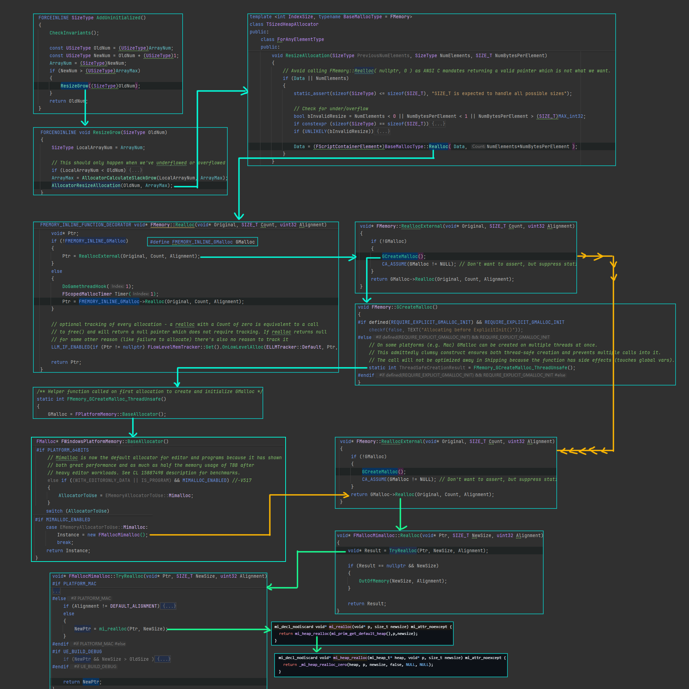


---


# 引擎


`Actor` 是引擎的重要类，先介绍它的前世今生.

---

## Actor的反射


`.generated.h` `.gen.cpp`是反射的起源.

`MyActor.gen.cpp` 的最后一行定义了一个Static的变量，<br>
进入`WinMain`函数之前，这个变量的构造函数会把这个`MyActor`类注册到`ClassDefferredRegistry`.<br>
进入`WinMain`函数之后，引擎读取`ClassDefferredRegistry`并构造里面存放的`UObject`类.

构造过程包括注册蓝图可调用的C++函数，

构造完成后，将这个`UObjectBase`添加到全局数组`GUObjectArray`中.

之后，再次读取`ClassDeferredRegistry` 构造`UClass`的信息，这些信息包括`UProperty` `UFunction`.

此时，`GUObjectArray` 和 `ClassDeferredRegistry` 存放的`UClass`都是`MyActor`的`StaticClass`.<br>
在`UProperty`和`UFunction`的构造完成之后，要为这个`StaticClass`创造`CDO`对象.


---

### GENERATED_BODY

```cpp
#include "CryGameModeBase.generated.h"
UCLASS()
class ACryGameModeBase : public AGameModeBase
{
	GENERATED_BODY()
}
```

```cpp
#define BODY_MACRO_COMBINE_INNER(A,B,C,D) A##B##C##D

#define BODY_MACRO_COMBINE(A,B,C,D) BODY_MACRO_COMBINE_INNER(A,B,C,D)

#define GENERATED_BODY(...) BODY_MACRO_COMBINE(CURRENT_FILE_ID,_,__LINE__,_GENERATED_BODY);
```
从下往上看，`GENERATED_BODY`就是拼接了几个词，<br>
`__LINE__`：定义为当前源文件中的整数行号。 

注意`GENERATED_BODY`在第17行，所以`__LINE__`就是17.


`GENERATED_BODY`展开就是这个内容:
```
CURRENT_FILE_ID_17_GENERATED_BODY
```

---

在UHT生成的 `CryGameModeBase.generated.h` 文件末尾可以找到下面这个宏定义:
```cpp
#define FID_UEPro_Cry_Source_Cry_Game_CryGameModeBase_h_17_GENERATED_BODY \
PRAGMA_DISABLE_DEPRECATION_WARNINGS \
public: \
	FID_UEPro_Cry_Source_Cry_Game_CryGameModeBase_h_17_SPARSE_DATA \
	FID_UEPro_Cry_Source_Cry_Game_CryGameModeBase_h_17_SPARSE_DATA_PROPERTY_ACCESSORS \
	FID_UEPro_Cry_Source_Cry_Game_CryGameModeBase_h_17_EDITOR_ONLY_SPARSE_DATA_PROPERTY_ACCESSORS \
	FID_UEPro_Cry_Source_Cry_Game_CryGameModeBase_h_17_RPC_WRAPPERS_NO_PURE_DECLS \
	FID_UEPro_Cry_Source_Cry_Game_CryGameModeBase_h_17_ACCESSORS \
	FID_UEPro_Cry_Source_Cry_Game_CryGameModeBase_h_17_INCLASS_NO_PURE_DECLS \
	FID_UEPro_Cry_Source_Cry_Game_CryGameModeBase_h_17_ENHANCED_CONSTRUCTORS \
private: \
PRAGMA_ENABLE_DEPRECATION_WARNINGS

template<> CRY_API UClass* StaticClass<class ACryGameModeBase>();

#undef CURRENT_FILE_ID
#define CURRENT_FILE_ID FID_UEPro_Cry_Source_Cry_Game_CryGameModeBase_h
```


这些宏都是前文生成的，只是又用一个宏把它们包裹了起来.<br>

注意`generated.h`的最后一行定义了`CURRENT_FILE_ID`.

```cpp
#define CURRENT_FILE_ID FID_UEPro_Cry_Source_Cry_Game_CryGameModeBase_h
```

接下来 回到头文件中:
```cpp
#include "CryGameModeBase.generated.h"
UCLASS()
class ACryGameModeBase : public AGameModeBase
{
	GENERATED_BODY()
}
```

头文件已经包含了`CryGameModeBase.generated.h`，就可以使用上面的那些宏.<br>
```cpp
#define GENERATED_BODY(...) BODY_MACRO_COMBINE(CURRENT_FILE_ID,_,__LINE__,`_GENERATED_BODY`);
```
`GENERATED_BODY`就是要合并`CURRENT_FILE_ID` `__LINE__` `_GENERATED_BODY` 这3个字段.<br>
`CURRENT_FILE_ID` 已经在`.generated.h`中定义为:
```cpp
FID_UEPro_Cry_Source_Cry_Game_CryGameModeBase_h
```
`__LINE__` 解析为`17`，<br>

于是 `GENERATED_BODY` 拼接的结果是:
```cpp
FID_UEPro_Cry_Source_Cry_Game_CryGameModeBase_h_17_GENERATED_BODY
```

最后 这个头文件变成了:
```cpp
#include "CryGameModeBase.generated.h"
UCLASS()
class ACryGameModeBase : public AGameModeBase
{
	FID_UEPro_Cry_Source_Cry_Game_CryGameModeBase_h_17_GENERATED_BODY
}
```

这样一来，就把`CryGameModeBase.generated.h`文件中定义的那一坨东西 给塞进了这个类里面.

---

`generated.h`定义的内容:


对照`.h`文件和`.generated.h`，<br>

---
### Function

#### DECLARE_FUNCTION

反射函数:
```cpp
#define FID_UEPro_Cry_Source_Cry_Game_CryGameModeBase_h_17_RPC_WRAPPERS_NO_PURE_DECLS \
 \
	DECLARE_FUNCTION(execFindCryPlayerStart); \
	DECLARE_FUNCTION(execGetTeamInfo);
```

`DECLARE_FUNCTION` 是什么？<br>

`此宏用于在自动生成的样板代码中定义一个 thunk 函数`
```cpp
// This macro is used to define a thunk function in autogenerated boilerplate code
#define DEFINE_FUNCTION(func) void func( UObject* Context, FFrame& Stack, RESULT_DECL )
```
`FFrame` : 关于在一个栈级别上脚本执行情况的信息.
```cpp
// Information about script execution at one stack level.
struct FFrame : public FOutputDevice
```

在`.gen.cpp`中的定义:
```cpp
DEFINE_FUNCTION(ACryGameModeBase::execGetTeamInfo)
{
	P_FINISH;
	P_NATIVE_BEGIN;
	*(UCryTeamInfo**)Z_Param__Result=P_THIS->GetTeamInfo();
	P_NATIVE_END;
}
```
```cpp
#define P_FINISH Stack.Code += !!Stack.Code; 
/* increment the code ptr unless it is null */

#define P_THIS_OBJECT (Context)
#define P_THIS_CAST(ClassType)	((ClassType*)P_THIS_OBJECT)
#define P_THIS P_THIS_CAST(ThisClass)

#define P_NATIVE_BEGIN { SCOPED_SCRIPT_NATIVE_TIMER(ScopedNativeCallTimer);
#define P_NATIVE_END   }
```

```cpp
UFUNCTION(BlueprintCallable)
UCryTeamInfo* GetTeamInfo() const {return TeamInfo;}
```

宏展开:
```cpp
void ACryGameModeBase::execGetTeamInfo(UObject* Context, FFrame& Stack, void* const Z_Param__Result)
{
    Stack.Code += !!Stack.Code;
	{
	    *(UCryTeamInfo**)Z_Param__Result=((ThisClass*)(Context))->GetTeamInfo();
    }
}
```
调用`GetTeamInfo`函数，把结果给参数里面的`Z_Param__Result`.<br>
注意`Z_Param__Result`的类型被强转为了`UCryTeamInfo**` 然后解引用.

---

带有参数的函数:
```cpp
UFUNCTION(BlueprintCallable)
ACryPlayerStart* FindCryPlayerStart(AActor* Actor);

/* gen.cpp */
DEFINE_FUNCTION(ACryGameModeBase::execFindCryPlayerStart)
{
	P_GET_OBJECT(AActor,Z_Param_Actor);
	P_FINISH;
	P_NATIVE_BEGIN;
	*(ACryPlayerStart**)Z_Param__Result=P_THIS->FindCryPlayerStart(Z_Param_Actor);
	P_NATIVE_END;
}
```

```cpp
#define PARAM_PASSED_BY_VAL_ZEROED(ParamName, PropertyType, ParamType)							\
	ParamType ParamName = (ParamType)0;															\
	Stack.StepCompiledIn<PropertyType>(&ParamName);

#define P_GET_OBJECT(ObjectType,ParamName)	PARAM_PASSED_BY_VAL_ZEROED(ParamName, FObjectPropertyBase, ObjectType*)
```

展开结果:
```cpp
void ACryGameModeBase::execFindCryPlayerStart(UObject* Context, FFrame& Stack, void* const Z_Param__Result)
{
    UObject* Z_Param_Actor = (UObject*)0;
	Stack.StepCompiledIn<FObjectPropertyBase>(&Z_Param_Actor);;

	Stack.Code += !!Stack.Code;
	{
	    *(ACryPlayerStart**)Z_Param__Result=P_THIS->FindCryPlayerStart(Z_Param_Actor);
    }
}
```

带有多个参数的函数:
```cpp
UFUNCTION(BlueprintCallable,BlueprintPure, Category=Teams)
static bool IsEnemy(AActor* Source, AActor* Target);
```

```cpp
void UCryTeamStatics::execIsEnemy(UObject* Context, FFrame& Stack, void* const Z_Param__Result)
{
	P_GET_OBJECT(AActor,Z_Param_Source);
	P_GET_OBJECT(AActor,Z_Param_Target);
	P_FINISH;
	P_NATIVE_BEGIN;
	*(bool*)Z_Param__Result=UCryTeamStatics::IsEnemy(Z_Param_Source,Z_Param_Target);
	P_NATIVE_END;
}
```

---

#### StaticRegister

```
所以，函数的反射就是 在一个Map里 通过名字找指针？
```

`.generated.h`:
```cpp
#define FID_UEPro_Cry_Source_Cry_Game_CryGameModeBase_h_17_INCLASS_NO_PURE_DECLS \
private: \
	static void StaticRegisterNativesACryGameModeBase(); \
```


`FNameNativePtrPair`:这个类设计得非常简单（即为`POD` 纯数据对象类），目的是为了减少生成代码的规模。
```cpp
struct FNameNativePtrPair
{
	const char* NameUTF8;
	FNativeFuncPtr Pointer;
};
```

```cpp
void FNativeFunctionRegistrar::RegisterFunctions(class UClass* Class, const FNameNativePtrPair* InArray, int32 NumFunctions)
{
	for (; NumFunctions; ++InArray, --NumFunctions)
	{
		Class->AddNativeFunction(UTF8_TO_TCHAR(InArray->NameUTF8), InArray->Pointer);
	}
}
```

`RegisterFunctions`: 把 `函数名称` 和 `函数指针` 塞到`ACryGameModeBase::StaticClass`中.

```cpp
void UClass::AddNativeFunction(const WIDECHAR* InName, FNativeFuncPtr InPointer)
{
	FName InFName(InName);
	NativeFunctionLookupTable.Emplace(InFName, InPointer);
}
```
关于 `NativeFunctionLookupTable` :
```cpp
/** A struct that maps a string name to a native function */
struct FNativeFunctionLookup
{
	FName Name;
	FNativeFuncPtr Pointer;

	FNativeFunctionLookup(FName InName, FNativeFuncPtr InPointer)
		:	Name(InName)
		,	Pointer(InPointer)
	{}
};

class UClass : public UStruct
{
public:
    /** This class's native functions. */
	TArray<FNativeFunctionLookup> NativeFunctionLookupTable;
}
```

这一段只说明了`StaticRegisterNativesACryGameModeBase`可以注册函数.<br>
但是这个函数 在哪里被调用？

---

### DECLARE_CLASS

前文分析了`StaticRegisterNativesACryGameModeBase`.<br>
这一段分析`DECLARE_CLASS`.


```cpp
#define FID_UEPro_Cry_Source_Cry_Game_CryGameModeBase_h_17_INCLASS_NO_PURE_DECLS \
private: \
	static void StaticRegisterNativesACryGameModeBase(); \
	friend struct Z_Construct_UClass_ACryGameModeBase_Statics; \
public: \
	DECLARE_CLASS(ACryGameModeBase, AGameModeBase, COMPILED_IN_FLAGS(0 | CLASS_Transient | CLASS_Config), CASACryGameModeBase_None, TEXT("/Script/Cry"), NO_API) \
```

`DECLARE_CLASS` :  <br>
这里将会生成那个重要的函数: `ACryGameModeBase::StaticClass`.

展开:
```cpp
private: 
	ACryGameModeBase& operator=(ACryGameModeBase&&); 
	ACryGameModeBase& operator=(const ACryGameModeBase&);  
	static UClass* GetPrivateStaticClass(); 
public: 
	static constexpr EClassFlags StaticClassFlags =  
    EClassFlags((0 | CLASS_Transient | CLASS_Config | CLASS_Intrinsic)); 

	typedef AGameModeBase Super; 
	typedef ACryGameModeBase ThisClass; 

	inline static UClass* StaticClass() { return GetPrivateStaticClass(); } 
	inline static const TCHAR* StaticPackage() { return L"/Script/Cry"; } 
	inline static EClassCastFlags StaticClassCastFlags() { return CASACryGameModeBase_None; } 

	inline void* operator new(const size_t InSize, EInternal InInternalOnly, 
        UObject* InOuter = (UObject*)GetTransientPackage(), 
        FName InName = NAME_None, EObjectFlags InSetFlags = RF_NoFlags) 
	{ 
		return StaticAllocateObject(StaticClass(), InOuter, InName, InSetFlags); 
	} 

	inline void* operator new( const size_t InSize, EInternal* InMem ) 
	{
		return (void*)InMem; 
	} 

	inline void operator delete(void* InMem) 
	{ 
		::operator delete(InMem); 
	}
```

这一块把`=`重载设为了`private`，不让复制.<br>
在调用`StaticClass`时，返回的是 `GetPrivateStaticClass` 的结果.<br>

---

`GetPrivateStaticClass` 的定义 ?

`gen.cpp` 有这一行:
```cpp
IMPLEMENT_CLASS_NO_AUTO_REGISTRATION(ACryGameModeBase);
```
实现 `GetPrivateStaticClass` 和注册信息，但不自动注册该类。<br>
这主要是由 `UnrealHeaderTool` 使用的。

宏展开:<br>
注意第一行声明了 `FClassRegistrationInfo`
```cpp
FClassRegistrationInfo Z_Registration_Info_UClass_ACryGameModeBase; 

UClass* ACryGameModeBase::GetPrivateStaticClass() 
{ 
	if (!Z_Registration_Info_UClass_ACryGameModeBase.InnerSingleton) 
	{ 
		/* this could be handled with templates, but we want it external to avoid code bloat */ 
		GetPrivateStaticClassBody( 
			StaticPackage(), 
			(TCHAR*)TEXT(ACryGameModeBase) + 1 + ((StaticClassFlags & CLASS_Deprecated) ? 11 : 0), 

			Z_Registration_Info_UClass_ACryGameModeBase.InnerSingleton, 
			StaticRegisterNativesACryGameModeBase, 

			sizeof(ACryGameModeBase), 
			alignof(ACryGameModeBase), 

			ACryGameModeBase::StaticClassFlags, 
			ACryGameModeBase::StaticClassCastFlags(), 
			ACryGameModeBase::StaticConfigName(), 

			(UClass::ClassConstructorType)InternalConstructor<ACryGameModeBase>, 
			(UClass::ClassVTableHelperCtorCallerType)InternalVTableHelperCtorCaller<ACryGameModeBase>, 
			UOBJECT_CPPCLASS_STATICFUNCTIONS_FORCLASS(ACryGameModeBase), 

			&ACryGameModeBase::Super::StaticClass, 
			&ACryGameModeBase::WithinClass::StaticClass 
		); 
	} 
	return Z_Registration_Info_UClass_ACryGameModeBase.InnerSingleton; 
}
```
`GetPrivateStaticClassBody` 参数对照 :
```cpp
辅助模板，用于分配和构造一个 UClass
@param PackageName 此类所在的包的名称
@param Name 类的名称

@param ReturnClass 指向结果指针的引用。这必须是 PrivateStaticClass。
@param RegisterNativeFunc 原生函数的注册函数指针。

@param InSize 类的大小
@param InAlignment 类的对齐方式

@param InClassFlags 类的标志
@param InClassCastFlags 类的转换标志
@param InConfigName 类的配置名称

@param InClassConstructor 类的构造函数函数指针
@param InClassVTableHelperCtorCaller 用于虚表指针的类构造函数
@param InCppClassStaticFunctions 该类版本的 Unreal 反射静态函数的函数指针集

@param InSuperClassFn Super类函数指针
@param WithinClass 包含类（即该类实例的 Outer 必须是该类的对象）
```

---
`GetPrivateStaticClassBody` ?

```cpp
inline static UClass* StaticClass() { return GetPrivateStaticClass(); } 

UClass* ACryGameModeBase::GetPrivateStaticClass() 
{ 
	if (!Z_Registration_Info_UClass_ACryGameModeBase.InnerSingleton) 
	{ 
		/* this could be handled with templates, but we want it external to avoid code bloat */ 
		GetPrivateStaticClassBody(/*...*/)
    }
}
void GetPrivateStaticClassBody(/*..*/)
{
    ReturnClass = (UClass*)GUObjectAllocator.AllocateUObject(sizeof(UClass), alignof(UClass), true);
	ReturnClass = ::new (ReturnClass) UClass(/*..*/)

    InitializePrivateStaticClass(InSuperClassFn(),ReturnClass,InWithinClassFn(),
    PackageName,Name);

    // Register the class's native functions.
	RegisterNativeFunc();
}
```

`GetPrivateStaticClassBody` 函数中,<br>
参数`RegisterNativeFunc`是`StaticRegisterNativesACryGameModeBase`.

```cpp
void ACryGameModeBase::StaticRegisterNativesACryGameModeBase()
{
	UClass* Class = ACryGameModeBase::StaticClass();
	static const FNameNativePtrPair Funcs[] = {
		{ "FindCryPlayerStart", &ACryGameModeBase::execFindCryPlayerStart },
		{ "GetTeamInfo", &ACryGameModeBase::execGetTeamInfo },
	};
	FNativeFunctionRegistrar::RegisterFunctions(Class, Funcs, UE_ARRAY_COUNT(Funcs));
}
```

第一次访问 `StaticClass`时 ，要把信息注册一遍，<br>

去掉函数体，这个宏的结构是这样:
```cpp
FClassRegistrationInfo Z_Registration_Info_UClass_ACryGameModeBase; 

UClass* ACryGameModeBase::GetPrivateStaticClass()
{
    if(!Z_Registration_Info_UClass_ACryGameModeBase.InnerSingleton)
    {
        /*...*/
    }
    return Z_Registration_Info_UClass_ACryGameModeBase.InnerSingleton;
}
```

最后得到一个 `UClass`.


`FClassRegistrationInfo` :

```cpp
template <typename T, typename V>
struct TRegistrationInfo
{
	using TType = T;
	using TVersion = V;

	TType* InnerSingleton = nullptr;
	TType* OuterSingleton = nullptr;
	TVersion ReloadVersionInfo;
};

using FClassRegistrationInfo = TRegistrationInfo<UClass, FClassReloadVersionInfo>;

FClassRegistrationInfo Z_Registration_Info_UClass_ACryGameModeBase; 
```

总结：<br>
第一次调用某个类的`StaticClass`时，注册这个类 以及 成员函数，存到一个单例中.<br>
后续再调用`StaticClass`时，直接返回已经创造好的单例.

---


### 构造函数

```cpp
#define FID_UEPro_Cry_Source_Cry_Game_CryGameModeBase_h_17_ENHANCED_CONSTRUCTORS \
private: \
	/** Private move- and copy-constructors, should never be used */ \
	NO_API ACryGameModeBase(ACryGameModeBase&&); \
	NO_API ACryGameModeBase(const ACryGameModeBase&); \
public: \
	DECLARE_VTABLE_PTR_HELPER_CTOR(NO_API, ACryGameModeBase); \
	DEFINE_VTABLE_PTR_HELPER_CTOR_CALLER(ACryGameModeBase); \
	DEFINE_DEFAULT_OBJECT_INITIALIZER_CONSTRUCTOR_CALL(ACryGameModeBase) \
	NO_API virtual ~ACryGameModeBase();
```

前面的`DECLARE_CLASS`定义了`new`:
```cpp
/** 仅供内部使用；请使用 StaticConstructObject() 创建新对象。 */ 
inline void* operator new(const size_t InSize, EInternal InInternalOnly, UObject* InOuter = (UObject*)GetTransientPackage(), FName InName = NAME_None, EObjectFlags InSetFlags = RF_NoFlags) 
{ 
	return StaticAllocateObject(StaticClass(), InOuter, InName, InSetFlags); 
} 

/** 仅供内部使用；请使用 StaticConstructObject() 创建新对象。 */ 
inline void* operator new( const size_t InSize, EInternal* InMem ) 
{ 
	return (void*)InMem; 
} 
```

`DEFINE_DEFAULT_OBJECT_INITIALIZER_CONSTRUCTOR_CALL` :

```cpp
#define DEFINE_DEFAULT_OBJECT_INITIALIZER_CONSTRUCTOR_CALL(TClass) \
	static void __DefaultConstructor(const FObjectInitializer& X) { new((EInternal*)X.GetObj())TClass(X); }
```

展开为:
```cpp
static void __DefaultConstructor(const FObjectInitializer& X) 
{
     new((EInternal*)X.GetObj()) ACryGameModeBase(X); 
}
```

`__DefaultConstructor` 调用第二个版本的`new`.

`X.GetObj()` 返回 `UObject*`. 指向已分配好内存但尚未构造的对象.<br>
`(EInternal*)X.GetObj()` 将 `UObject*` 强制转换为 `EInternal*`.<br>

```cpp
enum EInternal	{EC_InternalUseOnlyConstructor};
```

`new (指针) TClass(X)`:<br>
在指定的内存地址上调用 `TClass` 的构造函数，并将 `X` 作为参数传递给构造函数。

由于第二个 `operator new` 重载接受 `EInternal*` 类型的第二个参数，<br>
这里的强制转换使得编译器选择该重载，从而直接在 `X.GetObj()` 返回的地址上构造对象，<br>
而不进行任何内存分配。


---

### 类型收集

`.gen.cpp` 的末尾，有一个静态的 `FRegisterCompiledInInfo` 变量 :

```cpp
struct Z_CompiledInDeferFile_FID_UEPro_Cry_Source_Cry_Game_CryGameModeBase_h_Statics
{
	static const FClassRegisterCompiledInInfo ClassInfo[];
};

const FClassRegisterCompiledInInfo Z_CompiledInDeferFile_FID_UEPro_Cry_Source_Cry_Game_CryGameModeBase_h_Statics::ClassInfo[] = 
{
    { 
        Z_Construct_UClass_ACryGameModeBase, ACryGameModeBase::StaticClass, 
        TEXT("ACryGameModeBase"), &Z_Registration_Info_UClass_ACryGameModeBase,

        CONSTRUCT_RELOAD_VERSION_INFO(FClassReloadVersionInfo, sizeof(ACryGameModeBase), 3886341742U) 
    },
};

static FRegisterCompiledInInfo Z_CompiledInDeferFile_FID_UEPro_Cry_Source_Cry_Game_CryGameModeBase_h_18210299(       
    TEXT("/Script/Cry"),
	Z_CompiledInDeferFile_FID_UEPro_Cry_Source_Cry_Game_CryGameModeBase_h_Statics::ClassInfo, 
    UE_ARRAY_COUNT(Z_CompiledInDeferFile_FID_UEPro_Cry_Source_Cry_Game_CryGameModeBase_h_Statics::ClassInfo),
	nullptr, 0,
	nullptr, 0
);
```


`static FRegisterCompiledInInfo Z_Compi...` : 收集了`ClassInfo`.<br>
在引擎启动时，这个静态变量将在 `main`函数执行 之前 自动初始化，接着调用构造函数.


`FRegisterCompiledInInfo` : 用于执行对象信息注册的辅助类，
```cpp
struct FRegisterCompiledInInfo
{
	template <typename ... Args>
	FRegisterCompiledInInfo(Args&& ... args)
	{
		RegisterCompiledInInfo(std::forward<Args>(args)...);
	}
};

void RegisterCompiledInInfo(const TCHAR* PackageName, 
const FClassRegisterCompiledInInfo* ClassInfo, 
size_t NumClassInfo, const FStructRegisterCompiledInInfo* StructInfo, 
size_t NumStructInfo, const FEnumRegisterCompiledInInfo* EnumInfo, 
size_t NumEnumInfo)
```

`RegisterCompiledInInfo`:


```cpp
void RegisterCompiledInInfo(class UClass* (*InOuterRegister)(), class UClass* (*InInnerRegister)(), const TCHAR* InPackageName, const TCHAR* InName, FClassRegistrationInfo& InInfo, const FClassReloadVersionInfo& InVersionInfo)
{
    FClassDeferredRegistry::Get().AddRegistration(InOuterRegister, InInnerRegister, 
    InPackageName, InName, InInfo, InVersionInfo);
}
```

```cpp
保存有关待注册信息的相关资料
struct FRegistrant
{
	TType* (*OuterRegisterFn)();
	TType* (*InnerRegisterFn)();
	const TCHAR* PackageName;
	TInfo* Info;

    TType* OldSingleton;
    bool bHasChanged;
}

AddResult AddRegistration(TType* (*InOuterRegister)(), TType* (*InInnerRegister)(), const TCHAR* InPackageName, const TCHAR* InName, TInfo& InInfo, const TVersion& InVersion)
{
    Registrations.Add(FRegistrant{ InOuterRegister, InInnerRegister, InPackageName, &InInfo, OldSingleton, bHasChanged });

    return ExistingInfo == AddResult::New;
}
```

`FClassDeferredRegistry::Get()` 在别的什么地方调用了?<br>


---

## 垃圾回收

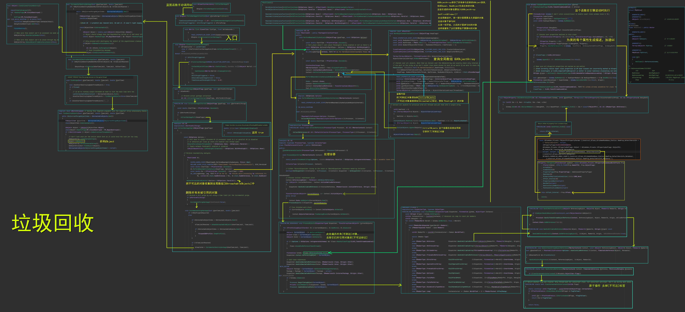

`UKismetSystemLibrary::CollectGarbage`:<br>
删除所有未被引用的对象，只保留被引用的对象（此操作将被排队处理，并会在当前帧结束时执行）<br>
注意：此操作可能较为耗时，且仅应在出现卡顿也能接受的情况下进行操作.
```cpp
UFUNCTION(BlueprintCallable, Category = "Utilities|Platform")
static ENGINE_API void CollectGarbage()
{
    GEngine->ForceGarbageCollection(true);
}

void UEngine::ForceGarbageCollection(bool bForcePurge/*=false*/)
{
	TimeSinceLastPendingKillPurge = 1.0f + GetTimeBetweenGarbageCollectionPasses();
	bFullPurgeTriggered = bFullPurgeTriggered || bForcePurge;
}
```

`GEngine->ForceGarbageCollection`:<br>
更新垃圾回收之间的计时器，以便在下次时机到来时能够启动垃圾回收操作。<br>
`bFullPurgeTriggered`: 经过这个函数之后，它就是`true`,<br>
意思是:是否已经触发了彻底的清理操作，使得下一次的“垃圾回收”无论何种情况都会进行彻底清理。

`TimeSinceLastPendingKillPurge` 记录了 上一次GC到现在的间隔时长”。<br>
`GetTimeBetweenGarbageCollectionPasses()` 返回当前GC之间的期望间隔时间（而非剩余时间）。<br>

将其设置为 `1.0f + 间隔时间`，让引擎认为已经超过了预期的 GC 间隔，从而在下次检查时满足时间条件，允许执行 GC。

```cpp
static float GTimeBetweenPurgingPendingKillObjects = 60.0f;
static FAutoConsoleVariableRef CVarTimeBetweenPurgingPendingKillObjects(
	TEXT("gc.TimeBetweenPurgingPendingKillObjects"),
	GTimeBetweenPurgingPendingKillObjects,
	TEXT("Time in seconds (game time) we should wait between purging object references to objects that are pending kill."),
	ECVF_Default
);

float UEngine::GetTimeBetweenGarbageCollectionPasses(bool bHasPlayersConnected) const
{
	float TimeBetweenGC = GTimeBetweenPurgingPendingKillObjects;
    /* ... */
	return TimeBetweenGC;
}
```

`GTimeBetweenPurgingPendingKillObjects` 是一个全局变量，通过控制台可以修改这个值:
```cpp
gc.TimeBetweenPurgingPendingKillObjects 30
```

---

Tick ?

`TimeSinceLastPendingKillPurge` 让这个值大于超过期望值 就能让GC运行，GC如何知道运行时机？

```cpp
void UWorld::Tick( ELevelTick TickType, float DeltaSeconds )
{
    {
		TRACE_CPUPROFILER_EVENT_SCOPE(ConditionalCollectGarbage);
		GEngine->ConditionalCollectGarbage();
	}
}
```

通过`UWorld`每帧执行，当编辑器中有多个`World`时，会不会多次执行GC？
```cpp
uint64 GFrameCounter = 0;
void UEngine::ConditionalCollectGarbage()
{
    if (GFrameCounter != LastGCFrame)
    {
        // ... 所有逻辑
        LastGCFrame = GFrameCounter;
    }
}
```
使用 `GFrameCounter` 和 `LastGCFrame` 确保该函数在一帧内只执行一次，避免重复调用.<br>
`GFrameCounter`是一个全局变量，每帧+1，主要由`FEngineLoop::Tick`这个函数来实现增加.


`bFullPurgeTriggered` 是true，所以下面的代码会执行:
```cpp
void UEngine::ConditionalCollectGarbage()
{
    if (bFullPurgeTriggered)
	{
		if (TryCollectGarbage(GARBAGE_COLLECTION_KEEPFLAGS, true))
		{
			ForEachObjectOfClass(UWorld::StaticClass(),[](UObject* World)
			{
				CastChecked<UWorld>(World)->CleanupActors();
			});
			bFullPurgeTriggered = false;
			bShouldDelayGarbageCollect = false;
			TimeSinceLastPendingKillPurge = 0.0f;
		}
	}
    else
    {
        /* 根据时间间隔 自动触发增量清除 */
    }
}
```

先解释第一个分支，`bFullPurgeTriggered` :<br>
`TryCollectGarbage`:只有在没有其他线程持有垃圾回收锁的情况下才执行垃圾回收操作.<br>
`KeepFlags`: 具有这些标志的对象将无论是否被引用都会被保留.<br>
`bPerformFullPurge`: 如果是`true`，则在标记过程结束后执行完整清理操作
```cpp
bool TryCollectGarbage(EObjectFlags KeepFlags, bool bPerformFullPurge)

TryCollectGarbage(GARBAGE_COLLECTION_KEEPFLAGS, true)
```

```cpp
#define GARBAGE_COLLECTION_KEEPFLAGS (GIsEditor ? RF_Standalone : RF_NoFlags)
```

`RF_Standalone` : 即使对象未被引用，也要保留对象以供编辑.
`RF_NoFlags`: 没有标志，用于避免类型转换.

所以这里要清理没有标志的那些对象，在编辑器状态下 清理即使没有被引用 也要保留的那些对象.<br>
之后执行完整清理操作.

```cpp
bool TryCollectGarbage(EObjectFlags KeepFlags, bool bPerformFullPurge)
{
    bool bCanRunGC = FGCCSyncObject::Get().TryGCLock();
    /*...*/
    if (bCanRunGC)
	{ 
		// Perform actual garbage collection
		UE::GC::CollectGarbageInternal(KeepFlags, bPerformFullPurge);
    }
}
```
`TryGCLock`:先加锁，避免其他线程触发GC.

```cpp
void CollectGarbageInternal(EObjectFlags KeepFlags, bool bPerformFullPurge)
{
	const double StartTime = FPlatformTime::Seconds();

	if (bPerformFullPurge)
	{
		CollectGarbageFull(KeepFlags);
	}
	else
	{
		CollectGarbageIncremental(KeepFlags);
	}

	GTimingInfo.LastGCDuration = FPlatformTime::Seconds() - StartTime;
}
```

这里依旧是两条分支，由于前面传入的`bPerformFullPurge`是`true`，<br>
所以走第一条分支， `else分支`是引擎因为时间到了 自动触发的GC.

```cpp
static void CollectGarbageFull(EObjectFlags KeepFlags)
{
    /*...*/
	CollectGarbageImpl<true>(KeepFlags);
}
```

还有模板参数？ 极致的优化.


```cpp
template<bool bPerformFullPurge>
void CollectGarbageImpl(EObjectFlags KeepFlags)
{
    /*...*/

    /* 锁定全局哈希表 */
    FGCHashTableScopeLock GCHashTableLock;

    const EGCOptions Options = 
    (ShouldForceSingleThreadedGC() ? EGCOptions::None : EGCOptions::Parallel) |
    (UObjectBaseUtility::IsPendingKillEnabled() ? EGCOptions::WithPendingKill : EGCOptions::None);

    FRealtimeGC GC;
    GC.PerformReachabilityAnalysis(KeepFlags, Options);
}
```

根据当前环境决定 GC 选项：<br>
如果强制单线程（如核心数少或控制台禁用并行），则使用 `EGCOptions::None`，<br>
否则使用 `EGCOptions::Parallel`。
如果 `PendingKill` 为`true`，则使用 `EGCOptions::WithPendingKill`。

`bPendingKillDisabled` 如果是`true`，那么对象将永远不会被标记为 `PendingKill`，<br>
因此对这些对象的引用也不会被垃圾回收器自动置空。
```cpp
static inline bool IsPendingKillEnabled()
{
	return !bPendingKillDisabled;
}
```
`bPendingKillDisabled`默认是`false`，取反 返回`true`.

`Options` 将会选择`EGCOptions::WithPendingKill`.

---

`PerformReachabilityAnalysis` : 执行可达性分析
```cpp
FRealtimeGC GC;
GC.PerformReachabilityAnalysis(KeepFlags, Options);
```

`KeepFlags` : `RF_NoFlags`<br>
`Options` : `WithPendingKill`<br>

带有 `RF_NoFlags` 标志的对象无论是否被引用都会被保留下来。<br>

```cpp
void PerformReachabilityAnalysis(EObjectFlags KeepFlags, const EGCOptions Options)
{
    const EGCOptions OptionsForMarkPhase = Options & ~EGCOptions::WithPendingKill;

	(this->*MarkObjectsFunctions[GetGCFunctionIndex(OptionsForMarkPhase)])(KeepFlags);
}
```

`MarkObjectsFunctions` 一个存放函数的数组: <br>
下面两个 `MarkObjectsAsUnreachable` 的区别在于 是否并行.为了 `在PS4上节省约6ms`.
```cpp
MarkObjectsFunctions[GetGCFunctionIndex(EGCOptions::None)] = &FRealtimeGC::MarkObjectsAsUnreachable<false>;

MarkObjectsFunctions[GetGCFunctionIndex(EGCOptions::Parallel | EGCOptions::None)] = &FRealtimeGC::MarkObjectsAsUnreachable<true>;
```

这个函数里面有一个很长很长的`Lambda`函数.
```cpp
template <bool bParallel>
void MarkObjectsAsUnreachable(const EObjectFlags KeepFlags)
{
    const int32 MaxNumberOfObjects = GUObjectArray.GetObjectArrayNum() - GUObjectArray.GetFirstGCIndex();
	const int32 NumThreads = FMath::Max(1, FTaskGraphInterface::Get().GetNumWorkerThreads());
	const int32 NumberOfObjectsPerThread = (MaxNumberOfObjects / NumThreads) + 1;		

	TLockFreePointerListFIFO<FUObjectItem, PLATFORM_CACHE_LINE_SIZE> ClustersToDissolveList;
	TLockFreePointerListFIFO<FUObjectItem, PLATFORM_CACHE_LINE_SIZE> KeepClusterRefsList;

	TArray<TArray<UObject*>, TInlineAllocator<32>> ObjectsToSerializeArrays;
	ObjectsToSerializeArrays.SetNum(NumThreads);

    ParallelFor( TEXT("GC.MarkUnreachable"),NumThreads,1,/*Lambda*/
    ,!bParallel ? EParallelForFlags::ForceSingleThread : EParallelForFlags::None);
}
```
`ParallelFor`的第四个参数就是一个函数，在这里省略掉 写上的话就太长了，后面单独分析.


这段代码中的第一个变量:
```cpp
const int32 MaxNumberOfObjects = GUObjectArray.GetObjectArrayNum() - GUObjectArray.GetFirstGCIndex();
```
`GUObjectArray` 中存在一部分永远不会被垃圾回收的对象，这些对象属于永久对象池 `disregard for GC`.<br>
为了提高 `GC` 性能，遍历时跳过这些对象，只处理可能被回收的那部分对象。


`ParallelFor` 中的 `Lambda` : <br>
下面的某些变量在上面的代码里可以找到，因为这个`Lambda`会捕获这些变量，变量名称都是一样的.
```cpp
int32 FirstObjectIndex = ThreadIndex * NumberOfObjectsPerThread + GUObjectArray.GetFirstGCIndex();
int32 LastObjectIndex = FMath::Min(GUObjectArray.GetObjectArrayNum() - 1, FirstObjectIndex + NumObjects - 1);
TArray<UObject*>& LocalObjectsToSerialize = ObjectsToSerializeArrays[ThreadIndex];

for (int32 ObjectIndex = FirstObjectIndex; ObjectIndex <= LastObjectIndex; ++ObjectIndex)
{
    FUObjectItem* ObjectItem = &GUObjectArray.GetObjectItemArrayUnsafe()[ObjectIndex];
    if (ObjectItem->Object)
    {
        UObject* Object = (UObject*)ObjectItem->Object;

        ObjectCountDuringMarkPhase++;
        ObjectItem->ClearFlags(EInternalObjectFlags::ReachableInCluster);
    }
}
```
在`if`里面 更新对象计数，清除 `ReachableInCluster` 标志<br>
之后，根据对象类型和标志决定是否标记为不可达: 因为这一段很长，先解释思路 <br>
对象分为三类：<br>
根集对象 - `IsRootSet()`
- 直接加入 `LocalObjectsToSerialize`。
- 如果是集群根或属于某个集群，则同时加入 KeepClusterRefsList。

集群对象 - `GetOwnerIndex() > 0`
- 如果持有 `FastKeepFlags（GarbageCollectionKeepFlags）`，则加入 `LocalObjectsToSerialize` 和 `KeepClusterRefsList`。
- 否则，这类对象不会在标记阶段被单独处理（其可达性由集群根决定）。

普通对象或集群根 - `GetOwnerIndex() <= 0`
- 初始认为应该标记为不可达 `bMarkAsUnreachable = true`。
- 如果对象持有 `FastKeepFlags`（包括根集标志），则取消标记。
- 如果 `KeepFlags != RF_NoFlags` 且对象持有任何 `KeepFlags`，则取消标记。
- 如果对象是 `PendingKill` 或 `Garbage` 且是集群根，则将其加入 `ClustersToDissolveList`（稍后溶解集群）。

若最终 `bMarkAsUnreachable` 为真，则设置 `EInternalObjectFlags::Unreachable`<br>
否则加入 `LocalObjectsToSerialize`，如果是集群根则加入 `KeepClusterRefsList`。

```cpp
if (ObjectItem->IsRootSet())
{
    LocalObjectsToSerialize.Add(Object);
}
else if (ObjectItem->GetOwnerIndex() > 0)
{

}
// Regular objects or cluster root objects
else
{
    bool bMarkAsUnreachable = true;
	// 内部标志的检查速度非常快，供异步加载使用，优先级必须高于PendingKill
	if (ObjectItem->HasAnyFlags(FastKeepFlags))
	{
		bMarkAsUnreachable = false;
	}
    else if (!ObjectItem->IsPendingKill() && KeepFlags != RF_NoFlags && Object->HasAnyFlags(KeepFlags))
	{
		bMarkAsUnreachable = false;
	}
}
```

`FastKeepFlags` : Native | Async | AsyncLoading | LoaderImport <br>
`Native` : 只有`UClass`是`Native`.<br>
`Async` : 对象只存在于与游戏线程不同的线程中.<br>
`AsyncLoading` : 对象正在异步加载.<br>
`LoaderImport` : 对象可以在加载期间被另一个包导入.

如果没有`FastKeepFlags`这些标记，就检查`IsPendingKill`.<br>
如果不是`IsPendingKill`的对象，那么标记为`可到达`.

反过来说，如果是`PendingKill`的对象，它就会被标记为`不可达`.

经过检测后，如果是 `不可达` 的对象，就对它设置`Unreachable`的Flag:
```cpp
if (!bMarkAsUnreachable)
{
	LocalObjectsToSerialize.Add(Object);
}
else
{
	ObjectItem->SetFlags(EInternalObjectFlags::Unreachable);
}
```
注意，这里设置的是`ObjectItem`， 它是 `GUObjectArray` 里面的对象，<br>
真正的`UObject`对象是`ObjectItem->Object`.

如此一来，`GUObjectArray`里面的某些对象就被标记为了 `Unreachable`.

而对于那些 `可到达` 的对象，它们会被添加到`LocalObjectsToSerialize`.

---

`LocalObjectsToSerialize` 是这个`Lambda`函数从外面捕获的，<br>
真身是 `ObjectsToSerializeArrays`:
```cpp
TArray<TArray<UObject*>, TInlineAllocator<32>> ObjectsToSerializeArrays;
ObjectsToSerializeArrays.SetNum(NumThreads);

ParallelFor(TEXT("GC.MarkUnreachable"),NumThreads,1,
[&ObjectsToSerializeArrays]()
{
    TArray<UObject*>& LocalObjectsToSerialize = ObjectsToSerializeArrays[ThreadIndex];
})
```

遍历完要检测GC的对象后，那些 `可到达` 的对象就被存放在`ObjectsToSerializeArrays`之中.<br>

最终合并到 `InitialObjects` 数组中，作为后续可达性遍历的种子（即从这些对象出发，继续遍历其引用的对象）:
```cpp
for (TArray<UObject*>& Objects : ObjectsToSerializeArrays)
{
	InitialObjects.Append(Objects);
}
```

---

回到这里：

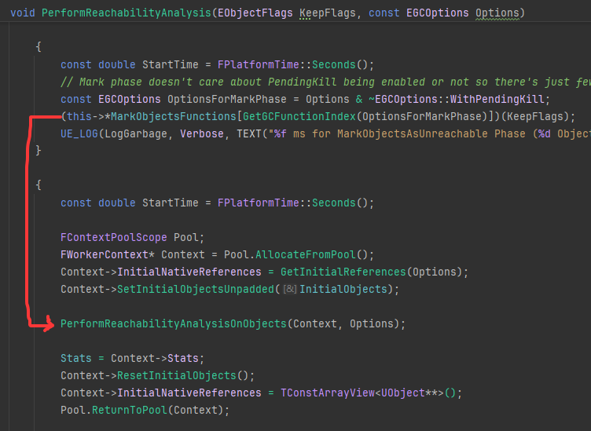

```cpp
FContextPoolScope Pool;
FWorkerContext* Context = Pool.AllocateFromPool();
Context->InitialNativeReferences = GetInitialReferences(Options);
Context->SetInitialObjectsUnpadded(InitialObjects);
PerformReachabilityAnalysisOnObjects(Context, Options);
```
参数 `Context` 携带了 `InitialObjects` ，里面存放的就是前面找到的那些 `可到达` 的对象.

之后来到这个函数:
```cpp
template <EGCOptions Options>
void PerformReachabilityAnalysisOnObjectsInternal(FWorkerContext& Context)
{
    TReachabilityProcessor<Options> Processor;
	CollectReferences<TReachabilityCollector<Options>>(Processor, Context);
}
```

模板参数`Options` 是 `EGCOptions::Parallel | EGCOptions::WithPendingKill`.

最终到了这个函数: `TFastReferenceCollector::ProcessObjectArray` <br>
`EGCOptions::Parallel` 只是要并行执行这个函数.
```cpp
void ProcessObjectArray(FWorkerContext& Context)
{
    /*...*/
}
```
`ProcessObjectArray` 做的事情是:遍历 `可到达` 的这些对象，清除它们引用的对象的 `不可达` 标签.


---


## 弱指针

上一节 `垃圾回收` 流程图的左上角部分， 有以下代码:
```cpp
bool UObject::ConditionalFinishDestroy()
{
    FinishDestroy();

	// Make sure this object can't be accessed via weak pointers after it's been FinishDestroyed
	GUObjectArray.ResetSerialNumber(this);

	// Make sure this object can't be found through any delete listeners (annotation maps etc) after it's been FinishDestroyed
	GUObjectArray.RemoveObjectFromDeleteListeners(this);
}
```
一个 `UObject` 被回收以后还要禁止弱指针对它的访问:
```
Make sure this object can't be accessed via weak pointers after it's been FinishDestroyed
```

弱指针和 `GUObjectArray` 的关系是？？？

---


弱指针在创建或被设置时，会指向一个已实例化的现有 `UObject`，并通过其在 `GUObjectArray` 中的索引进行定位.<br>
该指针无需被标记为 `UPROPERTY`，也能够判断其所指向的对象是否已被垃圾回收.

---

```cpp
template<class T=UObject, class TWeakObjectPtrBase=FWeakObjectPtr>
struct TWeakObjectPtr;

/*-----*/

template<class T, class TWeakObjectPtrBase>
struct TWeakObjectPtr : private TWeakObjectPtrBase
{
    /**  
	 * Copy from an object pointer
	 * @param Object object to create a weak pointer to
	 */
	template<class U>
	typename TEnableIf<!TLosesQualifiersFromTo<U, T>::Value, TWeakObjectPtr&>::Type operator=(U* Object)
	{
		T* TempObject = Object;
		TWeakObjectPtrBase::operator=(TempObject);
		return *this;
	}
}
```
`operator=` 转发给了父类的`operator=` ,<br>
`TWeakObjectPtr`的父类是`FWeakObjectPtr`,<br>
以下是`FWeakObjectPtr`的相关函数 :
```cpp
void FWeakObjectPtr::operator=(const class UObject *Object)
{
	if (Object)
	{
		ObjectIndex = GUObjectArray.ObjectToIndex((UObjectBase*)Object);
		ObjectSerialNumber = GUObjectArray.AllocateSerialNumber(ObjectIndex);
		checkSlow(SerialNumbersMatch());
	}
	else
	{
		Reset();
	}
}

/**
* Reset the weak pointer back to the null state
*/
void FWeakObjectPtr::Reset()
{
	using namespace UE::Core::Private;

	ObjectIndex = InvalidWeakObjectIndex;
	ObjectSerialNumber = 0;
}
```

通过一个 `UObject` 设置弱指针时，弱指针会去`GUObjectArray`里面找到这个`UObject`的索引，并申请一个序列号.<br>
`AllocateSerialNumber` 使用原子操作递增序列号并返回，线程安全.

所以 弱指针只存了 `ObjectIndex` 和 `ObjectSerialNumber`.

---

`Set` 知道了，那么 `Get` 呢？

```cpp
T* Get() const
{
	return (T*)TWeakObjectPtrBase::Get();
}

UObject* FWeakObjectPtr::Get() const
{
	// Using a literal here allows the optimizer to remove branches later down the chain.
	return Internal_Get(false);
}

UObject* Internal_Get(bool bEvenIfPendingKill) const
{
	FUObjectItem* const ObjectItem = Internal_GetObjectItem();
	return ((ObjectItem != nullptr) && GUObjectArray.IsValid(ObjectItem, bEvenIfPendingKill)) ? (UObject*)ObjectItem->Object : nullptr;
}

FUObjectItem* Internal_GetObjectItem() const
{
	using namespace UE::Core::Private;

	if (ObjectSerialNumber == 0)
	{return nullptr;}

	if (ObjectIndex < 0)
	{return nullptr;}

	FUObjectItem* const ObjectItem = GUObjectArray.IndexToObject(ObjectIndex);

	if (!ObjectItem)
	{return nullptr;}

	if (!SerialNumbersMatch(ObjectItem))
	{return nullptr;}
	return ObjectItem;
}
```

`Internal_GetObjectItem` : <br>
通过 `ObjectIndex` 到全局数组中获得`ObjectItem`，然后对比`ObjectSerialNumber`是否匹配，<br>
如果匹配成功，就说明这个弱指针保存的对象有效.

所以 弱指针保存的是 `UObject` 在全局数组中的索引.


---


## Actor操作


### 都市传说之Cast To

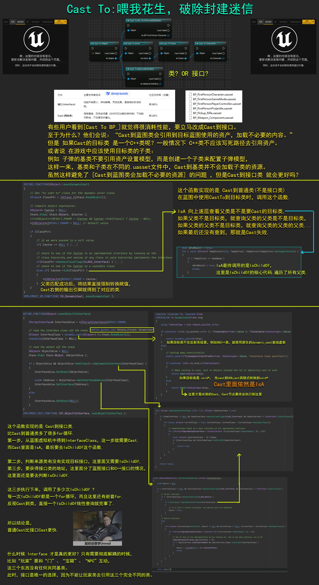

---

### SpawnActor


图中最右侧的 `UObjectBase::AddObject` 函数 ，将这个 `UObject` 存入了哈希表中.<br>
这将在后来的 `TActorIterator` 中有使用到，<br>
而 `GetActorOfClass` 使用 `TActorIterator` 实现.

---

```cpp
AActor* UWorld::SpawnActor( UClass* Class, FTransform const* UserTransformPtr, const FActorSpawnParameters& SpawnParameters )
{
    /*...*/

    // actually make the actor object
	AActor* const Actor = NewObject<AActor>(LevelToSpawnIn, Class, NewActorName, ActorFlags, Template, false/*bCopyTransientsFromClassDefaults*/, nullptr/*InInstanceGraph*/, ExternalPackage);
}
```


重点在分析`Actor`的构造过程，所以跳过前面的部分.<br>
省略部分的内容:

1.参数与上下文检查<br>
验证传入的类（Class）不为空，且必须是 AActor 的子类，不能是已弃用或抽象的。<br>
检查模板（如果提供）的类与生成类一致。<br>
确保不在构造函数脚本运行期间或世界销毁过程中生成。<br>
验证提供的变换不包含无效值（NaN）。<br>
在非编辑器模式下，若要求全局唯一名称但同时指定了名称，则拒绝生成。<br>
编辑器模式下，禁止同时设置外部包和创建新包标志。<br>

2.确定目标关卡与模板
根据 SpawnParameters.OverrideLevel、拥有者（Owner）或当前关卡确定要生成的关卡（LevelToSpawnIn）。<br>
使用指定的模板（SpawnParameters.Template）或类的默认对象（CDO）作为模板。<br>

3.名称处理与唯一性保证<br>
若未提供名称，则基于模板的基础名称（CDO 用类名，否则用模板名）结合关卡、类及全局唯一性要求生成唯一名称。<br>
若提供的名称已存在或不符合全局唯一性，根据 SpawnParameters.NameMode 决定：重新生成唯一名称、报错终止或直接返回空。<br>
编辑器模式下，还会生成 Actor 的 GUID，并在需要时创建外部包。<br>

4.上下文兼容性检查<br>
调用 CanCreateInCurrentContext 检查模板是否可在当前客户端/服务器上下文中加载，不允许则返回空。<br>

5.碰撞处理与预检测<br>
根据生成参数和模板确定碰撞处理方式（ESpawnActorCollisionHandlingMethod）。<br>
若 bNoFail 为真，将可能失败的碰撞处理方式升级为总是生成。<br>
若最终方式为“不生成如果碰撞”，则预先计算最终根组件变换，并调用 EncroachingBlockingGeometry 检测是否与其他几何体重叠；若重叠则记录日志并返回空。<br>

---


```cpp
AActor* UWorld::SpawnActor( UClass* Class, FTransform const* UserTransformPtr, const FActorSpawnParameters& SpawnParameters )
{
    /*...*/

    // Use class's default actor as a template if none provided.
	AActor* Template = SpawnParameters.Template ? SpawnParameters.Template : Class->GetDefaultObject<AActor>();
    /*...*/

    // actually make the actor object
	AActor* const Actor = NewObject<AActor>(LevelToSpawnIn, Class, NewActorName, ActorFlags, Template, false/*bCopyTransientsFromClassDefaults*/, nullptr/*InInstanceGraph*/, ExternalPackage);
}
```

`Template`: 用于生成新的 `Actor`：<br>
生成的 `Actor` 将使用该模板 `Actor` 的属性值进行初始化。<br>
如果此项保留为 `NULL`，则将使用类默认对象 (`CDO`) 来初始化生成的 `Actor`。

也就是说 `Template`的属性 将会被复制到 新创建的`Actor`中.<br>
包括 变量、组件 等数据.

假设这个`Actor`的蓝图里面 本身是没有组件的，拖到场景中 给场景里的`Actor`添加了组件.<br>
`Template`指定为场景里这个有组件的`Actor`,那么新创建的`Actor`会使用`Template`的组件、变量.<br>
可以说是复制了一个`Template`.

---


```cpp
T* NewObject(UObject* Outer, const UClass* Class, FName Name, 
EObjectFlags Flags, UObject* Template,/*...*/)
{
    FStaticConstructObjectParameters Params(Class);
	Params.Outer = Outer;
	Params.Name = Name;
	Params.SetFlags = Flags;
	Params.Template = Template;
	Params.bCopyTransientsFromClassDefaults = bCopyTransientsFromClassDefaults;
	Params.InstanceGraph = InInstanceGraph;
	Params.ExternalPackage = ExternalPackage;
    return static_cast<T*>(StaticConstructObject_Internal(Params));
}
```

`NewObject` 把这些参数全部打包起来，存到`Params`，又转发了出去.<br>

---

`StaticConstructObject_Internal` 的整体行为:

1.参数提取与基本校验<br>
从 `Params` 中提取`Class`、`Outer`、`Name`、`Flags`、`Template`。<br>
编辑器模式下检查：若外部包正在保存，则触发致命错误（防止在序列化时构造对象）。<br>
验证模板对象必须是类的实例或类的 `CDO`，否则触发断言（`CDO` 除外）。<br>

2.确定子对象重用条件<br>
判断是否为原生类（Native/Intrinsic）。<br>
判断是否可从模板重用：若类为原生且模板为当前对象的原型（`CDO` 或指定模板），则允许重用。<br>
排除热重载状态，确保旧数据不被复用。<br>
最终通过 `StaticAllocateObject` 决定是分配新内存还是重用已存在的子对象（例如默认子对象），并返回 UObject*。<br>

3.对象分配与构造<br>
调用 `StaticAllocateObject` 分配内存或获取现有对象，返回指针 `Result`。<br>
若返回的对象是新分配的（未重用），则调用类的 `ClassConstructor` 执行实际构造函数，并传入 `FObjectInitializer`。<br>
构造函数执行期间会完成属性初始化、子对象创建等。<br>

4.编辑器下事务处理<br>
仅在编辑器下、对象非异步加载、且具有 `RF_Transactional` 标志时执行：<br>
临时将对象标记为 `RF_PendingKill`（垃圾）。<br>
将对象保存到事务缓冲区（`SaveToTransactionBuffer`）。<br>
立即清除垃圾标志。<br>
此操作用于支持撤销/重做：使新建对象在撤销时能够被正确标记为垃圾，从而实现“删除”效果。<br>

5.后处理与返回<br>
编辑器下广播 `OnObjectConstructed` 委托。<br>
返回构造好的对象指针。<br>

---

```cpp
UObject* StaticConstructObject_Internal(const FStaticConstructObjectParameters& Params)
{
    UObject* Result = StaticAllocateObject(InClass, InOuter, InName, InFlags, Params.InternalSetFlags, bCanRecycleSubobjects, &bRecycledSubobject, Params.ExternalPackage);

    /*...*/
    return Result;
}
```
最终返回的是`Result`，`Result`是怎么来的？
```cpp
/** Whether we are still in the initial loading proces.*/
bool GIsInitialLoad = true;

UObject* StaticAllocateObject()
{
    int32 TotalSize = InClass->GetPropertiesSize();
    UObject* Obj = NULL;
    if( Obj == nullptr )
	{	
		int32 Alignment	= FMath::Max( 4, InClass->GetMinAlignment() );
		Obj = (UObject *)GUObjectAllocator.AllocateUObject(TotalSize,Alignment,GIsInitialLoad);
	}

    FMemory::Memzero((void *)Obj, TotalSize);

	new ((void *)Obj) UObjectBase(const_cast<UClass*>(InClass), InFlags|RF_NeedInitialization, InternalSetFlags, InOuter, InName, OldIndex, OldSerialNumber);
}
```
先向`GUObjectAllocator`申请一块内存.<br>

在指定的内存位置创建对象:
```cpp
new (ptr) Type(args);
```
- ptr：指向要创建对象的内存位置的指针。
- Type：要创建的对象类型。
- args：传递给构造函数的参数（如果有）。

```cpp
new ((void *)Obj) UObjectBase(const_cast<UClass*>(InClass), InFlags|RF_NeedInitialization, InternalSetFlags, InOuter, InName, OldIndex, OldSerialNumber);
```

在前面申请的内存中，创建`UObjectBase`类.<br>
`UObjectBase`的构造函数会被触发.

```cpp
UObjectBase::UObjectBase(/*...*/)
:	ObjectFlags		(InFlags),InternalIndex	(INDEX_NONE)
,	ClassPrivate	(InClass),OuterPrivate	(InOuter)
{
	check(ClassPrivate);
	// Add to global table.
	AddObject(InName, InInternalFlags, InInternalIndex, InSerialNumber);
}

/**
 * Add a newly created object to the name hash tables and the object array
 *
 * @param Name name to assign to this uobject
 */
void UObjectBase::AddObject(FName InName, EInternalObjectFlags InSetInternalFlags, int32 InInternalIndex, int32 InSerialNumber)
{
	/*...*/
	GUObjectArray.AllocateUObjectIndex(this, InternalFlagsToSet, InInternalIndex, InSerialNumber);

	HashObject(this);
}
```
`UObjectBase`的构造函数调用`AddObject`.<br>

`GUObjectArray` ?
```cpp
// Global UObject array instance
FUObjectArray GUObjectArray;

/***
FUObjectArray 替代了 GObjObjects 和 UObject::Index 的功能。
注意，该数据结构的布局主要是为了模拟旧有行为，并在代码重构期间最大限度地减少代码重写。
未来可以使用更好的数据结构，例如可能只需要一个 TSet<UObject*>。
在使用时需格外小心，尤其是针对垃圾回收（GC）优化。我曾见过一些地方假设在迭代时非GC对象出现在GC对象之前。
**/
class FUObjectArray
```
`GUObjectArray.AllocateUObjectIndex` 将一个 `UObject` 添加到用于 `UObject` 迭代的全局数组中.<br>
换句话说 `GUObjectArray`将用于`GetActorOfClass`. 详见下一节`TActorIterator`.

以上就是`new ((void *)Obj) UObjectBase`这一段的行为了，<br>
接下来 回到这个`new`的位置.

---

```cpp
/** Whether we are still in the initial loading proces.*/
bool GIsInitialLoad = true;

UObject* StaticAllocateObject()
{
    int32 TotalSize = InClass->GetPropertiesSize();
    UObject* Obj = NULL;
    if( Obj == nullptr )
	{	
		int32 Alignment	= FMath::Max( 4, InClass->GetMinAlignment() );
		Obj = (UObject *)GUObjectAllocator.AllocateUObject(TotalSize,Alignment,GIsInitialLoad);
	}

    FMemory::Memzero((void *)Obj, TotalSize);

	new ((void *)Obj) UObjectBase(const_cast<UClass*>(InClass), InFlags|RF_NeedInitialization, InternalSetFlags, InOuter, InName, OldIndex, OldSerialNumber);

    return Obj;
}
```

这里的 `new` 已经将`InOuter`设置到`UObjectBase`了，<br>
`UWorld::SpawnActor` 对 Outer的操作: 一般`Outer`是当前关卡.
```cpp
AActor* UWorld::SpawnActor*()
{
    ULevel* LevelToSpawnIn = SpawnParameters.OverrideLevel;
	if (LevelToSpawnIn == NULL)
	{
		// Spawn in the same level as the owner if we have one.
		LevelToSpawnIn = (SpawnParameters.Owner != NULL) ? SpawnParameters.Owner->GetLevel() : ToRawPtr(CurrentLevel);
	}
}
```

`new`完了之后 还有一些`flag`操作，在这里省略.<br>

从 `StaticAllocateObject` 获得一个`UObject`:
```cpp
UObject* StaticConstructObject_Internal(const FStaticConstructObjectParameters& Params)
{
    UObject* Result = StaticAllocateObject(InClass, InOuter, InName, InFlags, Params.InternalSetFlags, bCanRecycleSubobjects, &bRecycledSubobject, Params.ExternalPackage);

    (*InClass->ClassConstructor)(FObjectInitializer(Result, Params));
    /*...*/
    return Result;
}
```

`Template`属性复制:
```cpp
(*InClass->ClassConstructor)(FObjectInitializer(Result, Params));
```

```cpp
FObjectInitializer::FObjectInitializer(UObject* InObj, 
const FStaticConstructObjectParameters& StaticConstructParams)
: Obj(InObj)
, ObjectArchetype(StaticConstructParams.Template),
bShouldInitializePropsFromArchetype(true)
```

`FObjectInitializer`将`UObject`存到`Obj`，用`ObjectArchetype`保存`Template`.

`ClassConstructor` 是一个函数指针，指向类的构造函数。<br>
上面这一段是在调用这个构造函数，并传递 `FObjectInitializer(Result, Params)` 作为参数。

`ClassConstructor`指向的函数:UHT生成.
```cpp
#define DEFINE_DEFAULT_OBJECT_INITIALIZER_CONSTRUCTOR_CALL(ACryGameModeBase) \
	static void __DefaultConstructor(const FObjectInitializer& X) { new((EInternal*)X.GetObj())ACryGameModeBase(X); }

static void __DefaultConstructor(const FObjectInitializer& X) 
{
     new((EInternal*)X.GetObj())AMyActor(X); 
}
```

这里就是执行Actor构造函数的地方.

对于`AActor`来说，指向的是下面这个函数.
```cpp
AActor::AActor(const FObjectInitializer& ObjectInitializer)
{
	// Forward to default constructor (we don't use ObjectInitializer for anything, this is for compatibility with inherited classes that call Super( ObjectInitializer )
	InitializeDefaults();
}
```
```
转发至默认构造函数（我们不会使用 ObjectInitializer 来进行任何操作，
这是为了与那些调用 Super(ObjectInitializer) 的继承类保持兼容性）
```

`AActor`并没有用到`ObjectInitializer`，`AActor::AActor`执行完以后，就要触发`ObjectInitializer`的析构了.<br>


`~FObjectInitializer` 用于内部类的析构函数，用于在调用真正的 `C++` 构造函数之后 完成 `UObject` 的创建（即初始化属性）*/

```cpp
FObjectInitializer::~FObjectInitializer()
{
    // At this point the object has had its native constructor called so it's safe to be used
	Obj->ClearInternalFlags(EInternalObjectFlags::PendingConstruction);
    PostConstructInit();
}
```

`PostConstructInit`:对一个自定义的 `UObject` 进行最终化处理，包括初始化属性、实例化/初始化子对象等操作。

```cpp
void FObjectInitializer::PostConstructInit()
{
    UClass* Class = Obj->GeACryGameModeBase();
	UClass* SuperClass = Class->GetSuperClass();

    UClass* BaseClass = SuperClass;

    if (bShouldInitializePropsFromArchetype)
    {
        if (BaseClass == NULL)
		{
			check(Class==UObject::StaticClass());
			BaseClass = Class;
		}
        UObject* Defaults = ObjectArchetype ? ObjectArchetype : BaseClass->GetDefaultObject(false); 
        // we don't create the CDO here if it doesn't already exist

		InitProperties(Obj, BaseClass, Defaults, bCopyTransientsFromClassDefaults);
    }
}
```

`bShouldInitializePropsFromArchetype` 在构造函数中已经设置为`true`，上文的构造函数有提到.<br>
`UObject* Defaults` 如果有设置`Template`，则使用`Template`.<br>

`InitProperties`将对象的属性初始化为零值或默认值.

---

原生类`Native Class`：指用 `C++` 定义并标记为 `UCLASS()` 的类。<br>
它们在编译时生成，具有 `CLASS_Native` 标志。原生类的属性在 `C++` 头文件中声明，构造函数由开发者实现。

非原生类`Non-Native Class`：通常指蓝图类`Blueprint Class`，它们是在编辑器中创建的，没有对应的 C++ 原生实现，<br>
其属性可能由蓝图图表或变量定义。这些类不具有 `CLASS_Native` 标志，且可能需要运行时加载和初始化非原生属性。

瞬态属性`Transient Property`：指在 `UPROPERTY()` 中标记了 `Transient` 的属性，这类属性不会被保存到磁盘，通常用于运行时临时数据。

非瞬态属性`Non-Transient Property`：没有上述瞬态标志的属性，它们会被正常序列化，并在加载或复制时保留值。

---

`DefaultData` 是 `CDO` 时：使用 `PostConstructLink` 链，且除瞬态属性可能从 `ClassDefaults` 复制外，<br>
其余属性均从 `CDO` 复制。

`DefaultData` 不是 `CDO` 时：使用 `PropertyLink` 链，且非瞬态属性从提供的源对象 `DefaultData` 复制，<br>
瞬态属性可能从 `ClassDefaults` 复制（若要求）。

---

`StaticConstructObject_Internal` 构造了`UObject`，其内存大小是指定的`Class`的大小.

将`UObject`转换为`AActor`:
```cpp
T* NewObject(UObject* Outer, const UClass* Class /*...*/)
{
    return static_cast<T*>(StaticConstructObject_Internal(Params));
}
```

```cpp
AActor* UWorld::SpawnActor( UClass* Class, FTransform const* UserTransformPtr, const FActorSpawnParameters& SpawnParameters )
{
    // actually make the actor object
	AActor* const Actor = NewObject<AActor>(LevelToSpawnIn, Class, NewActorName, ActorFlags, Template, false/*bCopyTransientsFromClassDefaults*/, nullptr/*InInstanceGraph*/, ExternalPackage);
}
```

总结一下这里的`Actor`，<br>
它的内存本体在 `GUObjectAllocator` 中.<br>
全局`UObject`数组 `GUObjectArray` 保存了这个`Actor`的`UObject`的指针.
```cpp
UObject* StaticAllocateObject()
{
    Obj = (UObject *)GUObjectAllocator.AllocateUObject(TotalSize,Alignment,GIsInitialLoad);

    FMemory::Memzero((void *)Obj, TotalSize);

	new ((void *)Obj) UObjectBase(const_cast<UClass*>(InClass), InFlags|RF_NeedInitialization, InternalSetFlags, InOuter, InName, OldIndex, OldSerialNumber);
}

UObjectBase::AddObject()
{
    GUObjectArray.AllocateUObjectIndex(this, InternalFlagsToSet, InInternalIndex, InSerialNumber);
    HashObject(this);
}
```
关于`Actor`的操作:
```cpp
AActor* UWorld::SpawnActor( UClass* Class, FTransform const* UserTransformPtr, const FActorSpawnParameters& SpawnParameters )
{
    // actually make the actor object
	AActor* const Actor = NewObject<AActor>(/*..*/);

    if (SpawnParameters.OverrideParentComponent)
	{
		FActorParentComponentSetter::Set(Actor, SpawnParameters.OverrideParentComponent);
	}

	if (SpawnParameters.CustomPreSpawnInitalization)
	{
		SpawnParameters.CustomPreSpawnInitalization(Actor);
	}

    LevelToSpawnIn->Actors.Add( Actor );
	LevelToSpawnIn->ActorsForGC.Add(Actor);

    // tell the actor what method to use, in case it was overridden
	Actor->SpawnCollisionHandlingMethod = CollisionHandlingMethod;

    // Broadcast delegate before the actor and its contained components are initialized
	OnActorPreSpawnInitialization.Broadcast(Actor);

	Actor->PostSpawnInitialize(/*..*/);
	
    Actor->CheckDefaultSubobjects();

    // Broadcast notification of spawn
	OnActorSpawned.Broadcast(Actor);

    AddNetworkActor( Actor );
	return Actor;
}
```

---

关于`SpawnActor`的第三个参数:`FActorSpawnParameters`.
```
Name
要分配给生成 Actor 的名称。若未指定，将自动生成为 [类名]_[数字] 的形式。

Template
用作模板的 Actor，新 Actor 将使用该模板的属性值进行初始化。若为 NULL，则使用类的默认对象（CDO）。

Owner
生成此 Actor 的拥有者（可为 NULL）。

Instigator
负责由生成 Actor 造成伤害的 Pawn（可为 NULL）。

OverrideLevel
指定 Actor 所在的关卡（即 Actor 的 Outer）。若为 NULL，则使用 Owner 的 Outer；若 Owner 也为 NULL，则使用持久关卡。

OverridePackage（仅编辑器）
设置 Actor 所在的包。若为 NULL，Actor 将与持久关卡保存在同一包中。

OverrideActorGuid（仅编辑器）
为 Actor 设置的 GUID。通常仅在重实例化蓝图 Actor 时使用。

OverrideParentComponent
设置 Actor 的父组件。

SpawnCollisionHandlingOverride
指定生成点碰撞的处理方式。Undefined 表示不覆盖，使用 Actor 自身的设置。

TransformScaleMethod
决定生成的变换是乘以根组件的缩放，还是覆盖根组件的缩放。

bRemoteOwned（私有，通过 IsRemoteOwned() 访问）
表示 Actor 是否为远程拥有。应仅由包映射在客户端创建从服务器复制的 Actor 时设置。

bNoFail
若为 true，即使某些条件（如类为 bStatic 或模板类与生成类不匹配）不满足，生成也不会失败。

bDeferConstruction
若为 true，则不会在生成的 Actor 上运行构造脚本。仅适用于从蓝图生成的 Actor。

bAllowDuringConstructionScript
若为 false，则在运行构造脚本时生成 Actor 将失败。

bForceGloballyUniqueName（非编辑器）
强制生成的 Actor 使用全局唯一名称（此时提供的名称应为 None）。

bTemporaryEditorActor（仅编辑器）
确定在编辑器中是否在生成的 Actor 上运行开始播放周期。

bHideFromSceneOutliner（仅编辑器）
确定是否应从场景大纲中隐藏该 Actor。

bCreateActorPackage（仅编辑器）
若关卡支持，是否为该 Actor 创建新的包。

NameMode
指定当提供的名称非 None 时，SpawnActor 处理该名称的方式（例如：若名称已占用，是报错、返回空还是自动生成新名称）。

ObjectFlags
用于描述生成的 Actor/对象实例的对象标志（如 RF_Transactional 等）。

CustomPreSpawnInitalization
自定义函数，允许调用者在 Actor 构造完成后、但其他系统感知到该 Actor 生成之前执行特定逻辑。
```

---


### CDO的组件


---

### TActorIterator

前文的`SpawnActor`已经解释了`Actor`到底存放在哪里，<br>
这一节说明 如何从那个地方获取指定类型的`Actor`.

---

`TActorIterator<AActor>` 用于遍历指定世界中符合类型 AActor（及其子类）的所有有效 `Actor`.

```cpp
for (TActorIterator<AActor> It(World); It; ++It)
{
    AActor* FoundActor = *It
}
```

调用模板构造函数：
```cpp
explicit TActorIterator(const UWorld* InWorld, 
TSubclassOf<ActorType> InClass = ActorType::StaticClass(), 
EActorIteratorFlags InFlags = ...)
```

传入 `World` 指针，目标类 `AActor::StaticClass()`，默认标志 <br>
`EActorIteratorFlags::OnlyActiveLevels | EActorIteratorFlags::SkipPendingKill`。

基类 `TActorIteratorBase` 的构造函数创建 `FActorIteratorState` 对象，<br>
并保存 `World` 和 `DesiredClass`（即 AActor 的类信息）。

```cpp
class FActorIteratorState
{
    const UWorld* CurrentWorld;
    UClass* DesiredClass;
}
```

**初始 Actor 收集（FActorIteratorState 构造）**

`FActorIteratorState` 的构造函数执行以下关键操作：

获取所有候选 `Actor`：<br>

若目标类为 `AActor::StaticClass()`（编辑器优化），则直接从 `World` 的所有 `Level` 中收集 `Actors` 数组，避免全局遍历。

否则调用 `GetObjectsOfClass(DesiredClass, ObjectArray, true, ExcludeFlags, ...)` <br>
获取全局中所有该类型（包括子类）的对象，存入 `ObjectArray`。<br>
`ExcludeFlags` 排除了类默认对象等。

监听新产生的 `Actor`：<br>

注册 `OnActorSpawned` 委托，当 `World` 中产生新 `Actor` 时，若其类型匹配 `DesiredClass`，则将其加入 `SpawnedActorArray`，确保迭代过程中新生成的 `Actor` 也能被包含。

---

```cpp
class FActorIteratorState
{

    /** Results from the GetObjectsOfClass query */
	TArray<UObject*> ObjectArray;

    FActorIteratorState(const UWorld* InWorld, const TSubclassOf<AActor> InClass) 
    {
        GetObjectsOfClass(InClass, ObjectArray, true, ExcludeFlags, EInternalObjectFlags::Garbage);
    }
}
```

**-全局对象-**
```cpp
void GetObjectsOfClass(const UClass* ClassToLookFor, TArray<UObject *>& Results, bool bIncludeDerivedClasses, EObjectFlags ExclusionFlags, EInternalObjectFlags ExclusionInternalFlags)
{
	SCOPE_CYCLE_COUNTER(STAT_Hash_GetObjectsOfClass);

	ForEachObjectOfClass(ClassToLookFor,
		[&Results](UObject* Object)
		{
			Results.Add(Object);
		}
	, bIncludeDerivedClasses, ExclusionFlags, ExclusionInternalFlags);

	check(Results.Num() <= GUObjectArray.GetObjectArrayNum()); 
    // otherwise we have a cycle in the outer chain, which should not be possible
}
```

---

**ForEachObjectOfClass**
```cpp
void ForEachObjectOfClass(
    const UClass* ClassToLookFor,TFunctionRef<void(UObject*)> Operation,
    bool bIncludeDerivedClasses,EObjectFlags ExclusionFlags,
    EInternalObjectFlags ExclusionInternalFlags
);
```
`ClassToLookFor`：要查找的类（或其子类）。<br>
`Operation`：对每个符合条件的对象执行的回调函数。<br>
`bIncludeDerivedClasses`：是否包含派生类实例。<br>
`ExclusionFlags / ExclusionInternalFlags`：需要排除的对象标志<br>
（如 `RF_ClassDefaultObject、EInternalObjectFlags::Unreachable` 等）。

```cpp
void ForEachObjectOfClass(const UClass* ClassToLookFor, TFunctionRef<void(UObject*)> Operation, bool bIncludeDerivedClasses, EObjectFlags ExclusionFlags, EInternalObjectFlags ExclusionInternalFlags)
{
	TRACE_CPUPROFILER_EVENT_SCOPE(ForEachObjectOfClass);

	// Most classes searched for have around 10 subclasses, some have hundreds
	TArray<const UClass*, TInlineAllocator<16>> ClassesToSearch;
	ClassesToSearch.Add(ClassToLookFor);

	FUObjectHashTables& ThreadHash = FUObjectHashTables::Get();
	FHashTableLock HashLock(ThreadHash);

	if (bIncludeDerivedClasses)
	{
		RecursivelyPopulateDerivedClasses(ThreadHash, ClassToLookFor, ClassesToSearch);
	}

	ForEachObjectOfClasses_Implementation(ThreadHash, ClassesToSearch, Operation, ExclusionFlags, ExclusionInternalFlags);
}
```

`ClassesToSearch.Add(ClassToLookFor)` 包含要查找的`Class`，<br>
这个`ClassToLookFor`就是外面来的`AActor`，`TActorIterator<AActor>`.<br>

若 `bIncludeDerivedClasses` 为 `true`，则递归地获取所有派生类并追加到列表中。<br>
`RecursivelyPopulateDerivedClasses` 利用另一个哈希表 `ClassToChildListMap` 快速获取子类信息。

`ForEachObjectOfClasses_Implementation` :<br>


默认排除 `EInternalObjectFlags::Unreachable`（不可达对象，即将被垃圾回收）。<br>
如果当前线程 `不是` 异步加载线程，还会排除 `EInternalObjectFlags::AsyncLoading`（正在后台加载的对象）。<br>
调用 `FixGarbageOrPendingKillInternalObjectFlags` 规范化标志（考虑旧版 `PendingKill` 等）。

```cpp
for (const UClass* SearchClass : ClassesToLookFor)
{
	FHashBucket* List = ThreadHash.ClassToObjectListMap.Find(SearchClass);
	if (List)
	{
		for (FHashBucketIterator ObjectIt(*List); ObjectIt; ++ObjectIt)
		{
			UObject* Object = static_cast<UObject*>(*ObjectIt);
			if (!Object->HasAnyFlags(ExcludeFlags) && !Object->HasAnyInternalFlags(ExclusionInternalFlags))
			{
				Operation(Object);
			}
		}
	}
}
```


对 `ClassesToSearch` 中的每个 `SearchClass`：<br>
从全局哈希表 `ThreadHash.ClassToObjectListMap` 中查找该类的实例桶（`FHashBucket* List`）。<br>
若找到，则使用 `FHashBucketIterator` 遍历桶内的所有对象。<br>
对每个对象，检查其是否含有任一排除标志（通过 `HasAnyFlags` 和 `HasAnyInternalFlags`）。<br>
若未排除，则调用 `Operation(Object)`。<br>

`Operation`是前面的函数传来的: 把`Object`添加到`Results`.<br>
最终添加到`FActorIteratorState` 的 `TArray<UObject*> ObjectArray`里面.
```cpp
FActorIteratorState(const UWorld* InWorld, const TSubclassOf<AActor> InClass)
{
    GetObjectsOfClass(InClass, ObjectArray);
}

void GetObjectsOfClass(TArray<UObject *>& Results /**/)
{
    ForEachObjectOfClass(ClassToLookFor,
		[&Results](UObject* Object)
		{
			Results.Add(Object);
		}
	, bIncludeDerivedClasses, ExclusionFlags, ExclusionInternalFlags);
}

void ForEachObjectOfClass(const UClass* ClassToLookFor, TFunctionRef<void(UObject*)> Operation)
{
    ForEachObjectOfClasses_Implementation(/*...*/, Operation, /*...*/);
}

void ForEachObjectOfClasses_Implementation(TFunctionRef<void(UObject*)> Operation)
{
    for (const UClass* SearchClass : ClassesToLookFor)
    {
        Operation(Object);
    }
}
```

把全局的`AActor`收集完以后，保存在`FActorIteratorState`的`ObjectArray`中.

---

**World**

筛选指定的`AActor`.

```cpp
for (TActorIterator<AActor> It(World, ActorClass); It; ++It)
{

}
```

`World` 参数的作用是限定遍历的范围——只搜索该特定世界中的 `Actor`，而不是全局所有世界。<br>
这在多世界场景（如编辑器同时打开多个关卡、PIE 运行多个世界）中至关重要.

在 `TActorIterator` 的基类 `TActorIteratorBase` 中，<br>
这个 `World` 被存储到内部状态 `FActorIteratorState` 的 `CurrentWorld` 成员中。

`operator++`:<br>
内部会检查候选 `Actor` 所在的 `World` 是否等于 `State->CurrentWorld`，<br>
只有匹配的才会被返回。：

```cpp
// 在 TActorIteratorBase::operator++ 中
if (ActorLevel->GetWorld() == LocalCurrentWorld) { ... }
```

---
**获取Actor**

```cpp
for (TActorIterator<AActor> It(World, ActorClass); It; ++It)
{
	AActor* Actor = *It;
	OutActors.Add(Actor);
}
```

对迭代器 `It` 解引用，返回 `AActor*` 指针，指向当前遍历到的符合条件的 `Actor`.

```cpp
template <typename ActorType>
class TActorIterator : public TActorIteratorBase<TActorIterator<ActorType>>
{
    friend class TActorIteratorBase<TActorIterator>;
	typedef TActorIteratorBase<TActorIterator> Super;
}
```

`TActorIterator<AActor>` 继承自 `TActorIteratorBase<TActorIterator<AActor>>`。<br>
在 `TActorIterator` 中，`operator*` 被定义为：

```cpp
ActorType* operator*() const
{
    return CastChecked<ActorType>(**static_cast<const Super*>(this));
}
```

`Super` 是 `TActorIteratorBase<TActorIterator<AActor>>`。

`**static_cast<const Super*>(this)` 首先将 `this` 转换为基类指针，然后两次解引用：<br>

第一次解: 转换为基类<br>
```cpp
TActorIteratorBase<TActorIterator<AActor>> Base = *static_cast<const Super*>(this)
```
第二次解: 调用基类的`operator*`
```cpp
TActorIteratorBase<TActorIterator<AActor>> Base = *static_cast<const Super*>(this)
AActor* Ptr = **static_cast<const Super*>(this);
```

```cpp
template <typename Derived>
class TActorIteratorBase
{
    AActor* operator*() const
	{
		return State->GetActorChecked();
	}
}
```

但是基类的`operator*`返回`AActor*`，还需要`Cast`转换.

```cpp
TActorIteratorBase<TActorIterator<AActor>> Base = *static_cast<const Super*>(this)
AActor* Ptr = **static_cast<const Super*>(this);

CastChecked<AActor>(Ptr);
```

---

### FUObjectArray

`SpawnActor`提到:

```cpp
UObject* StaticAllocateObject()
{
    UObject* Obj = (UObject *)GUObjectAllocator.AllocateUObject(TotalSize,Alignment,GIsInitialLoad);

    FMemory::Memzero((void *)Obj, TotalSize);

	new ((void *)Obj) UObjectBase(const_cast<UClass*>(InClass), InFlags|RF_NeedInitialization, InternalSetFlags, InOuter, InName, OldIndex, OldSerialNumber);
}
```
`new UObjectBase` 的构造函数 向`GUObjectArray`注册了自己 - `AddObject`.
```cpp
UObjectBase::UObjectBase()
{
    AddObject(InName, InInternalFlags, InInternalIndex, InSerialNumber);
}

void UObjectBase::AddObject()
{
    GUObjectArray.AllocateUObjectIndex(this, InternalFlagsToSet, InInternalIndex, InSerialNumber);
}
```

`TUObjectArray`:
```cpp
/**
 * 简单的数组类型，可在不使现有条目失效的情况下扩展。
 * 这对于线程安全的 FName 至关重要。
 * @param ElementType 我们存储在数组中的指针类型
 * @param MaxTotalElements 此数组可容纳的绝对最大元素数
 * @param ElementsPerChunk 每个块中分配的元素数量
 **/
 ```

```cpp
/** Array of all live objects.**/
TUObjectArray ObjObjects;

void FUObjectArray::AllocateUObjectIndex(UObjectBase* Object, EInternalObjectFlags InitialFlags, int32 AlreadyAllocatedIndex, int32 SerialNumber)
{
    int32 Index = INDEX_NONE;
    Index = ObjObjects.AddSingle();

    // Add to global table.
	FUObjectItem* ObjectItem = IndexToObject(Index);
    ObjectItem->Object = Object;
    Object->InternalIndex = Index;

    for (int32 ListenerIndex = 0; ListenerIndex < UObjectCreateListeners.Num(); ListenerIndex++)
	{
		UObjectCreateListeners[ListenerIndex]->NotifyUObjectCreated(Object,Index);
	}
}
```
向`ObjObjects`申请一块内存 得到`Index`.<br>
把`Object`添加到`TUObjectArray ObjObjects`中.


---

## 反射操作


### ClassName

```cpp
UMyClass* MyClass = NewObject<UMyClass>();
UClass* Class = MyClass->GetClass();
FString ClassName = Class->GetName();

/* 或者 */
UE_LOG(LogTemp, Warning, TEXT("UClass Name: %s"), *UMyClass::StaticClass()->GetName());
```

名称的来历:

`Params.Class = UMyClass::StaticClass()` 调用的是 `GetPrivateStaticClass` 函数.

```cpp
UCLASS()
class UMyClass : public UObject
{
	GENERATED_BODY()

    static UClass* GetPrivateStaticClass();
public:
    inline static UClass* StaticClass() 
	{
		return GetPrivateStaticClass(); 
	}
};
```

在`.gen.cpp`中 声明:`IMPLEMENT_CLASS_NO_AUTO_REGISTRATION(UMyClass);`<br>
宏展开的结果:
```cpp
FClassRegistrationInfo Z_Registration_Info_UClass_UMyClass
UClass* UMyClass::GetPrivateStaticClass() 
{ 
	if (!Z_Registration_Info_UClass_UMyClass.InnerSingleton) 
	{ 
		GetPrivateStaticClassBody(
		StaticPackage(), 
		(TCHAR*)TEXT(UMyClass) + 1 + ((StaticClassFlags & CLASS_Deprecated) ? 11 : 0), 
		/*...*/
		); 
	} 
	return Z_Registration_Info_UClass_UMyClass.InnerSingleton; 
}
```

真正的名称在这里定义:
```cpp
(TCHAR*)TEXT(UMyClass) + 1 + ((StaticClassFlags & CLASS_Deprecated) ? 11 : 0), 
```
`+ 1`：指针偏移1.<br>
字符串 "UMyClass" 的首地址加 1，就变成了从第二个字符开始，即 `MyClass`.

`+ ((StaticClassFlags & CLASS_Deprecated) ? 11 : 0)`:<br>
如果一个类被标记为 `CLASS_Deprecated`，<br>
编译器在生成代码时，可能会在类名前面加上特殊的标记字符串,通常是 `Deprecated_`。<br>
如果类被废弃了，偏移量再增加 `11`，从而跳过这个前缀，确保拿到的依然是类本身的原始名称。


---

### Property

类定义：
```cpp
UCLASS()
class UMyClass : public UObject
{
	GENERATED_BODY()
	
public:
	UPROPERTY()
	FString MyStr{"ZZXX"};
};


UCLASS()
class UMyClassD : public UMyClass
{
	GENERATED_BODY()
	
public:
	UPROPERTY()
	FString MyStrD{"ZZXX_D"};
};
```

测试示例：

```cpp
void AMyActor::RefInfo()
{
	UMyClass* MyClass = NewObject<UMyClassD>();
	UClass* ClassType = MyClass->GetClass();

	for (FProperty* Property = ClassType->PropertyLink; Property; Property = Property->PropertyLinkNext)
	{
		FString PropertyName = Property->GetName();
		FString PropertyType = Property->GetCPPType();
		UE_LOG(LogTemp, Warning, TEXT("Property Name: %s,Type:%s"), *PropertyName,*PropertyType);
		
		if (PropertyType == "FString")
		{
			FStrProperty* StringProperty = CastField<FStrProperty>(Property);
			void* Addr = StringProperty->ContainerPtrToValuePtr<void>(MyClass);
			FString PropertyValue = StringProperty->GetPropertyValue(Addr);
			
			UE_LOG(LogTemp, Warning, TEXT("Property Name: %s,Type:%s, Property Value: %s"), *PropertyName,*PropertyType,*PropertyValue);

            StringProperty->SetPropertyValue(Addr,"ZZ");
		}
	}
}
```


输出结果:
```cpp
LogTemp: Warning: UClass Name: MyClass
LogTemp: Warning: Property Name: MyStrD,Type:FString
LogTemp: Warning: Property Name: MyStrD,Type:FString, Property Value: ZZXX_D
LogTemp: Warning: Property Name: MyStr,Type:FString
LogTemp: Warning: Property Name: MyStr,Type:FString, Property Value: ZZXX
```

---

属性来历:


左上角`UClass`部分，`ConstructUClass`这个函数构建`UClass` 并 链接属性和函数.

`ConstructFProperties` 构造了属性，并将这个`UClass`设置为属性的`Outer`.<br>
将这些属性对象通过 `Next` 指针串联起来，<br>
最后，`FProperty::Init` 将属性设置为 `NewClass` 的 `ChildProperties`.

之后调用`NewClass->StaticLink()`<br>
`UStruct::Link`：去扫描 `ChildProperties` ，结合父类的属性，最终链接成 `PropertyLink` 快速访问链表。

`UStruct::Link`:
```cpp
FProperty** PropertyLinkPtr = &PropertyLink;
FProperty** RefLinkPtr = (FProperty**)&RefLink;

for (TFieldIterator<FProperty> It(this); It; ++It)
{
    FProperty* Property = *It;

    // A. 所有的属性都连进 PropertyLink
    *PropertyLinkPtr = Property;
    PropertyLinkPtr = &(*PropertyLinkPtr)->PropertyLinkNext;

    // B. 如果属性包含 UObject 引用，连进 RefLink
    // 这样 GC 扫描时只需要走这条链，不用看 int/bool 等非对象属性
    if (Property->ContainsObjectReference(EncounteredStructProps, EPropertyObjectReferenceType::Any))
    {
        *RefLinkPtr = Property;
        RefLinkPtr = &(*RefLinkPtr)->NextRef;
    }
}
// 链表收尾
*PropertyLinkPtr = nullptr;
*RefLinkPtr = nullptr;

// 收集所有属性引用的 UObject，存入 ScriptAndPropertyObjectReferences
// 这是为了让 GC 能识别出该类定义中所引用的静态对象（如默认值里的资源）
CollectPropertyReferencedObjects(MutableView(ScriptAndPropertyObjectReferences));
```

---


### Function

类定义
```cpp
UCLASS()
class UMyClass : public UObject
{
	GENERATED_BODY()
	
public:
	UPROPERTY()
	FString MyStr{"ZZXX"};
	
	UFUNCTION()
	void HelloWorld()
	{
		UE_LOG(LogTemp, Warning, TEXT("Hello World!"));
	}
};


UCLASS()
class UMyClassD : public UMyClass
{
	GENERATED_BODY()
	
public:
	UPROPERTY()
	FString MyStrD{"ZZXX_D"};
	
	UFUNCTION()
	int32 HelloWorldD()
	{
		UE_LOG(LogTemp, Warning, TEXT("Hello World! D"));
		return 3;
	}
};
```

测试示例：

```cpp
for (TFieldIterator<UFunction> It(ClassType); It; ++It)
{
	UFunction* Func = *It;
	UE_LOG(LogTemp, Warning, TEXT("Function Name: %s"), *Func->GetName());
        
	// 可以查看函数的标记，比如是不是蓝图定义的
	if (Func->HasAnyFunctionFlags(FUNC_BlueprintEvent))
	{
		UE_LOG(LogTemp, Log, TEXT("  - This is a Blueprint Event"));
	}
}
```


```cpp
LogTemp: Warning: Function Name: HelloWorldD
LogTemp: Warning: Function Name: HelloWorld
```

---

## 委托

### 说明文档

翻译自源文件的注释.

本系统允许以通用且类型安全的方式调用 C++ 对象的成员函数。<br>
使用委托，可以动态绑定到任意对象的成员函数，然后在该对象上调用函数，即使调用者不知道对象的类型。<br>
系统预定义了各种通用函数签名的组合，您可以从中声明委托类型，<br>
根据需要的类型填写返回值和参数的类型名。<br>

支持单播委托和多播委托，以及“动态”委托，<br>
动态委托可以序列化到磁盘并从蓝图中访问。<br>

此外，委托可以定义“载荷”数据，这些数据将被存储并直接传递给绑定的函数。<br>

目前支持使用以下任意组合的委托签名：
- 有返回值的函数
- 最多四个“载荷”变量
- 取决于宏/模板声明的多个函数参数
- 声明为 'const' 的函数

也支持多播委托，使用 `DECLARE_MULTICAST_DELEGATE...` 宏。
- 多播委托允许附加多个函数委托，然后通过调用单个 `Broadcast()` 函数一次性全部执行。
- 多播委托签名不允许使用返回值。


与其他类型不同，`动态委托`集成在 `UObject` 反射系统中，可以绑定到蓝图实现的函数或序列化到磁盘。<br>
也可以绑定本地函数，但本地函数需要使用 `UFUNCTION` 宏声明。<br>
绑定到其他类型委托的函数则不需要使用 `UFUNCTION`。<br>
 
您可以为委托分配“载荷数据”！这些是任意的变量，当委托被调用时，<br>
它们将直接传递给任何绑定的函数。这非常有用，因为它允许您在绑定时<br>
就将参数存储在委托内部。除了“动态”委托外，所有委托类型都自动支持载荷变量！<br>
 
绑定到委托时，可以传递载荷数据。<br>
此示例传递了两个自定义变量:<br>
一个 `bool` 和一个 `int32` 给委托。<br>
然后当委托被调用时，这些参数将传递给被绑定的函数。<br>

**额外的变量参数必须始终放在委托类型参数之后** <br>
 
`MyDelegate.BindStatic( &MyFunction, true, 20 );`
 
请记住查看此文档注释底部的签名表，了解要使用的宏名称以及绑定表，了解绑定的选项和注意事项。


委托系统理解某些类型的对象，当使用这些对象时，会启用附加功能。<br>
如果将委托绑定到 `UObject` 或共享指针类的成员，委托系统可以保持对该对象的弱引用，<br>
这样如果对象在委托下方被销毁，可以通过调用 `IsBound()` 或 `ExecuteIfBound()` 函数来处理这些情况。<br>

复制委托对象是完全安全的，委托可以按值传递，但通常不推荐这样做，<br>
因为它们确实需要在堆上分配内存，尽可能通过引用传递它们！<br>
委托签名声明可以存在于全局作用域、命名空间内，甚至类声明内（但不能在函数体内）。


```cpp
BindStatic(&GlobalFunctionName)						
BindUObject(UObject, &UClass::Function)				
BindSP(SharedPtr, &FClass::Function)				
BindThreadSafeSP(SharedPtr, &FClass::Function)		
BindRaw(RawPtr, &FClass::Function)					
BindLambda(Lambda)									
BindSPLambda(SharedPtr, Lambda)						
BindWeakLambda(UObject, Lambda)						
BindUFunction(UObject, FName("FunctionName"))		
BindDynamic(UObject, &UClass::FunctionName)			
```

` BindStatic`:  调用静态函数，可以是全局作用域的，也可以是类静态的<br>
` BindUObject`: 通过 `TWeakObjectPtr` 调用 `UObject` 类成员函数，如果对象无效则不会被调用<br>
` BindSP`:  通过 `TWeakPtr` 调用本地类成员函数，如果共享指针无效则不会被调用<br>
` BindThreadSafeSP`:    通过 `TWeakPtr` 调用本地类成员函数，如果共享指针无效则不会被调用<br>

` BindRaw`:     调用本地类成员函数，不进行安全检查。对象销毁时，必须调用 `Unbind` 或 `Remove` 以避免崩溃！<br>
` BindLambda`:      调用 `lambda` 函数，不进行安全检查。您必须确保所有捕获在以后都是安全的，以避免崩溃！<br>
` BindSPLambda`:        仅在共享指针仍然有效时调用 `lambda` 函数。捕获的 `this` 将始终有效，但任何其他捕获可能无效<br>
` BindWeakLambda`:      仅在 `UObject` 仍然有效时调用 `lambda` 函数。捕获的 `this` 将始终有效，但任何其他捕获可能无效<br>

` BindUFunction`:       适用于本地和动态委托，将调用指定名称的 `UFUNCTION`<br>
` BindDynamic`:     仅适用于动态委托的便捷包装器，`FunctionName` 必须声明为 `UFUNCTION`<br>


---

### 类分析
```cpp
DECLARE_DELEGATE(FOnTest)
```
使用宏展开的结果:
```cpp
using FOnTest = TDelegate<void()>;
```

TDelegate ?

```cpp
template <typename DelegateSignature, typename UserPolicy = FDefaultDelegateUserPolicy>
class TDelegate
{
	static_assert(sizeof(UserPolicy) == 0, "Expected a function signature for the delegate template parameter");
};

template <typename InRetValType, typename... ParamTypes, typename UserPolicy>
class TDelegate<InRetValType(ParamTypes...), UserPolicy> : public UserPolicy::FDelegateExtras
```

主模板定义了默认参数，`UserPolicy = FDefaultDelegateUserPolicy `<br>
第二个模板在实例化时 使用主模板的`UserPolicy`默认参数.

```cpp
struct FDefaultDelegateUserPolicy
{
	using FDelegateInstanceExtras = IDelegateInstance;
	using FThreadSafetyMode =FNotThreadSafeDelegateMode;
	using FDelegateExtras = TDelegateBase<FThreadSafetyMode>;
	using FMulticastDelegateExtras = TMulticastDelegateBase<FDefaultDelegateUserPolicy>;
};
```
所以第二个模板的 `UserPolicy::FDelegateExtras` <br>
是`using FDelegateExtras = TDelegateBase<FThreadSafetyMode>;`<br>
```cpp
template <typename InRetValType, typename... ParamTypes, typename UserPolicy>
class TDelegate<InRetValType(ParamTypes...), UserPolicy> : public TDelegateBase<FThreadSafetyMode>
```
根据上面的 `using FThreadSafetyMode =FNotThreadSafeDelegateMode;` 可以知道父类是:
```cpp
template<typename ThreadSafetyMode>
class TDelegateBase : public TDelegateAccessHandlerBase<ThreadSafetyMode>

/* using 代入得到: */

template<typename ThreadSafetyMode>
class TDelegateBase : public TDelegateAccessHandlerBase<FNotThreadSafeDelegateMode>

template<>
class TDelegateAccessHandlerBase<FNotThreadSafeDelegateMode>
```

`TDelegateAccessHandlerBase`是最基的类，模板参数是关于线程安全的，那么这个类应该是关于线程安全的类.

---

从 `TDelegate` 类开始分析.
```cpp
using FMyDelegate = TDelegate<void(int)>;

class AMyActor : public AActor
{
    FMyDelegate MyDelegate; 
}

void MyGlobalFunc(int Value, int Payload) 
{
	UE_LOG(LogTemp, Log, TEXT("Global Func Called with Value: %d, Payload: %d"), Value, Payload)
}

void AMyActor::BeginPlay()
{
	Super::BeginPlay();
	
	MyDelegate.BindStatic(&MyGlobalFunc, 42);
	MyDelegate.ExecuteIfBound(2);
}
```

运行结果:
```cpp
LogTemp: Global Func Called with Value: 2, Payload: 42
```

---

### StaticFunc

通过 `BindStatic` 和 `Execute` 说明机制，<br>
其他 `Bind` 方法的机制与这个相似，只是 调用 或 存放函数指针 的方法不同.

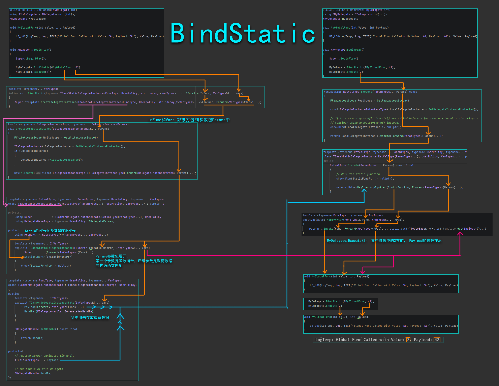

要存放一个函数，首先要有函数指针，其次是函数的参数，<br>
只要解决这两个问题，就可以实现委托机制.

`BindStatic`:
```cpp
template <typename... VarTypes>
inline void BindStatic(typename TBaseStaticDelegateInstance<FuncType, UserPolicy, std::decay_t<VarTypes>...>::FFuncPtr InFunc, VarTypes&&... Vars)
{
    Super::template CreateDelegateInstance<TBaseStaticDelegateInstance<FuncType, UserPolicy, std::decay_t<VarTypes>...>>(InFunc, Forward<VarTypes>(Vars)...);
}
```

`FuncType` 是 `void(int)`。<br>
`VarTypes...` 被推导为 `int`(因为 `42`)。<br>
`Super` 是 `UserPolicy::FDelegateExtras`，<br>
对于默认策略 `FDefaultDelegateUserPolicy` 就是 `TDelegateBase<FNotThreadSafeDelegateMode>`。<br>

所以这里实际调用的是基类 `TDelegateBase` 的 `CreateDelegateInstance` 模板函数，并传递`函数指针`和`载荷参数`。

`CreateDelegateInstance` :
```cpp
template<typename DelegateInstanceType, typename... DelegateInstanceParams>
void CreateDelegateInstance(DelegateInstanceParams&&... Params)
{
     // (1) 获取写作用域（线程安全/检测）
    FWriteAccessScope WriteScope = GetWriteAccessScope();              
     // (2) 获取已有实例
    IDelegateInstance* DelegateInstance = GetDelegateInstanceProtected();
    if (DelegateInstance)
    {
        // (3) 析构旧实例
        DelegateInstance->~IDelegateInstance();                         
    }
    new (Allocate(sizeof(DelegateInstanceType))) DelegateInstanceType(Forward<DelegateInstanceParams>(Params)...); 
    // (4) 构造新实例
}
```

`GetDelegateInstanceProtected()` 返回当前存储的 `IDelegateInstance*`。<br>
由于 `MyDelegate` 刚刚默认构造，`DelegateSize` 为 `0`，返回 `nullptr`，所以跳过析构。

`Allocate(sizeof(DelegateInstanceType))` 计算所需块数（每块 `FAlignedInlineDelegateType`，默认 16 字节对齐），<br>
然后调用 `DelegateAllocator.ResizeAllocation` 调整内存。<br>
`DelegateAllocator` 的类型是 `FDelegateAllocatorType::ForElementType<FAlignedInlineDelegateType>`，<br>
分配器返回指向内存的指针，该内存用于 `placement new`。

对于`BindStatic`这个例子:<br>
```cpp
template <typename... VarTypes>
inline void BindStatic(typename TBaseStaticDelegateInstance</**/>::FFuncPtr InFunc, VarTypes&&... Vars)
{
    Super::template CreateDelegateInstance<TBaseStaticDelegateInstance</**/>(InFunc, Forward<VarTypes>(Vars)...);
}
```
`new (地址) DelegateInstanceType(...)` <br>
在分配的内存上构造 `TBaseStaticDelegateInstance` 对象。<br>
`DelegateInstanceType` 是 `TBaseStaticDelegateInstance<void(int), FDefaultDelegateUserPolicy, int>`.


`TBaseStaticDelegateInstance` 的构造:
```cpp
template <typename RetValType, typename... ParamTypes, typename UserPolicy, typename... VarTypes>
class TBaseStaticDelegateInstance<RetValType(ParamTypes...), UserPolicy, VarTypes...>
    : public TCommonDelegateInstanceState<RetValType(ParamTypes...), UserPolicy, VarTypes...>
{
public:
    using FFuncPtr = RetValType(*)(ParamTypes..., VarTypes...);
    template <typename... InVarTypes>
    explicit TBaseStaticDelegateInstance(FFuncPtr InStaticFuncPtr, InVarTypes&&... Vars)
        : Super(Forward<InVarTypes>(Vars)...)
        , StaticFuncPtr(InStaticFuncPtr) 
        {}
    // ...
private:
    FFuncPtr StaticFuncPtr;
};
```

`Super` 是 `TCommonDelegateInstanceState<...>`，负责存储载荷和委托句柄。<br>
构造函数接收函数指针 `InStaticFuncPtr` 和载荷参数 `Vars...`（这里 42）。<br>
调用基类构造函数 `Super(Forward<InVarTypes>(Vars)...)` 将载荷传递给 `TCommonDelegateInstanceState`。<br>
将函数指针保存到 `StaticFuncPtr`。<br>


`TCommonDelegateInstanceState`:
```cpp
template <typename FuncType, typename UserPolicy, typename... VarTypes>
class TCommonDelegateInstanceState : IBaseDelegateInstance<FuncType, UserPolicy>
{
public:
    template <typename... InVarTypes>
    explicit TCommonDelegateInstanceState(InVarTypes&&... Vars)
        : Payload(Forward<InVarTypes>(Vars)...)
        , Handle(FDelegateHandle::GenerateNewHandle) 
        {}
    // ...
protected:
    TTuple<VarTypes...> Payload;
    FDelegateHandle Handle;
};
```
它利用 `TTuple` 存储载荷，并为这个绑定生成唯一的委托句柄。

---

执行:

```cpp
void MyGlobalFunc(int Value, int Payload) 
{
	UE_LOG(LogTemp, Log, TEXT("Global Func Called with Value: %d, Payload: %d"), Value, Payload)
}

void AMyActor::BeginPlay()
{
	Super::BeginPlay();
	
	MyDelegate.BindStatic(&MyGlobalFunc, 42);
	MyDelegate.ExecuteIfBound(2);
}
```

运行结果:
```cpp
LogTemp: Global Func Called with Value: 2, Payload: 42
```

```cpp
RetValType Execute(ParamTypes... Params) const
{
	FReadAccessScope ReadScope = GetReadAccessScope();

	const DelegateInstanceInterfaceType* LocalDelegateInstance = GetDelegateInstanceProtected();

	// If this assert goes off, Execute() was called before a function was bound to the delegate.
	// Consider using ExecuteIfBound() instead.
	checkSlow(LocalDelegateInstance != nullptr);

	return LocalDelegateInstance->Execute(Forward<ParamTypes>(Params)...);
}
```

当调用 `MyDelegate.Execute(2)` 时，`TDelegate::Execute` 最终调用委托实例的 `Execute` 方法。<br>
对于 `TBaseStaticDelegateInstance`，其 `Execute` 实现如下:

```cpp
RetValType Execute(ParamTypes... Params) const final
{
    // 将载荷与参数组合后调用函数指针
    return this->Payload.ApplyAfter(StaticFuncPtr, Forward<ParamTypes>(Params)...);
}
```

`ApplyAfter` 是 `TTuple` 的函数，它会将 `Params...` 作为前几个参数，将 Payload 中的元素作为剩余参数，一起调用 `StaticFuncPtr`。<br>
对于这个例子：<br>
`Params...` 是 `(int)`，即 `5`。<br>
`Payload` 包含一个 `int`，即 `42`。<br>
最终调用 `StaticFuncPtr(5, 42)`。<br>
因此，`42` 这个载荷值确实被保留并在执行时传递给了 `MyGlobalFunc`。<br>


`ApplyAfter` : 
```cpp
template <typename FuncType, typename... ArgTypes>
decltype(auto) ApplyAfter(FuncType&& Func, ArgTypes&&... Args) & 
{
    return ::Invoke(Func, Forward<ArgTypes>(Args)...
    , static_cast<TTupleBase&>(*this).template Get<Indices>()...);
}
```

`Indices` 是一个 `TIntegerSequence<uint32, 0, 1, ..., N-1>`，其中 N 是元组中元素的数量。<br>
`Get<Indices>()...` 会按顺序展开成 `Get<0>(), Get<1>(), ..., Get<N-1>()`，即元组的所有元素。<br>
因此，调用 `::Invoke(Func, Args..., 元素0, 元素1, ...)` 时，<br>
`Args...`（即 `Params...`）被放在前面，元组的元素被放在后面。<br>

在委托系统中，`Payload` 被存储为 `TTuple<VarTypes...>`，而执行时传入的参数就是 `ParamTypes...`.<br>
通过 `ApplyAfter`，正好实现了“委托签名参数在前，载荷参数在后”的调用约定，<br>
从而与 `CreateStatic / BindStatic` 中函数指针的类型 `Ret(*)(ParamTypes..., VarTypes...)` 完美匹配。


---


### 多播委托

```cpp
using FMyDelegate = TMulticastDelegate<void(int)>;
FMyDelegate MyDelegate;

void MyGlobalFunc(int Value, int Payload) 
{
	UE_LOG(LogTemp, Log, TEXT("Global Func Called with Value: %d, Payload: %d"), Value, Payload)
}

void AMyActor::BeginPlay()
{
	Super::BeginPlay();
	
	MyDelegate.AddStatic(&MyGlobalFunc,42);
	MyDelegate.Broadcast(2);
}
```
`AddStatic` :
```cpp
template <typename... VarTypes>
FDelegateHandle AddStatic(typename TBaseStaticDelegateInstance<void (ParamTypes...), UserPolicy, std::decay_t<VarTypes>...>::FFuncPtr InFunc, VarTypes&&... Vars)
{
	return Super::AddDelegateInstance(FDelegate::CreateStatic(InFunc, Forward<VarTypes>(Vars)...));
}
```

多播委托内部维护一个存放单播委托实例的数组，每个元素本质上就是一个单播委托的基类对象。<br>
当通过 `AddStatic`、`AddLambda` 等方法添加绑定时，<br>
内部会先用 `FDelegate::CreateStatic`或 `CreateLambda` 创建一个单播委托，然后将它存入数组。

在 `TMulticastDelegateBase` 中，调用列表的类型是:
```cpp
using UnicastDelegateType = TDelegateBase<FNotThreadSafeNotCheckedDelegateMode>;

using InvocationListType = TArray<UnicastDelegateType, FMulticastInvocationListAllocatorType>;

InvocationListType InvocationList;
```

也就是说，数组中存储的是 `TDelegateBase` 对象，而不是完整的 `TDelegate`。<br>
因为多播只需要存储委托实例本身 `IDelegateInstance*` 并提供 `Unbind`、`GetDelegateInstanceProtected` 等基础操作，<br>
不需要 `TDelegate` 中那些类型安全的绑定和执行的公共接口。<br>
这样设计既节省空间，也避免了不必要的模板实例化。

---

## AssetManager


---


## 动画蓝图


---

# Gameplay系统


## AI

### AI感知

感知系统为Pawn提供了一种从环境中接收数据的方式，例如噪音的来源、AI是否遭到破坏、或AI是否看到了什么。<br>
这通过 AI感知组件`AIPerceptionComponent` 来完成。<br>
该组件相当于刺激监听器，将收集已注册的刺激源。

刺激源被注册后将调用 `OnPerceptionUpdated` （或用于目标选择的 `OnTargetPerceptionUpdated` ）事件.<br>

---

#### 组件注册

```cpp
void UAIPerceptionComponent::OnRegister()
{
	AActor* Owner = GetOwner();
	AIOwner = Cast<AAIController>(Owner);
	UAIPerceptionSystem* AIPerceptionSys = UAIPerceptionSystem::GetCurrent(GetWorld());
	/* 注册感知 -省略- 见下图 */
}
```
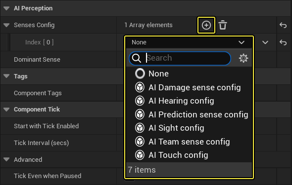

向 `UAIPerceptionSystem` 注册感知:

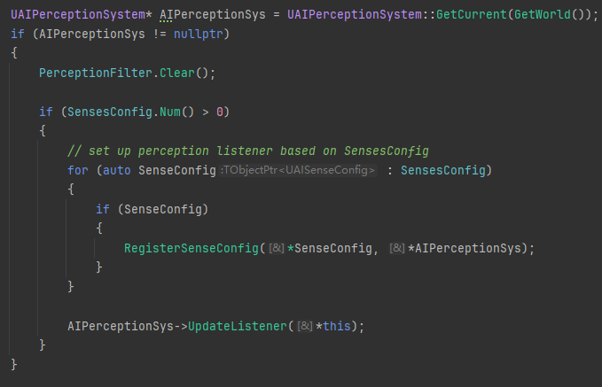


`UAIPerceptionSystem` 是哪里来的?

```cpp
void UAISystem::PostInitProperties()
{
	TSubclassOf<UAIPerceptionSystem> PerceptionSystemClass = LoadClass<UAIPerceptionSystem>(NULL, *PerceptionSystemClassName.ToString(), NULL, LOAD_None, NULL) 

	if (PerceptionSystemClass)
	{
		PerceptionSystem = NewObject<UAIPerceptionSystem>(this, PerceptionSystemClass, TEXT("PerceptionSystem"));
	}

	PawnBeginPlayDelegateHandle = APawn::OnPawnBeginPlay.AddUObject(this, &UAISystem::OnPawnBeginPlay);
}
```
<font color="yellow">注意</font>: `UAISystem`监听了Pawn的生成事件，每当有一个Pawn类被生成出来执行BeginPlay时，`UAISystem`都会响应这个动作.

`PerceptionSystemClass` 在`BaseEngine.ini`中定义 : 
```
[/Script/AIModule.AISystem]
PerceptionSystemClassName=/Script/AIModule.AIPerceptionSystem
```

所以 `UAIPerceptionSystem` 是由`UAISystem`创建的， <br>
那么 `UAISystem`是哪里来的?

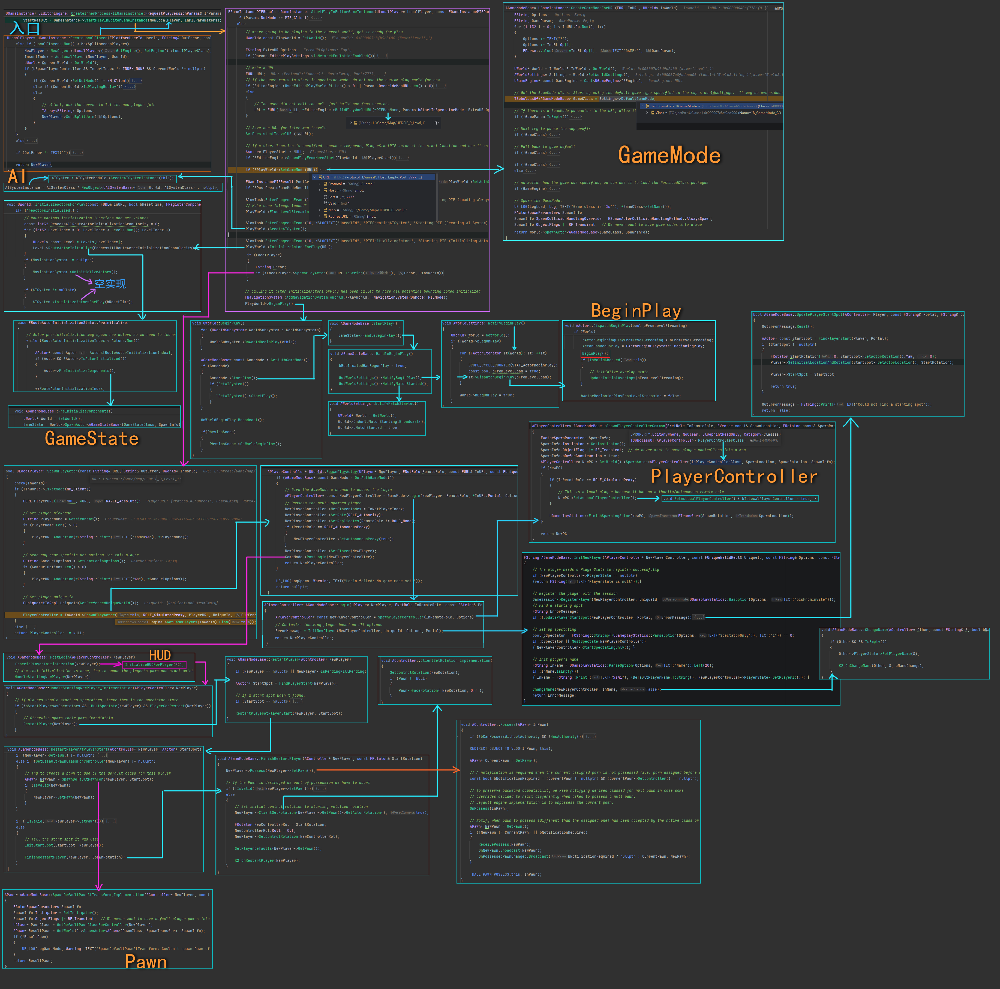

上图左上角的`AI`部分 就是创建`UAISystem`的地方 - `UWorld::CreateAISystem()`<br>

```cpp
TSubclassOf<UAISystemBase> AISystemClass = LoadClass<UAISystemBase>(nullptr, *AISystemClassName.ToString(), nullptr, LOAD_None, nullptr);

AISystemInstance = AISystemClass ? NewObject<UAISystemBase>(World, AISystemClass) : nullptr;
```
加载`AISystemClassName`指定的类，在`BaseEngine.ini`中定义:
```
[/Script/Engine.AISystemBase]
AISystemModuleName=AIModule
AISystemClassName=/Script/AIModule.AISystem
```

---

整理一下，<br>
`BaseEngine.ini` 定义了要创建的 `AISystemClassName`， 在 `UWorld` 初始化时 创建指定的 `AISystem` 类，<br>
之后，在 `AISystem` 的 `PostInitProperties` 中，创建 `UAIPerceptionSystem` 感知系统，

---

回到`AIPerceptionComponent` :
```cpp
void UAIPerceptionComponent::OnRegister()
{
	UAIPerceptionSystem* AIPerceptionSys = UAIPerceptionSystem::GetCurrent(GetWorld());
	if (AIPerceptionSys != nullptr)
	{
		PerceptionFilter.Clear();

		if (SensesConfig.Num() > 0)
		{
			// set up perception listener based on SensesConfig
			for (auto SenseConfig : SensesConfig)
			{
				if (SenseConfig)
				{
					RegisterSenseConfig(*SenseConfig, *AIPerceptionSys);
				}
			}

			AIPerceptionSys->UpdateListener(*this);
		}
	}
}
```

在组件注册时，把组件中配置的感知属性 注册到 `UAIPerceptionSystem` 感知系统中， 如下代码 :<br>
```cpp
void UAIPerceptionComponent::RegisterSenseConfig(UAISenseConfig& SenseConfig, UAIPerceptionSystem& AIPerceptionSys)
{
	const TSubclassOf<UAISense> SenseImplementation = SenseConfig.GetSenseImplementation();
	if (SenseImplementation)
	{
		// make sure it's registered with perception system
		const FAISenseID SenseID = AIPerceptionSys.RegisterSenseClass(SenseImplementation);
	}
	/*...*/
}
```

举例说明注册过程：

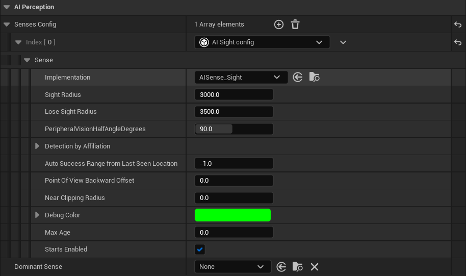

以此图为例，`SenseConfig`下面可以添加各种`Config`，<br>
上图添加了`AISightConfig`，第一个配置项`Implementation`是具体的`UAISense`类，<br>
```cpp
const TSubclassOf<UAISense> SenseImplementation = SenseConfig.GetSenseImplementation();
const FAISenseID SenseID = AIPerceptionSys.RegisterSenseClass(SenseImplementation);
```
这里获取的就是`AISightConfig`里面的`Implementation`类， 将其传给`UAIPerceptionSystem`.<br>
```cpp
UPROPERTY()
TArray<TObjectPtr<UAISense>> Senses;
	
FAISenseID UAIPerceptionSystem::RegisterSenseClass(TSubclassOf<UAISense> SenseClass)
{
	FAISenseID SenseID = UAISense::GetSenseID(SenseClass);
	if (Senses[SenseID] == nullptr)
	{
		Senses[SenseID] = NewObject<UAISense>(this, SenseClass);
	}
}
```

这里就有一个问题:<br>
为什么要使用 `if (Senses[SenseID] == nullptr)` 判断是否存在某个`UAISense`类？

```cpp
static FAISenseID GetSenseID(const TSubclassOf<UAISense> SenseClass) 
{ 	return SenseClass 
	? ((const UAISense*)SenseClass->GetDefaultObject())->SenseID 
	: FAISenseID::InvalidID(); 
}
```

`GetSenseID`获取的是CDO的ID，而CDO只有一个，<br>

一个AI控制器里面有一个`UAIPerceptionComponent`组件，这个组件里面又有`SenseConfig`，<br>
游戏运行时，场上可以有多个AI控制器，这些AI控制器里面的 `感知组件` 要向感知系统`UAIPerceptionSystem`注册`UAISense`，<br>

`UAIPerceptionSystem` 却使用 `UAISense` CDO的ID 来判断一个`UAISense`是否存在，<br>
这就会导致 场上的所有AI控制器 共享同一个 `UAISense` 类 (因为CDO只有一个)， 也就是 `NewObject` 创造出来的那一个`UAISense`:
```cpp
Senses[SenseID] = NewObject<UAISense>(this, SenseClass);
```

---

```cpp
void UAIPerceptionComponent::OnRegister()
{
	UAIPerceptionSystem* AIPerceptionSys = UAIPerceptionSystem::GetCurrent(GetWorld());
	if (AIPerceptionSys != nullptr)
	{
		// set up perception listener based on SensesConfig
		for (auto SenseConfig : SensesConfig)
		{
			if (SenseConfig)
			{
				RegisterSenseConfig(*SenseConfig, *AIPerceptionSys);
			}
		}
		AIPerceptionSys->UpdateListener(*this);	
	}
}
```

在NewObject完了之后，`UpdateListener(*this)` : 组件将作为 `Listener` 向 `UAIPerceptionSystem` 进行注册，<br>

`Listener`这个词描述了这样的情况: `UAISense`会发出消息，组件来监听消息.


```cpp
void UAIPerceptionSystem::UpdateListener(UAIPerceptionComponent& Listener)
{
	const FPerceptionListenerID ListenerId = Listener.GetListenerId();
	if (ListenerId != FPerceptionListenerID::InvalidID())
	{
		FPerceptionListener& ListenerEntry = ListenerContainer[ListenerId];
		ListenerEntry.UpdateListenerProperties(Listener);
		OnListenerUpdate(ListenerEntry);
	}
	else
	{			
		const FPerceptionListenerID NewListenerId = FPerceptionListenerID::GetNextID();
		Listener.StoreListenerId(NewListenerId);
		FPerceptionListener& ListenerEntry = ListenerContainer.Add(NewListenerId, FPerceptionListener(Listener));
		ListenerEntry.CacheLocation();
				
		OnNewListener(ListenerContainer[NewListenerId]);
	}
}
```

当组件第一次向 `UAIPerceptionSystem` 注册时，组件是没有ID的，
```cpp
if (ListenerId != FPerceptionListenerID::InvalidID())
```
这个条件判断为`false`， 所以会走下面这个分支:
```cpp
const FPerceptionListenerID NewListenerId = FPerceptionListenerID::GetNextID();
Listener.StoreListenerId(NewListenerId);
FPerceptionListener& ListenerEntry = ListenerContainer.Add(NewListenerId, FPerceptionListener(Listener));
ListenerEntry.CacheLocation();
				
OnNewListener(ListenerContainer[NewListenerId]);
```

这段代码给组件分配一个ID，一个ID对应一个组件，存放在TMap里 :
```cpp
TMap<FPerceptionListenerID, FPerceptionListener> ListenerContainer
```

`CacheLocation` 缓存AI控制器 所控制的`Pawn` 的位置和旋转.<br>

```cpp
void UAIPerceptionSystem::OnNewListener(const FPerceptionListener& NewListener)
{
	for (UAISense* const SenseInstance : Senses)
	{
		// @todo filter out the ones that do not declare using this sense
		if (SenseInstance != nullptr && NewListener.HasSense(SenseInstance->GetSenseID()))
		{
			SenseInstance->OnNewListener(NewListener);
		}
	}
}
```

`OnNewListener` 通知所有`Sense`感官，这些`SenseInstance`可以获得AI控制器里面的感官组件.


---

#### Pawn的信息

要让AI拥有感知，AI首先要知道场上的角色或者玩家的信息.

```cpp
void UAISystem::PostInitProperties()
{
	PerceptionSystem = NewObject<UAIPerceptionSystem>(this, PerceptionSystemClass, TEXT("PerceptionSystem"));

	PawnBeginPlayDelegateHandle = APawn::OnPawnBeginPlay.AddUObject(this, &UAISystem::OnPawnBeginPlay);
}

void UAISystem::OnPawnBeginPlay(APawn* Pawn)
{
	PerceptionSystem->OnNewPawn(*Pawn);
}

void UAIPerceptionSystem::OnNewPawn(APawn& Pawn)
{
	for (UAISense* Sense : Senses)
	{
		FAISenseID SenseID = Sense->GetSenseID();
		SourcesToRegister.AddUnique(FPerceptionSourceRegistration(SenseID, &SourceActor));
	}
}

TArray<FPerceptionSourceRegistration> SourcesToRegister;
```

当有一个新的Pawn被生成时，AI系统会做出响应，`OnNewPawn` 将这个Pawn注册到AI系统中.<br>
每一个`UAISense`都会获得Pawn的信息.

`SourcesToRegister` 保存每个`UAISense`的ID和Pawn，在 `Tick` 时处理它们:

```cpp
void UAIPerceptionSystem::Tick(float DeltaSeconds)
{
	if (SourcesToRegister.Num() > 0)
	{
		PerformSourceRegistration();
	}
}
```
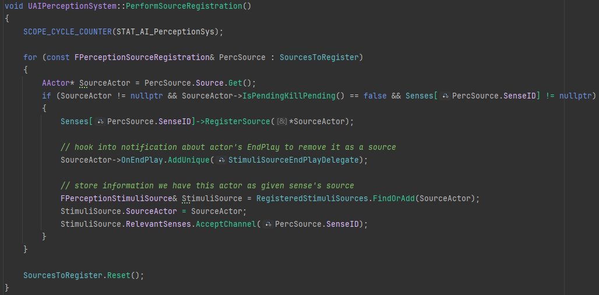

当Pawn销毁时，也有对应的操作，上图代码中绑定了Pawn的`OnEndPlay`事件，
```cpp
UAIPerceptionSystem::UAIPerceptionSystem()
{
	StimuliSourceEndPlayDelegate.BindDynamic(this, &UAIPerceptionSystem::OnPerceptionStimuliSourceEndPlay);
}

void UAIPerceptionSystem::OnPerceptionStimuliSourceEndPlay(AActor* Actor, EEndPlayReason::Type EndPlayReason)
{
	UnregisterSource(*Actor);
}
```

在Pawn销毁时，反向执行前面的逻辑，前面添加了 这里就要移除.

---

#### 视觉感知


`AIPerceptionComponent` 可以配置AI感知，<br>
`AISightConfig` 包含一些特有的配置项，`AISense_Sight`只有一份，而`Config`里的数据是动态创建的，可以有多种不同配置参数.<br>
问题:`Config`数据如何传给`AISense_Sight` ?

`AISense_Sight` 是由感知系统使用 `NewObject` 创建出来的，所以 从`NewObject`开始追踪数据.

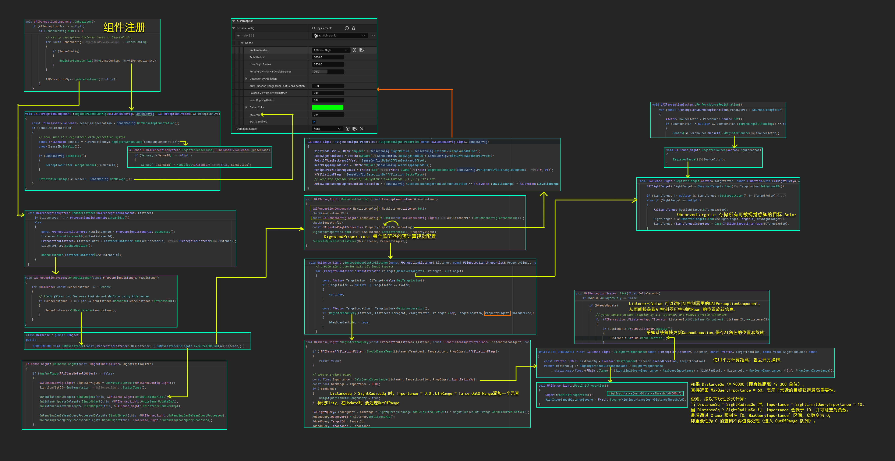

`AISense_Sight` 的核心在于`Update`函数.

`Update`函数的操作如下:<br>
由于遍历次数是 `SightQueriesInRange` 和 `SightQueriesOutOfRange` 的数量总和，<br>
所以需要 `InRangeItr` 和 `OutOfRangeItr` 来标记两个数组的遍历索引，<br>
因为是同时遍历两个数组，所以在每次遍历时 要比较两个数组中取出的元素的分数，<br>
哪个分数高，就优先计算哪个元素，<br>

`SightQuery` 可以代表一个`AIPerceptionComponent`，<br>
也就是说 `SightQuery` 可以获得AI控制器所控制的角色信息，<br>
有了AI角色的信息 也有了 `ObservedTargets` 数组保存的其他 `Pawn` 的信息 ，<br>
这样就可以计算一个AI角色和所有其他 `Pawn` 的位置，判断AI能否看到某个 `Pawn` ，<br>

然后遍历每个 `SightQuery` ，计算每个AI角色能否看到其他 `Pawn`.<br>

如果能看到某个 `Pawn`，就把这个 `Pawn` 传给 `AIPerceptionComponent` ，<br>

之后 在 `UAIPerceptionSystem::Tick` 下，处理每个 `AIPerceptionComponent` 看到的Pawn，
触发 `OnTargetPerceptionUpdated` 传给蓝图 . 

---

在`UAISense_Sight::GenerateQueriesForListener`函数中，<br>
把ObservedTargets里的每一个Actor 都注册到Query中，一个Listener可以对应多个Actor，<br>
实际上 这里是这样做的:注册多个Query，每个Query保存一个Listener和一个Actor的对应关系

所以在 `Update()` 中:
```cpp
FPerceptionListener& Listener = ListenersMap[SightQuery->ObserverId];
FAISightTarget& Target = ObservedTargets[SightQuery->TargetId];

AActor* TargetActor = Target.Target.Get();
UAIPerceptionComponent* ListenerPtr = Listener.Listener.Get();
```

在多次遍历过程中，这一段的 `ListenerPtr` 有可能是同一个组件，而 `TargetActor` 是不同的.


---

```cpp
void UAIPerceptionSystem::Tick(float DeltaSeconds)
{
	for (UAISense* const SenseInstance : Senses)
	{
		if (SenseInstance != nullptr)
		{
			SenseInstance->Tick();
		}
	}

	for (AIPerception::FListenerMap::TIterator ListenerIt(ListenerContainer); ListenerIt; ++ListenerIt)
	{
		check(ListenerIt->Value.Listener.IsValid());

		if (ListenerIt->Value.HasAnyNewStimuli())
		{
			ListenerIt->Value.ProcessStimuli();
		}
	}
}

void FPerceptionListener::ProcessStimuli()
{
	ensure(bHasStimulusToProcess);
	Listener->ProcessStimuli();
	bHasStimulusToProcess = false;
}
```

`Update`是由`UAIPerceptionSystem::Tick`驱动的，<br>
在 `UAISense` 处理完 `Update` 之后， <br>
调用`UAIPerceptionComponent::ProcessStimuli`，处理刺激源，也就是看到的 `Pawn`.

接着，下图中的函数 会被调用 :

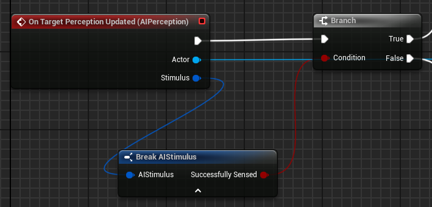


---


#### 伤害感知

伤害类没有那么多操作，伤害是一对一的，<br>
玩家A伤害了一个AI，只有受到伤害的 AI 自己会收到感知刺激，其他 AI 并不会自动得知这个伤害事件.

`UAISense_Damage` 提供了一个蓝图可调用的静态函数，
```cpp
void UAISense_Damage::ReportDamageEvent(UObject* WorldContextObject, 
AActor* DamagedActor, AActor* Instigator, float DamageAmount, 
FVector EventLocation, FVector HitLocation, 
FName Tag/* = NAME_None*/)
{
	UAIPerceptionSystem* PerceptionSystem = UAIPerceptionSystem::GetCurrent(WorldContextObject);
	if (PerceptionSystem)
	{
		FAIDamageEvent Event(DamagedActor, Instigator, DamageAmount, EventLocation, HitLocation, Tag);
		PerceptionSystem->OnEvent(Event);
	}
}
```
向 `UAIPerceptionSystem` 报告事件，`OnEvent` 是一个模板函数:
```cpp
template<typename FEventClass, typename FSenseClass = typename FEventClass::FSenseClass>
void OnEvent(const FEventClass& Event)
{
	const FAISenseID SenseID = UAISense::GetSenseID<FSenseClass>();
	if (Senses.IsValidIndex(SenseID) && Senses[SenseID] != nullptr)
	{
		((FSenseClass*)Senses[SenseID])->RegisterEvent(Event);
	}
	// otherwise there's no one interested in this event, skip it.
}

template<typename TSense>
static FAISenseID GetSenseID() 
{ 
	return GetDefault<TSense>()->GetSenseID();
}
```
这个模板函数要求声明`FSenseClass`，用于查找对应的 `SenseID` : <br>
`FAIDamageEvent` 声明了 `FSenseClass`  是 `UAISense_Damage` 类.
```cpp
USTRUCT(BlueprintType)
struct FAIDamageEvent
{	
	GENERATED_USTRUCT_BODY()

	typedef class UAISense_Damage FSenseClass;
}
```

所以 会来到下面这个函数:
```cpp
void UAISense_Damage::RegisterEvent(const FAIDamageEvent& Event)
{
	if (Event.IsValid())
	{
		RegisteredEvents.Add(Event);

		RequestImmediateUpdate();
	}
}
```

在`Update`中 处理`RegisteredEvents`。


---


#### 听觉感知

听觉感知是群体事件，所有AI都会受到影响.<br>
可以模拟声音传播的速度，距离事发地点远的AI 会延迟做出反应.

```cpp
class UAISense_Hearing : public UAISense
{
	GENERATED_UCLASS_BODY()
		
protected:
	/** Defaults to 0 to have instant notification. Setting to > 0 will result in delaying 
	 *	when AI hears the sound based on the distance from the source */
	UPROPERTY(config)
	float SpeedOfSoundSq;
}
```

`SpeedOfSoundSq` : 默认值设为 0 以实现即时通知。<br>
将该值设置为大于 0 的数值，则会根据声音源与设备之间的距离来延迟 AI 听到声音的时间.

这个变量在`BaseGame.ini`中配置:
```
[/Script/AIModule.AISense_Hearing]
SpeedOfSoundSq=0
```

`UAISense_Hearing` 依旧提供了蓝图函数 `ReportNoiseEvent` 用来上传事件，<br>

---


#### 预测

`UAISense_Prediction` 根据玩家的位置和速度，预测N秒后 玩家的位置.

这个行为是单个AI的行为，并非群体行为，例如 听觉感知是群体行为.

依然提供了静态的蓝图函数，

```cpp
static void RequestControllerPredictionEvent(AAIController* Requestor, AActor* PredictedActor, float PredictionTime);

static void RequestPawnPredictionEvent(APawn* Requestor, AActor* PredictedActor, float PredictionTime);

struct FAIPredictionEvent 
{
    AActor* Requestor;        // 请求者（通常是 AI Controller）
    AActor* PredictedActor;   // 要被预测的目标
    float TimeToPredict;      // 预测多少秒后的位置
};
```
`Update` :
```cpp
float UAISense_Prediction::Update()
{
    for (const FAIPredictionEvent& Event : RegisteredEvents)
    {
        // 1. 有效性检查
        if (Event.Requestor && Event.PredictedActor)
        {
            // 2. 获取请求者的感知组件
            IAIPerceptionListenerInterface* PerceptionListener = Cast<...>(Event.Requestor);
            UAIPerceptionComponent* PerceptionComponent = PerceptionListener->GetPerceptionComponent();
            
            // 3. 确认监听器存在且启用了本感知
            if (PerceptionComponent && ListenersMap.Contains(PerceptionComponent->GetListenerId())
                && Listener.HasSense(GetSenseID()))
            {
                // 4. 计算预测位置：当前位置 + 速度 × 时间
                const FVector PredictedLocation = 
				Event.PredictedActor->GetActorLocation() + 
				Event.PredictedActor->GetVelocity() * Event.TimeToPredict;

                // 5. 注册为刺激（强度固定为 1.0）
                Listener.RegisterStimulus(Event.PredictedActor, 
                    FAIStimulus(*this, 1.f, PredictedLocation, Listener.CachedLocation));
            }
        }
    }
    RegisteredEvents.Reset();
    return SuspendNextUpdate; 
}
```

---


#### 团队

感知组件的拥有者向团队报告 有人在附近（发送该事件的游戏代码也会发送半径距离）.


这个类没有提供静态蓝图函数，还要自己写.

```cpp
FAITeamStimulusEvent::FAITeamStimulusEvent
(
	AActor* InBroadcaster, AActor* InEnemy, 
	const FVector& InLastKnowLocation, 
	float EventRange, float PassedInfoAge, float InStrength
)
	: LastKnowLocation(InLastKnowLocation), RangeSq(FMath::Square(EventRange)), InformationAge(PassedInfoAge), Strength(InStrength), Broadcaster(InBroadcaster), Enemy(InEnemy)
{
	CacheBroadcastLocation();

	TeamIdentifier = FGenericTeamId::GetTeamIdentifier(InBroadcaster);
}
```

只要填充 `Event` 的构造函数即可，

---


#### 触碰

触碰是一对一，单个AI的行为.

让 AI 能够感知到与其他 Actor 的物理接触（例如被玩家近战攻击、碰撞或触碰）。<br>
当发生接触事件时，可以主动报告，AI 会收到一个刺激，从而做出反应（如受击反馈、警戒等）。

举例而言，在潜入类型的游戏中，可能希望玩家在不接触敌方AI的情况下偷偷绕过他们。<br>
使用此感官可以确定玩家与AI发生接触，并能用不同逻辑做出响应。

```cpp
struct FAITouchEvent 
{
    AActor* TouchReceiver;  // 被触碰的 Actor（通常是 AI 自身或 AI 控制的角色）
    AActor* OtherActor;     // 触碰的发起者（例如玩家）
    FVector Location;       // 触碰发生的位置
};
```


---

### 行为树

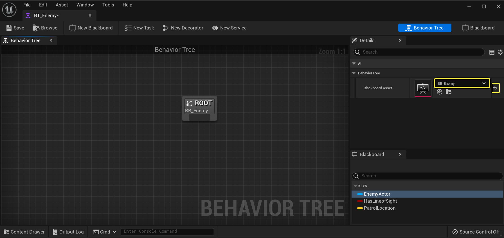

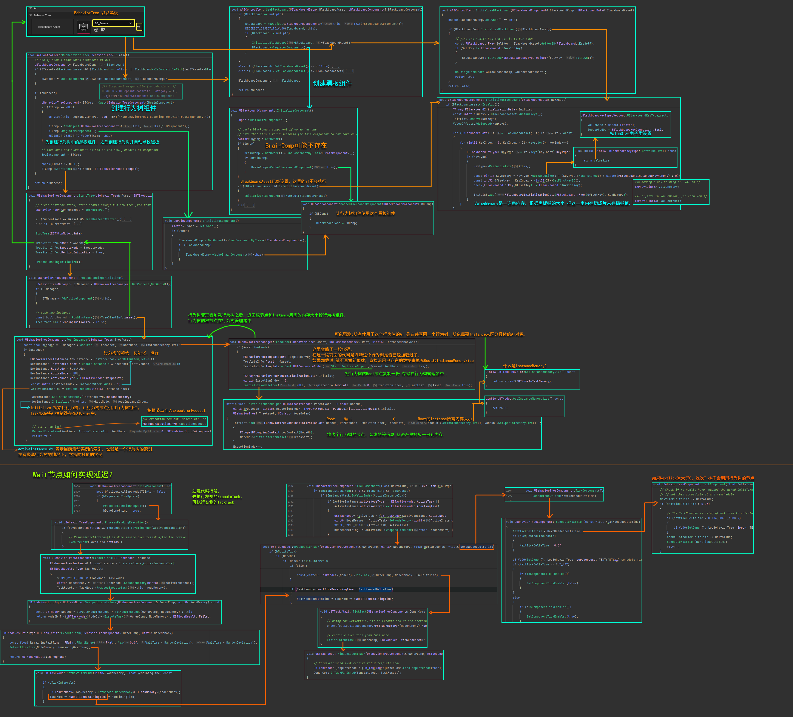

上图简单的追踪了一下代码，描述了行为树的加载、节点的执行.

在行为树组件的`TickComponent`中，先使用`ExecuteOnEachAuxNode`执行辅助节点的Tick，<br>
辅助节点包括装饰器、Service，在它们执行之后 才Tick那些普通的节点，

---


#### 装饰器

装饰器 是放置在父-子连接上的辅助节点，能够接收执行流程的通知并可以被 `Tick` .

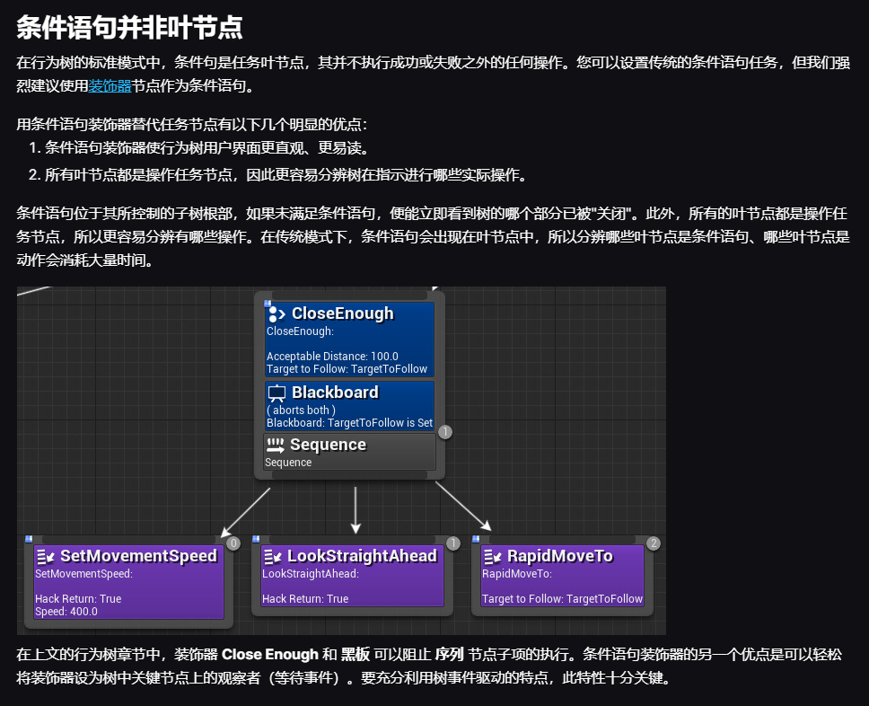

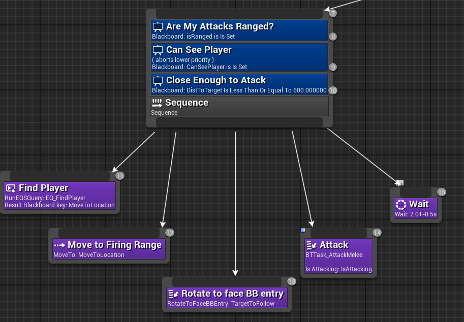


在 `ActionRPG` 中，也是使用装饰器来判断一些条件，决定这个分支要不要执行.

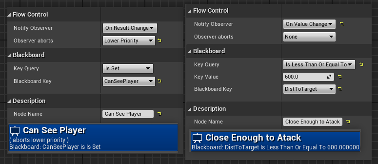

装饰器监听了 `BlackBoardKey` 值的变化，<br>
当某个装饰器执行时，行为树组件会执行这个装饰器的`WrappedOnBecomeRelevant`函数，函数内部会监听值的变化，<br>

每次 `SetBlackboardValueaAsObject` 之类的函数被调用时，对应装饰器的监听就会被触发,

---

Q:上图有两个装饰器 `CanSeePlayer`和`CloseEnoughToAcack`，它们的区别是什么？

A:左侧使用`ResultChange` 右侧使用`ValueChange`

`EBTDecoratorAbortRequest::ConditionResultChanged`<br>
`EBTDecoratorAbortRequest::ConditionPassing

`ResultChange` 对应 `ConditionResultChanged`<br>
在 `ConditionalFlowAbort` 中，只有当条件结果发生变化（即 `bIsExecutingBranch != bPass`）时，才会请求中止。

`ValueChange` 对应 `ConditionPassing`<br>
除了结果变化会触发外，只要正在执行该分支且条件为真（`bIsExecutingBranch && bPass`），即使结果未变，也会强制请求中止。

当所选的 `BlackboardKey` 的值发生变化时，下面的函数会触发:
```cpp
EBlackboardNotificationResult UBTDecorator_Blackboard::OnBlackboardKeyValueChange(const UBlackboardComponent& Blackboard, FBlackboard::FKey ChangedKeyID)
{
	if (BlackboardKey.GetSelectedKeyID() == ChangedKeyID)
	{
		// can't simply use BehaviorComp->RequestExecution(this) here, we need to support condition/value change modes

		const EBTDecoratorAbortRequest RequestMode = 
		(NotifyObserver == EBTBlackboardRestart::ValueChange) 
		? EBTDecoratorAbortRequest::ConditionPassing 
		: EBTDecoratorAbortRequest::ConditionResultChanged;

		ConditionalFlowAbort(*BehaviorComp, RequestMode);
	}

	return EBlackboardNotificationResult::ContinueObserving;
}
```

```cpp
void UBTDecorator::ConditionalFlowAbort(UBehaviorTreeComponent& OwnerComp, EBTDecoratorAbortRequest RequestMode) const
{
	const bool bIsExecutingBranch = OwnerComp.IsExecutingBranch(this, GetChildIndex());
	const bool bPass = WrappedCanExecute(OwnerComp, NodeMemory);
	const bool bAlwaysRequestWhenPassing = (RequestMode == EBTDecoratorAbortRequest::ConditionPassing);

	if (bIsExecutingBranch != bPass)
	{
		OwnerComp.RequestExecution(this);
	}
	else if (bIsExecutingBranch && bPass && (bAlwaysRequestWhenPassing || bAbortPending))
	{
		// force result Aborted to restart from this decorator
		OwnerComp.RequestExecution(GetParentNode(), InstanceIdx, this, GetChildIndex(), EBTNodeResult::Aborted);
	}
}
```

`bIsExecutingBranch`：表示该装饰器所在的子分支当前是否正在被执行。<br>
例如，如果行为树正在运行该子节点（或其子树），则为 true；否则为 false。

`bPass`：表示装饰器条件当前是否满足，`IsSet`是否为`true`

```cpp
if (bIsExecutingBranch != bPass)
```
这个 if 的含义是:

|bIsExecutingBranch|bPass|相等|含义|
|---|---|---|---|
|false|true|yes|分支未执行，且条件不满足 → 正常，无需干预。|
|false|true|no|分支未执行，但条件已满足 → 应该进入该分支。|
|true|false|yes|分支正在执行，但条件不再满足 → 应该退出该分支。|
|true|true|no|分支正在执行，且条件满足 → 正常，但 ValueChange 模式下仍可能因值变化而强制重启。|

```cpp
else if (bIsExecutingBranch && bPass && (bAlwaysRequestWhenPassing || bAbortPending))
```
这个 if 的含义是:<br>

当前子分支在执行，并且`IsSet`或`IsNotSet`这样的条件满足，<br>
但是多了一个`bAlwaysRequestWhenPassing`<br>
如果`bAlwaysRequestWhenPassing`为true，就意味着目前模式是`ValueChange`.

`ValueChange` 模式：装饰器检查 `距离 ≤ 600`，AI 正在攻击（分支执行），距离从 580 变为 590（仍 ≤600）。<br>
此时 `bIsExecutingBranch = true`, `bPass = true`, `bAlwaysRequestWhenPassing = true`<br> 
→ 条件成立 → 请求中止 → 行为树重启，攻击任务被中断，重新从分支开始执行（可能重新移动或攻击）。

对比:<br>
`ResultChange` 模式：同样场景，`bAlwaysRequestWhenPassing = false`，条件不成立 → 不会请求中止，攻击任务继续执行。

---


为什么 `CloseEnoughtoAttack` 会导致行为树每次 `DistToTarget` 变化时都从 `Sequence` 最左边的节点重新执行？

当 `DistToTarget` 变化时（例如 590 → 580），装饰器请求中止当前分支。<br>
父节点 `Sequence` 收到 `Aborted` 结果后，会重新评估所有子节点。<br>
因此，`CanSeePlayer` 再次被检查，子节点A可能再次执行，然后才进入子节点B（攻击任务）。<br>
结果：攻击任务被频繁中断，永远无法完成一次完整攻击。<br>

---


#### 服务

行为树服务 节点旨在执行“后台”任务，更新 AI 的知识 <br>
与任务不同，它们不返回任何结果，也不能直接影响执行流程。<br>

 *  通常，服务会执行周期性的检查（参见 TickNode），并将结果存储在黑板中。
 *  如果其下方的任何装饰器节点需要提前获得检查结果，请使用 `OnSearchStart` 函数。
 *  请注意，在那里执行的任何检查都必须瞬时完成！

另一个典型用例是在执行特定分支时创建标记（参见 `OnBecomeRelevant`、`OnCeaseRelevant`）,<br>
通过在黑板中设置一个标志来实现。

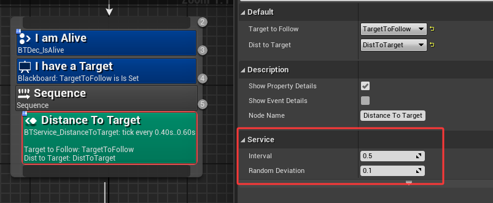

服务节点 可以设置该节点Tick的间隔，决定每隔多久执行一次这个服务的Tick.

```cpp
void UBTService::ScheduleNextTick(UBehaviorTreeComponent& OwnerComp, uint8* NodeMemory)
{
	const float NextTickTime = FMath::FRandRange(FMath::Max(0.0f, Interval - RandomDeviation), (Interval + RandomDeviation));
	SetNextTickTime(NodeMemory, NextTickTime);
}

void UBTAuxiliaryNode::SetNextTickTime(uint8* NodeMemory, float RemainingTime) const
{
	if (bTickIntervals)
	{
		FBTAuxiliaryMemory* AuxMemory = GetSpecialNodeMemory<FBTAuxiliaryMemory>(NodeMemory);

		AuxMemory->NextTickRemainingTime = RemainingTime;
	}
}

/*--------------------------*/
bool UBTAuxiliaryNode::WrappedTickNode(UBehaviorTreeComponent& OwnerComp, uint8* NodeMemory, float DeltaSeconds, float& NextNeededDeltaTime) const
{
	FBTAuxiliaryMemory* AuxMemory = GetSpecialNodeMemory<FBTAuxiliaryMemory>(NodeMemory);

	AuxMemory->NextTickRemainingTime -= DeltaSeconds;
	AuxMemory->AccumulatedDeltaTime += DeltaSeconds;

	const bool bTick = AuxMemory->NextTickRemainingTime <= 0.0f;
	if (bTick)
	{
		 UseDeltaTime = AuxMemory->AccumulatedDeltaTime;
		 AuxMemory->AccumulatedDeltaTime = 0.0f;
    
		 const_cast<UBTAuxiliaryNode*>(NodeOb)->TickNode(OwnerComp, NodeMemory, UseDeltaTime);
	}
}
```

---


## 网络

### Windows网络


接下来的两节 `客户端` 和 `服务端` 是一个用于测试的 `回显程序`，<br>
客户端给服务端发送一个数据，服务端会把这个数据发回给客户端.

#### 客户端


[Winsocket 客户端代码](https://learn.microsoft.com/zh-cn/windows/win32/winsock/complete-client-code)

客户端行为流程:
```cpp
[启动程序，附带参数 "127.0.0.1"]
    ↓
1. WSAStartup                        加载 Winsock 库
    ↓
2. getaddrinfo(argv[1], "27015")     解析服务器地址，返回地址链表
    ↓
3. 遍历地址链表
   ├─ socket()                       尝试创建Socket
   ├─ connect()                      尝试连接
   └─ 若失败则继续下一个地址，直到成功或链表耗尽
    ↓
4. freeaddrinfo()                    释放地址链表
    ↓
5. send("this is a test")            发送测试数据
    ↓
6. shutdown(SD_SEND)                 关闭发送方向（告知服务器“我说完了”）
    ↓
7. do-while 循环 recv()              不断接收服务器回显，直到 recv 返回 0
    ↓ (recv 返回 0)
8. closesocket()                     关闭Socket
    ↓
9. WSACleanup()                      卸载 Winsock
    ↓
[程序退出]
```

---

创建 WSAS:
```cpp
WSADATA wsaData;
int iResult = WSAStartup(MAKEWORD(2, 2), &wsaData);

WSACleanup();
```

`WSAStartup` 函数通过进程启动 `Winsock DLL` 的使用.<br>
如果成功， `WSAStartup` 函数返回零.

`MAKEWORD(2,2)` :调用方可以使用的最高版本的 Windows Socket规范。 
高序字节指定次要版本号;低序字节指定主版本号。<br>

应用程序或 DLL 只能在成功调用 `WSAStartup` 后发出进一步的 Windows Socket函数。

`_WIN64` 的`WSAData`
```cpp
typedef struct WSAData 
{
	WORD            wVersion;
    WORD            wHighVersion;

    unsigned short  iMaxSockets;
    unsigned short  iMaxUdpDg;
    char FAR *      lpVendorInfo;

    char            szDescription[WSADESCRIPTION_LEN+1];
    char            szSystemStatus[WSASYS_STATUS_LEN+1];
}
```
`wHighVersion` 成员指示 `Winsock DLL` 支持的 `Windows` Socket规范的最高版本。<br> 
`wVersion` 成员指示 `Winsock DLL` 预期调用方使用的 `Windows` Socket规范的版本。

`iMaxSockets` `iMaxUdpDg` `lpVendorInfo`  Socket2以及更高版本 应忽略这几个成员.

使用完 `Winsock DLL` 的服务后，应用程序必须调用 `WSACleanup` ，<br>
以允许 `Winsock DLL` 释放应用程序使用的内部 `Winsock` 资源。

如果应用程序调用 `WSAStartup` 三次，则必须调用 `WSACleanup` 三次。 <br>
`WSACleanup` 的前两个调用除了递减内部计数器外，什么都不做;<br>
最终的 `WSACleanup` 调用会为 任务执行所需要的资源 解除分配。

---

`main` 的参数:

```cpp
int __cdecl main(int argc, char** argv)
{
	if (argc != 2) 
	{
   		printf("usage: %s server-name\n", argv[0]);
		system("pause");
    	return 1;
	}
}
```

`argc` 参数数量，`argv` 参数字符. <br>
在CMD中运行 `Winsocket.exe 127.0.0.1`，<br>

```
argv[0]	= "Winsocket.exe" 
argv[1]	= "127.0.0.1" 
```


`if (argc != 2)` 刚好输入了参数。<br>
如果直接双击 `exe` 运行（`argc == 1`），会打印提示并退出，防止后续代码因 `argv[1]` 不存在而崩溃。

双击 `exe` 运行，`argv[0]` 就是这个 `exe` 的路径地址.

---

连接端口:

```cpp
int getaddrinfo
(
	 // 主机名或 IP 地址字符串
    const char* pNodeName,      

	// 端口号或服务名（如 "http"）
    const char* pServiceName,  

	// 输入筛选条件
    const struct addrinfo* pHints,

	// 输出结果链表
    struct addrinfo** ppResult    
);
```

```cpp
#define DEFAULT_PORT "27015"
int __cdecl main(int argc, char** argv)
{
	struct addrinfo* result = nullptr;
	struct addrinfo  hints;

	ZeroMemory(&hints, sizeof(hints));

	// 不限定 IPv4 还是 IPv6
	hints.ai_family = AF_UNSPEC;

	// 只要流式Socket（TCP）
	hints.ai_socktype = SOCK_STREAM;

	// 只要 TCP 协议
	hints.ai_protocol = IPPROTO_TCP;

	iResult = getaddrinfo(argv[1], DEFAULT_PORT, &hints, &result);
	
	if (iResult != 0)
	{
		printf("getaddrinfo failed with error: %d\n", iResult);
		WSACleanup();
		return 1;
	}
}
```

`getaddrinfo` 的第一个参数 `argv[1]` 就是参数中的 十进制IPv4地址 : `127.0.0.1` <br>
`DEFAULT_PORT` 端口号.<br>

第四个参数: `&result` <br>
`getaddrinfo` 成功执行后，动态分配了一个 `addrinfo` 结构体链表，并将链表头指针存入 `result`。<br>
链表中的每个节点代表一个可用的通信端点。


`result`的用法:
```cpp
struct addrinfo 
{
    int              ai_flags;      // 标志位（如 AI_PASSIVE）

    int              ai_family;     // 地址族（AF_INET 或 AF_INET6）
    int              ai_socktype;   // SOCK_STREAM 等
    int              ai_protocol;   // IPPROTO_TCP 等

    size_t           ai_addrlen;    // 下面 ai_addr 指向的地址结构长度
    struct sockaddr* ai_addr;       // 指向已填充好的 sockaddr 结构（包含 IP 和端口）

    char*            ai_canonname;  // 规范主机名（一般不用）
    struct addrinfo* ai_next;       // 指向链表下一个节点
};
```

在示例代码中的使用: `for` 遍历每个节点， 链表里可能有一个或两个节点.

一台主机可能有多个 IP 地址（多网卡，或同时支持 IPv4/IPv6），客户端不一定知道服务端支持哪种。<br>
遍历链表逐个尝试，哪个先连通就用哪个.

代码如下:
```cpp

SOCKET ConnectSocket = INVALID_SOCKET;
for (ptr = result; ptr != NULL; ptr = ptr->ai_next) 
{
    // 直接用当前节点的 协议族、类型、协议 创建Socket
    ConnectSocket = socket(ptr->ai_family, ptr->ai_socktype, ptr->ai_protocol);

	// 如果创建失败，直接退出.
	if (ConnectSocket == INVALID_SOCKET) 
	{
    	printf("socket failed with error: %ld\n", WSAGetLastError());
    	WSACleanup();
    	return 1;
	}

    // 直接用当前节点的地址结构和长度去 connect
    iResult = connect(ConnectSocket, ptr->ai_addr, (int)ptr->ai_addrlen);

	// 如果失败 继续尝试连接下一个节点.
	if (iResult == SOCKET_ERROR) 
	{
    	closesocket(ConnectSocket);
    	ConnectSocket = INVALID_SOCKET;
    	continue;
	}

	// 到达这一步就意味着没有失败，可以停止循环.
	break;
}

freeaddrinfo(result);
```
`ConnectSocket == INVALID_SOCKET`: <br>
如果连一个空的Socket结构都创建不出来，说明当前系统环境已经不具备运行网络程序的基本条件，<br>
可能有系统故障，因此，立即报错退出是最稳妥的做法。

`freeaddrinfo(result)` 释放链表.

---

连接上了，开始发送消息:

```cpp

SOCKET ConnectSocket;

const char* sendbuf = "this is a test XXXX";

iResult = send(ConnectSocket, sendbuf, (int)strlen(sendbuf), 0);

if (iResult == SOCKET_ERROR) 
{
    printf("send failed with error: %d\n", WSAGetLastError());
    closesocket(ConnectSocket);
    WSACleanup();
    return 1;
}
```
如果未发生错误， `send` 将返回发送的总字节数，该字节数可能小于 在 len 参数中请求发送的字节数。 <br>
否则，将返回 `SOCKET_ERROR`，并且可以通过调用 `WSAGetLastError` 来检索特定的错误代码。

---

关闭连接:

```cpp
 // shutdown the connection since no more data will be sent
 iResult = shutdown(ConnectSocket, SD_SEND);

 if (iResult == SOCKET_ERROR) {
     printf("shutdown failed with error: %d\n", WSAGetLastError());
     closesocket(ConnectSocket);
     WSACleanup();
     return 1;
 }
 ```

`SD_RECEIVE` 关闭接收操作.<br>
`SD_SEND` 关闭发送操作.<br>
`SD_BOTH` 关闭发送和接收操作.

如果未发生错误， `shutdown` 将返回零。

---

接收消息:<br>
```cpp
// Receive until the peer closes the connection
do {
    iResult = recv(ConnectSocket, recvbuf, recvbuflen, 0);
    if (iResult > 0)
        printf("Bytes received: %d\n", iResult);
    else if (iResult == 0)
        printf("Connection closed\n");
    else
        printf("recv failed with error: %d\n", WSAGetLastError());
} while (iResult > 0);
```

不断接收服务器发来的数据，直到连接被对端关闭为止.

如果未发生错误， `recv` 将返回收到的字节数， `buf` 参数指向的缓冲区将包含接收的此数据。 <br>
如果连接已正常关闭，则返回值为零。

如果服务器没有给客户端发数据，`recv`会一直阻塞，直到超时或被强制中止.

关闭阻塞模式:<br>
设置Socket I/O 模式：本例中使用 `FIONBIO` <br>
根据 `iMode` 的数值来启用或禁用Socket的阻塞模式。<br>
若 `iMode = 0`，启用阻塞模式；<br>
若 `iMode != 0`，启用非阻塞模式。<br>

```cpp
SOCKET m_socket;
m_socket = socket(AF_INET, SOCK_STREAM, IPPROTO_TCP);

iResult = ioctlsocket(m_socket, FIONBIO, &iMode);
if (iResult != NO_ERROR)
{ 
	printf("ioctlsocket 失败，错误码：%ld\n", iResult);
}
```

---

#### 服务端

[WinSocket 服务端代码](https://learn.microsoft.com/zh-cn/windows/win32/winsock/complete-server-code)

服务端流程:

```
[WSAStartup]
     ↓
[getaddrinfo] → 获取 0.0.0.0:27015 的绑定地址
     ↓
[socket] → 创建监听Socket
     ↓
[bind] → 绑定端口
     ↓
[listen] → 进入 LISTEN 状态
     ↓
[accept] → 阻塞等待客户端连接
     ↓ (客户端 connect)
[accept 返回] → 创建 ClientSocket
     ↓
[closesocket 监听Socket] (不再接受新连接) 
     ↓
┌─────────────────────────┐
│  do-while 接收/回显循环  │
│  - recv 阻塞等待数据      │
│  - send 回显数据          │
└─────────────────────────┘
     ↓ (recv 返回 0)
[shutdown(SD_SEND)] → 发送 FIN
     ↓
[closesocket ClientSocket] → 完全释放
     ↓
[WSACleanup]
     ↓
   退出
```

---

初始化 :
```cpp
#define DEFAULT_BUFLEN 512
#define DEFAULT_PORT "27015"

void main()
{
	SOCKET ListenSocket = INVALID_SOCKET;
	SOCKET ClientSocket = INVALID_SOCKET;

	ZeroMemory(&hints, sizeof(hints));
	// 仅 IPv4
	hints.ai_family = AF_INET;
	
	// TCP 流式Socket
	hints.ai_socktype = SOCK_STREAM;
	
	// TCP 协议
	hints.ai_protocol = IPPROTO_TCP;
	
	// 关键：用于被动监听
	hints.ai_flags = AI_PASSIVE;

	// Resolve the server address and port
	getaddrinfo(NULL, DEFAULT_PORT, &hints, &result);

	ListenSocket = socket(result->ai_family, result->ai_socktype, result->ai_protocol);

	// 将 Socket 与 0.0.0.0:27015 绑定
	// 发往本机 27015 端口的 TCP SYN 包应当交给这个 Socket 处理。
	bind(ListenSocket, result->ai_addr, (int)result->ai_addrlen);
	freeaddrinfo(result);

	//将 Socket 从 CLOSED 状态转为 LISTEN 状态
	listen(ListenSocket, SOMAXCONN);
}
```

接收客户端连接:
```cpp
void main()
{
	//....//

	//ListenSocket 仅用于接受新连接，后续的数据传输完全由 ClientSocket 负责
	ClientSocket = accept(ListenSocket, NULL, NULL);

	// 此示例中，服务端只服务一个客户端，因此立即关闭监听Socket，不再接受其他连接。
	closesocket(ListenSocket);
}
```

`accetp` 会阻塞程序，直到有一个客户端连接该服务端，服务端才会创建`ClientSocket`.<br>
之后 服务端继续往下执行，运行到 `closesocket(ListenSocket)`，关闭 `ListenSocket`.<br>


数据接收 :

```cpp
#define DEFAULT_BUFLEN 512

int iSendResult;
char recvbuf[DEFAULT_BUFLEN];
int recvbuflen = DEFAULT_BUFLEN;

do 
{
    iResult = recv(ClientSocket, recvbuf, recvbuflen, 0);
    if (iResult > 0) 
	{
        // 收到数据，原样发回
        send(ClientSocket, recvbuf, iResult, 0);
    }
    else if (iResult == 0) 
	{
        // 客户端关闭了发送方向
        printf("Connection closing...\n");
    }
    else 
	{
        // 接收错误，如连接重置
    }
} while (iResult > 0);
```

---


#### IOCP

这一节不重要.

[IOCP 服务端与客户端的代码](https://github.com/microsoft/Windows-classic-samples/tree/main/Samples/Win7Samples/netds/winsock/iocp)

依然是一个用于测试的 `回显程序`，客户端给服务端发送一个数据，服务端会把这个数据发回给客户端.

基本思想是：服务器持续接受来自客户端程序的连接请求。<br>
每当接受一个新连接时，<br>
该已接受的 `Socket` 描述符会被添加到现有的 `IOCP` 中，并且会针对该 `Socket` 投递一个初始的接收操作（`WSARecv`）。<br>

当客户端随后在该 `Socket` 上发送数据时,一个 `I/O` 包将被递送，并由服务器的一个工作线程处理。<br>
工作线程通过投递一个 包含所有刚刚接收到的数据 的发送操作（`WSASend`），将数据回传给发送方。<br>

当数据回传完成时，另一个 `I/O` 包将被递送，并再次由一个工作线程处理。<br>

假设所有需要发送的数据均已实际发出，则会再次投递一个新的接收操作（`WSARecv`），<br>
如此循环往复，直到客户端停止发送数据。

---

在实际游戏服务器中，工作线程绝不会简单地把数据发回去。<br>
它会做以下内容：<br>
将收到的字节流反序列化成游戏消息（比如 `PlayerMove`、`FireWeapon`）。<br>
把消息派发给对应的游戏逻辑模块。<br>
游戏逻辑处理完毕后，可能会生成新的数据（比如广播其他玩家的位置），再通过 `WSASend` 发送给相关客户端。<br>

---

##### 客户端

这个控制台程序绑定了控制台的 `Ctrl+C` 事件，在控制台中按下`Ctrl+C`可以终止控制台程序.<br>

下面大概就是它的用法 :
```cpp
static WSAEVENT g_hCleanupEvent[1];

int __cdecl main(int argc, char *argv[]) 
{
	g_hCleanupEvent[0] = WSACreateEvent();

	if( !SetConsoleCtrlHandler (CtrlHandler, TRUE) ) 
	{
		myprintf("SetConsoleCtrlHandler() failed: %d\n", GetLastError());
		if( g_hCleanupEvent[0] != WSA_INVALID_EVENT ) 
		{
			WSACloseEvent(g_hCleanupEvent[0]);
			g_hCleanupEvent[0] = WSA_INVALID_EVENT;
		}
		WSACleanup();
		return(1);
	}

	/*... */
	WaitForMultipleObjects(g_Options.nTotalThreads, g_ThreadInfo.hThread, TRUE, INFINITE);

	if( !GenerateConsoleCtrlEvent(CTRL_C_EVENT, 0) ) 
	{
		myprintf("GenerateConsoleCtrlEvent() failed: %d\n", GetLastError());
	};

	if( WSAWaitForMultipleEvents(1, g_hCleanupEvent, TRUE, WSA_INFINITE, FALSE) == WSA_WAIT_FAILED ) 
	{
		myprintf("WSAWaitForMultipleEvents() failed: %d\n", WSAGetLastError());
	};
}

static BOOL WINAPI CtrlHandler (DWORD dwEvent) 
{
	/* 清理其他内容 */
	WSASetEvent(g_hCleanupEvent[0]);
	return(TRUE);
}
```
`WaitForMultipleObjects` 等待这些线程结束.<br>

`GenerateConsoleCtrlEvent` 主线程主动向自己发送 `Ctrl+C` 信号，以触发 `CtrlHandler` 执行清理.

`WSAWaitForMultipleEvents` 函数确定是否满足等待条件。 <br>
如果未满足条件，调用线程将进入等待状态。

在程序结束前 记得关闭这个Event.
```cpp
WSACloseEvent(g_hCleanupEvent[0]);
```

微软文档是这样描述的:
```
WSAWaitForMultipleEvents 函数确定是否满足等待条件。 
如果未满足条件，调用线程将进入等待状态。 它在等待满足条件时不使用处理器时间。
```
如果它不使用CPU，那就意味着不是轮询，而是由外部触发，由 `Windows` 内核来唤醒.


---

```cpp
struct OPTIONS
{
	char szHostname[64];
	char* port;
	int nTotalThreads;
	int nBufSize;
	BOOL bVerbose;
};

static OPTIONS default_options = {"localhost", "5001", 1, 4096, FALSE};
static OPTIONS g_Options;

int __cdecl main(int argc, char *argv[]) 
{
	ValidOptions(argv, argc);

	for( i = 0; i < g_Options.nTotalThreads && !bInitError; i++ ) 
	{
		if(CreateConnectedSocket(i))
		{
			nThreadNum[i] = i;
			g_ThreadInfo.hThread[i] = CreateThread(NULL, 0, 
			EchoThread, (LPVOID)&nThreadNum[i], 0, &dwThreadId);
		}
	}
}

static BOOL ValidOptions(char *argv[], int argc) 
{
	g_Options = default_options;
}
```
`nThreadNum` 是每个线程的编号，每个线程都执行 `EchoThread` 函数参数就是线程编号.<br>

`CreateConnectedSocket` 为每个线程创建一个 `Socket` ，保存在全局变量 `g_ThreadInfo.sd` 中.
```cpp
static BOOL CreateConnectedSocket(int nThreadNum) 
{
    // 1. 解析服务器地址（使用全局配置中的主机名和端口）
    getaddrinfo(g_Options.szHostname, g_Options.port, &hints, &addr_srv);

    // 2. 创建 TCP Socket
    g_ThreadInfo.sd[nThreadNum] = socket(addr_srv->ai_family, addr_srv->ai_socktype, addr_srv->ai_protocol);

    // 3. 连接到服务器
    connect(g_ThreadInfo.sd[nThreadNum], addr_srv->ai_addr, (int)addr_srv->ai_addrlen);

    // 4. 打印连接成功信息
    myprintf("connected(thread %d)\n", nThreadNum);
}
```

---

接下来要创建线程 :

经过 `ValidOptions` 函数之后:g_Options 的参数:
```cpp
char szHostname[64] = "localhost";
char* port = "5001";
int nTotalThreads = 1;
int nBufSize = 4096;
BOOL bVerbose = FALSE;
```

这些线程会执行下面这个函数:

```cpp
#define xmalloc(s) HeapAlloc(GetProcessHeap(),HEAP_ZERO_MEMORY,(s))
#define xfree(p)   {HeapFree(GetProcessHeap(),0,(p)); p = NULL;}

static DWORD WINAPI EchoThread(LPVOID lpParameter) 
{
	char *inbuf  = NULL;
	char *outbuf = NULL;

	inbuf = (char *)xmalloc(g_Options.nBufSize);
	outbuf = (char *)xmalloc(g_Options.nBufSize);

	int *pArg = (int *)lpParameter;
	int nThreadNum = *pArg;

	if( (inbuf) && (outbuf)) 
	{
		FillMemory(outbuf, g_Options.nBufSize, (BYTE)nThreadNum);

		while( TRUE ) 
		{
			if( SendBuffer(nThreadNum, outbuf) && RecvBuffer(nThreadNum, inbuf) ) 
			/*...*/
		}
	}
}
```
发送和接收消息:
```cpp
if( SendBuffer(nThreadNum, outbuf) && RecvBuffer(nThreadNum, inbuf) )
{
	if( (inbuf[0] == outbuf[0]) 
	&& (inbuf[g_Options.nBufSize-1] == outbuf[g_Options.nBufSize-1]) ) 
	{
		if( g_Options.bVerbose )
		{
			myprintf("ack(%d)\n", nThreadNum);
		}
	} 
}
```
只有 `SendBuffer` 返回 `true` 之后，才会调用 `RecvBuffer`.<br>
而在这个工程中 没有设置非阻塞，所以 if会一直阻塞在 `SendBuffer`内部的`send`函数，直到它返回.

当if的判断条件为true时，就意味着 发送成功 并且 接收成功.

---

真·发送消息 <br>
前面已经为每个线程创建了 `Socket` 以及线程，接下来要真正联动它们.

```cpp
static BOOL SendBuffer(int nThreadNum, char *outbuf)
{
	BOOL bRet = TRUE;
	char *bufp = outbuf;
	int nTotalSend = 0;
	int nSend = 0;

	while( nTotalSend < g_Options.nBufSize ) 
	{
		nSend = send(g_ThreadInfo.sd[nThreadNum], bufp, g_Options.nBufSize - nTotalSend, 0);

		if (nSend != SOCKET_ERROR && nSend!= 0)
		{
			nTotalSend += nSend;
			bufp += nSend;
		}
	}

	return(bRet);
}
```
如果发送的长度小于全局定义的 `nBufSize` 就一直发送，直到发送出指定长度的消息 这个函数才会结束.

要发送的目标 `Socket` 是根据线程ID 从全局 `Socket` 中获取的.

这样一来，线程就和对应的 `Socket` 联系起来了.

---

##### 服务端

总览:
```cpp
[初始化]
    │
    ├─ g_hIOCP ────────────────────────────────→ [关闭] CloseHandle
    │
    ├─ 监听Socket g_sdListen ───────────────→ Ctrl+C 时关闭，或 finally 中关闭
    │
    ├─ 工作线程池 ──────────────────────────→ PostQueuedCompletionStatus 唤醒并退出
    │
    └─ 全局上下文链表 g_pCtxtList ────────→ CtxtListFree() 遍历释放

[每次客户端连接]
    │
    ├─ WSAAccept 返回新Socket sdAccept
    │
    ├─ 分配 PER_SOCKET_CONTEXT 和 PER_IO_CONTEXT
    │
    ├─ 将 sdAccept 绑定到 g_hIOCP（CompletionKey = Socket上下文）
    │
    ├─ 加入全局链表
    │
    └─ 投递第一个 WSARecv

[每个 I/O 完成]
    │
    ├─ GetQueuedCompletionStatus 返回 CompletionKey 和 Overlapped
    │
    ├─ 通过 Overlapped 定位 PER_IO_CONTEXT
    │
    ├─ 根据 IOOperation 执行状态转换（Read → Write → Read ...）
    │
    └─ 投递下一个 WSASend 或 WSARecv，Overlapped 结构复用
```

初始化阶段:
```cpp
main()
  │
  ├─ GetSystemInfo() → 获取 CPU 核心数，计算工作线程数 = 核心数 × 2
  │
  ├─ WSAStartup() → 加载 Winsock 2.2
  │
  ├─ InitializeCriticalSection() → 初始化全局临界区
  │
  ├─ CreateIoCompletionPort(INVALID_HANDLE_VALUE, ...) → 创建全局 IOCP 句柄 g_hIOCP
  │
  ├─ for (i = 0; i < 工作线程数; i++)
  │     CreateThread(WorkerThread, g_hIOCP) → 创建工作线程池
  │
  └─ CreateListenSocket()
        ├─ getaddrinfo(NULL, port, AI_PASSIVE) → 获取 0.0.0.0 绑定地址
        ├─ WSASocket(..., WSA_FLAG_OVERLAPPED) → 创建重叠 I/O 监听Socket
        ├─ bind() → 绑定端口
        ├─ listen() → 开始监听
        └─ setsockopt(SO_SNDBUF, 0) → 禁用发送缓冲区（可选优化）
```

主线程服务循环:
```cpp
while (TRUE)
  │
  ├─ sdAccept = WSAAccept(g_sdListen, ...)   ← 阻塞等待客户端连接
  │     │
  │     └─ 若失败（Ctrl+C 关闭了监听Socket）→ 跳出循环
  │
  ├─ UpdateCompletionPort(sdAccept, ClientIoRead, TRUE)
  │     ├─ CtxtAllocate() → 分配 PER_SOCKET_CONTEXT 和 PER_IO_CONTEXT
  │     ├─ CreateIoCompletionPort(sdAccept, g_hIOCP, lpPerSocketContext, 0)
  │     │    → 将新Socket绑定到 IOCP，CompletionKey = Socket上下文
  │     └─ CtxtListAddTo() → 将上下文加入全局链表（用于后续清理）
  │
  ├─ 检查 g_bEndServer → 若为 TRUE 则跳出循环
  │
  └─ WSARecv(sdAccept, &lpIOContext->wsabuf, 1, ..., &lpIOContext->Overlapped, NULL)
        → 投递初始异步接收请求，立即返回（通常返回 WSA_IO_PENDING）
```

工作线程状态机:
```cpp
WorkerThread(hIOCP)
  │
  └─ while (TRUE)
        │
        ├─ GetQueuedCompletionStatus(hIOCP, &dwIoSize, &lpPerSocketContext, &lpOverlapped, INFINITE)
        │      ← 无完成包时睡眠（0% CPU），有完成包时被内核唤醒
        │
        ├─ 若 lpPerSocketContext == NULL → return 0   （退出信号）
        │
        ├─ 若 g_bEndServer == TRUE → return 0
        │
        ├─ 若 dwIoSize == 0（连接断开）→ CloseClient() → continue
        │
        └─ lpIOContext = (PPER_IO_CONTEXT)lpOverlapped
           │
           └─ switch (lpIOContext->IOOperation)
                 │
                 ├─ case ClientIoRead ──────────────────────────┐
                 │      │                                        │
                 │      ├─ lpIOContext->IOOperation = ClientIoWrite
                 │      ├─ lpIOContext->nTotalBytes = dwIoSize   │
                 │      ├─ lpIOContext->wsabuf.len = dwIoSize    │
                 │      │                                        │
                 │      └─ WSASend(..., &lpIOContext->Overlapped)│
                 │           → 投递异步发送（回显数据）            │
                 │                                              │
                 └─ case ClientIoWrite ─────────────────────────┤
                        │                                       │
                        ├─ lpIOContext->nSentBytes += dwIoSize  │
                        │                                       │
                        ├─ if (nSentBytes < nTotalBytes)        │
                        │      └─ WSASend(剩余部分) → 继续发送    │
                        │                                       │
                        └─ else                                │
                               ├─ lpIOContext->IOOperation = ClientIoRead
                               └─ WSARecv(...) → 投递下一个接收请求
                                                              │
                                                              │
   ┌──────────────────────────────────────────────────────────┘
   │
   └─→ 回到 GetQueuedCompletionStatus，等待下一个完成包
```

关闭与清理阶段:
```cpp
用户按下 Ctrl+C
        │
        ▼
CtrlHandler(CTRL_C_EVENT)  [系统独立线程中执行]
        │
        ├─ g_bRestart = FALSE / TRUE （根据 Ctrl+C 或 Ctrl+Break）
        ├─ 保存 g_sdListen 到局部变量 sockTemp
        ├─ g_sdListen = INVALID_SOCKET
        ├─ g_bEndServer = TRUE
        └─ closesocket(sockTemp)  → 导致主线程 WSAAccept 失败

同时，主线程 WSAAccept 返回 SOCKET_ERROR，跳出 while 循环
        │
        ▼
main() 进入 __finally 块
        │
        ├─ g_bEndServer = TRUE
        │
        ├─ for (i = 0; i < 工作线程数; i++)
        │      PostQueuedCompletionStatus(g_hIOCP, 0, 0, NULL)
        │        → 向 IOCP 投递 N 个特殊完成包（CompletionKey = NULL）
        │
        ├─ WaitForMultipleObjects(所有工作线程句柄) → 等待工作线程全部退出
        │      │
        │      └─ 工作线程收到 CompletionKey == NULL 后 return 0
        │
        ├─ CtxtListFree()
        │      └─ 遍历全局上下文链表，对每个客户端Socket执行：
        │            setsockopt(SO_LINGER, l_linger=0) → 强制关闭
        │            closesocket()
        │            xfree() 释放上下文内存
        │
        ├─ CloseHandle(g_hIOCP)
        ├─ closesocket(g_sdListen)（若尚未关闭）
        └─ DeleteCriticalSection() → WSACleanup()

        ▼
    进程退出（或根据 g_bRestart 标志重启服务循环）
```

---

#### TCP/UDP

可靠性和次序性是区分 TCP 与 UDP 最核心的两个维度.

**TCP：可靠、有序的字节流**

可靠性:<br>
1.确认与重传：接收方每收到数据就回送 ACK，发送方若超时未收到 ACK 则自动重传。<br>
2.校验和：头部和数据都有校验，出错则丢弃并重传。<br>
3.流量控制：滑动窗口机制防止发送方淹没接收方。<br>

`send()` 返回成功即代表数据已进入内核发送缓冲区，TCP 协议栈会负责最终送达。无需自己处理丢包。

次序性:<br>
序列号：每个字节都有唯一的 32 位序列号。<br>
接收方按序列号重新排序后再交付给应用层，保证 `recv()` 读到的顺序与 `send()` 写入的顺序完全一致。

代价：建立连接需三次握手，断开需四次挥手，头部开销 20 字节，传输延迟略高。

**UDP：不可靠、保留边界的报文**

可靠性: 无任何保证。<br>
UDP 发送后即遗忘，不等待确认，不重传。数据报可能在网络任意节点丢失。<br>
`sendto()` 成功仅代表数据报进入了本地网络队列，不代表对方收到。

次序性: 不保证顺序。<br>
每个数据报独立路由，后发的可能先到。<br>
连续两次 `sendto`，对方可能先收到第二个包，再收到第一个包，甚至只收到其中一个。

收益：无连接建立延迟，头部仅 8 字节，传输效率高，适合实时性优先的场景。

---

**连接与关闭**

`从容关闭`

|特性|TCP|UDP|
|---|---|---|
|连接状态|有连接，需维护双方状态|无连接，无状态|
|关闭过程|必须通过四次挥手协商关闭，确保数据完整性|无需任何关闭动作，随时可停止收发|
|半关闭|支持 shutdown(SD_SEND)，一方可先停止发送但仍能接收|无此概念|

`从容关闭` 走完四次挥手，确保数据被确认，发送缓冲区的数据尽量发送完毕.<br>
依赖 `TCP` 的状态机和四次挥手协议。<br>
UDP Socket 调用 `closesocket` 时，只是释放本地端口和资源，不会向对端发送任何通知，对端完全不知道你已关闭。<br>
因此，UDP 不存在“从容”或“强制”关闭的区别——关闭就是关闭，无协议交互。

`强制关闭` 不走完整四次挥手，立即中断连接，,发送缓冲区的数据全部丢弃.


---

#### I/O模型

**阻塞模型**<br>

调用 `recv / send / accept` 时，若操作无法立即完成，线程会挂起睡眠，直到操作完成或出错才返回。

优点:<br>
代码简单，逻辑清晰;适合单连接、短任务场景.<br>

缺点:<br>
一个线程只能处理一个连接；等待时完全占用线程资源,无法同时处理多个连接

适用：简单工具、教学示例、单连接文件传输.

---

**非阻塞模型**

通过 `ioctlsocket(sock, FIONBIO, &mode)` 将Socket设为非阻塞。<br>
调用 `recv` 若无数据，立即返回错误码 `WSAEWOULDBLOCK`，线程继续执行.

```cpp
// If iMode = 0, blocking is enabled; 
// If iMode != 0, non-blocking mode is enabled.

u_long iMode = 1;
ioctlsocket(sock, FIONBIO, &iMode);
int len = recv(sock, buf, size, 0);
if (len == SOCKET_ERROR && WSAGetLastError() == WSAEWOULDBLOCK) 
{
    // 暂无数据，做别的事
}
```

优点:<br>
单个线程可管理多个Socket（轮询）;不会阻塞线程.

缺点:<br>
需要不断循环检查所有Socket，忙等待浪费 CPU; 代码复杂，需处理部分发送/接收.

适用：对延迟要求极高、且连接数不多时的手动优化场景（实际较少单独使用）.

---

**select 模型**

将多个Socket放入一个集合，调用 `select` 阻塞等待，直到任一Socket变为 `可读/可写/异常`。<br>
返回后遍历集合找出就绪的Socket处理。

```cpp
fd_set readfds;
FD_ZERO(&readfds);
FD_SET(sock1, &readfds);
FD_SET(sock2, &readfds);
select(0, &readfds, NULL, NULL, NULL);  // 阻塞等待任意Socket可读
for (int i = 0; i < numsocks; i++) 
{
    if (FD_ISSET(socks[i], &readfds)) 
	{
        recv(socks[i], ...);
    }
}
```

`fd_set` 结构由各种 `Windows` Socket函数和服务提供程序（如 select 函数）用于将Socket放入“集”中以实现各种目的，<br>
例如使用 `select` 函数的 `readfds` 参数测试给定Socket的可读性。

`FD_SET` 宏将描述符添加到`fd_set`.

`FD_ISSET`:<br>
```cpp
#define FD_ISSET(fd, set) __WSAFDIsSet((SOCKET)(fd), (fd_set FAR *)(set))
```
`__WSAFDIsSet` 函数返回一个值，该值指示 `Socket` 是否包含在一组 Socket描述符 中。

所以 下面这一行就是在询问 `Socket`在不在可读列表里 ，<br>
如果可读 就使用`recv`接收这个`Socket`的数据:
```cpp
if (FD_ISSET(socks[i], &readfds)) 
{
    recv(socks[i], ...);
}
```

优点:<br>
单线程同时管理多个连接 ; 解决了一连接一线程的资源浪费.

缺点:<br>
每次调用需将集合从用户态拷贝到内核态；返回后需遍历所有Socket（O(n)）.<br>
有最大Socket数限制 (Windows 默认 64，可修改但性能下降).

---

**WSAEventSelect 模型**


将 `Socket` 与一个 `Windows` 事件对象（WSAEVENT）关联。<br>
当网络事件发生时，事件变为 `有信号`. <br>
线程通过 `WSAWaitForMultipleEvents` 等待多个事件。

```cpp
WSAEVENT hEvent = WSACreateEvent();
WSAEventSelect(sock, hEvent, FD_READ | FD_CLOSE);
WSAWaitForMultipleEvents(1, &hEvent, FALSE, WSA_INFINITE, FALSE);

// 事件触发后，枚举具体事件并处理
WSANETWORKEVENTS netEvents;
WSAEnumNetworkEvents(sock, hEvent, &netEvents);
if (netEvents.lNetworkEvents & FD_READ) 
{
	 recv(...); 
}
```

`WSAEventSelect` 函数指定 要与指定的 `FD_XXX` 网络事件集关联 的事件对象.

`WSAEnumNetworkEvents` 函数可发现所指示 `Socket` 的网络事件、清除内部网络事件记录以及重置事件对象 (可选) 。

优点:<br>
无需窗口，纯后台服务可用;一个线程可等待最多 64 个事件（WSA_MAXIMUM_WAIT_EVENTS）.

缺点:<br>
每个套接字需要一个事件对象，大量连接时事件数组管理复杂;<br>
仍需轮询事件数组，扩展性有限.

---

**重叠 I/O 模型**

调用 `WSARecv / WSASend` 时传入一个 `WSAOVERLAPPED` 结构，函数立即返回（通常返回 `WSA_IO_PENDING`）。<br>

完成时，系统可通过以下方式通知：<br>
事件通知：`WSAOVERLAPPED.hEvent` 变为有信号。<br>
完成例程：传递一个回调函数，在 I/O 完成时被 APC 调用。<br>

```cpp
WSAOVERLAPPED overlapped = {0};
overlapped.hEvent = WSACreateEvent();

// 立即返回
WSARecv(sock, &buf, 1, &bytes, &flags, &overlapped, NULL);

// 等待完成
WSAWaitForMultipleEvents(1, &overlapped.hEvent, ...);       

WSAGetOverlappedResult(sock, &overlapped, &bytes, FALSE, &flags);
```

优点:<br>
真正异步，不阻塞调用线程;可同时投递多个 I/O 请求.


缺点:<br>
仅基于事件时，仍需一个事件对象 per I/O 操作.<br>
完成例程（APC）需要线程处于可警告状态（SleepEx / WaitForSingleObjectEx），容易出错。<br>

---

**IOCP 模型**

I/O 完成端口（IOCP） 是 `Windows` 操作系统提供的一种高性能异步 I/O 模型。<br>
它解决一个核心问题：如何让一个 服务端程序 同时高效处理成千上万个网络连接，而不会卡死或占用过多 CPU？

在传统的阻塞模型 或 `select` 模型中，随着连接数增加，要么线程数量爆炸，要么轮询效率骤降。<br>
`IOCP` 通过内核级别的完成通知队列和固定数量的线程池，实现了真正的异步 I/O 和线性扩展。

---

```cpp
HANDLE hIOCP = CreateIoCompletionPort(INVALID_HANDLE_VALUE, NULL, 0, 0);
```
`IOCP` 的核心对象，由内核维护一个完成包队列.<br>
所有绑定到该 `IOCP` 的 `Socket`，其上发生的异步 I/O 操作完成时，都会向该队列投递一个完成包.

绑定 `IOCP` 和 `Socket`:
```cpp
CreateIoCompletionPort((HANDLE)socket, hIOCP, (ULONG_PTR)lpPerSocketContext, 0);
```

---

### Unreal网络

虚幻网络在Socket的基础上进行了一些封装，了解前面的Windows网络之后 就能看明白这里的内容了.

这一块的分析思路是 按照源文件中的注释去分析代码.

```cpp
/**
 * This is the base interface to abstract platform specific sockets API
 * differences.
 */
class ISocketSubsystem

/**
 * Standard BSD specific socket subsystem implementation
 */
class FSocketSubsystemBSD : public ISocketSubsystem

/**
 * Windows specific socket subsystem implementation.
 */
class FSocketSubsystemWindows
	: public FSocketSubsystemBSD
```
各平台的 `Socket` 接口继承自 `FSocketSubsystemBSD`:

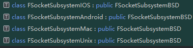

`Windows`网络接口位于:
```
Source/Runtime/Sockets/Private/Windows/
```

虚幻网络架构 :
```cpp
┌─────────────────────────────────────────────────────────────┐
│                      游戏逻辑层                              │
│  AActor::ReplicateSubobject / UFUNCTION(Server, Client)     │
└─────────────────────────────────────────────────────────────┘
                              ↓
┌─────────────────────────────────────────────────────────────┐
│                   对象复制与 RPC 层                          │
│  UChannel / UActorChannel / UVoiceChannel / UControlChannel │
└─────────────────────────────────────────────────────────────┘
                              ↓
┌─────────────────────────────────────────────────────────────┐
│                      连接管理层                              │
│  UNetConnection / UIpConnection / UChildConnection          │
└─────────────────────────────────────────────────────────────┘
                              ↓
┌─────────────────────────────────────────────────────────────┐
│                     网络驱动层                               │
│  UNetDriver / UIpNetDriver / UDemoNetDriver                 │
└─────────────────────────────────────────────────────────────┘
                              ↓
┌─────────────────────────────────────────────────────────────┐
│                  平台Socket抽象层                            │
│  ISocketSubsystem / FSocket / FSocketSubsystemWindows       │
└─────────────────────────────────────────────────────────────┘
```

---

#### NetDriver

以下内容来自 NetDriver 的头文件注释.

```
/**
 *****************************************************************************************
 * NetDrivers、NetConnections 和 Channels
 *****************************************************************************************
 *
 * UNetDriver 负责管理一组 UNetConnection，以及它们之间可共享的数据。
 * 对于给定的游戏，通常只有相对较少的 UNetDriver。可能包括：
 *	- Game NetDriver，负责标准的游戏网络流量。
 *	- Demo NetDriver，负责录制或回放先前录制的游戏数据（这就是回放的工作原理）。
 *	- Beacon NetDriver，负责不属于“正常”游戏流量的网络流量。
 *
 * 游戏或应用程序也可以实现并使用自定义的 NetDriver。
 * NetConnection 代表连接到游戏的单个客户端（或者更一般地说，连接到 NetDriver）。
 *
 * 端点数据不是由 NetConnection 直接处理的。相反，NetConnection 会将数据路由到 Channel。
 * 每个 NetConnection 都有自己的一组 Channel。
 *
 * 常见的 Channel 类型：
 *
 *	- Control Channel（控制通道）用于发送有关连接状态的信息（例如连接是否应关闭等）。
 *	- Voice Channel（语音通道）可用于在客户端和服务器之间发送语音数据。
 *	- Unique Actor Channel（唯一 Actor 通道）对于服务器复制到客户端的每个 Actor 都存在。
 *
 * 也可以创建和使用自定义 Channel 用于特殊目的（尽管这不太常见）。
 *
 *
 *****************************************************************************************
 * Game NetDrivers、NetConnections 和 Channels
 *****************************************************************************************
 *
 * 通常情况下，对于“标准”游戏流量和连接，只存在一个 NetDriver（在客户端和服务器上创建）。
 *
 * 服务器 NetDriver 维护一个 NetConnection 列表，每个列表代表游戏中的一个玩家。它负责复制 Actor 数据。
 *
 * 客户端 NetDriver 有一个单一的 NetConnection，代表与服务器的连接。
 *
 * 在服务器和客户端上，NetDriver 负责从网络接收数据包，并将其传递给相应的 NetConnection（并在必要时建立新的 NetConnection）。
 *
 *
 *****************************************************************************************
 *****************************************************************************************
 *****************************************************************************************
 * 发起连接 / 握手流程
 *****************************************************************************************
 *****************************************************************************************
 *****************************************************************************************
 *
 * UIpNetDriver 和 UIpConnection（或派生类）几乎是所有平台的引擎默认实现，以下所有内容描述了它们如何建立和管理连接。
 * 然而，这些过程可能因 NetDriver 的实现而异。
 *
 * 服务器和客户端都有自己的 NetDriver，所有 UE 复制游戏流量都由 IpNetDriver 发送或接收。
 * 此流量还包括建立连接以及在出现问题时重新建立连接的逻辑。
 *
 * 握手分布在几个不同的地方：NetDriver、PendingNetGame、World、PacketHandlers 等。
 * 这种划分是由于不同的需求，例如：确定传入连接是否以“UE 协议”发送数据，
 * 确定某个地址是否是恶意的，确定某个客户端是否具有正确的游戏版本等。
 *
 *
 *****************************************************************************************
 * 启动和握手
 *****************************************************************************************
 *
 * 每当服务器加载地图时（通过 UEngine::LoadMap），我们会调用 UWorld::Listen。
 * 该代码负责创建主 Game NetDriver，解析设置，并调用 UNetDriver::InitListen。
 * 最终，该代码负责确定我们具体如何监听客户端连接。
 * 例如，在 IpNetDriver 中，这就是我们通过调用配置的 Socket Subsystem 来确定我们将绑定的 IP / 端口的地方
 *（参见 ISocketSubsystem::GetLocalBindAddresses 和 ISocketSubsystem::BindNextPort）。
 *
 * 一旦服务器开始监听，它就准备好开始接受客户端连接。
 *
 * 每当客户端想要加入服务器时，它们将首先通过 UEngine::Browse 使用服务器的 IP 建立一个新的 UPendingNetGame。
 * UPendingNetGame::Initialize 和 UPendingNetGame::InitNetDriver 分别负责初始化设置和设置 NetDriver。
 * 客户端将立即为此服务器建立一个 UNetConnection 作为此初始化的一部分，并将开始在该连接上向服务器发送数据，
 * 从而启动握手过程。
 *
 * 在客户端和服务器上，UNetDriver::TickDispatch 通常负责接收网络数据。
 * 通常，当我们收到一个数据包时，我们会检查其地址，并查看它是否来自我们已经知道的连接。
 * 我们通过简单地维护一个从 FInternetAddr 到 UNetConnection 的映射来确定是否已为给定的源地址建立了连接。
 *
 * 如果数据包来自已建立的连接，我们将通过 UNetConnection::ReceivedRawPacket 将数据包传递给连接。
 * 如果数据包不是来自已建立的连接，我们将其视为“无连接”并开始握手过程。
 *
 * 有关此握手工作原理的详细信息，请参阅 StatelessConnectionHandlerComponent.cpp。
 *
 *
 *****************************************************************************************
 * UWorld / UPendingNetGame / AGameModeBase 启动和握手
 *****************************************************************************************
 *
 * 在客户端和服务器上的 UNetDriver 和 UNetConnection 完成握手过程后，
 * 客户端将调用 UPendingNetGame::SendInitialJoin 以启动游戏级别的握手。
 *
 * 游戏级别的握手是通过一组更结构化和更复杂的 FNetControlMessages 完成的。
 * 完整的控制消息集可以在 DataChannel.h 中找到。
 *
 * 处理这些控制消息的大部分工作是在 UWorld::NotifyControlMessage 和 UPendingNetGame::NotifyControlMessage 中完成的。简要来说，流程如下：
 *
 * 客户端的 UPendingNetGame::SendInitialJoin 发送 NMT_Hello。
 *
 * 服务器的 UWorld::NotifyControlMessage 接收 NMT_Hello，发送 NMT_Challenge。
 *
 * 客户端的 UPendingNetGame::NotifyControlMessage 接收 NMT_Challenge，并在 NMT_Login 中发回数据。
 *
 * 服务器的 UWorld::NotifyControlMessage 接收 NMT_Login，验证挑战数据，然后调用 AGameModeBase::PreLogin。
 * 如果 PreLogin 没有报告任何错误，服务器调用 UWorld::WelcomePlayer，后者调用 AGameModeBase::GameWelcomePlayer，
 * 并发送带有地图信息的 NMT_Welcome。
 *
 * 客户端的 UPendingNetGame::NotifyControlMessage 接收 NMT_Welcome，读取地图信息（以便稍后开始加载），
 * 并发送带有客户端配置的网络速度的 NMT_NetSpeed。
 *
 * 服务器的 UWorld::NotifyControlMessage 接收 NMT_NetSpeed，并相应地调整连接的网络速度。
 *
 * 此时，握手被认为完成，玩家已完全连接到游戏。
 * 根据加载地图所需的时间长短，客户端在控制权移交给 UWorld 之前，仍然可能在 UPendingNetGame 上收到一些非握手的控制消息。
 *
 * 当需要时，还有用于处理加密的额外步骤。
 *
 *
 *****************************************************************************************
 * 重新建立丢失的连接
 *****************************************************************************************
 *
 * 在游戏过程中，由于多种原因，连接可能会丢失。
 * 网络可能断开，用户可能从 LTE 切换到 WIFI，他们可能离开游戏等。
 *
 * 如果服务器发起这些断开连接之一，或者以其他方式意识到这一点（由于超时或错误），
 * 那么将通过关闭 UNetConnection 并通知游戏来处理断开连接。
 * 此时，由游戏决定是否支持“中途加入”或“重新加入”。
 * 如果游戏支持，我们将完全重新开始上述握手流程。
 *
 * 如果只是暂时中断了客户端的连接，但服务器从未意识到，
 * 那么引擎/游戏通常会自动恢复（尽管会有一些数据包丢失 / 延迟尖峰）。
 *
 * 然而，如果客户端的 IP 地址或端口因任何原因发生变化，但服务器不知道这一点，
 * 那么我们将通过重做低级握手来开始恢复过程。在这种情况下，游戏代码将不会收到通知。
 *
 * 这个过程在 StatlessConnectionHandlerComponent.cpp 中介绍。
 *
 *
 *****************************************************************************************
 *****************************************************************************************
 *****************************************************************************************
 * 数据传输
 *****************************************************************************************
 *****************************************************************************************
 *****************************************************************************************
 *
 * Game NetConnections 和 NetDrivers 通常对底层通信方法 / 技术不敏感。
 * 这留给了子类来决定（例如 UIpConnection / UIpNetDriver 或 UWebSocketConnection / UWebSocketNetDriver）。
 *
 * 相反，UNetDriver 和 UNetConnection 使用 Packets 和 Bunches 工作。
 *
 * Packets 是在主机和客户端上的 NetConnection 对之间发送的数据块。
 * Packets 包含关于数据包的元数据（例如头部信息和确认），以及 Bunches。
 *
 * Bunches 是在主机和客户端上的 Channel 对之间发送的数据块。
 * 当 Connection 收到一个 Packet 时，该 Packet 将被拆分为单个的 Bunches。
 * 然后，这些 Bunches 被传递给各个 Channel 进行进一步处理。
 *
 * 一个 Packet 可能不包含任何 Bunches、单个 Bunch 或多个 Bunches。
 * 因为 Bunches 的大小限制可能大于单个 Packet 的大小限制，UE 支持部分 Bunch 的概念。
 *
 * 当一个 Bunch 太大时，在传输之前，我们会将其切割成多个较小的 Bunches。
 * 这些 Bunches 将被标记为 PartialInitial、Partial 或 PartialFinal。使用这些信息，
 * 我们可以在接收端重新组装这些 Bunches。
 *
 *	示例：客户端向服务器发送 RPC。
 *		- 客户端调用 Server_RPC。
 *		- 该请求（通过 NetDriver 和 NetConnection）被转发到拥有调用 RPC 的 Actor 的 Actor Channel。
 *		- Actor Channel 将 RPC 标识符和参数序列化到一个 Bunch 中。该 Bunch 还将包含其 Actor Channel 的 ID。
 *		- Actor Channel 然后请求 NetConnection 发送该 Bunch。
 *		- 稍后，NetConnection 将此（和其他）数据组装到一个 Packet 中，并将其发送到服务器。
 *		- 在服务器上，Packet 被 NetDriver 接收。
 *		- NetDriver 检查发送 Packet 的地址，并将 Packet 交给适当的 NetConnection。
 *		- NetConnection 将 Packet 拆分为其 Bunches（一个接一个）。
 *		- NetConnection 使用 Bunch 上的 Channel ID 将 Bunch 路由到相应的 Actor Channel。
 *		- ActorChannel 然后拆解 Bunch，看到它包含 RPC 数据，并使用 RPC ID 和序列化的参数
 *			在 Actor 上调用相应的函数。
 *
 *
 *****************************************************************************************
 * 可靠性和重传
 *****************************************************************************************
 *
 * UE 网络通常假定底层网络协议不保证可靠性。
 * 相反，它实现了自己的数据包和 Bunch 的可靠性和重传机制。
 *
 * 当 NetConnection 建立时，它将为其 Packets 和 Bunches 建立一个序列号。
 * 这些可以是固定的，也可以是随机的（当随机化时，序列号将由服务器发送）。
 *
 * 数据包编号是每个 NetConnection 的，为发送的每个数据包递增，每个数据包都将包含其数据包编号，
 * 并且我们永远不会重传具有相同数据包编号的数据包。
 *
 * Bunch 编号是每个 Channel 的，为发送的每个 **可靠** Bunch 递增，并且每个 **可靠** Bunch 都将
 * 包含其 Bunch 编号。然而，与数据包不同的是，确切的（可靠）Bunches 可能会被重传。这意味着我们
 * 将重新发送具有相同 Bunch 编号的 Bunches。
 *
 * 注意，在代码中，上面描述的 Bunch 编号和数据包编号通常都被称为序列号。我们在这里做出区分以便更清晰地理解。
 *
 *	--- 检测传入的丢弃数据包 ---
 *
 *	通过分配数据包编号，我们可以轻松检测传入数据包何时丢失。
 *	这只需通过获取最后成功接收的数据包编号与当前正在处理的数据包的数据包编号之间的差值来完成。
 *
 *	在良好条件下，所有数据包将按发送顺序接收。这意味着差值将为 +1。
 *
 *	如果差值大于 1，则表示我们错过了一些数据包。我们将只
 *	假设丢失的数据包已被丢弃，但认为当前数据包已成功接收，
 *	并继续使用其编号。
 *
 *	如果差值为负（或 0），则表示我们要么收到了一些乱序的数据包，要么外部
 *	服务试图向我们重新发送数据（记住，引擎不会重用序列号）。
 *
 *	无论哪种情况，引擎通常会忽略丢失或无效的数据包，并且不会为它们发送 ACK。
 *
 *	我们确实有“修复”在同一帧内收到的乱序数据包的方法。
 *	当启用时，如果我们检测到丢失的数据包（差值 > 1），我们将不会立即处理当前数据包。
 *	相反，它会将其添加到一个队列中。下次我们成功收到数据包时（差值 == 1），我们将
 *	查看队列头部是否有序。如果是，我们将处理它，否则我们将继续
 *	接收数据包。
 *
 *	一旦我们读取了当前所有可用的数据包，我们将刷新此队列，处理任何剩余的数据包。
 *	此时任何丢失的数据包将被假定为已丢弃。
 *
 *	每个成功接收的数据包都会将其数据包编号作为确认（ACK）发送回发送方。
 *
 *
 *	--- 检测传出的丢弃数据包 ---
 *
 *
 *	如上所述，每当成功接收到数据包时，接收方都会发回一个 ACK。
 *	这些 ACK 将包含成功接收的数据包的数据包编号，按顺序排列。
 *
 *	类似于接收方跟踪数据包编号的方式，发送方将跟踪最高 ACK 的数据包编号。
 *
 *	当处理 ACK 时，低于我们最后收到的 ACK 的任何 ACK 将被忽略，并且数据包
 *	编号中的任何间隙被视为未确认（NAKed）。
 *
 *	发送方负责处理这些 ACK 和 NAK，并重新发送任何丢失的数据。
 *	新数据将被添加到新的传出数据包中（再次强调，我们不会重新发送我们已经发送过的数据包，
 *	也不会重用数据包序列号）。
 *
 *
 *	--- 重新发送丢失的数据 ---
 *
 *
 *	如上所述，仅数据包本身不包含有用的游戏数据。相反，构成它们的 Bunches
 *	才具有有意义的数据。
 *
 *	Bunches 可以标记为 Reliable 或 Unreliable。
 *
 *	如果 Bunches 被丢弃，引擎将不会尝试重新发送不可靠的 Bunches。因此，如果 Bunches
 *	被标记为不可靠，游戏/引擎应该能够在没有它们的情况下继续，或者必须建立外部重试
 *	机制，或者必须冗余发送数据。因此，以下所有内容仅
 *	适用于可靠的 Bunches。
 *
 *	然而，引擎将尝试重新发送可靠的 Bunches。每当发送一个可靠的 Bunch 时，它将被
 *	添加到一个未确认的可靠 Bunches 列表中。如果我们收到一个包含该 Bunch 的数据包的 NAK，
 *	引擎将重新发送该 Bunch 的精确副本。注意，因为 Bunches 可能是部分的，即使丢失一个
 *	部分 Bunch 也会导致整个 Bunch 的重传。当包含一个 Bunch 的所有数据包都已被 ACK 时，
 *	我们将将其从列表中移除。
 *
 *	类似于数据包，我们将接收到的可靠 Bunch 的 Bunch 编号与最后成功接收的 Bunch 进行比较。
 *	如果我们检测到差值为负，我们只需忽略该 Bunch。如果差值大于 1，我们将假设我们错过了一个 Bunch。
 *	与数据包处理不同，我们不会丢弃此数据。
 *	相反，我们将排队该 Bunch 并暂停处理 **任何** Bunches，无论是可靠的还是不可靠的。
 *	直到我们检测到已收到丢失的 Bunches，处理才会恢复，届时我们将处理它们，
 *	然后开始处理我们排队的 Bunches。
 *	在等待丢失的 Bunches 时，或者当我们队列中仍有任何 Bunches 时，接收到的任何新 Bunches
 *	将被添加到队列中，而不是立即处理。
 *
 */
```

---

`BaseEngine.ini` 定义了要使用的 `NetDriver` 类.
```cpp
NetDriverDefinitions=(DefName="GameNetDriver",DriverClassName="/Script/OnlineSubsystemUtils.IpNetDriver",DriverClassNameFallback="/Script/OnlineSubsystemUtils.IpNetDriver")

+NetDriverDefinitions=(DefName="DemoNetDriver",DriverClassName="/Script/Engine.DemoNetDriver",DriverClassNameFallback="/Script/Engine.DemoNetDriver")
```

下面是简化的代码，做法就是从ini里面找到要创建的类，`NewObject` 创建之.
```cpp
UNetDriver* CreateNetDriver_Local(UEngine* Engine, FWorldContext& Context, 
FName NetDriverDefinition, FName InNetDriverName)
{
	UNetDriver* ReturnVal = nullptr;
	FNetDriverDefinition* Definition = nullptr;
	auto FindNetDriverDefPred = [NetDriverDefinition](const FNetDriverDefinition& CurDef)
	{
		return CurDef.DefName == NetDriverDefinition;
	};

	Definition = Engine->NetDriverDefinitions.FindByPredicate(FindNetDriverDefPred);
	ReturnVal = NewObject<UNetDriver>(GetTransientPackage(), NetDriverClass);
	return ReturnVal;
}
```

---

##### 服务端

服务端的 `NetDriver`:

前面注释里说了
```
* 每当服务器加载地图时（通过 UEngine::LoadMap），我们会调用 UWorld::Listen。
 * 该代码负责创建主 Game NetDriver，解析设置，并调用 UNetDriver::InitListen。
 * 最终，该代码负责确定我们具体如何监听客户端连接。
 * 例如，在 IpNetDriver 中，这就是我们通过调用配置的 Socket Subsystem 来确定我们将绑定的 IP / 端口的地方
 *（参见 ISocketSubsystem::GetLocalBindAddresses 和 ISocketSubsystem::BindNextPort）。
 *
 * 一旦服务器开始监听，它就准备好开始接受客户端连接。
```

```cpp
bool UGameInstance::EnableListenServer(bool bEnable, int32 PortOverride /*= 0*/)
{
	if (!World->GetNetDriver())
	{
		// This actually opens the port
		FURL ListenURL = WorldContext->LastURL;
		return World->Listen(ListenURL);
	}
}

bool UWorld::Listen( FURL& InURL )
{
	NetDriver = /*...*/
	NetDriver->SetWorld(this);

	const bool bReuseAddressAndPort = WorldSettings ? WorldSettings->bReuseAddressAndPort : false;
	if( !NetDriver->InitListen( this, InURL, bReuseAddressAndPort, Error ) )
}
```
`InitListen`: 基类`UNetDriver`没有实现这个函数，直接到子类 `UIpNetDriver` 里面了.
```cpp
bool UIpNetDriver::InitListen( FNetworkNotify* InNotify, FURL& LocalURL, 
bool bReuseAddressAndPort, FString& Error)
{
	InitBase( false, InNotify, LocalURL, bReuseAddressAndPort, Error );
	InitConnectionlessHandler();
	LocalURL.Port = LocalAddr->GetPort();
}
```
`UNetDriver::InitBase` : <br>
创建`UNetConnection`,<br>
如果是服务端，还要创建 `UReplicationDriver`.

`UIpNetDriver::InitBase` :<br>
调用了 `Super::InitBase` 之后，创建 `SocketSubsystem`.

```cpp
bool UIpNetDriver::InitBase( bool bInitAsClient, FNetworkNotify* InNotify, 
const FURL& URL, bool bReuseAddressAndPort, FString& Error )
{
	Super::InitBase(bInitAsClient, InNotify, URL, bReuseAddressAndPort, Error);
	ISocketSubsystem* SocketSubsystem = GetSocketSubsystem();
}
```

创建 `Socket` : 这一段有点绕，看图吧.

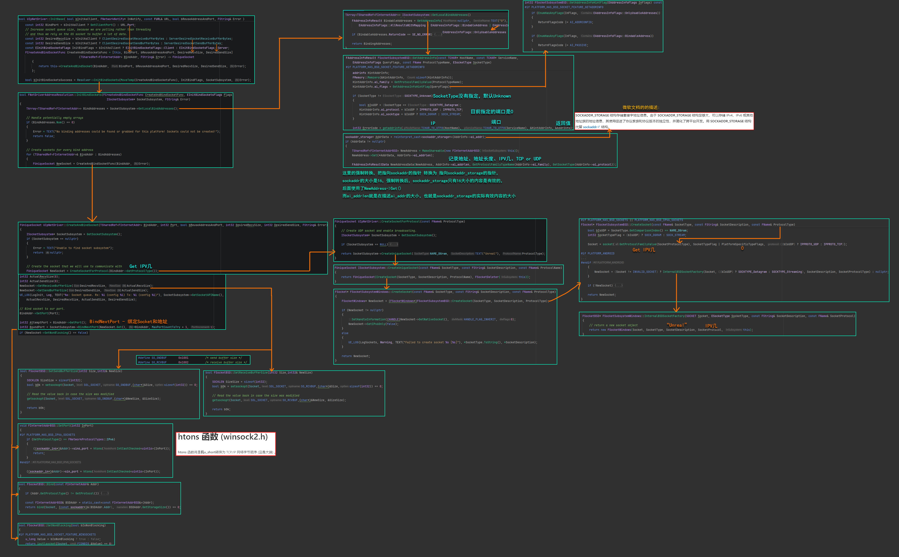

Port端口号是从 `URL` 来的.

在创建 `Socket` 并绑定了地址之后，`UIpNetDriver`把这两个数据拿过来:<br>
```cpp
bool UIpNetDriver::InitBase( bool bInitAsClient, FNetworkNotify* InNotify, const FURL& URL, bool bReuseAddressAndPort, FString& Error )
{
	/*...*/
	SetSocketAndLocalAddress(Resolver->GetFirstSocket());
}
```

之后的网络通信都是通过`UIpNetDriver`进行.


---

##### 客户端

客户端的 `NetDriver`:
```
* 每当客户端想要加入服务器时，它们将首先通过 UEngine::Browse 使用服务器的 IP 建立一个新的 UPendingNetGame。
 * UPendingNetGame::Initialize 和 UPendingNetGame::InitNetDriver 分别负责初始化设置和设置 NetDriver。
 * 客户端将立即为此服务器建立一个 UNetConnection 作为此初始化的一部分，并将开始在该连接上向服务器发送数据，
 * 从而启动握手过程。
 ```

整体流程:
 ```cpp
 UPendingNetGame::InitNetDriver
    │
    ├─ GEngine->CreateNamedNetDriver(NAME_PendingNetDriver)
    │      └─ 最终创建 UIpNetDriver 实例
    │
    ├─ NetDriver->InitConnect(this, URL, ConnectionError)
    │      │
    │      └─ UIpNetDriver::InitConnect
    │            ├─ InitBase(true, ...)   // 创建Socket、绑定本地端口
    │            ├─ new UIpConnection (ServerConnection)
    │            ├─ ServerConnection->InitLocalConnection(...)
    │            └─ Resolver->InitConnect(...)  // 启动异步地址解析
    │
    ├─ 如果 Handler 存在，开始握手，否则直接 SendInitialJoin()
    │
    └─ UPendingNetGame::Tick 每帧驱动 NetDriver->TickDispatch / TickFlush
```

---

```cpp
EBrowseReturnVal::Type UEngine::Browse( FWorldContext& WorldContext, FURL URL, FString& Error )
{
	WorldContext.PendingNetGame = NewObject<UPendingNetGame>();
	WorldContext.PendingNetGame->Initialize(URL); //-V595
	WorldContext.PendingNetGame->InitNetDriver(); //-V595
}

void UPendingNetGame::InitNetDriver()
{
	if (GEngine->CreateNamedNetDriver(this, NAME_PendingNetDriver, NAME_GameNetDriver))
	{
		NetDriver = GEngine->FindNamedNetDriver(this, NAME_PendingNetDriver);
	}

	if( NetDriver->InitConnect( this, URL, ConnectionError ) )
	{
		if (ServerConn->Handler.IsValid())
		{
			ServerConn->Handler->BeginHandshaking(
					FPacketHandlerHandshakeComplete::CreateUObject(this, &UPendingNetGame::SendInitialJoin));
		}
		else
		{
			SendInitialJoin();
		}
	}
}
```

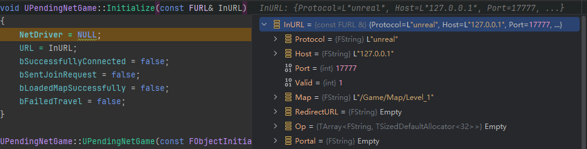


```cpp
bool UIpNetDriver::InitConnect( FNetworkNotify* InNotify, const FURL& ConnectURL, FString& Error )
{
	InitBase( true, InNotify, ConnectURL, false, Error );

	ServerConnection = NewObject<UNetConnection>(GetTransientPackage(), NetConnectionClass);

	ServerConnection->InitLocalConnection(this, SocketPrivate.Get(), ConnectURL, USOCK_Pending);

	Resolver->InitConnect(ServerConnection, SocketSubsystem, GetSocket(), ConnectURL);

	CreateInitialClientChannels();
}
```

`ServerConnection` 的类型是 `UIpConnection`.

`Resolver->InitConnect` = `FNetDriverAddressResolution::InitConnect`<br>
这里异步获取服务器IP : 获取之后 存入`NetDriver` .

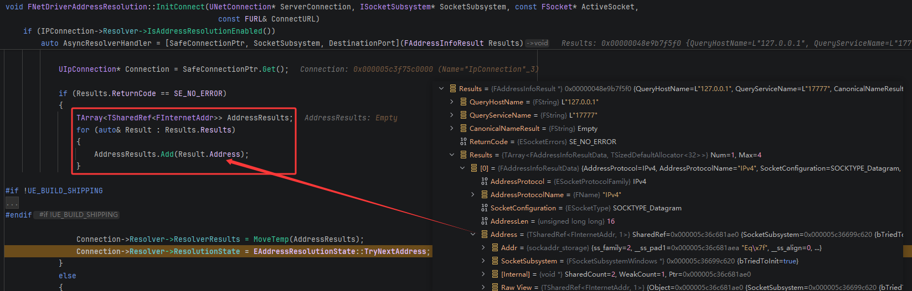


`CreateInitialClientChannels`:

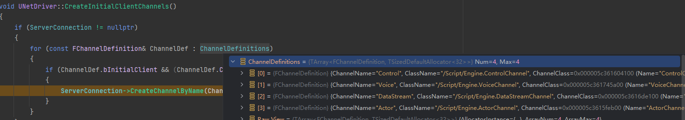

与此同时，另外一边...<br>
因为这里是异步获取服务器地址的，所以 在某个时间段 服务器地址 是无效的.

`UPendingNetGame::Tick` --> `UNetDriver::TickFlush` --> `UIpConnection::Tick`

`UIpConnection::Tick`:

```cpp
if (CheckResult == TryFirstAddress || CheckResult == TryNextAddress)
{
    SetSocket_Local(Resolver->GetResolutionSocket()); // 激活对应的Socket
    RemoteAddr = Resolver->GetRemoteAddr();           // 设定目标地址
    // ...
}
```


确定后续所有 `sendto` 的目标地址（RemoteAddr）。<br>
激活本地`Socket`（SocketPrivate），确保发出的包源地址与目标地址协议族一致<br>
（IPv4 用 IPv4 Socket，IPv6 用 IPv6 Socket）。<br>

这一步骤完成后，客户端才真正拥有了向服务器发送数据的能力。

```cpp
void UPendingNetGame::InitNetDriver()
{
	if( NetDriver->InitConnect( this, URL, ConnectionError ) )
	{
		if (ServerConn->Handler.IsValid())
		{
			ServerConn->Handler->BeginHandshaking(
			FPacketHandlerHandshakeComplete::CreateUObject(this, &UPendingNetGame::SendInitialJoin));
		}
	}
}
```

这里绑定了握手回调: 向服务器发送 Hello. <br>
```cpp
void UPendingNetGame::SendInitialJoin()
{
	if (NetDriver != nullptr)
	{
		if(UNetConnection* ServerConn = NetDriver->ServerConnection;)
		{
			FNetControlMessage<NMT_Hello>::Send(ServerConn, IsLittleEndian, LocalNetworkVersion, EncryptionToken, LocalNetworkFeatures);
		}
	}
}
```

---


#### 握手
```
 * 在客户端和服务器上的 UNetDriver 和 UNetConnection 完成握手过程后，
 * 客户端将调用 UPendingNetGame::SendInitialJoin 以启动游戏级别的握手。
 ```

##### 组件初始化

根据注释的内容，

阶段 1：PacketHandler 的创建与组件添加

` UIpNetDriver::InitConnect` → `ServerConnection->InitLocalConnection`:<br>
```cpp
// IpNetDriver.cpp
bool UIpNetDriver::InitConnect(FNetworkNotify* InNotify, const FURL& ConnectURL, FString& Error)
{
    InitBase(true, InNotify, ConnectURL, false, Error);
    
    // 创建 UIpConnection 对象
    ServerConnection = NewObject<UIpConnection>(...);
    ServerConnection->InitLocalConnection(this, SocketPrivate.Get(), ConnectURL, USOCK_Pending);
    // ...
}
```

`UIpConnection::InitLocalConnection` :
```cpp
// IpConnection.cpp
void UIpConnection::InitLocalConnection(UNetDriver* InDriver, FSocket* InSocket, 
const FURL& InURL, ...)
{
    InitBase(InDriver, InSocket, InURL, InState, MaxPacket, PacketOverhead);
    // ...
}

// NetConnection.cpp
void UNetConnection::InitBase(UNetDriver* InDriver, FSocket* InSocket, 
const FURL& InURL, EConnectionState InState, ...)
{
    // 创建 PacketHandler
    Handler = MakeUnique<PacketHandler>();
    Handler->Initialize(...);
    
	TSharedPtr<HandlerComponent> NewComponent =
	Handler->AddHandler(TEXT("Engine.EngineHandlerComponentFactory(StatelessConnectHandlerComponent)"), true);
    StatelessConnectComponent = StaticCastSharedPtr<StatelessConnectHandlerComponent>(NewComponent);

	StatelessConnectHandlerComponent* CurComponent = StatelessConnectComponent.Pin().Get();
	CurComponent->SetDriver(Driver);
}
```
`Handler` 已经创建，在下面启动握手时 使用它.

阶段 2：启动握手 (BeginHandshaking)

```cpp
// PendingNetGame.cpp
void UPendingNetGame::InitNetDriver()
{
    // ... 创建 NetDriver 并调用 InitConnect ...
    
    if (NetDriver->InitConnect(this, URL, ConnectionError))
    {
        UNetConnection* ServerConn = NetDriver->ServerConnection;
        if (ServerConn->Handler.IsValid())
        {
            // 绑定完成回调
            ServerConn->Handler->BeginHandshaking(
                FPacketHandlerHandshakeComplete::CreateUObject(this, &UPendingNetGame::SendInitialJoin)
            );
        }
    }
}
```

```cpp
// PacketHandler.cpp
void PacketHandler::BeginHandshaking(FPacketHandlerHandshakeComplete InHandshakeDel)
{
    HandshakeCompleteDelegate = InHandshakeDel;
    
    // 遍历所有组件，调用每个组件的 BeginHandshaking（如果需要）
    for (int32 i=HandlerComponents.Num() - 1; i>=0; --i)
	{
		HandlerComponent& CurComponent = *HandlerComponents[i];

		if (CurComponent.RequiresHandshake() && !CurComponent.IsInitialized())
		{
			CurComponent.NotifyHandshakeBegin();
			break;
		}
	}
}
```

`HandshakeCompleteDelegate` 这里绑定的函数在未来执行，而不是现在.

对于 `StatelessConnectHandlerComponent`，<br>
`BeginHandshaking` 向服务器发一个初始化的包.

```cpp
void StatelessConnectHandlerComponent::NotifyHandshakeBegin()
{
	using namespace UE::Net;

	SendInitialPacket(static_cast<EHandshakeVersion>(CurrentHandshakeVersion));
}
```
```cpp
void StatelessConnectHandlerComponent::SendInitialPacket(EHandshakeVersion HandshakeVersion)
{
	const int32 AdjustedSize = GetAdjustedSizeBits(HANDSHAKE_PACKET_SIZE_BITS, HandshakeVersion);
	FBitWriter InitialPacket(AdjustedSize + (BaseRandomDataLengthBytes * 8) + 1 /* Termination bit */);

	EHandshakePacketModifier Modifier = bRestartedHandshake 
	? EHandshakePacketModifier::RestartHandshake 
	: EHandshakePacketModifier::None;

	BeginHandshakePacket(InitialPacket, EHandshakePacketType::InitialPacket, HandshakeVersion, SentHandshakePacketCount, CachedClientID,Modifier);

	uint8 SecretIdPad = 0;
	uint8 PacketSizeFiller[28];

	InitialPacket.WriteBit(SecretIdPad);

	FMemory::Memzero(PacketSizeFiller, UE_ARRAY_COUNT(PacketSizeFiller));
	InitialPacket.Serialize(PacketSizeFiller, UE_ARRAY_COUNT(PacketSizeFiller));

	SendToServer(HandshakeVersion, EHandshakePacketType::InitialPacket, InitialPacket);
}
```
GetAdjustedSizeBits 会加上 MagicHeader 长度、SessionID 和 ClientID 的位数.<br>
`FBitWriter` 加上 随机数据长度：BaseRandomDataLengthBytes 是 16 字节（128 位），再预留 1 位终止位。

`FBitWriter` 是 UE 的位序列化工具，可以按位写入数据.

`BeginHandshakePacket` 将所有握手包共用的头部字段写入 `InitialPacket`.

经过 `BeginHandshakePacket` 之后的 `InitialPacket` 内容如下:
```cpp
struct XX
{
	TBitArray<> MagicHeader;

	uint32 CachedGlobalNetTravelCount;
	uint32 ClientID;

	uint8 bHandshakePacket;
	uint8 bRestartHandshake;

	uint8 MinSupportedHandshakeVersion;
	uint8 HandshakeVersion;
	uint8 HandshakePacketType;

	uint8 SentHandshakePacketCount_LocalOrRemote;

	uint32 LocalNetworkVersion;
	EEngineNetworkRuntimeFeatures LocalNetworkFeatures;
}
```
后面还要加上 : 
```cpp
struct XXX : public XX
{
	uint8 SecretIdPad;
	uint8 PacketSizeFiller[28];
}
```
最后 `SendToServer` 把这一坨发送给服务器.

```cpp
void StatelessConnectHandlerComponent::SendToServer(EHandshakeVersion HandshakeVersion, EHandshakePacketType PacketType, FBitWriter& Packet)
{
	if (UNetConnection* ServerConn = (Driver != nullptr ? Driver->ServerConnection : nullptr))
	{
		CapHandshakePacket(Packet, HandshakeVersion);
	}
}
```

`CapHandshakePacket` 还要写入 `RandomData` (8到16位) ， 以及 1位终止位.

最终调用 `FSocketBSD::SendTo` 给服务器发送数据.

---

##### 服务器Challenge

客户端初次给服务端发送了数据，服务器做了什么？

下面是服务器视角.

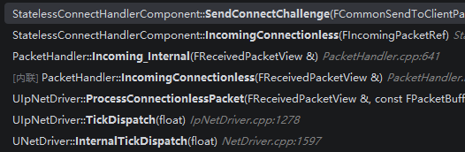

服务器端每帧在 `UIpNetDriver::TickDispatch` 中调用 `FSocket::RecvFrom` 读取到达的 UDP 数据包。<br>
对于尚未建立 `UNetConnection` 的客户端，数据包会进入 无连接处理流程。

```cpp
// IpNetDriver.cpp
void UIpNetDriver::TickDispatch(float DeltaTime)
{
    for (FPacketIterator It(this); It; ++It)
    {
        FReceivedPacketView ReceivedPacket;
        It.GetCurrentPacket(ReceivedPacket);
        
        // 如果找不到现有连接，调用 ProcessConnectionlessPacket
        Connection = ProcessConnectionlessPacket(ReceivedPacket, WorkingBuffer);
    }
}
```
最终调用 `ConnectionlessHandler->IncomingConnectionless(ReceivedPacket)` ;

```cpp
// PacketHandler.cpp
void PacketHandler::IncomingConnectionless(FReceivedPacketView& PacketRef)
{
    for (auto& Component : HandlerComponents)
    {
        Component->IncomingConnectionless(PacketRef);
    }
}
```

由于服务器端同样配置了 `StatelessConnectHandlerComponent`，该组件的 `IncomingConnectionless` 被调用。

```cpp
void StatelessConnectHandlerComponent::IncomingConnectionless(FIncomingPacketRef PacketRef)
{
	FBitReader& Packet = PacketRef.Packet;
	const TSharedPtr<const FInternetAddr> Address = PacketRef.Address;
	if (MagicHeader.Num() > 0)
	{
		/* 对比MagicHeader */
	}

	bool bHasValidSessionID = true;
	uint8 SessionID = 0;
	uint8 ClientID = 0;

	/* 读取 SessionID ClientID */

	/*	已经读取出3个信息，MagicHeader,SessionID,ClientID
		根据前面分析的结构体顺序，接下来就是bHandshakePacket 
	 */

	 /* 必须为 1，表示这是一个握手包 */
	bool bHandshakePacket = !!Packet.ReadBit() && !Packet.IsError();

	if (bHandshakePacket)
	{
		/* 如果是握手包， 解析包的数据. */
	}
}
```

版本检查:
```cpp
EHandshakeVersion TargetVersion;
bool bValidVersion = CheckVersion(HandshakeData, TargetVersion);
```
`CheckVersion` 比较客户端的 `MinVersion` 和 `CurVersion` 是否在服务器支持范围内，<br>
并选定一个双方兼容的 `TargetVersion`（通常取客户端 CurVersion 和服务器 CurrentHandshakeVersion 的较小值）。

若版本不兼容，服务器可能发送 `VersionUpgrade` 消息或直接丢弃包.

确认为 `Initial Packet` 并发送 `Challenge`:
```cpp
if (bInitialConnect) // HandshakePacketType == InitialPacket && Timestamp == 0.0
{
    SendConnectChallenge
	(
		FCommonSendToClientParams(Address, TargetVersion, ClientID),
    	HandshakeData.RemoteSentHandshakePacketCount
	);
}
```
生成并发送 `Challenge` :
```cpp
void StatelessConnectHandlerComponent::SendConnectChallenge(FCommonSendToClientParams CommonParams, 
uint8 ClientSentHandshakePacketCount)
{
	// 计算包大小
	GetAdjustedSizeBits...

	// 写入通用包头
	BeginHandshakePacket...

	// 生成 Cookie
	GenerateCookie...

	// 写入 SecretId、Timestamp、Cookie

	// 发送
    SendToClient...
}
```

Challenge 包与 Initial Packet 结构相似，<br>
包含：<br>
相同的包头（SessionID=0, ClientID 原样返回, Handshake=1, Restart=0）<br>
协议版本信息<br>
HandshakePacketType = Challenge<br>
SecretId（1 bit）：指示使用了哪个服务器密钥（0 或 1）<br>
Timestamp（double，8 字节）<br>
Cookie（20 字节）<br>

---

##### 客户端ChallengeResponse

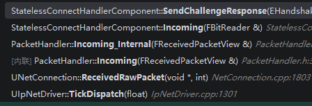

判断包类型，
```cpp
void StatelessConnectHandlerComponent::Incoming(FBitReader& Packet)
{
	bool bHandshakePacket = !!Packet.ReadBit() && !Packet.IsError();
	if (bHandshakePacket)
	{
		FParsedHandshakeData HandshakeData;
		bHandshakePacket = ParseHandshakePacket(Packet, HandshakeData);
		if (bHandshakePacket)
		{
			const bool bIsChallengePacket = ;
			const bool bIsInitialChallengePacket = ;
			const bool bIsUpgradePacket = ;
		}
	}
}
```
如果是 Challenge包， 回应它.
```cpp
/* 这是服务器发来的 Challenge包 的解析内容*/
FParsedHandshakeData HandshakeData;
if (bIsChallengePacket)
{
	// 缓存服务器的 SessionID
	CachedGlobalNetTravelCount = SessionID;

	LastChallengeTimestamp = (Driver != nullptr ? Driver->GetElapsedTime() : 0.0);

	SendChallengeResponse(HandshakeData.RemoteCurVersion, HandshakeData.SecretId, 
	HandshakeData.Timestamp, HandshakeData.Cookie);

	// Utilize this state as an intermediary, indicating that the challenge response has been sent
	// 将组件状态设为 InitializedOnLocal（表示已发送 Response，等待 Ack）
	SetState(UE::Handler::Component::State::InitializedOnLocal);
}
```

`ChallengeResponse`数据包的内容:<br>
与 Initial Packet 相同的包头结构，但 HandshakePacketType = Response（或 RestartResponse）。<br>
SecretId：原样返回。<br>
Timestamp：原样返回。<br>
Cookie：原样返回。<br>

若为重启握手 ，额外携带 AuthorisedCookie（之前成功握手的 Cookie）。<br>
这里是`false` 不额外携带这个数据.

---

##### 服务器ChallengeAck

客户端已经发送 `ChallengeResponse` ， 服务器如何回应?

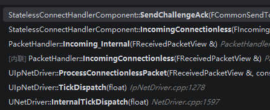

```cpp
void StatelessConnectHandlerComponent::IncomingConnectionless(FIncomingPacketRef PacketRef)
{
	 if (bValidCookieLifetime && bValidSecretIdTimestamp)
    {
        // 1. 重新生成 Cookie
        uint8 RegenCookie[COOKIE_BYTE_SIZE];
        GenerateCookie(Address, HandshakeData.SecretId, HandshakeData.Timestamp, RegenCookie);

        // 2. 比对客户端发来的 Cookie 与重新生成的 Cookie
        bChallengeSuccess = FMemory::Memcmp(HandshakeData.Cookie, RegenCookie, COOKIE_BYTE_SIZE) == 0;

        if (bChallengeSuccess)
        {
            // 验证成功，后续处理...
        }
    }
}
```

验证成功：
```cpp
// 1. 保存授权 Cookie
if (HandshakeData.bRestartHandshake)
{
    FMemory::Memcpy(AuthorisedCookie, HandshakeData.OrigCookie, COOKIE_BYTE_SIZE);
}
else
{
    // 从 Cookie 中提取初始序列号
    int16* CurSequence = (int16*)HandshakeData.Cookie;
    LastServerSequence = *CurSequence & (MAX_PACKETID - 1);
    LastClientSequence = *(CurSequence + 1) & (MAX_PACKETID - 1);
    FMemory::Memcpy(AuthorisedCookie, HandshakeData.Cookie, COOKIE_BYTE_SIZE);
}

bRestartedHandshake = HandshakeData.bRestartHandshake;
LastChallengeSuccessAddress = Address->Clone();
LastRemoteHandshakeVersion = TargetVersion;
CachedClientID = ClientID;

// 2. 更新最低客户端版本记录
if (TargetVersion < MinClientHandshakeVersion)
{
    MinClientHandshakeVersion = TargetVersion;
}

// 3. 发送 Ack 包
SendChallengeAck(FCommonSendToClientParams(Address, TargetVersion, ClientID),
HandshakeData.RemoteSentHandshakePacketCount, AuthorisedCookie);
```

Ack 包内容：<br>
与 Challenge 相同的包头结构。<br>
HandshakePacketType = Ack。<br>
Timestamp = -1.0：用于客户端区分 Ack 和 Challenge（Challenge 的 Timestamp > 0）。<br>
Cookie：服务器回传的授权 Cookie，其中嵌入了初始序列号。<br>

服务器将通过 `Challenge` 的地址保存在 `LastChallengeSuccessAddress`.


当上面发送Ack的函数执行完成后，回到 `ProcessConnectionlessPacket` 函数:<br>

服务器会在这里给客户端创建 `UIpConnection`.
```cpp
UNetConnection* UIpNetDriver::ProcessConnectionlessPacket(FReceivedPacketView& PacketRef, const FPacketBufferView& WorkingBuffer)
{
	UNetConnection* ReturnVal = nullptr;
	EIncomingResult Result = ConnectionlessHandler->IncomingConnectionless(PacketRef);

	if (Result == EIncomingResult::Success)
	{
		bPassedChallenge = StatelessConnect->HasPassedChallenge(Address, bRestartedHandshake);

		if (bPassedChallenge)
		{
			if (!bRestartedHandshake)
			{
				ReturnVal = NewObject<UIpConnection>(GetTransientPackage(), NetConnectionClass);

				ReturnVal->InitRemoteConnection(this, SocketPrivate.Get(), World ? World->URL : FURL(), *Address, USOCK_Open);

				ReturnVal->InitSequence(ClientSequence, ServerSequence);
				ReturnVal->Handler->BeginHandshaking();

				Notify->NotifyAcceptedConnection(ReturnVal);

				AddClientConnection(ReturnVal);
				RemoveFromNewIPTracking(*Address.Get());
			}
		}
	}
}
```
把 `Connection` 添加到Map，这个Map在将来有用.
```cpp
void UNetDriver::AddClientConnection(UNetConnection* NewConnection)
{
	TSharedPtr<const FInternetAddr> ConnAddr = NewConnection->GetRemoteAddr();
	MappedClientConnections.Add(ConnAddr.ToSharedRef(), NewConnection);
}
```

---

##### 客户端的Hello

```
 * 在客户端和服务器上的 UNetDriver 和 UNetConnection 完成握手过程后，
 * 客户端将调用 UPendingNetGame::SendInitialJoin 以启动游戏级别的握手。
 *
 * 游戏级别的握手是通过一组更结构化和更复杂的 FNetControlMessages 完成的。
 * 完整的控制消息集可以在 DataChannel.h 中找到。
 *
 * 处理这些控制消息的大部分工作是在 UWorld::NotifyControlMessage 和 UPendingNetGame::NotifyControlMessage 中完成的。

 * 简要来说，流程如下：
 *
 * 客户端的 UPendingNetGame::SendInitialJoin 发送 NMT_Hello。
 *
 * 服务器的 UWorld::NotifyControlMessage 接收 NMT_Hello，发送 NMT_Challenge。
 *
 * 客户端的 UPendingNetGame::NotifyControlMessage 接收 NMT_Challenge，并在 NMT_Login 中发回数据。
 ```


客户端收到服务器的 Ack包 :

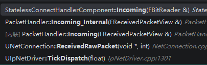

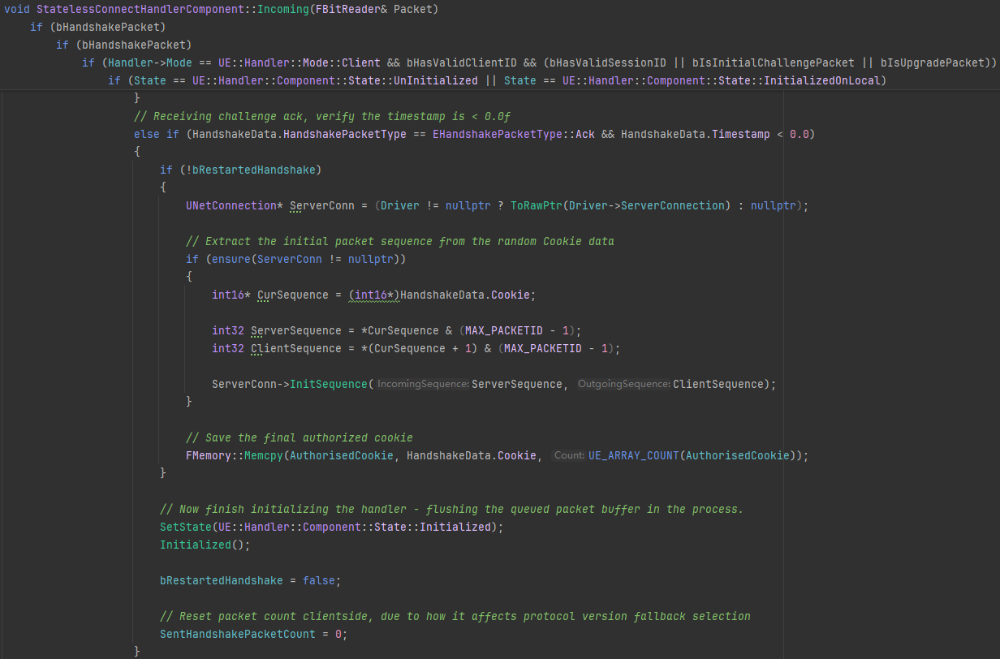

`Initialized();`

```cpp
void HandlerComponent::Initialized()
{
	bInitialized = true;
	Handler->HandlerComponentInitialized(this);
}

void PacketHandler::HandlerComponentInitialized(HandlerComponent* InComponent)
{
	/*...*/
	HandlerInitialized();
}

void PacketHandler::HandlerInitialized()
{
	SetState(UE::Handler::State::Initialized);
	HandshakeCompleteDel.ExecuteIfBound();
}
```

`HandshakeCompleteDel.ExecuteIfBound();` <br>
此时 在最开始的地方绑定的那个函数 `void UPendingNetGame::SendInitialJoin()` 要执行了.

```cpp
void UPendingNetGame::InitNetDriver()
{
	if (GEngine->CreateNamedNetDriver(this, NAME_PendingNetDriver, NAME_GameNetDriver))
	{
		NetDriver = GEngine->FindNamedNetDriver(this, NAME_PendingNetDriver);
	}

	if( NetDriver->InitConnect( this, URL, ConnectionError ) )
	{
		UNetConnection* ServerConn = NetDriver->ServerConnection;
		if (ServerConn->Handler.IsValid())
		{
			ServerConn->Handler->BeginHandshaking
			(
				FPacketHandlerHandshakeComplete::CreateUObject(this, &UPendingNetGame::SendInitialJoin)
			);
		}
	}
}
```

`UPendingNetGame::SendInitialJoin` 向服务器发送 `NMT_Hello`.

---

##### 服务器的InComing

前面的代码中出现了 `InComing` 和 `IncomingConnectionless`，这两个函数的调用时机是???<br>

因为前面服务器给客户端创建了`UIpConnection`，以后的连接就是通过`InComing`，而不再是`IncomingConnectionless`.

```cpp
void UIpNetDriver::TickDispatch(float DeltaTime)
{
    // ...
    for (FPacketIterator It(this); It; ++It)
    {
        FReceivedPacketView ReceivedPacket;
        It.GetCurrentPacket(ReceivedPacket);
        const TSharedRef<const FInternetAddr> FromAddr = ReceivedPacket.Address.ToSharedRef();
        UNetConnection* Connection = nullptr;

		/*...*/
        // 1. 尝试在已建立的连接中查找
        if (Connection == nullptr)
        {
            auto* Result = MappedClientConnections.Find(FromAddr);
            if (Result != nullptr)
            {
                Connection = *Result;
            }
        }

        // 2. 如果找不到，进入无连接处理
        if (Connection == nullptr)
        {
            // ... DDoS 检查 ...
            if (bAcceptingConnection)
            {
                FPacketBufferView WorkingBuffer = It.GetWorkingBuffer();
                Connection = ProcessConnectionlessPacket(ReceivedPacket, WorkingBuffer);
            }
        }

        // 3. 如果最终拿到了连接，调用 ReceivedRawPacket
        if (Connection != nullptr && !bIgnorePacket)
        {
            Connection->ReceivedRawPacket(ReceivedPacket.DataView.GetData(), ReceivedPacket.DataView.NumBytes());
        }
    }
}
```

`MappedClientConnections` 是一个地址到 `UNetConnection*` 的映射表。

只有查表失败时，才会进入` ProcessConnectionlessPacket`，<br>
进而调用 `ConnectionlessHandler->IncomingConnectionless`（标志设为 true）。

```cpp
EIncomingResult IncomingConnectionless(FReceivedPacketView& PacketView)
{
	PacketView.Traits.bConnectionlessPacket = true;

	return Incoming_Internal(PacketView);
}
```

查表成功时，直接调用 `Connection->ReceivedRawPacket`，<br>
该函数内部会调用连接私有的 `Handler->Incoming`，而 `Incoming` 函数不修改 `bConnectionlessPacket` 标志，因此它保持默认值 `false`。

`Response` 包到达时：<br>
`MappedClientConnections` 中尚无该地址 → 进入 `ProcessConnectionlessPacket`.<br>
`ConnectionlessHandler->IncomingConnectionless` 验证通过，`HasPassedChallenge` 返回 true.<br>

`ProcessConnectionlessPacket` 内部创建 `UIpConnection` 并调用 `AddClientConnection`，将该地址加入映射表.<br>
函数返回新连接，`TickDispatch` 随后调用 `Connection->ReceivedRawPacket`.<br>

注意：`Response` 包本身在 `IncomingConnectionless` 中已被完全消费，`ReceivedRawPacket` 可能处理的是剩余数据（通常为空）.<br>


下一个包（如 `NMT_Hello`）到达时：<br>
`MappedClientConnections.Find(FromAddr)` 命中，`Connection` 非空。<br>
完全跳过 `ProcessConnectionlessPacket`，直接进入 `Connection->ReceivedRawPacket`。<br>
调用链为 `Handler->Incoming`（非 `IncomingConnectionless`），`bConnectionlessPacket` 保持默认 `false`。<br>


---

##### 服务器回应Hello

```
 * 客户端的 UPendingNetGame::SendInitialJoin 发送 NMT_Hello。
 *
 * 服务器的 UWorld::NotifyControlMessage 接收 NMT_Hello，发送 NMT_Challenge。
 *
 * 客户端的 UPendingNetGame::NotifyControlMessage 接收 NMT_Challenge，并在 NMT_Login 中发回数据。
 ```


 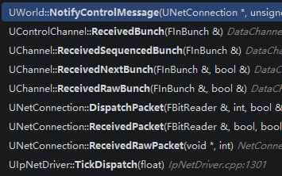

 服务器接收 NMT_Hello，发送 NMT_Challenge :

 ```cpp
 void UWorld::NotifyControlMessage(UNetConnection* Connection, uint8 MessageType, class FInBunch& Bunch)
{
	switch (MessageType)
	{
		case NMT_Hello:
		{
			if (FNetControlMessage<NMT_Hello>::Receive(Bunch, IsLittleEndian, RemoteNetworkVersion, EncryptionToken, RemoteNetworkFeatures))
			{
				Connection->SendChallengeControlMessage();
			}
		}
	}
}
 ```

 ```cpp
void UNetConnection::SendChallengeControlMessage()
{
	if (GetConnectionState() != USOCK_Invalid && GetConnectionState() != USOCK_Closed && Driver)
	{
		Challenge = FString::Printf(TEXT("%08X"), FPlatformTime::Cycles());
		SetExpectedClientLoginMsgType(NMT_Login);

		FNetControlMessage<NMT_Challenge>::Send(this, Challenge);
		FlushNet();
	}
}
```

---

##### 登录


```
 * 客户端的 UPendingNetGame::SendInitialJoin 发送 NMT_Hello。
 *
 * 服务器的 UWorld::NotifyControlMessage 接收 NMT_Hello，发送 NMT_Challenge。
 *
 * 客户端的 UPendingNetGame::NotifyControlMessage 接收 NMT_Challenge，并在 NMT_Login 中发回数据。
 ```

客户端接收 NMT_Challenge，发送 NMT_Login.

```cpp
void UPendingNetGame::NotifyControlMessage(UNetConnection* Connection, uint8 MessageType, class FInBunch& Bunch)
{
	switch (MessageType)
	{
		case NMT_Challenge:
		{
			if (FNetControlMessage<NMT_Challenge>::Receive(Bunch, Connection->Challenge))
			{
				FNetControlMessage<NMT_Login>::Send(Connection, Connection->ClientResponse, URLString, Connection->PlayerId, OnlinePlatformNameString);

				NetDriver->ServerConnection->FlushNet();
			}
		}
	}
}
```

---

服务器收到 NMT_Login :

```
* 服务器的 UWorld::NotifyControlMessage 接收 NMT_Login，验证挑战数据，然后调用 AGameModeBase::PreLogin。
* 如果 PreLogin 没有报告任何错误，服务器调用 UWorld::WelcomePlayer，后者调用 AGameModeBase::GameWelcomePlayer，
* 并发送带有地图信息的 NMT_Welcome。
```


```cpp
void UWorld::NotifyControlMessage(UNetConnection* Connection, uint8 MessageType, class FInBunch& Bunch)
{
	switch (MessageType)
	{
		case NMT_Login:
		{
			FUniqueNetIdRepl UniqueIdRepl;
			FString OnlinePlatformName;
			bool bReceived = FNetControlMessage<NMT_Login>::Receive(Bunch, Connection->ClientResponse, RequestURL, UniqueIdRepl,OnlinePlatformName);

			if(bReceived)
			{
				// keep track of net id for player associated with remote connection
				Connection->PlayerId = UniqueIdRepl;

				// keep track of the online platform the player associated with this connection is using.
				Connection->SetPlayerOnlinePlatformName(FName(*OnlinePlatformName));

				// ask the game code if this player can join
				AGameModeBase* GameMode = GetAuthGameMode();
				AGameModeBase::FOnPreLoginCompleteDelegate OnComplete = AGameModeBase::FOnPreLoginCompleteDelegate::CreateUObject
				(
					this, &UWorld::PreLoginComplete, TWeakObjectPtr<UNetConnection>(Connection)
				);
				if (GameMode)
				{
					GameMode->PreLoginAsync(Tmp, Connection->LowLevelGetRemoteAddress(), Connection->PlayerId, OnComplete);
				}
			}
		}
	}
}
```

```cpp
void AGameModeBase::PreLoginAsync(const FString& Options, const FString& Address, const FUniqueNetIdRepl& UniqueId, const FOnPreLoginCompleteDelegate& OnComplete)
{
	FString ErrorMessage;
	PreLogin(Options, Address, UniqueId, ErrorMessage);
	OnComplete.ExecuteIfBound(ErrorMessage);
}
```

`PreLogin` : 接受或拒绝试图加入服务器的玩家。<br>
如果将错误信息设置为非空字符串，则登录将失败。<br>
`PreLogin` 在登录之前被调用。登录被调用之前可能会经过很长的游戏时间。

`PreLogin` 执行完之后，调用下面这个在前面 `OnComplete` 绑定的函数: 
```cpp
void UWorld::PreLoginComplete(const FString& ErrorMsg, TWeakObjectPtr<UNetConnection> WeakConnection)
{
	UNetConnection* Connection = WeakConnection.Get();
	if (!PreLoginCheckError(Connection, ErrorMsg))
	{
		return;
	}

	WelcomePlayer(Connection);
}
```

```cpp
void UWorld::WelcomePlayer(UNetConnection* Connection)
{
	GameName = AuthorityGameMode->GetClass()->GetPathName();
	AuthorityGameMode->GameWelcomePlayer(Connection, RedirectURL);

	FNetControlMessage<NMT_Welcome>::Send(Connection, LevelName, GameName, RedirectURL);
}
```

---
客户端收到 NMT_Welcome.
```
* 客户端的 UPendingNetGame::NotifyControlMessage 接收 NMT_Welcome，读取地图信息（以便稍后开始加载），
* 并发送带有客户端配置的网络速度的 NMT_NetSpeed。
```

```cpp
void UPendingNetGame::NotifyControlMessage(UNetConnection* Connection, uint8 MessageType, class FInBunch& Bunch)
{
	switch (MessageType)
	{
		case NMT_Welcome:
		{
			// Server accepted connection.
			FString GameName;
			FString RedirectURL;

			if (FNetControlMessage<NMT_Welcome>::Receive(Bunch, URL.Map, GameName, RedirectURL))
			{
				/*...*/
				// Send out netspeed now that we're connected
				FNetControlMessage<NMT_Netspeed>::Send(Connection, Connection->CurrentNetSpeed);

				// We have successfully connected
				// TickWorldTravel will load the map and call LoadMapCompleted which eventually calls SendJoin
				bSuccessfullyConnected = true;
			}
		}
	}
}
```
`bSuccessfullyConnected`:<br>
我们已成功连接.<br>
`UEngine::TickWorldTravel` 将加载地图，并调用 `LoadMapCompleted` 函数，该函数最终会调用 `SendJoin`.

```cpp
void UEngine::TickWorldTravel(FWorldContext& Context, float DeltaSeconds)
{
	if (!Context.PendingNetGame->bLoadedMapSuccessfully)
	{
		const bool bLoadedMapSuccessfully = LoadMap(Context, Context.PendingNetGame->URL, Context.PendingNetGame, Error);

		Context.PendingNetGame->LoadMapCompleted(this, Context, bLoadedMapSuccessfully, Error);
	}

	/* PendingNetGame->LoadMapCompleted 会把 bLoadedMapSuccessfully 设置为true. */
	if (Context.PendingNetGame && Context.PendingNetGame->bLoadedMapSuccessfully /*...*/)
	{
		if (!Context.PendingNetGame->HasFailedTravel() )
		{
			Context.PendingNetGame->TravelCompleted(this, Context);
			Context.PendingNetGame = nullptr;
		}
	}
}
```

---

与此同时，服务器那边....

```
* 服务器的 UWorld::NotifyControlMessage 接收 NMT_NetSpeed，并相应地调整连接的网络速度。
```
服务器视角:

```cpp
void UWorld::NotifyControlMessage(UNetConnection* Connection, uint8 MessageType, class FInBunch& Bunch)
{
	switch (MessageType)
	{
		case NMT_Netspeed:
		{
			int32 Rate;

			if (FNetControlMessage<NMT_Netspeed>::Receive(Bunch, Rate))
			{
				Connection->CurrentNetSpeed = FMath::Clamp(Rate, 1800, NetDriver->MaxClientRate);
				UE_LOG(LogNet, Log, TEXT("Client netspeed is %i"), Connection->CurrentNetSpeed);
			}
			break;
		}
	}
}
```

```
* 此时，握手被认为完成，玩家已完全连接到游戏。
* 根据加载地图所需的时间长短，客户端在控制权移交给 UWorld 之前，仍然可能在 UPendingNetGame 上收到一些非握手的控制消息。 
```

---

回到客户端视角，客户端要发送 NMT_Join :
```cpp
Context.PendingNetGame->TravelCompleted(this, Context);
```

```cpp
void UPendingNetGame::TravelCompleted(UEngine* Engine, FWorldContext& Context)
{
	// Show connecting message, cause precaching to occur.
	Engine->TransitionType = ETransitionType::Connecting;

	Engine->RedrawViewports(false);

	// Send join.
	Context.PendingNetGame->SendJoin();
	Context.PendingNetGame->NetDriver = NULL;
}

void UPendingNetGame::SendJoin()
{
	bSentJoinRequest = true;

	FNetControlMessage<NMT_Join>::Send(NetDriver->ServerConnection);
	NetDriver->ServerConnection->FlushNet(true);
}
```

---

服务器收到 NMT_Join:

```cpp
void UWorld::NotifyControlMessage(UNetConnection* Connection, uint8 MessageType, class FInBunch& Bunch)
{
	switch (MessageType)
	{
		case NMT_Join:
		{
			if (Connection->PlayerController == NULL)
			{
				// Spawn the player-actor for this network player.
				Connection->PlayerController = SpawnPlayActor( Connection, ROLE_AutonomousProxy, 
				InURL, Connection->PlayerId, ErrorMsg );
			}
		}
	}
}
```

```cpp
APlayerController* UWorld::SpawnPlayActor(UPlayer* NewPlayer, ENetRole RemoteRole, const FURL& InURL, const FUniqueNetIdRepl& UniqueId, FString& Error, uint8 InNetPlayerIndex)
{
	APlayerController* const NewPlayerController = GameMode->Login(NewPlayer, RemoteRole, 
	*InURL.Portal, Options, UniqueId, Error);

	// Possess the newly-spawned player.
	NewPlayerController->NetPlayerIndex = InNetPlayerIndex;
	NewPlayerController->SetRole(ROLE_Authority);

	/* 这里是 SetReplicates(true) .*/
	NewPlayerController->SetReplicates(RemoteRole != ROLE_None);

	NewPlayerController->SetAutonomousProxy(true);
	NewPlayerController->SetPlayer(NewPlayer);
	
	GameMode->PostLogin(NewPlayerController);

	return NewPlayerController;
}
```

这里要注意的是 `NewPlayerController` 开启了复制，

`SetPlayer` 将连接的 `OwningActor` 设置为服务器上的 `PlayerController` : <br>
这个指针是连接与游戏世界之间的核心桥梁，决定了属性复制和 RPC 的路由规则。<br>

```cpp
void APlayerController::SetPlayer( UPlayer* InPlayer )
{
	ULocalPlayer *LP = Cast<ULocalPlayer>(InPlayer);
	if (LP != NULL)
	{
		// Clients need this marked as local (server already knew at construction time)
		SetAsLocalPlayerController();
		LP->InitOnlineSession();
		InitInputSystem();
	}
	else
	{
		NetConnection = Cast<UNetConnection>(InPlayer);
		if (NetConnection)
		{
			NetConnection->OwningActor = this;
		}
	}
}
```

`PostLogin`:<br>
创建HUD,开启语音,<br>
判断是不是观战模式或者回放模式，<br>
为玩家生成Pawn.

对于新创建的 `PlayerController` 和 `Pawn` 会被复制到客户端上.

---

#### 复制系统

```cpp
┌─────────────────────────────────────────────────────────┐
│                    AActor / UActorComponent             │
│   (UPROPERTY(Replicated), UFUNCTION(Server, Client))   │
└─────────────────────────────────────────────────────────┘
                            │
                            ▼
┌─────────────────────────────────────────────────────────┐
│                    UActorChannel                        │
│  - 负责单个 Actor 在某连接上的所有复制通信               │
│  - 持有 ActorReplicator (主复制器)                      │
└─────────────────────────────────────────────────────────┘
                            │
                            ▼
┌─────────────────────────────────────────────────────────┐
│                   FObjectReplicator                     │
│  - 每个复制对象（Actor 或子对象）一个                   │
│  - 管理属性比较、序列化、可靠队列                        │
└─────────────────────────────────────────────────────────┘
                            │
                            ▼
┌─────────────────────────────────────────────────────────┐
│                      FRepLayout                         │
│  - 反射生成的元数据，描述一个类中所有可复制属性          │
│  - 提供快速比较、序列化、反序列化能力                    │
└─────────────────────────────────────────────────────────┘
                            │
                            ▼
┌─────────────────────────────────────────────────────────┐
│                       FRepState                         │
│  - 每个连接的复制状态（如已发送的属性缓存、历史脏标记）  │
│  - 用于增量压缩（只发送变化的数据）                      │
└─────────────────────────────────────────────────────────┘
```

---

##### UHT

```cpp
UPROPERTY(Replicated)
float MyFloat;
	
UPROPERTY(Replicated)
int MyInt;
```
对应UHT生成的代码:
```cpp
enum class ENetFields_Private : uint16
{
	NETFIELD_REP_START=(uint16)((int32)Super::ENetFields_Private::NETFIELD_REP_END + (int32)1),

	MyFloat=NETFIELD_REP_START, 
	MyInt, 

	NETFIELD_REP_END=MyInt	
};
```

为每个 `Replicated` 属性分配一个编译期确定的唯一索引.<br>
引擎运行时通过 `FRepLayout` 使用该索引快速定位属性，用于属性比较、序列化和脏标记.<br>
继承链上的每个类都有自己的 `ENetFields_Private`，索引递增确保不冲突.<br>

---

```cpp
NO_API virtual void ValidateGeneratedRepEnums(const TArray<struct FRepRecord>& ClassReps) const override;

void AMyActor::ValidateGeneratedRepEnums(const TArray<struct FRepRecord>& ClassReps) const
{
	static const FName Name_MyFloat(TEXT("MyFloat"));
	static const FName Name_MyInt(TEXT("MyInt"));

	const bool bIsValid = true
	&& Name_MyFloat == ClassReps[(int32)ENetFields_Private::MyFloat].Property->GetFName()
	&& Name_MyInt == ClassReps[(int32)ENetFields_Private::MyInt].Property->GetFName();

	checkf(bIsValid, TEXT("UHT Generated Rep Indices do not match runtime populated Rep Indices for properties in AMyActor"));
}
```

确保 编译时生成的索引顺序 与 运行时反射收集的顺序 一致。<br>
若不一致，checkf 会触发断言，防止因索引错位导致的网络同步错误。<br>

---

```cpp
const UECodeGen_Private::FFloatPropertyParams Z_Construct_UClass_AMyActor_Statics::NewProp_MyFloatS = 
{ 
	"MyFloatS", nullptr, (EPropertyFlags)0x0020080000000000, 
}

const UECodeGen_Private::FFloatPropertyParams Z_Construct_UClass_AMyActor_Statics::NewProp_MyFloat = 
{ 
	"MyFloat", nullptr, (EPropertyFlags)0x0020080000000020, 
}
```

带有 `Replicated`标记的变量 的Flag 包含 `CPF_Net`.
```cpp
CPF_Net	= 0x0000000000000020,	///< Property is relevant to network replication.
```

检查标记:<br>
```cpp
DOREPLIFETIME(AMyActor,MyInt);
```

宏展开结果:
```cpp
static_assert(ValidateReplicatedClassInheritance<AMyActor, ThisClass>(), "AMyActor" "." "MyInt" " is not accessible from this class."); 
		
FProperty* ReplicatedProperty = GetReplicatedProperty(StaticClass(), AMyActor::StaticClass(), 
((void)sizeof(UEAsserts_Private::GetMemberNameCheckedJunk(((AMyActor*)0)->MyInt)), FName(L"MyInt"))); 

RegisterReplicatedLifetimeProperty(ReplicatedProperty, OutLifetimeProps, 
FixupParams<decltype(AMyActor::MyInt)>(FDoRepLifetimeParams())); 
```

`GetReplicatedProperty` 检查是否有 `CPF_Net` 标记 ，如果没有标记 直接致命崩溃 : 
```cpp
FProperty* GetReplicatedProperty(const UClass* CallingClass, const UClass* PropClass, const FName& PropName)
{
	FProperty* TheProperty = FindFieldChecked<FProperty>(PropClass, PropName);
#if !(UE_BUILD_SHIPPING || UE_BUILD_TEST)
	if (!(TheProperty->PropertyFlags & CPF_Net))
	{
		UE_LOG(LogNet, Fatal,TEXT("Attempt to replicate property '%s' that was not tagged to replicate! Please use 'Replicated' or 'ReplicatedUsing' keyword in the UPROPERTY() declaration."), *TheProperty->GetFullName());
	}
#endif
	return TheProperty;
}
```

---
对比 普通函数 服务器函数 客户端函数.
```cpp
UFUNCTION()
void MyFuncS(int32 Value);

UFUNCTION(Server,Reliable)
void ServerFunc(int32 Value);
	
void ServerFunc_Implementation(int32 Value);

UFUNCTION(Client,Unreliable)
void ClientFunc(int32 Value);
	
void ClientFunc_Implementation(int32 Value);
```

UHT结果:
```cpp
DEFINE_FUNCTION(AMyActor::execClientFunc)
{
	P_GET_PROPERTY(FIntProperty,Z_Param_Value);
	P_FINISH;
	P_NATIVE_BEGIN;
	P_THIS->ClientFunc_Implementation(Z_Param_Value);
	P_NATIVE_END;
}

DEFINE_FUNCTION(AMyActor::execServerFunc)
{
	P_GET_PROPERTY(FIntProperty,Z_Param_Value);
	P_FINISH;
	P_NATIVE_BEGIN;
	P_THIS->ServerFunc_Implementation(Z_Param_Value);
	P_NATIVE_END;
}

DEFINE_FUNCTION(AMyActor::execMyFuncS)
{
	P_GET_PROPERTY(FIntProperty,Z_Param_Value);
	P_FINISH;
	P_NATIVE_BEGIN;
	P_THIS->MyFuncS(Z_Param_Value);
	P_NATIVE_END;
}

static FName NAME_AMyActor_ClientFunc = FName(TEXT("ClientFunc"));
void AMyActor::ClientFunc(int32 Value)
{
	MyActor_eventClientFunc_Parms Parms;
	Parms.Value=Value;
	ProcessEvent(FindFunctionChecked(NAME_AMyActor_ClientFunc),&Parms);
}

static FName NAME_AMyActor_ServerFunc = FName(TEXT("ServerFunc"));
void AMyActor::ServerFunc(int32 Value)
{
	MyActor_eventServerFunc_Parms Parms;
	Parms.Value=Value;
	ProcessEvent(FindFunctionChecked(NAME_AMyActor_ServerFunc),&Parms);
}
```

所以 在调用 `ServerFunc(value)` 时， 实际上是执行 `ServerFunc_Implementation`.

ServerFunc 的标记:
```
(EFunctionFlags)0x00280CC0  // FUNC_Net | FUNC_NetServer | FUNC_NetReliable | FUNC_Public | ...
```

ClientFunc 的标记:
```
(EFunctionFlags)0x01080C40  // FUNC_Net | FUNC_NetClient | FUNC_NetUnreliable | ...
```

验证标记:
```cpp
bool FObjectReplicator::ReceivedRPC(FNetBitReader& Reader, const FReplicationFlags& RepFlags, const FFieldNetCache* FieldCache, const bool bCanDelayRPC, bool& bOutDelayRPC, TSet<FNetworkGUID>& UnmappedGuids)
{
	if (Function == nullptr)
	{
		UE_LOG(LogNet, Error, TEXT("ReceivedRPC: Function not found. Object: %s, Function: %s"), *Object->GetFullName(), *FunctionName.ToString());
		HANDLE_INCOMPATIBLE_RPC
	}

	if ((Function->FunctionFlags & FUNC_Net) == 0)
	{
		UE_LOG(LogRep, Error, TEXT("Rejected non RPC function. Object: %s, Function: %s"), *Object->GetFullName(), *FunctionName.ToString());
		HANDLE_INCOMPATIBLE_RPC
	}

	if ((Function->FunctionFlags & (bIsServer ? FUNC_NetServer : (FUNC_NetClient | FUNC_NetMulticast))) == 0)
	{
		UE_LOG(LogRep, Error, TEXT("Rejected RPC function due to access rights. Object: %s, Function: %s"), *Object->GetFullName(), *FunctionName.ToString());
		HANDLE_INCOMPATIBLE_RPC
	}
}
```

`ReceivedRPC` 的调用链:
```cpp
void UActorChannel::ProcessBunch( FInBunch & Bunch )
{
	Replicator->ReceivedBunch( Reader, RepFlags, bHasRepLayout, bHasUnmapped)
}

bool FObjectReplicator::ReceivedBunch(FNetBitReader& Bunch, const FReplicationFlags& RepFlags, const bool bHasRepLayout, bool& bOutHasUnmapped)
{
	else if ( Cast<UFunction>( FieldCache->Field.ToUObject() ) )
	{
		bool bDelayFunction = false;
		TSet<FNetworkGUID> UnmappedGuids;
		bool bSuccess = ReceivedRPC(Reader, RepFlags, FieldCache, bCanDelayRPCs, bDelayFunction, UnmappedGuids);
	}
}
```

---
##### 复制Actor

```cpp
/**
 * 调用此函数以将相关 Actor 复制到此 NetDriver 所包含的连接上。
 *
 * 根据 Engine.NetClientTicksPerSecond 的限制，尽可能多地处理客户端。
 * 首先构建一个用于相关性检查的 Actor 列表，
 * 然后针对每个连接，尝试复制该连接相关的每个 Actor，直到该连接达到饱和状态。
 *
 * NetClientTicksPerSecond 用于限制每帧更新的客户端数量，以避免占满服务器的上行带宽，
 * 尽管当前解决方案远非最优。理想情况下，限流应基于服务器连接是否饱和，
 * 当饱和时，每个连接将仅进行优先级更新，并在多个 tick 中分散处理。
 * 另外，可能还需考虑消除那些已成功复制到部分通道但未复制到所有通道的 Actor 的冗余相关性检查，
 * 这将是一个不错的 CPU 优化方向。
 *
 * @param DeltaSeconds 自上次调用以来经过的时间
 *
 * @return 已复制的 Actor 数量
 */
 ENGINE_API virtual int32 ServerReplicateActors(float DeltaSeconds);
 ```

这是每一帧服务器处理网络复制的入口。它的核心任务是：决定哪些 Actor 需要同步给哪些客户端。

服务器每帧的复制主循环 遍历所有连接，收集需要考虑复制的 Actor，决定优先级，并调用每个 Actor 的复制逻辑.

1.筛选活跃连接：遍历 `ClientConnections`，只处理状态正常的客户端。<br>
2.获取待同步 `Actor` 列表：通过 `NetworkObjectList` 获取当前世界中所有标记为 `bReplicates` 的 `Actor`。<br>
3.优先级排序与频率过滤：<br>
并不是每个 `Actor` 每一帧都要同步,引擎会根据 `NetUpdateFrequency`（更新频率）和 `Actor` 距离玩家的远近（相关性）来计算优先级。<br>
数据结构意义：`FActorPriority` 存储了计算出的优先级，确保带宽有限时，关键物体（如身边的敌人）优先同步。

```cpp
ServerReplicateActors(DeltaSeconds)
    │
    ├─ 1. 准备工作：计算本帧可处理的连接数，更新 ReplicationFrame
    │
    ├─ 2. 构建全局候选列表：收集本帧所有准备好复制的 Actor
    │
    ├─ 3. 遍历每个客户端连接（限流范围内）
    │      │
    │      ├─ 3.1 为连接构建观察者列表（主连接 + 子连接）
    │      ├─ 3.2 发送移动调整（如有）
    │      ├─ 3.3 筛选并排序 Actor → 调用 PrioritizeActors
    │      ├─ 3.4 执行复制 → 调用 ProcessPrioritizedActorsRange
    │      ├─ 3.5 标记因饱和未处理的 Actor
    │      └─ 3.6 记录连接已处理帧号
    │
    ├─ 4. 轮转连接列表（实现公平调度）
    │
    └─ 5. 返回本帧成功复制的 Actor 总数
```

```cpp
int32 UNetDriver::ServerReplicateActors(float DeltaSeconds)
{
    // ─────────────────────────────────────────────────────────
    // 1. 前置准备
    //    - 若无客户端连接，直接返回 0
    //    - 递增全局 ReplicationFrame，用于强制属性比较
    //    - 计算本帧可处理的连接数（ListenServer 限流 / CVar 限制）
    // ─────────────────────────────────────────────────────────
    int32 NumClientsToTick = ServerReplicateActors_PrepConnections(DeltaSeconds);
    ReplicationFrame++;

    // ─────────────────────────────────────────────────────────
    // 2. 构建全局候选 Actor 列表 (ConsiderList)
    //    - 遍历 NetworkObjectList 中的活跃 Actor
    //    - 检查是否到达下次更新时刻
    //    - 调用 Actor->CallPreReplication() 让 Actor 准备数据
    //    - 通过筛选的 Actor 加入 ConsiderList
    // ─────────────────────────────────────────────────────────
    TArray<FNetworkObjectInfo*> ConsiderList;
    ServerReplicateActors_BuildConsiderList(ConsiderList, ServerTickTime);

    // ─────────────────────────────────────────────────────────
    // 3. 逐连接处理 (仅处理前 NumClientsToTick 个连接)
    // ─────────────────────────────────────────────────────────
    for (int32 i = 0; i < ClientConnections.Num(); i++)
    {
        UNetConnection* Connection = ClientConnections[i];
        if (i >= NumClientsToTick) 
		{
            // 本帧不处理该连接，但标记相关 Actor 为 bPendingNetUpdate
            MarkPendingForSkippedConnection(Connection, ConsiderList);
            continue;
        }

        if (!Connection->ViewTarget) continue;

        // 3.1 构建该连接的观察者列表 (Viewers)
        //     包含主连接 + 所有子连接（分屏），用于后续相关性判断
        TArray<FNetViewer> ConnectionViewers = BuildViewers(Connection);

        // 3.2 发送玩家移动调整（若有）
        SendClientAdjustments(Connection);

        // 3.3 为该连接筛选并排序 Actor
        //     - 从 ConsiderList 中挑出相关 Actor（IsNetRelevantFor）
        //     - 计算每个 Actor 的优先级（距离、时间、视野等）
        //     - 按优先级降序排列，生成 PriorityActors 列表
        FActorPriority** PriorityActors;
        int32 FinalSortedCount = ServerReplicateActors_PrioritizeActors(
            Connection, ConnectionViewers, ConsiderList,
            PriorityActors);

        // 3.4 遍历排序后的 Actor，执行实际复制
        //     - 创建/复用 UActorChannel
        //     - 调用 Channel->ReplicateActor() 序列化并发送属性
        //     - 若连接带宽饱和，提前终止
        int32 LastProcessed = ServerReplicateActors_ProcessPrioritizedActorsRange(Connection, ConnectionViewers, PriorityActors,FinalSortedCount, UpdatedCount);

        // 3.5 标记因饱和而未处理的 Actor 为 bPendingNetUpdate
        ServerReplicateActors_MarkRelevantActors(Connection, PriorityActors, 
		LastProcessed, FinalSortedCount);

        // 3.6 记录该连接已在本帧处理
        Connection->LastProcessedFrame = ReplicationFrame;
    }

    // ─────────────────────────────────────────────────────────
    // 4. 连接列表轮转（公平调度）
    //    将本帧已处理的前 NumClientsToTick 个连接移到列表末尾，
    //    确保下一帧优先处理其他连接
    // ─────────────────────────────────────────────────────────
    RotateConnectionList(NumClientsToTick);

    // ─────────────────────────────────────────────────────────
    // 5. 返回本帧成功复制的 Actor 总次数
    // ─────────────────────────────────────────────────────────
    return UpdatedCount;
}
```

---

调用时机 :

```cpp
void UNetDriver::TickFlush(float DeltaSeconds)
{
	if (IsServer() && ClientConnections.Num() > 0 && !bSkipServerReplicateActors)
	{
		int32 Updated = 0;
		Updated = ServerReplicateActors(DeltaSeconds);
	}
}
```

---

检查要Tick的连接数量.
```cpp
int32 UNetDriver::ServerReplicateActors(float DeltaSeconds)
{
	const int32 NumClientsToTick = ServerReplicateActors_PrepConnections( DeltaSeconds );

	if ( NumClientsToTick == 0 )
	{
		// No connections are ready this frame
		return 0;
	}
}
```

```cpp
int32 UNetDriver::ServerReplicateActors_PrepConnections( const float DeltaSeconds )
{
	int32 NumClientsToTick = ClientConnections.Num();  // 默认全处理

	// 1. Listen Server 或强制限流模式
	if (bForceClientTickingThrottle || GetNetMode() == NM_ListenServer)
	{
    	// 根据期望的每秒客户端更新频率（NetClientTicksPerSecond）和上一帧累积的时间（DeltaTimeOverflow）
    	// 计算本帧可以处理的客户端数量
    	NumClientsToTick = FMath::Min(NumClientsToTick, FMath::TruncToInt(ClientUpdatesThisFrame));
	}

	// 2. 控制台变量限制（net.MaxConnectionsToTickPerServerFrame）
	if (NetCmds::MaxConnectionsToTickPerServerFrame->GetInt() > 0)
	{
    	NumClientsToTick = FMath::Min(NumClientsToTick, NetCmds::MaxConnectionsToTickPerServerFrame->GetInt());
	}
	
	return NumClientsToTick;
}
```


`ServerReplicateActors_PrepConnections` 还设置了每个连接的`ViewTarget` ，断点调试的信息是玩家控制器所控制的Pawn.


---
收集要复制的 `Actor` : 
```cpp
int32 UNetDriver::ServerReplicateActors(float DeltaSeconds)
{
	TArray<FNetworkObjectInfo*> ConsiderList;
	ConsiderList.Reserve( GetNetworkObjectList().GetActiveObjects().Num() );

	// Build the consider list (actors that are ready to replicate)
	ServerReplicateActors_BuildConsiderList( ConsiderList, ServerTickTime );

	for ( int32 i=0; i < ClientConnections.Num(); i++ )
	{
		UNetConnection* Connection = ClientConnections[i];

		// if this client shouldn't be ticked this frame
		if (i >= NumClientsToTick)
		{

		}
	}
}
```
遍历每一条网络连接，如果已经超出了 `NumClientsToTick` 的数量 就给它们做一个标记，等待下一次Tick.


---

注意这里的 `for` ，它正在遍历每一个客户端的连接通道，<br>
以下内容 只针对单个客户端的说明，实际上 下面的内容会在每一个客户端上重复.

在处理每个客户端时，遍历要复制的 `Actor`，针对单个客户端 遍历这些 `Actor`对应的 `ActorChannel` 进行复制.

```cpp
int32 UNetDriver::ServerReplicateActors(float DeltaSeconds)
{
	for ( int32 i=0; i < ClientConnections.Num(); i++ )
	{
		UNetConnection* Connection = ClientConnections[i];
		if (Connection->ViewTarget)
		{
			TArray<FNetViewer>& ConnectionViewers = WorldSettings->ReplicationViewers;

			ConnectionViewers.Reset();
			new( ConnectionViewers )FNetViewer( Connection, DeltaSeconds );

			FActorPriority* PriorityList = NULL;
			FActorPriority** PriorityActors = NULL;

			// Get a sorted list of actors for this connection
			const int32 FinalSortedCount = ServerReplicateActors_PrioritizeActors(Connection, ConnectionViewers, ConsiderList, bCPUSaturated, PriorityList, PriorityActors);

			// Process the sorted list of actors for this connection
			TInterval<int32> ActorsIndexRange(0, FinalSortedCount);
			const int32 LastProcessedActor = ServerReplicateActors_ProcessPrioritizedActorsRange(Connection, ConnectionViewers, PriorityActors, ActorsIndexRange, Updated);

			ServerReplicateActors_MarkRelevantActors(Connection, ConnectionViewers, LastProcessedActor, FinalSortedCount, PriorityActors);
		}
	}
}
```

`FNetViewer` 封装单个观察者的连接、位置、朝向，供相关性计算使用。

`ServerReplicateActors_PrioritizeActors` :<br>
从候选列表 `ConsiderList` 中挑出对该连接 `相关` 的 `Actor`，计算每个 `Actor` 的优先级，并按优先级降序排列，<br>
最终返回一个有序的 `Actor` 列表供后续复制使用。

`相关性` 与 `Actor`的`NetCullDistanceSquared`变量 有关.<br>
`IsNetRelevantFor` `GetNetPriority` 是虚函数，可在子类重写.

`ServerReplicateActors_ProcessPrioritizedActorsRange` : <br>

```cpp
{
	if (ActorInfo == NULL && PriorityActors[j]->DestructionInfo)
	{
    	// 检查客户端是否已加载该 Actor 所在的流关卡
    	if (DestructionInfo->StreamingLevelName != NAME_None && 
        !Connection->ClientVisibleLevelNames.Contains(DestructionInfo->StreamingLevelName))
        continue;

    	// 发送销毁信息（通过控制通道或临时 Actor 通道）
    	SendDestructionInfo(Connection, DestructionInfo);
    
   	 	// 从连接的待销毁列表中移除
    	Connection->RemoveDestructionInfo(DestructionInfo);
    	continue;
	}
}
```

当 `PriorityActors[j]->ActorInfo == nullptr` 且 `DestructionInfo != nullptr` 时，<br>
表示这是一个需要通知客户端销毁的静态 Actor（或休眠后销毁的 Actor）

**处理正常 Actor 复制 :**

检查相关性并创建/关闭通道 : 

`Channel->Connection`	指向创建它的那个 `UNetConnection`，即当前正在处理的客户端连接。<br>
`Channel->Actor`	指向它负责同步的 `AActor`。<br>
`Channel->ChIndex`	在该连接上的唯一通道索引（0 是控制通道，>0 是 Actor 通道）。<br>

如果一个 `Actor` 需要被复制给 `3` 个不同的客户端，那么服务器上会存在 `3` 条不同的 `UActorChannel` 实例：<br>
通道 A：归属于 Connection1 和该 Actor。<br>
通道 B：归属于 Connection2 和该 Actor。<br>
通道 C：归属于 Connection3 和该 Actor。<br>

```cpp
AActor* Actor = ActorInfo->Actor;
UActorChannel* Channel = PriorityActors[j]->Channel;
bool bIsRelevant = false;

if (bLevelInitializedForActor)  // 客户端已加载该 Actor 所在关卡
{
    if (!Actor->GetTearOff() && (!Channel || ElapsedTime - Channel->RelevantTime > 1.0))
    {
        // 超过 1 秒未检查相关性，重新评估
        bIsRelevant = IsActorRelevantToConnection(Actor, ConnectionViewers);
    }
}
else
{
    // 关卡未加载，标记为不相关
    bIsRelevant = false;
}

const bool bIsRecentlyRelevant = bIsRelevant 
	|| (Channel && ElapsedTime - Channel->RelevantTime < RelevantTimeout) 
	|| (ActorInfo->ForceRelevantFrame >= Connection->LastProcessedFrame);
```

若最近相关，创建通道 :
```cpp
if (bIsRecentlyRelevant)
{
    if (Channel == NULL && GuidCache->SupportsObject(...) && bLevelInitializedForActor)
    {
        Channel = (UActorChannel*)Connection->CreateChannelByName(NAME_Actor, EChannelCreateFlags::OpenedLocally);
        if (Channel)
        {
			Channel->SetChannelActor(Actor, ESetChannelActorFlags::None);
		}
    }
}
```

若通道存在且连接未饱和，执行复制 :
```cpp
if (Channel)
{
    if (bIsRelevant)
    {
		Channel->RelevantTime = ElapsedTime + 0.5 * UpdateDelayRandomStream.FRand();  // 延长通道存活时间
	}

    if (Channel->IsNetReady(0) || bIgnoreSaturation)
    {
        if (Channel->ReplicateActor())   // 核心：属性序列化与发送
        {
            ActorUpdatesThisConnectionSent++;
            // 更新 ActorInfo 中的最后复制时间和最优更新间隔
            ActorInfo->LastNetReplicateTime = World->TimeSeconds;
            // 根据实际复制间隔调整 OptimalNetUpdateDelta（自适应频率）
        }
        ActorUpdatesThisConnection++;
        OutUpdated++;
    }
    else
    {
        // 通道饱和，强制该 Actor 下一帧再次尝试
        Actor->ForceNetUpdate();
    }

    // 再次检查连接是否饱和，若是则提前退出循环
    if (!Connection->IsNetReady(0) && !bIgnoreSaturation)
    {
        GNumSaturatedConnections++;
        return j;   // 返回当前索引，后续 Actor 本帧不再处理
    }
}
```

`Channel->ReplicateActor()` 这里是核心部分，下一节分析.

若不相关且存在通道，关闭通道:
```cpp
else if ((!bIsRecentlyRelevant || Actor->GetTearOff()) && Channel != NULL)
{
    if (!bLevelInitializedForActor || !Actor->IsNetStartupActor())
        Channel->Close(Actor->GetTearOff() ? EChannelCloseReason::TearOff : EChannelCloseReason::Relevancy);
}
```


---

##### ActorChannel

```cpp
UActorChannel::ReplicateActor()
                                      │
                                      ▼
┌─────────────────────────────────────────────────────────────────────────────┐
│ 1. 检查 Actor 是否有效、通道是否关闭、是否暂停等待 ACK                          │
└─────────────────────────────────────────────────────────────────────────────┘
                                      │
                                      ▼
┌─────────────────────────────────────────────────────────────────────────────┐
│ 2. 若是首次复制 (OpenPacketId.First == INDEX_NONE)                           │
│    - 调用 PackageMap->SerializeNewActor，发送 Actor 创建信息                   │
│    - 包括类路径、网络 GUID、初始位置等                                         │
└─────────────────────────────────────────────────────────────────────────────┘
                                      │
                                      ▼
┌─────────────────────────────────────────────────────────────────────────────┐
│ 3. 复制 Actor 自身属性                                                        │
│    - ActorReplicator->ReplicateProperties(Bunch, RepFlags)                   │
│    - 通过 FRepLayout 比较当前值与历史值，仅序列化变化的属性                      │
│    - 若使用 Push Model，仅复制标记为脏的属性                                   │
└─────────────────────────────────────────────────────────────────────────────┘
                                      │
                                      ▼
┌─────────────────────────────────────────────────────────────────────────────┐
│ 4. 复制子对象 (SubObject)                                                     │
│    - 遍历 Actor 的注册子对象列表 (或调用 ReplicateSubobjects)                  │
│    - 对每个子对象执行类似的属性复制                                            │
│    - 处理已删除的子对象 (发送销毁通知)                                         │
└─────────────────────────────────────────────────────────────────────────────┘
                                      │
                                      ▼
┌─────────────────────────────────────────────────────────────────────────────┐
│ 5. 发送 Bunch                                                                │
│    - 若写入了任何数据 (bWroteSomethingImportant)，调用 SendBunch              │
│    - SendBunch 将数据加入可靠/不可靠队列，最终通过 Connection 发送 UDP 包       │
└─────────────────────────────────────────────────────────────────────────────┘
                                      │
                                      ▼
                         返回是否实际发送了数据 (bool)
```

`ActorChannel::ReplicateActor` 是由 `NetDriver`的Tick驱动的，

处理每一个客户端连接时，遍历服务器上面要复制的 `Actor`，使用这些 `Actor` 对应的 `ActorChannel` 进行复制.

```cpp
UActorChannel::ReplicateActor
    │
    ├─ 设置 FReplicationFlags
    ├─ 如果是新 Actor → SerializeNewActor (创建信息)
    │
    ├─ ActorReplicator->ReplicateProperties
    │      │
    │      ├─ UpdateChangelistMgr (检测变化)
    │      ├─ RepLayout->ReplicateProperties (普通属性)
    │      ├─ ReplicateCustomDeltaProperties (FastArray等)
    │      └─ 序列化排队的 RPC
    │
    ├─ DoSubObjectReplication
    │      └─ 对每个子对象调用 WriteSubObjectInBunch
    │             └─ 子对象的 ReplicateProperties (同上)
    │
    ├─ UpdateDeletedSubObjects (发送删除通知)
    │
    └─ SendBunch (打包并发送)
           │
           └─ UNetConnection::SendRawBunch
                 └─ 写入 SendBuffer
                 └─ FlushNet → LowLevelSend (发送到客户端)
```

速通 :
```cpp
int64 UActorChannel::ReplicateActor()
{
    // 前置检查：Actor 有效、通道未关闭、不是 replay 等
    // 创建 FOutBunch（输出数据块）
    FOutBunch Bunch(this, 0);

    // 设置 RepFlags（复制标志：bNetInitial、bNetOwner、bNetSimulated 等）
    FReplicationFlags RepFlags;

    // 如果通道刚打开，设置 bNetInitial = true
    if (RepFlags.bNetInitial && OpenedLocally) 
	{
        Connection->PackageMap->SerializeNewActor(Bunch, this, Actor);
    }

    // 调用 ActorReplicator 复制属性
    ActorReplicator->ReplicateProperties(Bunch, RepFlags);

    // 复制子对象（Components、Subobjects）
    DoSubObjectReplication(Bunch, RepFlags);

    // 处理删除的子对象
    UpdateDeletedSubObjects(Bunch);

    // 如果写入了任何重要数据，调用 SendBunch 发送
    if (bWroteSomethingImportant) 
	{
        SendBunch(&Bunch, 1);
    }
    return NumBitsWrote;
}
```

```cpp
/**
 * 序列化新 Actor 的标准方法。
 *     对于静态 Actor，只需调用一次 SerializeObject，因为它们可以通过路径名直接引用。
 *     对于动态 Actor，首先序列化该 Actor 的引用，但由于客户端尚未生成该 Actor，该引用在客户端无法解析。
 *     随后会序列化该 Actor 的原型（archetype），以及初始位置、旋转和速度。
 *     客户端读取这些信息后，会在 NetDriver 所属的 World 中生成该 Actor，并为其赋予在函数开头读取到的 NetGUID。
 *
 *     若新生成了一个 Actor，则返回 true；若根据 NetGUID 找到了已存在的 Actor，则返回 false。
 */
bool UPackageMapClient::SerializeNewActor(FArchive& Ar, class UActorChannel *Channel, class AActor*& Actor)
```

---

##### 属性复制


主要发生在 UActorChannel::ReplicateActor 内部.

1.准备阶段 :<br>
每个通道都有一个 `FObjectReplicator`，它是属性复制的具体执行者,<br>
它持有 `FRepLayout`（类的内存布局图）和 `FRepState`（该连接的同步状态备份）。

2.对比阶段：<br>
`CompareProperties` :<br>
`Shadow Buffer`：`FRepState` 中存储了一块和 `Actor` 属性大小完全一致的内存，记录的是“上一次发送成功后的值”。<br>
执行对比：调用 `FRepLayout::CompareProperties`,<br>
它按照预先计算好的偏移量，将 `Actor` 当前的内存与 `Shadow Buffer` 进行 `memcmp` 比较。

`FRepLayout` 就像是一张索引表，它把复杂的 C++ 类结构扁平化成一系列 `Cmd`。<br>
这样对比时就不需要反射，直接根据偏移量操作内存，效率极高。

3.序列化阶段：<br>
一旦对比出差异，就会生成一个变更列表 `Changelist`,<br>
发送数据：遍历变更列表，调用属性的序列化函数，将变化后的值写进 FNetBitWriter（比特流缓冲）。<br>
`Ack`：数据发出去后，服务器并不会立即更新影子内存，而是等待客户端的回传确认包。<br>


---

```cpp
bool FObjectReplicator::ReplicateProperties_r(FOutBunch& Bunch, FReplicationFlags RepFlags, FNetBitWriter& Writer)
{
    // 1. 更新变更列表管理器（检测哪些属性变化了）
    FNetSerializeCB::UpdateChangelistMgr(*RepLayout, SendingRepState, *ChangelistMgr, Object, 
	Connection->Driver->ReplicationFrame, RepFlags, bForceCompare);
    
	// 2. 通过 RepLayout 复制普通属性
    const bool bHasRepLayout = RepLayout->ReplicateProperties(SendingRepState, ChangelistState, 
    (uint8*)Object, ObjectClass, OwningChannel, Writer, RepFlags);

    // 3. 复制自定义 Delta 属性（如 FastArray）
    ReplicateCustomDeltaProperties(Writer, RepFlags, bSkippedPropertyCondition);

    // 4. 复制排队的 RPC
    if (RemoteFunctions && RemoteFunctions->GetNumBits() > 0) 
	{
        Writer.SerializeBits(RemoteFunctions->GetData(), RemoteFunctions->GetNumBits());
    }

    // 5. 如果写入了数据，将整个 Writer 作为内容块写入 Bunch
    if (Writer.GetNumBits() != 0) 
	{
        OwningChannel->WriteContentBlockPayload(Object, Bunch, bHasRepLayout, Writer);
        return true;
    }
    return false;
}
```

状态对比:
`UpdateChangelistMgr` : 

共享状态优化（避免每连接重复对比）:

```cpp
ERepLayoutResult Result = ERepLayoutResult::Success;
 // 条件：非强制对比 && 共享状态 && 非初始复制 && 该连接已对比过至少一次 && 本帧已对比过
if (!bForceCompare && GShareShadowState && !RepFlags.bNetInitial && 
        RepState->LastCompareIndex > 1 && InChangelistMgr.LastReplicationFrame == ReplicationFrame)
{
    INC_DWORD_STAT_BY(STAT_NetSkippedDynamicProps, 1);
    return Result;
}
	
Result = CompareProperties(RepState, &InChangelistMgr.RepChangelistState, (const uint8*)InObject, RepFlags);
```

如果同一帧内已有其他连接对该对象进行了对比，则当前连接可以复用结果（除角色属性外，因为 RemoteRole 可能因连接而异）。

执行属性对比:<br>
`CompareProperties`
```cpp
ERepLayoutResult FRepLayout::CompareProperties(/*...*/) const
{
	CompareParentProperties(SharedParams, StackParams);
}

static void CompareParentProperties(/*...*/)
{
	for (int32 ParentIndex = 0; ParentIndex < SharedParams.Parents.Num(); ++ParentIndex)
	{
		UE_RepLayout_Private::CompareParentPropertyHelper(ParentIndex, SharedParams, StackParams);
	}
}
```
最终来到了这里 :
```cpp
static bool CompareParentProperty(/*...*/)
{
	// Note, Handle - 1 to account for CompareProperties_r incrementing handles.
	CompareProperties_r(SharedParams, StackParams, Parent.CmdStart, Parent.CmdEnd, Cmd.RelativeHandle - 1);
}

static uint16 CompareProperties_r(/*...*/)
{
	if (!PropertiesAreIdentical(Cmd, ShadowData.Data, Data.Data, SharedParams.NetSerializeLayouts))
	{
		StoreProperty(Cmd, ShadowData.Data, Data.Data);
		StackParams.Changed.Add(Handle);
	}
}
```

`PropertiesAreIdentical` 里面就是一堆的 `CompareValue`.


---

##### RPC

```
 *	示例：客户端向服务器发送 RPC。
 *		- 客户端调用 Server_RPC。
 *		- 该请求（通过 NetDriver 和 NetConnection）被转发到拥有调用 RPC 的 Actor 的 Actor Channel。
 *		- Actor Channel 将 RPC 标识符和参数序列化到一个 Bunch 中。该 Bunch 还将包含其 Actor Channel 的 ID。
 *		- Actor Channel 然后请求 NetConnection 发送该 Bunch。
 *		- 稍后，NetConnection 将此（和其他）数据组装到一个 Packet 中，并将其发送到服务器。
 *		- 在服务器上，Packet 被 NetDriver 接收。
 *		- NetDriver 检查发送 Packet 的地址，并将 Packet 交给适当的 NetConnection。
 *		- NetConnection 将 Packet 拆分为其 Bunches（一个接一个）。
 *		- NetConnection 使用 Bunch 上的 Channel ID 将 Bunch 路由到相应的 Actor Channel。
 *		- ActorChannel 然后拆解 Bunch，看到它包含 RPC 数据，并使用 RPC ID 和序列化的参数
 *			在 Actor 上调用相应的函数。
```

UHT那一节展示了服务器/客户端函数的标记 以及生产的函数:

ServerFunc 的标记 :
```
(EFunctionFlags)0x00280CC0  // FUNC_Net | FUNC_NetServer | FUNC_NetReliable | FUNC_Public | ...
```

ClientFunc 的标记 :
```
(EFunctionFlags)0x01080C40  // FUNC_Net | FUNC_NetClient | FUNC_NetUnreliable | ...
```

```cpp
static FName NAME_AMyActor_ClientFunc = FName(TEXT("ClientFunc"));
void AMyActor::ClientFunc(int32 Value)
{
	MyActor_eventClientFunc_Parms Parms;
	Parms.Value=Value;
	ProcessEvent(FindFunctionChecked(NAME_AMyActor_ClientFunc),&Parms);
}
```
执行远程函数 :
```cpp
/*-----------------------------
			Virtual Machine
	-----------------------------*/

/** Called by VM to execute a UFunction with a filled in UStruct of parameters */
virtual void ProcessEvent( UFunction* Function, void* Parms )
{
	if (FunctionCallspace & FunctionCallspace::Remote)
	{
		CallRemoteFunction(Function, Parms, NULL, NULL);
	}
}
```


```cpp
bool AActor::CallRemoteFunction( UFunction* Function, void* Parameters, 
FOutParmRec* OutParms, FFrame* Stack )
{
	for (FNamedNetDriver& Driver : Context->ActiveNetDrivers)
	{
		if (Driver.NetDriver != nullptr && Driver.NetDriver->ShouldReplicateFunction(this, Function))
		{
			Driver.NetDriver->ProcessRemoteFunction(this, Function, Parameters, 
			OutParms, Stack, nullptr);

			bProcessed = true;
		}
	}
}
```

---

#### Lyra网络

