# Paragon

## 工程


### GAS


---

### 游戏框架


`ASC` 依旧放在 `PlayerState` 里面，

由于分成了 `大厅 - 游戏` 这两部分内容，所以在大厅时 不赋予技能，到了游戏中 由GameMode来赋予技能，<br>
为了实现选择英雄的功能，每个玩家在选择英雄时，会把定义这个英雄行为的 `UNTXHeroInfo` 的 `FPrimaryAssetId` 存放在PlayerState中，

`UNTXHeroInfo` 定义了英雄所需要的技能、模型、动画蓝图，以及一些特殊的蒙太奇动画资产，<br>
游戏开始后，GameMode通过`FPrimaryAssetId`找到那个资产，传给`PlayerState::GiveDefaultAbility_Implementation`，由PS来完成后续部分.

技能在服务器上赋予，角色模型和动画使用RPC多播.

但是 大厅和游戏 不是同一个World，在切换World时会重新生成这些Actor，包括`PlayerState`， 所以为了跨关卡保留`UNTXHeroInfo`数据，<br>
`PlayerState`重写了`CopyProperties`，把这些值 设置给新的PS.

每个玩家选择好英雄之后，按下`Play`按钮 调用玩家控制器的`Server_NotifyReadyToPlay`，告诉大厅的GameMode选择好英雄了.<br>
当所有玩家都准备好以后，GameMode就切换到游戏地图了.

---

输入绑定

使用增强输入 模仿Lyra的做法， 有一点特殊的是 Ctrl键取消技能、左键确认技能 ， 这两个功能在蓝图里面直接使用AnyKey节点来写了，避免增强输入的优先级判定.<br>

有些技能需要玩家确认施放、取消施放， 所以就有了这个按键绑定.

确认、取消施放的原理是 玩家通过按键调用ASC的`LocalInputConfirm`，GA监听`LocalInputConfirm`的委托， 当玩家按下按键时， GA收到确认消息 执行后续流程.


技能的激活:<br>
当按下按键时，映射到对应的GameplayTag，
```cpp
void ANTXPlayerController::AbilityInputTagPressed(FGameplayTag InputTag)
void ANTXPlayerController::AbilityInputTagReleased(FGameplayTag InputTag)
```
这两个函数转发到ASC，ASC在Pressed中 收集与 `InputTag` 对应的技能 保存到TArray，Released中 把对应的技能从TArray移除.<br>

在这一帧的输入处理完毕后，
```cpp
void ANTXPlayerController::PostProcessInput(const float DeltaTime, const bool bGamePaused)
```
`PostProcessInput` 转发到ASC，ASC来处理收集到的技能，根据技能中的激活策略 激活技能.<br>
之后 清空TArray.


---


### Ability扩展

权限缓存

一个技能中可能会多次调用 `HasAuthority`、`IsLocallyControlled` 这样的函数，但是没有必要每次都重新获取，<br>
使用`TOptional`记录结果， 每次技能激活时 先缓存一下，<br>
这样一来 蓝图里面只需要调用`CachedAuthority`获取缓存结果.

```cpp
UCLASS()
class UNTXGameplayAbility : public UGameplayAbility
{
	TOptional<bool> bCachedAuthority;
	TOptional<bool> bCachedIsLocallyControlled;
}

void UNTXGameplayAbility::ActivateAbility(const FGameplayAbilitySpecHandle Handle,
	const FGameplayAbilityActorInfo* ActorInfo, const FGameplayAbilityActivationInfo ActivationInfo,
	const FGameplayEventData* TriggerEventData)
{
	bCachedAuthority = HasAuthority(&ActivationInfo);
	bCachedIsLocallyControlled = IsLocallyControlled();
	Super::ActivateAbility(Handle, ActorInfo, ActivationInfo, TriggerEventData);
}

UFUNCTION(BlueprintCallable,BlueprintPure = false,Category = "NTX|Ability",Meta = (ExpandBoolAsExecs = "ReturnValue"))
bool UNTXGameplayAbility::CachedAuthority()
{
	if (bCachedAuthority.IsSet())
	{
		return bCachedAuthority.GetValue();
	}

	bCachedAuthority = HasAuthority(&CurrentActivationInfo);
	return bCachedAuthority.GetValue();
}
```

---

攻击范围

有些技能需要显示一个Decal 告诉玩家伤害范围，射线检测等 检测手段也需要一个范围，<br>
GA里面定义一个攻击范围，供其他系统获取.

---

限定Tag

GA属性中有 `AbilityTags` 这样的标签，每次选择都要从一堆Tag里面找到Ability那个分组，<br>
但是又不能修改 `UGameplayAbility` 的源码，所以只能从反射信息上做手脚.

```cpp
UNTXGameplayAbility::UNTXGameplayAbility()
{
	InstancingPolicy = EGameplayAbilityInstancingPolicy::InstancedPerActor;

#if WITH_EDITOR
	TMap<FName,FString> MetaData;
	MetaData.Add("categories","NTXAbility");
	for (FProperty* Property = UGameplayAbility::StaticClass()->PropertyLink; Property; Property = Property->PropertyLinkNext)
	{
		FString PropertyName = Property->GetName();
		if (PropertyName == "AbilityTags" || PropertyName == "CancelAbilitiesWithTag" || PropertyName == "BlockAbilitiesWithTag")
		{
			Property->AppendMetaData(MetaData);
		}
	}
#endif
}
```

这等效于 :

```cpp
UPROPERTY(/*...*/,meta = (categories = "NTXAbility"))
FGameplayTag AbilityTags;
```


---

### 血条UI

#### 控制器归属

血条要根据 角色是否在玩家视野内 设置可视属性.<br>

`GetOwningPlayer` 返回谁的控制器？ <br>
两个联机玩家A和B，在A的电脑上 看到B头上的血条时，B的血条所属的控制器是谁的？ A or B ？

结果是 A的玩家控制器.

```cpp
APlayerController* UWidget::GetOwningPlayer() const
{
	UWidgetTree* WidgetTree = Cast<UWidgetTree>(GetOuter());
	if (UUserWidget* UserWidget = WidgetTree ? Cast<UUserWidget>(WidgetTree->GetOuter()) : nullptr)
	{
		return UserWidget->GetOwningPlayer();
	}
	return nullptr;
}

APlayerController* UUserWidget::GetOwningPlayer() const
{
	return PlayerContext.IsValid() ? PlayerContext.GetPlayerController() : nullptr;
}

/*----*/

APlayerController* FLocalPlayerContext::GetPlayerController() const
{
	ULocalPlayer* LocalPlayerPtr = GetLocalPlayer();
	UWorld* WorldPtr = World.Get();
	return (WorldPtr ? LocalPlayerPtr->GetPlayerController(WorldPtr) : ToRawPtr(LocalPlayerPtr->PlayerController));
}

ULocalPlayer* FLocalPlayerContext::GetLocalPlayer() const
{
	ULocalPlayer* LocalPlayerPtr = LocalPlayer.Get();
	check(LocalPlayerPtr);
	return LocalPlayerPtr;
}
```

返回 `LocalPlayer` 的控制器，也就是说 A电脑上的UI 返回的控制器都是A的玩家控制器.

来源 :<br>
`CreateWidget` 是一个模板函数，`InitWidget`的参数类型是 World，所以转发到World版本的`CreateWidgetInstance` :
```cpp
void UWidgetComponent::InitWidget()
{
	Widget = CreateWidget(World, WidgetClass);
}

UUserWidget* UUserWidget::CreateWidgetInstance(UWorld& World, TSubclassOf<UUserWidget> UserWidgetClass, FName WidgetName)
{
	if (UGameInstance* GameInstance = World.GetGameInstance())
	{
		return CreateWidgetInstance(*GameInstance, UserWidgetClass, WidgetName);
	}
	return CreateInstanceInternal(&World, UserWidgetClass, WidgetName, &World, World.GetFirstLocalPlayerFromController());
}
```

`GameInstance` 是有效的，所以来到这里 :
```cpp
UUserWidget* UUserWidget::CreateWidgetInstance(UGameInstance& GameInstance, TSubclassOf<UUserWidget> UserWidgetClass, FName WidgetName)
{
	return CreateInstanceInternal(&GameInstance, UserWidgetClass, WidgetName, GameInstance.GetWorld(), GameInstance.GetFirstGamePlayer());
}

/** Returns the first local player, will not be null during normal gameplay */
ULocalPlayer* UGameInstance::GetFirstGamePlayer() const
{
	return (LocalPlayers.Num() > 0) ? LocalPlayers[0] : nullptr;
}
```
`LocalPlayers[0]` 使用本地玩家作为参数，构造Widget ，并把 `ULocalPlayer` 保存到 `PlayerContext` .

```cpp
UUserWidget* UUserWidget::CreateInstanceInternal(UObject* Outer, TSubclassOf<UUserWidget> UserWidgetClass, FName InstanceName, UWorld* World, ULocalPlayer* LocalPlayer)
{
	UUserWidget* NewWidget = NewObject<UUserWidget>(Outer, UserWidgetClass, InstanceName, RF_Transactional);
	
	if (LocalPlayer)
	{
		NewWidget->SetPlayerContext(FLocalPlayerContext(LocalPlayer, World));
	}

	NewWidget->Initialize();

	return NewWidget;
}
```

之后就可以通过 `PlayerContext` 获取本地的玩家控制器.

---

#### 属性组件

为了 防御塔 或者 其他非Character 类，把属性的广播绑定拆分到组件里，<br>
其他系统通过 `GetComponentByClass` 获得这个组件即可.

通过 `IAbilitySystemInterface` 接口获得ASC :

```cpp
const UNTXAttributeSet* UNTXAttributeComponent::GetAttribute() const
{
	if (GetOwner() == nullptr) {return nullptr;}
		
	const UNTXAttributeSet* Attributes = nullptr ;
	if (auto ASI = Cast<IAbilitySystemInterface>(GetOwner()))
	{
		if (auto ASC = ASI->GetAbilitySystemComponent())
		{
			Attributes = ASC->GetSet<UNTXAttributeSet>();
		}
	}
	return Attributes;
}
```

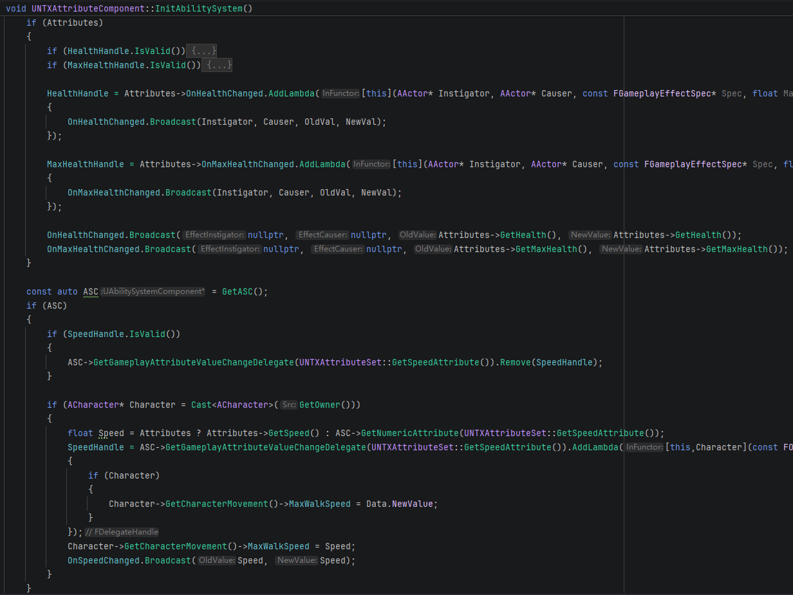

初始化时机 :
```cpp
UFUNCTION(BlueprintImplementableEvent)
void PlayerState_Rep(APlayerState* NewPlayerState);

void ANTXCharacter::OnRep_PlayerState()
{
	Super::OnRep_PlayerState();
	PlayerState_Rep(GetPlayerState());
}
```

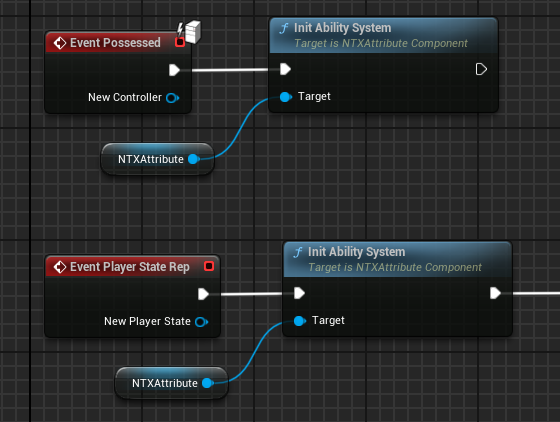


UMG 绑定 :

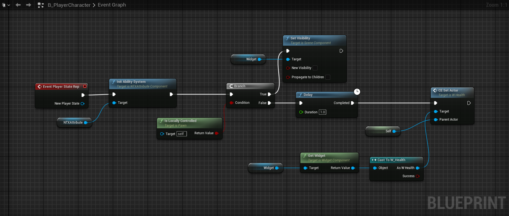

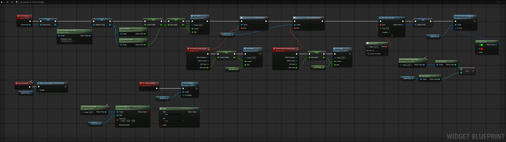

---


### 击杀信息

当发生击杀时，被击杀方的ASC会因为血量小于等于0 而广播死亡事件，<br>
在这个事件中 通过 `GameState` 把死亡消息发送给所有客户端，<br>
例如调用 `MyGameState::CE_MulticastKillInfo`，这个函数的 `Replicates` 是 `Multicast`.

`CE_MulticastKillInfo` 再把消息广播一次，让客户端/服务器的各个系统知道这个击杀消息.

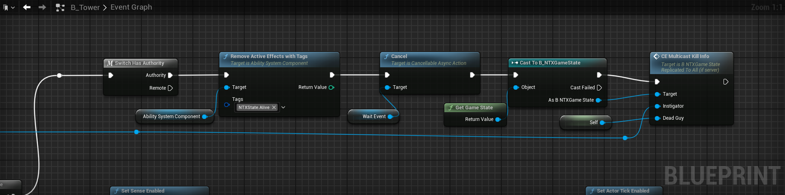

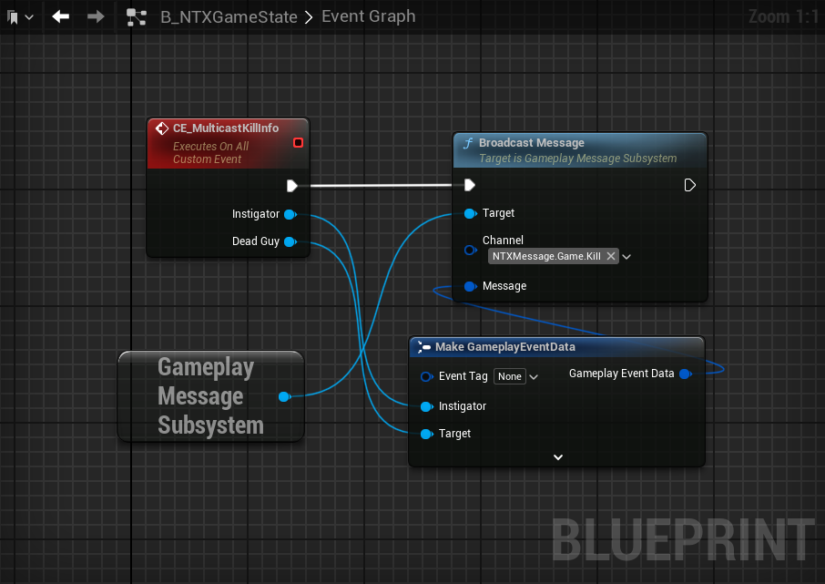

---

## 英雄技能

### Gideon の 大招 

也许可以使用 `LaunchCharacter` 给角色一个速度来实现.<br>
通过一个频繁执行的定时器 不断给敌人添加向中心的力，模拟黑洞的引力.

---

#### 扩展TargetData

RootMotionSouce

本来想通过获取范围内的敌人，给它们逐个应用 `RootMotionSouce` 实现黑洞吸附，<br>
但是 `AbilityTask_ApplyRootMotion` 只保存了角色自身的移动组件，<br>
如果不使用自带的，创建一个新的 `Task` 来实现这个功能也比较麻烦， 自带的 `Task`已经做好了网络相关的工作，<br>
所以 为什么不换一个视角，直接用自带的`Task` 做一个被动技能？


`UAbilityTask_ApplyRootMotion` 这些Task需要一堆参数，所以 把这些参数打包到 `FGameplayEventData`，使用 `SendGameplayEventToActor` 来触发技能.

但是，这里又会有一个问题， <br>
1.把参数塞进Event. <br>
2.服务器 --> 客户端 传输数据，这些参数需要通过网络传输过去，<br>

```cpp
static void SendGameplayEventToActor(AActor* Actor, FGameplayTag EventTag, FGameplayEventData Payload);
```

这个函数的Payload是 `FGameplayEventData`，它有一个多态成员 :
```cpp
/** The polymorphic target information for the event */
UPROPERTY(EditAnywhere, BlueprintReadWrite, Category = GameplayAbilityTriggerPayload)
FGameplayAbilityTargetDataHandle TargetData;

/**
*	FGameplayAbilityTargetDataHandle
*    主要用途如下：
*		- 避免在蓝图中复制整个目标数据结构
*		- 使目标数据结构支持多态
*		- 实现 NetSerialize，并在客户端/服务器之间按值复制
*
*		- 避免使用 UObject 虽然可以在蓝图中实现多态和按引用传递，但在复制时会遇到问题 :
*		- 按值复制
*		- 在蓝图中按引用传递
*		- TargetData 结构支持多态
*/
USTRUCT(BlueprintType)
struct GAMEPLAYABILITIES_API FGameplayAbilityTargetDataHandle
{
    /** Raw storage of target data, do not modify this directly */
	TArray<TSharedPtr<FGameplayAbilityTargetData>, TInlineAllocator<1> >	Data;
}
```

使用指针保存 `Data` 就有了修改其具体类型的机会，继承自 `FGameplayAbilityTargetData` 创建一个新的Data，就可以自定义数据内容了.

添加Data :
```cpp
template<typename T>
static void AddRootMotionTargetData(FGameplayAbilityTargetDataHandle& Handle, const T& NewTargetData, const bool bClearOld)
{
	static_assert(TIsDerivedFrom<T, FGameplayAbilityTargetData>::Value, "T must derive from FGameplayAbilityTargetData");
	if (bClearOld)
	{
		Handle.Clear();
	}
	T* Data = new T(NewTargetData);
	Handle.Add(Data);
}

void UNTXAbilitySystemStatics::AddRootMotionConstantTargetData(FGameplayAbilityTargetDataHandle& Handle,FNTXRootMotionConstantTargetData NewTargetData,bool bClearOld)
{
	AddRootMotionTargetData(Handle,NewTargetData,bClearOld);
}

void UNTXAbilitySystemStatics::AddRootMotionJumpTargetData(FGameplayAbilityTargetDataHandle& Handle,FNTXRootMotionJumpTargetData NewTargetData,bool bClearOld)
{
	AddRootMotionTargetData(Handle,NewTargetData,bClearOld);
}

void UNTXAbilitySystemStatics::AddRootMotionRadialTargetData(FGameplayAbilityTargetDataHandle& Handle,FNTXRootMotionRadialTargetData NewTargetData,bool bClearOld)
{
	AddRootMotionTargetData(Handle,NewTargetData,bClearOld);
}
```

获取Data :
```cpp
const FGameplayAbilityTargetData* TargetData = TriggerEventData->TargetData.Get(0);

const FNTXRootMotionRadialTargetData* Data = static_cast<const FNTXRootMotionRadialTargetData*>(TargetData);
const FNTXRootMotionJumpTargetData* Data = static_cast<const FNTXRootMotionJumpTargetData*>(TargetData);
const FNTXRootMotionConstantTargetData* Data = static_cast<const FNTXRootMotionConstantTargetData*>(TargetData);
```

或

```cpp
template<typename TargetDataType>
static const TargetDataType* GetTypedTargetDataFromHandle(const FGameplayAbilityTargetDataHandle& Handle, int32 Index)
{
	static_assert(TIsDerivedFrom<TargetDataType, FGameplayAbilityTargetData>::IsDerived,"TargetDataType must derive from FGameplayAbilityTargetData");

	const FGameplayAbilityTargetData* Data = Handle.Get(Index);
	if (Data && Data->GetScriptStruct() == TargetDataType::StaticStruct())
	{
		return static_cast<const TargetDataType*>(Data);
	}

	UE_LOG(LogTemp, Fatal, TEXT("GetTypedTargetData failed: invalid target data. Expected type: %s, Got: %s"),
	*TargetDataType::StaticStruct()->GetName(),Data ? *Data->GetScriptStruct()->GetName() : TEXT("nullptr"));
	
	return nullptr;
}
```

这样做的话 要保证传过来的一定是 static_cast 转换的类型，如何保证 ?

```cpp
UNTXGameplayAbility_RootMotionSouce::UNTXGameplayAbility_RootMotionSouce()
{
	FAbilityTriggerData TriggerData;
	TriggerData.TriggerTag = RootMotionSourceTag;
	AbilityTriggers.Add(TriggerData);
}

void UNTXGameplayAbility_RootMotionSouce::ActivateAbility(const FGameplayAbilitySpecHandle Handle,
	const FGameplayAbilityActorInfo* ActorInfo, const FGameplayAbilityActivationInfo ActivationInfo,
	const FGameplayEventData* TriggerEventData)
{
    const FGameplayAbilityTargetData* TargetData = TriggerEventData->TargetData.Get(0);
    if (TargetData == nullptr)
	{
        K2_EndAbility();
		return;
	}

    if (TriggerEventData->EventTag == ConstantForceTag)
	{
		ActiveTask = ApplyRootMotion<ConstantForce>(TargetData);
	}
	else if (TriggerEventData->EventTag == RadialForceTag)
	{
		ActiveTask = ApplyRootMotion<RadialForce>(TargetData);
	}
	else if (TriggerEventData->EventTag == JumpForceTag)
	{
		ActiveTask = ApplyRootMotion<JumpForce>(TargetData);
	}
}
```

GA只能由`RootMotionSourceTag`来触发，`SendGameplayEventToActor` 的 `EventTag` 指定为`RootMotionSourceTag` 的子Tag，<br>
之后 这个Event就会传到 `UNTXGameplayAbility_RootMotionSouce` ， 那么 `Data` 一定就是指定的类型.

还要定义网络复制所需的内容 :

```cpp
USTRUCT(BlueprintType)
struct NTX_API FNTXRootMotionRadialTargetData : public FGameplayAbilityTargetData
{
	GENERATED_BODY()

    virtual UScriptStruct* GetScriptStruct() const override { return FNTXRootMotionRadialTargetData::StaticStruct(); }
	bool NetSerialize(FArchive& Ar, UPackageMap* Map, bool& bOutSuccess);
}

template<>
struct TStructOpsTypeTraits<FNTXRootMotionRadialTargetData> : public TStructOpsTypeTraitsBase2<FNTXRootMotionRadialTargetData>
{
	enum
	{
		WithNetSerializer = true,
	};
};
```

---

### 普通攻击 の 技能模板

#### TargetingSystem

预设配置 :<br>

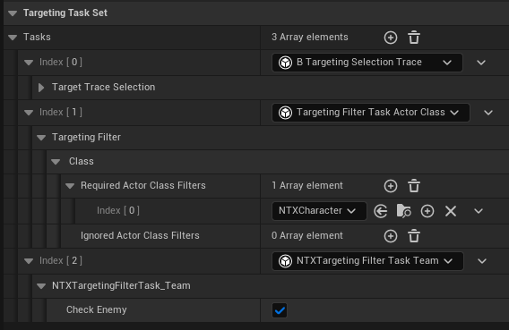

在GA中使用时 设置 `SourceActor` 和 `SourceObject`.<br>
将 `SourceObject` 设为GA 是为了在后续过程中获取GA的攻击范围.

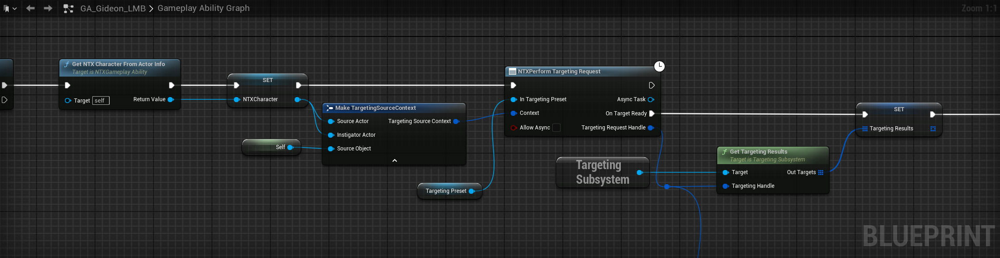

`B_TargetingSelection_Trace` :

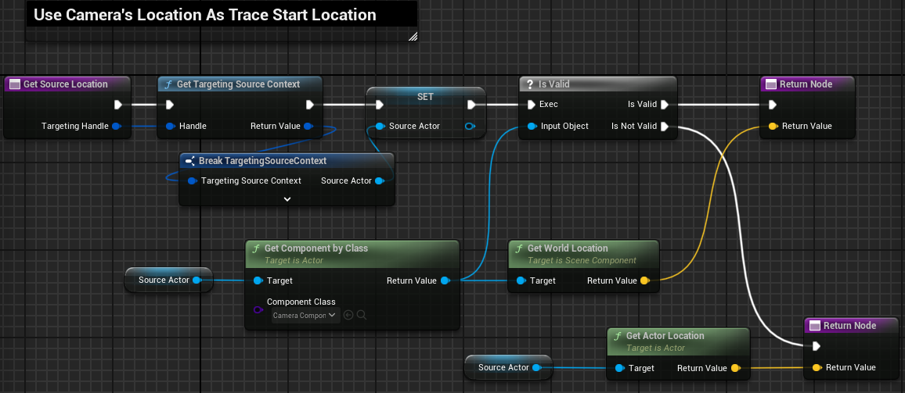

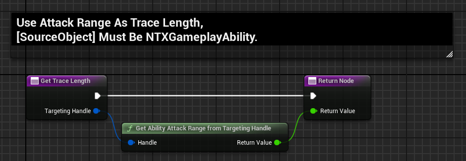

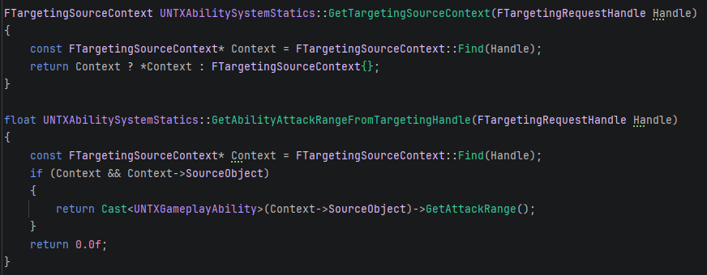

`TargetingFilterTask_Team` : 返回true 无视对象，返回false 保留对象.

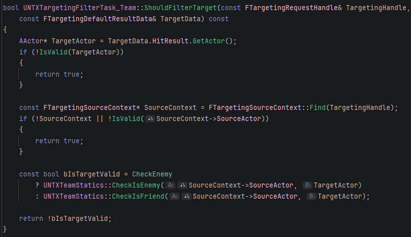


原本的 `PerformTargetingRequestTask` 并没有把 `SourceObject`等数据存入`SourceContext`，<br>
只保存了 `SourceActor`，所以需要新建一个Task.

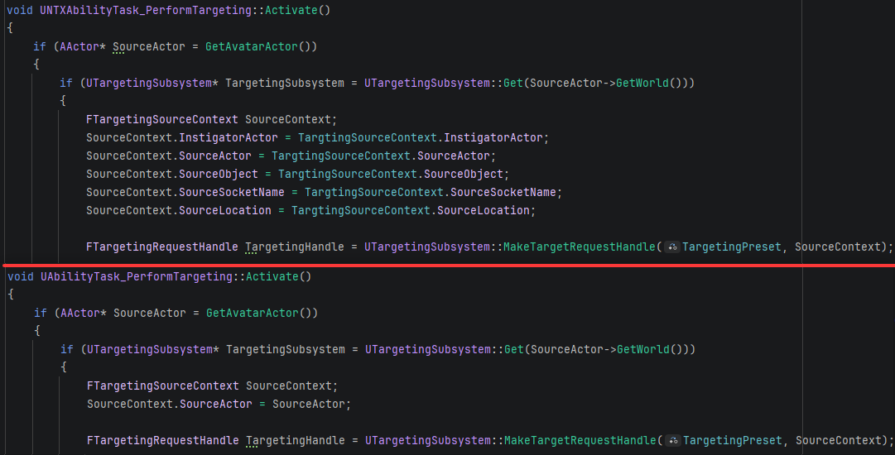

---

#### 重复利用Actor

每次普通攻击都要生成一个子弹，这样会导致频繁调用SpawnActor，<br>
所以 不销毁生成过的子弹，等到下次普通攻击时 激活上一次生成的子弹.

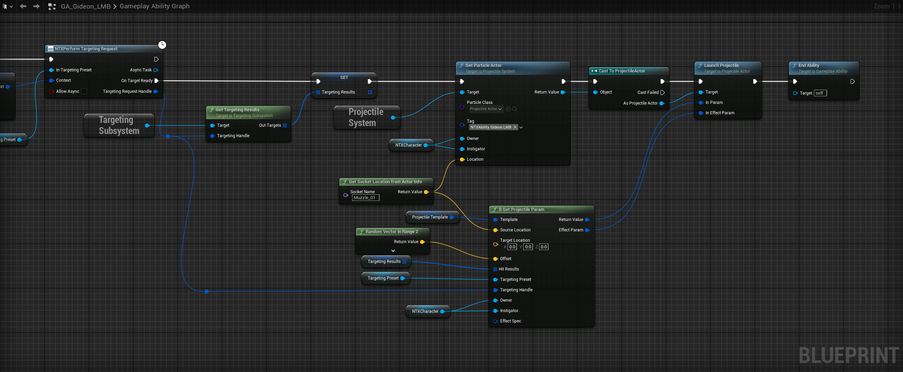

必要的参数 :

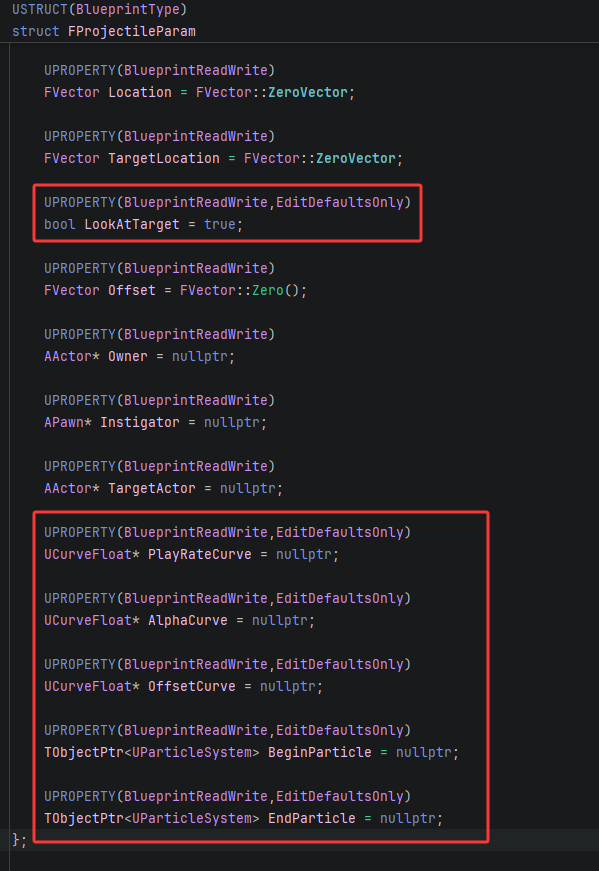

这些参数里面 有一些是可以提前写好的 例如 `AlphaCurve` `BeginParticle`，<br>
有一些是需要运行时动态设置的 例如`TargetActor`.

对于可提前编辑的那些参数，存放在 `ProjectileTemplate` 里面 ，<br>
使用 `GetProjectileParam` 把 `ProjectileTemplate` 拷贝构造到一个新的Param中 :

```cpp
FProjectileParam UProjectileSystem::GetProjectileParam(const FProjectileParam Template, const FVector Location,
	const FVector TargetLocation, const FVector Offset,AActor* Owner, APawn* Instigator, AActor* TargetActor)
{
	FProjectileParam Param = Template;
	Param.Location = Location;
	Param.TargetLocation = TargetLocation;
	Param.Offset = Offset;
	Param.Owner = Owner;
	Param.Instigator = Instigator;
	Param.TargetActor = TargetActor;
	return Param;
}
```

GA图中的函数 :

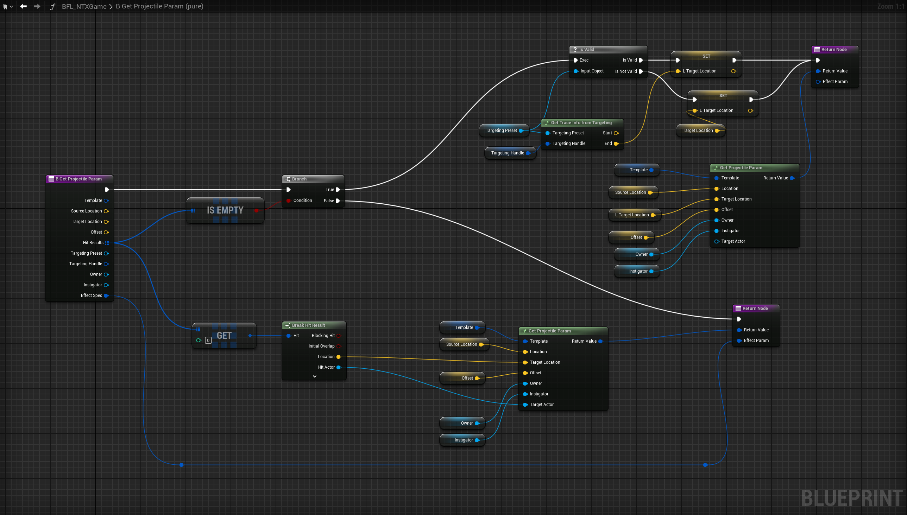

如果`TargetingSystem`判定没有击中任何目标，`HitResult`是Empty的，此时 需要用射线检测的终点位置 作为普攻子弹的攻击终点.<br>
这个函数的最后一个参数是 `EffectSpec` ，需要传入一个动态生成的GE，最后再把这个GE返回出来，这是何意味？<br>

如果击中了一个有效目标，那么就把这个GE原样返回，如果没有击中任何目标 返回一个空的GE.<br>
所以 这个函数起一个裁决GE的作用.

---

重复利用Actor : 通过 `Tag` 寻找对应的Actor.

```cpp
UFUNCTION(BlueprintCallable,meta = (DeterminesOutputType = "ParticleClass"))
AParticleActorBase* UProjectileSystem::GetParticleActor(TSubclassOf<AParticleActorBase> ParticleClass, FGameplayTag Tag, AActor* Owner, APawn* Instigator, FVector Location)
{
	for (AParticleActorBase* ParticleActorBase : ParticleActors)
	{
		if (ParticleActorBase->Tag == Tag && ParticleActorBase->IsReadyToUse())
		{
			ParticleActorBase->SetOwner(Owner);
			ParticleActorBase->SetInstigator(Instigator);
			ParticleActorBase->SetActorLocation(Location);
			ParticleActorBase->SetReadyToUse(false);
			return ParticleActorBase;
		}
	}
	
	UWorld* World = GetWorld();
	FTransform SpawnTransform;
	SpawnTransform.SetLocation(Location);
	
	FActorSpawnParameters SpawnParameters;
	SpawnParameters.Owner = Owner;
	SpawnParameters.Instigator = Instigator;
	AParticleActorBase* SpawnedActor = World->SpawnActor<AParticleActorBase>(ParticleClass, SpawnTransform,SpawnParameters);

	SpawnedActor->Tag = Tag;
	ParticleActors.Add(SpawnedActor);
	return SpawnedActor;
}
```

`DeterminesOutputType` 自动cast返回的类型，不用在蓝图里面手动cast.

`AParticleActorBase` :
```cpp
UFUNCTION(BlueprintCallable)
void AParticleActorBase::SetReadyToUse(bool bReadyToUse)
{
	bIsReadyToUse = bReadyToUse;
}

virtual bool AParticleActorBase::IsReadyToUse() const 
{
	return bIsReadyToUse;
}
```

---

#### 创建技能冷却GE的模板

应用一个冷却的GE，需要定义冷却Tag、持续时间，<br>
如果每个技能都创建一个对应的冷却GE，那么最后会得到一大堆冷却GE.

所以 应该考虑创建一个GE模板，动态修改GESpec的Tag和持续时间.

由于 `K2_CommitAbilityCooldown` 没有提供GESpec的参数，就只能从C++下手了.

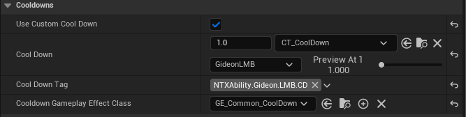

把冷却时间放在GA里面配置，GA从`CoolDown`里面获取冷却时长，然后通过 `SetSetByCallerMagnitude` 设置给GESpec.<br>
冷却Tag不再由 `TargetTagsGameplayEffectComponent` 定义，而是通过 GESpec的`DynamicGrantedTags`.

需要的变量 :
```cpp
UPROPERTY(/*..*/)
bool bUseCommonCoolDown;
	
UPROPERTY(/*..*/)
FScalableFloat CoolDown;
	
UPROPERTY(/*..*/)
FGameplayTag CoolDownTag;
	
UFUNCTION(/*..*/)
float GetCoolDown() const;

mutable FGameplayTagContainer CachedCooldownTagContainer;
```
重写的 virtual 函数 :<br>
`ApplyCooldown` 使用 `NTXGameplayTags::CoolDown` 标签 设置Duration时长.<br>
`GetCooldownTags` 根据情况返回冷却Tag.
```cpp
float UNTXGameplayAbility::GetCoolDown() const
{
	return CoolDown.GetValueAtLevel(GetAbilityLevel());
}

void UNTXGameplayAbility::ApplyCooldown(const FGameplayAbilitySpecHandle Handle,const FGameplayAbilityActorInfo* ActorInfo, const FGameplayAbilityActivationInfo ActivationInfo) const
{
	if (bUseCommonCoolDown)
	{
		if (const UGameplayEffect* CooldownGE = GetCooldownGameplayEffect())
		{
			const TSubclassOf<UGameplayEffect> GESubclass(CooldownGE->GetClass());

			FGameplayEffectSpecHandle SpecHandle = MakeOutgoingGameplayEffectSpec(CurrentSpecHandle, CurrentActorInfo, 
			CurrentActivationInfo, GESubclass, GetAbilityLevel());

			SpecHandle.Data->SetSetByCallerMagnitude(NTXGameplayTags::CoolDown, GetCoolDown());
			SpecHandle.Data->DynamicGrantedTags.AddTag(CoolDownTag);
			
			ApplyGameplayEffectSpecToOwner(Handle, ActorInfo, ActivationInfo, SpecHandle);
		}
	}
	else
	{
		Super::ApplyCooldown(Handle, ActorInfo, ActivationInfo);
	}
}

const FGameplayTagContainer* UNTXGameplayAbility::GetCooldownTags() const
{
	if (bUseCommonCoolDown)
	{
		if (CachedCooldownTagContainer.IsEmpty())
		{
			CachedCooldownTagContainer.AddTag(CoolDownTag);
		}
		
		return &CachedCooldownTagContainer;
	}
	else
	{
		return Super::GetCooldownTags();
	}
}
```

`GetCooldownTags` 需要返回一个指针，所以创建了 `CachedCooldownTagContainer` 变量，避免对局部变量取地址.

---


#### 监听技能冷却

两个思路，<br>
1.监听GA的Commit事件 : 
```cpp
bool UGameplayAbility::K2_CommitAbilityCooldown(bool BroadcastCommitEvent, bool ForceCooldown)
{
	check(CurrentActorInfo);
	if (BroadcastCommitEvent)
	{
		UAbilitySystemComponent* const AbilitySystemComponent = GetAbilitySystemComponentFromActorInfo_Checked();
		AbilitySystemComponent->NotifyAbilityCommit(this);
	}
	return CommitAbilityCooldown(CurrentSpecHandle, CurrentActorInfo, CurrentActivationInfo, ForceCooldown);
}

UFUNCTION(BlueprintCallable, Category = Ability)
float UGameplayAbility::GetCooldownTimeRemaining() const
{
	return IsInstantiated() ? GetCooldownTimeRemaining(CurrentActorInfo) : 0.f;
}
```
通过 `NotifyAbilityCommit` 得到Ability，然后调用GA的 `GetCooldownTimeRemaining`.

`K2_CommitAbilityCooldown` 先广播技能，再应用冷却GE，<br>
由于时序关系，导致在监听广播时 不能获得冷却时长.

不过还好 `K2_CommitAbilityCooldown` 是virtual函数，可以重写，只要颠倒一下顺序就可以了.<br>
例如 :
```cpp
bool UGameplayAbility::K2_CommitAbilityCooldown(bool BroadcastCommitEvent, bool ForceCooldown)
{
	check(CurrentActorInfo);
	
	bool Result = CommitAbilityCooldown(CurrentSpecHandle, CurrentActorInfo, CurrentActivationInfo, ForceCooldown);

	if (BroadcastCommitEvent)
	{
		UAbilitySystemComponent* const AbilitySystemComponent = GetAbilitySystemComponentFromActorInfo_Checked();
		AbilitySystemComponent->NotifyAbilityCommit(this);
	}

	return Result;
}
```
但是这样做的话，原生的 `UGameplayAbility` 就不支持监听了，只有重写了`K2_CommitAbilityCooldown`的子类才能监听技能冷却.


2.第二个思路是 监听GE的Apply事件 : `ASC->OnGameplayEffectAppliedDelegateToSelf` . <br>
既然 冷却GE的应用 慢了一步，那么直接监听GE好了，不再管具体是哪个GA.

GA配置好冷却Tag，冷却GE配置一个专属的AssetTag.<br>
之后，通过这两个Tag 就可以锁定到具体的GE，只要获取这个GE的Duration 就可以得到冷却时长.

总之就是 先筛选出冷却GE，再根据冷却Tag 进一步筛选.<br>

GA的CD配置 :

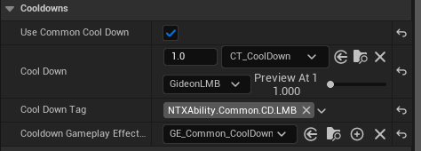

冷却GE的配置 :

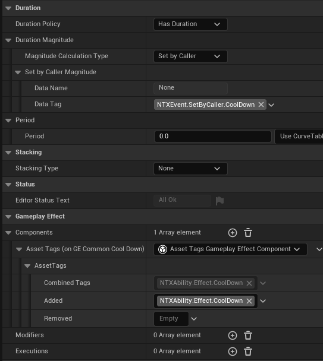

监听冷却GE :

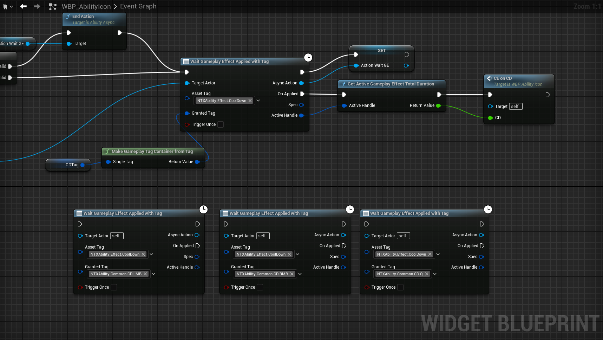

关键代码 :
```cpp
void UNTXAbilityAsync_WaitGameplayEffectApplied::Activate()
{
	if (auto ASC = GetAbilitySystemComponent())
	{
		GEAppliedHandle = ASC->OnGameplayEffectAppliedDelegateToSelf.AddUObject(this,&ThisClass::OnGEApplied);
	}
	else
	{
		EndAction();
	}
}

void UNTXAbilityAsync_WaitGameplayEffectApplied::OnGEApplied(UAbilitySystemComponent* ASC,const FGameplayEffectSpec& Spec, FActiveGameplayEffectHandle Handle)
{
	FGameplayTagContainer AssetTagContainer;
	FGameplayTagContainer GrantedTagContainer;
	
	Spec.GetAllAssetTags(AssetTagContainer);
	Spec.GetAllGrantedTags(GrantedTagContainer);
	
	if (AssetTagContainer.HasAll(EffectTag) && GrantedTagContainer.HasAll(GrantedTag))
	{
		OnApplied.Broadcast(Spec,Handle);
		if (bTriggerOnce)
		{
			EndAction();
		}
	}
}
```

---

#### 击中反馈

为了在敌人头上显示伤害数字，需要从Context里面获取 `HitResult`，从而得到敌人的位置.<br>
还需要获取 伤害数值 `RawMagnitude`.

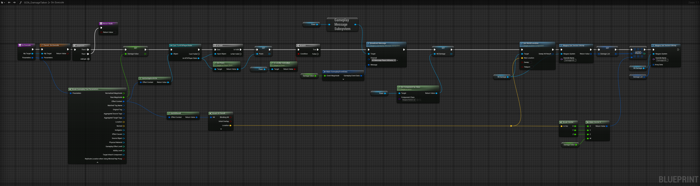

给 `GESpec` 添加 `HitResult` :<br>
这里不用担心 Ref引用， `Handle` 保存了`FGameplayEffectContext`的指针，<br>
即使是值拷贝，也会把指针的地址拷贝过去，最终 `AddHitResult` 操作的是同一个 `Context`.

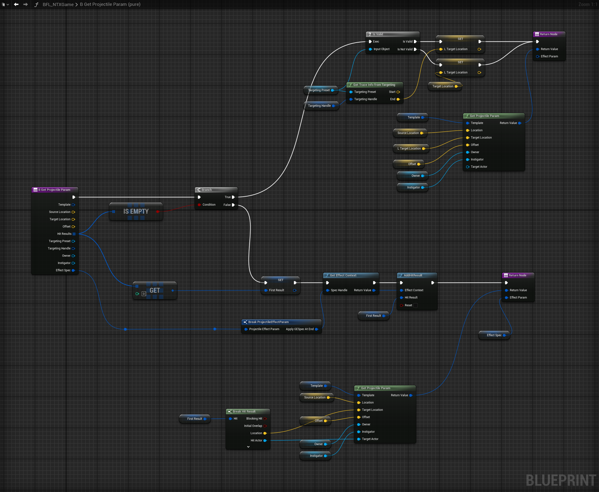

获取伤害数值 :

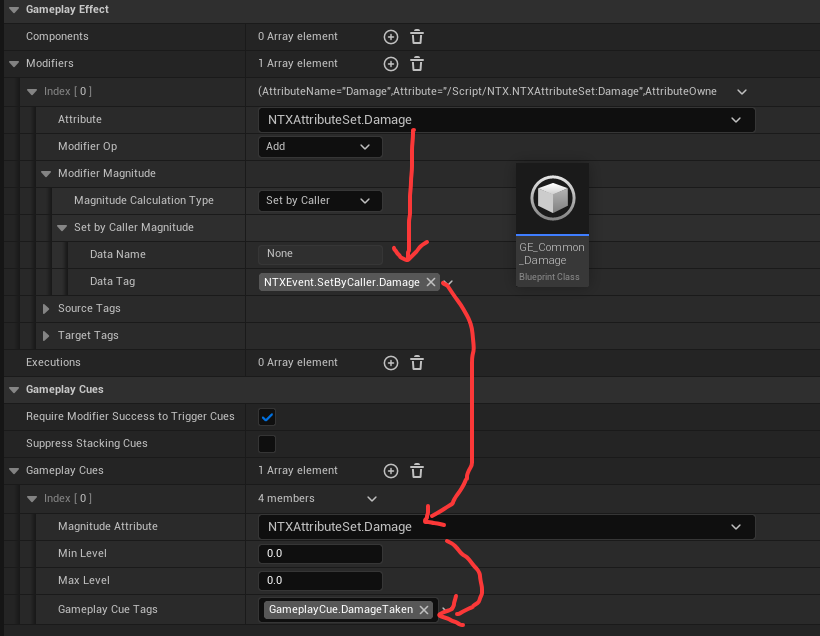

来源 : 在调用Cue时，从 `GESpec` 里面获取对应的 `Modifier` 的数值.<br>
数值结果 保存在 `CueParameter` 的 `RawMagnitude`.
```cpp
void UAbilitySystemComponent::InvokeGameplayCueEvent(const FGameplayEffectSpecForRPC &Spec, 
	EGameplayCueEvent::Type EventType)
{
	for (FGameplayEffectCue CueInfo : Spec.Def->GameplayCues)
	{
		if (CueInfo.MagnitudeAttribute.IsValid())
		{
			if (const auto ModifiedAttribute = Spec.GetModifiedAttribute(CueInfo.MagnitudeAttribute))
			{
				CueParameters.RawMagnitude = ModifiedAttribute->TotalMagnitude;
			}
			else
			{
				CueParameters.RawMagnitude = 0.0f;
			}
		}
		else
		{
			CueParameters.RawMagnitude = 0.0f;
		}
	}
}
```

---

#### 准星

在瞄准敌人 且 敌人在普通攻击范围内时，让准星变红 表示可以攻击敌人.

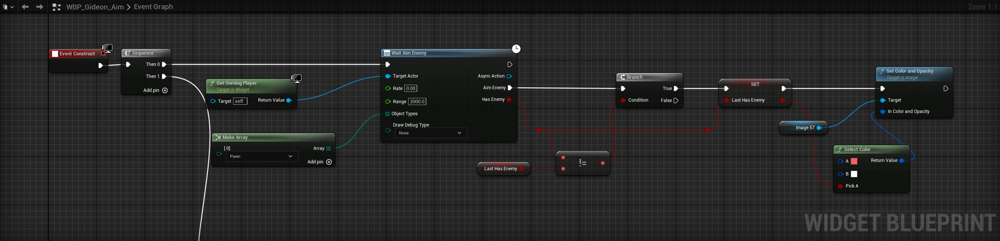

在Task里面做射线检测，判断是否命中Actor，如果这个Actor是敌人的话，返回true.

```cpp
void UNTXAsync_CheckAimEnemy::PerformTrace()
{
	FVector ViewStart;
	FRotator ViewRot;
	PC->GetPlayerViewPoint(ViewStart, ViewRot);

	const FVector ViewDir = ViewRot.Vector();
	FVector ViewEnd = ViewStart + (ViewDir * Range);
	
	FCollisionObjectQueryParams Params;
	TArray<AActor*> IgnoreActors;
	IgnoreActors.Add(PC->GetPawn());
	FHitResult HitResult;
	UKismetSystemLibrary::LineTraceSingleForObjects(PC.Get(),ViewStart,ViewEnd,ObjectTypes,false,IgnoreActors,DebugType,HitResult,false);
	
	if (AActor* Actor = HitResult.GetActor())
	{
		if (UNTXTeamStatics::CheckIsEnemy(Actor,PC.Get()))
		{
			AimEnemy.Broadcast(true);
			AimActor = Actor;
		}
	}
	else
	{
		AimEnemy.Broadcast(false);
	}
}

```

---

